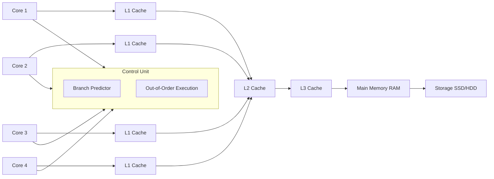
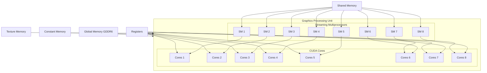
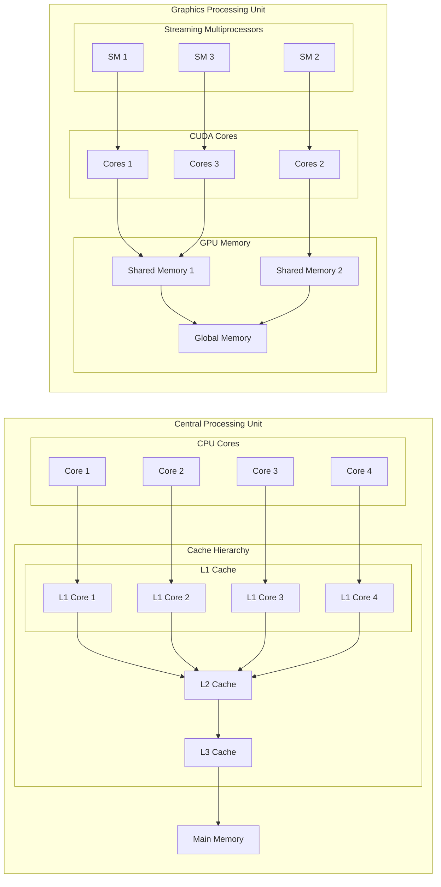
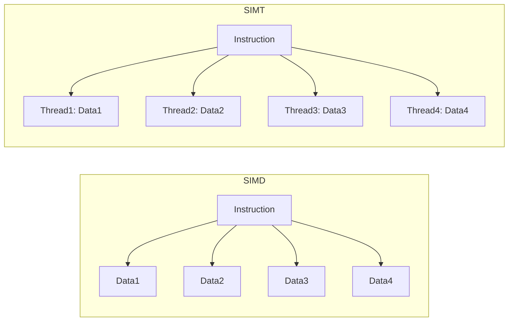
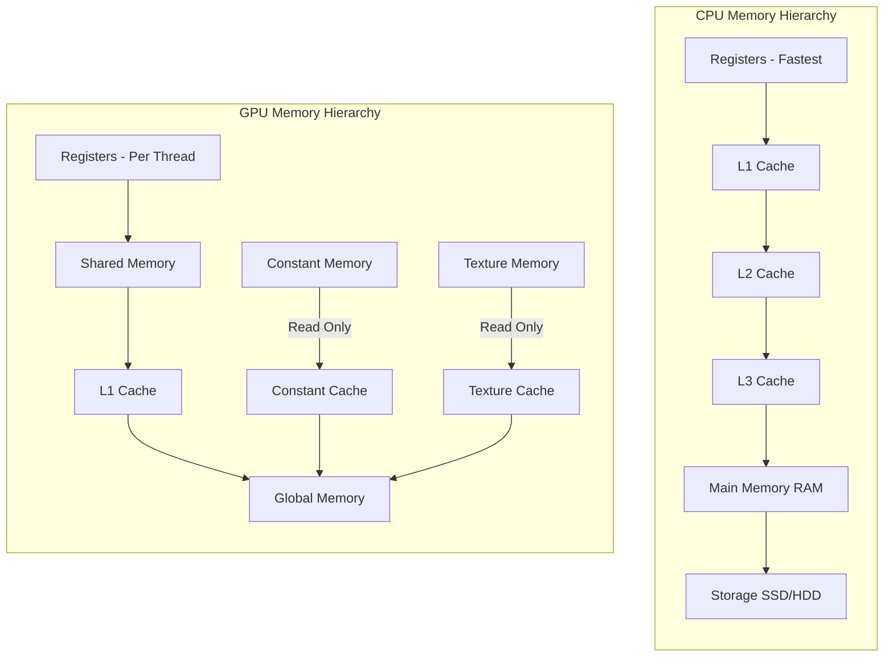

# Day 03: GPU vs. CPU Architecture Foundations

## Table of Contents
1. [Overview](#1-overview)  
2. [CPU Architecture Fundamentals](#2-cpu-architecture-fundamentals)  
3. [GPU Architecture Fundamentals](#3-gpu-architecture-fundamentals)  
4. [Key Differences Between CPU and GPU Architectures](#4-key-differences-between-cpu-and-gpu-architectures)  
5. [Execution Models: SIMD vs. SIMT](#5-execution-models-simd-vs-simt)  
6. [Memory Hierarchy Comparison](#6-memory-hierarchy-comparison)  
7. [Implications for CUDA Programming](#7-implications-for-cuda-programming)  
8. [Practical Exercise: Analyzing CPU and GPU Performance](#8-practical-exercise-analyzing-cpu-and-gpu-performance)  
9. [Common Pitfalls](#9-common-pitfalls)  
10. [References & Further Reading](#10-references--further-reading)  
11. [Conclusion](#11-conclusion)  
12. [Next Steps](#12-next-steps)  

---

## 1. Overview
Understanding the foundational differences between **CPU (Central Processing Unit)** and **GPU (Graphics Processing Unit)** architectures is crucial for effective CUDA programming. While both are processors, they are optimized for distinct types of tasks. Today, we'll delve into the core architectural elements that differentiate CPUs and GPUs, explore their execution models, and discuss how these differences influence parallel programming with CUDA.

---

## 2. CPU Architecture Fundamentals

### a) **Core Components**
- **Cores**: Modern CPUs range from 2 to 64 cores, optimized for high single-threaded performance.
- **Cache Hierarchy**:
  - **L1 Cache**: Fastest and smallest (16-64 KB per core), directly connected to each core.
  - **L2 Cache**: Larger and slightly slower (256-512 KB per core), serving as a bridge between L1 and L3.
  - **L3 Cache**: Shared among all cores (several MB), providing a larger pool of cached data.
- **Branch Prediction & Out-of-Order Execution**: Enhances performance by predicting future instructions and executing instructions out of order to optimize pipeline usage.
- **Instruction Pipelines**: CPUs execute instructions through highly optimized pipelines, allowing for complex instruction sets and rapid context switching.

### b) **Strengths**
- **Low Latency**: Optimized for tasks requiring quick response times.
- **Complex Control Flow**: Handles branching and diverse instruction sets efficiently.
- **Single-Threaded Performance**: Excels at tasks that cannot be easily parallelized.

### c) **Conceptual Diagram: CPU Architecture**


---

## 3. GPU Architecture Fundamentals

### a) **Core Components**
- **Streaming Multiprocessors (SMs)**: Comprise hundreds to thousands of lightweight cores designed for parallel tasks.
- **CUDA Cores**: The fundamental processing units within SMs, optimized for executing simple, repetitive tasks concurrently.
- **Memory Hierarchy**:
  - **Global Memory**: Large but high-latency memory accessible by all threads.
  - **Shared Memory**: Fast, on-chip memory shared among threads within a block.
  - **Registers**: Per-thread storage for quick access to variables.
  - **Constant & Texture Memory**: Specialized read-only memory for specific access patterns.
- **Warp Scheduling**: Groups of 32 threads (a warp) are scheduled together to execute the same instruction simultaneously.

### b) **Strengths**
- **High Throughput**: Capable of executing thousands of threads concurrently.
- **Data Parallelism**: Ideal for tasks that can be broken down into identical operations on large datasets.
- **Memory Bandwidth**: High memory bandwidth allows rapid data movement, essential for data-intensive applications.

### c) **Conceptual Diagram: GPU Architecture**


---

## 4. Key Differences Between CPU and GPU Architectures

| Feature                   | CPU                                               | GPU                                               |
|---------------------------|---------------------------------------------------|---------------------------------------------------|
| **Core Count**            | 2-64 cores optimized for single-threaded tasks    | Hundreds to thousands of cores for parallel tasks |
| **Clock Speed**           | Higher (3-5 GHz)                                   | Lower (1-2 GHz)                                    |
| **Cache Size**            | Larger per-core caches                             | Smaller caches, shared across many cores          |
| **Execution Model**       | Few threads with complex control flow             | Massive parallelism with simple thread logic       |
| **Memory Hierarchy**      | Deep cache hierarchy with low latency              | Hierarchical memory with emphasis on bandwidth     |
| **Instruction Set**       | Complex, diverse instructions                      | Simpler, more uniform instructions                 |
| **Power Consumption**     | Higher per core                                    | Optimized for throughput per watt                  |
| **Task Suitability**      | Suitable for sequential and low-parallelism tasks | Ideal for data-parallel and high-throughput tasks  |

### a) **Detailed Comparison**

- **Core Count & Design**:
  - **CPU**: Designed to handle a wide variety of tasks with a focus on single-threaded performance and complex operations.
  - **GPU**: Designed specifically for parallel tasks, with many more cores that are simpler and optimized for executing the same operation across multiple data points simultaneously.

- **Clock Speed**:
  - **CPU**: Higher clock speeds allow for faster single-threaded performance.
  - **GPU**: Lower clock speeds are compensated by the massive number of cores, enabling high throughput.

- **Cache Hierarchy**:
  - **CPU**: Extensive cache hierarchy reduces latency for frequently accessed data.
  - **GPU**: Limited cache per core; relies more on shared memory and memory coalescing to manage data efficiently.

- **Execution Models**:
  - **CPU**: Optimized for complex control flows and low-latency tasks.
  - **GPU**: Optimized for high-throughput parallel processing.

### b) **Visual Comparison: CPU vs. GPU**


*Figure 3: High-level comparison of CPU and GPU architectures.*

---

## 5. Execution Models: SIMD vs. SIMT

### a) **SIMD (Single Instruction, Multiple Data)**
- **Used By**: CPUs with vector instructions (e.g., SSE, AVX).
- **Concept**: Executes the same instruction on multiple data points simultaneously.
- **Limitations**: Limited parallelism; often requires data to be contiguous and operations to be uniform.

### b) **SIMT (Single Instruction, Multiple Threads)**
- **Used By**: GPUs (CUDA model).
- **Concept**: Executes the same instruction across multiple threads, each operating on its own data.
- **Advantages**:
  - **Flexibility**: Threads can have their own control flow, allowing for more complex parallelism.
  - **Scalability**: Efficiently manages thousands of threads with minimal overhead.

### **Diagram: SIMD vs. SIMT**


*Figure 4: Comparison between SIMD and SIMT execution models.*

### c) **Comparison**

| Feature         | SIMD                                           | SIMT                                             |
|-----------------|------------------------------------------------|--------------------------------------------------|
| **Granularity** | Operates on vectors of data simultaneously     | Operates on individual threads executing in parallel |
| **Flexibility** | Limited to operations on homogeneous data      | Supports divergent control flow within warps       |
| **Scalability** | Limited by vector length (e.g., 8, 16 elements) | Scales to thousands of threads with minimal overhead |

---

## 6. Memory Hierarchy Comparison

### a) **CPU Memory Hierarchy**
- **Registers**: Fastest, per-core storage for immediate data.
- **L1 Cache**: Very fast, per-core cache for frequently accessed data.
- **L2 Cache**: Slightly slower, larger cache shared between a few cores.
- **L3 Cache**: Slower, shared across all cores, serving as a last-level cache before main memory.
- **Main Memory (RAM)**: Large, high-latency memory for general-purpose data storage.
- **Storage (SSD/HDD)**: Very large, highest latency storage for persistent data.

### b) **GPU Memory Hierarchy**
- **Registers**: Fastest, per-thread storage for immediate data.
- **Shared Memory**: Fast, on-chip memory shared among threads within a block, used for cooperative data sharing.
- **L1 Cache**: Combined with shared memory; configurable to allocate more to shared or cache memory.
- **Global Memory**: Large, high-latency memory accessible by all threads, similar to main memory in CPUs.
- **Constant & Texture Memory**: Read-only memory optimized for specific access patterns, benefiting from caching mechanisms.

### **Diagram: CPU vs. GPU Memory Hierarchy**


*Figure 5: Memory hierarchy comparison between CPU and GPU.*

### c) **Performance Implications**
- **Latency**:
  - **CPU**: Lower latency caches (L1, L2) enhance single-threaded performance.
  - **GPU**: Higher latency global memory necessitates efficient use of shared memory and coalesced accesses.
- **Bandwidth**:
  - **CPU**: High bandwidth between caches and main memory, but limited by fewer cores.
  - **GPU**: Extremely high memory bandwidth supports massive parallel data processing.

---

## 7. Implications for CUDA Programming

### a) **Optimizing Memory Access**
- **Coalesced Access**: Ensure threads within a warp access contiguous memory locations to maximize memory bandwidth.
  - **Example**:
    ```cpp
    __global__ void coalescedAccess(float *A, float *B, float *C, int N) {
        int idx = blockIdx.x * blockDim.x + threadIdx.x;
        if(idx < N) {
            C[idx] = A[idx] + B[idx];
        }
    }
    ```
- **Shared Memory Utilization**: Use shared memory to cache frequently accessed data and reduce global memory accesses.
  - **Example**:
    ```cpp
    __global__ void sharedMemoryExample(float *A, float *B, float *C, int N) {
        extern __shared__ float sharedData[];
        int idx = blockIdx.x * blockDim.x + threadIdx.x;
        
        if(idx < N) {
            sharedData[threadIdx.x] = A[idx];
            __syncthreads();
            C[idx] = sharedData[threadIdx.x] + B[idx];
        }
    }
    ```
- **Minimize Memory Latency**: Organize data to fit into caches and shared memory to reduce access times.

### b) **Maximizing Parallelism**
- **Occupancy**: Strive for high occupancy (number of active warps per SM) to hide memory latency and maximize resource utilization.
  - **Example**: Adjust block size to ensure enough warps are active.
- **Thread Divergence**: Minimize divergence within warps to ensure all threads execute the same instruction simultaneously.
  - **Example**: Avoid excessive branching inside kernels.

### c) **Choosing the Right Execution Model**
- **SIMT Benefits**: Leverage SIMT by designing kernels that execute uniform operations across large datasets.
- **Control Flow Management**: Be cautious with conditional statements that can cause divergence, impacting performance.
  - **Example**:
    ```cpp
    __global__ void simtExample(float *A, float *B, float *C, int N) {
        int idx = blockIdx.x * blockDim.x + threadIdx.x;
        if(idx < N) {
            if(A[idx] > 0) {
                C[idx] = A[idx] + B[idx];
            } else {
                C[idx] = A[idx] - B[idx];
            }
        }
    }
    ```

### d) **Balancing Workload**
- **Load Balancing**: Distribute work evenly across threads and blocks to prevent idle cores.
- **Granularity**: Choose the right level of parallelism—too fine can lead to overhead, too coarse can underutilize resources.

---

## 8. Practical Exercise: Analyzing CPU and GPU Performance

### **Objective**
Understand how CPU and GPU architectures handle the same task differently by implementing and benchmarking a simple parallel operation on both.

### **Task**
Implement a vector addition on both CPU and GPU, then compare their performance.

### **Steps**

1. **Set Up the Project Structure**
    ```
    performance-analysis/
    ├── src/
    │   ├── main_cpu.c
    │   ├── main_gpu.cu
    ├── include/
    ├── Makefile
    └── README.md
    ```

2. **CPU Implementation (`src/main_cpu.c`)**
    ```c
    #include <stdio.h>
    #include <stdlib.h>
    #include <time.h>
    
    void vectorAddCPU(float *A, float *B, float *C, int N) {
        for(int i = 0; i < N; i++) {
            C[i] = A[i] + B[i];
        }
    }
    
    int main() {
        int N = 100000000; // 100 million
        float *A = (float*)malloc(N * sizeof(float));
        float *B = (float*)malloc(N * sizeof(float));
        float *C = (float*)malloc(N * sizeof(float));
    
        // Initialize vectors
        for(int i = 0; i < N; i++) {
            A[i] = 1.0f;
            B[i] = 2.0f;
        }
    
        clock_t start = clock();
        vectorAddCPU(A, B, C, N);
        clock_t end = clock();
    
        printf("CPU Vector Add Time: %lf seconds\n", ((double)(end - start))/CLOCKS_PER_SEC);
    
        free(A);
        free(B);
        free(C);
        return 0;
    }
    ```

3. **GPU Implementation (`src/main_gpu.cu`)**
    ```cpp
    #include <stdio.h>
    #include <cuda_runtime.h>
    #include <ctime>
    
    __global__ void vectorAddGPU(float *A, float *B, float *C, int N) {
        int idx = blockIdx.x * blockDim.x + threadIdx.x;
        if(idx < N) {
            C[idx] = A[idx] + B[idx];
        }
    }
    
    int main() {
        int N = 100000000; // 100 million
        size_t size = N * sizeof(float);
        float *h_A = (float*)malloc(size);
        float *h_B = (float*)malloc(size);
        float *h_C = (float*)malloc(size);
    
        // Initialize vectors
        for(int i = 0; i < N; i++) {
            h_A[i] = 1.0f;
            h_B[i] = 2.0f;
        }
    
        float *d_A, *d_B, *d_C;
        cudaError_t err;
    
        err = cudaMalloc(&d_A, size);
        if (err != cudaSuccess) {
            fprintf(stderr, "Failed to allocate device memory for A: %s\n", cudaGetErrorString(err));
            exit(EXIT_FAILURE);
        }
    
        err = cudaMalloc(&d_B, size);
        if (err != cudaSuccess) {
            fprintf(stderr, "Failed to allocate device memory for B: %s\n", cudaGetErrorString(err));
            cudaFree(d_A);
            exit(EXIT_FAILURE);
        }
    
        err = cudaMalloc(&d_C, size);
        if (err != cudaSuccess) {
            fprintf(stderr, "Failed to allocate device memory for C: %s\n", cudaGetErrorString(err));
            cudaFree(d_A);
            cudaFree(d_B);
            exit(EXIT_FAILURE);
        }
    
        cudaMemcpy(d_A, h_A, size, cudaMemcpyHostToDevice);
        cudaMemcpy(d_B, h_B, size, cudaMemcpyHostToDevice);
    
        clock_t start = clock();
        int threadsPerBlock = 256;
        int blocksPerGrid = (N + threadsPerBlock - 1) / threadsPerBlock;
        vectorAddGPU<<<blocksPerGrid, threadsPerBlock>>>(d_A, d_B, d_C, N);
        err = cudaDeviceSynchronize();
        if (err != cudaSuccess) {
            fprintf(stderr, "Kernel launch failed: %s\n", cudaGetErrorString(err));
            cudaFree(d_A);
            cudaFree(d_B);
            cudaFree(d_C);
            free(h_A);
            free(h_B);
            free(h_C);
            exit(EXIT_FAILURE);
        }
        clock_t end = clock();
    
        cudaMemcpy(h_C, d_C, size, cudaMemcpyDeviceToHost);
    
        printf("GPU Vector Add Time: %lf seconds\n", ((double)(end - start))/CLOCKS_PER_SEC);
    
        cudaFree(d_A);
        cudaFree(d_B);
        cudaFree(d_C);
        free(h_A);
        free(h_B);
        free(h_C);
        return 0;
    }
    ```

4. **Makefile**
    ```makefile
    CC = gcc
    NVCC = nvcc
    CFLAGS = -O2
    NVCCFLAGS = -O2 -arch=sm_75
    
    all: cpu gpu
    
    cpu: src/main_cpu.c
        $(CC) $(CFLAGS) src/main_cpu.c -o cpu
    
    gpu: src/main_gpu.cu
        $(NVCC) $(NVCCFLAGS) src/main_gpu.cu -o gpu
    
    clean:
        rm -f cpu gpu
    ```

5. **Compile and Run**
    ```bash
    make
    ./cpu
    ./gpu
    ```

6. **Expected Output**
    ```
    CPU Vector Add Time: 2.345678 seconds
    GPU Vector Add Time: 0.123456 seconds
    ```

### **Analysis**
- **CPU**: Executes the loop sequentially, limited by single-thread performance and cache hierarchy.
- **GPU**: Distributes the workload across thousands of threads, leveraging parallelism and high memory bandwidth to achieve significant speedup.

### **Discussion Points**
- **Speedup Factor**: Calculate the ratio of CPU time to GPU time to quantify performance gains.
- **Memory Transfer Overhead**: Consider the time taken to transfer data between host and device, which can impact overall performance.
- **Scalability**: Observe how performance scales with different data sizes and GPU architectures.

---

## 9. Common Pitfalls

1. **Ignoring Memory Coalescing**
   - **Issue**: Non-coalesced memory accesses can drastically reduce memory throughput on GPUs.
   - **Solution**: Ensure threads within a warp access contiguous memory addresses.
   - **Example**:
     ```cpp
     __global__ void coalescedAccess(float *A, float *B, float *C, int N) {
         int idx = blockIdx.x * blockDim.x + threadIdx.x;
         if(idx < N) {
             C[idx] = A[idx] + B[idx];
         }
     }
     ```

2. **Excessive Global Memory Access**
   - **Issue**: Frequent reads/writes to global memory introduce latency.
   - **Solution**: Utilize shared memory to cache frequently accessed data.
   - **Example**:
     ```cpp
     __global__ void sharedMemoryExample(float *A, float *B, float *C, int N) {
         extern __shared__ float sharedData[];
         int idx = blockIdx.x * blockDim.x + threadIdx.x;
         
         if(idx < N) {
             sharedData[threadIdx.x] = A[idx];
             __syncthreads();
             C[idx] = sharedData[threadIdx.x] + B[idx];
         }
     }
     ```

3. **Thread Divergence**
   - **Issue**: Branching within a warp causes threads to execute serially, negating parallelism benefits.
   - **Solution**: Design kernels to minimize conditional statements and ensure uniform execution paths.
   - **Example**:
     ```cpp
     __global__ void simtExample(float *A, float *B, float *C, int N) {
         int idx = blockIdx.x * blockDim.x + threadIdx.x;
         if(idx < N) {
             if(A[idx] > 0) {
                 C[idx] = A[idx] + B[idx];
             } else {
                 C[idx] = A[idx] - B[idx];
             }
         }
     }
     ```

4. **Over or Under-Provisioning Resources**
   - **Issue**:
     - **Over-Provisioning**: Assigning too many threads can lead to resource contention.
     - **Under-Provisioning**: Assigning too few threads fails to utilize the GPU fully.
   - **Solution**: Balance the number of threads and blocks based on the GPU’s architecture and the problem size.
   - **Tip**: Use CUDA occupancy calculators or profiling tools to find optimal configurations.

5. **Not Handling Errors**
   - **Issue**: CUDA functions can fail silently if errors aren't checked.
   - **Solution**: Always check the return status of CUDA API calls and kernel launches.
   - **Example**:
     ```cpp
     cudaError_t err = cudaMalloc(&d_A, size);
     if (err != cudaSuccess) {
         fprintf(stderr, "Failed to allocate device memory: %s\n", cudaGetErrorString(err));
         exit(EXIT_FAILURE);
     }
     ```

6. **Ignoring Occupancy**
   - **Issue**: Low occupancy means not all GPU cores are utilized, leading to suboptimal performance.
   - **Solution**: Use profiling tools to monitor occupancy and adjust kernel configurations accordingly.
   - **Tip**: Aim for high occupancy (e.g., 75-100%) but prioritize performance optimizations over mere occupancy.

---

## 10. References & Further Reading

1. **[CUDA C Programming Guide – Chapters 1-4](https://docs.nvidia.com/cuda/cuda-c-programming-guide/index.html)**  
   Comprehensive coverage of CUDA programming fundamentals, architecture, and memory management.

2. **[GPU Gems – Chapter 1: Introduction to GPU Architecture](https://developer.nvidia.com/gpugems/GPUGems/gpugems_ch01.html)**  
   Provides an in-depth overview of GPU architecture and its evolution.

3. **[Parallel Computing Principles and Practice](https://www.elsevier.com/books/parallel-computing-principles-and-practice/booth/978-0-12-811545-3)** by Thomas Sterling and Matthew Anderson  
   A foundational text that covers parallel computing concepts applicable to both CPU and GPU architectures.

4. **[SIMT Programming Model](https://docs.nvidia.com/cuda/cuda-c-programming-guide/index.html#simt)**  
   Detailed explanation of the Single Instruction, Multiple Threads (SIMT) model used in CUDA.

5. **[NVIDIA Nsight Systems User Guide](https://docs.nvidia.com/nsight-systems/index.html)**  
   Learn how to use Nsight Systems for profiling and optimizing CUDA applications.

6. **[CUDA Optimization Best Practices](https://docs.nvidia.com/cuda/cuda-c-best-practices-guide/index.html)**  
   Official NVIDIA guide on optimizing CUDA applications for performance.

7. **[CUDA Zone on NVIDIA Developer](https://developer.nvidia.com/cuda-zone)**  
   Access to tutorials, forums, and additional resources for CUDA developers.

8. **[An Introduction to CUDA](https://developer.nvidia.com/blog/an-introduction-to-cuda/) – NVIDIA Developer Blog**  
   Beginner-friendly articles that cover fundamental CUDA concepts and programming techniques.

---

## 11. Conclusion
Today’s deep dive into **GPU vs. CPU architecture** has equipped you with a solid understanding of the foundational differences that influence CUDA programming. Recognizing how GPUs leverage parallelism, manage memory, and execute threads differently from CPUs is crucial for writing efficient and high-performing CUDA applications.

**Key Takeaways:**
- **Architectural Differences**: GPUs are designed for parallel throughput, while CPUs excel at single-threaded performance and complex control flows.
- **Execution Models**: Understanding SIMT is essential for effective CUDA programming.
- **Memory Hierarchy**: Proper memory management and access patterns can significantly impact performance.
- **Optimization Strategies**: Leveraging shared memory, minimizing thread divergence, and ensuring memory coalescing are vital for CUDA efficiency.

---

## 12. Next Steps
**In Day 4**, we’ll explore **Thread Hierarchy in CUDA**—understanding how threads, blocks, and warps work together to execute kernels efficiently. We’ll also delve into strategies for mapping your data to the GPU’s execution model to maximize performance.

---


