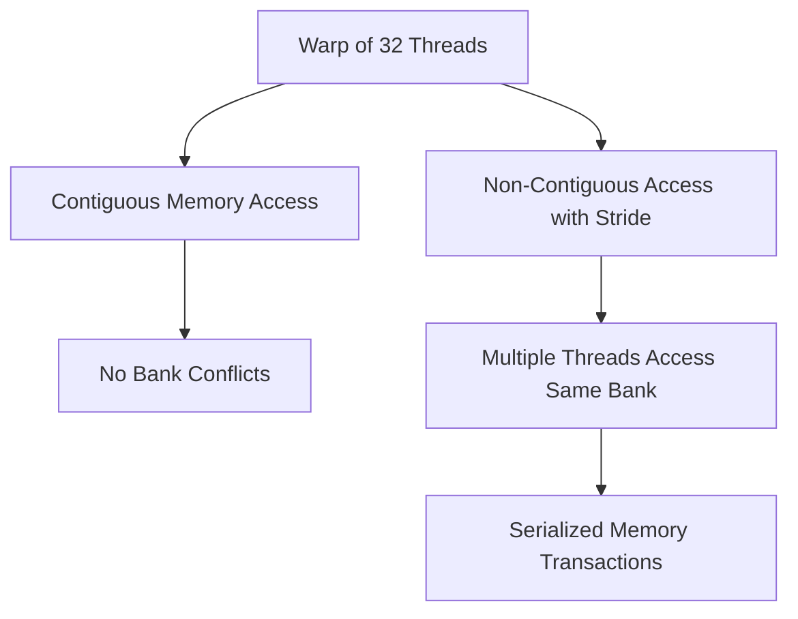
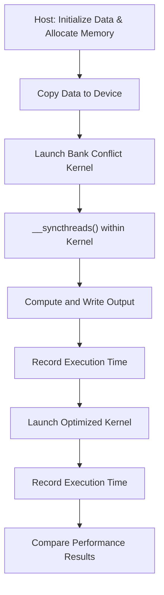

# Day 12: Bank Conflicts in Shared Memory

Efficient use of shared memory is critical in CUDA programming, but even shared memory can become a bottleneck when accessed inefficiently. On Day 12, we focus on **bank conflicts** in shared memory—when multiple threads in the same warp access addresses in the same memory bank simultaneously, causing serialized memory accesses and degrading performance. In this lesson, you will learn what bank conflicts are, how to design and test access patterns that trigger them, measure their performance impact, and apply debugging techniques to detect and resolve such issues.

---

## Table of Contents
1. [Overview](#1-overview)  
2. [Understanding Shared Memory and Bank Conflicts](#2-understanding-shared-memory-and-bank-conflicts)  
3. [Mechanism of Bank Conflicts](#3-mechanism-of-bank-conflicts)  
4. [Practical Exercise: Testing Access Patterns](#4-practical-exercise-testing-access-patterns)  
    - [a) Code Example with Bank Conflicts](#a-code-example-with-bank-conflicts)  
    - [b) Optimized Code Example without Bank Conflicts](#b-optimized-code-example-without-bank-conflicts)  
    - [c) Performance Measurement Using CUDA Events](#c-performance-measurement-using-cuda-events)  
5. [Common Pitfalls and Debugging Strategies](#5-common-pitfalls-and-debugging-strategies)  
6. [Conceptual Diagrams](#6-conceptual-diagrams)  
7. [References & Further Reading](#7-references--further-reading)  
8. [Conclusion](#8-conclusion)  
---

## 1. Overview
Shared memory in CUDA is divided into memory banks that can be accessed concurrently. However, if multiple threads in the same warp access different addresses that map to the same memory bank, the accesses are serialized, causing what is known as **bank conflicts**. This lesson covers:
- An explanation of shared memory organization and bank conflicts.
- A step-by-step practical exercise to implement a kernel with an access pattern that triggers bank conflicts.
- Measurement of the performance impact of bank conflicts.
- Debugging techniques to identify and resolve bank conflicts.
- Detailed diagrams to visually explain the concept.

---

## 2. Understanding Shared Memory and Bank Conflicts
Shared memory is a fast, on-chip memory accessible by all threads within a block. It is organized into multiple banks (typically 32 banks on modern NVIDIA GPUs), each capable of servicing one 32-bit word per clock cycle. 

**Key Points:**
- **Bank Organization:**  
  Shared memory is divided into banks to allow parallel accesses. Ideally, if each thread in a warp accesses a different bank, all accesses can be performed simultaneously.
- **Bank Conflicts:**  
  Occur when two or more threads in the same warp access different addresses that reside in the same bank. The hardware serializes these accesses, reducing effective memory bandwidth.
- **Impact:**  
  Bank conflicts can significantly degrade performance, especially in kernels that rely heavily on shared memory for data reuse.

*Reference:* Refer to the “Shared Memory Bank Conflicts” section in the [CUDA C Programming Guide](https://docs.nvidia.com/cuda/cuda-c-programming-guide/index.html).

---

## 3. Mechanism of Bank Conflicts
Each shared memory bank can service one request per clock cycle. If multiple threads access the same bank:
- **No Conflict:**  
  If all threads in a warp access the same address (broadcast), the hardware can handle it without conflict.
- **Conflict:**  
  If threads access different addresses in the same bank, the accesses are serialized, incurring a performance penalty.

**Example:**  
Assume a warp of 32 threads with shared memory organized into 32 banks. If thread `i` accesses `array[i]`, there is no conflict. However, if threads access `array[i * 2]` (assuming a stride of 2), several threads may map to the same bank, causing bank conflicts.

---

## 4. Practical Exercise: Testing Access Patterns

In this exercise, we will implement two kernels:
- One that deliberately causes bank conflicts.
- An optimized version that avoids bank conflicts by altering the access pattern.

We will then measure their execution times using CUDA events.

### a) Code Example with Bank Conflicts

Below is a kernel that deliberately accesses shared memory in a pattern that causes bank conflicts.  
Each thread loads data from a shared array with a stride that forces multiple threads to access the same bank.

```cpp
#include <cuda_runtime.h>
#include <stdio.h>

#define TILE_WIDTH 32
#define DATA_SIZE (TILE_WIDTH * TILE_WIDTH)

// Kernel that intentionally causes bank conflicts
__global__ void bankConflictKernel(float *input, float *output) {
    __shared__ float sharedData[TILE_WIDTH][TILE_WIDTH];

    int tx = threadIdx.x;
    int ty = threadIdx.y;
    int index = ty * TILE_WIDTH + tx;

    // Load data into shared memory with a stride that causes conflicts
    // Here, we access sharedData[ty][tx * 2 % TILE_WIDTH] to force multiple threads into the same bank
    int conflictIndex = tx * 2 % TILE_WIDTH;  // Artificially create a non-optimal pattern
    sharedData[ty][conflictIndex] = input[index];

    // Synchronize to ensure all threads have loaded their data
    __syncthreads();

    // Each thread reads back the value and writes to output
    output[index] = sharedData[ty][conflictIndex];
}
```

### b) Optimized Code Example without Bank Conflicts

The optimized version rearranges the access pattern to ensure that each thread accesses a unique bank.

```cpp
// Kernel that avoids bank conflicts by using a contiguous access pattern
__global__ void optimizedKernel(float *input, float *output) {
    __shared__ float sharedData[TILE_WIDTH][TILE_WIDTH];

    int tx = threadIdx.x;
    int ty = threadIdx.y;
    int index = ty * TILE_WIDTH + tx;

    // Load data into shared memory in a coalesced manner
    sharedData[ty][tx] = input[index];

    // Synchronize to ensure all threads have loaded their data
    __syncthreads();

    // Each thread reads back the value and writes to output
    output[index] = sharedData[ty][tx];
}
```

### c) Performance Measurement Using CUDA Events

Below is the host code to measure and compare the execution times of the two kernels.

```cpp
#include <cuda_runtime.h>
#include <stdio.h>
#include <stdlib.h>

#define TILE_WIDTH 32
#define DATA_SIZE (TILE_WIDTH * TILE_WIDTH)

// Kernel that intentionally causes bank conflicts
__global__ void bankConflictKernel(float *input, float *output) {
    __shared__ float sharedData[TILE_WIDTH][TILE_WIDTH];

    int tx = threadIdx.x;
    int ty = threadIdx.y;
    int index = ty * TILE_WIDTH + tx;

    // Access pattern causing bank conflicts
    int conflictIndex = tx * 2 % TILE_WIDTH;  // Artificial non-optimal pattern
    sharedData[ty][conflictIndex] = input[index];

    __syncthreads();

    output[index] = sharedData[ty][conflictIndex];
}

// Kernel that avoids bank conflicts by using a contiguous access pattern
__global__ void optimizedKernel(float *input, float *output) {
    __shared__ float sharedData[TILE_WIDTH][TILE_WIDTH];

    int tx = threadIdx.x;
    int ty = threadIdx.y;
    int index = ty * TILE_WIDTH + tx;

    // Coalesced access pattern
    sharedData[ty][tx] = input[index];

    __syncthreads();

    output[index] = sharedData[ty][tx];
}

int main() {
    size_t size = DATA_SIZE * sizeof(float);
    float *h_input = (float*)malloc(size);
    float *h_output = (float*)malloc(size);

    // Initialize input data
    for (int i = 0; i < DATA_SIZE; i++) {
        h_input[i] = (float)(i);
    }

    float *d_input, *d_output;
    cudaMalloc((void**)&d_input, size);
    cudaMalloc((void**)&d_output, size);
    cudaMemcpy(d_input, h_input, size, cudaMemcpyHostToDevice);

    dim3 threadsPerBlock(TILE_WIDTH, TILE_WIDTH);
    dim3 blocksPerGrid(1, 1);

    cudaEvent_t start, stop;
    float timeConflict, timeOptimized;
    cudaEventCreate(&start);
    cudaEventCreate(&stop);

    // --- Warm-Up for Bank Conflict Kernel ---
    bankConflictKernel<<<blocksPerGrid, threadsPerBlock>>>(d_input, d_output);
    cudaDeviceSynchronize();

    // Measure bankConflictKernel execution time
    cudaEventRecord(start);
    bankConflictKernel<<<blocksPerGrid, threadsPerBlock>>>(d_input, d_output);
    cudaEventRecord(stop);
    cudaEventSynchronize(stop);
    cudaEventElapsedTime(&timeConflict, start, stop);

    // --- Warm-Up for Optimized Kernel ---
    optimizedKernel<<<blocksPerGrid, threadsPerBlock>>>(d_input, d_output);
    cudaDeviceSynchronize();

    // Measure optimizedKernel execution time
    cudaEventRecord(start);
    optimizedKernel<<<blocksPerGrid, threadsPerBlock>>>(d_input, d_output);
    cudaEventRecord(stop);
    cudaEventSynchronize(stop);
    cudaEventElapsedTime(&timeOptimized, start, stop);

    printf("Bank Conflict Kernel Time:    %f ms\n", timeConflict);
    printf("Optimized Kernel Time:        %f ms\n", timeOptimized);

    // Clean up
    cudaFree(d_input);
    cudaFree(d_output);
    free(h_input);
    free(h_output);
    cudaEventDestroy(start);
    cudaEventDestroy(stop);

    return 0;
}
```

**Detailed Steps in the Host Code:**
- **Memory Allocation and Initialization:**  
  Host memory is allocated and initialized with sequential values.
- **Device Memory Allocation:**  
  Allocate device memory using `cudaMalloc()` and transfer the host data to the device.
- **Kernel Execution:**  
  Both the bank-conflict kernel and the optimized kernel are launched with the same grid and block configurations.
- **Performance Measurement:**  
  CUDA events (`cudaEventRecord()`, `cudaEventElapsedTime()`) measure the execution time of each kernel.
- **Output and Cleanup:**  
  Execution times are printed, and all allocated memory is freed.

---

## 5. Common Pitfalls and Debugging Strategies
### Missing Considerations for Bank Conflicts
- **Pitfall:** Overlooking the fact that non-optimal access patterns can lead to bank conflicts, severely impacting performance.
- **Debugging Strategy:**  
  - Use profiling tools such as NVIDIA NSight Compute to analyze shared memory access patterns.
  - Experiment with different memory access patterns and measure performance differences.
  - Validate that shared memory accesses are coalesced and do not cause serialization by reviewing the memory bank mapping (typically 32 banks).

### Error Checking
- Always check the return values of CUDA API calls, such as `cudaMalloc()`, `cudaMemcpy()`, and kernel launches.
- Use error-checking macros or functions to simplify the debugging process.

---

## 6. Conceptual Diagrams

### Diagram 1: Memory Bank Conflict Overview

*Explanation:*  
- When threads access contiguous memory (B), they benefit from coalesced access (C).
- When access involves a stride (D), multiple threads may access the same bank (E), leading to serialized transactions (F).

### Diagram 2: Kernel Execution Flow for Bank Conflict Testing

*Explanation:*  
- The flow details data initialization, kernel launches, synchronization within the kernel, and performance measurement to compare bank-conflicted and optimized memory accesses.

---

## 7. References & Further Reading
1. **[CUDA C Programming Guide](https://docs.nvidia.com/cuda/cuda-c-programming-guide/index.html)**  
   Refer to the “Shared Memory Bank Conflicts” section for in-depth information on how shared memory is organized and how bank conflicts occur.
2. **[CUDA C Best Practices Guide](https://docs.nvidia.com/cuda/cuda-c-best-practices-guide/index.html)**  
   Provides optimization strategies and tips for avoiding shared memory bank conflicts.
3. **"Programming Massively Parallel Processors: A Hands-on Approach" by David B. Kirk and Wen-mei W. Hwu**  
   A comprehensive resource on CUDA architecture and optimization techniques.
4. **NVIDIA Developer Blog**  
   Offers case studies and articles on optimizing memory accesses in CUDA applications.

---

## 8. Conclusion
In Day 12, you explored the concept of bank conflicts in shared memory and their impact on performance. You learned:
- **Bank Conflicts:** What they are, how they occur, and why they degrade performance.
- **Practical Implementation:** Through a detailed exercise comparing a kernel with intentional bank conflicts against an optimized version.
- **Performance Measurement:** How to use CUDA events to benchmark the execution time of different memory access patterns.
- **Debugging Strategies:** Common pitfalls such as overlooking bank conflicts and best practices to mitigate them.

---


