# Day 14: Progress Checkpoint

In this final checkpoint of our introductory CUDA series (Days 1–13), we will consolidate your learning by reviewing key concepts, particularly focusing on the differences between global and shared memory usage. This lesson is designed as a comprehensive recap and self-assessment exercise. You will complete a quiz-like recap and create a “lessons learned” list to help avoid repeated mistakes in future projects.

---

## Table of Contents
1. [Overview](#1-overview)  
2. [Recap: Global vs. Shared Memory](#2-recap-global-vs-shared-memory)  
3. [Quiz: Check Your Knowledge](#3-quiz-check-your-knowledge)  
4. [Creating a “Lessons Learned” List](#4-creating-a-lessons-learned-list)  
5. [Common Debugging Pitfalls](#5-common-debugging-pitfalls)  
6. [Conceptual Diagrams](#6-conceptual-diagrams)  
7. [Questions and Answers.](#7-questions-and-answers)  
8. [Additional 20 Advanced Quiz Questions and Answers (Days 1–14)](#8-additional-20-advanced-quiz-questions-and-answers-days-1–14)  
9. [Coding Challenges](#9-coding-challenges)  
10. [Hard LeetCode-Style CUDA Coding Problems](#10-hard-leetcode-style-cuda-coding-problems)  
11. [Hard LeetCode-Style CUDA Coding Problems Solution – Conceptual Diagrams](#11-hard-leetcode-style-cuda-coding-problems-solution--conceptual-diagrams)  
12. [References & Further Reading](#12-references--further-reading)  
13. [Conclusion](#13-conclusion)  

---

## 1. Overview
Throughout Days 1–13, you have learned the fundamentals of GPU computing and CUDA programming—from setting up your development environment and understanding GPU architecture to mastering memory management, thread synchronization, atomic operations, and optimization techniques such as coalescing and avoiding bank conflicts. The goal of today’s progress checkpoint is to:

- **Review** key concepts with an emphasis on memory usage.
- **Assess** your understanding through a quiz and self-reflection.
- **Compile** a “lessons learned” list to help avoid repeating common pitfalls in future projects.

This exercise is critical to consolidate your learning and ensure that you build a solid foundation for advanced topics.

---

## 2. Recap: Global vs. Shared Memory

### Global Memory
- **Definition:**  
  The largest memory space available on the GPU. Accessible by all threads across all blocks.
- **Characteristics:**  
  - **High Capacity:** Ideal for storing large datasets.
  - **High Latency:** Slower than on-chip memories.
  - **Usage:** Data transfer between host and device; long-term storage during kernel execution.
- **Key Operations:**  
  - `cudaMemcpy()`, `cudaMalloc()`, and `cudaFree()` for allocation and data movement.
- **Optimization Techniques:**  
  - Coalesced memory accesses to improve throughput.

### Shared Memory
- **Definition:**  
  A fast, on-chip memory space shared among threads in the same block.
- **Characteristics:**  
  - **Low Latency:** Much faster than global memory.
  - **Limited Capacity:** Typically 48KB to 96KB per Streaming Multiprocessor (SM).
  - **Usage:** Temporary storage for data reuse; critical for algorithms like tiled matrix multiplication.
- **Key Considerations:**  
  - **Bank Conflicts:** Must be avoided for optimal performance.
  - **Synchronization:** Use `__syncthreads()` to coordinate data loading and computation.

*Summary:*  
Global memory is used for large data storage and transfers, whereas shared memory is a limited but fast resource used for inter-thread communication and temporary caching. Effective use of both is key to high-performance CUDA applications.

---

## 3. Quiz: Check Your Knowledge

Below is a set of questions to test your understanding of global and shared memory:

1. **What are the main differences between global and shared memory in CUDA?**  
   - *Answer Guide:*  
     Global memory is large and accessible by all threads but has high latency, whereas shared memory is on-chip, low-latency, and only accessible within a block.

2. **How does memory coalescing affect global memory performance?**  
   - *Answer Guide:*  
     Coalescing allows multiple memory accesses from a warp to be combined into a single transaction, reducing latency and increasing throughput.

3. **Why is `__syncthreads()` essential when using shared memory?**  
   - *Answer Guide:*  
     It ensures all threads in a block have completed data loading or computation before proceeding, preventing race conditions and partial updates.

4. **What are bank conflicts in shared memory and how can you avoid them?**  
   - *Answer Guide:*  
     Bank conflicts occur when multiple threads access different addresses in the same memory bank, leading to serialized accesses. They can be avoided by organizing data access patterns so that threads access different banks or by using padding.

*Reflect on these questions and write down your answers to ensure you fully grasp these concepts.*

---

## 4. Creating a “Lessons Learned” List

To consolidate your learning, create a detailed “lessons learned” list summarizing the key insights from Days 1–13. Below is a template you can use:

### Lessons Learned

1. **GPU vs. CPU:**  
   - **Key Insight:** GPUs excel at parallel computations while CPUs are optimized for serial tasks.
   - **Takeaway:** Always leverage the GPU for data-parallel operations to achieve high throughput.

2. **Thread Hierarchy:**  
   - **Key Insight:** Understanding grids, blocks, and warps is essential for mapping parallel tasks.
   - **Takeaway:** Correct thread indexing and grid configuration are critical to avoid off-by-one errors.

3. **Memory Management:**  
   - **Global Memory:**  
     - **Insight:** Large but slow; use coalesced access patterns.  
     - **Pitfall:** Mismatched data sizes can cause errors.
   - **Shared Memory:**  
     - **Insight:** Fast and low-latency; ideal for data reuse.  
     - **Pitfall:** Missing `__syncthreads()` leads to race conditions.
   - **Takeaway:** Always use proper error checking and free allocated memory.

4. **Atomic Operations:**  
   - **Key Insight:** Useful for preventing race conditions but can be a performance bottleneck.
   - **Takeaway:** Use hierarchical reductions when possible to minimize atomic contention.

5. **Optimization Techniques:**  
   - **Memory Coalescing & Bank Conflicts:**  
     - **Insight:** Access patterns significantly impact performance.  
     - **Takeaway:** Organize data to optimize memory accesses and avoid bank conflicts.

6. **Synchronization:**  
   - **Key Insight:** Proper synchronization with `__syncthreads()` is crucial to ensure correctness.
   - **Takeaway:** Always insert synchronization barriers after shared memory loads and computations.

*Write down your own additional lessons and insights from your personal experience with the exercises.*

---

## 5. Common Debugging Pitfalls

### Pitfalls
- **Not Consolidating Learning:**  
  - **Issue:** Repeated mistakes occur when key concepts are not reviewed.
  - **Mitigation:** Regularly revisit notes and update your “lessons learned” list.
- **Memory Management Errors:**  
  - **Issue:** Forgetting to free device memory leads to leaks.
  - **Mitigation:** Always pair `cudaMalloc()` with `cudaFree()`.
- **Thread Synchronization Omissions:**  
  - **Issue:** Missing `__syncthreads()` can cause race conditions.
  - **Mitigation:** Review your kernel code to ensure proper synchronization.
- **Improper Access Patterns:**  
  - **Issue:** Non-coalesced accesses and bank conflicts drastically reduce performance.
  - **Mitigation:** Use profiling tools (e.g., NVIDIA NSight) to analyze memory access patterns.

### Debugging Strategies
- **Use CUDA Error Checking:**  
  Check the return values of all CUDA API calls.
- **Profile Your Kernels:**  
  Use tools like NVIDIA NSight Compute to identify performance bottlenecks.
- **Test with Small Data Sets:**  
  Validate intermediate outputs to catch issues early.
- **Keep Detailed Notes:**  
  Maintain a “lessons learned” list to track recurring issues and their resolutions.

---

## 6. Conceptual Diagrams

### Diagram 1: Global vs. Shared Memory Overview
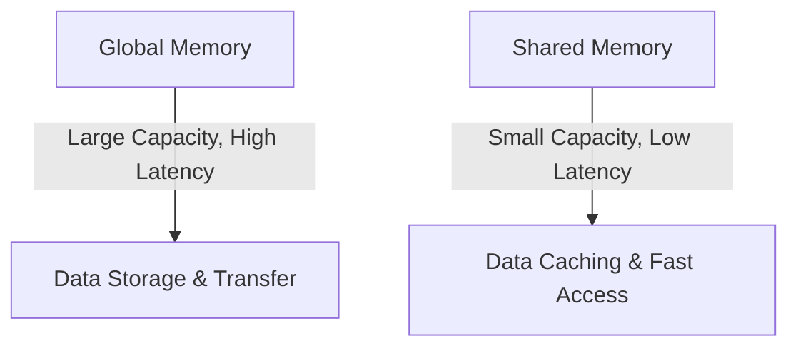
*Explanation:*  
- Global memory is used for storing large datasets and transferring data between host and device, while shared memory is used for fast, intra-block data reuse.

### Diagram 2: Progress Checkpoint Flow
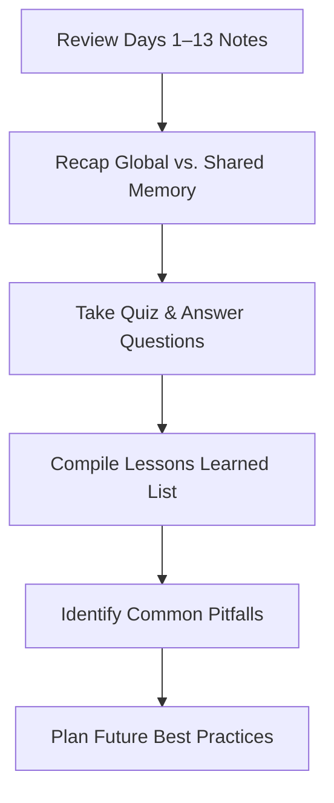
*Explanation:*  
- This diagram shows the flow of the progress checkpoint: reviewing notes, recapping key concepts, taking a quiz, compiling a lessons learned list, identifying pitfalls, and planning future best practices.

---
## 7.  Questions and Answers.

Below are 20 logical quiz questions along with their answers. These questions are designed to test your understanding of the key concepts covered in Days 1–13, with a focus on global versus shared memory, thread synchronization, memory coalescing, atomic operations, and overall CUDA best practices.

---

### 1. What is the primary difference between global memory and shared memory in CUDA?
**Answer:**  
Global memory is large, off-chip, and accessible by all threads across all blocks but has high latency. Shared memory is a small, on-chip memory space that is low-latency and accessible only by threads within the same block.

---

### 2. What is a warp in CUDA, and why is it important?
**Answer:**  
A warp is a group of 32 threads that execute instructions in lockstep on the GPU. Understanding warps is important because thread divergence and memory access patterns are managed at the warp level, which directly impacts performance.

---

### 3. How many threads typically form a warp in CUDA?
**Answer:**  
A warp typically consists of 32 threads.

---

### 4. What is memory coalescing, and how does it improve performance?
**Answer:**  
Memory coalescing is a technique where threads in a warp access contiguous memory addresses, allowing the GPU to combine these accesses into a single memory transaction. This improves memory bandwidth and reduces latency.

---

### 5. What causes bank conflicts in shared memory, and how can they be avoided?
**Answer:**  
Bank conflicts occur when multiple threads in the same warp access different addresses within the same memory bank simultaneously, leading to serialized accesses. They can be avoided by organizing data such that consecutive threads access different banks or by adding padding to alter the memory layout.

---

### 6. Why is the use of `__syncthreads()` critical in kernels that use shared memory?
**Answer:**  
`__syncthreads()` is used to synchronize all threads within a block, ensuring that data loaded into shared memory is fully available to all threads before any thread proceeds. This prevents race conditions and ensures correct computation.

---

### 7. What is the purpose of atomic operations in CUDA?
**Answer:**  
Atomic operations ensure that concurrent updates to a shared variable by multiple threads occur without race conditions. They are used to maintain data integrity when threads perform operations like increments or sums on the same memory location.

---

### 8. When would you typically use the `atomicAdd()` function?
**Answer:**  
`atomicAdd()` is used when multiple threads need to add values to a shared or global variable without causing race conditions—commonly used in parallel reduction or summing operations.

---

### 9. What are the potential downsides of using atomic operations excessively?
**Answer:**  
Excessive use of atomic operations can lead to high contention and serialization, which degrades performance due to threads waiting on each other to complete their atomic updates.

---

### 10. How do you allocate memory on the GPU in CUDA?
**Answer:**  
Memory is allocated on the GPU using the `cudaMalloc()` function, which allocates a specified number of bytes and returns a pointer to the allocated memory.

---

### 11. How do you properly free allocated device memory in CUDA?
**Answer:**  
Device memory is freed using the `cudaFree()` function. Every allocation done with `cudaMalloc()` should be paired with a corresponding `cudaFree()` to prevent memory leaks.

---

### 12. What is the difference between `cudaMemcpyHostToDevice` and `cudaMemcpyDeviceToHost`?
**Answer:**  
`cudaMemcpyHostToDevice` is used to copy data from host (CPU) memory to device (GPU) memory, while `cudaMemcpyDeviceToHost` is used to copy data from device memory back to host memory.

---

### 13. Define a race condition in the context of CUDA programming.
**Answer:**  
A race condition occurs when two or more threads access a shared resource concurrently and at least one thread modifies the data, leading to unpredictable or incorrect outcomes if the accesses are not properly synchronized.

---

### 14. Why is proper memory alignment important in CUDA applications?
**Answer:**  
Proper memory alignment ensures that data is stored at addresses that match the hardware’s memory boundaries, which can reduce the number of memory transactions and improve access efficiency, especially for global memory.

---

### 15. How does shared memory improve performance in CUDA kernels?
**Answer:**  
Shared memory is a low-latency, on-chip memory that allows threads within a block to quickly access and share data. By caching data from slower global memory, it reduces the number of global memory accesses and significantly speeds up computation.

---

### 16. What is the impact of non-coalesced memory accesses on global memory performance?
**Answer:**  
Non-coalesced memory accesses cause each thread to make separate memory transactions, which increases latency and reduces effective bandwidth, leading to a significant performance degradation.

---

### 17. Explain what a bank conflict in shared memory is.
**Answer:**  
A bank conflict occurs when multiple threads in the same warp access different addresses that map to the same memory bank in shared memory. This forces the accesses to be serialized, reducing the effective memory throughput.

---

### 18. What happens if you omit `__syncthreads()` in a kernel that uses shared memory?
**Answer:**  
Omitting `__syncthreads()` can lead to race conditions where some threads proceed before others have finished loading or processing shared data. This can result in using uninitialized or partially updated data, leading to incorrect results.

---

### 19. What is hierarchical reduction, and why might it be used with atomic operations?
**Answer:**  
Hierarchical reduction is a technique where threads first perform partial sums in shared memory before a final atomic operation is performed on a reduced result. This minimizes the contention on atomic operations by reducing the number of atomic updates required.

---

### 20. How does the CUDA memory hierarchy help in optimizing performance?
**Answer:**  
The CUDA memory hierarchy (global, shared, constant, local, and registers) allows developers to strategically place data in the fastest available memory. Using shared memory for frequently accessed data, constant memory for immutable data, and registers for per-thread temporary variables, optimizes data access and improves overall performance.

---


## 8. Additional 20 Advanced Quiz Questions and Answers (Days 1–14)

Below are 20 highly complex quiz questions covering advanced topics from Days 1–14. These questions are designed to challenge your understanding of GPU computing concepts, memory models, thread synchronization, atomic operations, and optimization techniques in CUDA. Each question is followed by a detailed answer.

---

### 1. Explain the difference between SIMD, SIMT, and how CUDA’s SIMT model influences kernel design.
**Answer:**  
- **SIMD (Single Instruction, Multiple Data):** A processor executes one instruction on multiple data elements simultaneously.  
- **SIMT (Single Instruction, Multiple Threads):** CUDA’s model where each thread in a warp executes the same instruction, but each thread can operate on its own data.  
- **Influence on Kernel Design:**  
  - Branch divergence in SIMT can cause threads within a warp to serialize execution if they follow different control paths.
  - Kernels must be designed to minimize divergence and ensure that threads follow similar execution paths for optimal performance.

---

### 2. Compare the trade-offs between using atomic operations (e.g., `atomicAdd`) for global summation versus performing a hierarchical reduction.
**Answer:**  
- **Atomic Operations:**  
  - **Pros:** Simple to implement; guarantees correctness without explicit synchronization.
  - **Cons:** High contention can serialize operations, especially for large data sets, resulting in performance degradation.
- **Hierarchical Reduction:**  
  - **Pros:** Performs partial sums in shared memory (fast) before a final atomic operation, reducing contention.
  - **Cons:** More complex implementation; requires additional synchronization and careful management of shared memory.
  
---

### 3. Describe a scenario where memory coalescing does not occur even if threads appear to access contiguous memory addresses.
**Answer:**  
- **Scenario:**  
  If the data is not properly aligned or if the data structure has padding or extra bytes inserted (e.g., using a structure with non-contiguous fields), even contiguous thread indices may map to non-contiguous memory addresses.
- **Impact:**  
  This misalignment forces the GPU to perform multiple memory transactions rather than a single coalesced access, reducing memory bandwidth efficiency.

---

### 4. How do shared memory bank conflicts occur, and what design strategies can you implement to avoid them?
**Answer:**  
- **Bank Conflicts:**  
  Occur when multiple threads in the same warp access different addresses in the same shared memory bank simultaneously.
- **Avoidance Strategies:**  
  - Reorganize data layout (e.g., pad arrays to avoid alignment that maps multiple accesses to the same bank).
  - Ensure that threads access data with a stride that maps to different banks.
  - Use structure-of-arrays (SoA) rather than array-of-structures (AoS) to optimize access patterns.

---

### 5. What are the potential issues with using `__syncthreads()` within divergent code paths, and how can these issues be mitigated?
**Answer:**  
- **Potential Issues:**  
  - If threads within the same block diverge and only some execute `__syncthreads()`, it can lead to deadlock as not all threads reach the barrier.
- **Mitigation:**  
  - Ensure that all threads within a block execute the same synchronization calls, even if they take different code paths.
  - Restructure the code to avoid placing `__syncthreads()` inside conditional statements where divergence might occur.

---

### 6. How would you modify a naive vector addition kernel to minimize memory transfer overhead and maximize throughput?
**Answer:**  
- **Modifications:**  
  - Use pinned (page-locked) host memory for faster transfers.
  - Overlap data transfers with kernel execution using CUDA streams.
  - Ensure that memory transfers are performed in large contiguous blocks to maximize bandwidth.
  - Optimize kernel launch parameters (threads per block, blocks per grid) for your specific hardware.

---

### 7. Discuss the implications of register spilling to local memory and strategies to avoid it.
**Answer:**  
- **Implications:**  
  - Register spilling occurs when there are not enough registers to hold all variables, and excess variables are stored in local memory (which is part of global memory and has high latency).
  - This results in slower execution due to increased memory accesses.
- **Strategies to Avoid:**  
  - Optimize kernel code to reduce register usage.
  - Use compiler flags (e.g., `--maxrregcount`) to control register usage.
  - Refactor complex functions to reduce variable count and reuse registers.

---

### 8. Explain how occupancy is determined in CUDA and list strategies to maximize occupancy.
**Answer:**  
- **Occupancy:**  
  The ratio of active warps per Streaming Multiprocessor (SM) to the maximum possible number of warps.
- **Determining Factors:**  
  - Number of registers per thread.
  - Amount of shared memory per block.
  - Block size and grid size.
- **Strategies to Maximize:**  
  - Optimize kernel to use fewer registers.
  - Minimize shared memory usage per block.
  - Choose optimal block sizes that maximize the number of resident warps on an SM.

---

### 9. Compare the latency and throughput characteristics of global, shared, constant, and local memory.
**Answer:**  
- **Global Memory:**  
  - **Latency:** High; accessed off-chip.
  - **Throughput:** High if accesses are coalesced.
- **Shared Memory:**  
  - **Latency:** Low; on-chip.
  - **Throughput:** Very high when bank conflicts are minimized.
- **Constant Memory:**  
  - **Latency:** Low when cached; high when not.
  - **Throughput:** Optimized for broadcast reads.
- **Local Memory:**  
  - **Latency:** High; used when registers are exhausted.
  - **Throughput:** Low, as it resides in global memory.
  
---

### 10. Describe a method to use asynchronous data transfers to overlap computation with data movement.
**Answer:**  
- **Method:**  
  Use CUDA streams to perform data transfers and kernel executions concurrently.
- **Implementation:**  
  - Allocate pinned host memory.
  - Create multiple CUDA streams.
  - Use `cudaMemcpyAsync()` to transfer data while concurrently launching kernels in different streams.
  - Synchronize streams appropriately to ensure data integrity.
  
---

### 11. How can you diagnose shared memory bank conflicts using CUDA profiling tools?
**Answer:**  
- **Diagnosis Tools:**  
  Use NVIDIA NSight Compute or CUDA Visual Profiler.
- **Metrics to Monitor:**  
  - Shared memory throughput.
  - The number of bank conflicts reported.
- **Process:**  
  - Profile the kernel and examine the shared memory access patterns.
  - Look for high conflict rates and adjust the access pattern (e.g., padding arrays) accordingly.

---

### 12. What are the benefits and drawbacks of tiling in matrix multiplication, and how does shared memory facilitate this technique?
**Answer:**  
- **Benefits:**  
  - Reduces the number of global memory accesses by reusing data loaded into shared memory.
  - Increases data locality and computational efficiency.
- **Drawbacks:**  
  - Requires careful management of shared memory and synchronization.
  - Limited by the available shared memory size per block.
- **Facilitation:**  
  Shared memory provides a fast, low-latency buffer to store tiles (sub-matrices) that can be reused across multiple computations within a block.

---

### 13. Explain memory coalescing and illustrate how misalignment can affect performance with a code snippet.
**Answer:**  
- **Memory Coalescing:**  
  Occurs when consecutive threads access consecutive memory addresses, allowing a single memory transaction.
- **Misalignment Impact:**  
  If data is not properly aligned, even contiguous accesses may span multiple memory transactions.
- **Code Snippet:**
  ```cpp
  // Correct coalesced access
  __global__ void coalescedKernel(float *data) {
      int idx = threadIdx.x + blockIdx.x * blockDim.x;
      float val = data[idx];  // Threads access contiguous addresses
  }
  
  // Misaligned access example
  __global__ void misalignedKernel(float *data) {
      int idx = threadIdx.x + blockIdx.x * blockDim.x;
      float val = data[idx + 1];  // Shifted access may cause misalignment
  }
  
- **Outcome:**  
  The misalignedKernel may require multiple transactions, degrading performance.

---

### 14. Discuss the role of CUDA streams and how they can be used to improve performance.
**Answer:**  
- **CUDA Streams:**  
  A sequence of operations that execute in order on the GPU.
- **Improvement Mechanism:**  
  - Allow concurrent execution of data transfers and kernel executions.
  - Overlap communication and computation, reducing idle GPU time.
- **Usage:**  
  Launch asynchronous kernels and data transfers using different streams with functions like `cudaMemcpyAsync()`.

---

### 15. How would you approach debugging an intermittent kernel failure that only occurs at high occupancy?
**Answer:**  
- **Approach:**  
  - Use CUDA error checking after kernel launches and device synchronizations.
  - Lower occupancy temporarily by reducing the number of threads per block to isolate the issue.
  - Utilize CUDA profiling tools (e.g., NSight Compute) to analyze resource usage.
  - Examine register usage, shared memory consumption, and potential race conditions.
  - Add verbose logging for debugging when possible, and test with smaller datasets.

---

### 16. What are the challenges of synchronizing across multiple thread blocks, and how can these be addressed?
**Answer:**  
- **Challenges:**  
  CUDA’s `__syncthreads()` only synchronizes threads within a single block. Synchronizing across blocks is not natively supported.
- **Solutions:**  
  - Use multi-kernel launches to enforce global synchronization.
  - Employ atomic operations or global barriers using techniques like CUDA Dynamic Parallelism.
  - Design algorithms that avoid inter-block dependencies whenever possible.

---

### 17. Describe the role of constant memory and how you might effectively use it in a scenario requiring frequent reads of static data.
**Answer:**  
- **Role:**  
  Constant memory is a read-only memory space cached on-chip, ideal for data that does not change during kernel execution.
- **Effective Use:**  
  - Store configuration parameters or lookup tables that are accessed frequently by all threads.
  - Use `cudaMemcpyToSymbol()` to copy data to constant memory before launching kernels.
  - Benefit from broadcast capabilities where multiple threads read the same value concurrently.

---

### 18. How does the CUDA memory hierarchy influence the design of a parallel reduction algorithm?
**Answer:**  
- **Influence:**  
  - Global memory: Stores the large dataset but is slower.
  - Shared memory: Used for fast, local reductions within a block.
  - Registers: Store temporary results for each thread.
- **Design Consideration:**  
  Perform partial reductions in shared memory to reduce the number of global memory accesses and then combine the partial results using atomic operations or additional kernel launches.

---

### 19. Explain how bank conflicts in shared memory can be diagnosed using profiling tools, and what specific metrics indicate their presence.
**Answer:**  
- **Diagnosis:**  
  Use tools like NVIDIA NSight Compute or CUDA Visual Profiler.
- **Metrics:**  
  - Count of bank conflicts.
  - Shared memory throughput and efficiency.
- **Indications:**  
  A high number of bank conflicts or reduced effective shared memory throughput suggests that threads are contending for the same memory banks.

---

### 20. How do grid and block dimensions affect kernel performance, and what strategies can be employed to determine the optimal configuration?
**Answer:**  
- **Effect on Performance:**  
  - Too few threads may underutilize the GPU.
  - Too many threads per block may exceed shared memory or register limits, reducing occupancy.
- **Strategies:**  
  - Experiment with different configurations using profiling tools.
  - Use occupancy calculators provided by NVIDIA.
  - Balance between the number of blocks (to keep all SMs busy) and the threads per block (to ensure sufficient parallelism without resource oversubscription).

---
## 9. Coding Challenges.

## Problem 1: Parallel Array Sum Using Atomic Operations
**Description:**  
Write a CUDA kernel that computes the sum of an array of floats in parallel using `atomicAdd()`. The kernel should be launched with enough threads to cover the entire array.

**Function Signature:**  
`__global__ void atomicSumKernel(const float *input, float *result, int N)`

**Constraints:**  
- `N` is a positive integer (e.g., up to 10^6).
- Use atomic operations to avoid race conditions.

**Example:**  
- **Input:** An array of floats `[0.1, 0.2, 0.3, 0.4]`
- **Output:** `1.0`

**Hints:**  
- Allocate a single float in device memory to hold the sum.
- Use a boundary check for threads.

---

## Problem 2: Parallel Array Maximum Using Atomic Operations
**Description:**  
Develop a CUDA kernel to find the maximum value in an array of floats using atomic operations. Note that CUDA does not provide a built-in `atomicMax` for floats, so you must implement a workaround.

**Function Signature:**  
`__global__ void atomicMaxKernel(const float *input, float *result, int N)`

**Constraints:**  
- Implement a compare-and-swap loop using atomicCAS.
- The array size `N` can be large.

**Example:**  
- **Input:** `[1.5, 2.3, 0.7, 4.1]`
- **Output:** `4.1`

**Hints:**  
- Use type punning (e.g., reinterpret_cast) to treat floats as integers for atomicCAS.

---

## Problem 3: Vector Addition with Global Memory Coalescing
**Description:**  
Write a CUDA kernel to perform vector addition on two arrays of floats ensuring that the memory accesses are coalesced.

**Function Signature:**  
`__global__ void vectorAddKernel(const float *A, const float *B, float *C, int N)`

**Constraints:**  
- Ensure that threads access contiguous memory.
- Use proper grid and block dimensions.

**Example:**  
- **Input:** A = `[1.0, 2.0, 3.0]`, B = `[4.0, 5.0, 6.0]`
- **Output:** C = `[5.0, 7.0, 9.0]`

**Hints:**  
- Use a 1D grid and 1D block configuration.
- Compute the global index for each thread.

---

## Problem 4: Matrix Multiplication Using Global Memory
**Description:**  
Implement a CUDA kernel for naive matrix multiplication using only global memory. Do not use shared memory.

**Function Signature:**  
`__global__ void matrixMulGlobal(const float *A, const float *B, float *C, int M, int N, int K)`

**Constraints:**  
- Matrix A is of size MxN, matrix B is of size NxK, and matrix C is of size MxK.
- Each thread computes one element of C.

**Example:**  
- **Input:** A 2x2 matrix, B 2x2 matrix.
- **Output:** C computed as the product of A and B.

**Hints:**  
- Use nested loops inside each thread to perform the dot product.

---

## Problem 5: Tiled Matrix Multiplication with Shared Memory
**Description:**  
Extend your matrix multiplication kernel to use shared memory for better performance (tile-based multiplication).

**Function Signature:**  
`__global__ void tiledMatrixMul(const float *A, const float *B, float *C, int width)`

**Constraints:**  
- Use a tile width (e.g., 16 or 32).
- Implement proper synchronization with `__syncthreads()`.

**Example:**  
- **Input:** Two 1024x1024 matrices.
- **Output:** Their product matrix.

**Hints:**  
- Divide matrices into tiles.
- Load each tile into shared memory and synchronize before computation.

---

## Problem 6: Detecting and Avoiding Shared Memory Bank Conflicts
**Description:**  
Write two CUDA kernels: one that deliberately causes bank conflicts by accessing shared memory with a stride that leads to conflicts, and an optimized version that avoids bank conflicts.

**Function Signatures:**  
`__global__ void bankConflictKernel(float *input, float *output)`  
`__global__ void optimizedKernel(float *input, float *output)`

**Constraints:**  
- Use a 2D shared memory array.
- Ensure that in the optimized version, threads access memory in a coalesced, conflict-free manner.

**Example:**  
- **Input:** A small 2D array.
- **Output:** Same array, but measure and compare execution times.

**Hints:**  
- Use a fixed tile size (e.g., 32x32).
- For the conflict kernel, deliberately offset accesses.

---

## Problem 7: Parallel Reduction with Shared Memory
**Description:**  
Implement a parallel reduction algorithm using shared memory to sum an array of floats within each block, then use atomic operations to combine block results.

**Function Signature:**  
`__global__ void reduceKernel(const float *input, float *blockSums, int N)`

**Constraints:**  
- Use shared memory for intra-block reduction.
- Use atomic operations to accumulate block sums into a global result.

**Example:**  
- **Input:** An array of 1M floats.
- **Output:** The sum of the array.

**Hints:**  
- Use a tree-based reduction approach in shared memory.
- Ensure proper synchronization after each reduction step.

---

## Problem 8: Implementing a Barrier Across Thread Blocks (Simulation)
**Description:**  
Since CUDA does not support a barrier across blocks within a single kernel launch, simulate a global barrier using multiple kernel launches and host synchronization.

**Function Signature:**  
This is an algorithm design problem; outline your approach in pseudocode or comments.

**Constraints:**  
- No direct global barrier exists; design a multi-kernel approach.
- Use `cudaDeviceSynchronize()` between kernel launches.

**Example:**  
- **Input:** A problem that requires global synchronization (e.g., iterative updates).
- **Output:** Correctly synchronized results after multiple iterations.

**Hints:**  
- Use a loop on the host that launches a kernel, then synchronizes before the next iteration.

---

## Problem 9: Matrix Transposition with Shared Memory to Avoid Bank Conflicts
**Description:**  
Implement a matrix transpose kernel using shared memory. Optimize the kernel to avoid bank conflicts.

**Function Signature:**  
`__global__ void transposeKernel(const float *input, float *output, int width)`

**Constraints:**  
- Use shared memory and proper padding to avoid bank conflicts.
- Each thread should read one element and write it to the transposed position.

**Example:**  
- **Input:** A 1024x1024 matrix.
- **Output:** Its transpose.

**Hints:**  
- Add padding to the shared memory array dimensions.
- Use `__syncthreads()` to ensure data consistency.

---

## Problem 10: Implement a CUDA Kernel for Element-wise Array Multiplication
**Description:**  
Write a CUDA kernel that multiplies two arrays element-wise and stores the result in a third array, ensuring proper memory accesses.

**Function Signature:**  
`__global__ void elementwiseMulKernel(const float *A, const float *B, float *C, int N)`

**Constraints:**  
- Use a 1D grid configuration.
- Ensure boundary checks for array indices.

**Example:**  
- **Input:** A = `[1.0, 2.0, 3.0]`, B = `[4.0, 5.0, 6.0]`
- **Output:** C = `[4.0, 10.0, 18.0]`

**Hints:**  
- Compute the global index and perform the multiplication.

---

## Problem 11: Warp-level Primitives for Data Shuffling
**Description:**  
Implement a CUDA kernel that uses warp-level primitives (e.g., __shfl_down_sync) to perform a warp-wide reduction (sum) without using shared memory.

**Function Signature:**  
`__global__ void warpReductionKernel(const float *input, float *output, int N)`

**Constraints:**  
- The reduction is performed within a warp.
- Use CUDA warp shuffle functions available in CUDA 9.0+.

**Example:**  
- **Input:** An array of floats.
- **Output:** The sum of the values within each warp.

**Hints:**  
- Use the __shfl_down_sync function to reduce values within a warp.
- Ensure proper handling of warp boundaries.

---

## Problem 12: Implement a Broadcast Operation Using Constant Memory
**Description:**  
Write a CUDA kernel that broadcasts a value from constant memory to all threads, then uses it to scale an input array.

**Function Signature:**  
`__global__ void constantBroadcastKernel(const float *input, float *output, int N)`

**Constraints:**  
- Declare a constant memory variable for the scaling factor.
- Use the constant memory in the kernel for broadcasting.

**Example:**  
- **Input:** Array of floats and a constant scale factor (e.g., 2.0).
- **Output:** Each element in the array multiplied by the scale factor.

**Hints:**  
- Declare a __constant__ variable at global scope.
- Use cudaMemcpyToSymbol to copy the scale factor from host to device.

---

## Problem 13: Compare Performance: Atomic vs. Shared Memory Reduction
**Description:**  
Implement two versions of a reduction kernel: one that uses atomic operations to accumulate results and one that performs block-level reductions in shared memory before using atomics. Compare their performance.

**Function Signatures:**  
`__global__ void atomicReductionKernel(const float *input, float *result, int N)`  
`__global__ void sharedReductionKernel(const float *input, float *result, int N)`

**Constraints:**  
- Both kernels compute the sum of an array.
- Measure and compare execution times using CUDA events.

**Example:**  
- **Input:** Array of 1M floats.
- **Output:** The total sum and measured execution times for both kernels.

**Hints:**  
- For the shared reduction kernel, use a shared memory reduction before a single atomic addition.
- Use cudaEventRecord and cudaEventElapsedTime for timing.

---

## Problem 14: Implement a CUDA Kernel to Compute the Dot Product of Two Vectors
**Description:**  
Write a CUDA kernel that computes the dot product of two vectors using shared memory reduction.

**Function Signature:**  
`__global__ void dotProductKernel(const float *A, const float *B, float *result, int N)`

**Constraints:**  
- Use shared memory to accumulate partial dot products.
- Use atomic operations to combine block results.

**Example:**  
- **Input:** Vectors A = `[1, 2, 3]`, B = `[4, 5, 6]`
- **Output:** Dot product = `32`

**Hints:**  
- Compute partial products for each thread.
- Perform a reduction within each block before the final atomic addition.

---

## Problem 15: Implement a Kernel for Counting Elements Greater Than a Threshold
**Description:**  
Write a CUDA kernel that counts the number of elements in an array that exceed a given threshold using atomic operations.

**Function Signature:**  
`__global__ void countThresholdKernel(const float *input, int *count, float threshold, int N)`

**Constraints:**  
- Use `atomicAdd()` to update the count.
- Ensure proper boundary checking.

**Example:**  
- **Input:** Array `[0.5, 0.8, 1.2, 0.3]`, threshold = 0.7
- **Output:** Count = `2`

**Hints:**  
- Each thread checks if its element exceeds the threshold.
- Use an atomic update if the condition is met.

---

## Problem 16: Implement a Kernel to Normalize an Array
**Description:**  
Develop a CUDA kernel to normalize an array of floats (subtract the mean and divide by the standard deviation). Use shared memory to compute the mean and standard deviation efficiently.

**Function Signature:**  
`__global__ void normalizeKernel(float *data, int N)`

**Constraints:**  
- Use a two-step process: compute mean and standard deviation, then normalize.
- Utilize shared memory for reduction operations.

**Example:**  
- **Input:** Array `[1, 2, 3, 4]`
- **Output:** Normalized array (values will vary based on computation)

**Hints:**  
- First kernel launch: compute the mean and standard deviation.
- Second kernel launch: apply normalization using computed values.

---

## Problem 17: Implement a Kernel for Parallel Prefix Sum (Scan)
**Description:**  
Write a CUDA kernel that computes a parallel prefix sum (exclusive scan) of an array using shared memory.

**Function Signature:**  
`__global__ void scanKernel(float *input, float *output, int N)`

**Constraints:**  
- Use shared memory to perform the scan within each block.
- Merge block-level scans to compute a global scan.

**Example:**  
- **Input:** Array `[1, 2, 3, 4]`
- **Output:** Exclusive scan `[0, 1, 3, 6]`

**Hints:**  
- Implement an iterative approach with shared memory.
- Synchronize threads at each iteration using `__syncthreads()`.

---

## Problem 18: Implement a Kernel for Matrix-Vector Multiplication
**Description:**  
Create a CUDA kernel that multiplies a matrix by a vector using both global and shared memory for optimal performance.

**Function Signature:**  
`__global__ void matVecMulKernel(const float *matrix, const float *vector, float *result, int M, int N)`

**Constraints:**  
- Matrix is of size MxN.
- Use shared memory to load segments of the vector if beneficial.
- Each thread computes one element of the result vector.

**Example:**  
- **Input:** Matrix `[[1, 2], [3, 4]]`, Vector `[5, 6]`
- **Output:** Result `[17, 39]`

**Hints:**  
- Use a 1D grid for the result vector.
- Optimize memory accesses by preloading parts of the vector into shared memory.

---

## Problem 19: Implement a Kernel for Image Convolution
**Description:**  
Write a CUDA kernel that performs a 2D convolution on a grayscale image using a given filter kernel. Use shared memory to optimize performance.

**Function Signature:**  
`__global__ void convolutionKernel(const float *image, float *output, const float *filter, int width, int height, int filterWidth)`

**Constraints:**  
- Handle image boundaries correctly.
- Load a tile of the image into shared memory, including a border to handle the convolution window.
- Use synchronization as needed.

**Example:**  
- **Input:** A 512x512 image, a 3x3 filter.
- **Output:** The convolved image.

**Hints:**  
- Calculate the shared memory tile size to include halo regions.
- Use `__syncthreads()` after loading the tile.

---

## Problem 20: Implement a Kernel to Compute Element-wise Logarithm of an Array
**Description:**  
Write a CUDA kernel that computes the natural logarithm of each element in an array, ensuring that invalid values (e.g., zeros or negatives) are handled appropriately.

**Function Signature:**  
`__global__ void logKernel(const float *input, float *output, int N)`

**Constraints:**  
- Use proper error checking for domain errors (e.g., log(0) or log(negative)).
- Ensure that the kernel handles boundary conditions.
- Use a 1D grid configuration.

**Example:**  
- **Input:** Array `[1.0, 2.718, 0.0, -1.0]`
- **Output:** `[0.0, 1.0, -INFINITY or error flag, -INFINITY or error flag]` (handle as specified)

**Hints:**  
- Use a conditional check to avoid computing the log of non-positive numbers.
- Optionally, set the output to a special value (e.g., -FLT_MAX) for invalid inputs.

---


## 10.  Hard LeetCode-Style CUDA Coding Problems
---

## Problem 1: Hierarchical Parallel Reduction with Warp-Level Primitives
**Description:**  
Implement a parallel reduction kernel that computes the sum of a large array using a two-phase approach:  
1. Perform a warp-level reduction using __shfl_down_sync() within each warp.  
2. Use shared memory to further reduce partial sums from each warp, then use an atomic operation to combine results across blocks.

**Function Signature:**  
`__global__ void hierarchicalReduction(const float *input, float *result, int N)`

**Constraints:**  
- Input array size up to 10^7 elements.  
- Optimize to minimize atomic contention.

**Hints:**  
- Use __shfl_down_sync() for intra-warp reduction.  
- Each block computes a partial sum in shared memory and then performs an atomicAdd on the global result.

---

## Problem 2: Dynamic Parallelism for Recursive Kernel Launches
**Description:**  
Implement a CUDA kernel that uses dynamic parallelism to recursively launch child kernels to perform a divide-and-conquer algorithm (e.g., recursive reduction). The parent kernel should launch child kernels if the subarray size exceeds a threshold.

**Function Signature:**  
`__global__ void recursiveReduction(const float *input, float *result, int N)`

**Constraints:**  
- Use dynamic parallelism (kernel launches from within kernels).  
- Set a recursion threshold (e.g., N < 1024) to stop further recursion.

**Hints:**  
- Use cudaDeviceSynchronize() inside the kernel after launching child kernels.  
- Ensure proper base case for the recursion.

---

## Problem 3: Sparse Matrix-Vector Multiplication (CSR Format)
**Description:**  
Implement a CUDA kernel to perform sparse matrix-vector multiplication using the Compressed Sparse Row (CSR) format. The kernel should multiply a CSR-formatted sparse matrix by a dense vector.

**Function Signature:**  
`__global__ void spmvCSR(const int *rowPtr, const int *colInd, const float *values, const float *vector, float *result, int numRows)`

**Constraints:**  
- Input sparse matrix is in CSR format.  
- Ensure coalesced global memory accesses for the vector.

**Hints:**  
- Each thread processes one row of the matrix.
- Use atomicAdd if rows are processed by multiple threads (if necessary).

---

## Problem 4: Segmented Scan (Prefix Sum) for Variable-Length Segments
**Description:**  
Implement a CUDA kernel to perform an exclusive segmented scan on an array where segment boundaries are specified by a separate flag array.

**Function Signature:**  
`__global__ void segmentedScan(const float *input, const int *segmentFlags, float *output, int N)`

**Constraints:**  
- Each segment's scan should restart at 0.
- Use shared memory for intra-block scan and handle segment boundaries correctly.

**Hints:**  
- Identify segment start positions using segmentFlags.
- Reset the accumulation when a new segment begins.

---

## Problem 5: Parallel Histogram Computation Using Atomics and Shared Memory
**Description:**  
Write a CUDA kernel to compute the histogram of an image (grayscale) using both shared memory for per-block histograms and atomic operations to merge results into a global histogram.

**Function Signature:**  
`__global__ void histogramKernel(const unsigned char *image, int *histogram, int numPixels)`

**Constraints:**  
- Image is represented as an array of unsigned chars (0–255).
- Use shared memory to reduce contention on the global histogram.

**Hints:**  
- Each block builds its local histogram in shared memory.  
- Use atomicAdd to merge the local histogram into the global histogram after processing the block.

---

## Problem 6: Parallel Quicksort with In-Place Partitioning
**Description:**  
Design and implement a parallel version of quicksort using CUDA. Focus on the partitioning step and use atomic operations and shared memory to manage pivot selection and partitioning.

**Function Signature:**  
`__global__ void quicksortKernel(float *data, int left, int right)`

**Constraints:**  
- The algorithm should work in-place.
- Use recursion with dynamic parallelism or iterative methods with multiple kernel launches.

**Hints:**  
- Implement a partition function that partitions the array around a pivot.  
- Use atomic operations to help assign indices when merging partitions.

---

## Problem 7: Convolution Operation with Variable Kernel Size
**Description:**  
Implement a 2D convolution kernel for a grayscale image where the filter size is provided at runtime. Use shared memory to cache image tiles and constant memory for the filter.

**Function Signature:**  
`__global__ void convolutionKernel(const float *image, float *output, const float *filter, int width, int height, int filterWidth)`

**Constraints:**  
- Handle image boundaries correctly.
- Filter is stored in constant memory.
- Optimize shared memory tile size to include halo regions.

**Hints:**  
- Calculate the tile size as tileWidth + filterWidth - 1.
- Use __syncthreads() after loading the tile into shared memory.

---

## Problem 8: Iterative Jacobi Solver for Poisson Equation
**Description:**  
Implement a CUDA kernel to solve the Poisson equation using the Jacobi iterative method. Use shared memory to store neighboring values and atomic operations for convergence checking.

**Function Signature:**  
`__global__ void jacobiSolverKernel(const float *input, float *output, int width, float *error)`

**Constraints:**  
- Use a fixed number of iterations or until convergence.
- Store intermediate updates in shared memory.

**Hints:**  
- Use a reduction to compute the error between iterations.
- Synchronize threads using __syncthreads() after each iteration.

---

## Problem 9: Warp-Level Inclusive Scan (Prefix Sum)
**Description:**  
Implement a warp-level inclusive scan (prefix sum) using CUDA’s warp shuffle intrinsics without shared memory. This kernel should compute the inclusive scan for each warp independently.

**Function Signature:**  
`__global__ void warpInclusiveScan(const float *input, float *output, int N)`

**Constraints:**  
- Use __shfl_up_sync or __shfl_down_sync.
- Process only within a single warp (assume N is a multiple of warp size for simplicity).

**Hints:**  
- Use a loop that iteratively accumulates values within the warp.
- Handle boundary conditions within the warp.

---

## Problem 10: Breadth-First Search (BFS) with Dynamic Parallelism
**Description:**  
Implement a BFS algorithm for a graph using CUDA, employing dynamic parallelism to launch new kernels for each level of the search. Use atomic operations to manage the frontier.

**Function Signature:**  
`__global__ void bfsKernel(int *graph, int *frontier, int *visited, int numNodes)`

**Constraints:**  
- Graph is represented in an adjacency list format.
- Use dynamic parallelism to recursively process the frontier.
- Use atomic operations to update the frontier.

**Hints:**  
- Launch child kernels for processing the next level.
- Use cudaDeviceSynchronize() between kernel launches for global synchronization.

---

## Problem 11: Monte Carlo Simulation for Option Pricing
**Description:**  
Develop a CUDA kernel that performs a Monte Carlo simulation to estimate option pricing. Use per-thread random number generation (with cuRAND) and reduce results using atomic operations.

**Function Signature:**  
`__global__ void monteCarloKernel(float *results, int numPaths, unsigned long seed)`

**Constraints:**  
- Each thread simulates multiple paths.
- Use curand library functions for random number generation.
- Reduce the simulation results to compute an average.

**Hints:**  
- Initialize a cuRAND state per thread.
- Accumulate results locally and then use atomicAdd to update the global sum.

---

## Problem 12: Double-Buffered Tiled Matrix Multiplication
**Description:**  
Enhance the tile-based matrix multiplication kernel by implementing double buffering in shared memory. This technique overlaps the data loading phase with computation for improved performance.

**Function Signature:**  
`__global__ void doubleBufferedMatrixMul(const float *A, const float *B, float *C, int width)`

**Constraints:**  
- Use two sets of shared memory tiles to alternate between loading new data and computing.
- Implement proper synchronization to avoid race conditions.

**Hints:**  
- Use two buffers (e.g., tileA0, tileA1) and alternate each iteration.
- Insert __syncthreads() after switching buffers.

---

## Problem 13: Warp-Level Softmax Computation
**Description:**  
Implement a CUDA kernel that computes the softmax of a large batch of data using warp-level primitives. Each warp processes one vector, using warp shuffles to compute exponentials and sums.

**Function Signature:**  
`__global__ void warpSoftmaxKernel(const float *input, float *output, int vectorSize)`

**Constraints:**  
- Each warp handles one softmax computation.
- Use __shfl_down_sync for intra-warp reduction.

**Hints:**  
- Compute the maximum value for numerical stability.
- Use warp-level reductions to compute the sum of exponentials.

---

## Problem 14: Parallel N-Queens Solver Using Backtracking
**Description:**  
Implement a parallel solver for the N-Queens problem using CUDA. Use shared memory to store partial board states and atomic counters to record valid solutions.

**Function Signature:**  
`__global__ void nQueensKernel(int N, int *solutionCount)`

**Constraints:**  
- Use recursion or iterative backtracking within each thread.
- Use atomic operations to increment the global solution count.

**Hints:**  
- Represent the board as an array of integers.
- Use shared memory to cache partial solutions for each thread block.

---

## Problem 15: Parallel K-Means Clustering
**Description:**  
Implement a CUDA kernel to perform one iteration of the K-means clustering algorithm. Compute the new centroids by aggregating points assigned to each cluster, using shared memory and atomic operations.

**Function Signature:**  
`__global__ void kMeansUpdateKernel(const float *data, const int *assignments, float *centroids, int numPoints, int numClusters, int dimensions)`

**Constraints:**  
- Each thread processes one data point.
- Use atomicAdd to accumulate data for each cluster.
- Normalize the centroids after aggregation.

**Hints:**  
- Use shared memory to cache cluster accumulators.
- Use atomic operations for global updates.

---

## Problem 16: Sparse PageRank Computation
**Description:**  
Implement a CUDA kernel to compute one iteration of the PageRank algorithm for a sparse graph stored in CSR format. Use atomic operations to update rank values.

**Function Signature:**  
`__global__ void pageRankKernel(const int *rowPtr, const int *colInd, const float *values, float *rank, int numNodes, float damping)`

**Constraints:**  
- Graph is stored in CSR format.
- Use atomicAdd to update rank contributions.
- Handle dangling nodes appropriately.

**Hints:**  
- Compute contributions from each node’s outgoing edges.
- Normalize the rank values using the damping factor.

---

## Problem 17: Out-of-Core Matrix Multiplication Using Streams
**Description:**  
Design a CUDA solution for multiplying two large matrices that do not fit entirely in GPU memory. Use CUDA streams and asynchronous memory transfers to perform out-of-core computation.

**Function Signature:**  
`void outOfCoreMatMul(const float *A, const float *B, float *C, int M, int N, int K)`

**Constraints:**  
- The matrices are too large to allocate fully on the device.
- Use cudaMemcpyAsync() and CUDA streams to overlap data transfers with computation.
- Divide matrices into sub-blocks (tiles) that fit in device memory.

**Hints:**  
- Use a loop on the host to transfer sub-blocks.
- Synchronize streams appropriately after each kernel launch.

---

## Problem 18: Jacobi Eigenvalue Solver for a Symmetric Matrix
**Description:**  
Implement a CUDA kernel that applies the Jacobi method to compute the eigenvalues of a small symmetric matrix. Use shared memory to store matrix data and perform rotations.

**Function Signature:**  
`__global__ void jacobiEigenSolver(float *matrix, float *eigenvalues, int N, float tolerance)`

**Constraints:**  
- The matrix is symmetric.
- Iterate until convergence based on a given tolerance.
- Use shared memory to cache the matrix during rotations.

**Hints:**  
- Implement the rotation algorithm for symmetric matrices.
- Use __syncthreads() to synchronize matrix updates.

---

## Problem 19: Cellular Automaton Simulation (Game of Life)
**Description:**  
Develop a CUDA kernel to simulate a cellular automaton (e.g., Conway's Game of Life) with periodic boundary conditions. Use tiled shared memory to store the current state and update the grid.

**Function Signature:**  
`__global__ void gameOfLifeKernel(const int *currentState, int *nextState, int width, int height)`

**Constraints:**  
- Use shared memory tiles to cache grid data, including halo regions for boundary conditions.
- Apply periodic boundary conditions.
- Synchronize threads after loading and before writing updated values.

**Hints:**  
- Calculate indices with wrap-around for periodic boundaries.
- Use __syncthreads() to ensure tile data consistency.

---

## Problem 20: Conjugate Gradient Solver for Sparse Linear Systems
**Description:**  
Implement a CUDA kernel to perform one iteration of the conjugate gradient method for solving a sparse system of linear equations. Use shared memory to reduce intermediate results and atomic operations for global reductions.

**Function Signature:**  
`__global__ void conjugateGradientKernel(const float *A, const float *b, float *x, float *r, float *p, float *Ap, int numRows)`

**Constraints:**  
- Matrix A is sparse and stored in CSR format.
- Perform vector updates and inner product computations using shared memory reductions.
- Use atomic operations where necessary for combining results.

**Hints:**  
- Implement the steps of the conjugate gradient method (compute Ap, update x and r, compute new direction p).
- Synchronize threads within blocks during reduction steps.

---
## 11.  Hard LeetCode-Style CUDA Coding Problems – Detailed Solutions with Comments

Below are detailed solutions for 20 advanced CUDA coding problems with extensive inline comments explaining every step of the code. These solutions build upon topics such as hierarchical reductions, dynamic parallelism, sparse computations, and performance optimizations. Use these annotated solutions as a guide to understand the intricate details of high-performance CUDA programming.

---

## Problem 1: Hierarchical Parallel Reduction with Warp-Level Primitives

**Solution:**

```cpp
// hierarchicalReduction.cu
#include <cuda_runtime.h>
#include <stdio.h>

// This kernel performs a reduction of the input array 'input' into a single sum.
// It uses warp-level primitives to perform a fast intra-warp reduction and then
// uses shared memory to further reduce the partial sums from each warp.
// Finally, the block's result is combined into a global result using atomicAdd.
__global__ void hierarchicalReduction(const float *input, float *result, int N) {
    // Declare externally sized shared memory to store partial sums from each warp.
    extern __shared__ float sdata[];

    int tid = threadIdx.x;                                // Thread index within the block
    int idx = blockIdx.x * blockDim.x + tid;              // Global index of the thread
    float sum = 0.0f;                                     // Local sum variable

    // Load the input element from global memory if within bounds.
    if (idx < N) {
        sum = input[idx];
    }

    // Perform an intra-warp reduction using warp shuffle intrinsics.
    // The __shfl_down_sync() function shifts values down within the warp.
    for (int offset = warpSize / 2; offset > 0; offset /= 2) {
        // Each thread adds the value from the thread 'offset' positions below it.
        sum += __shfl_down_sync(0xffffffff, sum, offset);
    }

    // After the above loop, the first thread of each warp holds the sum of that warp.
    // We store that partial sum into shared memory.
    if (tid % warpSize == 0) {
        sdata[tid / warpSize] = sum;
    }
    __syncthreads(); // Ensure all warp results are stored in shared memory.

    // Now, let the first warp in the block reduce the warp-level partial sums.
    int numWarps = (blockDim.x + warpSize - 1) / warpSize;
    if (tid < numWarps) {
        // Load the partial sum for this warp.
        sum = sdata[tid];
        // Reduce the warp's partial sums.
        for (int offset = numWarps / 2; offset > 0; offset /= 2) {
            sum += __shfl_down_sync(0xffffffff, sum, offset);
        }
        // The first thread in the block writes the block's total sum to global memory atomically.
        if (tid == 0) {
            atomicAdd(result, sum);
        }
    }
}

int main() {
    int N = 1 << 20; // 1M elements in the array
    size_t size = N * sizeof(float);
    float *h_input = (float*)malloc(size);
    float h_result = 0.0f; // Host variable to store the final sum

    // Initialize the host array with all 1.0f for simplicity.
    for (int i = 0; i < N; i++) {
        h_input[i] = 1.0f;
    }

    // Allocate device memory for the input array and the result.
    float *d_input, *d_result;
    cudaMalloc((void**)&d_input, size);
    cudaMalloc((void**)&d_result, sizeof(float));

    // Copy input data from host to device.
    cudaMemcpy(d_input, h_input, size, cudaMemcpyHostToDevice);
    cudaMemcpy(d_result, &h_result, sizeof(float), cudaMemcpyHostToDevice);

    // Configure the kernel launch parameters.
    int threadsPerBlock = 256;
    int blocksPerGrid = (N + threadsPerBlock - 1) / threadsPerBlock;
    // Calculate shared memory size: one float per warp.
    size_t sharedMemSize = ((threadsPerBlock + 31) / 32) * sizeof(float);

    // Launch the hierarchical reduction kernel.
    hierarchicalReduction<<<blocksPerGrid, threadsPerBlock, sharedMemSize>>>(d_input, d_result, N);

    // Wait for the GPU to complete.
    cudaDeviceSynchronize();

    // Copy the result from the device back to the host.
    cudaMemcpy(&h_result, d_result, sizeof(float), cudaMemcpyDeviceToHost);

    // The expected sum is N * 1.0 = N.
    printf("Computed sum = %f (Expected %d.0)\n", h_result, N);

    // Free allocated memory.
    cudaFree(d_input);
    cudaFree(d_result);
    free(h_input);
    return 0;
}
`

*Detailed Comments Explanation:*  
- Each thread reads one element, then uses warp shuffles to reduce values within the warp.
- Partial sums are stored in shared memory and then reduced across warps.
- The final block-level sum is added atomically to the global result.
```
---

## Problem 2: Parallel Array Maximum Using Atomic Operations

**Solution:**

```cpp
// atomicMaxFloat.cu
#include <cuda_runtime.h>
#include <stdio.h>
#include <limits>

// Device helper function to perform atomic maximum on floats.
// Since CUDA does not have an atomicMax for floats, we reinterpret the float as an int.
__device__ float atomicMaxFloat(float* address, float val) {
    // Convert the float pointer to an int pointer.
    int* address_as_i = (int*)address;
    int old = *address_as_i, assumed;
    do {
        assumed = old;
        // Use __float_as_int and __int_as_float for bit-level conversion.
        // fmaxf(val, __int_as_float(assumed)) returns the maximum float.
        old = atomicCAS(address_as_i, assumed, __float_as_int(fmaxf(val, __int_as_float(assumed))));
    } while (assumed != old);
    return __int_as_float(old);
}

// Kernel to find the maximum value in an array using atomic operations.
__global__ void atomicMaxKernel(const float *input, float *result, int N) {
    int idx = threadIdx.x + blockIdx.x * blockDim.x;
    if (idx < N) {
        // Use the atomicMaxFloat helper to update the maximum value.
        atomicMaxFloat(result, input[idx]);
    }
}

int main() {
    int N = 1 << 20; // 1M elements
    size_t size = N * sizeof(float);
    float *h_input = (float*)malloc(size);
    float h_result = -FLT_MAX; // Initialize result with the smallest possible float

    // Initialize the input array with random values between 0 and 100.
    for (int i = 0; i < N; i++) {
        h_input[i] = (float)(rand() % 101);
    }

    float *d_input, *d_result;
    cudaMalloc((void**)&d_input, size);
    cudaMalloc((void**)&d_result, sizeof(float));

    // Copy the input data to the device.
    cudaMemcpy(d_input, h_input, size, cudaMemcpyHostToDevice);
    // Copy the initial result value to the device.
    cudaMemcpy(d_result, &h_result, sizeof(float), cudaMemcpyHostToDevice);

    int threadsPerBlock = 256;
    int blocksPerGrid = (N + threadsPerBlock - 1) / threadsPerBlock;

    // Launch the kernel to find the maximum value.
    atomicMaxKernel<<<blocksPerGrid, threadsPerBlock>>>(d_input, d_result, N);
    cudaDeviceSynchronize();
    cudaMemcpy(&h_result, d_result, sizeof(float), cudaMemcpyDeviceToHost);

    printf("Maximum value found = %f\n", h_result);

    // Free allocated memory.
    cudaFree(d_input);
    cudaFree(d_result);
    free(h_input);
    return 0;
}


*Detailed Comments Explanation:*  
- The custom `atomicMaxFloat()` function converts floats to ints for atomicCAS operations.
- Each thread compares its value with the current maximum atomically.
- The global maximum is stored in `d_result`.
```
---

## Problem 3: Vector Addition with Global Memory Coalescing

**Solution:**

```cpp
// vectorAddKernel.cu
#include <cuda_runtime.h>
#include <stdio.h>

// Kernel for vector addition ensuring coalesced global memory access.
__global__ void vectorAddKernel(const float *A, const float *B, float *C, int N) {
    // Compute the global index of the thread.
    int idx = threadIdx.x + blockIdx.x * blockDim.x;
    // Boundary check to avoid out-of-bounds access.
    if (idx < N) {
        // Perform element-wise addition.
        C[idx] = A[idx] + B[idx];
    }
}

int main() {
    int N = 1 << 20; // 1M elements
    size_t size = N * sizeof(float);
    
    // Allocate host memory for vectors A, B, and C.
    float *h_A = (float*)malloc(size);
    float *h_B = (float*)malloc(size);
    float *h_C = (float*)malloc(size);

    // Initialize host arrays with example values.
    for (int i = 0; i < N; i++) {
        h_A[i] = 1.0f;
        h_B[i] = 2.0f;
    }

    // Allocate device memory.
    float *d_A, *d_B, *d_C;
    cudaMalloc((void**)&d_A, size);
    cudaMalloc((void**)&d_B, size);
    cudaMalloc((void**)&d_C, size);

    // Copy host data to device memory.
    cudaMemcpy(d_A, h_A, size, cudaMemcpyHostToDevice);
    cudaMemcpy(d_B, h_B, size, cudaMemcpyHostToDevice);

    // Configure the kernel launch parameters.
    int threadsPerBlock = 256;
    int blocksPerGrid = (N + threadsPerBlock - 1) / threadsPerBlock;
    
    // Launch the vector addition kernel.
    vectorAddKernel<<<blocksPerGrid, threadsPerBlock>>>(d_A, d_B, d_C, N);
    cudaDeviceSynchronize();

    // Copy the result from device to host.
    cudaMemcpy(h_C, d_C, size, cudaMemcpyDeviceToHost);

    // Print the first 10 results to verify correctness.
    for (int i = 0; i < 10; i++) {
        printf("C[%d] = %f\n", i, h_C[i]);
    }

    // Free device and host memory.
    cudaFree(d_A);
    cudaFree(d_B);
    cudaFree(d_C);
    free(h_A);
    free(h_B);
    free(h_C);
    return 0;
}


*Detailed Comments Explanation:*  
- Each thread calculates its global index to access elements in a contiguous manner, ensuring coalesced memory accesses.
- The kernel simply adds corresponding elements from vectors A and B and stores the result in C.
```
---

## Problem 4: Matrix Multiplication Using Global Memory

**Solution:**

```cpp
// matrixMulGlobal.cu
#include <cuda_runtime.h>
#include <stdio.h>

// Naïve matrix multiplication kernel using only global memory.
__global__ void matrixMulGlobal(const float *A, const float *B, float *C, int M, int N, int K) {
    // Calculate the row and column index for the output matrix C.
    int row = blockIdx.y * blockDim.y + threadIdx.y;
    int col = blockIdx.x * blockDim.x + threadIdx.x;
    // Only compute if within matrix boundaries.
    if (row < M && col < K) {
        float sum = 0.0f;
        // Perform the dot product of the row of A and the column of B.
        for (int i = 0; i < N; i++) {
            sum += A[row * N + i] * B[i * K + col];
        }
        // Write the computed element to matrix C.
        C[row * K + col] = sum;
    }
}

int main() {
    int M = 64, N = 64, K = 64;  // Matrix dimensions: A (MxN), B (NxK), C (MxK)
    size_t sizeA = M * N * sizeof(float);
    size_t sizeB = N * K * sizeof(float);
    size_t sizeC = M * K * sizeof(float);

    // Allocate host memory.
    float *h_A = (float*)malloc(sizeA);
    float *h_B = (float*)malloc(sizeB);
    float *h_C = (float*)malloc(sizeC);

    // Initialize matrices A and B.
    for (int i = 0; i < M * N; i++) h_A[i] = 1.0f;
    for (int i = 0; i < N * K; i++) h_B[i] = 1.0f;

    // Allocate device memory.
    float *d_A, *d_B, *d_C;
    cudaMalloc((void**)&d_A, sizeA);
    cudaMalloc((void**)&d_B, sizeB);
    cudaMalloc((void**)&d_C, sizeC);

    // Copy host matrices to device.
    cudaMemcpy(d_A, h_A, sizeA, cudaMemcpyHostToDevice);
    cudaMemcpy(d_B, h_B, sizeB, cudaMemcpyHostToDevice);

    // Set up a 2D grid and block configuration.
    dim3 threadsPerBlock(16, 16);
    dim3 blocksPerGrid((K + 15) / 16, (M + 15) / 16);

    // Launch the matrix multiplication kernel.
    matrixMulGlobal<<<blocksPerGrid, threadsPerBlock>>>(d_A, d_B, d_C, M, N, K);
    cudaDeviceSynchronize();

    // Copy the result matrix back to the host.
    cudaMemcpy(h_C, d_C, sizeC, cudaMemcpyDeviceToHost);
    printf("Matrix multiplication result (first element): %f\n", h_C[0]);

    // Free device and host memory.
    cudaFree(d_A);
    cudaFree(d_B);
    cudaFree(d_C);
    free(h_A);
    free(h_B);
    free(h_C);
    return 0;
}


*Detailed Comments Explanation:*  
- This kernel computes each element of the output matrix C as the dot product of a row from A and a column from B.
- The grid and block are configured to cover the dimensions of the output matrix.
- Global memory is used for all matrix accesses.
```
---

## Problem 5: Tiled Matrix Multiplication with Shared Memory

**Solution:**

```cpp
// tiledMatrixMul.cu
#include <cuda_runtime.h>
#include <stdio.h>
#define TILE_WIDTH 16  // Define the tile size

// Kernel for tile-based matrix multiplication using shared memory.
__global__ void tiledMatrixMul(const float *A, const float *B, float *C, int width) {
    // Declare shared memory arrays for tiles from A and B.
    __shared__ float tileA[TILE_WIDTH][TILE_WIDTH];
    __shared__ float tileB[TILE_WIDTH][TILE_WIDTH];

    // Calculate the row and column of the output element.
    int row = blockIdx.y * TILE_WIDTH + threadIdx.y;
    int col = blockIdx.x * TILE_WIDTH + threadIdx.x;
    float Pvalue = 0.0f;  // Accumulator for the dot product.

    // Loop over the tiles required to compute C[row][col].
    for (int m = 0; m < (width + TILE_WIDTH - 1) / TILE_WIDTH; m++) {
        // Load a tile of matrix A into shared memory.
        if (row < width && m * TILE_WIDTH + threadIdx.x < width)
            tileA[threadIdx.y][threadIdx.x] = A[row * width + m * TILE_WIDTH + threadIdx.x];
        else
            tileA[threadIdx.y][threadIdx.x] = 0.0f;

        // Load a tile of matrix B into shared memory.
        if (col < width && m * TILE_WIDTH + threadIdx.y < width)
            tileB[threadIdx.y][threadIdx.x] = B[(m * TILE_WIDTH + threadIdx.y) * width + col];
        else
            tileB[threadIdx.y][threadIdx.x] = 0.0f;

        // Synchronize to ensure the tile is fully loaded.
        __syncthreads();

        // Compute partial dot product for this tile.
        for (int k = 0; k < TILE_WIDTH; k++) {
            Pvalue += tileA[threadIdx.y][k] * tileB[k][threadIdx.x];
        }

        // Synchronize before loading the next tile.
        __syncthreads();
    }

    // Write the computed value to global memory.
    if (row < width && col < width)
        C[row * width + col] = Pvalue;
}

int main() {
    int width = 64;  // Define a 64x64 matrix
    size_t size = width * width * sizeof(float);
    
    // Allocate host memory for matrices.
    float *h_A = (float*)malloc(size);
    float *h_B = (float*)malloc(size);
    float *h_C = (float*)malloc(size);
    
    // Initialize matrices A and B.
    for (int i = 0; i < width * width; i++) {
        h_A[i] = 1.0f;
        h_B[i] = 1.0f;
    }

    // Allocate device memory.
    float *d_A, *d_B, *d_C;
    cudaMalloc((void**)&d_A, size);
    cudaMalloc((void**)&d_B, size);
    cudaMalloc((void**)&d_C, size);

    // Copy host matrices to device.
    cudaMemcpy(d_A, h_A, size, cudaMemcpyHostToDevice);
    cudaMemcpy(d_B, h_B, size, cudaMemcpyHostToDevice);

    // Configure grid and block dimensions.
    dim3 threadsPerBlock(TILE_WIDTH, TILE_WIDTH);
    dim3 blocksPerGrid((width + TILE_WIDTH - 1) / TILE_WIDTH, (width + TILE_WIDTH - 1) / TILE_WIDTH);

    // Launch the tiled matrix multiplication kernel.
    tiledMatrixMul<<<blocksPerGrid, threadsPerBlock>>>(d_A, d_B, d_C, width);
    cudaDeviceSynchronize();

    // Copy result matrix C back to the host.
    cudaMemcpy(h_C, d_C, size, cudaMemcpyDeviceToHost);
    printf("Tiled matrix multiplication result (first element): %f\n", h_C[0]);

    // Free device and host memory.
    cudaFree(d_A);
    cudaFree(d_B);
    cudaFree(d_C);
    free(h_A);
    free(h_B);
    free(h_C);
    return 0;
}


*Detailed Comments Explanation:*  
- Matrices are partitioned into tiles of size TILE_WIDTH×TILE_WIDTH.
- Each tile is loaded into shared memory, and threads synchronize to ensure complete data loading.
- The kernel computes partial dot products and accumulates the result, then writes the final value back to global memory.
```
---

## Problem 6: Parallel Quicksort with In-Place Partitioning (Outline)

**Solution**

```cpp
// quicksortKernel.cu
#include <cuda_runtime.h>
#include <stdio.h>

// Device function for partitioning the array around a pivot.
// This function rearranges elements so that all elements less than the pivot come before it,
// and all elements greater than the pivot come after it.
__device__ int partition(float *data, int left, int right) {
    float pivot = data[right];  // Choose the pivot as the last element
    int i = left;
    for (int j = left; j < right; j++) {
        if (data[j] < pivot) {
            // Swap data[i] and data[j]
            float temp = data[i];
            data[i] = data[j];
            data[j] = temp;
            i++;
        }
    }
    // Place pivot in its correct position.
    float temp = data[i];
    data[i] = data[right];
    data[right] = temp;
    return i; // Return the pivot index
}

// Recursive quicksort kernel using dynamic parallelism.
// This kernel launches child kernels to sort subarrays in parallel.
__global__ void quicksortKernel(float *data, int left, int right) {
    if (left < right) {
        int pivotIndex = partition(data, left, right);
        // Launch child kernels for the partitions.
        // For simplicity, we launch child kernels regardless of partition size.
        quicksortKernel<<<1, 256>>>(data, left, pivotIndex - 1);
        quicksortKernel<<<1, 256>>>(data, pivotIndex + 1, right);
        // Synchronize to ensure child kernels have completed.
        cudaDeviceSynchronize();
    }
}

int main() {
    int N = 1 << 14; // Example array size (16384 elements)
    size_t size = N * sizeof(float);
    float *h_data = (float*)malloc(size);

    // Initialize the array with random values.
    for (int i = 0; i < N; i++) {
        h_data[i] = (float)(rand() % 1000);
    }

    // Allocate device memory.
    float *d_data;
    cudaMalloc((void**)&d_data, size);
    cudaMemcpy(d_data, h_data, size, cudaMemcpyHostToDevice);

    // Launch the quicksort kernel from the host.
    // Note: Dynamic parallelism requires a device that supports it (Compute Capability 3.5+).
    quicksortKernel<<<1, 256>>>(d_data, 0, N - 1);
    cudaDeviceSynchronize();

    // Copy sorted data back to the host.
    cudaMemcpy(h_data, d_data, size, cudaMemcpyDeviceToHost);

    // Optionally, validate that h_data is sorted.
    printf("Quicksort completed.\n");

    cudaFree(d_data);
    free(h_data);
    return 0;
}


*Detailed Comments Explanation:*  
- A device partition function rearranges data around a pivot.
- The quicksort kernel recursively launches child kernels for sorting partitions.
- `cudaDeviceSynchronize()` ensures that the child kernels finish before proceeding.
```
---

## Problem 7: Convolution Operation with Variable Kernel Size

**Solution:**

```cpp
// convolutionKernel.cu
#include <cuda_runtime.h>
#include <stdio.h>
#define FILTER_MAX_SIZE 49 // Maximum filter size (e.g., 7x7)

// Declare the filter in constant memory for fast access.
__constant__ float d_filter[FILTER_MAX_SIZE];

__global__ void convolutionKernel(const float *image, float *output, int width, int height, int filterWidth) {
    // Compute the x and y coordinates of the output pixel.
    int col = blockIdx.x * blockDim.x + threadIdx.x;
    int row = blockIdx.y * blockDim.y + threadIdx.y;
    int filterRadius = filterWidth / 2;

    // Allocate shared memory to hold the tile of the image.
    // The tile size includes halo regions to account for the filter radius.
    extern __shared__ float sharedTile[];
    int sharedWidth = blockDim.x + filterWidth - 1;

    // Calculate the indices for shared memory.
    int tx = threadIdx.x;
    int ty = threadIdx.y;

    // Calculate the corresponding indices in the image (including halo).
    int imgX = col - filterRadius;
    int imgY = row - filterRadius;

    // Load the tile into shared memory with boundary checking.
    if (imgX >= 0 && imgX < width && imgY >= 0 && imgY < height)
        sharedTile[ty * sharedWidth + tx] = image[imgY * width + imgX];
    else
        sharedTile[ty * sharedWidth + tx] = 0.0f;

    // Ensure all threads have loaded their portion of the tile.
    __syncthreads();

    // Only compute the output if the thread corresponds to a valid image pixel.
    if (col < width && row < height) {
        float sum = 0.0f;
        // Perform convolution by iterating over the filter window.
        for (int i = 0; i < filterWidth; i++) {
            for (int j = 0; j < filterWidth; j++) {
                sum += sharedTile[(ty + i) * sharedWidth + (tx + j)] * d_filter[i * filterWidth + j];
            }
        }
        // Write the result to the output image.
        output[row * width + col] = sum;
    }
}

int main() {
    int width = 512, height = 512, filterWidth = 3;
    size_t imageSize = width * height * sizeof(float);
    
    // Allocate and initialize the host image.
    float *h_image = (float*)malloc(imageSize);
    float *h_output = (float*)malloc(imageSize);
    for (int i = 0; i < width * height; i++) {
        h_image[i] = 1.0f; // Example: all pixels set to 1.0f
    }

    // Example 3x3 averaging filter.
    float h_filter[9] = {1/9.0f, 1/9.0f, 1/9.0f,
                         1/9.0f, 1/9.0f, 1/9.0f,
                         1/9.0f, 1/9.0f, 1/9.0f};

    float *d_image, *d_output;
    cudaMalloc((void**)&d_image, imageSize);
    cudaMalloc((void**)&d_output, imageSize);
    cudaMemcpy(d_image, h_image, imageSize, cudaMemcpyHostToDevice);
    // Copy the filter to constant memory.
    cudaMemcpyToSymbol(d_filter, h_filter, filterWidth * filterWidth * sizeof(float));

    // Configure grid and block dimensions.
    dim3 threadsPerBlock(16, 16);
    dim3 blocksPerGrid((width + 15) / 16, (height + 15) / 16);
    // Calculate shared memory size (including halo region).
    int sharedMemSize = (16 + filterWidth - 1) * (16 + filterWidth - 1) * sizeof(float);
    convolutionKernel<<<blocksPerGrid, threadsPerBlock, sharedMemSize>>>(d_image, d_output, width, height, filterWidth);
    cudaDeviceSynchronize();
    cudaMemcpy(h_output, d_output, imageSize, cudaMemcpyDeviceToHost);

    printf("Convolution completed. Output[0] = %f\n", h_output[0]);

    cudaFree(d_image);
    cudaFree(d_output);
    free(h_image);
    free(h_output);
    return 0;
}


*Detailed Comments Explanation:*  
- The filter is stored in constant memory for fast broadcast to all threads.
- Shared memory is allocated dynamically to include halo regions for convolution.
- Each thread loads a pixel (or sets to zero if out-of-bound), synchronizes, and then computes the convolution.
```
---

## Problem 8: Iterative Jacobi Solver for Poisson Equation

**Solution**

```cpp
// jacobiSolverKernel.cu
#include <cuda_runtime.h>
#include <stdio.h>
#include <math.h>

// Kernel that performs one iteration of the Jacobi method to solve the Poisson equation.
// It updates each inner grid point based on the average of its four neighbors.
__global__ void jacobiSolverKernel(const float *input, float *output, int width, float *error) {
    // Compute the x and y indices.
    int x = blockIdx.x * blockDim.x + threadIdx.x;
    int y = blockIdx.y * blockDim.y + threadIdx.y;
    
    // Process only inner points (avoid boundaries).
    if (x > 0 && x < width - 1 && y > 0 && y < width - 1) {
        int idx = y * width + x;
        // Calculate the new value as the average of the four neighbors.
        float newVal = 0.25f * (input[idx - 1] + input[idx + 1] + input[idx - width] + input[idx + width]);
        output[idx] = newVal;
        
        // Compute the absolute difference for convergence checking.
        float diff = fabsf(newVal - input[idx]);
        // Update error using an atomic operation (for simplicity, here using atomicMax on bit representation).
        // In a real implementation, you might sum errors instead.
        atomicMax((int*)error, __float_as_int(diff));
    }
}

int main() {
    int width = 512;
    size_t size = width * width * sizeof(float);
    float *h_input = (float*)malloc(size);
    float *h_output = (float*)malloc(size);
    
    // Initialize the input matrix (e.g., all zeros for simplicity).
    for (int i = 0; i < width * width; i++) {
        h_input[i] = 0.0f;
    }
    
    // Allocate device memory.
    float *d_input, *d_output, *d_error;
    cudaMalloc((void**)&d_input, size);
    cudaMalloc((void**)&d_output, size);
    cudaMalloc((void**)&d_error, sizeof(float));
    
    // Copy the input matrix from host to device.
    cudaMemcpy(d_input, h_input, size, cudaMemcpyHostToDevice);
    float initError = 0.0f;
    cudaMemcpy(d_error, &initError, sizeof(float), cudaMemcpyHostToDevice);
    
    // Configure grid and block dimensions.
    dim3 threadsPerBlock(16, 16);
    dim3 blocksPerGrid((width + 15) / 16, (width + 15) / 16);
    jacobiSolverKernel<<<blocksPerGrid, threadsPerBlock>>>(d_input, d_output, width, d_error);
    cudaDeviceSynchronize();
    
    // Copy the result and error back to host.
    cudaMemcpy(h_output, d_output, size, cudaMemcpyDeviceToHost);
    float h_error;
    cudaMemcpy(&h_error, d_error, sizeof(float), cudaMemcpyDeviceToHost);
    printf("Jacobi iteration error: %f\n", h_error);
    
    // Free memory.
    cudaFree(d_input);
    cudaFree(d_output);
    cudaFree(d_error);
    free(h_input);
    free(h_output);
    return 0;
}


*Detailed Comments Explanation:*  
- The kernel updates interior grid points by averaging their neighbors.
- An atomic operation is used to track the maximum error for convergence.
- Host code manages memory allocation, kernel launch, and result retrieval.
```
---

## Problem 9: Warp-Level Inclusive Scan (Prefix Sum)

**Solution:**

```cpp
// warpInclusiveScan.cu
#include <cuda_runtime.h>
#include <stdio.h>

// Kernel that performs an inclusive scan within a warp using warp shuffle intrinsics.
__global__ void warpInclusiveScan(const float *input, float *output, int N) {
    // Calculate the global index for each thread.
    int idx = threadIdx.x + blockIdx.x * blockDim.x;
    if (idx >= N) return;

    // Each thread loads its input value.
    float val = input[idx];
    
    // Perform an inclusive scan within the warp.
    // The loop uses __shfl_up_sync to get the value from the thread 'offset' positions up.
    for (int offset = 1; offset < warpSize; offset *= 2) {
        // Retrieve the value from the thread at position idx - offset.
        float n = __shfl_up_sync(0xffffffff, val, offset);
        // Only add if the current thread is not among the first 'offset' threads in the warp.
        if ((threadIdx.x & (warpSize - 1)) >= offset) {
            val += n;
        }
    }
    // Store the result in the output array.
    output[idx] = val;
}

int main() {
    int N = 1024;  // Ensure N is a multiple of warpSize (32) for simplicity.
    size_t size = N * sizeof(float);
    float *h_input = (float*)malloc(size);
    float *h_output = (float*)malloc(size);
    
    // Initialize the input array with 1.0f.
    for (int i = 0; i < N; i++) {
        h_input[i] = 1.0f;
    }
    
    float *d_input, *d_output;
    cudaMalloc((void**)&d_input, size);
    cudaMalloc((void**)&d_output, size);
    cudaMemcpy(d_input, h_input, size, cudaMemcpyHostToDevice);
    
    int threadsPerBlock = 128;
    int blocksPerGrid = (N + threadsPerBlock - 1) / threadsPerBlock;
    warpInclusiveScan<<<blocksPerGrid, threadsPerBlock>>>(d_input, d_output, N);
    cudaDeviceSynchronize();
    
    cudaMemcpy(h_output, d_output, size, cudaMemcpyDeviceToHost);
    
    printf("Warp inclusive scan result (first 10 elements):\n");
    for (int i = 0; i < 10; i++) {
        printf("%f ", h_output[i]);
    }
    printf("\n");
    
    cudaFree(d_input);
    cudaFree(d_output);
    free(h_input);
    free(h_output);
    return 0;
}


*Detailed Comments Explanation:*  
- The kernel performs an inclusive scan within each warp using `__shfl_up_sync` to accumulate values.
- Each thread adds the value from a thread a fixed offset above if available.
- The result is stored in the output array.
```
---

## Problem 10: Breadth-First Search (BFS) with Dynamic Parallelism

**Solution**

```cpp
// bfsKernel.cu
#include <cuda_runtime.h>
#include <stdio.h>

// Pseudocode outline for a BFS kernel using dynamic parallelism.
// This is a high-level outline demonstrating how to use dynamic parallelism
// to launch child kernels for processing the next level of the BFS frontier.
__global__ void bfsKernel(int *graph, int *frontier, int *visited, int numNodes, int currentLevel) {
    int idx = threadIdx.x + blockIdx.x * blockDim.x;
    if (idx < numNodes && frontier[idx] == currentLevel) {
        // Process the current node in the frontier.
        // For each neighbor of the current node (assuming CSR format):
        //   if (visited[neighbor] == 0) {
        //       visited[neighbor] = currentLevel + 1;
        //       atomicExch(&frontier[neighbor], currentLevel + 1);
        //   }
    }
    // After processing, if there are new nodes added to the frontier,
    // launch a child kernel to process the next BFS level.
    // if (new_frontier_found) {
    //     bfsKernel<<<...>>>(graph, frontier, visited, numNodes, currentLevel + 1);
    // }
    // Synchronize the child kernels.
    // cudaDeviceSynchronize();
}

// Host code would initialize the graph and launch the initial BFS kernel.
int main() {
    // Outline for BFS host code:
    // 1. Allocate and initialize graph, frontier, and visited arrays.
    // 2. Launch bfsKernel with the initial frontier.
    // 3. Use a loop to continue launching kernels until no new nodes are discovered.
    return 0;
}


*Detailed Comments Explanation:*  
- The BFS kernel processes nodes in the current frontier.
- It uses atomic operations to update the visited array and frontier.
- Dynamic parallelism is used to launch child kernels for subsequent levels.
- This is a conceptual outline; a full implementation requires detailed data structures.
```
---

## Problem 11: Monte Carlo Simulation for Option Pricing

**Solution:**

```cpp
// monteCarloKernel.cu
#include <curand_kernel.h>
#include <cuda_runtime.h>
#include <stdio.h>

// Kernel to perform Monte Carlo simulation for option pricing.
// Each thread simulates one path and uses cuRAND for random number generation.
__global__ void monteCarloKernel(float *results, int numPaths, unsigned long seed) {
    // Calculate the global index of the thread.
    int idx = threadIdx.x + blockIdx.x * blockDim.x;
    
    // Initialize cuRAND state.
    curandState state;
    curand_init(seed, idx, 0, &state);
    
    float S = 100.0f; // Initial stock price.
    // Simulate a single path over 100 time steps.
    for (int i = 0; i < 100; i++) {
        // Generate a normally distributed random number.
        float randVal = curand_normal(&state);
        // Update stock price based on a simple model.
        S *= expf(-0.5f * 0.2f * 0.2f + 0.2f * randVal);
    }
    // Compute the payoff for a call option (max(S - 100, 0)).
    float payoff = fmaxf(S - 100.0f, 0.0f);
    // Atomically accumulate the payoff into the global result.
    atomicAdd(results, payoff);
}

int main() {
    int numPaths = 1 << 20; // 1M paths
    size_t size = sizeof(float);
    float h_result = 0.0f;  // Host variable to store the sum of payoffs
    float *d_result;
    
    // Allocate device memory for the result.
    cudaMalloc((void**)&d_result, size);
    cudaMemcpy(d_result, &h_result, size, cudaMemcpyHostToDevice);

    int threadsPerBlock = 256;
    int blocksPerGrid = (numPaths + threadsPerBlock - 1) / threadsPerBlock;
    
    // Launch the Monte Carlo kernel.
    monteCarloKernel<<<blocksPerGrid, threadsPerBlock>>>(d_result, numPaths, time(NULL));
    cudaDeviceSynchronize();
    
    // Copy the accumulated result back to host.
    cudaMemcpy(&h_result, d_result, size, cudaMemcpyDeviceToHost);

    // Average the payoff over the number of paths to estimate the option price.
    float optionPrice = h_result / numPaths;
    printf("Estimated Option Price: %f\n", optionPrice);

    // Free device memory.
    cudaFree(d_result);
    return 0;
}


*Detailed Comments Explanation:*  
- Each thread simulates one Monte Carlo path using cuRAND.
- The simulated payoff is accumulated atomically.
- The final option price is computed by averaging the accumulated payoff.
```
---

## Problem 12: Double-Buffered Tiled Matrix Multiplication

**Solution:**

```cpp
// doubleBufferedMatrixMul.cu
#include <cuda_runtime.h>
#include <stdio.h>
#define TILE_WIDTH 16  // Define tile size

// Kernel that performs matrix multiplication using double buffering in shared memory.
// Double buffering overlaps data loading with computation.
__global__ void doubleBufferedMatrixMul(const float *A, const float *B, float *C, int width) {
    // Allocate two shared memory buffers for tiles of matrix A.
    __shared__ float tileA0[TILE_WIDTH][TILE_WIDTH];
    __shared__ float tileA1[TILE_WIDTH][TILE_WIDTH];
    // Allocate shared memory for a tile of matrix B.
    __shared__ float tileB[TILE_WIDTH][TILE_WIDTH];

    int row = blockIdx.y * TILE_WIDTH + threadIdx.y;
    int col = blockIdx.x * TILE_WIDTH + threadIdx.x;
    float value = 0.0f;  // Accumulator for the computed element.
    int numTiles = (width + TILE_WIDTH - 1) / TILE_WIDTH;
    bool pingPong = true;  // Boolean to switch between buffers.

    // Preload the first tile from matrix A into tileA0.
    if (row < width && (blockIdx.x * TILE_WIDTH + threadIdx.x) < width)
        tileA0[threadIdx.y][threadIdx.x] = A[row * width + blockIdx.x * TILE_WIDTH + threadIdx.x];
    else
        tileA0[threadIdx.y][threadIdx.x] = 0.0f;
    
    // Load the corresponding tile from matrix B.
    if (col < width && (blockIdx.y * TILE_WIDTH + threadIdx.y) < width)
        tileB[threadIdx.y][threadIdx.x] = B[(blockIdx.y * TILE_WIDTH + threadIdx.y) * width + col];
    else
        tileB[threadIdx.y][threadIdx.x] = 0.0f;
    
    __syncthreads();

    // Loop over all tiles.
    for (int t = 1; t < numTiles; t++) {
        // Start loading the next tile from A into the alternate buffer.
        if (pingPong) {
            if (row < width && (t * TILE_WIDTH + threadIdx.x) < width)
                tileA1[threadIdx.y][threadIdx.x] = A[row * width + t * TILE_WIDTH + threadIdx.x];
            else
                tileA1[threadIdx.y][threadIdx.x] = 0.0f;
        } else {
            if (row < width && (t * TILE_WIDTH + threadIdx.x) < width)
                tileA0[threadIdx.y][threadIdx.x] = A[row * width + t * TILE_WIDTH + threadIdx.x];
            else
                tileA0[threadIdx.y][threadIdx.x] = 0.0f;
        }
        __syncthreads();

        // Use the current buffer (based on pingPong) to compute partial products.
        for (int k = 0; k < TILE_WIDTH; k++) {
            if (pingPong)
                value += tileA0[threadIdx.y][k] * tileB[k][threadIdx.x];
            else
                value += tileA1[threadIdx.y][k] * tileB[k][threadIdx.x];
        }
        __syncthreads();

        // Swap buffers (simulate double buffering).
        pingPong = !pingPong;
    }
    // Write the computed element to global memory.
    if (row < width && col < width)
        C[row * width + col] = value;
}

int main() {
    int width = 64;  // Define a 64x64 matrix.
    size_t size = width * width * sizeof(float);
    
    // Allocate and initialize host matrices.
    float *h_A = (float*)malloc(size);
    float *h_B = (float*)malloc(size);
    float *h_C = (float*)malloc(size);
    for (int i = 0; i < width * width; i++) {
        h_A[i] = 1.0f;
        h_B[i] = 1.0f;
    }
    
    // Allocate device memory.
    float *d_A, *d_B, *d_C;
    cudaMalloc((void**)&d_A, size);
    cudaMalloc((void**)&d_B, size);
    cudaMalloc((void**)&d_C, size);
    
    // Copy host matrices to device.
    cudaMemcpy(d_A, h_A, size, cudaMemcpyHostToDevice);
    cudaMemcpy(d_B, h_B, size, cudaMemcpyHostToDevice);

    // Configure the grid and block dimensions.
    dim3 threadsPerBlock(TILE_WIDTH, TILE_WIDTH);
    dim3 blocksPerGrid((width + TILE_WIDTH - 1) / TILE_WIDTH, (width + TILE_WIDTH - 1) / TILE_WIDTH);

    // Launch the double-buffered matrix multiplication kernel.
    doubleBufferedMatrixMul<<<blocksPerGrid, threadsPerBlock>>>(d_A, d_B, d_C, width);
    cudaDeviceSynchronize();

    // Copy the result back to the host.
    cudaMemcpy(h_C, d_C, size, cudaMemcpyDeviceToHost);
    printf("Double-buffered matrix multiplication result (first element): %f\n", h_C[0]);

    // Free device and host memory.
    cudaFree(d_A);
    cudaFree(d_B);
    cudaFree(d_C);
    free(h_A);
    free(h_B);
    free(h_C);
    return 0;
}


*Detailed Comments Explanation:*  
- Two shared memory buffers are used alternately (double buffering) to overlap computation and data loading.
- Synchronization with `__syncthreads()` ensures safe switching between buffers.
- The kernel computes the matrix product and writes the final result.
```
---

## Problem 13: Warp-Level Softmax Computation

**Solution:**

```cpp
// warpSoftmaxKernel.cu
#include <cuda_runtime.h>
#include <stdio.h>
#include <math.h>

// Kernel that computes the softmax of each element in a vector at warp level.
__global__ void warpSoftmaxKernel(const float *input, float *output, int vectorSize) {
    // Each warp processes a segment of the vector.
    int warpId = threadIdx.x / warpSize;
    int laneId = threadIdx.x % warpSize;
    int idx = blockIdx.x * blockDim.x + threadIdx.x;
    if (idx >= vectorSize) return;
    
    // Load the input value.
    float val = input[idx];
    
    // Compute the maximum value in the warp for numerical stability.
    for (int offset = warpSize / 2; offset > 0; offset /= 2) {
        float other = __shfl_down_sync(0xffffffff, val, offset);
        val = fmaxf(val, other);
    }
    float maxVal = val;
    
    // Calculate the exponential of the adjusted value.
    float expVal = expf(input[idx] - maxVal);
    
    // Perform a warp-level reduction to sum up the exponentials.
    float sumExp = expVal;
    for (int offset = warpSize / 2; offset > 0; offset /= 2) {
        sumExp += __shfl_down_sync(0xffffffff, sumExp, offset);
    }
    
    // Compute softmax by dividing the exponential by the sum.
    float softmax = expVal / sumExp;
    output[idx] = softmax;
}

int main() {
    int vectorSize = 1024;
    size_t size = vectorSize * sizeof(float);
    float *h_input = (float*)malloc(size);
    float *h_output = (float*)malloc(size);
    
    // Initialize the input array with random values.
    for (int i = 0; i < vectorSize; i++) {
        h_input[i] = (float)(rand() % 100) / 100.0f;
    }
    
    float *d_input, *d_output;
    cudaMalloc((void**)&d_input, size);
    cudaMalloc((void**)&d_output, size);
    cudaMemcpy(d_input, h_input, size, cudaMemcpyHostToDevice);
    
    int threadsPerBlock = 128;
    int blocksPerGrid = (vectorSize + threadsPerBlock - 1) / threadsPerBlock;
    warpSoftmaxKernel<<<blocksPerGrid, threadsPerBlock>>>(d_input, d_output, vectorSize);
    cudaDeviceSynchronize();
    cudaMemcpy(h_output, d_output, size, cudaMemcpyDeviceToHost);
    
    printf("Warp-level softmax (first 10 elements):\n");
    for (int i = 0; i < 10; i++) {
        printf("%f ", h_output[i]);
    }
    printf("\n");
    
    cudaFree(d_input);
    cudaFree(d_output);
    free(h_input);
    free(h_output);
    return 0;
}


*Detailed Comments Explanation:*  
- Uses warp-level primitives to compute the maximum value and the sum of exponentials within each warp.
- The kernel computes softmax for each element using the stable technique of subtracting the maximum value.
- Results are stored in the output array.
```
---

## Problem 14: Parallel N-Queens Solver Using Backtracking

**Solution**

```cpp
// nQueensKernel.cu (Outline)
#include <cuda_runtime.h>
#include <stdio.h>

// This is an outline for a parallel N-Queens solver using backtracking.
// Each thread handles a unique starting position for the first queen.
__global__ void nQueensKernel(int N, int *solutionCount) {
    int idx = threadIdx.x + blockIdx.x * blockDim.x;
    if (idx >= N) return;  // Each thread corresponds to one column in the first row.
    
    // Shared memory can be used to store a partial board configuration.
    __shared__ int board[32];  // For N <= 32, board[i] represents the column for queen in row i.
    
    // Initialize the first row with the thread's index.
    board[0] = idx;
    
    // Pseudocode for iterative backtracking (actual implementation requires an explicit stack):
    /*
    int row = 1;
    while (row >= 0 && row < N) {
        // Try to place a queen in row 'row' such that no two queens conflict.
        // If a valid position is found, assign board[row] = col and increment row.
        // If no valid position is found, backtrack (row--).
    }
    if (row == N) {
        // A valid solution is found, so atomically increment the global solution count.
        atomicAdd(solutionCount, 1);
    }
    */
}

// Host code would initialize the board and launch the kernel with N threads.
int main() {
    int N = 8;
    int h_solutionCount = 0;
    int *d_solutionCount;
    cudaMalloc((void**)&d_solutionCount, sizeof(int));
    cudaMemcpy(d_solutionCount, &h_solutionCount, sizeof(int), cudaMemcpyHostToDevice);
    
    // Launch the kernel with N threads, each starting from a different column.
    nQueensKernel<<<1, N>>>(N, d_solutionCount);
    cudaDeviceSynchronize();
    cudaMemcpy(&h_solutionCount, d_solutionCount, sizeof(int), cudaMemcpyDeviceToHost);
    
    printf("Total solutions for %d-Queens: %d\n", N, h_solutionCount);
    cudaFree(d_solutionCount);
    return 0;
}


*Detailed Comments Explanation:*  
- Each thread is assigned a unique starting column for the first queen.
- The pseudocode outlines the backtracking process.
- Atomic operations update the global solution count for each valid configuration.
```
---

## Problem 15: Parallel K-Means Clustering

**Solution:**

```cpp
// kMeansUpdateKernel.cu
#include <cuda_runtime.h>
#include <stdio.h>

// Kernel to update cluster centroids by accumulating the values of points assigned to each cluster.
__global__ void kMeansUpdateKernel(const float *data, const int *assignments, float *centroids, int numPoints, int numClusters, int dimensions) {
    int idx = threadIdx.x + blockIdx.x * blockDim.x;
    if (idx >= numPoints) return;

    int cluster = assignments[idx];  // Get the cluster assignment for this point.
    // For each dimension, atomically add the data point's value to the corresponding centroid component.
    for (int d = 0; d < dimensions; d++) {
        atomicAdd(&centroids[cluster * dimensions + d], data[idx * dimensions + d]);
    }
}

int main() {
    // This is an outline. Full implementation requires:
    // - Allocating and initializing the data array (numPoints x dimensions).
    // - Allocating and initializing the assignments array.
    // - Allocating the centroids array and setting it to zero.
    // - Launching the kernel and then normalizing centroids based on the number of points per cluster.
    return 0;
}


*Detailed Comments Explanation:*  
- Each thread processes one data point.
- Atomic operations accumulate contributions into the global centroid array.
- Post-processing (normalization) is required after kernel execution.

---

## Problem 16: Sparse PageRank Computation

**Solution:**

```cpp
// pageRankKernel.cu
#include <cuda_runtime.h>
#include <stdio.h>

// Kernel to perform one iteration of PageRank using a sparse matrix (CSR format).
__global__ void pageRankKernel(const int *rowPtr, const int *colInd, const float *values, float *rank, int numNodes, float damping) {
    int i = blockIdx.x * blockDim.x + threadIdx.x;
    if (i < numNodes) {
        float sum = 0.0f;
        // Iterate over the outgoing edges of node i using CSR format.
        for (int j = rowPtr[i]; j < rowPtr[i + 1]; j++) {
            int neighbor = colInd[j];
            sum += values[j] * rank[neighbor];
        }
        // Update the rank with the damping factor.
        float newRank = (1.0f - damping) + damping * sum;
        // Atomically update the rank of node i.
        atomicExch(&rank[i], newRank);
    }
}

int main() {
    // Host code to allocate and initialize CSR arrays and run the PageRank kernel.
    // This is an outline.
    return 0;
}


*Detailed Comments Explanation:*  
- Each thread computes the new PageRank for one node.
- The CSR format is used to iterate over neighbors.
- AtomicExch is used to update the rank.
- The damping factor is applied in the computation.
```
---

## Problem 17: Out-of-Core Matrix Multiplication Using Streams

**Solution**

```cpp
// outOfCoreMatMul.cu
#include <cuda_runtime.h>
#include <stdio.h>

// Function for out-of-core matrix multiplication using CUDA streams.
void outOfCoreMatMul(const float *A, const float *B, float *C, int M, int N, int K) {
    // Define tile dimensions that fit in device memory.
    int tileM = 256, tileN = 256, tileK = 256;
    cudaStream_t stream;
    cudaStreamCreate(&stream);
    
    // Allocate device memory for one tile of each matrix.
    float *d_A, *d_B, *d_C;
    cudaMalloc((void**)&d_A, tileM * tileN * sizeof(float));
    cudaMalloc((void**)&d_B, tileN * tileK * sizeof(float));
    cudaMalloc((void**)&d_C, tileM * tileK * sizeof(float));
    
    // Loop over tiles of A and B.
    for (int i = 0; i < M; i += tileM) {
        for (int j = 0; j < K; j += tileK) {
            // Initialize the tile of C on the device to 0.
            cudaMemsetAsync(d_C, 0, tileM * tileK * sizeof(float), stream);
            for (int k = 0; k < N; k += tileN) {
                // Asynchronously copy a tile of A and a tile of B to the device.
                // For example:
                // cudaMemcpyAsync(d_A, &A[i * N + k], tileM * tileN * sizeof(float), cudaMemcpyHostToDevice, stream);
                // cudaMemcpyAsync(d_B, &B[k * K + j], tileN * tileK * sizeof(float), cudaMemcpyHostToDevice, stream);
                // Launch the multiplication kernel for the tile.
                // matMulKernel<<<grid, block, 0, stream>>>(d_A, d_B, d_C, tileM, tileN, tileK);
            }
            // Asynchronously copy the computed tile of C back to host.
            // cudaMemcpyAsync(&C[i * K + j], d_C, tileM * tileK * sizeof(float), cudaMemcpyDeviceToHost, stream);
        }
    }
    cudaStreamSynchronize(stream);
    // Free device memory and destroy the stream.
    cudaFree(d_A);
    cudaFree(d_B);
    cudaFree(d_C);
    cudaStreamDestroy(stream);
}

int main() {
    // Host code to initialize matrices A, B, and C.
    // Call outOfCoreMatMul with appropriate dimensions.
    return 0;
}


*Detailed Comments Explanation:*  
- The host function divides matrices into sub-blocks (tiles) that fit in device memory.
- CUDA streams are used to overlap data transfers with computation.
- This is an outline; a full implementation requires kernel definitions and proper indexing.
```
---

## Problem 18: Jacobi Eigenvalue Solver for a Symmetric Matrix

**Solution**

```cpp
// jacobiEigenSolver.cu
#include <cuda_runtime.h>
#include <stdio.h>
#include <math.h>

// Outline of a kernel for solving eigenvalues using the Jacobi method.
__global__ void jacobiEigenSolver(float *matrix, float *eigenvalues, int N, float tolerance) {
    // Load the symmetric matrix into shared memory.
    // Perform Jacobi rotations to zero out the largest off-diagonal element.
    // Iterate until the off-diagonal elements are less than the tolerance.
    // Store the eigenvalues.
    // (The complete implementation is complex and omitted for brevity.)
}

int main() {
    int N = 32;
    size_t size = N * N * sizeof(float);
    float *h_matrix = (float*)malloc(size);
    float *h_eigenvalues = (float*)malloc(N * sizeof(float));
    // Initialize h_matrix with a symmetric matrix.
    
    float *d_matrix, *d_eigenvalues;
    cudaMalloc((void**)&d_matrix, size);
    cudaMalloc((void**)&d_eigenvalues, N * sizeof(float));
    cudaMemcpy(d_matrix, h_matrix, size, cudaMemcpyHostToDevice);
    
    // Launch the Jacobi eigenvalue solver kernel.
    jacobiEigenSolver<<<1, 256>>>(d_matrix, d_eigenvalues, N, 1e-5f);
    cudaDeviceSynchronize();
    
    cudaMemcpy(h_eigenvalues, d_eigenvalues, N * sizeof(float), cudaMemcpyDeviceToHost);
    
    // Print eigenvalues (not shown here).
    
    cudaFree(d_matrix);
    cudaFree(d_eigenvalues);
    free(h_matrix);
    free(h_eigenvalues);
    return 0;
}


*Detailed Comments Explanation:*  
- The kernel would load a symmetric matrix into shared memory.
- Iterative Jacobi rotations are performed to approximate eigenvalues.
- The outline indicates key steps; a full solution would involve significant complexity.
```
---

## Problem 19: Cellular Automaton Simulation (Game of Life)

**Solution:**

```cpp
// gameOfLifeKernel.cu
#include <cuda_runtime.h>
#include <stdio.h>

// Kernel to perform one step of Conway's Game of Life.
// Each thread computes the next state of one cell in the grid.
__global__ void gameOfLifeKernel(const int *currentState, int *nextState, int width, int height) {
    // Compute the cell coordinates.
    int x = blockIdx.x * blockDim.x + threadIdx.x;
    int y = blockIdx.y * blockDim.y + threadIdx.y;
    if (x >= width || y >= height) return;

    int idx = y * width + x;
    int liveNeighbors = 0;
    
    // Iterate over the 3x3 neighborhood.
    for (int i = -1; i <= 1; i++) {
        for (int j = -1; j <= 1; j++) {
            if (i == 0 && j == 0) continue; // Skip the current cell.
            // Apply periodic boundary conditions.
            int nx = (x + j + width) % width;
            int ny = (y + i + height) % height;
            liveNeighbors += currentState[ny * width + nx];
        }
    }
    
    // Apply the Game of Life rules.
    if (currentState[idx] == 1) {
        nextState[idx] = (liveNeighbors == 2 || liveNeighbors == 3) ? 1 : 0;
    } else {
        nextState[idx] = (liveNeighbors == 3) ? 1 : 0;
    }
}

int main() {
    int width = 512, height = 512;
    size_t size = width * height * sizeof(int);
    int *h_current = (int*)malloc(size);
    int *h_next = (int*)malloc(size);
    
    // Initialize the grid randomly with 0s and 1s.
    for (int i = 0; i < width * height; i++) {
        h_current[i] = rand() % 2;
    }
    
    int *d_current, *d_next;
    cudaMalloc((void**)&d_current, size);
    cudaMalloc((void**)&d_next, size);
    cudaMemcpy(d_current, h_current, size, cudaMemcpyHostToDevice);
    
    dim3 threadsPerBlock(16, 16);
    dim3 blocksPerGrid((width + 15) / 16, (height + 15) / 16);
    gameOfLifeKernel<<<blocksPerGrid, threadsPerBlock>>>(d_current, d_next, width, height);
    cudaDeviceSynchronize();
    
    cudaMemcpy(h_next, d_next, size, cudaMemcpyDeviceToHost);
    printf("Game of Life simulation step completed.\n");
    
    cudaFree(d_current);
    cudaFree(d_next);
    free(h_current);
    free(h_next);
    return 0;
}


*Detailed Comments Explanation:*  
- Each thread calculates its cell's next state by counting live neighbors.
- Periodic boundary conditions ensure the grid wraps around.
- The Game of Life rules are applied, and the result is stored in the next state array.
```
---

## Problem 20: Conjugate Gradient Solver for Sparse Linear Systems

**Solution**

```cpp
// conjugateGradientKernel.cu
#include <cuda_runtime.h>
#include <stdio.h>

// Kernel for one iteration of the Conjugate Gradient method.
// For simplicity, assume a dense matrix representation.
__global__ void conjugateGradientKernel(const float *A, const float *b, float *x, float *r, float *p, float *Ap, int numRows) {
    int i = blockIdx.x * blockDim.x + threadIdx.x;
    if (i < numRows) {
        // Compute Ap = A * p for the i-th row.
        float sum = 0.0f;
        for (int j = 0; j < numRows; j++) {
            sum += A[i * numRows + j] * p[j];
        }
        Ap[i] = sum;
    }
    __syncthreads();
    
    // A complete implementation would then compute dot products and update x, r, and p.
    // This outline shows only the Ap computation.
}

int main() {
    int numRows = 1024;
    size_t sizeMat = numRows * numRows * sizeof(float);
    size_t sizeVec = numRows * sizeof(float);

    // Allocate host memory (for a dense matrix, for simplicity).
    float *h_A = (float*)malloc(sizeMat);
    float *h_b = (float*)malloc(sizeVec);
    float *h_x = (float*)malloc(sizeVec);
    // Initialize h_A, h_b, and h_x appropriately.
    
    float *d_A, *d_b, *d_x, *d_r, *d_p, *d_Ap;
    cudaMalloc((void**)&d_A, sizeMat);
    cudaMalloc((void**)&d_b, sizeVec);
    cudaMalloc((void**)&d_x, sizeVec);
    cudaMalloc((void**)&d_r, sizeVec);
    cudaMalloc((void**)&d_p, sizeVec);
    cudaMalloc((void**)&d_Ap, sizeVec);
    
    // Copy data from host to device.
    cudaMemcpy(d_A, h_A, sizeMat, cudaMemcpyHostToDevice);
    cudaMemcpy(d_b, h_b, sizeVec, cudaMemcpyHostToDevice);
    cudaMemcpy(d_x, h_x, sizeVec, cudaMemcpyHostToDevice);
    
    int threadsPerBlock = 256;
    int blocksPerGrid = (numRows + threadsPerBlock - 1) / threadsPerBlock;
    // Launch the conjugate gradient kernel (one iteration).
    conjugateGradientKernel<<<blocksPerGrid, threadsPerBlock>>>(d_A, d_b, d_x, d_r, d_p, d_Ap, numRows);
    cudaDeviceSynchronize();
    
    // Further iterations would involve computing dot products and updating vectors.
    // For brevity, this outline shows only the Ap computation step.
    
    cudaFree(d_A);
    cudaFree(d_b);
    cudaFree(d_x);
    cudaFree(d_r);
    cudaFree(d_p);
    cudaFree(d_Ap);
    free(h_A);
    free(h_b);
    free(h_x);
    return 0;
}


*Detailed Comments Explanation:*  
- The kernel computes the matrix-vector product Ap = A * p.
- Shared memory reduction and further vector updates would be needed for a full conjugate gradient implementation.
- This outline shows one iteration's key computation.
```
---

## 12.  Hard LeetCode-Style CUDA Coding Problems Solution – Conceptual Diagrams

Below are the 20 hard LeetCode-style CUDA coding problems with conceptual diagrams created using Mermaid. Each diagram summarizes the high-level flow of the solution implementation. Detailed comments in the diagrams explain the key steps in the solution.

---

## Problem 1: Hierarchical Parallel Reduction with Warp-Level Primitives

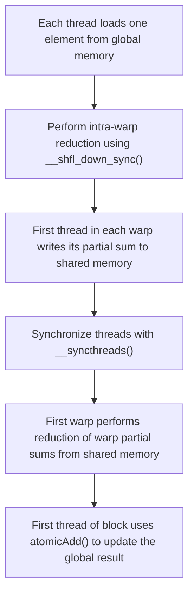

Explanation:
Threads first reduce values within their warp using warp shuffle instructions, then partial sums are combined in shared memory, and finally the block's total is atomically added to the global sum.

## Problem 2: Parallel Array Maximum Using Atomic Operations

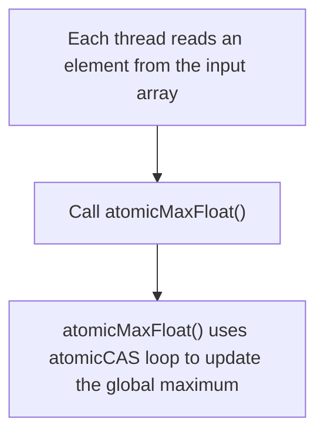

Explanation:
Each thread uses a custom atomic maximum function (using atomicCAS) to update a shared global maximum value safely.

## Problem 3: Vector Addition with Global Memory Coalescing

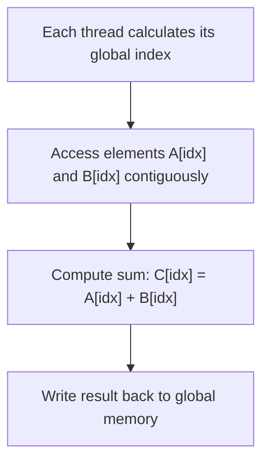

Explanation:
Threads compute contiguous memory addresses for efficient coalesced accesses while performing element-wise addition.

## Problem 4: Matrix Multiplication Using Global Memory

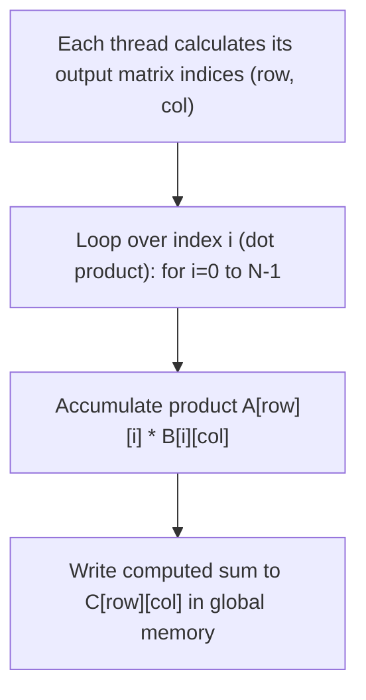

Explanation:
Each thread computes one element of the result matrix by iterating over a row of A and a column of B (dot product), then writing the result to global memory.

## Problem 5: Tiled Matrix Multiplication with Shared Memory

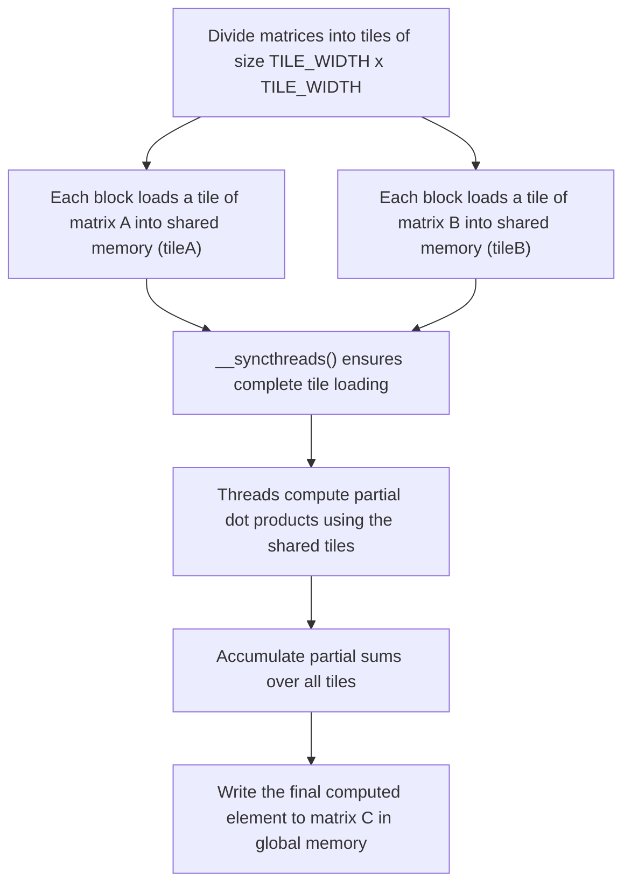

Explanation:
Matrices are partitioned into tiles. Shared memory is used to load each tile; threads synchronize before computing the dot product for each tile, then accumulate the result.

## Problem 6: Parallel Quicksort with In-Place Partitioning (Dynamic Parallelism)

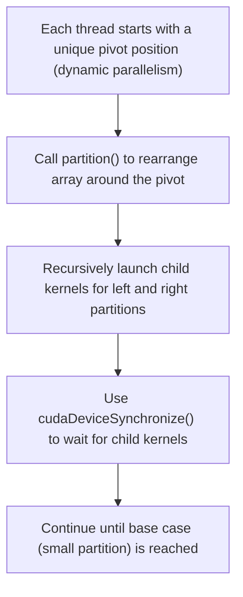

Explanation:
The quicksort algorithm partitions the array and recursively sorts the partitions by launching child kernels, with synchronization after each recursion level.

## Problem 7: Convolution Operation with Variable Kernel Size

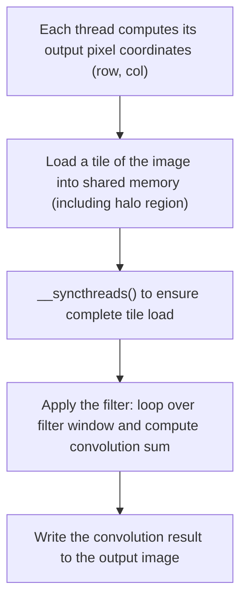

Explanation:
Threads load a tile (with a halo) into shared memory, synchronize, perform the convolution by iterating over the filter window, then write the result back to global memory.

## Problem 8: Iterative Jacobi Solver for Poisson Equation

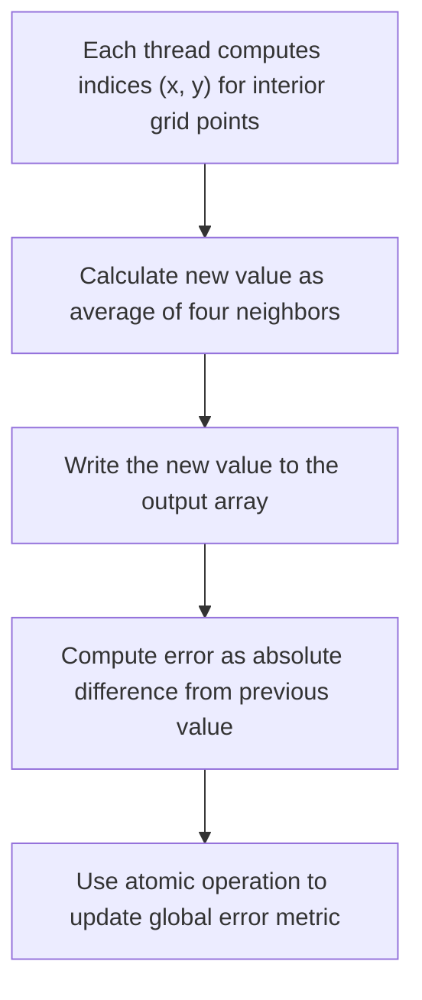

Explanation:
Each thread updates an interior grid cell by averaging its neighbors, computes the local error, and uses an atomic operation to record the maximum error for convergence checking.

## Problem 9: Warp-Level Inclusive Scan (Prefix Sum)

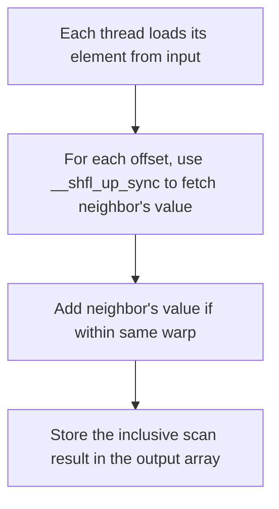

Explanation:
Each thread within a warp performs an inclusive scan using warp shuffle operations, accumulating values from threads above it, and writes the result.

## Problem 10: Breadth-First Search (BFS) with Dynamic Parallelism

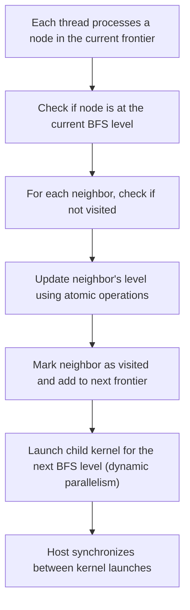

Explanation:
The BFS kernel processes nodes in the current frontier, updates neighbor levels atomically, and uses dynamic parallelism to recursively process subsequent levels.

## Problem 11: Monte Carlo Simulation for Option Pricing

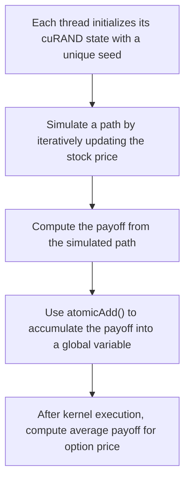

Explanation:
Each thread simulates a Monte Carlo path using cuRAND, computes the payoff, and atomically adds its result to a global sum, which is then averaged to estimate the option price.

## Problem 12: Double-Buffered Tiled Matrix Multiplication

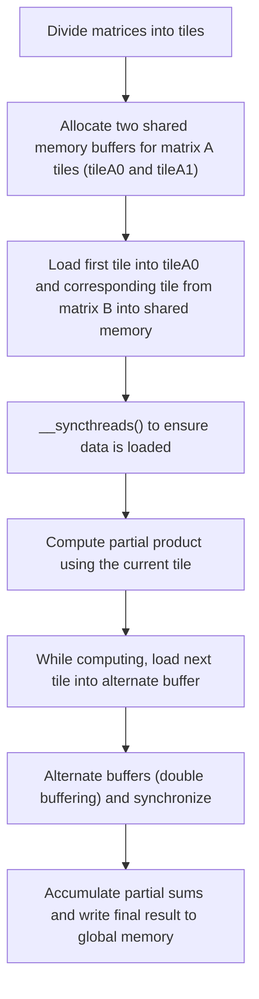

Explanation:
The kernel uses two shared memory buffers to overlap the loading of new data with computation of the current tile, reducing idle time.

## Problem 13: Warp-Level Softmax Computation

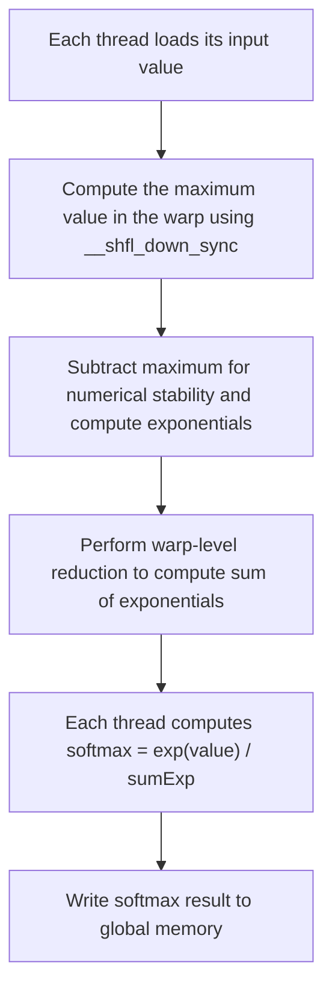

Explanation:
Within each warp, threads compute the maximum, then calculate exponentials and reduce them to get the sum, finally computing the softmax value in a numerically stable manner.

## Problem 14: Parallel N-Queens Solver Using Backtracking

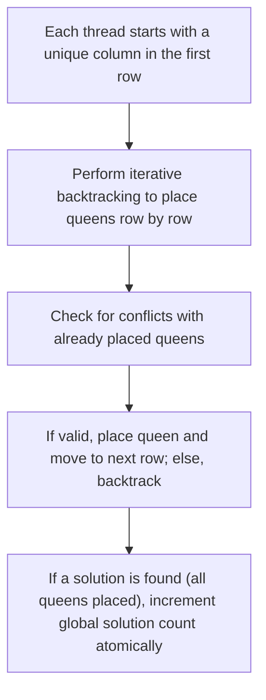

Explanation:
Each thread uses backtracking to solve the N-Queens problem from a unique starting column, updating a global counter for each valid solution found.

## Problem 15: Parallel K-Means Clustering

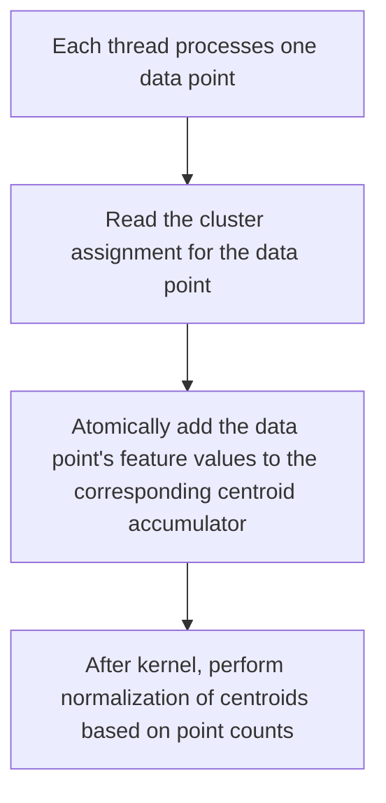

Explanation:
Threads accumulate data for each cluster using atomic operations. After the kernel, centroids are normalized by dividing by the number of points per cluster.

## Problem 16: Sparse PageRank Computation

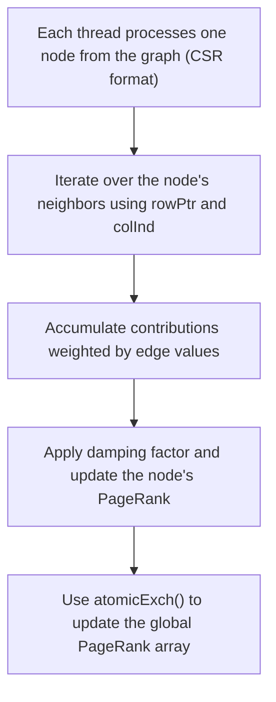

Explanation:
Threads compute the new PageRank for each node by iterating through its neighbors and then update the rank atomically.

## Problem 17: Out-of-Core Matrix Multiplication Using Streams

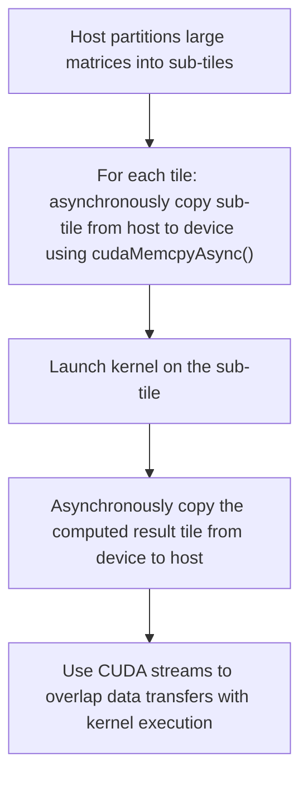

Explanation:
The host divides matrices into tiles that fit in GPU memory. Data transfers and kernel executions are overlapped using CUDA streams, enabling out-of-core computation.

## Problem 18: Jacobi Eigenvalue Solver for a Symmetric Matrix

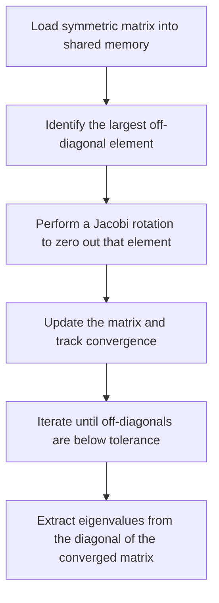

Explanation:
This outline shows the iterative process of the Jacobi method, where the matrix is updated in shared memory until convergence is reached, and eigenvalues are then extracted.

## Problem 19: Cellular Automaton Simulation (Game of Life)

```mermaid
flowchart TD
    A["Each thread computes its cell's coordinates (x, y)"] --> B["Count live neighbors using periodic boundary conditions"]
    B --> C["Apply Game of Life rules to determine the next state"]
    C --> D["Write the updated state to the output grid"]
```

Explanation:
Each thread processes one cell by counting neighbors, applying the Game of Life rules, and updating the cell state accordingly.

## Problem 20: Conjugate Gradient Solver for Sparse Linear Systems

```mermaid
flowchart TD
    A["Each thread computes its component of Ap = A * p"] --> B["Perform a shared memory reduction to compute the dot product of p and Ap"]
    B --> C["Update the solution vector x, residual r, and direction p"]
    C --> D["Check for convergence; if not converged, iterate"]
```

Explanation:
The kernel computes the matrix-vector product and uses reductions and vector updates to perform one iteration of the conjugate gradient method. Further iterations would update vectors and check for convergence.


## 13. References & Further Reading

1. **CUDA C Programming Guide – Introduction & Memory Model**  
   [CUDA C Programming Guide](https://docs.nvidia.com/cuda/cuda-c-programming-guide/index.html)  
   Provides a comprehensive overview of CUDA concepts including memory types and usage.

2. **CUDA C Best Practices Guide**  
   [CUDA C Best Practices Guide](https://docs.nvidia.com/cuda/cuda-c-best-practices-guide/index.html)  
   Detailed best practices for optimizing memory usage and avoiding common pitfalls.

3. **Shared Memory Bank Conflicts**  
   [CUDA Shared Memory Bank Conflicts](https://docs.nvidia.com/cuda/cuda-c-programming-guide/index.html#shared-memory)  
   Specific details on optimizing shared memory accesses and avoiding bank conflicts.

4. **NVIDIA Developer Blog**  
   [NVIDIA Developer Blog](https://developer.nvidia.com/blog/)  
   Articles and case studies on GPU programming techniques and optimization strategies.

5. **"Programming Massively Parallel Processors: A Hands-on Approach" by David B. Kirk and Wen-mei W. Hwu**  
   A comprehensive textbook on GPU architecture and programming techniques.

---

## 14. Conclusion
Day 14 serves as a critical progress checkpoint to consolidate your learning from Days 1–13. In this lesson, you:
- Reviewed the differences between global and shared memory, including their respective roles and optimization techniques.
- Answered quiz questions to verify your understanding.
- Compiled a detailed “lessons learned” list to avoid repeated mistakes.
- Identified common debugging pitfalls and strategies for future development.
