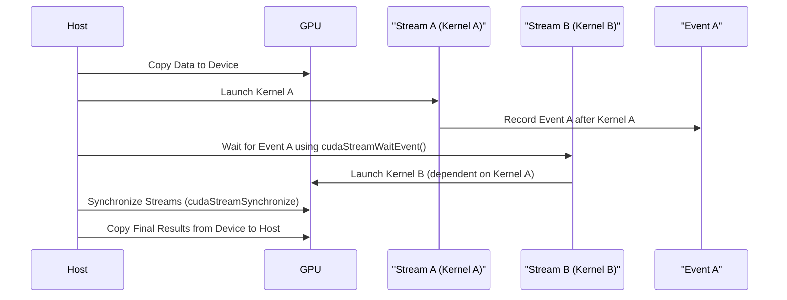

# Day 32: Stream Sync & Dependencies

In this lesson, we explore techniques to enforce execution order between operations across multiple CUDA streams using synchronization primitives such as CUDA events and `cudaStreamWaitEvent()`. Correct stream synchronization is critical to ensure that dependent tasks are executed in the proper order. Forgetting to record an event or not properly waiting on it can result in faulty synchronization and incorrect results.

**Key Concepts:**
- **Stream Synchronization:** Ensuring that operations in one stream wait for operations in another stream to complete.
- **CUDA Events:** Markers that record a timestamp in a stream. They can be used to synchronize streams and measure elapsed time.
- **cudaStreamWaitEvent():** Instructs a stream to wait until a specified event is recorded before continuing execution.
- **Common Pitfalls:** Not recording events or incorrect event handling may lead to faulty synchronization.

**References:**
- [CUDA C Programming Guide – Stream Synchronization](https://docs.nvidia.com/cuda/cuda-c-programming-guide/index.html#stream-synchronization)

---

## Table of Contents

1. [Overview](#overview)
2. [Understanding Stream Synchronization](#understanding-stream-synchronization)
3. [Using CUDA Events and cudaStreamWaitEvent()](#using-cuda-events-and-cudastreamwaitevent)
4. [Practical Exercise: Enforcing Execution Order Across Streams](#practical-exercise-enforcing-execution-order-across-streams)
   - [a) Code Example with Detailed Comments](#a-code-example-with-detailed-comments)
5. [Conceptual Diagrams](#conceptual-diagrams)
6. [Common Debugging Pitfalls](#common-debugging-pitfalls)
7. [References & Further Reading](#references--further-reading)
8. [Conclusion](#conclusion)
9. [Next Steps](#next-steps)

---

## 1. Overview

CUDA streams allow you to queue operations (e.g., kernel launches, memory copies) that can run asynchronously and concurrently. However, when operations across different streams depend on each other, it is necessary to enforce an execution order. This is achieved by:
- Recording events in one stream.
- Making another stream wait on these events using `cudaStreamWaitEvent()`.

Proper synchronization ensures that data produced in one stream is available when needed by another, preventing race conditions and faulty results.

---

## 2. Understanding Stream Synchronization

In CUDA, operations are launched asynchronously in streams. By default, the default stream is synchronous (i.e., blocking), but non-default streams run concurrently. When a kernel in one stream must finish before a kernel in another stream begins (or before a memory copy in another stream starts), you need to synchronize between these streams. This can be done using CUDA events:
- **Record an event** in the stream where the initial operation occurs.
- **Make another stream wait** for that event to complete using `cudaStreamWaitEvent()`.

---

## 3. Using CUDA Events and cudaStreamWaitEvent()

**CUDA Events:**
- `cudaEventCreate()`: Creates an event.
- `cudaEventRecord()`: Records an event in a stream.
- `cudaEventSynchronize()`: Blocks until the event is recorded.
- `cudaEventElapsedTime()`: Computes the time elapsed between two events.

**cudaStreamWaitEvent():**
- `cudaStreamWaitEvent(stream, event, flags)`: Makes all future work in `stream` wait until the `event` is recorded.

This mechanism allows you to enforce that a stream does not start a dependent operation until the required event in another stream has completed.

---

## 4. Practical Exercise: Enforcing Execution Order Across Streams

In this exercise, we simulate a scenario where two kernels in separate streams must execute in a specific order. Kernel A performs an operation (e.g., simple vector addition), and Kernel B depends on the results of Kernel A. We enforce the dependency by recording an event in Stream A and making Stream B wait on that event using `cudaStreamWaitEvent()`.

### a) Code Example with Detailed Comments

```cpp
// streamSyncDependencies.cu
#include <cuda_runtime.h>
#include <stdio.h>
#include <stdlib.h>

// Kernel A: Perform simple vector addition.
__global__ void kernelA(const int *A, const int *B, int *C, int N) {
    int idx = threadIdx.x + blockIdx.x * blockDim.x;
    if (idx < N) {
        C[idx] = A[idx] + B[idx];
    }
}

// Kernel B: Multiply each element by 2 (depends on the output of Kernel A).
__global__ void kernelB(const int *C, int *D, int N) {
    int idx = threadIdx.x + blockIdx.x * blockDim.x;
    if (idx < N) {
        D[idx] = C[idx] * 2;
    }
}

// Macro for error checking.
#define CUDA_CHECK(call) {                                      \
    cudaError_t err = call;                                     \
    if (err != cudaSuccess) {                                   \
        printf("CUDA Error at %s:%d - %s\n", __FILE__, __LINE__, \
               cudaGetErrorString(err));                        \
        exit(EXIT_FAILURE);                                     \
    }                                                           \
}

int main() {
    const int N = 1 << 20; // 1M elements
    size_t size = N * sizeof(int);

    // Allocate host memory.
    int *h_A = (int*)malloc(size);
    int *h_B = (int*)malloc(size);
    int *h_D = (int*)malloc(size);
    if (!h_A || !h_B || !h_D) {
        printf("Failed to allocate host memory\n");
        exit(EXIT_FAILURE);
    }

    // Initialize host arrays.
    for (int i = 0; i < N; i++) {
        h_A[i] = rand() % 100;
        h_B[i] = rand() % 100;
    }

    // Allocate device memory.
    int *d_A, *d_B, *d_C, *d_D;
    CUDA_CHECK(cudaMalloc(&d_A, size));
    CUDA_CHECK(cudaMalloc(&d_B, size));
    CUDA_CHECK(cudaMalloc(&d_C, size));
    CUDA_CHECK(cudaMalloc(&d_D, size));

    // Copy input data from host to device.
    CUDA_CHECK(cudaMemcpy(d_A, h_A, size, cudaMemcpyHostToDevice));
    CUDA_CHECK(cudaMemcpy(d_B, h_B, size, cudaMemcpyHostToDevice));

    // Create two CUDA streams.
    cudaStream_t streamA, streamB;
    CUDA_CHECK(cudaStreamCreate(&streamA));
    CUDA_CHECK(cudaStreamCreate(&streamB));

    // Create a CUDA event to signal the completion of Kernel A.
    cudaEvent_t eventA;
    CUDA_CHECK(cudaEventCreate(&eventA));

    int threadsPerBlock = 256;
    int blocksPerGrid = (N + threadsPerBlock - 1) / threadsPerBlock;

    // Launch Kernel A in streamA.
    kernelA<<<blocksPerGrid, threadsPerBlock, 0, streamA>>>(d_A, d_B, d_C, N);

    // Record eventA in streamA after Kernel A finishes.
    CUDA_CHECK(cudaEventRecord(eventA, streamA));

    // In streamB, wait for eventA to complete before launching Kernel B.
    CUDA_CHECK(cudaStreamWaitEvent(streamB, eventA, 0));

    // Launch Kernel B in streamB.
    kernelB<<<blocksPerGrid, threadsPerBlock, 0, streamB>>>(d_C, d_D, N);

    // Synchronize both streams.
    CUDA_CHECK(cudaStreamSynchronize(streamA));
    CUDA_CHECK(cudaStreamSynchronize(streamB));

    // Copy final results from device to host.
    CUDA_CHECK(cudaMemcpy(h_D, d_D, size, cudaMemcpyDeviceToHost));

    // Verify results (for example, print first 10 elements).
    printf("First 10 elements of final result (Kernel B output):\n");
    for (int i = 0; i < 10; i++) {
        printf("%d ", h_D[i]);
    }
    printf("\n");

    // Cleanup: Free device and host memory, destroy streams and events.
    CUDA_CHECK(cudaFree(d_A));
    CUDA_CHECK(cudaFree(d_B));
    CUDA_CHECK(cudaFree(d_C));
    CUDA_CHECK(cudaFree(d_D));
    free(h_A);
    free(h_B);
    free(h_D);
    CUDA_CHECK(cudaStreamDestroy(streamA));
    CUDA_CHECK(cudaStreamDestroy(streamB));
    CUDA_CHECK(cudaEventDestroy(eventA));

    return 0;
}
```

**Detailed Comments:**
- **Memory Allocation and Initialization:**  
  Host and device memory are allocated for input arrays and output buffers.
- **Kernel A (Vector Addition):**  
  This kernel computes element-wise addition of vectors A and B, storing the result in C.
- **CUDA Event Recording:**  
  After launching Kernel A in `streamA`, we record an event (`eventA`).  
- **Stream Dependency:**  
  In `streamB`, we call `cudaStreamWaitEvent()` so that Kernel B (which multiplies the output of Kernel A by 2) only starts after `eventA` is recorded. This enforces the dependency between Kernel A and Kernel B.
- **Synchronization and Verification:**  
  Both streams are synchronized with `cudaStreamSynchronize()` before copying the final output back to the host for verification.
- **Cleanup:**  
  All allocated resources (device memory, host memory, streams, events) are freed properly.

---

## 5. Conceptual Diagrams

### Diagram 1: Stream Synchronization Using Events

```mermaid
flowchart TD
    A[Host: Allocate and Initialize Data]
    B[Host: Copy Data to Device]
    C[Stream A: Launch Kernel A (Vector Addition)]
    D[Stream A: Record Event A after Kernel A]
    E[Stream B: Wait for Event A (cudaStreamWaitEvent)]
    F[Stream B: Launch Kernel B (Multiply by 2)]
    G[Host: Synchronize Streams]
    H[Host: Copy Final Results from Device to Host]
    
    A --> B
    B --> C
    C --> D
    D --> E
    E --> F
    F --> G
    G --> H
```

*Explanation:*  
- The diagram shows that Kernel A is launched in Stream A, and an event is recorded after its execution.  
- Stream B waits for this event before launching Kernel B, enforcing the proper execution order.

### Diagram 2: Detailed Sequence for Stream Synchronization



*Explanation:*  
- The sequence diagram outlines the steps from copying data, launching kernels, recording events, waiting on events, and synchronizing, ensuring that the dependency is correctly enforced.

---

## 6. Common Debugging Pitfalls

| **Pitfall**                                | **Solution**                                             |
|--------------------------------------------|----------------------------------------------------------|
| Forgetting to record an event before waiting on it | Always call `cudaEventRecord()` in the stream where the dependent operation completes. |
| Not calling `cudaStreamWaitEvent()` in the dependent stream | Ensure that dependent streams use `cudaStreamWaitEvent()` to wait for events from other streams. |
| Not synchronizing streams before copying data back to host | Use `cudaStreamSynchronize()` or `cudaDeviceSynchronize()` to ensure all operations are complete. |
| Incorrect grid or block configuration | Validate your kernel launch parameters to avoid launching with invalid dimensions. |

---

## 7. References & Further Reading

1. **CUDA C Programming Guide – Stream Synchronization**  
   [Stream Synchronization Documentation](https://docs.nvidia.com/cuda/cuda-c-programming-guide/index.html#stream-synchronization)
2. **CUDA C Programming Guide – Events**  
   [CUDA Events Documentation](https://docs.nvidia.com/cuda/cuda-c-programming-guide/index.html#events)
3. **CUDA C Programming Guide – Asynchronous Transfers**  
   [Asynchronous Transfers Documentation](https://docs.nvidia.com/cuda/cuda-c-programming-guide/index.html#asynchronous-transfers)
4. **CUDA C Best Practices Guide**  
   [CUDA Best Practices](https://docs.nvidia.com/cuda/cuda-c-best-practices-guide/index.html)
5. **"Programming Massively Parallel Processors: A Hands-on Approach" by David B. Kirk and Wen-mei W. Hwu**
6. **NVIDIA NSight Systems Documentation**  
   [NVIDIA NSight Systems](https://docs.nvidia.com/nsight-systems/)
7. **NVIDIA Developer Blog**  
   [NVIDIA Developer Blog](https://developer.nvidia.com/blog/)

---

## 8. Conclusion

In Day 32, we thoroughly explored stream synchronization and dependencies:
- We learned how to use CUDA events and `cudaStreamWaitEvent()` to enforce execution order across different CUDA streams.
- We implemented a practical example where Kernel B waits for Kernel A to complete before starting.
- We provided detailed code examples with inline comments and conceptual diagrams to illustrate the logic flow.
- We highlighted common pitfalls and best practices to avoid faulty synchronization.

---

## 9. Next Steps

- **Experiment:**  
  Extend the example by adding more dependent kernels, creating a chain of dependencies across multiple streams.
- **Profile:**  
  Use NVIDIA NSight Systems to monitor the performance impact of stream synchronization and optimize your pipeline.
- **Integrate:**  
  Incorporate these synchronization techniques into larger, more complex applications such as real-time video processing or deep learning inference.
- **Optimize:**  
  Investigate further how stream synchronization affects kernel overlap and adjust your event recording for fine-grained control.

Happy CUDA coding, and continue to explore and optimize stream synchronization for robust, high-performance GPU applications!
```
