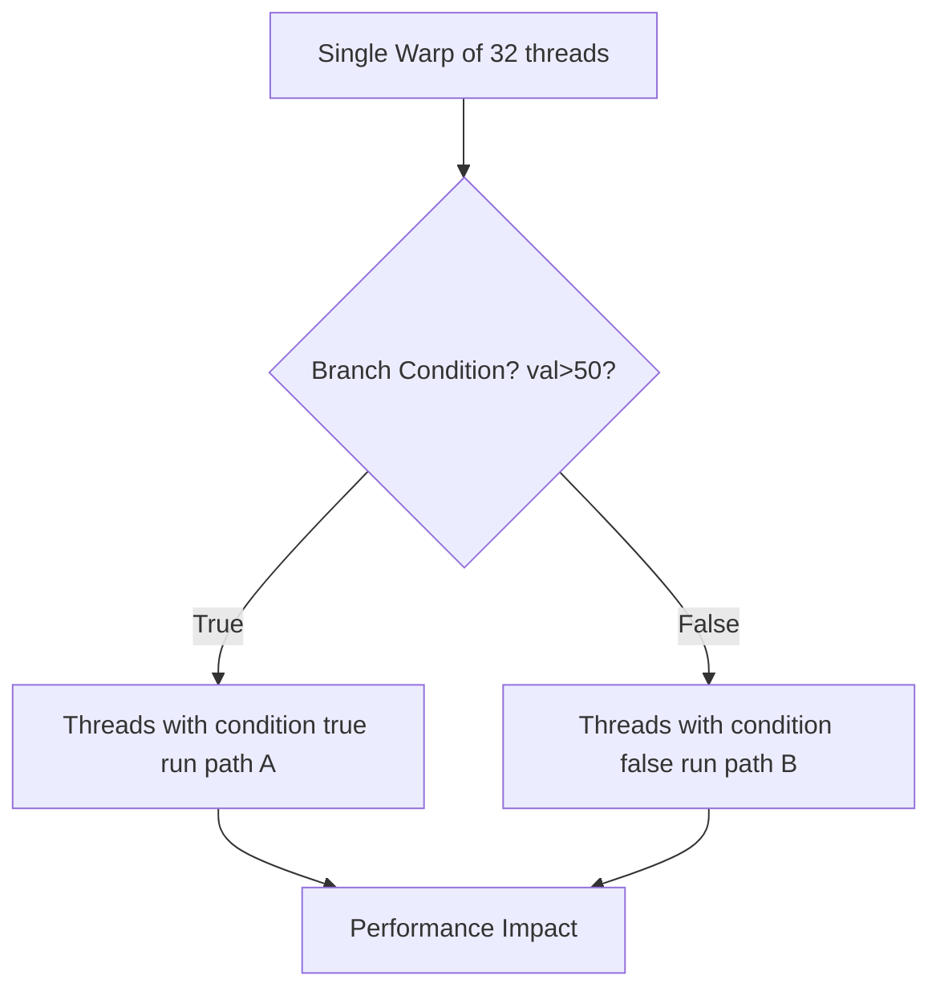

# Day 38: Warp Divergence

**Objective:**  
Learn how **warp divergence** occurs in CUDA due to branching within a warp, measure the performance impact of excessive branching, and discuss how to minimize divergence in your kernels. Warp divergence causes threads within the same warp to **serialize** if they follow different control paths, leading to performance degradation.

**References**:  
- [CUDA C Best Practices Guide – Minimizing Divergence](https://docs.nvidia.com/cuda/cuda-c-best-practices-guide/index.html#minimizing-divergence)  
- [CUDA C Programming Guide – Warps and Divergence](https://docs.nvidia.com/cuda/cuda-c-programming-guide/index.html#warps)

---

## Table of Contents

1. [Overview](#1-overview)  
2. [What is Warp Divergence?](#2-what-is-warp-divergence)  
3. [Practical Exercise: Branching Kernel & Performance Measurement](#3-practical-exercise-branching-kernel--performance-measurement)  
   - [a) Example Divergence Kernel Code](#a-example-divergence-kernel-code)  
   - [b) Measuring Performance & Observing Divergence](#b-measuring-performance--observing-divergence)  
4. [Minimizing Divergence & Best Practices](#4-minimizing-divergence--best-practices)  
5. [Conceptual Diagrams](#5-conceptual-diagrams)  
6. [Common Pitfalls](#6-common-pitfalls)  
7. [References & Further Reading](#7-references--further-reading)  
8. [Conclusion](#8-conclusion)  
9. [Next Steps](#9-next-steps)

---

## 1. Overview

A **warp** is a group of 32 threads executing the same instructions in lockstep. If a warp contains threads that must take different control paths (due to `if` statements, loops, etc.), the GPU **serializes** those branches, causing **warp divergence**. This reduces parallel efficiency because different subsets of threads execute the branch instructions sequentially.

---

## 2. What is Warp Divergence?

- **Definition**: Warp divergence occurs when threads within the same warp follow different **control flows** (branches).  
- **Impact**:
  - The warp must **serialize** each branch path, reducing effective parallelism and throughput.
  - Divergence is especially costly if the branching is frequent or if each branch has significant computation.
- **Cause**:
  - Conditionals (`if-else`), loops, and data-dependent computations that do not unify within a warp.

**Key Note**:  
If all threads in a warp execute the same path, there is **no** divergence. Divergence arises only if some threads differ in their path.

---

## 3. Practical Exercise: Branching Kernel & Performance Measurement

In this exercise, we write a kernel with a **data-dependent branch**. We compare:
1. A version with **significant branching** (leading to divergence).
2. A version with **no or reduced branching**.

### a) Example Divergence Kernel Code

```cpp
// day38_warpDivergence.cu
#include <cuda_runtime.h>
#include <stdio.h>
#include <stdlib.h>
#include <time.h>

__global__ void branchingKernel(const float *input, float *output, int N) {
    int idx = blockIdx.x * blockDim.x + threadIdx.x;
    if (idx < N) {
        float val = input[idx];
        // Data-dependent branch:
        if (val > 50.0f) {
            // Path A: some heavier computation
            // e.g., a loop or more instructions
            output[idx] = val * val;
        } else {
            // Path B: simpler or different operations
            output[idx] = val + 10.0f;
        }
    }
}

__global__ void noBranchKernel(const float *input, float *output, int N) {
    int idx = blockIdx.x * blockDim.x + threadIdx.x;
    if (idx < N) {
        float val = input[idx];
        // A single path that merges both operations
        // to avoid branching. For demonstration only.
        float cond = (val > 50.0f) ? 1.0f : 0.0f;
        // Heavier math:
        float valA = val * val;
        // Lighter math:
        float valB = val + 10.0f;
        // Combine them conditionally without branching:
        output[idx] = cond * valA + (1.0f - cond) * valB;
    }
}

#define CUDA_CHECK(call) {                                     \
    cudaError_t err = call;                                    \
    if(err != cudaSuccess) {                                   \
        printf("CUDA Error at %s:%d - %s\n", __FILE__, __LINE__, \
               cudaGetErrorString(err));                       \
        exit(EXIT_FAILURE);                                    \
    }                                                          \
}

int main() {
    int N = 1 << 20; // 1M
    size_t size = N * sizeof(float);

    // Allocate host memory
    float *h_input = (float*)malloc(size);
    float *h_output = (float*)malloc(size);

    // Init data with random values
    srand(time(NULL));
    for (int i = 0; i < N; i++) {
        h_input[i] = (float)(rand() % 100);
    }

    // Allocate device memory
    float *d_input, *d_output;
    CUDA_CHECK(cudaMalloc(&d_input, size));
    CUDA_CHECK(cudaMalloc(&d_output, size));

    // Copy data to device
    CUDA_CHECK(cudaMemcpy(d_input, h_input, size, cudaMemcpyHostToDevice));

    // Kernel launch config
    int threadsPerBlock = 256;
    int blocksPerGrid = (N + threadsPerBlock - 1) / threadsPerBlock;

    // Branching kernel
    branchingKernel<<<blocksPerGrid, threadsPerBlock>>>(d_input, d_output, N);
    CUDA_CHECK(cudaDeviceSynchronize());

    // Copy results back
    CUDA_CHECK(cudaMemcpy(h_output, d_output, size, cudaMemcpyDeviceToHost));
    printf("branchingKernel - Output sample: %f\n", h_output[N-1]);

    // Clear output
    CUDA_CHECK(cudaMemset(d_output, 0, size));

    // No-branch kernel
    noBranchKernel<<<blocksPerGrid, threadsPerBlock>>>(d_input, d_output, N);
    CUDA_CHECK(cudaDeviceSynchronize());

    // Copy results back
    CUDA_CHECK(cudaMemcpy(h_output, d_output, size, cudaMemcpyDeviceToHost));
    printf("noBranchKernel - Output sample: %f\n", h_output[N-1]);

    // Cleanup
    free(h_input);
    free(h_output);
    CUDA_CHECK(cudaFree(d_input));
    CUDA_CHECK(cudaFree(d_output));
    return 0;
}
```

**Explanation**:  
- `branchingKernel`: Each thread checks `val > 50.0f`, and if yes, does a heavier path. This leads to potential warp divergence if within the same warp, some threads see `val > 50.0f` and others don’t.  
- `noBranchKernel`: We remove explicit branching by computing both results and choosing among them with a **conditional expression**. This can reduce warp divergence at the expense of doing extra computations for some threads.

### b) Measuring Performance & Observing Divergence

To measure the difference:
1. **Compile**  
   ```bash
   nvcc day38_warpDivergence.cu -o day38
   ```
2. **Run** while timing each kernel launch. For a rough measure, add `cudaEventRecord()` calls around each kernel or use `nvprof`, Nsight Systems, or Nsight Compute.
3. Check how many threads see `val > 50.0f`. If ~50% of data is in path A and ~50% in path B, divergence is high.

**Nsight Compute** can also show warp stall reasons. You may see:
- Many stalls in branching kernel due to “**divergent**” or “**inst_exec**” reasons.  
- Fewer stalls in the no-branch approach.

---

## 4. Minimizing Divergence & Best Practices

- **Use Predication**: As shown in `noBranchKernel`, rely on conditional expressions without actual `if-else` statements for warp-scope branching. This can remove or reduce divergence at the cost of extra instructions for some threads.
- **Data Reordering**: If possible, reorder data so that threads within a warp follow similar paths (e.g., grouping large values together so an entire warp takes path A). This is a more advanced approach requiring data transformation.
- **Thread Sorting**: Sorting data to cluster similar conditions. This can reduce divergence but might be expensive if done repeatedly.

---

## 5. Conceptual Diagrams

### Diagram 1: Warp Divergence Flow



**Explanation**:  
- Divergence arises when some threads in the warp go “True,” others “False,” forcing the warp to run path A, then path B sequentially.

### Diagram 2: Predication vs. Branching

```mermaid
flowchart LR
    subgraph Branching
    direction TB
    BA[Thread: if(val>50)] -->BB[Heavy Op for Path A or Light Op for Path B]
    end

    subgraph Predication
    direction TB
    PA[Compute cond = (val>50)?1:0]
    PB[Execute both Ops => combine using cond]
    end
```

**Explanation**:  
- In branching, the warp splits into different paths.  
- In predication or “no branch” approach, all threads do both computations, but combine them with conditional logic in a single flow, possibly removing warp-level branching.

---

## 6. Common Pitfalls

| **Pitfall**                                | **Solution**                                                     |
|--------------------------------------------|------------------------------------------------------------------|
| **Large scale if-else blocks**             | Evaluate a “no-branch” approach or reorganize data.             |
| **Ignoring data distribution**             | If your data rarely triggers path B, divergence is minimal. Or if 50% triggers B, you get heavy divergence. |
| **Excessive predication overhead**         | Sometimes computing both paths is more expensive than branching, so measure performance. |
| **Forgetting other forms of divergence**   | Divergence can also happen in loops or switch statements.        |

---

## 7. References & Further Reading

1. **CUDA C Best Practices Guide – Minimizing Divergence**  
   [Minimizing Divergence Section](https://docs.nvidia.com/cuda/cuda-c-best-practices-guide/index.html#minimizing-divergence)  
2. **CUDA C Programming Guide – Warps**  
   [CUDA Programming Guide Warps](https://docs.nvidia.com/cuda/cuda-c-programming-guide/index.html#warps)  
3. **“Programming Massively Parallel Processors” by Kirk & Hwu**  
   Chapter on divergences and advanced warp-level programming.  
4. **NVIDIA Developer Blog**  
   Articles on warp divergence patterns and optimization.

---

## 8. Conclusion

On **Day 38**, we tackled **Warp Divergence**:

- We explained how **thread-level branching** within a warp can cause serialization, reducing parallel efficiency.
- Showed a **branching** vs. **predication** approach via code examples, clarifying how to measure performance differences.
- Provided **best practices** for mitigating divergence, such as data reordering or using predication to unify code paths.
- Presented **conceptual diagrams** illustrating how divergence splits warp execution paths.

**Key Takeaway**: Minimizing warp divergence can significantly improve performance in branching-heavy kernels. Keep in mind that **predication** may be beneficial, but always measure and compare actual performance.

---

## 9. Next Steps

- **Experiment**: Modify the branching condition in your kernel to see how changing data distribution affects warp divergence.
- **Profile**: Use Nsight Compute or Nsight Systems to see warp-level stall reasons related to divergence or instruction-level predication overhead.
- **Data Reordering**: If feasible, cluster data so that warps follow uniform code paths.
- **Extend**: Combine warp divergence minimization with other optimizations (e.g., coalescing, shared memory usage) for holistic performance gains.

Happy CUDA coding, and continue refining your approach to warp-level branching for more efficient GPU kernels!
```
