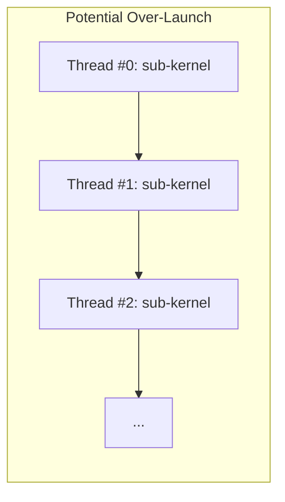

# Day 39: Dynamic Parallelism

**Objective:**  
Explore **Dynamic Parallelism** in CUDA, which allows a kernel to launch **sub-kernels** from within the device. This technique can simplify certain algorithms that involve hierarchical or recursive data structures (e.g., tree traversals, subdivided tasks), but it must be used carefully to avoid over-launching kernels and depleting GPU resources.

**Key Reference:**  
- [CUDA C Programming Guide – “Dynamic Parallelism”](https://docs.nvidia.com/cuda/cuda-c-programming-guide/index.html#dynamic-parallelism)

---

## Table of Contents

1. [Overview](#1-overview)  
2. [What is Dynamic Parallelism?](#2-what-is-dynamic-parallelism)  
3. [Practical Example: Launching Sub-Kernels from a Kernel](#3-practical-example-launching-sub-kernels-from-a-kernel)  
   - [a) Example Use Case Code](#a-example-use-case-code)  
   - [b) Observing Resource Usage](#b-observing-resource-usage)  
4. [Common Pitfalls & Best Practices](#4-common-pitfalls--best-practices)  
5. [Conceptual Diagrams](#5-conceptual-diagrams)  
6. [References & Further Reading](#6-references--further-reading)  
7. [Conclusion](#7-conclusion)  
8. [Next Steps](#8-next-steps)

---

## 1. Overview

Traditional CUDA programming requires **all kernel launches** to originate from the host (CPU). **Dynamic Parallelism** (introduced in CUDA 5.0) allows device code (a kernel) to launch new kernels without returning control to the host. This can be **powerful** for algorithms that benefit from on-demand parallel subdivision of tasks, but it can also be **risky** if too many kernels are launched or if resource usage is not well-managed.

---

## 2. What is Dynamic Parallelism?

- **Definition**: A kernel running on the GPU can itself launch child kernels (sub-kernels) via the standard `<<< >>>` syntax, but from within device code.  
- **Child Kernel Execution**:
  - Child kernels can inherit stream and synchronization behavior from their parent (unless specified otherwise).
  - The GPU handles the scheduling of these sub-kernels, but each launch incurs overhead, and the hardware resources (SMs, registers, memory) can be quickly over-subscribed if used excessively.
- **Use Cases**:
  - Recursive or hierarchical algorithms: e.g., a BFS/DFS that spawns more tasks as it uncovers sub-problems.
  - Adaptive mesh refinement or fractal computations: subdividing domain tasks on-the-fly.
  - Simplifying host-side logic: removing complex host loops or repeated kernel calls by letting the device manage them.

**Potential Gains**:
- **Reduced host-device communication** for iterative or subdividing algorithms.
- More **natural** GPU programming for tree or graph traversals.

**Risks**:
- Over-launching can saturate the GPU, leading to overhead or resource starvation.
- Debugging sub-kernels may be more complex.

---

## 3. Practical Example: Launching Sub-Kernels from a Kernel

### a) Example Use Case Code

Consider a scenario where we want to sum multiple segments of an array, but each segment is discovered dynamically based on some condition. With **dynamic parallelism**, a parent kernel identifies segments, then launches sub-kernels to process those segments.

```cpp
// day39_dynamicParallelism.cu
#include <cuda_runtime.h>
#include <stdio.h>
#include <stdlib.h>

// A sub-kernel to sum a small segment of data
__global__ void sumSegmentKernel(const float* data, float* segmentResult, int start, int length) {
    // We do a simple partial sum in shared memory or direct approach
    extern __shared__ float sdata[];
    int tid = threadIdx.x;
    int globalIdx = start + blockIdx.x * blockDim.x + tid;
    if (tid < length) {
        sdata[tid] = data[globalIdx];
    } else {
        sdata[tid] = 0.0f;
    }
    __syncthreads();

    // Basic reduction
    for(int stride = blockDim.x/2; stride>0; stride >>=1) {
        if(tid < stride) {
            sdata[tid]+= sdata[tid+stride];
        }
        __syncthreads();
    }
    if(tid == 0) {
        segmentResult[blockIdx.x] = sdata[0];
    }
}

// Parent kernel, each thread spawns a sub-kernel for its assigned segment
__global__ void parentKernel(const float* data, float* results, int totalLen) {
    int idx = blockDim.x * blockIdx.x + threadIdx.x;
    if (idx >= totalLen) return;

    // Suppose each thread determines length of segment in some data-driven manner:
    int segLength = 128; // e.g., a fixed chunk or conditional
    int segStart = idx * segLength;
    if (segStart + segLength > totalLen) {
        segLength = totalLen - segStart;
    }

    // If there's a valid segment, launch a sub-kernel to sum that segment
    if(segLength > 0) {
        dim3 block(128,1,1);
        dim3 grid(1,1,1);
        // Launch sub-kernel from device code
        sumSegmentKernel<<<grid, block, block.x*sizeof(float)>>>(data, results+idx, segStart, segLength);
        // Optionally sync here
        cudaDeviceSynchronize();  // can be expensive if done repeatedly
    }
}

#define CUDA_CHECK(call) {                                    \
    cudaError_t err = call;                                   \
    if(err != cudaSuccess) {                                  \
        printf("CUDA Error at %s:%d - %s\n", __FILE__, __LINE__, \
               cudaGetErrorString(err));                      \
        exit(EXIT_FAILURE);                                   \
    }                                                         \
}

int main(){
    // For demonstration
    int N = 1 << 20; // 1M
    size_t size = N * sizeof(float);
    float *h_data = (float*)malloc(size);
    for(int i=0; i<N; i++){
        h_data[i] = 1.0f; // trivial
    }

    float *d_data;
    CUDA_CHECK(cudaMalloc(&d_data, size));
    CUDA_CHECK(cudaMemcpy(d_data, h_data, size, cudaMemcpyHostToDevice));

    // Output array for sub-kernel results
    float *d_results;
    CUDA_CHECK(cudaMalloc(&d_results, N*sizeof(float))); // each thread can store a partial sum

    // Parent kernel config
    dim3 parentBlock(256);
    dim3 parentGrid((N+parentBlock.x-1)/parentBlock.x);

    // Launch parent kernel
    parentKernel<<<parentGrid, parentBlock>>>(d_data, d_results, N);
    CUDA_CHECK(cudaDeviceSynchronize());

    float *h_results = (float*)malloc(N*sizeof(float));
    CUDA_CHECK(cudaMemcpy(h_results, d_results, N*sizeof(float), cudaMemcpyDeviceToHost));

    // Summation check
    double finalSum=0.0;
    for(int i=0;i<N;i++){
        finalSum+= h_results[i];
    }
    printf("Final sum from dynamic sub-kernels= %f\n", finalSum);

    free(h_data);
    free(h_results);
    CUDA_CHECK(cudaFree(d_data));
    CUDA_CHECK(cudaFree(d_results));
    return 0;
}
```

**Explanation**:
- **Parent Kernel** (`parentKernel`) is launched from the host, each thread decides on a segment, then **sub-launches** `sumSegmentKernel()`.  
- The sub-kernel does a simple reduction. Each parent thread writes the segment sum in `results[idx]`.  
- This example is naive in terms of concurrency, can lead to many sub-kernels, illustrating how dynamic parallelism can easily **over-launch**.

### b) Observing Resource Usage

- **Potential Problem**: Each parent thread might launch a kernel. For large N, that’s thousands of sub-kernels—**overkill**.  
- Using **Nsight Systems** can show a massive number of kernel launches in the timeline, leading to overhead or resource depletion.  
- One should measure if dynamic parallelism actually yields benefits or if a more standard approach with host-managed kernel launches is simpler.

---

## 4. Common Pitfalls & Best Practices

1. **Over-Launching**  
   - If each thread or block calls sub-kernels frequently, you might saturate the GPU with too many small kernels.  
   - **Solution**: Aggregate tasks or restructure to fewer sub-kernels.  
2. **Excessive Synchronization**  
   - `cudaDeviceSynchronize()` inside device code is expensive if repeated often.  
   - Consider if the child kernel can run asynchronously.  
3. **Resource Starvation**  
   - Each kernel launch requires SM resources; large numbers of kernels can cause scheduling overhead.  
4. **Debug Complexity**  
   - Debugging sub-kernels is more complex. Use `cudaGetLastError()` after sub-kernel calls, or Nsight tools.  
5. **Know Your Use Case**  
   - Dynamic parallelism is powerful for hierarchical or adaptive algorithms but might hurt performance if not used carefully.

---

## 5. Conceptual Diagrams

### Diagram 1: Dynamic Parallelism Flow

```mermaid
flowchart TD
    A[Host Code: Launch Parent Kernel] --> B[Parent Kernel Running on GPU]
    B --> C{Each Thread decides?}
    C -- Launch sub-kernel --> D[Child Kernel(s)]
    D --> E[Perform computation, store results]
    E --> B
    B --> F[Parent Kernel completes]
    F --> G[Host sync, gather final results]
```

**Explanation**:  
- Shows how each parent kernel thread can spawn a child kernel, which performs further tasks.

### Diagram 2: Potential Over-Launch Problem



**Explanation**:  
- If each thread decides to launch a sub-kernel, the GPU sees thousands of new kernels. This can easily saturate or add overhead, impacting performance.

---

## 6. Common Pitfalls

| **Pitfall**                              | **Solution**                                                                 |
|------------------------------------------|-------------------------------------------------------------------------------|
| Over-launching sub-kernels               | Combine tasks or use a hierarchical approach with fewer calls.               |
| Excessive synchronization in device code | Minimize `cudaDeviceSynchronize()` calls inside parent kernel.               |
| Ignoring concurrency overhead            | Even though sub-kernels can run concurrently, each has scheduling overhead.   |
| Debug difficulty                         | Check `cudaGetLastError()` after sub-kernel calls in device code.            |

---

## 7. References & Further Reading

1. **CUDA C Programming Guide – Dynamic Parallelism**  
   [Dynamic Parallelism Docs](https://docs.nvidia.com/cuda/cuda-c-programming-guide/index.html#dynamic-parallelism)  
2. **NVIDIA Developer Blog**  
   Articles on dynamic parallelism usage, best practices, and examples.  
3. **“Programming Massively Parallel Processors” by Kirk & Hwu**  
   Covers advanced CUDA features including dynamic parallelism in later chapters.

---

## 8. Conclusion

**Day 39** covered **Dynamic Parallelism**:
- **Definition**: Letting device kernels launch sub-kernels.  
- **Usage**: Handy for hierarchical or adaptive algorithms, BFS, tree traversals, etc.  
- **Pitfalls**: Over-launching can quickly lead to overhead or resource depletion.  
- **Example**: We showed a naive approach where each thread spawns a sub-kernel to sum a data segment—illustrating how easy it is to oversubscribe the GPU.  

**Key Takeaway**: Use **dynamic parallelism** when it **naturally simplifies** an algorithm’s structure. Always measure the overhead to confirm performance gains.

---

## 9. Next Steps

1. **Experiment**: Write a BFS or a subdividing fractal generator that uses dynamic parallelism.  
2. **Profile**: Use Nsight Systems to see how many sub-kernel launches occur. Check overhead.  
3. **Optimize**: If over-launching is discovered, aggregate tasks or restructure the approach to limit the number of child kernels.  
4. **Compare**: Implement the same algorithm in a host-driven approach. See which version is simpler and faster.

Happy CUDA coding, and keep mindful of sub-kernel overhead and resource usage with dynamic parallelism!
```
