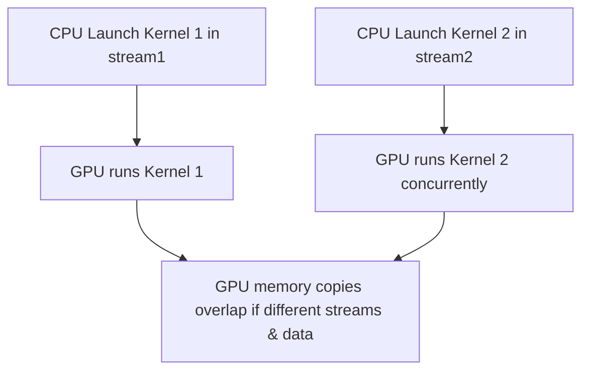
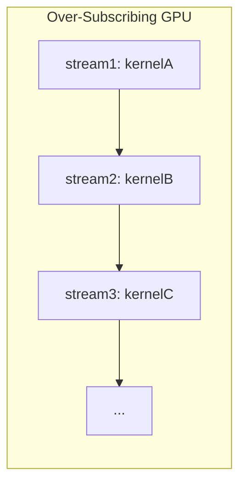

# Day 41: Advanced Streams & Multi-Stream Concurrency

**Objective:**  
Learn to manage **multiple CUDA streams** for **parallel kernel execution** and overlapping data transfers. By exploiting multiple streams, you can improve GPU utilization and reduce idle time. However, **oversubscribing the GPU** with too many streams can saturate resources and degrade performance, so it’s crucial to find a balance.

**Key References**:  
- [CUDA C Programming Guide – Streams](https://docs.nvidia.com/cuda/cuda-c-programming-guide/index.html#streams)  
- [CUDA C Best Practices Guide – Streams & Concurrency](https://docs.nvidia.com/cuda/cuda-c-best-practices-guide/index.html#asynchronous-transfers)

---

## Table of Contents

1. [Overview](#1-overview)  
2. [Benefits of Multiple Streams](#2-benefits-of-multiple-streams)  
3. [Practical Exercise: Parallel Kernel Execution & Overlapping](#3-practical-exercise-parallel-kernel-execution--overlapping)  
   - [a) Example Code Snippet](#a-example-code-snippet)  
   - [b) Observing Concurrency & Pitfalls](#b-observing-concurrency--pitfalls)  
4. [Best Practices for Multi-Stream Usage](#4-best-practices-for-multi-stream-usage)  
5. [Conceptual Diagrams](#5-conceptual-diagrams)  
6. [Common Pitfalls & Debugging](#6-common-pitfalls--debugging)  
7. [References & Further Reading](#7-references--further-reading)  
8. [Conclusion](#8-conclusion)  
9. [Next Steps](#9-next-steps)

---

## 1. Overview

**CUDA streams** are command queues that allow you to run operations asynchronously and concurrently (kernels, memory copies, etc.) on the GPU. By default, operations in the **same stream** occur in order, but operations in **different streams** can overlap if resources are available. This leads to better GPU utilization if kernels or data transfers can run concurrently without interfering.

**However**:
- Creating **too many streams** or launching many tiny kernels can oversubscribe GPU resources, leading to overhead and scheduling bottlenecks.
- Streams must be used judiciously, ensuring concurrency where beneficial and avoiding fragmentation.

---

## 2. Benefits of Multiple Streams

1. **Overlapping**: Memory copies can overlap with kernel execution in another stream if they don’t access the same data.  
2. **Parallel Kernel Execution**: Two or more kernels that use different portions of GPU resources can run concurrently.  
3. **Pipelining**: While one stream processes batch `k`, another stream can transfer data for batch `k+1`.  

**Real-world** examples:
- In neural networks or real-time signal processing, multiple data sets or tasks can be processed in parallel streams.

---

## 3. Practical Exercise: Parallel Kernel Execution & Overlapping

### a) Example Code Snippet

```cpp
// day41_multiStream.cu
#include <cuda_runtime.h>
#include <stdio.h>
#include <stdlib.h>
#include <time.h>

__global__ void vectorAddKernel(const float *A, const float *B, float *C, int N) {
    int idx = blockIdx.x * blockDim.x + threadIdx.x;
    if(idx < N){
        C[idx] = A[idx] + B[idx];
    }
}

#define CUDA_CHECK(call) {                                            \
    cudaError_t err = call;                                           \
    if(err != cudaSuccess) {                                          \
        printf("CUDA Error at %s:%d - %s\n", __FILE__, __LINE__,      \
               cudaGetErrorString(err));                              \
        exit(EXIT_FAILURE);                                           \
    }                                                                 \
}

int main(){
    int N = 1 << 20; // 1M
    size_t size = N * sizeof(float);

    // Allocate host memory
    float *h_A = (float*)malloc(size);
    float *h_B = (float*)malloc(size);
    float *h_C = (float*)malloc(size);
    float *h_D = (float*)malloc(size);

    srand(time(NULL));
    for(int i=0; i<N; i++){
        h_A[i] = (float)(rand() % 100);
        h_B[i] = (float)(rand() % 100);
    }

    // Allocate device memory
    float *d_A1, *d_B1, *d_C1;
    float *d_A2, *d_B2, *d_C2;
    CUDA_CHECK(cudaMalloc(&d_A1, size));
    CUDA_CHECK(cudaMalloc(&d_B1, size));
    CUDA_CHECK(cudaMalloc(&d_C1, size));
    CUDA_CHECK(cudaMalloc(&d_A2, size));
    CUDA_CHECK(cudaMalloc(&d_B2, size));
    CUDA_CHECK(cudaMalloc(&d_C2, size));

    // Create two streams
    cudaStream_t stream1, stream2;
    CUDA_CHECK(cudaStreamCreate(&stream1));
    CUDA_CHECK(cudaStreamCreate(&stream2));

    // Asynchronously copy data to device in two streams
    CUDA_CHECK(cudaMemcpyAsync(d_A1, h_A, size, cudaMemcpyHostToDevice, stream1));
    CUDA_CHECK(cudaMemcpyAsync(d_B1, h_B, size, cudaMemcpyHostToDevice, stream1));

    CUDA_CHECK(cudaMemcpyAsync(d_A2, h_A, size, cudaMemcpyHostToDevice, stream2));
    CUDA_CHECK(cudaMemcpyAsync(d_B2, h_B, size, cudaMemcpyHostToDevice, stream2));

    // Kernel launch config
    int threadsPerBlock = 256;
    int blocksPerGrid = (N + threadsPerBlock -1)/threadsPerBlock;

    // Launch two kernels in parallel streams
    vectorAddKernel<<<blocksPerGrid, threadsPerBlock, 0, stream1>>>(d_A1, d_B1, d_C1, N);
    vectorAddKernel<<<blocksPerGrid, threadsPerBlock, 0, stream2>>>(d_A2, d_B2, d_C2, N);

    // Copy results back from each stream asynchronously
    CUDA_CHECK(cudaMemcpyAsync(h_C, d_C1, size, cudaMemcpyDeviceToHost, stream1));
    CUDA_CHECK(cudaMemcpyAsync(h_D, d_C2, size, cudaMemcpyDeviceToHost, stream2));

    // Synchronize all streams
    CUDA_CHECK(cudaStreamSynchronize(stream1));
    CUDA_CHECK(cudaStreamSynchronize(stream2));

    // Check partial results
    printf("h_C[0] = %f, h_D[0] = %f\n", h_C[0], h_D[0]);

    // Cleanup
    CUDA_CHECK(cudaStreamDestroy(stream1));
    CUDA_CHECK(cudaStreamDestroy(stream2));
    cudaFree(d_A1); cudaFree(d_B1); cudaFree(d_C1);
    cudaFree(d_A2); cudaFree(d_B2); cudaFree(d_C2);
    free(h_A); free(h_B); free(h_C); free(h_D);

    return 0;
}
```

**Explanation**:
- Allocates and copies data for two separate tasks. 
- **Streams** (`stream1` and `stream2`) handle their own data copies and kernel launches. 
- If resources allow, the GPU can run these two vectorAdd kernels concurrently.

### b) Observing Concurrency & Pitfalls

- Use Nsight Systems or Nsight Compute to see whether **both kernels** overlap.  
- If the GPU is **oversubscribed** (e.g., too many small kernels or too many streams), overhead might overshadow concurrency benefits.  

---

## 4. Best Practices for Multi-Stream Usage

1. **Use Streams for Overlapping**: Overlap memory copies with kernel execution or run independent kernels in parallel.  
2. **Avoid Tiny Kernels**: Large overhead may degrade performance if each stream only runs small tasks.  
3. **Ensure Resource Availability**: The GPU can only run so many blocks concurrently. Too many streams might lead to scheduling thrash.  
4. **Measure**: Always measure if concurrency actually speeds up the application.  

---

## 5. Conceptual Diagrams

### Diagram 1: Multi-Stream Timeline



**Explanation**:  
- Shows how each kernel and memory copy can overlap if assigned to different streams.

### Diagram 2: Potential Over-Subscription



**Explanation**:  
- If each stream launches many kernels, the GPU sees an explosion of tasks. Some concurrency is beneficial, but too many small tasks might lead to scheduling overhead.

---

## 6. Common Pitfalls & Debugging

1. **Data Dependencies**  
   - If stream1’s output is needed by stream2, use events or `cudaStreamWaitEvent()` to enforce order.  
2. **Mismatched Memory**  
   - Overlapping memory copies for the same buffer can cause corruption if not carefully managed.  
3. **Host-Side Synchronization**  
   - If you do a `cudaMemcpy()` without specifying a stream, it might implicitly sync the default stream.  
4. **Resource Overload**  
   - Too many concurrency attempts can degrade performance; measure to confirm speedups.

---

## 7. References & Further Reading

1. **CUDA C Programming Guide – Streams**  
   [Stream Documentation](https://docs.nvidia.com/cuda/cuda-c-programming-guide/index.html#streams)  
2. **CUDA C Best Practices Guide – Asynchronous Transfers**  
   [Best Practices: Streams & Overlapping](https://docs.nvidia.com/cuda/cuda-c-best-practices-guide/index.html#asynchronous-transfers)  
3. **NVIDIA Developer Blog**  
   Articles on multi-stream concurrency usage, pitfalls, and examples.

---

## 8. Conclusion

**Day 41** focuses on **Advanced Streams & Multi-Stream Concurrency**:
- **Goal**: Overlap kernel execution or data transfers in separate streams for improved GPU utilization.  
- **Key**: Each stream operates independently, allowing parallelism if the GPU has resources available.  
- **Pitfall**: Over-subscribing the GPU with too many streams or too many small kernels can lead to overhead rather than performance gains.  
- **Example**: Running two vector-add kernels in parallel in different streams to illustrate concurrency.

**Takeaway**: Streams can yield significant performance benefits by overlapping tasks, but must be used carefully to avoid resource saturation or scheduling overhead. Always profile and measure real improvements.

---

## 9. Next Steps

1. **Add Overlapping Mem Copies**: Attempt overlapping large data transfers in one stream with kernel execution in another.  
2. **Experiment**: Increase the number of streams and tasks; measure performance. Identify the sweet spot.  
3. **Enforce Dependencies**: Practice using events (`cudaEvent_t`) and `cudaStreamWaitEvent()` to manage data dependencies among streams.  
4. **Profile**: Use Nsight Systems to visualize concurrency timeline and confirm actual overlaps.

Happy CUDA coding, and keep exploring concurrency for more efficient GPU scheduling!
```
