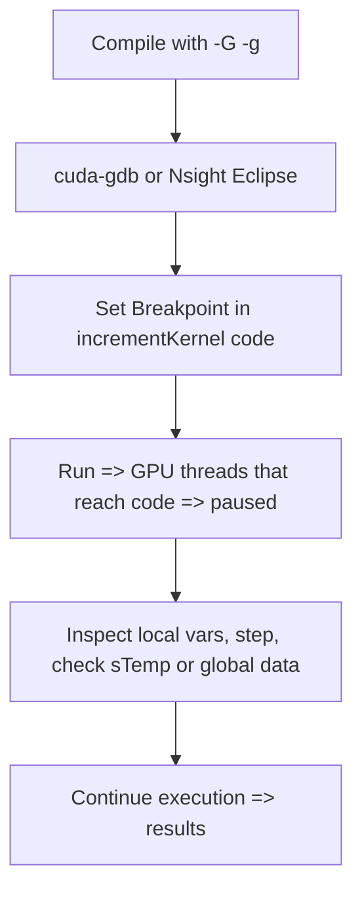

# Day 47: Intermediate Debugging & Profiling Tools

**Objective:**  
Learn how to use **cuda-gdb** or **Nsight Eclipse** for step-by-step debugging of CUDA kernels, set breakpoints, inspect variables, and handle synchronization issues. Debugging GPU code can be trickier than CPU code due to concurrent execution and specialized hardware constraints, so proper techniques (including GPU synchronization points) are crucial. Missing or misplaced sync can produce inconsistent debugging states. We'll also show some *profiling* tips using these tools, although Nsight Systems / Nsight Compute remain primary for advanced profiling.

**Key Reference**:  
- [CUDA Debugger Docs – cuda-gdb](https://docs.nvidia.com/cuda/cuda-gdb/index.html)  
- [Nsight Eclipse Edition Documentation](https://docs.nvidia.com/nsight-eclipse-edition/index.html)

---

## Table of Contents

1. [Overview](#1-overview)  
2. [Why Debugging GPU Code is Special](#2-why-debugging-gpu-code-is-special)  
3. [cuda-gdb Basics: Step-by-Step Example](#3-cuda-gdb-basics-step-by-step-example)  
   - [a) Example Code with Comments](#a-example-code-with-comments)  
   - [b) Using cuda-gdb](#b-using-cuda-gdb)  
4. [Nsight Eclipse for Graphical Debugging](#4-nsight-eclipse-for-graphical-debugging)  
5. [Common Pitfalls & Missing Sync Issues](#5-common-pitfalls--missing-sync-issues)  
6. [Conceptual Diagram](#6-conceptual-diagram)  
7. [References & Further Reading](#7-references--further-reading)  
8. [Conclusion](#8-conclusion)  
9. [Next Steps](#9-next-steps)

---

## 1. Overview

Typical CPU debugging relies on stepping through code in a single thread or process. **GPU debugging** can be more complex:
- Thousands of threads run concurrently, some might never hit breakpoints.
- Warps can reorder or partially mask execution.
- You often need to carefully place **synchronizations** to see consistent states in shared memory or global memory.

**cuda-gdb** extends `gdb` for GPU, letting you:
- Launch or attach to a CUDA application.
- Set breakpoints in host or device code.
- Inspect thread block IDs, warp states, device memory, etc.

**Nsight Eclipse** (on Linux) provides a **GUI** for stepping through device code, setting watchpoints, analyzing variable changes, etc. Great for visually debugging concurrency but requires proper setup.

---

## 2. Why Debugging GPU Code is Special

1. **Concurrent Threads**: Many blocks/warps run in parallel, not all threads will necessarily hit the same breakpoints.  
2. **Divergence**: Some threads might skip certain instructions if they diverge.  
3. **Sync Points**: A lack of synchronization can produce “in-flight” memory states. The debugger might not see final results if you pause too early.  
4. **Device Memory**: Inspecting device arrays must be done carefully; reading large arrays from the debugger can be slow.

---

## 3. cuda-gdb Basics: Step-by-Step Example

### a) Example Code with Comments

```cpp
/**** day47_DebugSample.cu ****/
// We'll create a small kernel that processes an array. We'll set breakpoints in the kernel to see partial data.

#include <cuda_runtime.h>
#include <stdio.h>
#include <stdlib.h>

// A kernel that increments each element and uses shared memory
__global__ void incrementKernel(int *data, int N) {
    // We'll add a debug-friendly variable
    __shared__ int sTemp[256];  // Provide enough space if blockDim.x<=256

    int idx = blockIdx.x * blockDim.x + threadIdx.x;
    int localId = threadIdx.x; // for easier debugging

    // We can watch localId, data, etc.
    if(idx < N){
        // Load to shared memory
        sTemp[localId] = data[idx];
        __syncthreads(); // sync to ensure sTemp is filled

        // Step in debugging: see sTemp, data states
        sTemp[localId] += 100;   // increment
        __syncthreads();

        data[idx] = sTemp[localId]; // store back
    }
}

int main(){
    int N = 1024;
    size_t size = N*sizeof(int);
    int *h_data = (int*)malloc(size);

    // Initialize host array
    for(int i=0; i<N; i++){
        h_data[i] = i;
    }

    int *d_data;
    cudaMalloc(&d_data, size);

    // Copy input
    cudaMemcpy(d_data, h_data, size, cudaMemcpyHostToDevice);

    // Launch kernel
    dim3 block(256);
    dim3 grid((N+block.x-1)/block.x);
    incrementKernel<<<grid, block>>>(d_data, N);

    // Wait for kernel
    cudaDeviceSynchronize();

    // Copy result back
    cudaMemcpy(h_data, d_data, size, cudaMemcpyDeviceToHost);

    // Check a few values
    printf("h_data[0]= %d, h_data[N-1]=%d\n", h_data[0], h_data[N-1]);

    free(h_data);
    cudaFree(d_data);
    return 0;
}
```

**Explanation**:  
- We introduced a **debug-friendly** array `sTemp` in shared memory and a local variable `localId`.  
- This kernel can help us see partial states if we set breakpoints in `incrementKernel()`.

### b) Using cuda-gdb

#### Step 1: Compile with Debug Info
```bash
nvcc -g -G day47_DebugSample.cu -o debugSample
```
- `-g -G` flags keep device debug info unoptimized.

#### Step 2: Run cuda-gdb
```bash
cuda-gdb ./debugSample
```
- Inside the cuda-gdb prompt:
  1. `break incrementKernel` to set a breakpoint at kernel entry.  
  2. `run` to start.  
  3. Once stopped, you can do `info threads`, or `thread 5` to switch to a specific GPU thread.  
  4. `print localId` or `print sTemp[localId]`.  
  5. **Resume** execution with `continue` or step line by line with `step`, `next`.

**Note**: You might see partial/strange behavior if you attempt to step through warp instructions or if multiple blocks skip or reorder. Use carefully placed breakpoints, or set conditions (e.g., `break incrementKernel if blockIdx.x==0 && threadIdx.x==0`).

---

## 4. Nsight Eclipse for Graphical Debugging

- **Nsight Eclipse Edition**: an IDE plugin on Linux for CUDA.  
- You can configure a **CUDA Debug launch**.  
- Set breakpoints in host code or device code lines.  
- The debugger can automatically pause at kernel launch or inside the kernel.  
- Inspect local variables, shared memory, device arrays, etc.  
- **Caveat**: Must set device code to “**Debug**” build. Also, large parallel runs might be hard to debug. Often we reduce grid size for debug sessions.

---

## 5. Common Pitfalls & Missing Sync Issues

1. **Forgetting `__syncthreads()`**  
   - If you place a breakpoint right after writing shared memory but forgot to sync, half of your threads might not have updated sTemp. The debugger sees inconsistent data.  
2. **Kernel Launch Timeout**  
   - On Windows or some Linux configurations with a display GPU, a long breakpoint pause can trigger a watchdog reset.  
3. **Thread Divergence**  
   - Some threads skip the breakpoint if they diverge. You might see only certain warps hitting that line.  
4. **Optimization**  
   - If not compiled with `-G -g`, the device code might be optimized or inlined, making step-by-step debugging difficult.

---

## 6. Conceptual Diagram



**Explanation**:  
- Summarizes the debugging flow from build to stepping in device code.

---

## 7. References & Further Reading

1. **CUDA Debugger Docs**:  
   [cuda-gdb Documentation](https://docs.nvidia.com/cuda/cuda-gdb/index.html)
2. **Nsight Eclipse Edition**:  
   [Nsight Eclipse Documentation](https://docs.nvidia.com/nsight-eclipse-edition/index.html)
3. **NVIDIA Developer Blog** – Articles on advanced GPU debugging approaches.  
4. **“Programming Massively Parallel Processors” by Kirk & Hwu** – Debugging HPC GPU code, references to tools.

---

## 8. Conclusion

**Day 47** focuses on **Intermediate Debugging & Profiling Tools** in CUDA:
- We introduced **cuda-gdb** usage: breakpoints, stepping, thread switching, and variable inspection.  
- We explored **Nsight Eclipse** for a GUI-based debugging environment.  
- We stressed the importance of synchronization points and careful compilation flags (`-G -g`).  
- We also covered pitfalls, like watch out for partial warp breakpoints or kernel timeouts.

**Key Takeaway**:  
GPU debugging can be more complex than CPU debugging. Tools like cuda-gdb or Nsight Eclipse can step into device code, but advanced concurrency and warp-based execution require careful sync and smaller debug kernels for consistent behavior.

---

## 9. Next Steps

- **Practice** debugging a small kernel with a shared memory approach, stepping through to see partial states.  
- **Try** conditional breakpoints (e.g., for a certain blockIdx or threadIdx) to isolate a single thread's path.  
- **Profile** small code with Nsight Eclipse or Nsight Systems to unify debugging + timeline inspection.  
- **Explore** advanced crash or race detection if incorrectly using memory or missing sync.  
```
