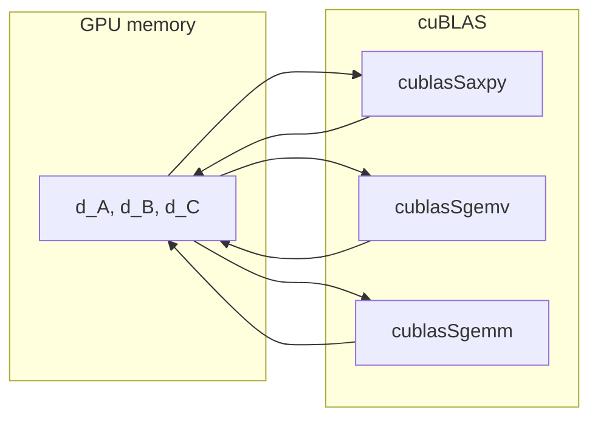
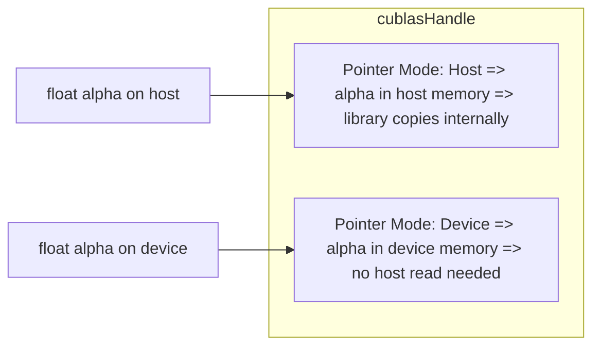

# Day 50: Introduction to cuBLAS

**Objective:**  
Learn how to use the **cuBLAS** library to perform common vector and matrix operations on the GPU. cuBLAS is NVIDIA’s BLAS (Basic Linear Algebra Subprograms) implementation, offering highly optimized routines like vector addition, dot products, and matrix multiplication. We’ll show how to link and initialize cuBLAS, call basic functions (e.g., `cublasSaxpy`, `cublasSgemv`, `cublasSgemm`), and compare performance with custom CUDA kernels.

**Key Reference**:  
- [cuBLAS Library User Guide](https://docs.nvidia.com/cuda/cublas/index.html)

---

## Table of Contents

1. [Overview](#1-overview)  
2. [Why cuBLAS?](#2-why-cublas)  
3. [Basic cuBLAS Workflow](#3-basic-cublas-workflow)  
4. [Practical Example #1: SAXPY with cuBLAS](#4-practical-example-1-saxpy-with-cublas)  
   - [a) Code Snippet & Comments](#a-code-snippet--comments)  
   - [b) Observing Performance vs. Custom Kernel](#b-observing-performance-vs-custom-kernel)  
5. [Practical Example #2: SGEMM (Matrix Multiplication)](#5-practical-example-2-sgemm-matrix-multiplication)  
   - [a) Code Snippet & Comments](#a-code-snippet--comments-1)  
   - [b) Potential Gains from Tensors Cores if Using TF32 or cublasLt](#b-potential-gains-from-tensors-cores-if-using-tf32-or-cublaslt)  
6. [Conceptual Diagrams](#6-conceptual-diagrams)  
7. [Common Pitfalls & Best Practices](#7-common-pitfalls--best-practices)  
8. [References & Further Reading](#8-references--further-reading)  
9. [Conclusion](#9-conclusion)  
10. [Next Steps](#10-next-steps)

---

## 1. Overview

**cuBLAS** is a GPU-accelerated library that implements standard BLAS routines (Level 1, 2, and 3):
- **Level 1**: Vector-vector operations (e.g., `axpy`, dot, scal).
- **Level 2**: Matrix-vector operations (gemv, symv).
- **Level 3**: Matrix-matrix operations (gemm, trsm, etc.).

Because it’s highly optimized (even uses Tensor Cores on modern GPUs for matrix multiply if applicable), it generally outperforms custom kernels for standard linear algebra tasks—**provided** you use it correctly and minimize overhead between calls.

---

## 2. Why cuBLAS?

1. **Performance**:  
   - Hand-optimized by NVIDIA for maximum throughput, often surpassing naive custom kernels.  
2. **Standard BLAS API**:  
   - Familiar routines for many HPC developers, easy to integrate into existing code that uses BLAS naming.  
3. **Reliability**:  
   - cuBLAS is robust, tested extensively, and supports advanced data types (FP16, TF32, FP64, etc.)  

**Potential Drawback**: Overheads if data repeatedly moves from device ↔ host around each routine, or if you have partial custom operations that don’t map well to BLAS. Usually, you keep data on the device to chain multiple cuBLAS calls.

---

## 3. Basic cuBLAS Workflow

1. **Include**: `#include <cublas_v2.h>`  
2. **Initialize**: `cublasCreate(&handle)`  
3. **Set Pointer Modes** if needed (host pointer mode or device pointer mode for alpha/beta).  
4. **Call Routines**: `cublasSaxpy(...)`, `cublasSgemm(...)`, etc.  
5. **Destroy**: `cublasDestroy(handle)` upon completion.

**Data** must be in **device memory**. Usually, we store them in device arrays, pass the pointers to cuBLAS routines along with dimensions and scalars. cuBLAS does the heavy lifting on the GPU.

---

## 4. Practical Example #1: SAXPY with cuBLAS

### a) Code Snippet & Comments

```cpp
/**** day50_cuBLAS_SAXPY.cu ****/
#include <stdio.h>
#include <stdlib.h>
#include <cuda_runtime.h>
#include <cublas_v2.h>

// We'll do y = alpha*x + y
// cublasSaxpy can do this in one call

int main(){
    int N=1<<20;
    size_t size= N*sizeof(float);
    float alpha= 2.5f;

    // Host arrays
    float *h_x=(float*)malloc(size);
    float *h_y=(float*)malloc(size);
    for(int i=0; i<N; i++){
        h_x[i]= (float)(rand()%100);
        h_y[i]= (float)(rand()%100);
    }

    // Device arrays
    float *d_x, *d_y;
    cudaMalloc(&d_x, size);
    cudaMalloc(&d_y, size);
    cudaMemcpy(d_x, h_x, size, cudaMemcpyHostToDevice);
    cudaMemcpy(d_y, h_y, size, cudaMemcpyHostToDevice);

    // Create cuBLAS handle
    cublasHandle_t handle;
    cublasCreate(&handle);

    // cublasSaxpy parameters:
    // handle, n, &alpha, x, incx, y, incy
    // incx=1, incy=1 for contiguous
    cublasSaxpy(handle, N, &alpha, d_x, 1, d_y, 1);

    // Wait, then copy back
    cudaMemcpy(h_y, d_y, size, cudaMemcpyDeviceToHost);
    cudaDeviceSynchronize();

    // Check sample
    printf("After saxpy, h_y[0]=%f\n", h_y[0]);

    // Cleanup
    cublasDestroy(handle);
    cudaFree(d_x); cudaFree(d_y);
    free(h_x); free(h_y);
    return 0;
}
```

**Explanation**:  
- We do a classic **SAXPY**: `y[i] = alpha * x[i] + y[i]`.  
- Instead of writing a custom kernel, we call a single BLAS function.  
- Keep data in device memory, pass pointers to cuBLAS.  
- Copy result back at the end.

### b) Observing Performance vs. Custom Kernel

- A naive custom saxpy kernel is easy to write but might be similarly fast for saxpy. For more complex routines or large data, the well-optimized kernel in cuBLAS can be beneficial.  
- Typically, we see the main overhead is memory-bound. SAXPY is a streaming operation. But using cuBLAS can unify your HPC code style.

---

## 5. Practical Example #2: SGEMM (Matrix Multiplication)

### a) Code Snippet & Comments

```cpp
/**** day50_cuBLAS_SGEMM.cu ****/
#include <stdio.h>
#include <stdlib.h>
#include <cublas_v2.h>
#include <cuda_runtime.h>

// We'll do C = alpha*A*B + beta*C for float data

int main(){
    int N=512;  // NxN
    float alpha=1.0f, beta=0.0f;

    size_t size= N*N*sizeof(float);
    float *h_A=(float*)malloc(size);
    float *h_B=(float*)malloc(size);
    float *h_C=(float*)malloc(size);

    // Initialize data
    for(int i=0; i<N*N; i++){
        h_A[i]= (float)(rand()%5);
        h_B[i]= (float)(rand()%5);
        h_C[i]= 0.0f;
    }

    // Device allocations
    float *d_A, *d_B, *d_C;
    cudaMalloc((void**)&d_A, size);
    cudaMalloc((void**)&d_B, size);
    cudaMalloc((void**)&d_C, size);

    cudaMemcpy(d_A, h_A, size, cudaMemcpyHostToDevice);
    cudaMemcpy(d_B, h_B, size, cudaMemcpyHostToDevice);
    cudaMemcpy(d_C, h_C, size, cudaMemcpyHostToDevice);

    // Create handle
    cublasHandle_t handle;
    cublasCreate(&handle);

    // cublasSgemm => row-major vs col-major considerations
    // By default, cuBLAS uses column-major. Let's treat A,B,C as if they are col-major.
    // If we are storing row-major, we can pass 'C' and 'C' transposes or do a matrix transpose approach.
    // We'll do: C= A*B in row-major by passing 'C' 'C' for transA, transB.

    int lda=N, ldb=N, ldc=N; // leading dimensions
    cublasOperation_t transA= CUBLAS_OP_N;  // no transpose
    cublasOperation_t transB= CUBLAS_OP_N;

    // cublasSgemm(
    // handle, transA, transB,
    // M, N, K,
    // &alpha, d_A, lda, d_B, ldb,
    // &beta, d_C, ldc
    // )
    cublasSgemm(handle,
                transA, transB,
                N,   // M
                N,   // N
                N,   // K
                &alpha,
                d_A, lda,
                d_B, ldb,
                &beta,
                d_C, ldc);

    // Wait & copy back
    cudaDeviceSynchronize();
    cudaMemcpy(h_C, d_C, size, cudaMemcpyDeviceToHost);

    printf("C[0]=%f, C[end]=%f\n", h_C[0], h_C[N*N-1]);

    // Cleanup
    cublasDestroy(handle);
    cudaFree(d_A); cudaFree(d_B); cudaFree(d_C);
    free(h_A); free(h_B); free(h_C);
    return 0;
}
```

**Explanation**:  
- We do `C = alpha*A*B + beta*C` with single precision.  
- We pass `CUBLAS_OP_N` for no-transpose, `N=512` for M, N, K.  
- **Important**: cuBLAS is **column-major** by default. If your data is row-major, you might pass transposes or reorder. This snippet assumes we treat them as column-major logically or you handle the layout carefully.  
- For large matrix multiply, cuBLAS is typically **much faster** than naive custom kernels because it uses block-level optimizations, possibly Tensor Cores on modern GPUs.

### b) Potential Gains from Tensor Cores if Using TF32 or cublasLt

- Modern GPUs can do matrix multiply using Tensor Cores if certain data types (like **TF32** or **FP16**) are used and **cublasLt** or the correct cuBLAS routines are configured.  
- We can see major speedups vs. standard FP32 if you can tolerate the slight precision differences.  
- For advanced use, see **cublasLt** library or set the math mode to `CUBLAS_TENSOR_OP_MATH`.

---

## 6. Mermaid Diagrams

### Diagram 1: cuBLAS Workflow

```mermaid
flowchart TD
    A[Host arrays] --> B[Copy to device memory]
    B --> C[cublasCreate(&handle)]
    C --> D[Call routine (e.g., cublasSaxpy or cublasSgemm) => GPU does operation]
    D --> E[Copy result back to host if needed]
    E --> F[cublasDestroy(handle)]
```

**Explanation**:  
This is the standard sequence for using a cuBLAS function.

### Diagram 2: Linking Multiple BLAS Calls



**Explanation**:  
We keep data in GPU memory, calling multiple BLAS routines in sequence, returning device pointers back. Minimizing host transfers in-between can yield best performance.

---

## 7. Common Pitfalls & Best Practices

1. **Column-Major vs. Row-Major**  
   - By default, BLAS libraries expect column-major storage. If your arrays are row-major (C/C++ standard), you must set transposes or reorder.  
2. **Pointer Mode**  
   - If you want alpha, beta in device memory, call `cublasSetPointerMode(handle, CUBLAS_POINTER_MODE_DEVICE)`. Otherwise, the default is host pointer mode.  
3. **Error Handling**  
   - Always check the return status from each cuBLAS call, e.g.:
     ```cpp
     cublasStatus_t stat = cublasSgemm(...);
     if(stat != CUBLAS_STATUS_SUCCESS) { /* handle error */ }
     ```
4. **Data Transfers**  
   - If you copy data to/from device for each small BLAS call, overhead might overshadow speed gains. Keep data on device as much as possible.  
5. **LD (Leading Dimensions)**  
   - Understand leading dimension arguments for `cublasSgemm` or `cublasSgemv`. If your matrix is stored row-major, you might pass `transA=CUBLAS_OP_T` with `lda = M`, etc.

---

## 8. References & Further Reading

1. **cuBLAS Library User Guide**  
   [Documentation Link](https://docs.nvidia.com/cuda/cublas/index.html)  
2. **NVIDIA Developer Blog** – Articles on advanced cublas usage, cublasLt for tensor cores.  
3. **“Programming Massively Parallel Processors”** by Kirk & Hwu – chapters on using BLAS libraries for HPC.

---

## 9. Conclusion

**Day 50** introduced **cuBLAS**:
- A **GPU-accelerated BLAS** library providing standard linear algebra routines (SAXPY, GEMM, etc.).  
- Minimizes the need for custom kernels for basic vector/matrix ops.  
- Usually **faster** (and definitely simpler) for large standard HPC operations.  
- Must handle **column-major** vs. row-major differences, and watch out for repeated device-host transfers in-between calls.

**Key Takeaway**:  
Leverage cuBLAS for robust, optimized BLAS-level operations on the GPU, focusing on keeping data on the device and ensuring correct data layout. Compare performance to your custom kernels if you suspect specialized patterns might outperform the library.

---

## 10. Next Steps

1. **Try** cublas**Axpy**, cublas**Gemv**, cublas**Gemm** on real HPC tasks to see performance improvements vs. naive kernels.  
2. **Profile** with Nsight Systems or Nsight Compute to confirm speed gains and see if kernel times drop significantly.  
3. **Explore** cublasLt for Tensor Core-optimized matrix multiply if you have Ampere or Turing GPUs.  
4. **Combine** multiple cublas calls in a single pipeline, carefully orchestrating data in device memory.  
```

```
# Day 50 (Extended): Deep Dive into cuBLAS

In this extended discussion for **Day 50**, we go **beyond** the basics of cuBLAS to delve into **advanced usage patterns**, **performance nuances**, and **common pitfalls**. We’ll cover additional code examples (including row-major usage and more complex data flows), highlight **cublasLt** for Tensor Cores, and illustrate how to handle **alpha/beta** in device pointers. We also provide **extensive conceptual diagrams** to visualize how your data and operations flow in cuBLAS-based HPC applications.

---

## Table of Contents

1. [Recap & Why Go Deeper](#1-recap--why-go-deeper)  
2. [Key cuBLAS Data & Execution Modes](#2-key-cublas-data--execution-modes)  
   - [a) Column-Major vs. Row-Major Handling](#a-column-major-vs-row-major-handling)  
   - [b) Host Pointer Mode vs. Device Pointer Mode](#b-host-pointer-mode-vs-device-pointer-mode)  
3. [Advanced Example 1: Row-Major SGEMM with Transpose Flags](#3-advanced-example-1-row-major-sgemm-with-transpose-flags)  
   - [a) Full Code & Comments](#a-full-code--comments)  
   - [b) Diagram: Data Layout Handling](#b-diagram-data-layout-handling)  
4. [Advanced Example 2: cublasLt for Tensor Core Acceleration](#4-advanced-example-2-cublaslt-for-tensor-core-acceleration)  
   - [a) Code Snippet & Explanation](#a-code-snippet--explanation)  
   - [b) Diagram: cublasLt Flow](#b-diagram-cublaslt-flow)  
5. [Error Handling & Debugging in cuBLAS](#5-error-handling--debugging-in-cublas)  
6. [Performance Considerations & Minimizing Transfers](#6-performance-considerations--minimizing-transfers)  
7. [More Detailed Diagrams](#7-more-detailed-diagrams)  
   - [Diagram 1: Device Pointer vs. Host Pointer Mode](#diagram-1-device-pointer-vs-host-pointer-mode)  
   - [Diagram 2: Combining cuBLAS Routines in a Single GPU Pipeline](#diagram-2-combining-cublas-routines-in-a-single-gpu-pipeline)  
8. [Common Pitfalls & Best Practices (Extended)](#8-common-pitfalls--best-practices-extended)  
9. [References & Further Reading](#9-references--further-reading)  
10. [Conclusion](#10-conclusion)  
11. [Next Steps](#11-next-steps)

---

## 1. Recap & Why Go Deeper

**Day 50** introduced the basics of cuBLAS, focusing on how to:
- Create/destroy a cublas handle.
- Use routines like `cublasSaxpy` and `cublasSgemm`.
- Compare performance vs. naive kernels.

**Why go deeper?** Because real HPC or deep-learning pipelines often require:
- Handling **row-major data** in a library defaulting to **column-major**.
- Setting up advanced **alpha/beta** pointer modes to minimize overhead.
- Using **Tensor Cores** via `cublasLt` for large matrix multiplies or specialized data types (FP16, TF32).
- Carefully orchestrating data flows to avoid repeated host ↔ device transfers.

---

## 2. Key cuBLAS Data & Execution Modes

### a) Column-Major vs. Row-Major Handling

**BLAS** is historically **column-major**. If your arrays are in row-major (C/C++ default), you must do one of the following:

1. **Transpose** your data: Copy or rearrange your row-major matrix into a column-major buffer before calling cuBLAS.  
2. **Use Transpose Flags** in the cuBLAS call:  
   - For example, if your A is row-major, you can pass `CUBLAS_OP_T` to treat it as transposed, effectively bridging row-major to column-major logic.

**Example**: For a NxN row-major matrix `A`, you can pass `(transA = CUBLAS_OP_T, M=N, K=N, lda=N)` so that cuBLAS sees the “transposed” matrix, which is effectively your normal row storage.

### b) Host Pointer Mode vs. Device Pointer Mode

- **Host Pointer Mode** (Default): The scalars alpha and beta are passed as host pointers, e.g. `&alpha`, `&beta`. cuBLAS copies them internally.  
- **Device Pointer Mode**: If you want alpha and beta to be in device memory, do:
  ```cpp
  cublasSetPointerMode(handle, CUBLAS_POINTER_MODE_DEVICE);
  ```
  Then pass device pointers for alpha/beta. This can help if you’re chaining many calls or if alpha/beta is computed on device.

---

## 3. Advanced Example 1: Row-Major SGEMM with Transpose Flags

We implement **C = alpha * A(row-major) * B(row-major) + beta * C**, using cuBLAS’s column-major assumption but setting the correct transpose flags.

### a) Full Code & Comments

```cpp
/**** day50b_cuBLAS_rowMajorSgemm.cu ****/
#include <stdio.h>
#include <stdlib.h>
#include <cublas_v2.h>
#include <cuda_runtime.h>

// We'll do a matrix multiply with row-major data. We'll pass transA and transB as 'CUBLAS_OP_T'
// to effectively treat them as col-major in cuBLAS logic.

int main(){
    int N=4; // small for demonstration
    float alpha=1.0f, beta=0.0f;

    // Host row-major arrays
    float A[]={
        1,2,3,4,
        5,6,7,8,
        9,10,11,12,
        13,14,15,16
    }; // row-major
    float B[]={
        1,2,3,4,
        2,3,4,5,
        3,4,5,6,
        4,5,6,7
    };
    float C[16]={0}; // row-major result

    // Device memory
    float *d_A, *d_B, *d_C;
    int size= N*N*sizeof(float);
    cudaMalloc(&d_A, size);
    cudaMalloc(&d_B, size);
    cudaMalloc(&d_C, size);

    cudaMemcpy(d_A, A, size, cudaMemcpyHostToDevice);
    cudaMemcpy(d_B, B, size, cudaMemcpyHostToDevice);
    cudaMemcpy(d_C, C, size, cudaMemcpyHostToDevice);

    // Setup cublas
    cublasHandle_t handle;
    cublasCreate(&handle);

    // We'll pass transA= 'CUBLAS_OP_T' because our A is row-major => treat as transpose for col-major
    // similarly for B if also row-major
    cublasOperation_t transA = CUBLAS_OP_T;
    cublasOperation_t transB = CUBLAS_OP_T;

    int lda=N, ldb=N, ldc=N;
    // Because from cuBLAS perspective, matrix dimension is reversed if trans= T. But effectively we
    // do a NxN multiply. We pass M=N, N=N, K=N for the shapes, or if we want to be fully correct:
    // (N, N, N)...

    cublasSgemm(handle, 
                transA, transB,
                N, // M
                N, // N
                N, // K
                &alpha,
                d_A, lda,
                d_B, ldb,
                &beta,
                d_C, ldc);

    cudaDeviceSynchronize();
    cudaMemcpy(C, d_C, size, cudaMemcpyDeviceToHost);

    // Print partial
    printf("Result matrix C row-major:\n");
    for(int i=0;i<N;i++){
        for(int j=0;j<N;j++){
            printf("%f ", C[i*N + j]);
        }
        printf("\n");
    }

    cublasDestroy(handle);
    cudaFree(d_A);cudaFree(d_B);cudaFree(d_C);
    return 0;
}
```

**Explanation**:
- We define `A` and `B` in row-major order.  
- By passing `CUBLAS_OP_T` for each, cuBLAS interprets them as transposed column-major => effectively we’re doing a normal row-major multiply from our perspective.  
- The result `C` is also stored in row-major, but we pass `N,N` etc. carefully.  

### b) Diagram: Data Layout Handling

```mermaid
flowchart LR
    subgraph Host Row-Major
    RA[Matrix A row-major]
    RB[Matrix B row-major]
    end

    subgraph GPU
    direction TB
    devA[d_A]
    devB[d_B]
    devC[d_C]
    cublasSGEMM[ cublasSgemm( transA=OpT, transB=OpT ) ]
    end

    RA --> devA
    RB --> devB
    devA --> cublasSGEMM
    devB --> cublasSGEMM
    cublasSGEMM --> devC
    devC --> ReturnC[Row-major C on host]
```

---

## 4. Advanced Example 2: cublasLt for Tensor Core Acceleration

**cublasLt** is a newer library that extends cuBLAS with **matrix layouts** and better control for using **Tensor Cores**. We show a simple snippet for a gemm with half-precision or TF32.

### a) Code Snippet & Explanation

```cpp
/**** day50b_cuBLASLt_TensorCore.cu ****/
#include <cuda_runtime.h>
#include <cublasLt.h>
#include <stdio.h>

// This is a skeleton. cublasLt requires more parameters (descriptor creation).
// We'll show minimal usage for demonstration.

int main(){
    cublasLtHandle_t ltHandle;
    cublasLtCreate(&ltHandle);

    // Usually we create cublasLtMatmulDesc, cublasLtMatrixLayout for A,B,C,
    // specify math mode (CUBLAS_TENSOR_OP_MATH), etc.

    // e.g. cublasLtMatrixLayout_t layoutA, layoutB, layoutC;
    // cublasLtMatrixLayoutCreate(...)
    // cublasLtMatmulDesc_t matmulDesc;
    // cublasLtMatmulDescCreate(...)
    // set alpha, beta in device pointer if we want
    // then cublasLtMatmul(ltHandle, matmulDesc, &alpha, A, layoutA, B, layoutB, &beta, C, layoutC, C, layoutC, ...)

    // For brevity, omitted the full code. cublasLt is more verbose but can yield significant performance.

    cublasLtDestroy(ltHandle);
    return 0;
}
```

**Explanation**:
- `cublasLt` approach involves more descriptor-based calls. However, it can tap **Tensor Cores** automatically for faster matrix multiply if your GPU is Ampere or later, and data types are half/TF32.  
- For big HPC or deep learning tasks, cublasLt can significantly outperform standard cublasSgemm in some scenarios.

### b) Diagram: cublasLt Flow

```mermaid
flowchart TD
    A[cublasLtCreate(&ltHandle)] --> B[Create MatmulDesc, LayoutDesc for A,B,C]
    B --> C[cublasLtMatmul(..., &alpha, d_A, layoutA, d_B, layoutB, &beta, d_C, layoutC, ...)]
    C --> D[Tensor Cores used if data type and GPU arch support]
    D --> E[Destroy descriptors, ltHandle]
```

---

## 5. Error Handling & Debugging in cuBLAS

- **Check status** after each call:
  ```cpp
  cublasStatus_t stat = cublasSgemm(...);
  if(stat != CUBLAS_STATUS_SUCCESS){
      fprintf(stderr, "CUBLAS Sgemm failed with status %d\n", stat);
      // handle error
  }
  ```
- Common errors: `CUBLAS_STATUS_INVALID_VALUE`, `CUBLAS_STATUS_ARCH_MISMATCH`, or `CUBLAS_STATUS_ALLOC_FAILED`.

**Debugging**:
- For advanced debugging, use `cuda-gdb` or Nsight with a device code that calls cuBLAS. You can step into the library stubs, though not typically the library’s internal code since it’s closed source.

---

## 6. Performance Considerations & Minimizing Transfers

1. **Chain Multiple Operations**  
   - Keep data in device memory across multiple cuBLAS calls, e.g., do a series of gemv or saxpy calls back-to-back.  
2. **Stream Usage**  
   - cuBLAS can run in a user-provided stream. `cublasSetStream(handle, stream)`. This allows concurrency with other operations if GPU resources are available.  
3. **Large Data**  
   - For large matrix ops, ensure your GPU memory is sufficient. If partial out-of-core is needed, you might handle chunking manually.  
4. **Tensor Core Math**  
   - If your data fits half or TF32 usage, enabling tensor ops can yield big speed-ups.

---

## 7. More Detailed Diagrams

### Diagram 1: Device Pointer vs. Host Pointer Mode



**Explanation**:  
- `cublasSetPointerMode(handle, CUBLAS_POINTER_MODE_HOST)` or `CUBLAS_POINTER_MODE_DEVICE`.

### Diagram 2: Combining cuBLAS Routines in a Single GPU Pipeline

```mermaid
flowchart TD
    A[Host -> device data: d_in1, d_in2, d_out]
    A --> B[SAXPY => cublasSaxpy()]
    B --> C[SGEMM => cublasSgemm()]
    C --> D[Reduction => cublasSdot or reduce]
    D --> E[Device -> Host final]
```

---

## 8. Common Pitfalls & Best Practices (Extended)

1. **Row/Col Major Confusion**  
   - Double-check your trans flags or reorder data if your code is row-major.  
2. **Forgetting `cublasDestroy`**  
   - Always call `cublasDestroy(handle)` to free internal resources.  
3. **Multiple Streams**  
   - If using multiple streams, ensure `cublasSetStream(handle, stream)` is done for each operation or maintain separate handles for concurrency.  
4. **Mixed Data Types**  
   - Passing float pointers to a half-precision routine => incorrect results.  
5. **Beta Usage**  
   - `beta=1.0f` means partial results are added to existing C. If you forget to set `beta=0.0f`, you might incorrectly accumulate old data in C.

---

## 9. References & Further Reading

- [cuBLAS Library User Guide](https://docs.nvidia.com/cuda/cublas/index.html)  
- [“Programming Massively Parallel Processors” by Kirk & Hwu] – BLAS usage in HPC.  
- [NVIDIA Developer Blog](https://developer.nvidia.com/blog/) – cublasLt usage, half-precision/Tensor Core gemm examples.

---

## 10. Conclusion

**Day 50b** – an **extended** look at **cuBLAS**:

- We explained how to handle **row-major** data in a column-major library via transpose flags.  
- We introduced advanced pointer modes, **cublasLt** for Tensor Cores, and how to handle error codes.  
- We provided multiple code snippets showing real integration steps for typical HPC tasks (SAXPY, SGEMM).  
- We emphasized the importance of **keeping data on the device** to minimize transfers, and debugging / error-checking best practices.

**Key Takeaway**:  
cuBLAS is a robust, high-performance library for standard linear algebra tasks on the GPU. By mastering advanced usage patterns—**row-major** bridging, **pointer modes**, **cublasLt**—you can further optimize or handle special data types (FP16, TF32). Combine multiple cuBLAS calls in a single pipeline to maximize GPU throughput, and always profile to confirm performance gains.

---

## 11. Next Steps

1. **Integrate** cublasLt in your matrix multiply code to see if Tensor Cores yield a big performance boost.  
2. **Experiment** with partial row-major data or submatrix operations.  
3. **Multi-stream concurrency**: Launch multiple cuBLAS calls in parallel if your GPU can handle concurrency.  
4. **Profile** with Nsight Systems or Nsight Compute to confirm the kernel times, concurrency, and bandwidth usage.  
5. **Expand** to other routines: cublasSgemv, cublasStrsv, cublasSgetrfBatched, etc., depending on HPC or deep learning needs.  
```
