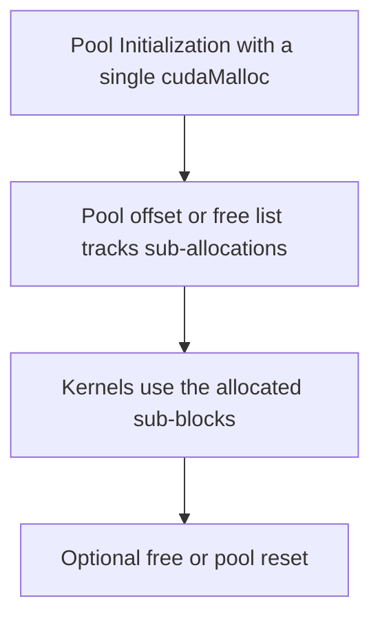

# Day 68: Memory Pool & Custom Allocators

Most CUDA applications rely on frequent allocations and deallocations of device memory (e.g., `cudaMalloc` and `cudaFree`), which can introduce performance overhead and fragmentation. By implementing **memory pools** or **custom allocators**, you can reuse chunks of device memory, reduce the overhead of repeated allocations, and gain more control over how GPU memory is managed. However, care must be taken to ensure these techniques remain safe under complex scenarios like dynamic parallelism.

---

## Table of Contents

1. [Overview](#1-overview)  
2. [Why Memory Pools?](#2-why-memory-pools)  
3. [Implementation Approaches](#3-implementation-approaches)  
   - [a) Custom Allocator Design](#a-custom-allocator-design)  
   - [b) Using cudaMallocAsync](#b-using-cudamallocasync)  
4. [Code Example: Simple Device Memory Pool](#4-code-example-simple-device-memory-pool)  
   - [Explanation & Comments](#explanation--comments)  
5. [Performance Considerations & Common Pitfalls](#5-performance-considerations--common-pitfalls)  
6. [Conceptual Diagrams](#6-conceptual-diagrams)  
7. [References & Further Reading](#7-references--further-reading)  
8. [Conclusion](#8-conclusion)  
9. [Next Steps](#9-next-steps)

---

## 1. Overview

**Repeated device memory allocations** (via `cudaMalloc`) can be costly for applications that frequently allocate and free buffers in short time intervals. A **memory pool** (or custom allocator) reduces this overhead by:
- Pre-allocating a large region of device memory.
- Subdividing and reusing it for various buffers.
- Tracking allocations and deallocations internally to avoid repeated calls to the CUDA runtime.

However, these approaches add complexity: you must manage fragmentation, concurrency, and safety under dynamic parallelism or multi-threaded host code.

---

## 2. Why Memory Pools?

- **Reduced Allocation Overhead:**  
  Minimizing calls to `cudaMalloc/cudaFree` significantly reduces runtime overhead in applications that frequently request and release small buffers.
- **Fragmentation Control:**  
  A custom allocator can maintain contiguous device memory regions, preventing fragmentation that might occur with repeated random allocations.
- **Custom Policies:**  
  Allows specialized allocation strategies, such as bucket allocators for known buffer sizes or caching allocators that keep frequently requested sizes available.

---

## 3. Implementation Approaches

### a) Custom Allocator Design

1. **Initial Pool Allocation:**  
   Pre-allocate a large chunk of device memory with a single `cudaMalloc`.
2. **Subdividing Memory:**  
   Maintain metadata (e.g., a free list) to track which segments are available.  
3. **Request/Release Buffers:**  
   On an allocation request, provide a segment from the free list. On release, return it to the free list.  
4. **Thread Safety:**  
   If you have multiple host threads or use dynamic parallelism, concurrency control (mutexes, atomic ops) is required.

### b) Using cudaMallocAsync
- **Async Memory Allocations:**  
  CUDA 11.2 introduced `cudaMallocAsync` and `cudaFreeAsync`, which can allocate and free device memory in a stream, using an internal memory pool managed by the CUDA driver.
- **Easy Setup:**  
  Eliminates the need to manually implement your own pool logic.  
- **Caveat:**  
  Not fully thread-safe under all conditions, and you must enable a per-device pool with `cudaDeviceSetMemPool` if you need more advanced usage.

---

## 4. Code Example: Simple Device Memory Pool

Below is a conceptual example of a **custom memory pool** that subdivides a fixed-size region of device memory. This example is simplified and not thread-safe, but illustrates the essential steps.

```cpp
// File: custom_mem_pool.cu
#include <cuda_runtime.h>
#include <stdio.h>
#include <vector>

struct DeviceMemoryPool {
    // Pointer to the start of the pool
    char *poolStart;
    size_t poolSize;
    // Simple free pointer offset
    size_t offset;

    DeviceMemoryPool() : poolStart(nullptr), poolSize(0), offset(0) {}

    // Initialize the pool with a single cudaMalloc
    void init(size_t size) {
        cudaMalloc(&poolStart, size);
        poolSize = size;
        offset = 0;
    }

    // Simple allocate function
    void* allocate(size_t size) {
        // align size if needed
        size_t newOffset = offset + size;
        if (newOffset > poolSize) {
            // Out of pool memory
            return nullptr;
        }
        // Return the pointer at current offset
        void* ptr = (void*)(poolStart + offset);
        offset = newOffset;
        return ptr;
    }

    // In a real pool, you’d free or track sub-blocks. This example is naive.
    void freeAll() {
        offset = 0; // Reset entire pool
    }

    // Cleanup
    void destroy() {
        cudaFree(poolStart);
        poolStart = nullptr;
    }
};

__global__ void sampleKernel(float *data, int N) {
    int idx = blockIdx.x * blockDim.x + threadIdx.x;
    if (idx < N) {
        data[idx] = data[idx] + 1.0f;
    }
}

int main() {
    DeviceMemoryPool pool;
    // For demonstration, allocate a 32 MB pool
    size_t poolBytes = 32 * 1024 * 1024;
    pool.init(poolBytes);

    // Attempt to allocate a 10 million float array from the pool
    size_t N = 10000000;
    size_t allocSize = N * sizeof(float);
    float* d_data = (float*) pool.allocate(allocSize);
    if (!d_data) {
        printf("Pool allocation failed.\n");
        return 0;
    }

    // Initialize device memory with zeros
    cudaMemset(d_data, 0, allocSize);

    // Launch a kernel
    int threadsPerBlock = 256;
    int blocksPerGrid = (int)((N + threadsPerBlock - 1) / threadsPerBlock);
    sampleKernel<<<blocksPerGrid, threadsPerBlock>>>(d_data, N);
    cudaDeviceSynchronize();

    // Copy results back for demonstration
    std::vector<float> h_data(N);
    cudaMemcpy(h_data.data(), d_data, allocSize, cudaMemcpyDeviceToHost);
    printf("Sample output[0] after kernel = %f\n", h_data[0]);

    // Cleanup
    pool.destroy();
    return 0;
}
```

### Explanation & Comments

1. **Single cudaMalloc**: The pool is initialized once, acquiring a large region of device memory.  
2. **allocate**: Sub-allocations are doled out from the pool via a simple offset pointer. (This example lacks free logic for sub-blocks.)  
3. **Kernel**: Uses the allocated memory as it would any `cudaMalloc` pointer.  
4. **Simplifications**: Not thread-safe, no free() for partial blocks—only `freeAll()` to reset.

---

## 5. Performance Considerations & Common Pitfalls

- **Safety Under Dynamic Parallelism**: If child kernels allocate from your custom pool, thread safety is crucial to avoid overlapping allocations.  
- **Memory Fragmentation**: A naive offset approach works if allocations follow an allocate-all, then release-all pattern, but for more complex usage, a robust free list is needed.  
- **Oversubscription**: If the pool is too small, sub-allocations can fail, forcing fallback to `cudaMalloc`.  
- **cudaMallocAsync**: Eases implementation, but requires a modern driver and environment that supports asynchronous memory pools.

---

## 6. Conceptual Diagrams



**Explanation**:  
1. A large chunk of device memory is allocated at initialization.  
2. The custom allocator tracks sub-blocks (offset approach or free list).  
3. Kernels process data using these sub-blocks.  
4. The pool eventually frees or resets memory for reuse.

---

## 7. References & Further Reading

- [cudaMallocAsync Documentation](https://docs.nvidia.com/cuda/cuda-runtime-api/group__CUDA__MEM.html#group__CUDA__MEM_1g79bef6f9633e60726942b828a130105b)  
- [NVIDIA Blog – Memory Pool and Allocators for GPUs](https://developer.nvidia.com/blog/tag/memory-pool/)  
- [Nsight Systems – Analyzing Memory Allocations](https://developer.nvidia.com/nsight-systems)  
- [Custom Allocators in HPC Apps – Best Practices Guide](https://docs.nvidia.com/cuda/cuda-c-best-practices-guide/index.html)

---

## 8. Conclusion

A **memory pool** or **custom allocator** can significantly reduce the overhead of repeated `cudaMalloc/cudaFree` calls in applications that frequently allocate device memory. By maintaining a single large region and reusing it for multiple buffers, you minimize runtime overhead and better control fragmentation. However, designing these allocators requires thoughtful consideration of concurrency, thread safety, and usage patterns—especially if dynamic parallelism or advanced multi-threading is involved. Alternatively, `cudaMallocAsync` can serve as a simpler approach to memory pooling, though it may not meet all specialized needs.

---

## 9. Next Steps

1. **Extend the Pool**: Implement a more sophisticated free-list approach that allows sub-block freeing.  
2. **Thread Safety**: Add atomic operations or locks for concurrency if multiple host threads or dynamic parallelism are used.  
3. **Profile**: Use Nsight Systems or Nsight Compute to confirm your pool-based approach reduces memory allocation overhead and improves kernel concurrency.  
4. **Investigate cudaMallocAsync**: Evaluate if the built-in asynchronous memory allocator is sufficient for your use case.  
5. **Multi-GPU**: Explore memory pooling in multi-GPU or P2P contexts where multiple devices share or dynamically exchange memory.

```
