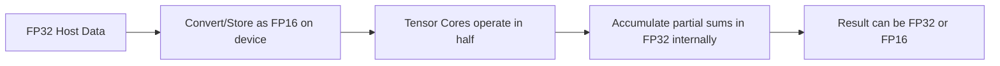
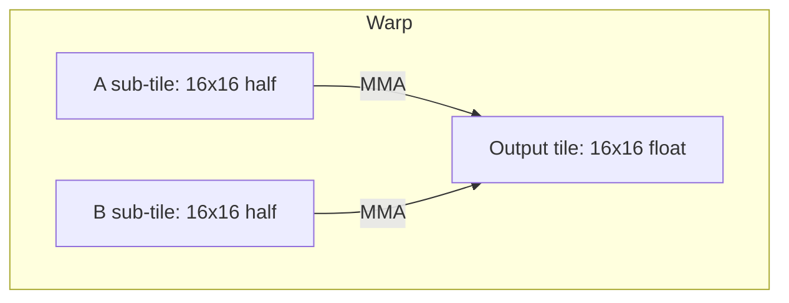

# Day 76: Mixed Precision & Tensor Cores (If Supported)

Modern NVIDIA GPUs (Volta and later) include **Tensor Cores** that accelerate matrix operations at **mixed precision**, typically FP16 or BF16 arithmetic. Harnessing these can dramatically improve **throughput** in HPC and deep learning workloads, but reduced precision can introduce **accuracy trade-offs** if not carefully managed. In **Day 76**, we explore **mixed precision** usage, focusing on **FP16** matrix multiplication on Tensor Cores, and discuss best practices for balancing speed and accuracy. Multiple **conceptual diagrams** illustrate how data flows through Tensor Cores and how partial sums at lower precision might affect final results.

---

## Table of Contents
1. [Overview](#1-overview)  
2. [Why Mixed Precision and Tensor Cores?](#2-why-mixed-precision-and-tensor-cores)  
3. [Precision Trade-Offs](#3-precision-trade-offs)  
4. [Implementation Steps for FP16 Matrix Multiply](#4-implementation-steps-for-fp16-matrix-multiply)  
   - [a) Data Conversion (FP32 ↔ FP16)](#a-data-conversion-fp32--fp16)  
   - [b) Using Tensor Cores via WMMA API](#b-using-tensor-cores-via-wmma-api)  
   - [c) Launch Configuration & Mixed Precision Accumulation](#c-launch-configuration--mixed-precision-accumulation)  
5. [Code Example: FP16 GEMM with Tensor Cores (WMMA)](#5-code-example-fp16-gemm-with-tensor-cores-wmma)  
   - [Explanation & Comments](#explanation--comments)  
6. [Common Pitfalls & Accuracy Issues](#6-common-pitfalls--accuracy-issues)  
7. [Multiple Conceptual Diagrams](#7-multiple-conceptual-diagrams)  
   - [Diagram 1: Mixed Precision Data Flow](#diagram-1-mixed-precision-data-flow)  
   - [Diagram 2: Tensor Core WMMA Tile Mapping](#diagram-2-tensor-core-wmma-tile-mapping)  
   - [Diagram 3: Accumulation at Higher Precision](#diagram-3-accumulation-at-higher-precision)  
8. [References & Further Reading](#8-references--further-reading)  
9. [Conclusion](#9-conclusion)  
10. [Next Steps](#10-next-steps)

---

## 1. Overview
NVIDIA Tensor Cores introduced in Volta (and improved in later architectures) accelerate **matrix-matrix multiplications** by operating on **FP16** or **BF16** input tiles, often accumulating partial sums in higher precision (FP32). This **mixed precision** approach enables significantly higher throughput for dense matrix ops, widely used in deep learning or HPC. However, **reduced precision** can cause errors if the data range is large or if the algorithm is sensitive to rounding.

**Key Focus**: Implementing a **FP16 matrix multiply** on Tensor Cores, discussing how to feed half-precision data, use the WMMA (Warp Matrix Multiply-Accumulate) intrinsics, and accumulate partial sums in FP32 to preserve final result accuracy.

---

## 2. Why Mixed Precision and Tensor Cores?

1. **Higher Throughput**: Tensor Cores can deliver multiple TFLOPS for matrix ops, far outstripping conventional FP32 or FP64.  
2. **Lower Memory Footprint**: Storing half-precision data halves memory usage for matrix inputs, often doubling effective memory bandwidth.  
3. **AI & HPC**: Many deep learning tasks rely on FP16, while some HPC workflows can tolerate partial or final mixed precision for performance gains.

---

## 3. Precision Trade-Offs
- **Range & Rounding**: FP16 has fewer exponent bits and mantissa bits, limiting representable range and precision. Large or extremely small values can degrade accuracy.  
- **Accumulate in FP32**: Commonly, partial sums are done in FP32 to mitigate catastrophic rounding.  
- **Validation**: For HPC tasks requiring tight error bounds, carefully check if the final results meet domain-specific precision requirements.

---

## 4. Implementation Steps for FP16 Matrix Multiply

### a) Data Conversion (FP32 ↔ FP16)
- **Loading**: If your data is in FP32, convert to FP16 on the host or device. If the data size is large, consider pinned memory for faster transfers.  
- **Storing**: After the operation, you may convert the result back to FP32 for consumption by other parts of the pipeline that require higher precision.

### b) Using Tensor Cores via WMMA API
- **WMMA (Warp Matrix Multiply-Accumulate)** intrinsics: Provide warp-level ops for 16×16 or 8×8 tile multiplications.  
- **Tile Mismatch**: You must tile your matrices in multiples of the warp-level matrix shapes (e.g., 16×16). If partial blocks remain, handle them separately.

### c) Launch Configuration & Mixed Precision Accumulation
- **Block Layout**: Usually each warp processes a tile. Possibly multiple warps per block.  
- **Accumulation**: Many HPC codes keep partial sums in FP32 to reduce rounding errors, while input & intermediate are FP16.

---

## 5. Code Example: FP16 GEMM with Tensor Cores (WMMA)

Below is a simplified snippet demonstrating how to do a **16×16** tile multiplication using half precision on Tensor Cores. This example uses the **cuda::wmma** namespace introduced in newer CUDA versions. (Truncated for brevity.)

```cpp
```cpp
// Mixed Precision (FP16) Matrix Multiply on Tensor Cores
// File: tensorcore_wmma_example.cu

#include <cuda_fp16.h>
#include <mma.h>
using namespace nvcuda::wmma;

__global__ void wmmaGemmKernel(half *A, half *B, float *C,
                               int M, int N, int K) {
    // Each warp will compute a tile of C using wmma
    // NOTE: M, N, K must be multiples of 16 for simplicity

    // 1) Create fragment objects
    fragment<matrix_a, 16, 16, 16, half, col_major> aFrag;
    fragment<matrix_b, 16, 16, 16, half, col_major> bFrag;
    fragment<accumulator, 16, 16, 16, float> cFrag;

    fill_fragment(cFrag, 0.0f); // init to zero

    // 2) Map warp to 16x16 tile in row/col space
    int warpM = (blockIdx.x * blockDim.x + threadIdx.x) / 32; // example
    // This is a simplistic approach ignoring partial warps, so adjust as needed.

    // 3) Load A, B sub-matrices
    load_matrix_sync(aFrag, A + warpM*16, K); // if col_major
    load_matrix_sync(bFrag, B + warpM*16, K);

    // 4) Perform the MMA operation
    mma_sync(cFrag, aFrag, bFrag, cFrag);

    // 5) Store results (accumulator is float)
    store_matrix_sync(C + warpM*16, cFrag, N, mem_col_major);
}

int main() {
    // host data, device memory, etc.
    // A, B in half, C in float
    // call wmmaGemmKernel<<<...>>>(A, B, C, M, N, K);

    return 0;
}
```
``` 
```

**Explanation & Comments**  
1. **FP16**: The `__half` or `half` type is used for A and B. The final accumulation uses `float`.  
2. **wmma**: We create **fragment** objects for each operand, then `mma_sync()` runs the fused multiply-accumulate on Tensor Cores.  
3. **Tiling**: This snippet is incomplete—real code must carefully map each warp to a sub-tile, handle partial edges, and do a gather/scatter for the full matrix.

---

## 6. Common Pitfalls & Accuracy Issues
- **FP16 Range**: If input data spans large magnitudes, some values may underflow or overflow in half precision, losing important bits.  
- **Alignment & Tiling**: Tensor Cores require alignment to 16×16 tile boundaries. Non-multiple matrix dimensions need separate handling.  
- **Intermediate Storage**: Partial sums typically in FP32 to reduce rounding, but final results might remain in FP16 for memory savings.  
- **API Evolution**: The wmma API may differ slightly across CUDA versions. Always consult the latest documentation.

---

## 7. Multiple Conceptual Diagrams

### Diagram 1: Mixed Precision Data Flow



**Explanation**: The data is loaded in FP16 for multiply, partial sums stored in FP32, final result can be kept in either precision as needed.

---

### Diagram 2: Tensor Core WMMA Tile Mapping



**Explanation**: Each warp handles a **16×16** sub-tile for A and B, performing the matrix multiply-accumulate to produce a **16×16** sub-tile in the output matrix.

---

### Diagram 3: Accumulation at Higher Precision

```mermaid
flowchart LR
    A[FP16: a, b]
    B[(a * b) => partial in FP16?]
    C[accumulate in FP32 => sum]
    D[final result => either float or half]

    A --> B --> C --> D
```

**Explanation**: Even though inputs are half, the actual multiply-accumulate path often promotes partial sums to **FP32** to reduce catastrophic rounding.

---

## 8. References & Further Reading

- [CUDA C Programming Guide – “Tensor Core Programming”](https://docs.nvidia.com/cuda/cuda-c-programming-guide/index.html#wmma-and-tensor-cores)  
- [NVIDIA Developer Blog – Mixed Precision & HPC](https://developer.nvidia.com/blog/tag/mixed-precision/)  
- [PyTorch / cuBLAS HPC Guides for FP16 GEMM](https://docs.nvidia.com/cuda/cublas/index.html)  
- [Nsight Systems for Analyzing Tensor Core usage](https://docs.nvidia.com/nsight-systems/)

---

## 9. Conclusion

**Day 76** underscores how **mixed precision** with **Tensor Cores** can drastically accelerate matrix multiply performance, albeit with potential **precision trade-offs**. By operating in FP16 for inputs while accumulating in FP32, you capture the benefits of lower precision and faster throughput from Tensor Cores, typically sustaining near-peak performance on modern NVIDIA GPUs. The key is verifying that numerical accuracy remains acceptable. Tools like **WMMA** intrinsics or libraries (like cuBLAS) can streamline usage, while being mindful of alignment constraints and data layout.

---

## 10. Next Steps

1. **Convert a Real HPC Kernel** to half precision, measure performance speedup, and track any changes in result accuracy.  
2. **Profile**: Use Nsight Compute to see if the kernel saturates Tensor Cores or if memory bandwidth remains the bottleneck.  
3. **Double-Check**: If domain demands high accuracy, partial or final re-accumulation in FP32 or FP64 may be required.  
4. **Tiling**: Ensure matrix dimensions align with the 16×16 block structure needed for wmma to avoid overhead in partial tiles.  
5. **Expand**: Evaluate BF16 or other low-precision formats if your GPU or library supports them.  

```
