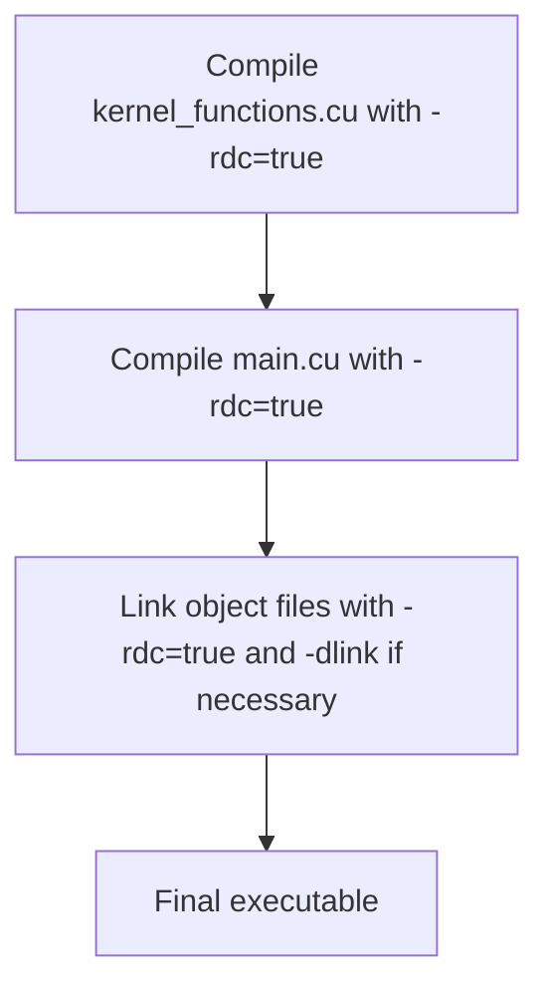

# Day 91: Enterprise-Level Code Structure

In enterprise-level CUDA projects, maintaining a well-organized codebase is critical. A multi-file, multi-module approach enables separate compilation and linking, promoting modularity, easier maintenance, and improved scalability. However, when using separate compilation, it's important to use the correct NVCC flags; otherwise, linker errors can occur. This lesson explores the concepts and best practices for structuring large CUDA projects, including separate compilation and linking, and highlights common pitfalls with practical examples.

---

## Table of Contents

1. [Overview](#1-overview)  
2. [Importance of Enterprise-Level Code Structure](#2-importance-of-enterprise-level-code-structure)  
3. [Multi-File, Multi-Module Approach](#3-multi-file-multi-module-approach)  
4. [Separate Compilation and Linking](#4-separate-compilation-and-linking)  
   - [a) NVCC Compilation Flags](#a-nvcc-compilation-flags)  
   - [b) Common Linker Errors](#b-common-linker-errors)  
5. [Code Example](#5-code-example)  
6. [Conceptual Diagrams](#6-conceptual-diagrams)  
   - [Diagram 1: Project File Organization](#diagram-1-project-file-organization)  
   - [Diagram 2: Separate Compilation Process](#diagram-2-separate-compilation-process)  
   - [Diagram 3: Linking Flow with NVCC Flags](#diagram-3-linking-flow-with-nvcc-flags)  
7. [References & Further Reading](#7-references--further-reading)  
8. [Conclusion & Next Steps](#8-conclusion--next-steps)

---

## 1. Overview

Enterprise-level CUDA code is often organized into multiple source files and modules to enhance maintainability, encourage code reuse, and enable independent testing and development. This structure requires proper use of separate compilation and linking techniques, which differ slightly from traditional C/C++ projects due to the CUDA runtime and NVCC compiler.

---

## 2. Importance of Enterprise-Level Code Structure

- **Modularity:** Splitting code into logical modules allows teams to work on different components concurrently.
- **Reusability:** Common functionalities can be abstracted into separate libraries or modules.
- **Maintainability:** Easier to manage, debug, and optimize smaller, self-contained modules.
- **Scalability:** Facilitates scaling up the project as new features or hardware optimizations are added.

---

## 3. Multi-File, Multi-Module Approach

A well-organized CUDA project separates device code (kernels and device functions) and host code (initialization, memory management, and kernel launches) into distinct source files. This organization can be achieved by:
- **Header Files (.h/.hpp):** Define common interfaces, kernel prototypes, and data structures.
- **Source Files (.cu):** Implement kernels and host code, compiled separately by NVCC.
- **Build System:** Use makefiles or CMake to manage compilation and linking with the correct NVCC flags.

---

## 4. Separate Compilation and Linking

### a) NVCC Compilation Flags

When compiling CUDA code separately, it's essential to include flags that support separate compilation. Key flags include:
- `-dc`: Generates relocatable device code.
- `-dlink`: Links relocatable device code.
- `-rdc=true`: Enables relocatable device code generation.
- `-arch=<sm_xx>`: Specifies the target GPU architecture.

### b) Common Linker Errors

- **Undefined Symbols:** Occur when device functions or kernels declared in one file are not linked correctly with their definitions in another file.
- **Relocation Issues:** Arise if the `-rdc=true` flag is omitted, leading to unresolved device symbols.
- **Version Mismatches:** Using incompatible NVCC flags with certain CUDA Toolkit versions can result in linker failures.

---

## 5. Code Example

Below is a simplified example demonstrating separate compilation and linking in a multi-file CUDA project.

**File: kernel_functions.cu**
```cpp
// kernel_functions.cu
#include "kernel_functions.h"

__global__ void addKernel(float* d_out, const float* d_in, int N) {
    int idx = blockIdx.x * blockDim.x + threadIdx.x;
    if (idx < N)
        d_out[idx] = d_in[idx] + 1.0f;
}
```

**File: kernel_functions.h**
```cpp
// kernel_functions.h
#ifndef KERNEL_FUNCTIONS_H
#define KERNEL_FUNCTIONS_H

#ifdef __cplusplus
extern "C" {
#endif

__global__ void addKernel(float* d_out, const float* d_in, int N);

#ifdef __cplusplus
}
#endif

#endif // KERNEL_FUNCTIONS_H
```

**File: main.cu**
```cpp
// main.cu
#include <stdio.h>
#include <cuda_runtime.h>
#include "kernel_functions.h"

int main() {
    int N = 1 << 20;
    size_t size = N * sizeof(float);
    float *h_in, *h_out;
    float *d_in, *d_out;

    h_in = (float*)malloc(size);
    h_out = (float*)malloc(size);
    for (int i = 0; i < N; i++) {
        h_in[i] = (float)i;
    }

    cudaMalloc(&d_in, size);
    cudaMalloc(&d_out, size);
    cudaMemcpy(d_in, h_in, size, cudaMemcpyHostToDevice);

    int threads = 256;
    int blocks = (N + threads - 1) / threads;
    addKernel<<<blocks, threads>>>(d_out, d_in, N);
    cudaDeviceSynchronize();

    cudaMemcpy(h_out, d_out, size, cudaMemcpyDeviceToHost);
    printf("Result: h_out[0] = %f\n", h_out[0]);

    free(h_in);
    free(h_out);
    cudaFree(d_in);
    cudaFree(d_out);
    return 0;
}
```

**Compilation Command:**
```bash
nvcc -rdc=true -arch=sm_70 -c kernel_functions.cu -o kernel_functions.o
nvcc -rdc=true -arch=sm_70 -c main.cu -o main.o
nvcc -arch=sm_70 kernel_functions.o main.o -o app
```

---

## 6. Comprehensive Conceptual Diagrams

### Diagram 1: Project File Organization

```mermaid
flowchart TD
    A[Header Files (.h)]
    B[Source Files (.cu)]
    C[Makefile/CMakeLists.txt]
    D[Executable]
    
    A --> B
    B --> C
    C --> D
```

**Explanation:**  
This diagram illustrates how header files define interfaces and source files implement functionality, which are then compiled and linked by a build system to produce the final executable.

---

### Diagram 2: Separate Compilation Process



**Explanation:**  
This diagram shows the process of separately compiling multiple CUDA source files into object files and then linking them together. The use of the `-rdc=true` flag ensures relocatable device code is generated.

---

### Diagram 3: Linking Flow with NVCC Flags

```mermaid
flowchart TD
    A[Source Code Files]
    B[NVCC Compilation with flags: -rdc=true, -arch=sm_xx]
    C[Relocatable Object Files (.o)]
    D[Linker Phase (using -dlink if necessary)]
    E[Final Executable]
    
    A --> B
    B --> C
    C --> D
    D --> E
```

**Explanation:**  
This diagram details the linking flow: source files are compiled into relocatable object files using specific NVCC flags, and these objects are then linked together to form the final executable. Correct flag usage is critical to avoid linker errors.

---

## 7. References & Further Reading

- [CUDA C Programming Guide – Separate Compilation and Linking](https://docs.nvidia.com/cuda/cuda-c-programming-guide/index.html#separate-compilation-and-linking)
- [NVCC Compiler Options](https://docs.nvidia.com/cuda/cuda-compiler-driver-nvcc/index.html)
- [CUDA C Best Practices Guide](https://docs.nvidia.com/cuda/cuda-c-best-practices-guide/index.html)

---

## 8. Conclusion & Next Steps

Enterprise-level CUDA projects benefit greatly from a multi-file, multi-module code structure, enabling modularity, reusability, and ease of maintenance. However, separate compilation and linking require careful management of NVCC flags (such as `-rdc=true` and `-arch=sm_xx`) to avoid linker errors. By organizing your project into clear modules and using a proper build system, you can scale your CUDA applications efficiently while ensuring portability across different GPU architectures.

**Next Steps:**
- **Experiment:** Modify the example to include more complex modules and test cross-module function calls.
- **Profile:** Use profiling tools to ensure that separate compilation does not introduce overhead.
- **Automate:** Set up a robust build system (e.g., CMake) to manage compilation and linking.
- **Document:** Maintain clear documentation of module interfaces and compilation flags for future maintenance.

```
