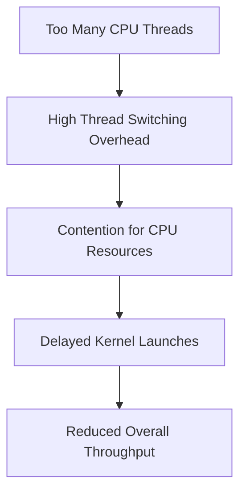

# Day 94: Host Multithreading + GPU Coordination

In large-scale and real-time GPU applications, a single CPU thread launching kernels and managing streams can become a bottleneck. Leveraging host multithreading allows multiple CPU threads to concurrently launch kernels and manage streams, thereby overlapping CPU-side work with GPU execution. However, if not managed carefully, contention among CPU threads can throttle overall performance and negatively impact GPU utilization.

This lesson delves into techniques for efficiently coordinating GPU work across multiple CPU threads, discusses common pitfalls (such as thread contention), and presents best practices from the CUDA C Best Practices Guide on multi-threaded host code.

---

## Table of Contents

1. [Overview](#1-overview)  
2. [Benefits of Host Multithreading for GPU Coordination](#2-benefits-of-host-multithreading-for-gpu-coordination)  
3. [Challenges and Pitfalls](#3-challenges-and-pitfalls)  
4. [Implementation Techniques](#4-implementation-techniques)  
   - [a) Using C++ Threads with CUDA Streams](#a-using-c-threads-with-cuda-streams)  
   - [b) Managing Device Contexts and Stream Creation](#b-managing-device-contexts-and-stream-creation)  
   - [c) Synchronization and Avoiding CPU Contention](#c-synchronization-and-avoiding-cpu-contention)  
5. [Code Example](#5-code-example)  
6. [Conceptual Diagrams](#6-conceptual-diagrams)  
   - [Diagram 1: Overall Flow of Multi-Threaded Host Coordination](#diagram-1-overall-flow-of-multi-threaded-host-coordination)  
   - [Diagram 2: CPU Thread and GPU Stream Coordination](#diagram-2-cpu-thread-and-gpu-stream-coordination)  
   - [Diagram 3: Potential CPU Contention Scenario](#diagram-3-potential-cpu-contention-scenario)  
7. [References & Further Reading](#7-references--further-reading)  
8. [Conclusion & Next Steps](#8-conclusion--next-steps)

---

## 1. Overview

Host multithreading in CUDA involves using multiple CPU threads to manage GPU tasks concurrently. Each thread can create its own CUDA stream, set the device context, launch kernels, and manage memory transfers. This parallelism helps to overlap work and better utilize both the CPU and GPU. However, if many threads contend for resources, the overhead from CPU thread scheduling and synchronization can diminish the benefits.

---

## 2. Benefits of Host Multithreading for GPU Coordination

- **Increased Throughput:** Multiple CPU threads can launch kernels concurrently, reducing idle time.
- **Concurrent Data Management:** While one thread manages data transfers, another can launch compute kernels.
- **Improved Responsiveness:** Particularly important for real-time or interactive applications, where timely kernel launches are critical.

---

## 3. Challenges and Pitfalls

- **CPU Thread Contention:** Excessive threads or poor synchronization may lead to CPU overhead, delaying kernel launches.
- **Device Context Management:** Each thread must correctly set the device context (using `cudaSetDevice`) to avoid cross-thread conflicts.
- **Synchronization Complexity:** Coordinating multiple threads and streams requires careful use of synchronization primitives to prevent race conditions and ensure correct execution order.

---

## 4. Implementation Techniques

### a) Using C++ Threads with CUDA Streams

Utilize C++’s `std::thread` to launch multiple host threads, each of which:
- Sets the device context.
- Creates a CUDA stream.
- Launches kernels asynchronously.
- Synchronizes its own stream before finishing.

### b) Managing Device Contexts and Stream Creation

Each thread must call `cudaSetDevice` to ensure that the correct GPU is used. Streams created within a thread are local to that thread, enabling independent management of concurrent operations.

### c) Synchronization and Avoiding CPU Contention

- Use per-thread streams and minimize cross-thread synchronization to reduce CPU overhead.
- Ensure that threads do not oversubscribe CPU cores; adjust the number of host threads based on the available CPU cores.
- Use profiling tools (e.g., Nsight Systems) to monitor CPU thread usage and adjust accordingly.

---

## 5. Code Example

The following example demonstrates how to use multiple CPU threads to launch kernels concurrently. Each thread sets the device context, creates its own stream, launches a simple kernel, and synchronizes its stream.

```cpp
#include <cuda_runtime.h>
#include <stdio.h>
#include <thread>
#include <vector>
#include <algorithm>

// Simple kernel: multiply each element by 2
__global__ void sampleKernel(float* d_data, int N) {
    int idx = blockIdx.x * blockDim.x + threadIdx.x;
    if (idx < N) {
        d_data[idx] *= 2.0f;
    }
}

void threadFunction(int threadId, int N) {
    // Set device context (assume device 0 for simplicity)
    cudaSetDevice(0);
    
    // Allocate device memory for this thread's data
    size_t size = N * sizeof(float);
    float* d_data;
    cudaMalloc(&d_data, size);
    
    // Optionally, initialize data or copy from a host array (omitted)
    
    // Create a CUDA stream for this thread
    cudaStream_t stream;
    cudaStreamCreate(&stream);
    
    // Define kernel launch parameters
    int threads = 256;
    int blocks = (N + threads - 1) / threads;
    
    // Launch the kernel asynchronously in the thread's stream
    sampleKernel<<<blocks, threads, 0, stream>>>(d_data, N);
    
    // Synchronize the stream to ensure kernel completion
    cudaStreamSynchronize(stream);
    
    // Cleanup: free device memory and destroy the stream
    cudaFree(d_data);
    cudaStreamDestroy(stream);
    
    printf("Thread %d completed kernel execution.\n", threadId);
}

int main() {
    int N = 1 << 20;  // 1 million elements per thread
    const int numThreads = 4; // Adjust based on available CPU cores
    
    std::vector<std::thread> threads;
    for (int i = 0; i < numThreads; ++i) {
        threads.emplace_back(threadFunction, i, N);
    }
    
    // Wait for all threads to complete
    for (auto& t : threads) {
        t.join();
    }
    
    return 0;
}
```

**Explanation:**  
- Each thread sets the device context (using `cudaSetDevice(0)`), creates its own stream, and launches a kernel on a separate portion of work.
- The threads run concurrently, and each stream is synchronized individually.
- This approach allows overlapping of kernel launches across multiple CPU threads, but care must be taken to avoid CPU oversubscription.

---

## 6. Comprehensive Conceptual Diagrams

### Diagram 1: Overall Flow of Multi-Threaded Host Coordination

```mermaid
flowchart TD
    A[Main Thread]
    B[Spawn multiple CPU threads]
    C[Each thread sets device context (cudaSetDevice)]
    D[Each thread creates its own CUDA stream]
    E[Each thread launches kernel asynchronously]
    F[Each thread synchronizes its stream]
    G[Threads join back to main thread]
    
    A --> B
    B --> C
    C --> D
    D --> E
    E --> F
    F --> G
```

**Explanation:**  
This diagram outlines the high-level flow where the main thread spawns multiple CPU threads, each of which handles its own GPU stream and kernel launches, and then synchronizes before joining back.

---

### Diagram 2: CPU Thread and GPU Stream Coordination

```mermaid
flowchart LR
    A[CPU Thread 1] --- B[GPU: Create stream and launch kernel]
    C[CPU Thread 2] --- D[GPU: Create its own stream and launch kernel]
    E[CPU Thread 3] --- F[GPU: Create its own stream and launch kernel]
    
    subgraph GPU
    B --> G[Kernel Execution]
    D --> H[Kernel Execution]
    F --> I[Kernel Execution]
    end
    
    J[Each CPU thread waits (synchronizes) for its GPU stream]
    G --> J
    H --> J
    I --> J
```

**Explanation:**  
Each CPU thread independently coordinates with its own GPU stream. They launch kernels concurrently and wait for their stream’s completion, ensuring proper synchronization without interference from other threads.

---

### Diagram 3: Potential CPU Thread Contention Scenario



**Explanation:**  
This diagram illustrates the risk of creating too many CPU threads. Excessive threads lead to high overhead from thread switching and contention, which in turn delays kernel launches and reduces overall system throughput. The optimal number of threads should be balanced with the number of available CPU cores.

---

## 7. References & Further Reading

- [CUDA C Best Practices Guide – Multi-threaded Host Code](https://docs.nvidia.com/cuda/cuda-c-programming-guide/index.html#multi-threaded-host-code)
- [CUDA Runtime API Documentation](https://docs.nvidia.com/cuda/cuda-runtime-api/index.html)
- [Nsight Systems Documentation](https://docs.nvidia.com/nsight-systems/)

---

## 8. Conclusion & Next Steps

Host multithreading combined with effective GPU coordination can significantly enhance the throughput of your CUDA applications by overlapping CPU work and GPU kernel launches. However, careful management of CPU threads is essential to avoid contention, which can throttle GPU performance. Profiling and tuning the number of host threads relative to available CPU cores is key to achieving optimal results.

**Next Steps:**
- **Profile your host code** to determine the optimal number of CPU threads.
- **Experiment with different stream configurations** to maximize overlap between data transfer and kernel execution.
- **Implement error-checking** and synchronization mechanisms to ensure that multi-threaded operations do not interfere with each other.
- **Document and refine** your multithreading strategies as part of your enterprise-level CUDA codebase.

```
