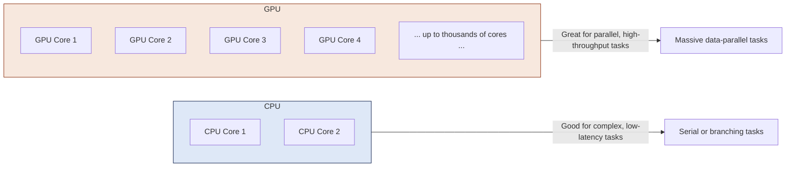

# Day 01: Introduction to GPU Computing & CUDA

## Table of Contents
1. [Overview](#1-overview)
2. [CPU vs. GPU: Conceptual Diagram](#2-cpu-vs-gpu-conceptual-diagram)
3. [Core CUDA Concepts](#3-core-cuda-concepts)
4. [Environment Setup](#4-environment-setup)
5. [“Hello GPU” Program](#5-hello-gpu-program)
6. [Common Pitfalls](#6-common-pitfalls)
7. [References & Further Reading](#7-references--further-reading)
8. [Next Steps](#8-next-steps)

---

## 1. Overview
Welcome to your first day of learning CUDA! Today’s focus is on establishing a clear mental model of **GPU computing** and how **CUDA** opens up the GPU’s parallel processing power to you. By the end of this lesson, you should:

- Understand the high-level difference between CPUs and GPUs.
- Have a mental picture of CUDA’s programming approach.
- Be ready to write and run a simple “Hello GPU” kernel.

Modern GPUs thrive on parallelism, letting thousands of lightweight threads handle tasks in tandem. CUDA exposes these capabilities through an extension of C/C++ that includes special keywords and memory models for GPU programming.

---

## 2. CPU vs. GPU: Conceptual Diagram

Let’s start with a quick visual comparison of how CPUs and GPUs handle parallel tasks:



- **CPU Cores**: Optimized for fast, complex operations on fewer threads at once.  
- **GPU Cores**: Designed for handling **thousands** of smaller, simpler threads, excelling at data-parallel operations.

When you have huge arrays or matrices to process, or repetitive operations that can be performed in parallel, GPUs often deliver massive speedups.

---

## 3. Core CUDA Concepts

### a) Execution Model
- **Threads**: The smallest unit of parallel work. Each thread executes the same kernel (function), but on different data (Single Instruction, Multiple Thread approach).
- **Blocks**: Group of threads that can share fast on-chip memory (called **shared memory**).  
- **Grid**: Collection of all blocks needed to solve your problem.

### b) Memory Hierarchy
- **Global Memory**: Large but relatively slower; accessible by all threads.  
- **Shared Memory**: A small, fast region local to each block.  
- **Local/Private Memory**: Registers or thread-local storage.  
- **Constant & Texture Memory**: Specialized for read-only data or caching.

### c) Kernel Functions
- Marked with `__global__`, these are the functions you launch on the GPU.  
- Kernel launches use the triple-angle-bracket syntax: `kernelName<<<blocks, threads>>>(...)`

---

## 4. Environment Setup

1. **Install CUDA Toolkit**  
   - [Download here](https://developer.nvidia.com/cuda-downloads) for your OS (Windows, Linux, macOS).  
   - Ensure your NVIDIA driver is updated to the recommended version or newer.

2. **Verify the Install**  
   - Check `nvcc --version` in your terminal or Command Prompt.  
   - If you see a valid version (e.g., `Cuda compilation tools, release 11.x`), you’re set.

3. **Check GPU Compatibility**  
   - Run `nvidia-smi` (Linux) or open the NVIDIA Control Panel (Windows) to see your GPU model and compute capability.  
   - This helps when using advanced CUDA features or specifying compilation flags like `-arch=sm_75`.

---

## 5. “Hello GPU” Program

Let’s write a simple CUDA program that prints a message from the GPU, confirming our environment works.

```cpp
#include <stdio.h>
#include <cuda_runtime.h>

// __global__ indicates this function runs on the GPU.
__global__ void helloFromGPU() {
    if (threadIdx.x == 0) {
        printf("Hello from the GPU!\n");
    }
}

int main() {
    // Launch the kernel with 1 block of 1 thread.
    helloFromGPU<<<1, 1>>>();

    // Synchronize to ensure the GPU finishes before exiting.
    cudaDeviceSynchronize();

    printf("Hello from the CPU!\n");
    return 0;
}
```

### Compiling & Running
1. Save it as `helloGPU.cu`.  
2. Compile with:
   ```bash
   nvcc helloGPU.cu -o helloGPU
   ```
3. Run the executable:
   ```bash
   ./helloGPU
   ```
4. Expected output:
   ```
   Hello from the GPU!
   Hello from the CPU!
   ```

---

## 6. Common Pitfalls
1. **Missing `<cuda_runtime.h>`**  
   Leads to errors about undefined CUDA functions.
2. **Using `gcc` Instead of `nvcc`**  
   You must use `nvcc` (the CUDA compiler) to recognize CUDA keywords and handle device code.
3. **Driver/Toolkit Mismatch**  
   An outdated driver may fail to run kernels built with a newer CUDA version.
4. **Forgetting `cudaDeviceSynchronize()`**  
   Without synchronization, your program may terminate before the GPU finishes.

---

## 7. References & Further Reading

1. **[CUDA C Programming Guide – Chapters 1 & 2](https://docs.nvidia.com/cuda/cuda-c-programming-guide/index.html)**  
   Introduction and basic concepts of CUDA, including threads, blocks, and the compilation process.

2. **[CUDA Quick Start Guide](https://docs.nvidia.com/cuda/cuda-quick-start-guide/index.html)**  
   Step-by-step instructions for installing the toolkit and verifying your setup.

3. **[GPU Gems – Chapter 1](https://developer.nvidia.com/gpugems/gpugems)**  
   Provides a solid overview of GPU architecture and parallel computing fundamentals.

4. **[NVIDIA Developer Blog: Introduction to CUDA](https://developer.nvidia.com/blog/tag/cuda)**  
   Articles that dive deeper into the “why” of GPU computing and feature beginner-friendly examples.


---
## 8. Next Steps
In **Day 2**, we’ll get into optimizing your development environment—covering debugging tools, performance measurement, and more. Keep this Day 1 code handy as a reference point for ensuring future projects compile and run correctly.

> **Hint**: Experiment! Try changing the block and thread configuration (e.g., `<<<1, 10>>>`) and print out which thread is speaking to get an early feel for how parallelism works.

---


