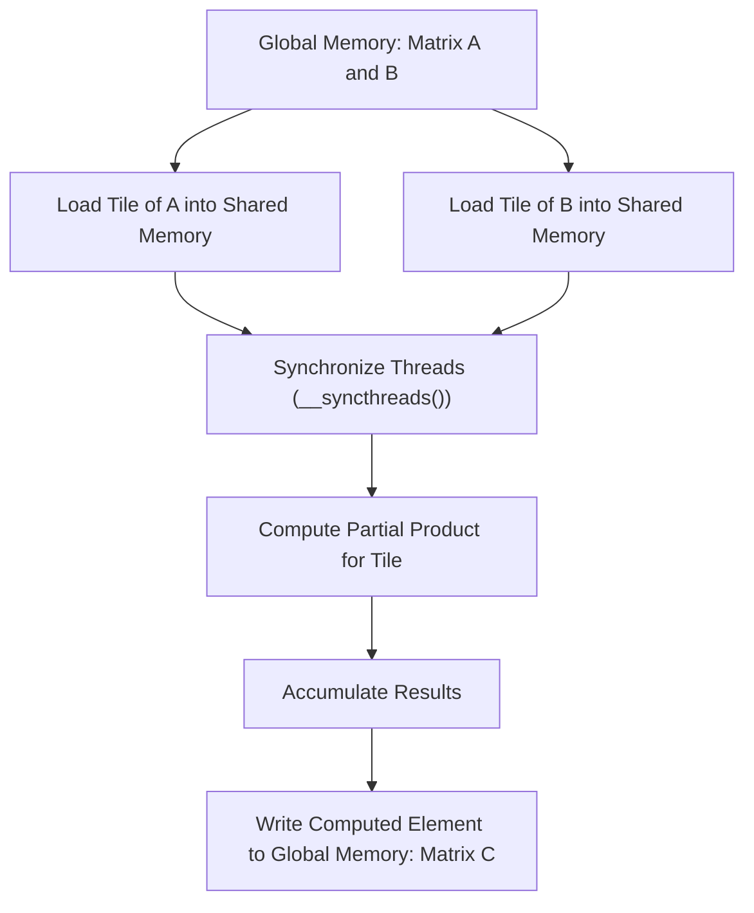
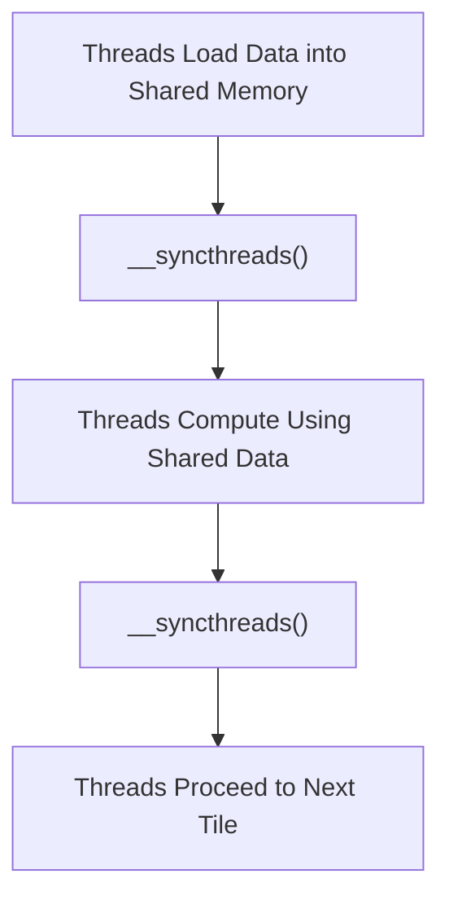

# Day 10: Shared Memory Fundamentals

In this lesson, we delve into the power of shared memory—a fast, on-chip memory resource in CUDA devices. Shared memory can dramatically accelerate applications by reducing global memory accesses. Today’s topic focuses on implementing tile-based matrix multiplication using shared memory. We will cover every detail from setup to debugging, discuss potential pitfalls like race conditions when thread synchronization is omitted, and provide comprehensive code examples, diagrams, and references.

---

## Table of Contents
1. [Overview](#1-overview)  
2. [Introduction to Shared Memory](#2-introduction-to-shared-memory)  
3. [Tile-Based Matrix Multiplication Concept](#3-tile-based-matrix-multiplication-concept)  
4. [Detailed Implementation](#4-detailed-implementation)  
    - [a) Kernel Code](#a-kernel-code)  
    - [b) Host Code](#b-host-code)  
5. [Common Pitfalls and Debugging](#5-common-pitfalls-and-debugging)  
6. [Conceptual Diagrams](#6-conceptual-diagrams)  
7. [References & Further Reading](#7-references--further-reading)  
8. [Conclusion](#8-conclusion)  
---

## 1. Overview
Shared memory is a user-managed cache that resides on-chip, offering very low latency compared to global memory. In matrix multiplication, shared memory is often used to load sub-matrices (tiles) from global memory into a fast, local memory space, perform computation on the tiles, and then write the results back. This lesson provides a detailed, step-by-step guide to implementing tile-based matrix multiplication using shared memory, along with the necessary thread synchronization to avoid race conditions.

---

## 2. Introduction to Shared Memory
- **Definition:**  
  Shared memory is a small, fast memory space available to all threads within a block.  
- **Benefits:**  
  - **Speed:** Significantly faster than global memory.  
  - **Collaboration:** Enables threads within a block to share data and cooperate on computations.  
- **Limitations:**  
  - **Size:** Typically between 48KB to 96KB per Streaming Multiprocessor (SM), depending on the hardware.  
  - **Scope:** Only accessible by threads within the same block.

**Key Concepts from the CUDA C Programming Guide (“Shared Memory”):**  
- Use shared memory to cache data that is repeatedly accessed.  
- Employ proper synchronization (`__syncthreads()`) to prevent race conditions when multiple threads access and update shared data.

---

## 3. Tile-Based Matrix Multiplication Concept
Matrix multiplication involves computing:
  
  C = A × B

For matrices of size **M×N** (A) and **N×K** (B), the naïve algorithm has high global memory bandwidth usage. The tile-based approach divides the matrices into smaller blocks (tiles), and each tile is loaded into shared memory. Threads then compute a portion of the output matrix using the tiles, significantly reducing global memory accesses.

**Workflow:**
1. **Partition Matrices into Tiles:**  
   Each tile is typically of size `TILE_WIDTH × TILE_WIDTH`.
2. **Load Tiles into Shared Memory:**  
   Threads collaboratively load a tile from matrix A and a tile from matrix B into shared memory.
3. **Compute Partial Products:**  
   Multiply the tiles and accumulate the results.
4. **Synchronize Threads:**  
   Use `__syncthreads()` to ensure that all threads have loaded the data before computation and before loading new tiles.
5. **Write the Result:**  
   After processing all necessary tiles, each thread writes its computed element to the output matrix.

---

## 4. Detailed Implementation

### a) Kernel Code
Below is the complete CUDA kernel for tile-based matrix multiplication using shared memory. Note the careful use of shared memory arrays and synchronization barriers.

```cpp
// Define tile width (adjust according to hardware capabilities)
#define TILE_WIDTH 16

__global__ void tiledMatrixMul(const float *A, const float *B, float *C, int width) {
    // Allocate shared memory for tiles of A and B
    __shared__ float tileA[TILE_WIDTH][TILE_WIDTH];
    __shared__ float tileB[TILE_WIDTH][TILE_WIDTH];

    // Calculate row and column indices of the element of C computed by this thread
    int row = blockIdx.y * TILE_WIDTH + threadIdx.y;
    int col = blockIdx.x * TILE_WIDTH + threadIdx.x;
    float Pvalue = 0.0f;

    // Loop over all tiles needed to compute C[row][col]
    // 'm' indexes the tiles along the shared dimension
    for (int m = 0; m < (width + TILE_WIDTH - 1) / TILE_WIDTH; m++) {
        // Load tile from matrix A into shared memory if within bounds
        if (row < width && (m * TILE_WIDTH + threadIdx.x) < width) {
            tileA[threadIdx.y][threadIdx.x] = A[row * width + m * TILE_WIDTH + threadIdx.x];
        } else {
            tileA[threadIdx.y][threadIdx.x] = 0.0f;
        }
        // Load tile from matrix B into shared memory if within bounds
        if (col < width && (m * TILE_WIDTH + threadIdx.y) < width) {
            tileB[threadIdx.y][threadIdx.x] = B[(m * TILE_WIDTH + threadIdx.y) * width + col];
        } else {
            tileB[threadIdx.y][threadIdx.x] = 0.0f;
        }

        // Synchronize to ensure all data is loaded into shared memory
        __syncthreads();

        // Perform multiplication for the tile and accumulate the result
        for (int k = 0; k < TILE_WIDTH; k++) {
            Pvalue += tileA[threadIdx.y][k] * tileB[k][threadIdx.x];
        }

        // Synchronize to make sure computation is done before loading new tiles
        __syncthreads();
    }

    // Write the result to global memory if within bounds
    if (row < width && col < width) {
        C[row * width + col] = Pvalue;
    }
}
```

**Key Points in the Kernel:**
- **Shared Memory Allocation:**  
  Two shared memory arrays, `tileA` and `tileB`, store sub-matrices (tiles) of A and B.
- **Bounds Checking:**  
  Ensure that accesses to global memory do not exceed the matrix dimensions.
- **Thread Synchronization:**  
  `__syncthreads()` is used twice in each loop iteration:
  - After loading the tiles to ensure all threads have finished loading.
  - After computing the partial sum to ensure that no thread starts loading the next tile before everyone is done computing.
- **Accumulation of Partial Products:**  
  Each thread computes its output element by accumulating products from corresponding elements in the shared tiles.

---

### b) Host Code
The host code sets up the matrices, launches the kernel, and handles data transfers between the host and device.

```cpp
#include <cuda_runtime.h>
#include <stdio.h>
#include <stdlib.h>
#include <time.h>

// Forward declaration of the kernel (defined in the previous section)
__global__ void tiledMatrixMul(const float *A, const float *B, float *C, int width);

void initializeMatrix(float *mat, int width) {
    for (int i = 0; i < width * width; i++) {
        mat[i] = (float)(rand() % 100) / 100.0f;
    }
}

int main() {
    // Set matrix dimensions (square matrix)
    int width = 1024; // Example: 1024 x 1024 matrix
    size_t size = width * width * sizeof(float);

    // Allocate host memory for matrices A, B, and C
    float *h_A = (float*)malloc(size);
    float *h_B = (float*)malloc(size);
    float *h_C = (float*)malloc(size);
    if (!h_A || !h_B || !h_C) {
        fprintf(stderr, "Host memory allocation failed!\n");
        exit(EXIT_FAILURE);
    }

    // Initialize matrices A and B with random values
    srand(time(NULL));
    initializeMatrix(h_A, width);
    initializeMatrix(h_B, width);

    // Allocate device memory
    float *d_A, *d_B, *d_C;
    cudaError_t err;
    err = cudaMalloc((void**)&d_A, size);
    if (err != cudaSuccess) { fprintf(stderr, "cudaMalloc d_A error: %s\n", cudaGetErrorString(err)); exit(EXIT_FAILURE); }
    err = cudaMalloc((void**)&d_B, size);
    if (err != cudaSuccess) { fprintf(stderr, "cudaMalloc d_B error: %s\n", cudaGetErrorString(err)); exit(EXIT_FAILURE); }
    err = cudaMalloc((void**)&d_C, size);
    if (err != cudaSuccess) { fprintf(stderr, "cudaMalloc d_C error: %s\n", cudaGetErrorString(err)); exit(EXIT_FAILURE); }

    // Copy matrices A and B to device memory
    cudaMemcpy(d_A, h_A, size, cudaMemcpyHostToDevice);
    cudaMemcpy(d_B, h_B, size, cudaMemcpyHostToDevice);

    // Configure kernel launch parameters
    dim3 threadsPerBlock(TILE_WIDTH, TILE_WIDTH);
    dim3 blocksPerGrid((width + TILE_WIDTH - 1) / TILE_WIDTH, (width + TILE_WIDTH - 1) / TILE_WIDTH);

    // Launch the tiled matrix multiplication kernel
    tiledMatrixMul<<<blocksPerGrid, threadsPerBlock>>>(d_A, d_B, d_C, width);

    // Check for kernel launch errors
    err = cudaGetLastError();
    if (err != cudaSuccess) { fprintf(stderr, "Kernel launch error: %s\n", cudaGetErrorString(err)); exit(EXIT_FAILURE); }

    // Copy result matrix C back to host memory
    cudaMemcpy(h_C, d_C, size, cudaMemcpyDeviceToHost);

    // (Optional) Validate results here...

    // Free device memory
    cudaFree(d_A);
    cudaFree(d_B);
    cudaFree(d_C);

    // Free host memory
    free(h_A);
    free(h_B);
    free(h_C);

    printf("Tile-based matrix multiplication completed successfully!\n");
    return 0;
}
```

**Detailed Explanation:**
- **Matrix Setup:**  
  The matrices are square, and their size is defined by `width`. Host memory is allocated and initialized with random values.
- **Device Memory Allocation:**  
  Device memory for matrices A, B, and C is allocated using `cudaMalloc()`, with error checking.
- **Data Transfer:**  
  Matrices A and B are copied from host to device.
- **Kernel Launch Configuration:**  
  The grid and block dimensions are computed based on the tile width (`TILE_WIDTH`) and overall matrix size.
- **Kernel Launch and Error Checking:**  
  The `tiledMatrixMul` kernel is launched, and errors are checked using `cudaGetLastError()`.
- **Result Retrieval and Cleanup:**  
  The computed result is copied back to host memory, and all allocated memory is freed.

---

## 5. Common Pitfalls and Debugging
### Race Conditions Without Thread Synchronization
- **Issue:**  
  Omitting `__syncthreads()` can lead to race conditions where threads start processing new tiles before all threads have completed computations on the current tile. This leads to incorrect results.
- **Solution:**  
  Always include `__syncthreads()` after loading shared memory tiles and after computing partial sums before loading new tiles.

### Other Common Pitfalls
1. **Insufficient Shared Memory Allocation:**  
   - Make sure the shared memory arrays are sized correctly for the tile dimensions.
2. **Out-of-Bounds Memory Access:**  
   - Check indices when reading from or writing to global memory to avoid accessing invalid memory.
3. **Overlapping Kernel Launch Configurations:**  
   - Ensure the grid dimensions cover the entire matrix and that threads are mapped correctly.

**Debugging Tips:**
- Use CUDA error checking after each API call.
- Validate intermediate results on a small matrix.
- Employ profiling tools (like NVIDIA NSight) to verify shared memory usage and synchronization.

---

## 6. Conceptual Diagrams

### Diagram 1: Tile-Based Matrix Multiplication Flow

*Explanation:*  
- Each thread block loads a tile from matrix A and matrix B into shared memory.
- After synchronization, threads compute partial products and accumulate the result.
- Finally, each thread writes its computed value back to matrix C in global memory.

### Diagram 2: Thread Synchronization in a Tile

*Explanation:*  
- Threads first load data into shared memory.
- Synchronization ensures all data is loaded before computation begins.
- Another synchronization barrier ensures that computations complete before the next tile is loaded.

---

## 7. References & Further Reading
1. **[CUDA C Programming Guide](https://docs.nvidia.com/cuda/cuda-c-programming-guide/index.html)**  
   Refer to the “Shared Memory” section for detailed best practices.
2. **[CUDA C Best Practices Guide](https://docs.nvidia.com/cuda/cuda-c-best-practices-guide/index.html)**  
   Contains optimization tips for shared memory usage.
3. **"Programming Massively Parallel Processors: A Hands-on Approach" by David B. Kirk and Wen-mei W. Hwu**  
   A comprehensive resource on GPU architecture and programming techniques.
4. **NVIDIA Developer Blog and Whitepapers**  
   For advanced optimization strategies and case studies related to shared memory.

---

## 8. Conclusion
In Day 10, you explored the fundamentals of shared memory and implemented a tile-based matrix multiplication kernel using CUDA. Key takeaways include:
- **Shared Memory Utilization:** Leveraging shared memory to cache tiles from global memory significantly reduces memory latency.
- **Tile-Based Computation:** Partitioning matrices into tiles for efficient computation.
- **Thread Synchronization:** The critical role of `__syncthreads()` in avoiding race conditions.
- **Step-by-Step Implementation:** Detailed host and kernel code examples demonstrate the entire process.
- **Debugging and Best Practices:** Common pitfalls and debugging strategies to ensure correct and optimized performance.

Mastering these concepts is essential for building high-performance CUDA applications.

---


```
