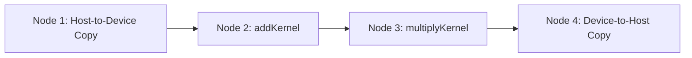
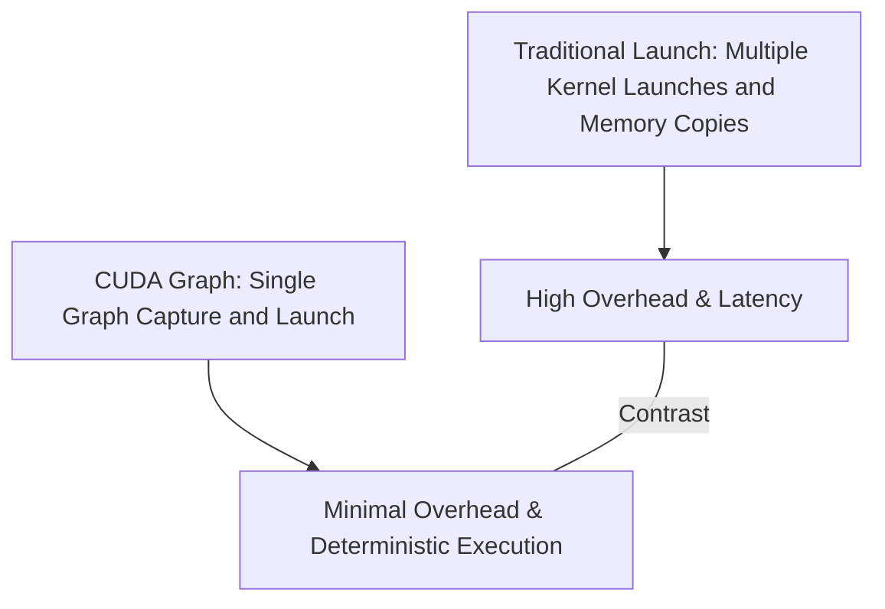

# Day 100: Capstone Project #5 – CUDA Graph-Optimized Workload

In this capstone project, you will build a complete CUDA workload that merges multiple kernels and memory copy operations into a single CUDA graph. By capturing a complex sequence of operations—including host-to-device data transfer, two or more kernel launches, and device-to-host data transfer—you can minimize kernel launch overhead and achieve deterministic execution. This project demonstrates how to design, capture, instantiate, and launch a CUDA graph that optimizes the entire workflow.

---

## Table of Contents

1. [Overview](#1-overview)  
2. [Project Objectives](#2-project-objectives)  
3. [Key Concepts and Techniques](#3-key-concepts-and-techniques)  
   - [CUDA Graphs](#cuda-graphs)  
   - [Kernel Fusion and Memory Copy Operations](#kernel-fusion-and-memory-copy-operations)  
4. [Implementation Approach](#4-implementation-approach)  
5. [Code Example with Detailed Comments](#5-code-example-with-detailed-comments)  
6. [Comprehensive Conceptual Diagrams](#6-comprehensive-conceptual-diagrams)  
   - [Diagram 1: Overall Graph Workflow](#diagram-1-overall-graph-workflow)  
   - [Diagram 2: Graph Node Dependencies](#diagram-2-graph-node-dependencies)  
   - [Diagram 3: Comparison: Graph vs. Traditional Launch](#diagram-3-comparison-graph-vs-traditional-launch)  
7. [References & Further Reading](#7-references--further-reading)  
8. [Conclusion & Next Steps](#8-conclusion--next-steps)

---

## 1. Overview

CUDA Graphs enable you to capture a series of kernel launches and memory copy operations as a directed acyclic graph (DAG). This approach can greatly reduce the overhead associated with launching many small kernels individually. In this project, we will merge multiple operations into a single graph, capturing host-to-device copies, computation kernels, and device-to-host copies, thereby optimizing performance for repetitive workloads.

---

## 2. Project Objectives

- **Reduce Overhead:** Minimize kernel launch overhead by capturing multiple operations in one graph.
- **Improve Determinism:** Achieve predictable execution by explicitly defining operation dependencies.
- **Enhance Performance:** Increase throughput by overlapping data transfers and computation.
- **Demonstrate Reusability:** Show how to update or replay graphs for iterative workflows.

---

## 3. Key Concepts and Techniques

### CUDA Graphs

- **Capture:** Use `cudaStreamBeginCapture` and `cudaStreamEndCapture` to record a sequence of operations.
- **Instantiation:** Convert the captured graph into an executable graph object (`cudaGraphExec_t`).
- **Reusability & Updates:** Graphs can be replayed multiple times and updated dynamically using APIs such as `cudaGraphExecUpdate`.

### Kernel Fusion and Memory Copy Operations

- **Kernel Fusion:** Merging several small kernels into a single kernel can reduce overhead and improve data locality.
- **Memory Copies:** Asynchronous data transfers (using `cudaMemcpyAsync`) can be captured as graph nodes, ensuring they execute in the defined order.

---

## 4. Implementation Approach

1. **Allocate and Initialize Data:**
   - Allocate host and device memory.
   - Initialize input data on the host.
2. **Capture the Graph:**
   - Create a CUDA stream and begin capture.
   - Issue asynchronous host-to-device copy.
   - Launch one or more kernels sequentially.
   - Issue an asynchronous device-to-host copy.
   - End capture to obtain the CUDA graph.
3. **Instantiate and Launch the Graph:**
   - Instantiate the captured graph into an executable object.
   - Launch the graph and synchronize the stream.
4. **Optional Updates:**
   - Demonstrate how to update a kernel node’s parameters if required.
5. **Cleanup:**
   - Free allocated memory and destroy streams/graph objects.

---

## 5. Code Example with Detailed Comments

```cpp
#include <cuda_runtime.h>
#include <stdio.h>

// Sample kernel that adds a constant to each element.
__global__ void addKernel(float* d_data, int N, float value) {
    int idx = blockIdx.x * blockDim.x + threadIdx.x;
    if (idx < N) {
        d_data[idx] += value;
    }
}

// Sample kernel that multiplies each element by a constant.
__global__ void multiplyKernel(float* d_data, int N, float factor) {
    int idx = blockIdx.x * blockDim.x + threadIdx.x;
    if (idx < N) {
        d_data[idx] *= factor;
    }
}

int main() {
    // Problem size
    int N = 1 << 20; // 1 million elements
    size_t size = N * sizeof(float);

    // Allocate host memory
    float* h_data = (float*)malloc(size);
    // Initialize host data with some values
    for (int i = 0; i < N; i++) {
        h_data[i] = (float)i;
    }

    // Allocate device memory
    float* d_data;
    cudaMalloc(&d_data, size);

    // Create a CUDA stream for graph capture
    cudaStream_t stream;
    cudaStreamCreate(&stream);

    // Begin graph capture
    cudaStreamBeginCapture(stream, cudaStreamCaptureModeGlobal);

    // Asynchronously copy data from host to device
    cudaMemcpyAsync(d_data, h_data, size, cudaMemcpyHostToDevice, stream);

    // Define kernel launch parameters
    int threads = 256;
    int blocks = (N + threads - 1) / threads;

    // Launch first kernel: addKernel with a value of 1.0
    float addValue = 1.0f;
    addKernel<<<blocks, threads, 0, stream>>>(d_data, N, addValue);

    // Launch second kernel: multiplyKernel with a factor of 2.0
    float multFactor = 2.0f;
    multiplyKernel<<<blocks, threads, 0, stream>>>(d_data, N, multFactor);

    // Asynchronously copy data from device back to host
    cudaMemcpyAsync(h_data, d_data, size, cudaMemcpyDeviceToHost, stream);

    // End graph capture and obtain the graph
    cudaGraph_t graph;
    cudaStreamEndCapture(stream, &graph);

    // Instantiate the captured graph into an executable graph object
    cudaGraphExec_t graphExec;
    cudaGraphInstantiate(&graphExec, graph, NULL, NULL, 0);

    // Launch the graph and synchronize the stream
    cudaGraphLaunch(graphExec, stream);
    cudaStreamSynchronize(stream);

    // (Optional) Verify results - e.g., print the first element
    printf("Result h_data[0]: %f\n", h_data[0]);

    // Cleanup: Free device and host memory, destroy graph and stream
    cudaGraphExecDestroy(graphExec);
    cudaGraphDestroy(graph);
    cudaStreamDestroy(stream);
    cudaFree(d_data);
    free(h_data);

    return 0;
}
```

**Detailed Explanation:**
- **Data Transfer:**  
  Data is asynchronously transferred from host to device using `cudaMemcpyAsync`, reducing PCIe overhead.
- **Kernel Execution:**  
  Two kernels are launched sequentially in the captured stream: one adds a constant and the other multiplies the data.
- **Graph Capture:**  
  The entire sequence of transfers and kernel executions is captured into a CUDA graph.
- **Graph Instantiation and Launch:**  
  The captured graph is instantiated into a graph executable (`graphExec`) and then launched, ensuring minimal launch overhead.
- **Synchronization and Cleanup:**  
  The stream is synchronized, and all resources are cleaned up.

---

## 6. Comprehensive Conceptual Diagrams

### Diagram 1: Overall DAG Workflow

```mermaid
flowchart TD
    A[Host: Allocate and Initialize Data]
    B[Host-to-Device Memory Copy (Async)]
    C[Kernel 1: addKernel (Add 1.0)]
    D[Kernel 2: multiplyKernel (Multiply by 2.0)]
    E[Device-to-Host Memory Copy (Async)]
    F[Graph Capture Ends]
    G[Graph Instantiation]
    H[Graph Launch & Execution]
    I[Host: Data Ready for Use]

    A --> B
    B --> C
    C --> D
    D --> E
    E --> F
    F --> G
    G --> H
    H --> I
```

**Explanation:**  
This diagram depicts the overall workflow captured in the CUDA graph, from data transfer to kernel execution and final data retrieval.

---

### Diagram 2: Graph Node Dependencies



**Explanation:**  
This diagram highlights the dependencies between nodes in the graph. Node 1 must complete before Node 2 starts, and so on, ensuring the correct execution order.

---

### Diagram 3: Comparison: Graph vs. Traditional Kernel Launch



**Explanation:**  
This diagram contrasts the traditional approach with the graph-based approach. Using CUDA Graphs significantly reduces overhead compared to launching multiple kernels and memory transfers individually.

---

## 7. References & Further Reading

- [CUDA C Programming Guide – CUDA Graphs](https://docs.nvidia.com/cuda/cuda-c-programming-guide/index.html#cuda-graphs)
- [Nsight Systems Documentation](https://docs.nvidia.com/nsight-systems/)
- [CUDA C Best Practices Guide](https://docs.nvidia.com/cuda/cuda-c-best-practices-guide/index.html)

---

## 8. Conclusion & Next Steps

This capstone project demonstrates how to optimize a complex workload by merging multiple kernels and memory operations into a single CUDA graph. By capturing, instantiating, and launching a graph that includes asynchronous memory transfers and multiple kernels, you can dramatically reduce overhead and achieve deterministic performance. 

**Next Steps:**
- **Experiment:** Extend the graph to include conditional branches or dynamic updates.
- **Profile:** Use Nsight Systems to analyze the performance benefits of graph optimization.
- **Refine:** Explore dynamic graph updates to adapt the workflow based on runtime conditions.
- **Integrate:** Apply these techniques to larger, real-world applications to improve overall throughput.

```
