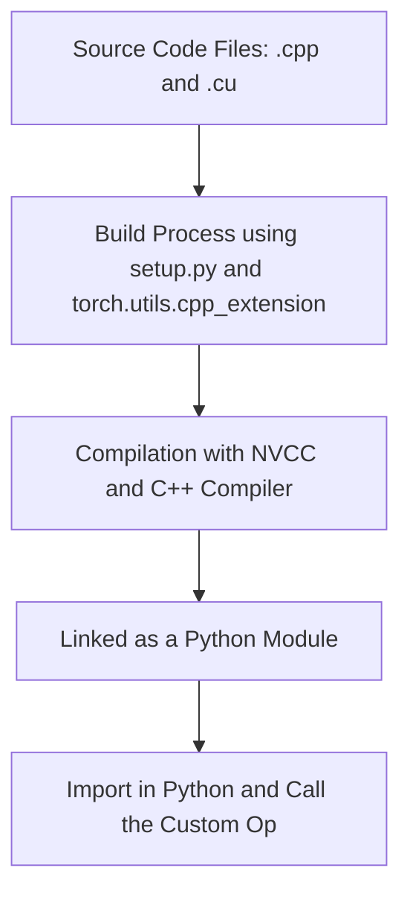
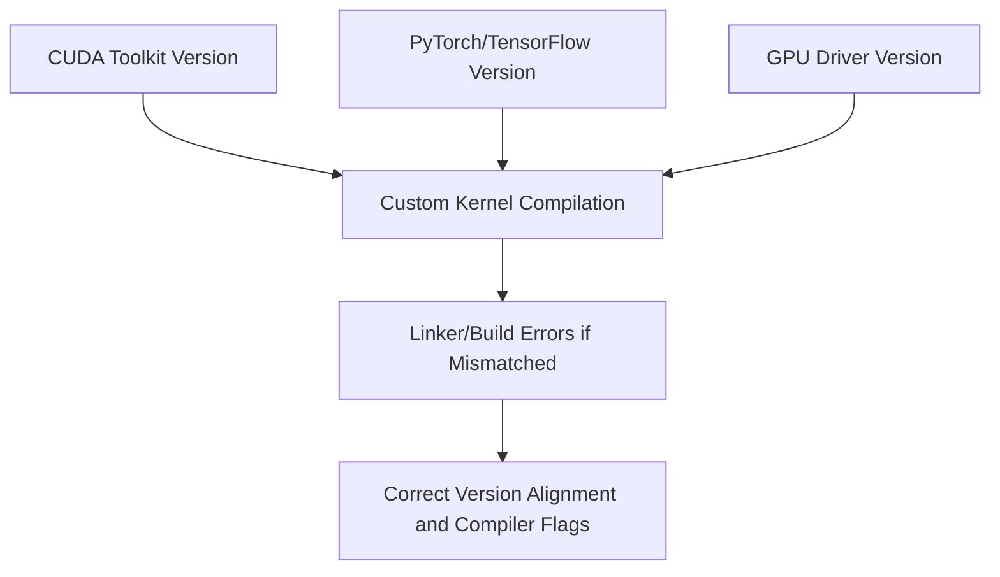

# Day 101: GPU-Accelerated ML Frameworks (Intro)

This lesson introduces the integration of custom CUDA kernels and layers into popular machine learning frameworks such as TensorFlow and PyTorch. By extending these frameworks with custom GPU-accelerated operations, you can optimize performance-critical parts of your ML pipelines. However, this process is complex—version mismatches between the framework, CUDA Toolkit, and driver can lead to build errors and runtime issues. In this lesson, we cover best practices for developing custom CUDA extensions, provide a sample implementation for PyTorch, and discuss common pitfalls.

---

## Table of Contents

1. [Overview](#1-overview)  
2. [Why Integrate Custom Kernels into ML Frameworks?](#2-why-integrate-custom-kernels-into-ml-frameworks)  
3. [Key Concepts and Challenges](#3-key-concepts-and-challenges)  
   - [a) Custom CUDA Kernels and Layers](#a-custom-cuda-kernels-and-layers)  
   - [b) Framework Integration (TensorFlow & PyTorch)](#b-framework-integration-tensorflow--pytorch)  
   - [c) Version Mismatches and Build Errors](#c-version-mismatches-and-build-errors)  
4. [Implementation Approach](#4-implementation-approach)  
   - [a) PyTorch CUDA Extensions](#a-pytorch-cuda-extensions)  
   - [b) TensorFlow Custom Ops (Overview)](#b-tensorflow-custom-ops-overview)  
5. [Code Example: PyTorch CUDA Extension](#5-code-example-pytorch-cuda-extension)  
6. [Comprehensive Conceptual Diagrams](#6-comprehensive-conceptual-diagrams)  
   - [Diagram 1: High-Level Workflow](#diagram-1-high-level-workflow)  
   - [Diagram 2: PyTorch Custom Op Integration](#diagram-2-pytorch-custom-op-integration)  
   - [Diagram 3: Pitfalls with Version Mismatches](#diagram-3-pitfalls-with-version-mismatches)  
7. [References & Further Reading](#7-references--further-reading)  
8. [Conclusion & Next Steps](#8-conclusion--next-steps)  

---

## 1. Overview

Integrating custom CUDA kernels into machine learning frameworks enables you to accelerate specific operations that are not optimized by default. Both TensorFlow and PyTorch support this capability through mechanisms such as TensorFlow Custom Ops and PyTorch CUDA Extensions. However, managing dependencies and ensuring compatibility across different software versions is critical to avoid build and runtime errors.

---

## 2. Why Integrate Custom Kernels into ML Frameworks?

- **Performance Optimization:** Customize and accelerate bottleneck operations (e.g., a custom layer in a neural network).
- **Flexibility:** Implement novel algorithms or experimental layers that are not yet available in the standard framework.
- **Tailored Solutions:** Optimize for specific hardware characteristics or application-specific requirements.

---

## 3. Key Concepts and Challenges

### a) Custom CUDA Kernels and Layers

- **Custom Kernels:** Implement operations directly in CUDA to exploit low-level GPU capabilities.
- **Custom Layers:** Wrap these kernels into high-level operations that integrate seamlessly with ML frameworks.

### b) Framework Integration (TensorFlow & PyTorch)

- **TensorFlow Custom Ops:** Allow you to define new operations using C++ and CUDA that can be used in TensorFlow graphs.
- **PyTorch CUDA Extensions:** Enable writing custom operations in C++/CUDA and exposing them as PyTorch operators via the torch::extension API.

### c) Version Mismatches and Build Errors

- **Compatibility Issues:** Differences between CUDA Toolkit versions, framework versions, and GPU drivers can lead to build errors.
- **Dependency Management:** Correctly set NVCC and compiler flags (e.g., -D_GLIBCXX_USE_CXX11_ABI) to ensure compatibility.
- **Best Practices:** Always refer to the official documentation for PyTorch CUDA Extensions and TensorFlow Custom Ops when setting up your build environment.

---

## 4. Implementation Approach

### a) PyTorch CUDA Extensions

- **Source Files:** Write your CUDA kernel (e.g., in a .cu file) and a C++ wrapper that uses the PyTorch extension API.
- **Build System:** Use `setup.py` with `torch.utils.cpp_extension` to compile and link the extension.
- **Usage:** Once compiled, the custom operator can be imported and used directly in your PyTorch code.

### b) TensorFlow Custom Ops (Overview)

- **Custom Ops:** Involve writing a C++ kernel, optionally with CUDA for GPU support, and registering the operation with TensorFlow.
- **Build Process:** Requires Bazel or CMake for compilation and careful management of dependency versions.
- **Note:** Detailed TensorFlow custom op integration is more involved; this lesson focuses on the PyTorch side as a representative example.

---

## 5. Code Example: PyTorch CUDA Extension

Below is a simplified example of a PyTorch CUDA extension that implements a custom kernel to add a constant value to a tensor.

### File: my_custom_kernel.cu

```cpp
#include <cuda_runtime.h>

// CUDA Kernel: Adds a constant to each element in the input array
__global__ void add_constant_kernel(const float* input, float* output, float constant, int num_elements) {
    int idx = blockIdx.x * blockDim.x + threadIdx.x;
    if (idx < num_elements) {
        output[idx] = input[idx] + constant;
    }
}
```

### File: my_custom_op.cpp

```cpp
#include <torch/extension.h>
#include <cuda.h>
#include <cuda_runtime.h>
#include <vector>

// Declaration of the CUDA kernel
void add_constant_kernel(const float* input, float* output, float constant, int num_elements);

void add_constant_cuda(torch::Tensor input, torch::Tensor output, float constant) {
    const int num_elements = input.numel();
    const int threads = 256;
    const int blocks = (num_elements + threads - 1) / threads;
    
    // Launch the kernel (casting pointers to float*)
    add_constant_kernel<<<blocks, threads>>>(input.data_ptr<float>(), output.data_ptr<float>(), constant, num_elements);
}

// C++ interface that will be called from Python
void add_constant(torch::Tensor input, torch::Tensor output, float constant) {
    add_constant_cuda(input, output, constant);
}

// Binding code
PYBIND11_MODULE(TORCH_EXTENSION_NAME, m) {
    m.def("add_constant", &add_constant, "Add constant to tensor (CUDA)");
}
```

### File: setup.py

```python
from setuptools import setup
from torch.utils.cpp_extension import BuildExtension, CUDAExtension

setup(
    name='my_custom_op',
    ext_modules=[
        CUDAExtension(
            name='my_custom_op',
            sources=['my_custom_op.cpp', 'my_custom_kernel.cu'],
        ),
    ],
    cmdclass={
        'build_ext': BuildExtension
    }
)
```

**Usage in Python:**

```python
import torch
import my_custom_op

# Create a tensor and an output tensor
input_tensor = torch.randn(1024, device='cuda')
output_tensor = torch.empty_like(input_tensor)

# Call the custom op
my_custom_op.add_constant(input_tensor, output_tensor, 5.0)
print(output_tensor)
```

---

## 6. Comprehensive Conceptual Diagrams

### Diagram 1: High-Level Workflow

```mermaid
flowchart TD
    A[Python Code]
    B[Import Custom CUDA Extension]
    C[Call Custom Op (e.g., add_constant)]
    D[C++ Wrapper Function (my_custom_op.cpp)]
    E[Launch CUDA Kernel (my_custom_kernel.cu)]
    F[GPU Performs Computation]
    G[Result Returned to Python]

    A --> B
    B --> C
    C --> D
    D --> E
    E --> F
    F --> G
```

**Explanation:**  
This diagram shows the overall flow from Python code calling the custom operation, through the C++ wrapper, to the CUDA kernel execution on the GPU and returning results to Python.

---

### Diagram 2: PyTorch CUDA Extension Integration



**Explanation:**  
This diagram illustrates the build and integration process for a PyTorch CUDA extension. The source files are compiled and linked into a Python module, which is then imported and used in Python.

---

### Diagram 3: Version Mismatch Pitfalls



**Explanation:**  
This diagram highlights potential pitfalls due to version mismatches among the CUDA Toolkit, ML framework (e.g., PyTorch), and GPU driver. Ensuring proper version alignment and using correct compiler flags is essential to avoid build and linker errors.

---

## 7. References & Further Reading

- [PyTorch CUDA Extensions Documentation](https://pytorch.org/tutorials/advanced/cpp_extension.html)
- [TensorFlow Custom Ops Guide](https://www.tensorflow.org/guide/create_op)
- [CUDA C Programming Guide – Separate Compilation and Linking](https://docs.nvidia.com/cuda/cuda-c-programming-guide/index.html#separate-compilation-and-linking)
- [NVIDIA Developer Blog – Custom Kernel Integration](https://developer.nvidia.com/blog/)

---

## 8. Conclusion & Next Steps

Integrating custom CUDA kernels into GPU-accelerated ML frameworks like PyTorch or TensorFlow provides an opportunity to optimize performance-critical operations. This capstone project demonstrated a complete workflow—from writing CUDA kernels and C++ wrappers to building and deploying a Python extension. While powerful, care must be taken to manage version compatibility and correct compilation flags to avoid build errors.

**Next Steps:**
- Experiment with more complex kernels and layers.
- Explore TensorFlow custom ops if you need to integrate with TensorFlow.
- Use profiling tools to measure the performance impact of your custom operations.
- Document your build environment and version dependencies to ensure long-term maintainability.

```

```
# Day 101b: Advanced GPU-Accelerated ML Frameworks Integration

Building on Day 101, where we introduced custom CUDA kernel integration into ML frameworks, Day 101b takes a deeper dive into advanced integration techniques, performance optimizations, and robust debugging strategies for custom operations in machine learning frameworks. This session focuses on improving performance, ensuring compatibility, and incorporating advanced features such as dynamic parameter updates and efficient error handling into your custom kernels for frameworks like PyTorch and TensorFlow.

---

## Table of Contents

1. [Overview](#1-overview)  
2. [Advanced Integration Strategies](#2-advanced-integration-strategies)  
   - [a) Dynamic Parameter Updates](#a-dynamic-parameter-updates)  
   - [b) Performance Profiling and Optimization](#b-performance-profiling-and-optimization)  
   - [c) Robust Error Handling and Debugging](#c-robust-error-handling-and-debugging)  
3. [Enhanced Build and Version Management](#3-enhanced-build-and-version-management)  
4. [Code Example: Enhanced PyTorch CUDA Extension](#4-code-example-enhanced-pytorch-cuda-extension)  
5. [Comprehensive Conceptual Diagrams](#5-comprehensive-conceptual-diagrams)  
   - [Diagram 1: Advanced Integration Workflow](#diagram-1-advanced-integration-workflow)  
   - [Diagram 2: Performance Optimization Feedback Loop](#diagram-2-performance-optimization-feedback-loop)  
   - [Diagram 3: Debugging and Error Handling Workflow](#diagram-3-debugging-and-error-handling-workflow)  
6. [References & Further Reading](#6-references--further-reading)  
7. [Conclusion & Next Steps](#7-conclusion--next-steps)

---

## 1. Overview

In this session, we extend the basic integration of custom CUDA kernels into ML frameworks by addressing challenges encountered in production-level, high-performance environments. Advanced integration techniques include:
- **Dynamic Parameter Updates:** Changing kernel parameters at runtime without rebuilding the extension.
- **Performance Profiling:** Utilizing tools to optimize kernel performance and manage resource utilization.
- **Robust Debugging:** Incorporating enhanced error checking and debugging mechanisms to handle complex multi-threaded and multi-device scenarios.
- **Build and Version Management:** Ensuring consistent compatibility between CUDA Toolkit, framework versions, and drivers through robust build scripts.

---

## 2. Advanced Integration Strategies

### a) Dynamic Parameter Updates

- **Concept:** Modify kernel parameters (e.g., constant values, data pointers) on the fly without needing to rebuild or reload the module.
- **Implementation:** Use function pointers or dynamic configuration structures in the C++ wrapper. Optionally, combine with CUDA Graph updates for iterative workflows.
- **Benefit:** Enables adaptive operations in ML pipelines (e.g., changing learning rates or thresholds) without incurring downtime.

### b) Performance Profiling and Optimization

- **Profiling Tools:** Leverage Nsight Compute, Nsight Systems, and PyTorch’s built-in profilers to monitor kernel execution times, register usage, and memory throughput.
- **Optimization Techniques:** Apply loop unrolling, shared memory optimization, and occupancy tuning (using flags like `-maxrregcount`) to maximize performance.
- **Feedback Loop:** Use iterative tuning based on profiling data to continuously refine kernel performance.

### c) Robust Error Handling and Debugging

- **Error Checking:** Integrate comprehensive error checks using macros (e.g., checking CUDA, cuDNN, and cuBLAS return statuses).
- **Debugging Integration:** Use cuda-gdb and Nsight Systems for detailed debugging, especially for intermittent issues in multi-threaded environments.
- **Version Management:** Ensure all components (frameworks, CUDA Toolkit, drivers) are compatible by maintaining clear build configurations.

---

## 3. Enhanced Build and Version Management

- **Build System:** Use a robust build system like CMake to manage dependencies and compilation flags consistently.
- **Version Control:** Document and enforce version requirements for the CUDA Toolkit, PyTorch/TensorFlow, and GPU drivers to prevent build errors.
- **Automation:** Automate builds with scripts that verify environment variables and dependency versions before compilation.

---

## 4. Code Example: Enhanced PyTorch CUDA Extension

This example extends the basic PyTorch CUDA extension by adding dynamic parameter updates and enhanced error handling. The custom kernel now supports dynamic updating of the constant value to be added to each tensor element.

**File: advanced_kernel.cu**
```cpp
#include <cuda_runtime.h>

// Advanced CUDA Kernel: Adds a dynamic constant to each element
__global__ void advancedAddKernel(const float* input, float* output, float constant, int num_elements) {
    int idx = blockIdx.x * blockDim.x + threadIdx.x;
    if (idx < num_elements) {
        output[idx] = input[idx] + constant;
    }
}
```

**File: advanced_op.cpp**
```cpp
#include <torch/extension.h>
#include <cuda.h>
#include <cuda_runtime.h>
#include <iostream>

// Declaration of the CUDA kernel
void advancedAddKernel(const float* input, float* output, float constant, int num_elements);

void advancedAddCUDA(torch::Tensor input, torch::Tensor output, float constant) {
    const int num_elements = input.numel();
    int threads = 256;
    int blocks = (num_elements + threads - 1) / threads;
    
    // Launch the kernel, ensuring proper error checking
    advancedAddKernel<<<blocks, threads>>>(input.data_ptr<float>(), output.data_ptr<float>(), constant, num_elements);
    
    // Check for kernel launch errors
    cudaError_t err = cudaGetLastError();
    if (err != cudaSuccess) {
        std::cerr << "CUDA kernel launch error: " << cudaGetErrorString(err) << std::endl;
        throw std::runtime_error("Kernel launch failed");
    }
}

void setConstant(torch::Tensor input, torch::Tensor output, float new_constant) {
    // This function can be used to update the constant parameter dynamically.
    advancedAddCUDA(input, output, new_constant);
}

// Binding code
PYBIND11_MODULE(TORCH_EXTENSION_NAME, m) {
    m.def("advanced_add", &advancedAddCUDA, "Add constant to tensor (CUDA) with advanced integration");
    m.def("set_constant", &setConstant, "Update constant dynamically in the custom op");
}
```

**File: setup.py**
```python
from setuptools import setup
from torch.utils.cpp_extension import BuildExtension, CUDAExtension

setup(
    name='advanced_op',
    ext_modules=[
        CUDAExtension(
            name='advanced_op',
            sources=['advanced_op.cpp', 'advanced_kernel.cu'],
        ),
    ],
    cmdclass={
        'build_ext': BuildExtension
    }
)
```

**Usage in Python:**
```python
import torch
import advanced_op

# Create input tensor and output tensor on GPU
input_tensor = torch.randn(1024, device='cuda')
output_tensor = torch.empty_like(input_tensor)

# Use the custom op with an initial constant value
advanced_op.advanced_add(input_tensor, output_tensor, 3.0)
print("Initial output:", output_tensor[:5])

# Dynamically update the constant value
advanced_op.set_constant(input_tensor, output_tensor, 5.0)
print("Updated output:", output_tensor[:5])
```

---

## 5. Comprehensive Conceptual Diagrams

### Diagram 1: Advanced Integration Workflow

```mermaid
flowchart TD
    A[Python Code Calls Custom Op]
    B[C++ Wrapper (advanced_op.cpp)]
    C[Launch CUDA Kernel (advanced_kernel.cu)]
    D[Dynamic Parameter Update (set_constant)]
    E[Error Handling & Profiling]
    F[Return Results to Python]

    A --> B
    B --> C
    C --> D
    D --> E
    E --> F
```

**Explanation:**  
This diagram illustrates the workflow from the Python interface through the C++ wrapper to the CUDA kernel, including dynamic updates and error handling.

---

### Diagram 2: Performance Optimization Feedback Loop

```mermaid
flowchart TD
    A[Profile Kernel Execution (Nsight Compute)]
    B[Measure Register Usage & Occupancy]
    C[Adjust Kernel Parameters/Unrolling]
    D[Rebuild CUDA Extension with Updated Settings]
    E[Test Performance & Accuracy]
    F[Iterate until optimal performance is reached]
    
    A --> B
    B --> C
    C --> D
    D --> E
    E --> F
    F --> A
```

**Explanation:**  
This diagram represents an iterative feedback loop for performance optimization, where profiling informs adjustments in kernel parameters and unrolling, and the process repeats until optimal performance is achieved.

---

### Diagram 3: Debugging and Error Handling Workflow

```mermaid
flowchart TD
    A[Launch Custom Op from Python]
    B[Kernel Execution in CUDA]
    C[Check for Errors (cudaGetLastError)]
    D[Use cuda-gdb/Nsight Systems if Error Detected]
    E[Update Code/Parameters Based on Debugging]
    F[Rebuild and Re-test Extension]
    
    A --> B
    B --> C
    C -- Error --> D
    D --> E
    E --> F
    F --> A
```

**Explanation:**  
This diagram outlines the debugging workflow, where errors during kernel execution trigger detailed debugging sessions using tools like cuda-gdb, leading to code updates and re-testing.

---

## 6. References & Further Reading

- [PyTorch CUDA Extensions Documentation](https://pytorch.org/tutorials/advanced/cpp_extension.html)  
- [TensorFlow Custom Ops Guide](https://www.tensorflow.org/guide/create_op)  
- [CUDA C Programming Guide – Separate Compilation and Linking](https://docs.nvidia.com/cuda/cuda-c-programming-guide/index.html#separate-compilation-and-linking)  
- [Nsight Systems Documentation](https://docs.nvidia.com/nsight-systems/)

---

## 7. Conclusion & Next Steps

Advanced integration of custom CUDA kernels into ML frameworks requires careful attention to dynamic parameter updates, performance profiling, and robust error handling. By leveraging these advanced techniques, you can create highly optimized, flexible custom operations that integrate seamlessly with frameworks like PyTorch and TensorFlow.

**Next Steps:**
- **Experiment:** Extend the example to include more complex operations (e.g., convolutional layers, iterative refinement).
- **Profile:** Use profiling tools to refine kernel performance further.
- **Enhance Debugging:** Integrate more advanced error handling and logging.
- **Explore TensorFlow Custom Ops:** Expand your skills by implementing similar functionality in TensorFlow.
- **Document:** Maintain thorough documentation for build processes and dependency management.

```
