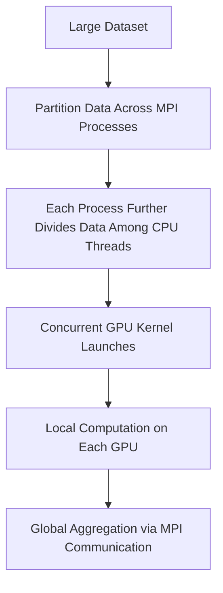
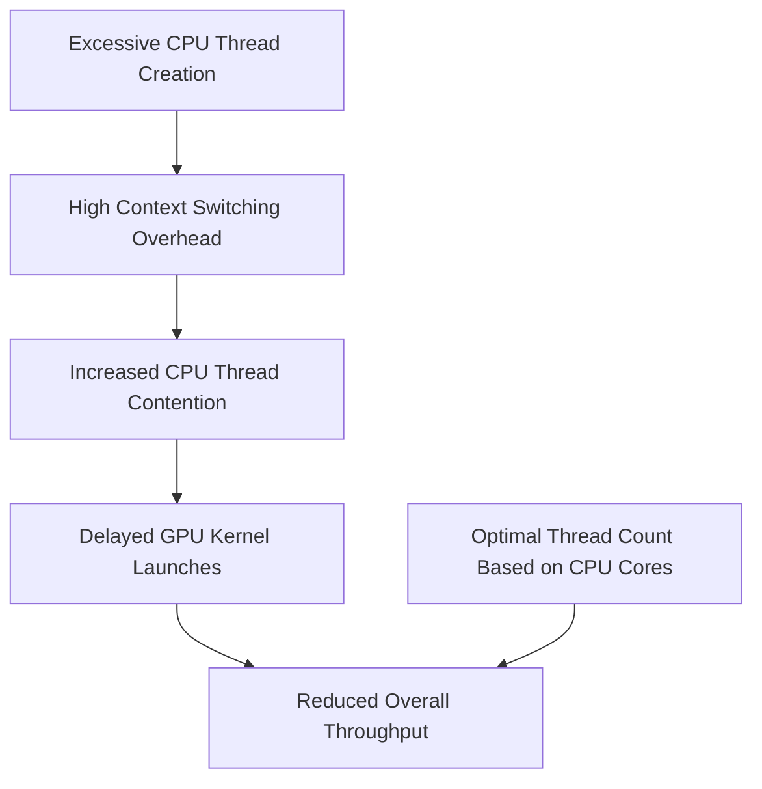

# Day 102: CUDA + Other Parallel Frameworks

Hybrid CPU/GPU parallelism is an essential strategy for maximizing performance in modern high-performance computing (HPC) applications. By combining CUDA-based GPU acceleration with CPU parallelism frameworks such as OpenMP and MPI, you can leverage the strengths of both architectures. However, integrating these frameworks introduces additional challenges such as workload partitioning complexities and the risk of CPU thread oversubscription, which can throttle performance.

This lesson explores the key concepts, strategies, and pitfalls associated with hybrid parallel programming. We will discuss how to partition workloads effectively, manage resource contention, and ensure that both CPU and GPU resources are utilized optimally.

---

## Table of Contents

1. [Overview](#1-overview)
2. [Introduction to Hybrid CPU/GPU Parallelism](#2-introduction-to-hybrid-cpugpu-parallelism)
3. [Using OpenMP and MPI with CUDA](#3-using-openmp-and-mpi-with-cuda)
   - [a) OpenMP for CPU Multithreading](#a-openmp-for-cpu-multithreading)
   - [b) MPI for Multi-Node Communication](#b-mpi-for-multi-node-communication)
4. [Partitioning Complexities](#4-partitioning-complexities)
5. [Oversubscription Risks and Mitigation Strategies](#5-oversubscription-risks-and-mitigation-strategies)
6. [Code Example: MPI + CUDA with OpenMP](#6-code-example-mpi--cuda-with-openmp)
7. [Comprehensive Conceptual Diagrams](#7-comprehensive-conceptual-diagrams)
   - [Diagram 1: Hybrid CPU/GPU Parallelism Architecture](#diagram-1-hybrid-cpugpu-parallelism-architecture)
   - [Diagram 2: Workload Partitioning in a Multi-Node Environment](#diagram-2-workload-partitioning-in-a-multi-node-environment)
   - [Diagram 3: Oversubscription Risk and Resource Management](#diagram-3-oversubscription-risk-and-resource-management)
8. [References & Further Reading](#8-references--further-reading)
9. [Conclusion & Next Steps](#9-conclusion--next-steps)

---

## 1. Overview

Hybrid parallel programming leverages both CPUs and GPUs to perform computations more efficiently. GPUs excel at data-parallel tasks, while CPUs, using frameworks like OpenMP, can manage complex control logic and parallel tasks that are not well-suited for GPUs. Additionally, MPI enables multi-node scaling by handling inter-node communications, which is critical for large-scale HPC applications. However, effective hybrid parallelism requires careful workload partitioning and resource management to avoid bottlenecks such as CPU thread contention.

---

## 2. Introduction to Hybrid CPU/GPU Parallelism

Hybrid CPU/GPU programming involves:
- **Concurrent Execution:** Offloading compute-intensive tasks to GPUs while using CPUs for control and less parallel work.
- **Multi-Threading on the Host:** Using OpenMP to parallelize CPU tasks and manage multiple GPU streams concurrently.
- **Multi-Node Communication:** Using MPI to coordinate tasks across different nodes in a cluster, each potentially running CUDA kernels.

This approach enables applications to achieve high throughput and scalability, provided that the workloads are partitioned correctly.

---

## 3. Using OpenMP and MPI with CUDA

### a) OpenMP for CPU Multithreading

OpenMP allows you to parallelize CPU-bound tasks by distributing work across multiple threads. When combined with CUDA, each thread can manage its own GPU stream or even launch CUDA kernels, thereby overlapping host computations with device execution.

### b) MPI for Multi-Node Communication

MPI is a standard for communication in distributed systems. In a multi-node environment, MPI can handle the coordination between nodes, enabling them to exchange data directly. When used with CUDA (and technologies like GPUDirect RDMA), MPI facilitates efficient GPU-to-GPU communication across different nodes.

---

## 4. Partitioning Complexities

Workload partitioning in a hybrid system involves:
- **Dividing Data:** Splitting large datasets into chunks that can be processed concurrently by multiple CPUs and GPUs.
- **Load Balancing:** Ensuring each processing unit (CPU thread or GPU) receives an approximately equal share of work.
- **Minimizing Overhead:** Avoiding excessive fragmentation of tasks that may increase communication and synchronization overhead.
- **Data Dependencies:** Maintaining correct execution order and data consistency across different parallel components.

---

## 5. Oversubscription Risks and Mitigation Strategies

**Oversubscription** occurs when too many CPU threads or tasks are scheduled concurrently, leading to context-switching overhead and resource contention. To mitigate oversubscription:
- **Tune Thread Count:** Use profiling tools to determine the optimal number of CPU threads relative to available cores.
- **Streamlined Scheduling:** Ensure that threads are efficiently coordinated and that excessive blocking or busy-waiting is avoided.
- **Resource Allocation:** Reserve dedicated resources for critical tasks, and avoid sharing GPU streams excessively among CPU threads.

---

## 6. Code Example: MPI + CUDA with OpenMP

Below is a simplified example that demonstrates a hybrid MPI + CUDA program using OpenMP for CPU multithreading. In this example, each MPI process launches an OpenMP-parallel region where each thread sets the device context, creates its own CUDA stream, and executes a simple CUDA kernel.

**File: hybrid_mpi_cuda.cpp**
```cpp
#include <mpi.h>
#include <cuda_runtime.h>
#include <omp.h>
#include <stdio.h>
#include <stdlib.h>

__global__ void simpleKernel(float* d_data, int N, float value) {
    int idx = blockIdx.x * blockDim.x + threadIdx.x;
    if (idx < N)
        d_data[idx] += value;
}

int main(int argc, char** argv) {
    // Initialize MPI
    MPI_Init(&argc, &argv);

    int world_rank, world_size;
    MPI_Comm_rank(MPI_COMM_WORLD, &world_rank);
    MPI_Comm_size(MPI_COMM_WORLD, &world_size);

    // Problem parameters
    int N = 1 << 20; // 1 million elements per MPI process
    size_t size = N * sizeof(float);

    // Each MPI process allocates its own host and device memory
    float* h_data = (float*)malloc(size);
    for (int i = 0; i < N; i++) {
        h_data[i] = (float)world_rank; // Initialize with the rank for differentiation
    }
    float* d_data;
    cudaMalloc(&d_data, size);
    cudaMemcpy(d_data, h_data, size, cudaMemcpyHostToDevice);

    // Use OpenMP to create multiple CPU threads per MPI process
    int num_threads = 4; // Adjust as needed
    #pragma omp parallel num_threads(num_threads)
    {
        int tid = omp_get_thread_num();
        // Set device context (assume one GPU per MPI process)
        cudaSetDevice(0);
        // Each thread creates its own stream
        cudaStream_t stream;
        cudaStreamCreate(&stream);

        // Define kernel launch parameters
        int threads = 256;
        int blocks = (N + threads - 1) / threads;
        float value = 1.0f; // Each thread adds 1.0f
        simpleKernel<<<blocks, threads, 0, stream>>>(d_data, N, value);

        // Synchronize the stream
        cudaStreamSynchronize(stream);
        cudaStreamDestroy(stream);
    }

    // Copy result back to host
    cudaMemcpy(h_data, d_data, size, cudaMemcpyDeviceToHost);

    // Print a sample result from each MPI process
    printf("MPI Rank %d: h_data[0] = %f\n", world_rank, h_data[0]);

    // Cleanup
    free(h_data);
    cudaFree(d_data);
    MPI_Finalize();
    return 0;
}
```

**Compilation Command Example:**
```bash
mpicxx -fopenmp -I/path/to/cuda/include -L/path/to/cuda/lib64 -lcudart -o hybrid_mpi_cuda hybrid_mpi_cuda.cpp
```

---

## 7. Comprehensive Conceptual Diagrams

### Diagram 1: Hybrid CPU/GPU Parallelism Architecture

```mermaid
flowchart TD
    A[Multiple MPI Processes (Nodes)]
    B[Each MPI Process Spawns CPU Threads via OpenMP]
    C[Each CPU Thread Sets GPU Device Context]
    D[Each Thread Creates Its Own CUDA Stream]
    E[CUDA Kernel Execution on GPU]
    F[Data Transfer & Synchronization]
    G[Results Aggregated in Each MPI Process]
    H[Inter-Process Communication via MPI]

    A --> B
    B --> C
    C --> D
    D --> E
    E --> F
    F --> G
    G --> H
```

**Explanation:**  
This diagram illustrates a multi-node setup where MPI processes on different nodes use OpenMP to manage multiple CPU threads. Each thread interacts with a GPU through its own stream, performing kernel execution and data transfers. Results are aggregated within each process and communicated across nodes via MPI.

---

### Diagram 2: Workload Partitioning in a Multi-Node Environment



**Explanation:**  
This diagram focuses on data partitioning in a multi-node cluster. A large dataset is split across MPI processes, and each process further partitions the data among CPU threads, which launch CUDA kernels concurrently. Finally, results are aggregated across nodes using MPI.

---

### Diagram 3: Oversubscription Risk and Resource Management



**Explanation:**  
This diagram highlights the risk of oversubscribing CPU threads. Too many threads lead to high context switching and contention, delaying GPU kernel launches and reducing throughput. Balancing the number of threads with the available CPU cores is crucial for maintaining performance.

---

## 8. References & Further Reading

- [MPI + CUDA Resources](https://developer.nvidia.com/mpi-cuda)
- [OpenMP Documentation](https://www.openmp.org/)
- [CUDA C Programming Guide – Multi-threaded Host Code](https://docs.nvidia.com/cuda/cuda-c-programming-guide/index.html#multi-threaded-host-code)
- HPC research papers on hybrid CPU/GPU parallelism

---

## 9. Conclusion & Next Steps

Integrating CUDA with other parallel frameworks like OpenMP and MPI allows you to build scalable, high-performance applications that leverage both CPU and GPU resources. While the benefits include increased throughput and efficient workload distribution, careful attention must be paid to partitioning data and managing CPU thread counts to avoid oversubscription. Profiling and iterative tuning are essential for balancing these complexities.

**Next Steps:**
- **Experiment:** Modify the provided code example to test different data partitioning strategies.
- **Profile:** Use tools like Nsight Systems to measure CPU thread overhead and GPU utilization.
- **Optimize:** Adjust OpenMP thread counts and MPI process distributions based on profiling results.
- **Scale:** Extend the design to a larger multi-node cluster environment.
- **Document:** Record configuration and performance metrics to inform future optimizations.

```
