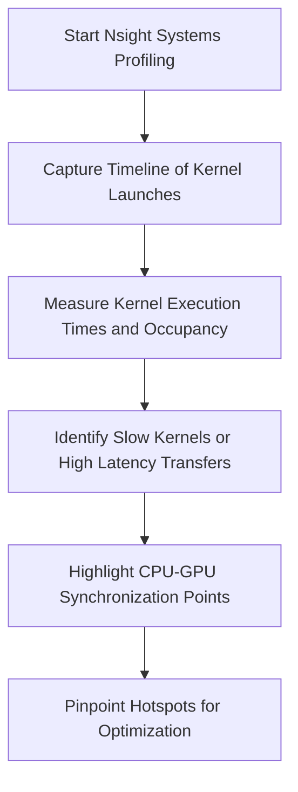

# Day 103: Tuning GPU-Accelerated ML Ops

In this session, we focus on optimizing machine learning operations on the GPU by profiling a small neural network or inference pipeline to identify performance bottlenecks. In production ML environments, even minor inefficiencies in CPU-GPU synchronization or data pipeline management can lead to significant slowdowns. Using profiling tools such as Nsight Systems—designed specifically for ML frameworks—you can pinpoint GPU hotspots, detect synchronization delays, and address data transfer bottlenecks.

This lesson covers:
- Techniques to profile and analyze ML pipelines.
- Methods for identifying CPU-GPU sync issues and data pipeline inefficiencies.
- Best practices to tune and optimize GPU-accelerated ML operations.

---

## Table of Contents

1. [Overview](#1-overview)
2. [Profiling GPU-Accelerated ML Ops](#2-profiling-gpu-accelerated-ml-ops)
3. [Identifying GPU Hotspots](#3-identifying-gpu-hotspots)
4. [CPU-GPU Synchronization and Data Pipeline Bottlenecks](#4-cpu-gpu-synchronization-and-data-pipeline-bottlenecks)
5. [Using Nsight Systems for ML Frameworks](#5-using-nsight-systems-for-ml-frameworks)
6. [Code Example: Simple Inference Pipeline in PyTorch](#6-code-example-simple-inference-pipeline-in-pytorch)
7. [Conceptual Diagrams](#7-conceptual-diagrams)
   - [Diagram 1: ML Inference Pipeline and CPU-GPU Sync](#diagram-1-ml-inference-pipeline-and-cpu-gpu-sync)
   - [Diagram 2: Identifying GPU Hotspots with Nsight Systems](#diagram-2-identifying-gpu-hotspots-with-nsight-systems)
   - [Diagram 3: Data Pipeline Bottleneck Visualization](#diagram-3-data-pipeline-bottleneck-visualization)
8. [References & Further Reading](#8-references--further-reading)
9. [Conclusion & Next Steps](#9-conclusion--next-steps)

---

## 1. Overview

GPU-accelerated ML operations can be highly efficient; however, optimizing performance requires more than just writing fast kernels. In ML applications, a neural network or inference pipeline may involve many layers, data transfers, and CPU preprocessing/postprocessing steps. Profiling these operations reveals:
- **GPU Hotspots:** Areas where kernel execution is the slowest.
- **CPU-GPU Synchronization Overhead:** Latency introduced by improper overlap of data transfers and computation.
- **Data Pipeline Bottlenecks:** Inefficient memory copies or suboptimal data preprocessing that delay GPU work.

---

## 2. Profiling GPU-Accelerated ML Ops

Profiling is the first step in tuning ML operations:
- **Nsight Systems:** Provides a timeline view that shows kernel launches, memory transfers, and CPU activity, enabling you to pinpoint delays.
- **Nsight Compute:** Offers detailed kernel metrics like achieved FLOPS, occupancy, and instruction throughput.
- **Framework Profilers:** Both PyTorch and TensorFlow have built-in profilers that can be used alongside Nsight tools for comprehensive analysis.

---

## 3. Identifying GPU Hotspots

GPU hotspots are regions in the computation where the majority of time is spent. They can be identified by:
- **Analyzing Kernel Execution Times:** Look at the duration of each kernel in the timeline.
- **Monitoring Occupancy and Throughput:** Low occupancy or poor throughput can indicate inefficient kernel design.
- **Checking Memory Access Patterns:** Uncoalesced accesses or frequent global memory transfers may be a hotspot.

---

## 4. CPU-GPU Synchronization and Data Pipeline Bottlenecks

Inefficient synchronization between the CPU and GPU can lead to idle GPU time:
- **Overlapping Data Transfers:** Use asynchronous transfers (cudaMemcpyAsync) to hide latency.
- **Minimizing Synchronization Points:** Avoid unnecessary synchronization that can delay kernel launches.
- **Data Pipeline Optimization:** Ensure that data preprocessing and postprocessing on the CPU do not become bottlenecks by using multithreading and efficient data loading.

---

## 5. Using Nsight Systems for ML Frameworks

Nsight Systems is a powerful tool that provides:
- **Timeline Visualization:** See all GPU and CPU activities in one view.
- **Identification of Bottlenecks:** Easily spot delays caused by data transfers or synchronization.
- **Detailed Metrics:** Understand how well kernels are utilizing GPU resources.
  
For ML frameworks, Nsight Systems can help you visualize how the entire inference pipeline (including host preprocessing, kernel execution, and data transfers) interacts, enabling targeted optimizations.

---

## 6. Code Example: Simple Inference Pipeline in PyTorch

Below is a simplified PyTorch example that creates a small neural network inference pipeline. Although the focus is on profiling, the code demonstrates the typical structure and integration points for optimization.

```python
import torch
import torch.nn as nn
import torch.nn.functional as F
import time
import nsight_systems  # Pseudocode: Replace with actual Nsight Systems integration if available

# Define a simple neural network with two layers.
class SimpleNet(nn.Module):
    def __init__(self):
        super(SimpleNet, self).__init__()
        self.fc1 = nn.Linear(1024, 512)
        self.fc2 = nn.Linear(512, 10)
    
    def forward(self, x):
        # Simulate computation; add activation and dropout if needed.
        x = F.relu(self.fc1(x))
        x = self.fc2(x)
        return x

# Initialize network and data
net = SimpleNet().cuda()
input_tensor = torch.randn(64, 1024, device='cuda')  # Batch size 64

# Warm-up run
with torch.no_grad():
    output = net(input_tensor)

# Profiling the inference pipeline
start = time.time()
with torch.no_grad():
    output = net(input_tensor)
torch.cuda.synchronize()
end = time.time()

print(f"Inference Time: {end - start:.6f} seconds")

# Pseudocode for Nsight Systems integration:
# nsight_systems.profile("SimpleNet Inference", net, input_tensor)

# Note: For a production-level system, integrate Nsight Systems CLI or GUI to capture
# detailed timeline data.
```

**Explanation:**
- **Network Definition:** A simple two-layer fully connected network is defined.
- **Data Preparation:** An input tensor is created and moved to the GPU.
- **Inference Profiling:** The inference time is measured while ensuring synchronization with `torch.cuda.synchronize()`.
- **Nsight Systems Integration:** While the actual integration is platform-dependent, the pseudocode indicates where to profile the application for GPU hotspots and synchronization issues.

---

## 7. Comprehensive Conceptual Diagrams

### Diagram 1: ML Inference Pipeline and CPU-GPU Sync

```mermaid
flowchart TD
    A[CPU: Load Data and Preprocess]
    B[Transfer Data to GPU (Async)]
    C[GPU: Neural Network Inference (Kernels)]
    D[Transfer Results Back to CPU (Async)]
    E[CPU: Postprocess and Output]
    
    A --> B
    B --> C
    C --> D
    D --> E
```

**Explanation:**  
This diagram illustrates the flow of a typical ML inference pipeline, highlighting data transfers and kernel executions, and showing the points where CPU-GPU synchronization is critical.

---

### Diagram 2: Identifying GPU Hotspots with Nsight Systems



**Explanation:**  
This diagram outlines how Nsight Systems is used to profile an ML inference pipeline, capturing timeline data and identifying areas where kernel execution or data transfers introduce delays.

---

### Diagram 3: Data Pipeline Bottleneck Visualization

```mermaid
flowchart TD
    A[Data Loader on CPU]
    B[Asynchronous Transfer to GPU]
    C[GPU: Inference Kernels]
    D[Asynchronous Transfer from GPU]
    E[Postprocessing on CPU]
    F[Monitor Data Pipeline Latency]
    G[Identify Bottlenecks (Data Transfer or Compute)]
    
    A --> B
    B --> C
    C --> D
    D --> E
    E --> F
    F --> G
```

**Explanation:**  
This diagram visualizes the data pipeline in an ML operation, showing each stage from data loading to postprocessing. It emphasizes the need to monitor and optimize both data transfer and computation stages to avoid bottlenecks.

---

## 8. References & Further Reading

- [Nsight Systems for ML Frameworks Documentation](https://docs.nvidia.com/nsight-systems/UserGuide/index.html)
- [CUDA C Programming Guide – Memory Transfer Best Practices](https://docs.nvidia.com/cuda/cuda-c-best-practices-guide/index.html#data-transfer)
- PyTorch Profiling Documentation: [PyTorch Profiler](https://pytorch.org/tutorials/recipes/recipes/profiler_recipe.html)
- [NVIDIA Developer Blog – GPU Profiling](https://developer.nvidia.com/blog/)

---

## 9. Conclusion & Next Steps

Tuning GPU-accelerated ML operations involves a holistic view of the entire data pipeline, from CPU data preparation to GPU kernel execution and back. Using profiling tools such as Nsight Systems, you can identify critical GPU hotspots and synchronization bottlenecks that degrade performance. By optimizing these areas—through asynchronous data transfers, efficient kernel design, and proper CPU-GPU overlap—you can significantly improve the performance of ML inference pipelines.

**Next Steps:**
- **Integrate Nsight Systems:** Use the tool to capture detailed timeline data for your ML workflows.
- **Optimize Data Transfers:** Experiment with different asynchronous transfer strategies and pinned memory configurations.
- **Refine Kernel Execution:** Analyze kernel performance and adjust occupancy and ILP parameters as needed.
- **Iterative Profiling:** Continuously profile and refine your pipeline to ensure optimal performance in production environments.

```
