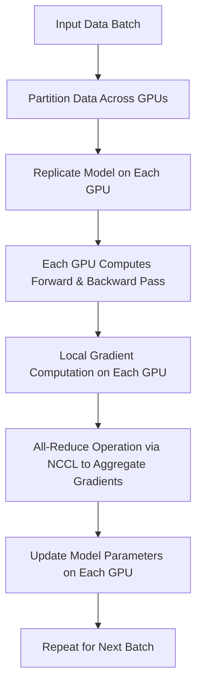
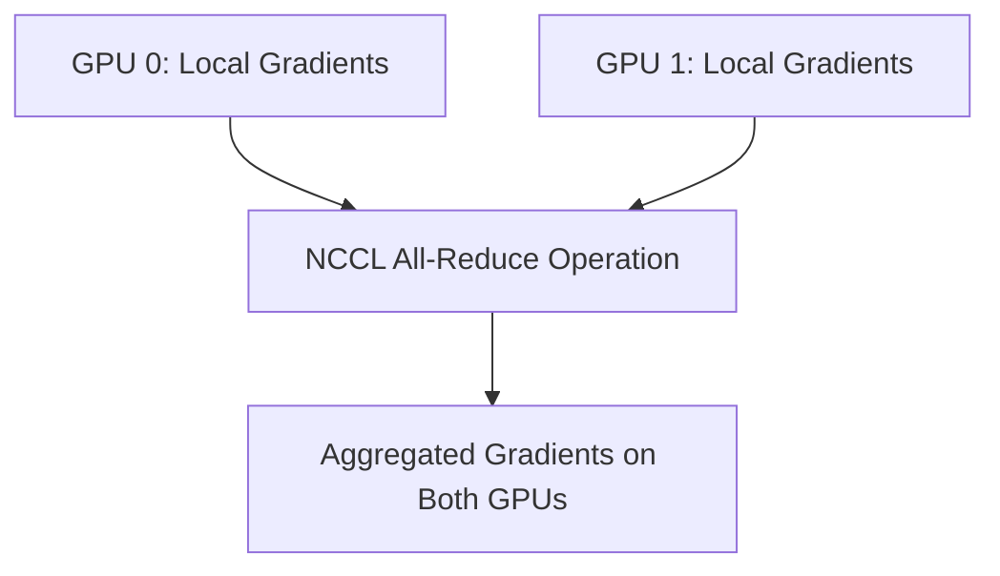
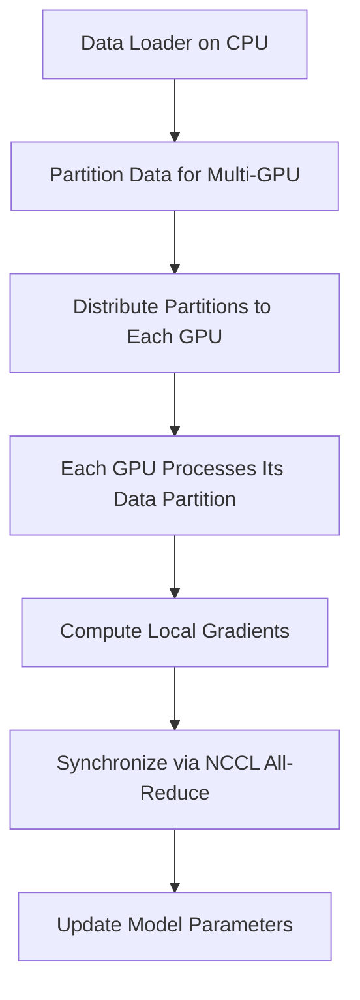

# Day 104: Multi-GPU Scaling in ML

Efficiently scaling machine learning training and inference across multiple GPUs is crucial for handling large datasets and complex models. In this session, we focus on distributing training workloads using data parallelism across multiple GPUs. We will explore techniques to minimize communication overhead and balance computation effectively using the NCCL library and other multi-GPU strategies.

---

## Table of Contents

1. [Overview](#1-overview)  
2. [Data Parallelism in Multi-GPU Training](#2-data-parallelism-in-multi-gpu-training)  
3. [Key Challenges in Multi-GPU Scaling](#3-key-challenges-in-multi-gpu-scaling)  
4. [Using the NCCL Library for Efficient Communication](#4-using-the-nccl-library-for-efficient-communication)  
5. [Implementation Approach](#5-implementation-approach)  
   - [a) Model Replication & Data Partitioning](#a-model-replication--data-partitioning)  
   - [b) Gradient Aggregation via All-Reduce](#b-gradient-aggregation-via-all-reduce)  
6. [Code Example: Multi-GPU All-Reduce using NCCL](#6-code-example-multi-gpu-all-reduce-using-nccl)  
7. [Comprehensive Conceptual Diagrams](#7-comprehensive-conceptual-diagrams)  
   - [Diagram 1: Multi-GPU Data Parallel Training Architecture](#diagram-1-multi-gpu-data-parallel-training-architecture)  
   - [Diagram 2: NCCL All-Reduce Communication Pattern](#diagram-2-nccl-all-reduce-communication-pattern)  
   - [Diagram 3: Workload Partitioning and Synchronization Flow](#diagram-3-workload-partitioning-and-synchronization-flow)  
8. [References & Further Reading](#8-references--further-reading)  
9. [Conclusion & Next Steps](#9-conclusion--next-steps)

---

## 1. Overview

Multi-GPU scaling in machine learning (ML) typically involves distributing a model's training workload across several GPUs using a data parallel approach. Each GPU processes a subset of the input data and computes gradients independently. A critical step is to aggregate these gradients (using an all-reduce operation) to update the model parameters consistently. The NCCL (NVIDIA Collective Communications Library) is a key tool in achieving efficient, low-latency communication between GPUs, minimizing overhead and ensuring scalability.

---

## 2. Data Parallelism in Multi-GPU Training

Data parallelism involves:
- **Replicating the model** on multiple GPUs.
- **Partitioning the dataset** so that each GPU processes a different mini-batch.
- **Independent gradient computation** on each GPU.
- **Aggregating gradients** (e.g., using an all-reduce operation) so that the model parameters are updated uniformly.

---

## 3. Key Challenges in Multi-GPU Scaling

- **Communication Overhead:** If gradient aggregation (e.g., all-reduce) is not efficiently implemented, the communication cost can dominate, slowing down training.
- **Load Imbalance:** Uneven data partitioning or hardware differences can lead to one GPU becoming a bottleneck.
- **Synchronization Issues:** Ensuring all GPUs are synchronized before parameter updates is critical for consistent training.
- **Scalability:** The approach must scale across multiple nodes in a cluster while minimizing latency.

---

## 4. Using the NCCL Library for Efficient Communication

The NCCL library is designed to:
- **Optimize Collective Operations:** Provide high-performance all-reduce, broadcast, and other collective communications.
- **Leverage GPU Topology:** Automatically exploit the underlying GPU interconnect (PCIe, NVLink) for optimal data transfer.
- **Support Multi-Node Communication:** When combined with MPI, NCCL can efficiently handle inter-node data transfers.

---

## 5. Implementation Approach

### a) Model Replication & Data Partitioning

- **Model Replication:** Copy the same model to all GPUs.
- **Data Partitioning:** Split the mini-batch across GPUs so that each GPU processes a subset.
- **Independent Execution:** Each GPU computes its own forward and backward pass.

### b) Gradient Aggregation via All-Reduce

- **All-Reduce Operation:** After gradient computation, use NCCL's all-reduce to sum gradients across GPUs.
- **Parameter Update:** Once gradients are aggregated, update the model parameters on each GPU.
- **Overlap Computation and Communication:** Use asynchronous operations to hide communication latency.

---

## 6. Code Example: Multi-GPU All-Reduce using NCCL

Below is a simplified example demonstrating gradient aggregation across two GPUs using NCCL for an all-reduce operation. In a real-world scenario, this would be part of a training loop.

```cpp
#include <nccl.h>
#include <cuda_runtime.h>
#include <stdio.h>

#define CHECK(cmd) do {                                 \
    cudaError_t e = cmd;                                \
    if( e != cudaSuccess ) {                            \
        printf("Failed: Cuda error %s:%d '%s'\n",       \
            __FILE__,__LINE__,cudaGetErrorString(e));   \
        exit(EXIT_FAILURE);                             \
    }                                                   \
} while(0)

#define NCCL_CHECK(cmd) do {                            \
    ncclResult_t r = cmd;                               \
    if (r != ncclSuccess) {                             \
        printf("Failed, NCCL error %s:%d '%s'\n",        \
            __FILE__,__LINE__,ncclGetErrorString(r));   \
        exit(EXIT_FAILURE);                             \
    }                                                   \
} while(0)

int main() {
    const int numDevices = 2;
    int devices[numDevices] = {0, 1};
    CHECK(cudaSetDevice(devices[0]));

    // Allocate memory for gradients on each GPU.
    const int numElements = 1 << 20;
    size_t size = numElements * sizeof(float);
    float *d_grad[numDevices];
    for (int i = 0; i < numDevices; i++) {
        CHECK(cudaSetDevice(devices[i]));
        CHECK(cudaMalloc(&d_grad[i], size));
        // Initialize gradients for demonstration (e.g., set all to 1.0f)
        CHECK(cudaMemset(d_grad[i], 0, size));
        // For simplicity, you might use a kernel to fill with 1.0f.
    }

    // Initialize NCCL communicator.
    ncclComm_t comm;
    NCCL_CHECK(ncclCommInitAll(&comm, numDevices, devices));

    // Perform an all-reduce operation to aggregate gradients.
    // This simulates summing gradients across GPUs.
    NCCL_CHECK(ncclAllReduce((const void*)d_grad[0], (void*)d_grad[0], numElements, ncclFloat, ncclSum, comm, cudaStreamDefault));

    // Synchronize all devices.
    for (int i = 0; i < numDevices; i++) {
        CHECK(cudaSetDevice(devices[i]));
        CHECK(cudaDeviceSynchronize());
    }

    // Finalize NCCL communicator.
    ncclCommDestroy(comm);

    // Cleanup: Free device memory.
    for (int i = 0; i < numDevices; i++) {
        CHECK(cudaSetDevice(devices[i]));
        CHECK(cudaFree(d_grad[i]));
    }

    printf("NCCL all-reduce completed successfully.\n");
    return 0;
}
```

**Explanation:**
- Two GPUs are used to simulate gradient aggregation.
- Each GPU allocates memory for gradients and initializes them.
- NCCL is initialized to manage communication between GPUs.
- An all-reduce operation aggregates the gradients.
- Synchronization ensures that the operation completes before cleanup.

---

## 7. Comprehensive Conceptual Diagrams

### Diagram 1: Multi-GPU Data Parallel Training Architecture



**Explanation:**  
This diagram outlines a typical data-parallel training workflow where the input batch is partitioned among GPUs, local gradients are computed, and then aggregated via NCCL before updating model parameters.

---

### Diagram 2: NCCL All-Reduce Communication Pattern



**Explanation:**  
This diagram focuses on the communication pattern used by NCCL. Both GPUs contribute their local gradients to an all-reduce operation, resulting in aggregated gradients available on all GPUs.

---

### Diagram 3: Workload Partitioning and Synchronization Flow



**Explanation:**  
This diagram shows the entire workflow from data loading and partitioning on the CPU, distribution to multiple GPUs, local computation of gradients, and final synchronization and parameter updates using NCCL, emphasizing the importance of balanced workload partitioning and synchronization.

---

## 8. References & Further Reading

- [NCCL Library Documentation](https://docs.nvidia.com/deeplearning/nccl/user-guide/index.html)
- [MPI + CUDA Resources](https://developer.nvidia.com/mpi-cuda)
- [CUDA C Programming Guide – Multi-GPU Programming](https://docs.nvidia.com/cuda/cuda-c-programming-guide/index.html#multi-gpus)
- HPC research papers on multi-GPU scaling and data parallelism

---

## 9. Conclusion & Next Steps

Multi-GPU scaling in ML applications is a powerful approach to accelerate training and inference. By effectively partitioning workloads, synchronizing using efficient communication libraries like NCCL, and balancing computational loads across GPUs, you can significantly reduce training times and enhance throughput. However, attention must be given to minimizing communication overhead and preventing load imbalance.

**Next Steps:**
- **Experiment with Different Partitioning Strategies:** Adjust data splits and monitor GPU utilization.
- **Profile Communication Overhead:** Use tools like Nsight Systems to measure the latency of all-reduce operations.
- **Optimize Kernel Execution:** Fine-tune kernel parameters to further improve performance.
- **Scale to Multi-Node Clusters:** Integrate MPI to extend multi-GPU scaling beyond a single node.
- **Document Your Configuration:** Keep track of optimal settings and environment details for reproducibility.

```
