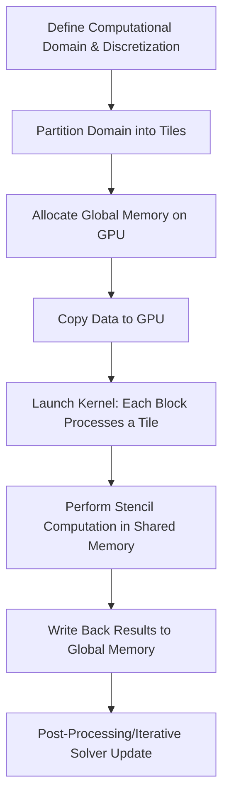
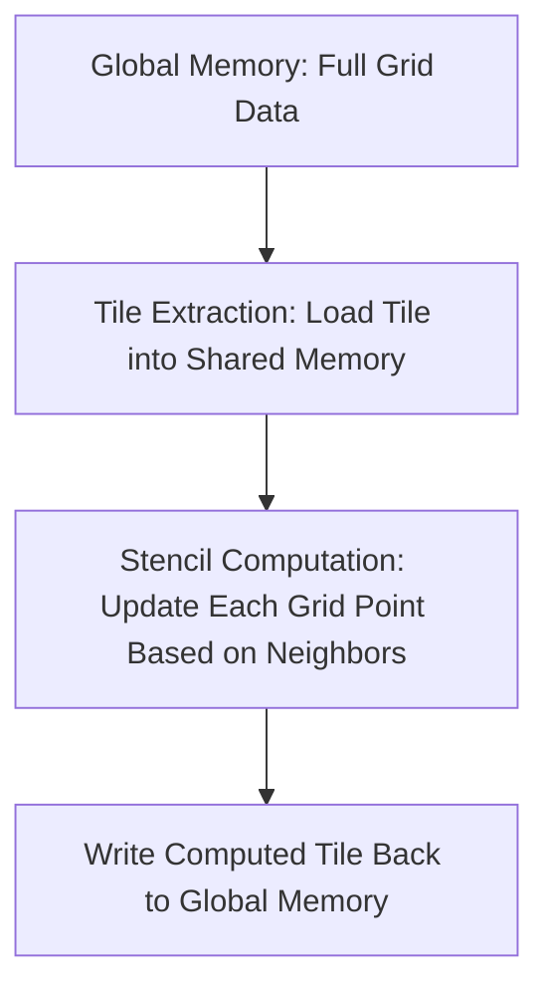
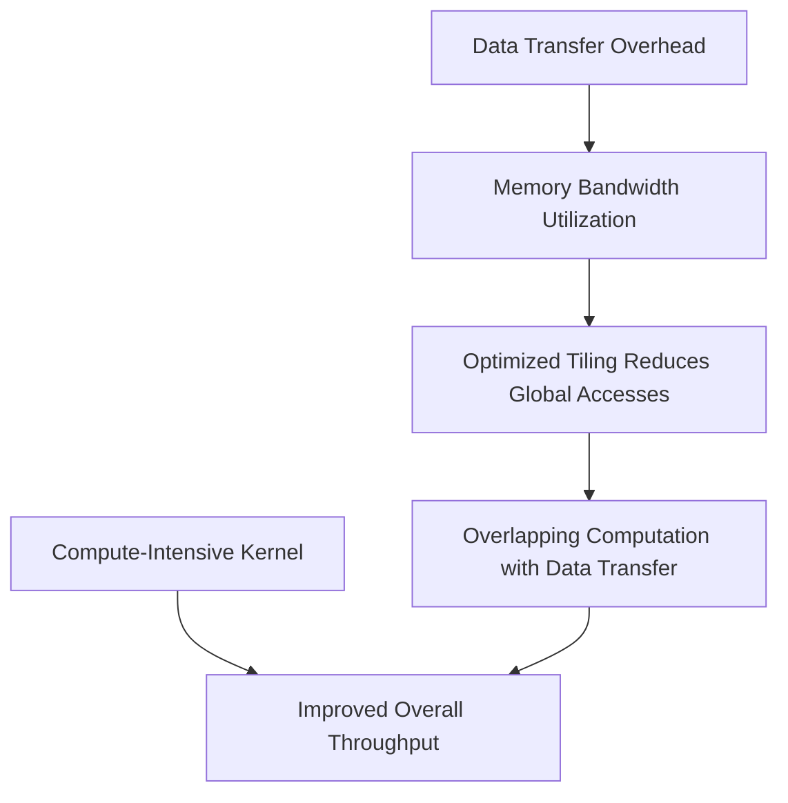

# Day 105: HPC – Memory Throughput & Computation

High-performance computing (HPC) applications—such as partial differential equation (PDE) solvers and climate modeling—demand efficient management of both memory throughput and computational performance. In many of these applications, the kernels are memory-bound, particularly when implementing large stencil operations. In this lesson, we review HPC patterns for GPU acceleration, discuss strategies to optimize memory-bound kernels, and explore how domain-specific tools like NVIDIA's AMGX can help accelerate solvers.

---

## Table of Contents

1. [Overview](#1-overview)  
2. [HPC Patterns for GPU Acceleration](#2-hpc-patterns-for-gpu-acceleration)  
   - [a) PDE Solvers and Climate Modeling](#a-pde-solvers-and-climate-modeling)  
   - [b) Large Stencil Computations](#b-large-stencil-computations)  
3. [Memory Throughput Challenges](#3-memory-throughput-challenges)  
4. [Optimization Strategies](#4-optimization-strategies)  
   - [a) Tiling and Blocking](#a-tiling-and-blocking)  
   - [b) Overlapping Computation and Data Transfers](#b-overlapping-computation-and-data-transfers)  
5. [AMGX and Domain-Specific Libraries](#5-amgx-and-domain-specific-libraries)  
6. [Step-by-Step Implementation Approach](#6-step-by-step-implementation-approach)  
7. [Conceptual Diagrams](#7-conceptual-diagrams)  
   - [Diagram 1: HPC Workflow for GPU Acceleration](#diagram-1-hpc-workflow-for-gpu-acceleration)  
   - [Diagram 2: Memory-Bound Stencil Computation](#diagram-2-memory-bound-stencil-computation)  
   - [Diagram 3: Data Throughput vs. Computation in HPC Patterns](#diagram-3-data-throughput-vs-computation-in-hpc-patterns)  
8. [References & Further Reading](#8-references--further-reading)  
9. [Conclusion & Next Steps](#9-conclusion--next-steps)

---

## 1. Overview

HPC applications in domains like PDE solvers and climate modeling often rely on large-scale stencil computations that are memory-bound. Optimizing these applications on GPUs requires a careful balance between maximizing memory throughput and performing the necessary computations efficiently. This lesson explains the underlying challenges and provides strategies to overcome them.

---

## 2. HPC Patterns for GPU Acceleration

### a) PDE Solvers and Climate Modeling

- **PDE Solvers:**  
  Solving PDEs typically involves discretizing a domain into a grid and applying numerical methods (e.g., finite differences, finite volumes) over this grid. Each grid point often depends on its neighbors, leading to large stencil operations.
  
- **Climate Modeling:**  
  Climate models simulate atmospheric, oceanic, and land processes on a global scale. These models also use grid-based methods where data from neighboring cells are used to compute local changes.

### b) Large Stencil Computations

- **Definition:**  
  A stencil computation involves updating each point in a grid based on the values of its neighbors. In many HPC applications, the stencil size can be very large, leading to heavy memory traffic.
- **Challenges:**  
  - **Memory Bound:** The performance is often limited by memory bandwidth rather than raw computational throughput.
  - **Data Locality:** Optimizing data reuse (e.g., via tiling) is critical to reduce global memory accesses.

---

## 3. Memory Throughput Challenges

- **Memory Bandwidth Limitation:**  
  In many stencil computations, the number of memory accesses dominates the number of arithmetic operations. Optimizing for high throughput means minimizing redundant global memory accesses.
- **Cache Utilization:**  
  GPUs have fast on-chip memory (shared memory and registers), but effective use requires careful data layout and tiling strategies.
- **Latency Hiding:**  
  Overlapping data transfers with computation and optimizing memory access patterns are crucial for reducing latency.

---

## 4. Optimization Strategies

### a) Tiling and Blocking

- **Tiling:**  
  Divide the computational grid into smaller blocks (tiles) that can be loaded into shared memory. This increases data reuse and reduces global memory traffic.
- **Blocking:**  
  Organize computations such that each block processes a tile, minimizing the need for frequent global memory access.

### b) Overlapping Computation and Data Transfers

- **Asynchronous Transfers:**  
  Use asynchronous memory copy operations (e.g., `cudaMemcpyAsync`) to overlap data transfer with kernel execution.
- **Stream Management:**  
  Utilize multiple CUDA streams to concurrently execute data transfers and computations.

---

## 5. AMGX and Domain-Specific Libraries

- **AMGX:**  
  NVIDIA’s AMGX is a library designed for accelerating iterative solvers, particularly for sparse linear systems arising in HPC applications such as PDE solvers.  
- **Domain-Specific Tools:**  
  Along with AMGX, various HPC research papers provide guidelines on optimizing tiling strategies, memory throughput, and parallel computation for large stencil operations.

---

## 6. Step-by-Step Implementation Approach

1. **Problem Setup:**
   - Discretize the computational domain (e.g., a 2D grid for a PDE).
   - Define the stencil pattern and computational kernel.

2. **Memory Allocation:**
   - Allocate global memory on the GPU for the input and output grids.
   - Optionally, allocate shared memory within the kernel to hold tiles.

3. **Tiling and Blocking:**
   - Divide the grid into tiles that fit into shared memory.
   - Launch the kernel such that each thread block processes one tile.

4. **Kernel Implementation:**
   - Load the tile from global memory into shared memory.
   - Perform the stencil computation using the shared memory tile.
   - Write the results back to global memory.

5. **Overlap Computation and Data Transfer:**
   - Use asynchronous memory copy (if data is streaming in) to overlap with kernel execution.

6. **Performance Profiling:**
   - Use profiling tools (e.g., Nsight Compute) to measure memory throughput and identify bottlenecks.
   - Adjust tile sizes and loop unrolling factors as necessary.

7. **Integration with HPC Libraries:**
   - Optionally, integrate with AMGX for solving large sparse linear systems if your application requires it.

---

## 7. Comprehensive Conceptual Diagrams

### Diagram 1: HPC Workflow for GPU Acceleration



**Explanation:**  
This diagram illustrates the complete workflow for an HPC application. The domain is partitioned into tiles, data is transferred to the GPU, and each block processes its tile using shared memory before results are written back and further processed.

---

### Diagram 2: Memory-Bound Stencil Computation



**Explanation:**  
This diagram focuses on the stencil computation process. A tile is loaded from global memory into shared memory, computations are performed using the tile (minimizing global accesses), and the updated tile is written back to global memory.

---

### Diagram 3: Data Throughput vs. Computation in HPC Patterns



**Explanation:**  
This diagram compares the balance between data transfer overhead and computation. Optimized tiling reduces global memory accesses, and overlapping transfers with computation improves overall throughput, achieving an efficient balance between memory and compute operations.

---

## 8. References & Further Reading

- [AMGX](https://developer.nvidia.com/amgx) – NVIDIA’s library for GPU-accelerated iterative solvers.
- HPC research papers on tiling strategies and memory throughput in stencil computations.
- [CUDA C Programming Guide – Memory Throughput](https://docs.nvidia.com/cuda/cuda-c-programming-guide/index.html#memory-hierarchy)
- [Nsight Compute Documentation](https://docs.nvidia.com/nsight-compute/)

---

## 9. Conclusion & Next Steps

Optimizing HPC applications on GPUs requires a deep understanding of both memory throughput and computational performance. By employing tiling and blocking strategies, you can significantly reduce the overhead of memory-bound stencil computations. Tools like Nsight Compute and domain-specific libraries such as AMGX can further aid in refining performance. The key is to iteratively profile, tune, and balance the workload to achieve optimal performance.

**Next Steps:**
- **Implement a Prototype:** Develop a simple stencil computation kernel and test various tile sizes.
- **Profile and Optimize:** Use Nsight Compute to identify memory bottlenecks and adjust parameters.
- **Integrate HPC Libraries:** Experiment with integrating AMGX into your iterative solvers for further acceleration.
- **Scale Up:** Extend your approach to more complex HPC applications such as climate modeling.
- **Document Findings:** Keep detailed records of tuning parameters and performance gains for future reference.

```
