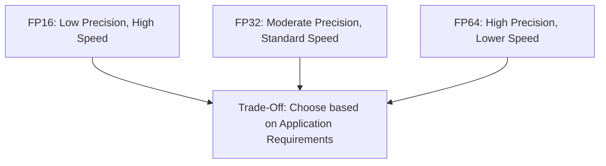
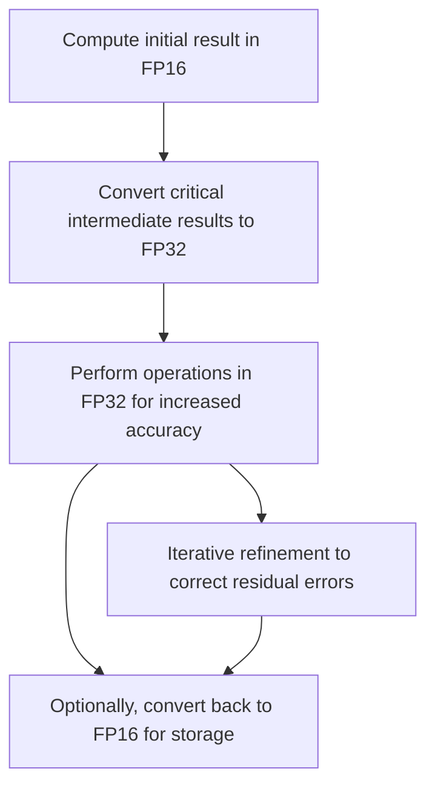

# Day 106: HPC – Precision & Mixed Precision

In many HPC applications—such as large-scale simulations and scientific computations—numerical precision is crucial. However, full double precision (FP64) can be computationally expensive and memory intensive. Mixed precision techniques, including the use of half precision (FP16) or even custom lower-precision data types, offer a promising alternative to accelerate computations while reducing energy and memory footprints. The challenge is to ensure that these techniques do not compromise numerical stability, which is vital for obtaining accurate results.

This lesson discusses the benefits and challenges of using mixed precision in HPC kernels, strategies to ensure numerical stability, and best practices as discussed in HPC research, including insights from SC conference proceedings.

---

## Table of Contents

1. [Overview](#1-overview)  
2. [Mixed Precision in HPC Applications](#2-mixed-precision-in-hpc-applications)  
   - [a) Benefits of Lower Precision](#a-benefits-of-lower-precision)  
   - [b) Challenges and Numerical Stability](#b-challenges-and-numerical-stability)  
3. [Techniques for Ensuring Stability](#3-techniques-for-ensuring-stability)  
   - [a) Error Compensation Methods](#a-error-compensation-methods)  
   - [b) Iterative Refinement](#b-iterative-refinement)  
   - [c) Custom Data Types](#c-custom-data-types)  
4. [Code Example: Mixed Precision Kernel Using FP16](#4-code-example-mixed-precision-kernel-using-fp16)  
5. [Conceptual Diagrams](#5-conceptual-diagrams)  
   - [Diagram 1: Comparison of Precision Levels](#diagram-1-comparison-of-precision-levels)  
   - [Diagram 2: Mixed Precision Computation Workflow](#diagram-2-mixed-precision-computation-workflow)  
   - [Diagram 3: Error Correction Flow with Iterative Refinement](#diagram-3-error-correction-flow-with-iterative-refinement)  
6. [References & Further Reading](#6-references--further-reading)  
7. [Conclusion & Next Steps](#7-conclusion--next-steps)

---

## 1. Overview

High-performance computing applications often require balancing the trade-off between computational speed and numerical accuracy. Mixed precision computing allows HPC kernels to run faster and use less memory by employing lower-precision data types (such as FP16) for most of the computation, while using higher precision (FP32 or FP64) where critical. However, reducing precision can introduce rounding errors and stability issues. Therefore, verifying numerical stability is essential.

---

## 2. Mixed Precision in HPC Applications

### a) Benefits of Lower Precision

- **Increased Throughput:** FP16 arithmetic can be significantly faster than FP32/FP64 on hardware optimized for mixed precision (e.g., Tensor Cores).
- **Reduced Memory Footprint:** Lower precision uses less memory bandwidth, allowing more data to be processed concurrently.
- **Energy Efficiency:** Lower precision operations typically consume less power.

### b) Challenges and Numerical Stability

- **Rounding Errors:** Reduced precision increases the risk of rounding errors that can accumulate over many iterations.
- **Loss of Significant Digits:** FP16 provides only about 3–4 decimal digits of precision, which might be insufficient for some scientific computations.
- **Stability Verification:** It is crucial to compare the mixed precision results against higher-precision baselines to ensure that errors remain within acceptable bounds.

---

## 3. Techniques for Ensuring Stability

### a) Error Compensation Methods

- **Kahan Summation Algorithm:** While typically used for summing a sequence of numbers, similar compensation techniques can be applied to reduce rounding error in iterative computations.
  
### b) Iterative Refinement

- **Iterative Refinement:** Start with a low-precision solution and iteratively compute and correct the residual error using high precision. This strategy combines the speed of FP16 with the accuracy of FP32 or FP64.

### c) Custom Data Types

- **Custom Lower-Precision Formats:** In some cases, custom data types that balance precision and performance can be designed for specific applications.
- **Mixed Precision Libraries:** Libraries like NVIDIA’s TensorRT or frameworks that leverage Tensor Cores can automatically manage mixed precision to maximize performance while maintaining acceptable accuracy.

---

## 4. Code Example: Mixed Precision Kernel Using FP16

Below is a simple CUDA kernel that demonstrates the use of half precision (FP16) for computation, with an example of how you might later integrate an error correction step.

```cpp
#include <cuda_fp16.h>
#include <stdio.h>

// CUDA kernel using half precision for computation
__global__ void halfPrecisionKernel(const half* d_input, half* d_output, int N, half factor) {
    int idx = blockIdx.x * blockDim.x + threadIdx.x;
    if (idx < N) {
        // Convert half to float for multiplication to reduce intermediate rounding error
        float val = __half2float(d_input[idx]);
        float result = val * __half2float(factor);
        // Convert back to half and store the result
        d_output[idx] = __float2half(result);
    }
}

int main() {
    int N = 1 << 20;
    size_t size = N * sizeof(half);

    // Allocate host memory for input and output (using half precision)
    half* h_input = (half*)malloc(size);
    half* h_output = (half*)malloc(size);

    // Initialize input data on host (e.g., set all elements to 1.0 in half precision)
    for (int i = 0; i < N; i++) {
        h_input[i] = __float2half(1.0f);
    }

    // Allocate device memory
    half *d_input, *d_output;
    cudaMalloc(&d_input, size);
    cudaMalloc(&d_output, size);
    cudaMemcpy(d_input, h_input, size, cudaMemcpyHostToDevice);

    int threads = 256;
    int blocks = (N + threads - 1) / threads;
    half factor = __float2half(2.0f);

    // Launch the kernel
    halfPrecisionKernel<<<blocks, threads>>>(d_input, d_output, N, factor);
    cudaDeviceSynchronize();

    // Copy results back to host
    cudaMemcpy(h_output, d_output, size, cudaMemcpyDeviceToHost);

    // Print sample result
    printf("Result (first element): %f\n", __half2float(h_output[0]));

    // Cleanup
    cudaFree(d_input);
    cudaFree(d_output);
    free(h_input);
    free(h_output);

    return 0;
}
```

**Explanation:**
- The kernel uses half precision to perform a multiplication operation.
- Intermediate conversion to float is used to reduce the impact of rounding errors during computation.
- The result is then converted back to half precision before storing.

---

## 5. Comprehensive Conceptual Diagrams

### Diagram 1: Comparison of Precision Levels



**Explanation:**  
This diagram compares FP16, FP32, and FP64, emphasizing the trade-offs between speed and numerical precision, which is central to mixed precision strategies.

---

### Diagram 2: Mixed Precision Computation Workflow



**Explanation:**  
This diagram shows the workflow where low-precision computation is combined with high-precision correction steps, enabling performance benefits while ensuring numerical accuracy.

---

### Diagram 3: Error Correction Flow with Iterative Refinement

```mermaid
flowchart TD
    A[Initial Low-Precision (FP16) Computation]
    B[Compute Residual Error in FP32]
    C[Update the Result with Correction]
    D[Iterate until Convergence]
    E[Final High-Accuracy Result]
    
    A --> B
    B --> C
    C --> D
    D --> E
```

**Explanation:**  
This diagram illustrates the iterative refinement process, where an initial low-precision result is successively corrected using high-precision calculations until the final result converges to the desired accuracy.

---

## 6. References & Further Reading

- [Kahan Summation Algorithm (Wikipedia)](https://en.wikipedia.org/wiki/Kahan_summation_algorithm)
- HPC conference proceedings (SC, IEEE) on mixed precision techniques
- [NVIDIA AMGX](https://developer.nvidia.com/amgx) – GPU-accelerated solvers with mixed precision support
- [CUDA C Programming Guide – Floating Point Computations](https://docs.nvidia.com/cuda/cuda-c-programming-guide/index.html#floating-point-computations)

---

## 7. Conclusion & Next Steps

Mixed precision computing offers significant performance advantages in HPC applications by reducing memory usage and accelerating arithmetic operations. However, careful management of numerical precision is critical to ensure stability. Techniques such as converting intermediate results to higher precision, iterative refinement, and error compensation (e.g., Kahan Summation) are essential to mitigate rounding errors.

**Next Steps:**
- **Experiment:** Implement more complex kernels with mixed precision and compare performance and accuracy against full precision versions.
- **Profile:** Use tools like Nsight Compute to monitor the performance impact of mixed precision operations.
- **Iterate:** Explore iterative refinement strategies in real-world HPC applications (e.g., PDE solvers).
- **Document:** Keep detailed records of precision-related trade-offs for future optimization.
- **Expand:** Consider custom data types if standard precisions do not meet your application’s needs.

```
