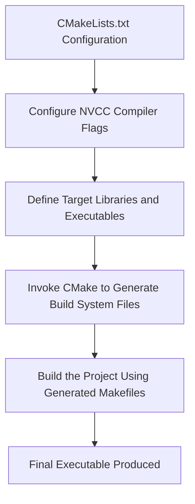

# Day 109: Large-Scale Code, Maintainability

In large-scale CUDA projects, maintainability and modularity are as critical as raw performance. Organizing your code into distinct modules and libraries not only makes your code easier to manage, debug, and extend, but also facilitates collaboration across teams. Additionally, using build systems like CMake can simplify the compilation and linking process—especially when separate compilation is required. Ignoring the nuances of separate compilation can lead to linker errors and compatibility issues.

---

## Table of Contents

1. [Overview](#1-overview)  
2. [Importance of Code Organization](#2-importance-of-code-organization)  
3. [Modules and Libraries in CUDA Projects](#3-modules-and-libraries-in-cuda-projects)  
4. [Separate Compilation Steps](#4-separate-compilation-steps)  
5. [Using CMake for Builds](#5-using-cmake-for-builds)  
6. [Common Pitfalls and Linker Errors](#6-common-pitfalls-and-linker-errors)  
7. [Code Example](#7-code-example)  
8. [Conceptual Diagrams](#8-conceptual-diagrams)  
   - [Diagram 1: Project File Organization](#diagram-1-project-file-organization)  
   - [Diagram 2: Separate Compilation Process](#diagram-2-separate-compilation-process)  
   - [Diagram 3: CMake Build Workflow](#diagram-3-cmake-build-workflow)  
9. [References & Further Reading](#9-references--further-reading)  
10. [Conclusion & Next Steps](#10-conclusion--next-steps)

---

## 1. Overview

Large-scale code bases require careful organization to ensure maintainability, ease of debugging, and scalability. In CUDA projects, this often means dividing your code into multiple modules and libraries and using a robust build system like CMake to manage separate compilation and linking. Failure to do so may result in linker errors and compatibility issues due to incorrect handling of relocatable device code.

---

## 2. Importance of Code Organization

- **Modularity:** Breaking your project into smaller, independent modules simplifies debugging and enhances reusability.
- **Maintainability:** A well-organized codebase is easier to maintain, update, and scale as project requirements evolve.
- **Collaboration:** Clear module boundaries allow teams to work on different components concurrently without interference.
- **Performance Isolation:** It becomes easier to isolate and optimize performance-critical sections of the code.

---

## 3. Modules and Libraries in CUDA Projects

- **Device Code Modules:** Separate kernels and device functions into individual source files (e.g., `.cu` files) with corresponding header files (`.h` or `.hpp`).
- **Host Code Modules:** Organize host-side code for initialization, memory management, and kernel launches into distinct libraries.
- **Library Reuse:** Common functionality (e.g., math operations, utility functions) should be encapsulated into reusable libraries.

---

## 4. Separate Compilation Steps

- **Relocatable Device Code:** Use the `-rdc=true` flag when compiling individual `.cu` files to generate relocatable device code.
- **Object Files and Linking:** Compile each module into object files before linking them together. Ensure that device symbols are correctly resolved during the linking phase.
- **NVCC Flags:** Use appropriate NVCC compiler flags (e.g., `-dc`, `-dlink`) to support separate compilation and linking. Ignoring these steps can result in undefined symbols or linker errors.

---

## 5. Using CMake for Builds

- **CMake Advantages:**  
  - Automates the build process for multi-file projects.
  - Manages compiler and linker flags consistently across modules.
  - Facilitates cross-platform builds and integration with other libraries.
- **CMake Configuration:**  
  - Use `find_package(CUDA REQUIRED)` to locate CUDA.
  - Specify source files for each module and target them using `cuda_add_library()` or `cuda_add_executable()`.
  - Ensure proper usage of flags like `-rdc=true` within the CMakeLists.txt.

---

## 6. Common Pitfalls and Linker Errors

- **Undefined Symbols:** Failing to compile with `-rdc=true` may result in missing device symbols.
- **Inconsistent Flags:** Different modules compiled with conflicting compiler flags can lead to binary incompatibility.
- **Incorrect Linking Order:** Improper linking of object files may cause errors when device code dependencies are not resolved correctly.
- **Version Mismatches:** Ensure that the CUDA Toolkit version, GPU driver, and any dependent libraries are consistent across the project.

---

## 7. Code Example

Below is an example of a simple project structure with two modules: one defining a CUDA kernel and another handling the host code. The build process is managed by CMake.

### File: kernels.cu
```cpp
#include "kernels.h"

// Simple CUDA kernel that adds a constant value to each element.
__global__ void addConstantKernel(float* d_data, int N, float constant) {
    int idx = blockIdx.x * blockDim.x + threadIdx.x;
    if (idx < N) {
        d_data[idx] += constant;
    }
}
```

### File: kernels.h
```cpp
#ifndef KERNELS_H
#define KERNELS_H

#ifdef __cplusplus
extern "C" {
#endif

__global__ void addConstantKernel(float* d_data, int N, float constant);

#ifdef __cplusplus
}
#endif

#endif // KERNELS_H
```

### File: main.cu
```cpp
#include <stdio.h>
#include <cuda_runtime.h>
#include "kernels.h"

int main() {
    int N = 1 << 20; // 1 million elements
    size_t size = N * sizeof(float);
    
    // Allocate host memory
    float *h_data = (float*)malloc(size);
    for (int i = 0; i < N; i++) {
        h_data[i] = (float)i;
    }
    
    // Allocate device memory
    float *d_data;
    cudaMalloc(&d_data, size);
    
    // Copy data to device
    cudaMemcpy(d_data, h_data, size, cudaMemcpyHostToDevice);
    
    // Define kernel launch parameters
    int threads = 256;
    int blocks = (N + threads - 1) / threads;
    float constant = 2.0f;
    
    // Launch the kernel
    addConstantKernel<<<blocks, threads>>>(d_data, N, constant);
    cudaDeviceSynchronize();
    
    // Copy result back to host
    cudaMemcpy(h_data, d_data, size, cudaMemcpyDeviceToHost);
    printf("Result h_data[0]: %f\n", h_data[0]);
    
    // Cleanup
    free(h_data);
    cudaFree(d_data);
    return 0;
}
```

### File: CMakeLists.txt
```cmake
cmake_minimum_required(VERSION 3.10)
project(CUDA_Modular_Project LANGUAGES C CXX CUDA)

set(CMAKE_CUDA_STANDARD 11)
set(CMAKE_CUDA_STANDARD_REQUIRED ON)

# Enable relocatable device code
set(CMAKE_CUDA_FLAGS "${CMAKE_CUDA_FLAGS} -rdc=true")

# Add the kernel library
cuda_add_library(kernels STATIC kernels.cu kernels.h)

# Add the executable and link with the kernel library
cuda_add_executable(main_app main.cu)
target_link_libraries(main_app kernels)
```

**Explanation:**  
- **Module Organization:** The CUDA kernel is defined in `kernels.cu` with its declaration in `kernels.h`, while host code resides in `main.cu`.
- **CMake Build:** The CMakeLists.txt file configures the project to compile CUDA code with relocatable device code enabled and links the modules correctly.
- **Separate Compilation:** Each module is compiled separately, ensuring modularity and maintainability.

---

## 8. Comprehensive Conceptual Diagrams

### Diagram 1: Project File Organization

```mermaid
flowchart TD
    A[Header Files (.h)]
    B[Source Files (.cu)]
    C[Build System (CMake)]
    D[Executable]
    
    A --> B
    B --> C
    C --> D
```

**Explanation:**  
This diagram depicts the organization of the project into headers and source files, which are managed by CMake to produce the final executable.

---

### Diagram 2: Separate Compilation Process

```mermaid
flowchart TD
    A[Compile kernels.cu with -rdc=true]
    B[Compile main.cu with -rdc=true]
    C[Generate Object Files (.o)]
    D[Link Object Files Together]
    E[Final Executable]
    
    A --> C
    B --> C
    C --> D
    D --> E
```

**Explanation:**  
This diagram illustrates the separate compilation process where each CUDA source file is compiled into object files that are later linked together. The use of `-rdc=true` ensures that relocatable device code is generated.

---

### Diagram 3: CMake Build Workflow



**Explanation:**  
This diagram outlines the workflow of using CMake to manage the build process—from configuration through to generating makefiles and building the final executable.

---

## 9. References & Further Reading

- [Separate Compilation Guide (NVCC)](https://docs.nvidia.com/cuda/cuda-compiler-driver-nvcc/index.html#separate-compilation)
- [CUDA C Programming Guide – Separate Compilation and Linking](https://docs.nvidia.com/cuda/cuda-c-programming-guide/index.html#separate-compilation-and-linking)
- [CMake Documentation](https://cmake.org/documentation/)

---

## 10. Conclusion & Next Steps

Large-scale CUDA projects demand a modular and maintainable code structure to facilitate collaboration, debugging, and scalability. By organizing your code into separate modules and using CMake to manage the build process, you can significantly reduce linker errors and simplify future development. Proper use of separate compilation steps and consistent NVCC flags ensures that your project remains portable and maintainable.

**Next Steps:**
- **Extend the Project:** Add more modules and libraries to your codebase.
- **Integrate Testing:** Set up unit tests for each module.
- **Profile Build Performance:** Optimize build times and linker configurations.
- **Documentation:** Maintain comprehensive documentation of your build environment and dependencies.

```
