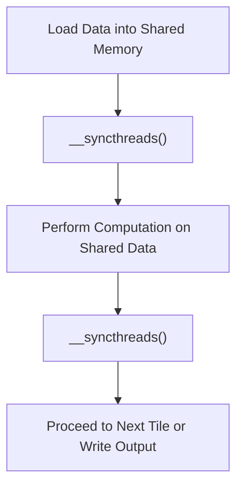
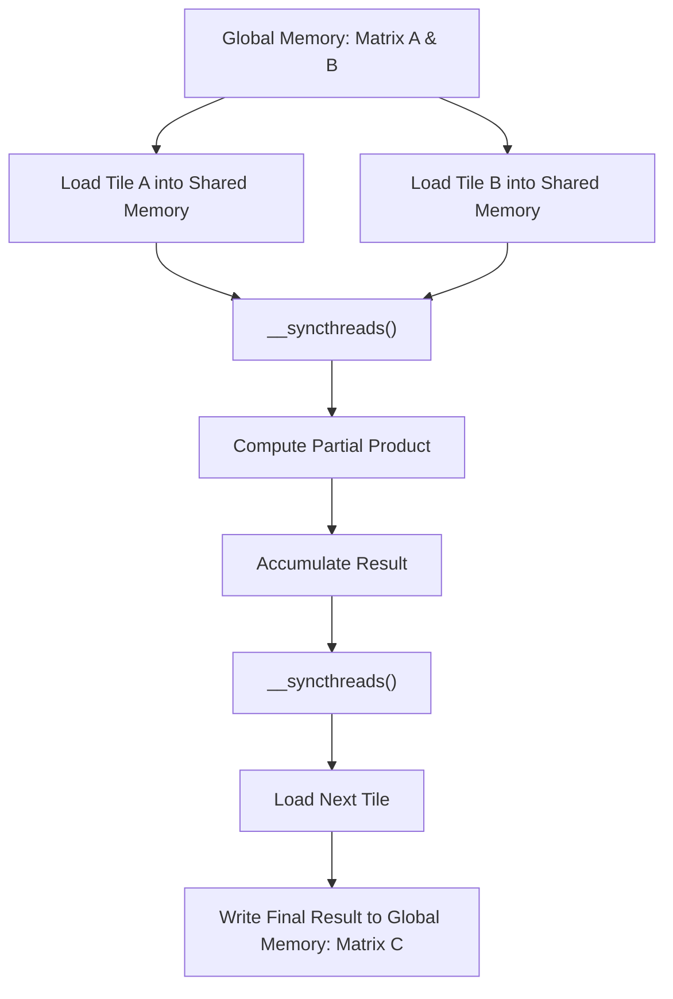

# Day 11: Thread Synchronization (__syncthreads())

Efficient thread synchronization is a critical aspect of CUDA programming, especially when using shared memory to optimize data reuse and reduce global memory accesses. In this lesson, we will extend our tile-based matrix multiplication example to highlight the role of `__syncthreads()`, measure its impact on performance, and discuss common debugging pitfalls when synchronization is missing. This comprehensive guide covers every step—from code implementation to performance measurement—with diagrams and precise references.

---

## Table of Contents
1. [Overview](#1-overview)  
2. [Importance of Thread Synchronization](#2-importance-of-thread-synchronization)  
3. [Extending Tile Based Matrix Multiplication with Syncthreads](#3-extending-tile-based-matrix-multiplication-with-syncthreads)  
    - [a) Kernel Code Explanation](#a-kernel-code-explanation)  
    - [b) Host Code and Performance Measurement](#b-host-code-and-performance-measurement)  
4. [Common Pitfalls and Debugging](#4-common-pitfalls-and-debugging)  
5. [Conceptual Diagrams](#5-conceptual-diagrams)  
6. [References & Further Reading](#6-references--further-reading)  
7. [Conclusion](#7-conclusion)  

---

## 1. Overview
In tile-based matrix multiplication, shared memory is used to cache sub-blocks (tiles) of the input matrices for faster access. However, when multiple threads within a block share data in shared memory, proper synchronization using `__syncthreads()` is essential. Failure to synchronize can lead to race conditions, where some threads may begin computation or data loading before others have finished, resulting in partial updates and incorrect results.

In this lesson, you will:
- Learn how to integrate `__syncthreads()` calls into a tile-based multiplication kernel.
- Measure the performance impact of proper synchronization.
- Understand debugging pitfalls when synchronization is omitted.

---

## 2. Importance of Thread Synchronization
**Thread synchronization** ensures that:
- All threads in a block reach the same point in execution before any proceed.
- Shared data loaded by one subset of threads is available to all threads before computation begins.
- Partial updates or race conditions are avoided.

**Key Points:**
- **__syncthreads()** is a barrier synchronization function that stops threads until every thread in the block has reached the barrier.
- Missing synchronization can cause some threads to use uninitialized or partially updated shared memory values.
- Correct placement of `__syncthreads()` is critical in iterative processes such as tiled matrix multiplication.

*Reference:* See the “Synchronization” section in the [CUDA C Programming Guide](https://docs.nvidia.com/cuda/cuda-c-programming-guide/index.html).

---

## 3. Extending Tile-Based Matrix Multiplication with __syncthreads()

We extend our tile-based matrix multiplication kernel to emphasize proper synchronization. We will compare the performance and correctness of a correctly synchronized version against a version with omitted `__syncthreads()` calls.

### a) Kernel Code Explanation

**Synchronized Tile-Based Matrix Multiplication Kernel:**

```cpp
#define TILE_WIDTH 16

__global__ void tiledMatrixMulSync(const float *A, const float *B, float *C, int width) {
    // Shared memory allocation for tiles of A and B
    __shared__ float tileA[TILE_WIDTH][TILE_WIDTH];
    __shared__ float tileB[TILE_WIDTH][TILE_WIDTH];

    // Compute the row and column indices for the output matrix C
    int row = blockIdx.y * TILE_WIDTH + threadIdx.y;
    int col = blockIdx.x * TILE_WIDTH + threadIdx.x;
    float value = 0.0f;

    // Loop over the tiles required to compute C[row][col]
    for (int m = 0; m < (width + TILE_WIDTH - 1) / TILE_WIDTH; m++) {
        // Load tile from matrix A into shared memory
        if (row < width && m * TILE_WIDTH + threadIdx.x < width)
            tileA[threadIdx.y][threadIdx.x] = A[row * width + m * TILE_WIDTH + threadIdx.x];
        else
            tileA[threadIdx.y][threadIdx.x] = 0.0f;

        // Load tile from matrix B into shared memory
        if (col < width && m * TILE_WIDTH + threadIdx.y < width)
            tileB[threadIdx.y][threadIdx.x] = B[(m * TILE_WIDTH + threadIdx.y) * width + col];
        else
            tileB[threadIdx.y][threadIdx.x] = 0.0f;

        // Synchronize threads to ensure complete tile loading
        __syncthreads();

        // Multiply the tiles together
        for (int k = 0; k < TILE_WIDTH; k++)
            value += tileA[threadIdx.y][k] * tileB[k][threadIdx.x];

        // Synchronize threads before loading new tiles
        __syncthreads();
    }

    // Write the computed value to global memory
    if (row < width && col < width)
        C[row * width + col] = value;
}
```

**Explanation:**
- **Shared Memory Usage:**  
  Tiles of matrices A and B are loaded into shared memory arrays `tileA` and `tileB`.
- **Synchronization Points:**  
  - The first `__syncthreads()` ensures that all threads have loaded their respective elements into the shared memory tiles before any thread proceeds with computation.
  - The second `__syncthreads()` ensures that all threads complete their computations on the current tile before loading new data for the next iteration.
- **Boundary Checks:**  
  Conditions are included to avoid out-of-bound accesses.

### b) Host Code and Performance Measurement

The host code sets up the matrices, launches the kernel, and measures performance using CUDA events.

```cpp
#include <cuda_runtime.h>
#include <stdio.h>
#include <stdlib.h>
#include <time.h>

#define TILE_WIDTH 16

// Kernel declaration (from the previous section)
__global__ void tiledMatrixMulSync(const float *A, const float *B, float *C, int width);

void initializeMatrix(float *mat, int width) {
    for (int i = 0; i < width * width; i++) {
        mat[i] = (float)(rand() % 100) / 100.0f;
    }
}

int main() {
    int width = 1024;  // Define matrix dimensions: width x width
    size_t size = width * width * sizeof(float);

    // Allocate host memory
    float *h_A = (float*)malloc(size);
    float *h_B = (float*)malloc(size);
    float *h_C = (float*)malloc(size);
    if (!h_A || !h_B || !h_C) {
        fprintf(stderr, "Host memory allocation failed!\n");
        exit(EXIT_FAILURE);
    }

    // Initialize matrices with random values
    srand(time(NULL));
    initializeMatrix(h_A, width);
    initializeMatrix(h_B, width);

    // Allocate device memory
    float *d_A, *d_B, *d_C;
    cudaError_t err;
    err = cudaMalloc((void**)&d_A, size);
    if (err != cudaSuccess) { fprintf(stderr, "cudaMalloc d_A error: %s\n", cudaGetErrorString(err)); exit(EXIT_FAILURE); }
    err = cudaMalloc((void**)&d_B, size);
    if (err != cudaSuccess) { fprintf(stderr, "cudaMalloc d_B error: %s\n", cudaGetErrorString(err)); exit(EXIT_FAILURE); }
    err = cudaMalloc((void**)&d_C, size);
    if (err != cudaSuccess) { fprintf(stderr, "cudaMalloc d_C error: %s\n", cudaGetErrorString(err)); exit(EXIT_FAILURE); }

    // Copy matrices A and B from host to device
    cudaMemcpy(d_A, h_A, size, cudaMemcpyHostToDevice);
    cudaMemcpy(d_B, h_B, size, cudaMemcpyHostToDevice);

    // Configure grid and block dimensions
    dim3 threadsPerBlock(TILE_WIDTH, TILE_WIDTH);
    dim3 blocksPerGrid((width + TILE_WIDTH - 1) / TILE_WIDTH, (width + TILE_WIDTH - 1) / TILE_WIDTH);

    // Set up CUDA events for timing
    cudaEvent_t start, stop;
    cudaEventCreate(&start);
    cudaEventCreate(&stop);

    // Record start event and launch the kernel
    cudaEventRecord(start);
    tiledMatrixMulSync<<<blocksPerGrid, threadsPerBlock>>>(d_A, d_B, d_C, width);
    cudaEventRecord(stop);
    cudaEventSynchronize(stop);

    // Calculate elapsed time
    float milliseconds = 0;
    cudaEventElapsedTime(&milliseconds, start, stop);
    printf("Synchronized tiled matrix multiplication time: %f ms\n", milliseconds);

    // Copy result matrix C back to host
    cudaMemcpy(h_C, d_C, size, cudaMemcpyDeviceToHost);

    // (Optional) Validate results here...

    // Clean up device memory
    cudaFree(d_A);
    cudaFree(d_B);
    cudaFree(d_C);

    // Clean up host memory
    free(h_A);
    free(h_B);
    free(h_C);

    // Destroy CUDA events
    cudaEventDestroy(start);
    cudaEventDestroy(stop);

    return 0;
}
```

**Detailed Steps:**
- **Memory Allocation and Initialization:**  
  Host matrices are allocated and initialized with random data.
- **Device Memory Setup:**  
  Device memory is allocated using `cudaMalloc()`, with error checking after each call.
- **Data Transfer:**  
  Matrices A and B are copied from the host to the device.
- **Kernel Launch:**  
  The grid and block dimensions are computed based on the tile width. The kernel is launched and timed using CUDA events.
- **Performance Measurement:**  
  CUDA events record the kernel execution time.
- **Result Retrieval:**  
  The computed matrix C is copied back from device to host.
- **Cleanup:**  
  Device and host memory are freed, and CUDA events are destroyed.

---

## 4. Common Pitfalls and Debugging
### Missing __syncthreads() Leading to Partial Updates
- **Issue:**  
  Omitting a `__syncthreads()` call may cause threads to proceed before all required data has been loaded or computed, resulting in partial updates and incorrect results.
- **Debugging:**  
  - Verify that all shared memory loads are followed by a synchronization barrier.
  - Use small test matrices and print intermediate values to check for consistency.
  - Employ CUDA error checking to catch synchronization errors.

### Other Common Pitfalls
1. **Race Conditions:**  
   Without proper synchronization, threads may overwrite shared memory values.
2. **Improper Tile Dimensions:**  
   Ensure that the tile dimensions (`TILE_WIDTH`) are chosen based on the GPU's shared memory capacity.
3. **Boundary Conditions:**  
   Always check that indices do not exceed matrix dimensions to avoid accessing invalid memory.
4. **Ignoring Return Values:**  
   Check all CUDA API calls for errors.

---

## 5. Conceptual Diagrams

### Diagram 1: Shared Memory Synchronization Flow

*Explanation:*  
- Threads first load data into shared memory.
- A synchronization barrier (`__syncthreads()`) ensures all threads have completed loading.
- Threads perform computation.
- Another synchronization barrier ensures that all threads finish computing before proceeding.

### Diagram 2: Tile-Based Matrix Multiplication with Synchronization

*Explanation:*  
- Tiles from matrices A and B are loaded into shared memory.
- Synchronization ensures complete loading.
- Partial products are computed and accumulated.
- Synchronization ensures all threads complete computation before the next iteration.
- The final result is written back to global memory.

---

## 6. References & Further Reading
1. **[CUDA C Programming Guide](https://docs.nvidia.com/cuda/cuda-c-programming-guide/index.html)**  
   Refer to the “Synchronization” section for detailed explanations and best practices regarding `__syncthreads()`.
2. **[CUDA C Best Practices Guide](https://docs.nvidia.com/cuda/cuda-c-best-practices-guide/index.html)**  
   Provides optimization techniques and common pitfalls when using shared memory and thread synchronization.
3. **"Programming Massively Parallel Processors: A Hands-on Approach" by David B. Kirk and Wen-mei W. Hwu**  
   A comprehensive resource for understanding GPU architectures, thread synchronization, and shared memory usage.
4. **NVIDIA Developer Blog**  
   Contains articles and case studies on advanced CUDA optimization and synchronization techniques.

---

## 7. Conclusion
In Day 11, you explored the critical role of thread synchronization in CUDA programming using `__syncthreads()`. You learned to:
- Integrate synchronization barriers into a tile-based matrix multiplication kernel.
- Measure performance using CUDA events to demonstrate the impact of synchronization.
- Recognize and debug pitfalls such as race conditions and partial updates resulting from missing `__syncthreads()` calls.

Proper synchronization is essential to ensuring correctness and achieving high performance in CUDA applications.

---


