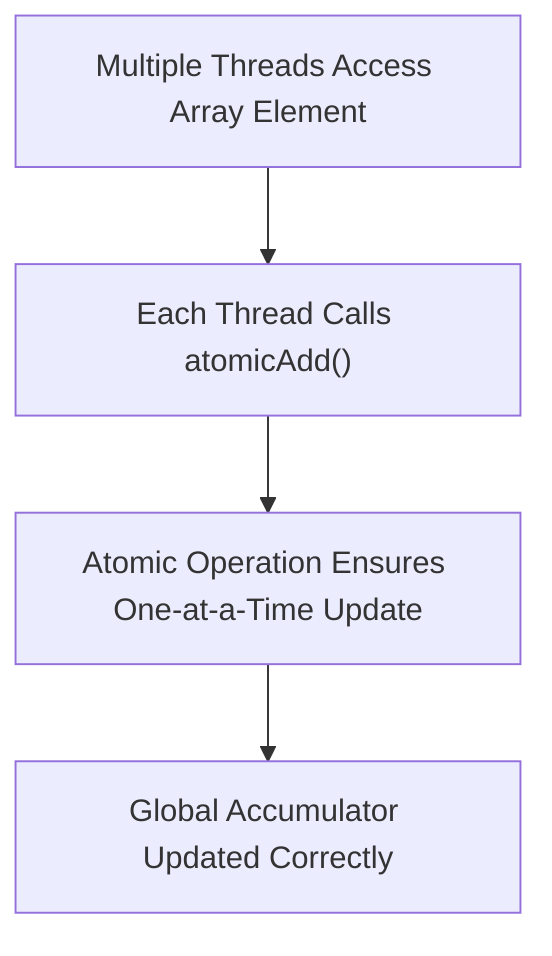
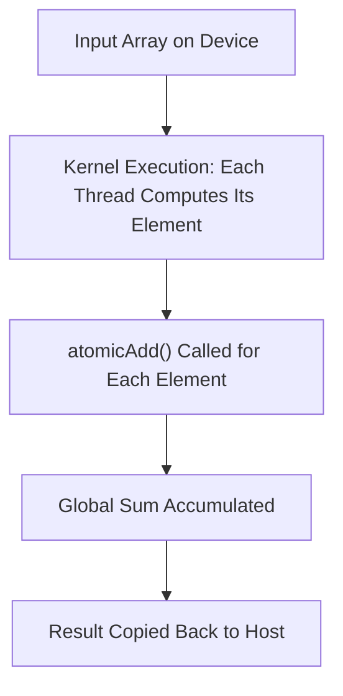

# Day 13: Basic Atomic Operations

Atomic operations are essential in CUDA programming when multiple threads need to update a single shared variable concurrently without introducing data races. In this lesson, we will focus on the use of atomic operations—specifically, `atomicAdd()`—to sum an array in parallel. We will cover every step in detail, including implementation, performance considerations, debugging pitfalls, and precise references.

---

## Table of Contents
1. [Overview](#1-overview)  
2. [Introduction to Atomic Operations](#2-introduction-to-atomic-operations)  
3. [Using atomicAdd() for Parallel Summation](#3-using-atomicadd-for-parallel-summation)  
    - [a) Kernel Implementation](#a-kernel-implementation)  
    - [b) Host Code and Setup](#b-host-code-and-setup)  
4. [Performance Considerations](#4-performance-considerations)  
5. [Common Pitfalls and Debugging Strategies](#5-common-pitfalls-and-debugging-strategies)  
6. [Conceptual Diagrams](#6-conceptual-diagrams)  
7. [References & Further Reading](#7-references--further-reading)  
8. [Conclusion](#8-conclusion)  

---

## 1. Overview

In parallel programming on the GPU, ensuring correct updates to shared variables is challenging when many threads attempt to write simultaneously. CUDA provides atomic functions to guarantee that these operations occur without race conditions. In this lesson, we will:
- Learn about atomic operations in CUDA.
- Implement a parallel array sum using `atomicAdd()`.
- Measure performance and discuss the trade-offs.
- Examine common pitfalls such as performance degradation when scaling up large sums.

---

## 2. Introduction to Atomic Operations

**Atomic operations** are operations that complete without any interruption. In CUDA, atomic functions ensure that when multiple threads perform updates on a shared variable, the updates are serialized at the hardware level. This prevents race conditions and ensures correctness, though it may introduce performance bottlenecks when overused.

### Key Points:
- **Atomicity:** Guarantees that an operation (e.g., addition) is completed entirely by one thread before another begins.
- **Use Cases:** Useful for summing values, counters, histogram generation, and other scenarios where threads concurrently update a shared variable.
- **Performance Impact:** While atomics ensure correctness, heavy use (especially for large-scale sums) can degrade performance due to serialization of memory updates.

*Reference:* See the [CUDA C Programming Guide, "Atomic Functions"](https://docs.nvidia.com/cuda/cuda-c-programming-guide/index.html#atomic-functions) for detailed documentation on atomic operations.

---

## 3. Using atomicAdd() for Parallel Summation

We will demonstrate how to sum an array in parallel using `atomicAdd()`. The basic idea is to have each thread add its array element to a global accumulator variable using an atomic operation.

### a) Kernel Implementation

Below is the CUDA kernel that uses `atomicAdd()` to perform a parallel sum.

```cpp
#include <cuda_runtime.h>

// Kernel to sum an array using atomicAdd
__global__ void atomicSumKernel(const float *input, float *result, int N) {
    int idx = threadIdx.x + blockIdx.x * blockDim.x;
    
    // Each thread adds its element to the result using atomicAdd
    if (idx < N) {
        atomicAdd(result, input[idx]);
    }
}
```

**Explanation:**
- **Index Calculation:**  
  Each thread computes its unique index `idx` using its block and thread indices.
- **Boundary Check:**  
  We check `if (idx < N)` to ensure that threads do not access out-of-bound memory.
- **Atomic Addition:**  
  `atomicAdd(result, input[idx]);` is used so that the addition is performed atomically. The shared global variable `result` accumulates the sum of array elements.

### b) Host Code and Setup

The host code allocates memory for the input array and the result, initializes the data, launches the kernel, and then retrieves the computed sum.

```cpp
#include <cuda_runtime.h>
#include <stdio.h>
#include <stdlib.h>
#include <time.h>

__global__ void atomicSumKernel(const float *input, float *result, int N);

int main() {
    int N = 1 << 20;  // Number of elements (e.g., 1M elements)
    size_t size = N * sizeof(float);
    
    // Allocate host memory
    float *h_input = (float*)malloc(size);
    float h_result = 0.0f;
    
    // Initialize host array with random values
    srand(time(NULL));
    for (int i = 0; i < N; i++) {
        h_input[i] = (float)(rand() % 100) / 100.0f;  // Random float between 0 and 1
    }
    
    // Allocate device memory
    float *d_input, *d_result;
    cudaError_t err;
    err = cudaMalloc((void**)&d_input, size);
    if (err != cudaSuccess) {
        fprintf(stderr, "Failed to allocate device memory for input (error code %s)!\n", cudaGetErrorString(err));
        exit(EXIT_FAILURE);
    }
    
    err = cudaMalloc((void**)&d_result, sizeof(float));
    if (err != cudaSuccess) {
        fprintf(stderr, "Failed to allocate device memory for result (error code %s)!\n", cudaGetErrorString(err));
        cudaFree(d_input);
        exit(EXIT_FAILURE);
    }
    
    // Copy input data from host to device
    err = cudaMemcpy(d_input, h_input, size, cudaMemcpyHostToDevice);
    if (err != cudaSuccess) {
        fprintf(stderr, "Failed to copy input array from host to device (error code %s)!\n", cudaGetErrorString(err));
        cudaFree(d_input);
        cudaFree(d_result);
        exit(EXIT_FAILURE);
    }
    
    // Initialize result to 0 on device
    err = cudaMemcpy(d_result, &h_result, sizeof(float), cudaMemcpyHostToDevice);
    if (err != cudaSuccess) {
        fprintf(stderr, "Failed to copy result initialization to device (error code %s)!\n", cudaGetErrorString(err));
        cudaFree(d_input);
        cudaFree(d_result);
        exit(EXIT_FAILURE);
    }
    
    // Configure kernel execution parameters
    int threadsPerBlock = 256;
    int blocksPerGrid = (N + threadsPerBlock - 1) / threadsPerBlock;
    
    // Launch the atomic sum kernel
    atomicSumKernel<<<blocksPerGrid, threadsPerBlock>>>(d_input, d_result, N);
    
    // Check for kernel launch errors
    err = cudaGetLastError();
    if (err != cudaSuccess) {
        fprintf(stderr, "Failed to launch atomicSumKernel (error code %s)!\n", cudaGetErrorString(err));
        cudaFree(d_input);
        cudaFree(d_result);
        exit(EXIT_FAILURE);
    }
    
    // Wait for GPU to finish
    cudaDeviceSynchronize();
    
    // Copy the result from device to host
    err = cudaMemcpy(&h_result, d_result, sizeof(float), cudaMemcpyDeviceToHost);
    if (err != cudaSuccess) {
        fprintf(stderr, "Failed to copy result from device to host (error code %s)!\n", cudaGetErrorString(err));
        cudaFree(d_input);
        cudaFree(d_result);
        exit(EXIT_FAILURE);
    }
    
    // Output the result
    printf("Parallel sum using atomicAdd: %f\n", h_result);
    
    // Clean up device and host memory
    cudaFree(d_input);
    cudaFree(d_result);
    free(h_input);
    
    return 0;
}
```

**Detailed Explanation:**
- **Memory Allocation:**  
  Host memory is allocated for the input array and result. Device memory is allocated using `cudaMalloc()`, with error checking.
- **Initialization:**  
  The host input array is initialized with random float values. The result is initialized to 0 on both the host and device.
- **Data Transfer:**  
  Input data is copied to the device, and the initial result value is also transferred.
- **Kernel Launch:**  
  The kernel is configured with a suitable number of blocks and threads per block. The `atomicSumKernel` is then launched.
- **Synchronization and Error Checking:**  
  `cudaDeviceSynchronize()` is called to ensure that the kernel execution is complete, and error checking is performed at each stage.
- **Result Retrieval:**  
  The computed sum is copied back to the host and printed.
- **Cleanup:**  
  All allocated memory on the device and host is freed.

---

## 4. Performance Considerations

While `atomicAdd()` guarantees correctness by preventing race conditions, it can become a performance bottleneck when many threads contend for the same memory location. For large-scale summations, the serialization of atomic operations can slow down overall performance. Techniques to mitigate this include:
- **Hierarchical Reduction:**  
  Perform partial sums in shared memory first, then use atomic operations on the reduced results.
- **Chunking:**  
  Divide the data among several independent accumulators and then combine them later.

Be aware that for extremely large arrays, the overhead from atomic operations may outweigh their benefits compared to other reduction strategies.

---

## 5. Common Pitfalls and Debugging Strategies

### Pitfalls
1. **Overuse of Atomics:**  
   - **Issue:** Using atomic operations on very large arrays can lead to contention, resulting in degraded performance.
   - **Mitigation:** Consider using hierarchical reductions (shared memory reductions) before applying atomics.

2. **Incorrect Memory Allocation Sizes:**  
   - **Issue:** Miscalculating the size (e.g., forgetting to multiply by `sizeof(float)`) can cause memory corruption.
   - **Mitigation:** Always compute sizes as `N * sizeof(data_type)`.

3. **Ignoring Error Returns:**  
   - **Issue:** Not checking the return values of `cudaMalloc()`, `cudaMemcpy()`, or kernel launches can hide critical errors.
   - **Mitigation:** Use thorough error checking after each CUDA API call.

4. **Race Conditions:**  
   - **Issue:** Although atomics prevent race conditions, combining them with non-atomic operations elsewhere in your kernel can lead to subtle bugs.
   - **Mitigation:** Ensure all shared updates are handled atomically where required.

### Debugging Strategies
- **CUDA Error Checking:**  
  Always use `cudaGetLastError()` after kernel launches and API calls.
- **Validation with Small Data Sets:**  
  Test your kernel with a small number of elements where you can manually verify the expected sum.
- **Profiling Tools:**  
  Use NVIDIA NSight Compute to profile the kernel and identify bottlenecks related to atomic operations.
- **Incremental Development:**  
  Build your code in small steps, verifying correctness at each stage before scaling up.

---

## 6. Conceptual Diagrams

### Diagram 1: Atomic Addition Workflow

*Explanation:*  
- Threads concurrently call `atomicAdd()`.
- The hardware serializes these operations to update the global accumulator correctly.

### Diagram 2: Parallel Summation with Atomic Operations

*Explanation:*  
- The input array is processed in parallel.
- Each thread uses `atomicAdd()` to add its value to the global sum.
- The final result is then copied back to the host.

---

## 7. References & Further Reading

1. **CUDA C Programming Guide – Atomic Functions**  
   [CUDA Atomic Functions](https://docs.nvidia.com/cuda/cuda-c-programming-guide/index.html#atomic-functions)  
   Detailed documentation on atomic operations provided by NVIDIA.

2. **CUDA C Best Practices Guide – Atomic Operations**  
   [CUDA Best Practices Guide](https://docs.nvidia.com/cuda/cuda-c-best-practices-guide/index.html)  
   Provides optimization tips and performance considerations for using atomic operations.

3. **"Programming Massively Parallel Processors: A Hands-on Approach" by David B. Kirk and Wen-mei W. Hwu**  
   A comprehensive resource on CUDA programming and optimization techniques.

4. **NVIDIA Developer Blog**  
   [NVIDIA Developer Blog](https://developer.nvidia.com/blog/)  
   Articles and case studies on CUDA optimization and atomic operations.

---

## 8. Conclusion

In Day 13, you learned the fundamentals of atomic operations in CUDA, focusing on the use of `atomicAdd()` for parallel summation. Key takeaways include:
- **Atomic Operations:** Guarantee correct concurrent updates without race conditions.
- **Implementation:** A complete, step-by-step guide to summing an array in parallel using `atomicAdd()`.
- **Performance Considerations:** Understanding that excessive use of atomics may lead to performance bottlenecks.
- **Debugging Strategies:** Best practices for error checking, validation, and profiling.

Mastering atomic operations is essential for ensuring correctness in parallel updates, and understanding their performance trade-offs is crucial for building scalable CUDA applications.

---

```
