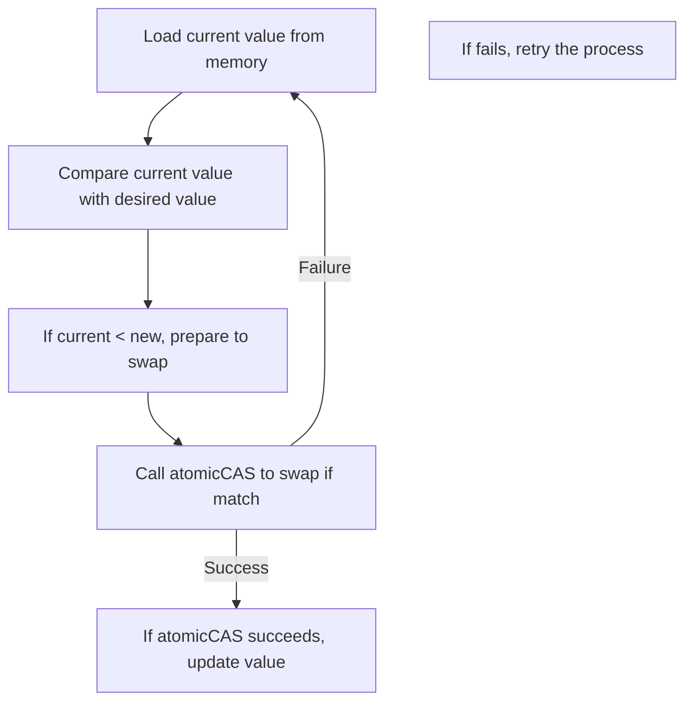
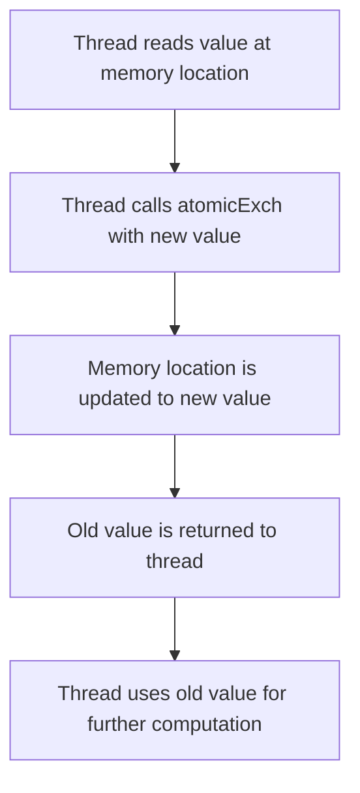

# Day 15: Advanced Atomic Operations

In this lesson, we explore advanced atomic operations in CUDA in depth. Atomic operations allow multiple threads to safely update shared or global memory without data races. We will focus on advanced atomic functions such as `atomicCAS` (compare-and-swap) and `atomicExch` (atomic exchange) to build custom atomic operations. While atomics ensure correctness, overuse can lead to serialization and performance bottlenecks. In this lesson, you will learn exactly how these operations work, see detailed code examples with extensive inline comments, and view conceptual diagrams that illustrate the flow of these operations.

---

## Table of Contents
1. [Overview](#1-overview)  
2. [Introduction to Advanced Atomic Operations](#2-introduction-to-advanced-atomic-operations)  
3. [Atomic Functions Explained](#3-atomic-functions-explained)  
    - [a) atomicCAS (Compare-And-Swap)](#a-atomiccas-compare-and-swap)  
    - [b) atomicExch (Exchange)](#b-atomicexch-exchange)  
4. [Practical Exercises](#4-practical-exercises)  
    - [a) Custom atomicMax for Floats Using atomicCAS](#a-custom-atomicmax-for-floats-using-atomiccas)  
    - [b) Using atomicExch to Swap Values](#b-using-atomicexch-to-swap-values)  
5. [Performance Considerations and Pitfalls](#5-performance-considerations-and-pitfalls)  
6. [Conceptual Diagrams](#6-conceptual-diagrams)  
7. [References & Further Reading](#7-references--further-reading)  
8. [Conclusion](#8-conclusion)  
9. [Next Steps](#9-next-steps)  

---

## 1. Overview
Atomic operations are essential when many threads need to update the same memory location concurrently. CUDA provides built-in atomic functions (like `atomicAdd`, `atomicSub`, etc.), but for some data types or more advanced operations, you must build your own using lower-level functions such as `atomicCAS` (compare-and-swap) or `atomicExch` (exchange). This lesson covers:
- Detailed explanations of advanced atomic operations.
- Code examples with extensive inline comments that explain every step.
- Conceptual diagrams that visually break down how the operations work.
- Discussion of performance pitfalls and best practices.

---

## 2. Introduction to Advanced Atomic Operations
Atomic operations ensure that a particular memory operation is completed entirely by one thread before another thread can modify that same memory location. This is crucial for avoiding race conditions in parallel algorithms. However, these operations can lead to contention when many threads try to update the same location, so they must be used judiciously.

---

## 3. Atomic Functions Explained

### a) atomicCAS (Compare-And-Swap)
- **Purpose:**  
  `atomicCAS` atomically compares the value at a memory address with a given expected value and, if they match, swaps it with a new value.
- **Prototype:**  
  ```cpp
  __device__ int atomicCAS(int* address, int compare, int val);
  ```
- **Usage:**  
  This function is often used in a loop to build custom atomic operations (e.g., an atomic maximum for floats). By repeatedly checking and updating the value, it ensures that the update occurs only if no other thread has modified it in the meantime.
  
### b) atomicExch (Exchange)
- **Purpose:**  
  `atomicExch` atomically replaces the value at a memory location with a new value and returns the old value.
- **Prototype:**  
  ```cpp
  __device__ int atomicExch(int* address, int val);
  ```
- **Usage:**  
  It is useful for lock-free programming, for instance, in implementing simple locks or swapping values between threads safely.

### c) Other Atomic Functions
Other atomic functions provided by CUDA include `atomicAdd`, `atomicSub`, `atomicMin`, `atomicMax`, `atomicInc`, and `atomicDec`. Some of these do not natively support floating-point values, requiring the use of type punning via `atomicCAS` to implement the desired behavior.

---

## 4. Practical Exercises

### a) Custom atomicMax for Floats Using atomicCAS

Below is a complete, annotated solution for implementing an atomic maximum for floats using `atomicCAS`.

```cpp
// customAtomicMax.cu
#include <cuda_runtime.h>
#include <stdio.h>
#include <float.h>

// __device__ function that implements atomicMax for floats using atomicCAS.
// Since CUDA does not provide a native atomicMax for floats, we use atomicCAS by
// reinterpreting the float as an int. The bitwise representation is manipulated
// to compare and update the maximum value.
__device__ float atomicMaxFloat(float* address, float val) {
    // Convert the float pointer to an int pointer, since atomicCAS works on integers.
    int* address_as_i = (int*)address;
    int old = *address_as_i, assumed;
    do {
        // Set 'assumed' to the current value.
        assumed = old;
        // Compute the maximum of the new value and the current value.
        // __float_as_int converts a float to its integer bit representation.
        // fmaxf returns the maximum of two floats.
        // atomicCAS will compare the integer representation of the current value
        // and, if it matches 'assumed', swap it with the new maximum value.
        old = atomicCAS(address_as_i, assumed, __float_as_int(fmaxf(val, __int_as_float(assumed))));
        // Loop until the value at the address does not change.
    } while (assumed != old);
    // Return the maximum value (reinterpreted back to float).
    return __int_as_float(old);
}

// Kernel that applies atomicMaxFloat to find the maximum value in an array.
__global__ void atomicMaxKernel(const float *input, float *result, int N) {
    int idx = threadIdx.x + blockIdx.x * blockDim.x;
    if (idx < N) {
        // Each thread tries to update the global maximum with its element.
        atomicMaxFloat(result, input[idx]);
    }
}

int main() {
    int N = 1 << 20;  // 1 million elements
    size_t size = N * sizeof(float);
    float *h_input = (float*)malloc(size);
    float h_result = -FLT_MAX;  // Initialize result with the lowest possible float value

    // Initialize host input array with random values between 0 and 100.
    for (int i = 0; i < N; i++) {
        h_input[i] = (float)(rand() % 101);
    }

    float *d_input, *d_result;
    cudaMalloc((void**)&d_input, size);
    cudaMalloc((void**)&d_result, sizeof(float));

    // Copy input data and initial result to device memory.
    cudaMemcpy(d_input, h_input, size, cudaMemcpyHostToDevice);
    cudaMemcpy(d_result, &h_result, sizeof(float), cudaMemcpyHostToDevice);

    int threadsPerBlock = 256;
    int blocksPerGrid = (N + threadsPerBlock - 1) / threadsPerBlock;

    // Launch the atomic maximum kernel.
    atomicMaxKernel<<<blocksPerGrid, threadsPerBlock>>>(d_input, d_result, N);
    cudaDeviceSynchronize();

    // Copy the final result from device to host.
    cudaMemcpy(&h_result, d_result, sizeof(float), cudaMemcpyDeviceToHost);
    printf("Maximum value found = %f\n", h_result);

    // Free device and host memory.
    cudaFree(d_input);
    cudaFree(d_result);
    free(h_input);
    return 0;
}
```

*Detailed Comments:*  
- The `atomicMaxFloat` function uses a loop with `atomicCAS` to safely update a float value.
- It converts float values to their integer bit representation to leverage atomicCAS.
- The kernel `atomicMaxKernel` calls `atomicMaxFloat` for each element, ensuring that the highest value is stored in `result`.

---
### b) Using atomicExch to Swap Values

Below is a fully commented example that uses `atomicExch` to swap a value and then perform a simple computation.

```cpp
// atomicExchExample.cu
#include <cuda_runtime.h>
#include <stdio.h>

// Kernel demonstrating the use of atomicExch.
// Each thread swaps its element with a new value (100.0f), retrieves the old value,
// and then adds the new value to the old value, storing the result back.
__global__ void atomicExchKernel(float *data, float newValue, int N) {
    // Calculate the global thread index.
    int idx = threadIdx.x + blockIdx.x * blockDim.x;
    if (idx < N) {
        // Atomically exchange the value at data[idx] with newValue.
        // atomicExch returns the old value that was at data[idx].
        float oldValue = atomicExch(&data[idx], newValue);
        // For demonstration, we perform an additional computation:
        // Add the old value and the new value, and write it back to data[idx].
        data[idx] = oldValue + newValue;
    }
}

int main() {
    int N = 1024;  // Array size
    size_t size = N * sizeof(float);
    float *h_data = (float*)malloc(size);

    // Initialize host array with sequential values.
    for (int i = 0; i < N; i++) {
        h_data[i] = (float)i;
    }

    float *d_data;
    cudaMalloc((void**)&d_data, size);
    // Copy host data to device.
    cudaMemcpy(d_data, h_data, size, cudaMemcpyHostToDevice);

    int threadsPerBlock = 256;
    int blocksPerGrid = (N + threadsPerBlock - 1) / threadsPerBlock;
    // Launch the kernel with newValue set to 100.0f.
    atomicExchKernel<<<blocksPerGrid, threadsPerBlock>>>(d_data, 100.0f, N);
    cudaDeviceSynchronize();

    // Copy the modified array back to host.
    cudaMemcpy(h_data, d_data, size, cudaMemcpyDeviceToHost);
    printf("AtomicExch result (first 10 elements):\n");
    for (int i = 0; i < 10; i++) {
        printf("%f ", h_data[i]);
    }
    printf("\n");

    // Free device and host memory.
    cudaFree(d_data);
    free(h_data);
    return 0;
}
```

*Detailed Comments:*  
- Each thread calculates its index and swaps its element with 100.0f.
- The original value is retrieved, added to 100.0f, and stored back.
- This demonstrates how atomicExch can be used to perform a safe, atomic swap.

---

## 5. Performance Considerations and Pitfalls

### Overuse of Atomic Operations
- **Issue:**  
  Excessive use of atomic operations can serialize access to a shared variable, significantly slowing down your program.
- **Mitigation:**  
  - Use hierarchical reductions to minimize the number of atomic updates.
  - Accumulate partial results in shared memory first, then perform a single atomic update to global memory.

### Debugging Strategies
- **Profile Your Kernels:**  
  Use tools like NVIDIA NSight Compute to analyze atomic operation overhead.
- **Error Checking:**  
  Always check the return values of CUDA API calls (e.g., `cudaMalloc`, `cudaMemcpy`).
- **Workload Distribution:**  
  Ensure that updates to atomic variables are distributed across multiple memory locations if possible.

---

## 6. Conceptual Diagrams

### Diagram 1: AtomicCAS Workflow for Custom AtomicMax

*Explanation:*  
- The diagram shows the loop inside `atomicMaxFloat` where each thread repeatedly attempts to update the maximum value until the operation succeeds.

### Diagram 2: atomicExch Operation

*Explanation:*  
- This diagram outlines the steps of an atomicExch operation: reading, exchanging, and retrieving the old value for further use.

---

## 7. References & Further Reading

1. **CUDA C Programming Guide – Atomic Functions**  
   [CUDA C Programming Guide: Atomic Functions](https://docs.nvidia.com/cuda/cuda-c-programming-guide/index.html#atomic-functions)  
   Provides in-depth details on all atomic operations available in CUDA.

2. **CUDA C Best Practices Guide**  
   [CUDA C Best Practices Guide](https://docs.nvidia.com/cuda/cuda-c-best-practices-guide/index.html)  
   Includes optimization tips and guidelines for using atomic operations efficiently.

3. **NVIDIA NSight Compute Documentation**  
   [NVIDIA NSight Compute](https://docs.nvidia.com/nsight-compute/)  
   A tool for profiling CUDA kernels to identify performance bottlenecks, including atomic operation overhead.

4. **"Programming Massively Parallel Processors: A Hands-on Approach" by David B. Kirk and Wen-mei W. Hwu**  
   A comprehensive resource covering CUDA programming fundamentals and advanced optimization techniques.

5. **NVIDIA Developer Blog**  
   [NVIDIA Developer Blog](https://developer.nvidia.com/blog/)  
   Articles and case studies on optimizing CUDA performance.

---

## 8. Conclusion
In Day 15, we explored advanced atomic operations in CUDA with a detailed look at functions like `atomicCAS` and `atomicExch`. Through extensive code examples and detailed inline comments, we saw how to implement a custom atomic maximum for floats and perform atomic exchanges safely. We also discussed performance implications and common pitfalls when using atomic operations.

---

## 9. Next Steps
- **Experiment:** Modify these examples to use different data types or integrate them into larger algorithms.
- **Profile:** Use NVIDIA NSight Compute to analyze how atomic operations affect your kernel performance.
- **Optimize:** Explore techniques to reduce atomic contention, such as hierarchical reductions.
- **Expand:** Study additional atomic functions and their applications in complex synchronization and reduction patterns.

```
