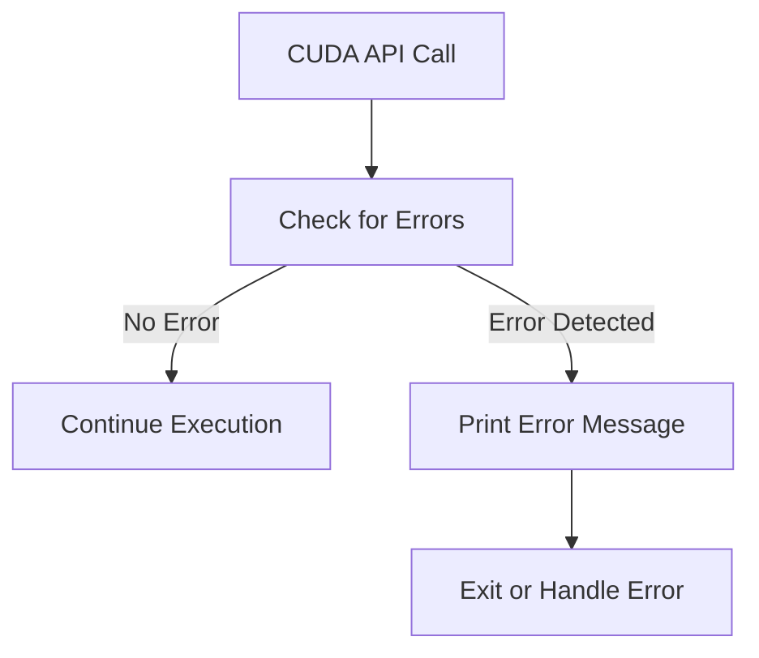

# Day 18: Error Handling & `cudaGetErrorString()`

CUDA provides **powerful parallel computing capabilities**, but **errors in CUDA programs** can be **hard to detect and debug** if not handled properly. CUDA API calls and kernel launches **do not crash immediately on failure**; instead, errors **propagate silently** and may lead to incorrect behavior or undefined results.

**Today’s lesson** will focus on:
- **Understanding CUDA error handling mechanisms**.
- **Using `cudaGetErrorString()`** to get human-readable error messages.
- **Implementing robust error checks after each CUDA call**.
- **Common debugging pitfalls** and how to detect them.
- **Using CUDA's built-in `cudaPeekAtLastError()` and `cudaGetLastError()`** to identify issues.

By the end of this lesson, you’ll be able to **write CUDA programs with proper error handling** to detect and fix issues efficiently.

---

## Table of Contents

1. [Overview](#1-overview)  
2. [Understanding CUDA Error Handling](#2-understanding-cuda-error-handling)  
3. [Using `cudaGetErrorString()`](#3-using-cudageterrorstring)  
4. [Practical Exercise: Implementing Robust Error Checking](#4-practical-exercise-implementing-robust-error-checking)  
    - [a) Naïve CUDA Program Without Error Handling](#a-naïve-cuda-program-without-error-handling)  
    - [b) Improved CUDA Program With Error Handling](#b-improved-cuda-program-with-error-handling)  
5. [Common Debugging Pitfalls](#5-common-debugging-pitfalls)  
6. [Conceptual Diagrams](#6-conceptual-diagrams)  
7. [References & Further Reading](#7-references--further-reading)  
8. [Conclusion](#8-conclusion)  
9. [Next Steps](#9-next-steps)  

---

## 1. Overview

CUDA **does not automatically halt execution** when an error occurs. Instead:
- CUDA calls return an **error code**.
- The developer must **explicitly check** these errors.
- `cudaGetLastError()` retrieves the most recent error.
- `cudaGetErrorString()` converts error codes to **human-readable messages**.

To prevent **hard-to-trace bugs**, **error handling should be added to every CUDA call**.

### Example: **Without Error Handling**
```cpp
cudaMalloc((void**)&d_A, size); // If this fails, no warning is given.
cudaMemcpy(d_A, h_A, size, cudaMemcpyHostToDevice); // If previous failed, this may cause segmentation faults.
```
### Example: **With Error Handling**
```cpp
cudaError_t err = cudaMalloc((void**)&d_A, size);
if (err != cudaSuccess) {
    printf("CUDA malloc failed: %s\n", cudaGetErrorString(err));
    return -1;
}
```

---

## 2. Understanding CUDA Error Handling

### CUDA Error Codes
CUDA functions return an **error code** of type `cudaError_t`, which should be checked after **every API call**.

| **Error Code** | **Description** |
|---------------|----------------|
| `cudaSuccess` | No errors. |
| `cudaErrorInvalidDevicePointer` | Invalid device pointer used. |
| `cudaErrorInvalidValue` | Invalid argument passed to a function. |
| `cudaErrorMemoryAllocation` | Failed memory allocation (e.g., `cudaMalloc()`). |
| `cudaErrorLaunchFailure` | Kernel launch failed (e.g., invalid kernel arguments). |

### Retrieving Error Messages
CUDA provides two functions to handle error states:
1. **`cudaGetLastError()`** – Returns and clears the last error.
2. **`cudaPeekAtLastError()`** – Returns the last error but **does not clear it**.
3. **`cudaGetErrorString(cudaError_t error)`** – Converts error codes into readable messages.

### Example
```cpp
cudaMalloc((void**)&d_A, size);
cudaError_t err = cudaGetLastError();
if (err != cudaSuccess) {
    printf("CUDA Error: %s\n", cudaGetErrorString(err));
}
```

---

## 3. Using `cudaGetErrorString()`

The `cudaGetErrorString(cudaError_t error)` function **converts an error code into a human-readable string**.

### Example: Checking for CUDA Errors
```cpp
cudaError_t err = cudaMalloc((void**)&d_A, size);
if (err != cudaSuccess) {
    printf("CUDA Malloc Failed: %s\n", cudaGetErrorString(err));
}
```

### Example: Macro for Error Checking
To avoid repetitive code, we can define a **macro for error checking**:

```cpp
#define CUDA_CHECK(call) { \
    cudaError_t err = call; \
    if (err != cudaSuccess) { \
        printf("CUDA Error at %s:%d - %s\n", __FILE__, __LINE__, cudaGetErrorString(err)); \
        exit(EXIT_FAILURE); \
    } \
}
```

Usage:
```cpp
CUDA_CHECK(cudaMalloc((void**)&d_A, size));
CUDA_CHECK(cudaMemcpy(d_A, h_A, size, cudaMemcpyHostToDevice));
```

---

## 4. Practical Exercise: Implementing Robust Error Checking

### a) **Naïve CUDA Program Without Error Handling**
```cpp
// naiveErrorHandling.cu
#include <cuda_runtime.h>
#include <stdio.h>

__global__ void faultyKernel(int *d_data) {
    int idx = threadIdx.x;
    d_data[idx] = idx * 2; // Possible out-of-bounds access
}

int main() {
    int *d_data;
    cudaMalloc((void**)&d_data, 100 * sizeof(int)); // No error check

    faultyKernel<<<1, 256>>>(d_data); // Too many threads for allocated memory

    cudaMemcpy(d_data, d_data, 100 * sizeof(int), cudaMemcpyDeviceToHost); // No check
    printf("Done\n");
    return 0;
}
```
#### **Issues:**
- `cudaMalloc()` might fail, but the error is ignored.
- The kernel launches with **more threads than allocated memory**, causing memory corruption.
- No error checks mean we wouldn’t detect the problem.

---

### b) **Improved CUDA Program With Error Handling**
```cpp
// robustErrorHandling.cu
#include <cuda_runtime.h>
#include <stdio.h>

// Macro for error checking
#define CUDA_CHECK(call) { \
    cudaError_t err = call; \
    if (err != cudaSuccess) { \
        printf("CUDA Error at %s:%d - %s\n", __FILE__, __LINE__, cudaGetErrorString(err)); \
        exit(EXIT_FAILURE); \
    } \
}

// Kernel with boundary check
__global__ void safeKernel(int *d_data, int N) {
    int idx = threadIdx.x;
    if (idx < N) { // Prevents out-of-bounds access
        d_data[idx] = idx * 2;
    }
}

int main() {
    int N = 100;
    int *d_data;

    // Allocate memory with error checking
    CUDA_CHECK(cudaMalloc((void**)&d_data, N * sizeof(int)));

    // Launch kernel safely
    safeKernel<<<1, 128>>>(d_data, N);
    CUDA_CHECK(cudaGetLastError()); // Checks for kernel launch errors

    // Synchronize
    CUDA_CHECK(cudaDeviceSynchronize());

    // Free memory
    CUDA_CHECK(cudaFree(d_data));

    printf("Execution completed successfully\n");
    return 0;
}
```
#### **Fixes:**
- `cudaMalloc()` is **checked** to ensure successful allocation.
- Kernel launch is **checked** for errors.
- **Boundary check** prevents out-of-bounds access.
- `cudaDeviceSynchronize()` ensures completion.

---

## 5. Common Debugging Pitfalls

| **Mistake** | **Solution** |
|------------|-------------|
| Not checking for errors after CUDA calls | Always use `cudaGetLastError()` or macros. |
| Ignoring kernel launch errors | Use `cudaPeekAtLastError()` to detect kernel issues. |
| Accessing out-of-bounds memory | Always add boundary checks inside kernels. |
| Using uninitialized memory | Always check `cudaMalloc()` return value. |

---

## 6. Conceptual Diagrams

### **Diagram 1: Error Checking Workflow**


---

## 7. References & Further Reading

1. **[CUDA Error Handling Guide](https://docs.nvidia.com/cuda/cuda-runtime-api/group__CUDART__ERROR.html)**  
2. **[CUDA Best Practices](https://docs.nvidia.com/cuda/cuda-c-best-practices-guide/index.html#error-handling)**  
3. **"Programming Massively Parallel Processors" – David Kirk & Wen-mei W. Hwu**  

---

## 8. Conclusion

Today, we explored:
- **Why CUDA error handling is critical.**
- **How to use `cudaGetErrorString()` to interpret errors.**
- **Best practices for implementing robust error checking.**
- **Debugging strategies for common CUDA issues.**

---

## 9. Next Steps
- **Experiment with forcing CUDA errors** to test error handling.
- **Use Nsight Compute** to debug CUDA programs.

```
