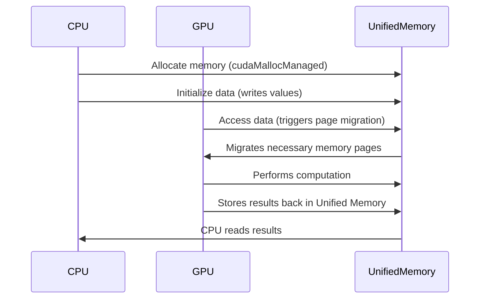
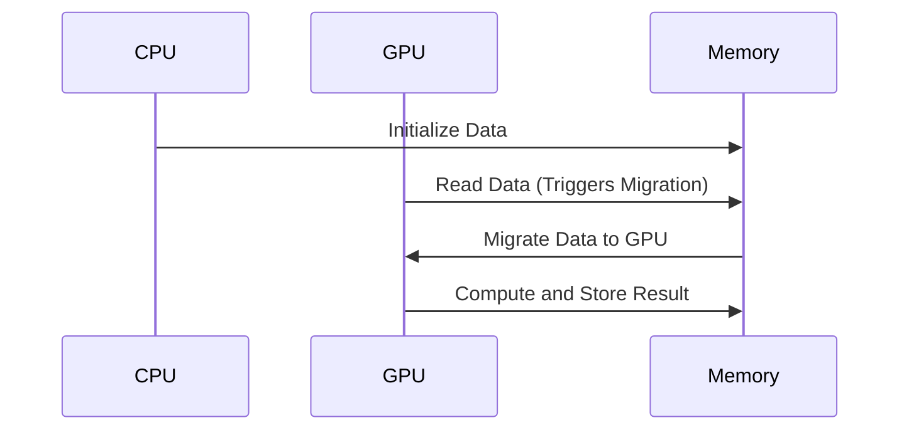
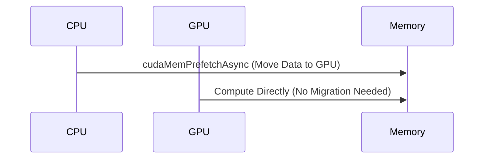

# Day 19: Unified Memory (UM) Introduction

CUDA **Unified Memory (UM)** allows **both CPU and GPU to share the same memory space**, making memory management **easier and more intuitive**. Instead of separately allocating memory on the host (`malloc()`) and device (`cudaMalloc()`), Unified Memory **automatically migrates data** between CPU and GPU, **eliminating explicit `cudaMemcpy()` calls**.

**Today’s lesson** will cover:
- **What Unified Memory is and how it works internally**.
- **How `cudaMallocManaged()` simplifies memory allocation**.
- **How data is migrated and optimized using `cudaMemPrefetchAsync()`**.
- **A complete, optimized implementation of vector addition**.
- **Common performance issues and best practices**.
- **Conceptual diagrams illustrating Unified Memory behavior**.

By the end of this lesson, you will **understand Unified Memory deeply**, know when to use it, and be able to **avoid performance pitfalls**.

---

## Table of Contents

1. [Overview](#1-overview)  
2. [How Unified Memory Works](#2-how-unified-memory-works)  
3. [How `cudaMallocManaged()` Allocates Memory](#3-how-cudamallocmanaged-allocates-memory)  
4. [Understanding Data Migration](#4-understanding-data-migration)  
5. [Practical Exercise: Implementing Vector Addition](#5-practical-exercise-implementing-vector-addition)  
    - [a) Basic Vector Addition Using Unified Memory](#a-basic-vector-addition-using-unified-memory)  
    - [b) Optimized Version Using `cudaMemPrefetchAsync()`](#b-optimized-version-using-cudamemprefetchasync)  
6. [Performance Pitfalls & Optimization Techniques](#6-performance-pitfalls--optimization-techniques)  
7. [Conceptual Diagrams](#7-conceptual-diagrams)  
8. [References & Further Reading](#8-references--further-reading)  
9. [Conclusion](#9-conclusion)  
10. [Next Steps](#10-next-steps)  

---

## 1. Overview

###  Before Unified Memory
- Memory **had to be allocated separately** on the host and device.
- **Explicit memory transfers** (`cudaMemcpy()`) were required.
- **Programmers had to manually manage** memory movement.

### With Unified Memory
- **CPU and GPU share the same memory allocation**.
- No need for `cudaMemcpy()`, as **CUDA migrates data automatically**.
- **Simplifies debugging** by avoiding host/device memory confusion.

---

## 2. How Unified Memory Works

When using `cudaMallocManaged()`, CUDA **automatically manages memory migration**. However, internally, **data is not truly shared**; instead, **pages migrate dynamically** between CPU and GPU.

### 🔹 **Key Unified Memory Concepts**
| Concept | Explanation |
|---------|------------|
| **Memory Allocation** | A single `cudaMallocManaged()` call creates memory accessible from both CPU & GPU. |
| **Page Migration** | Memory pages **move automatically** between CPU & GPU as needed. |
| **Demand Paging** | CUDA **only transfers memory when accessed**, similar to virtual memory paging. |
| **Page Faults** | If the GPU accesses a page stored on the CPU, a **page fault** occurs, triggering migration. |

---

## 3. How `cudaMallocManaged()` Allocates Memory

```cpp
float *data;
cudaMallocManaged(&data, N * sizeof(float)); // One allocation for both CPU & GPU
```

### 🔹 What happens internally?
1. The system **allocates memory** in a shared virtual address space.
2. The memory is **initially on the CPU**.
3. **When the GPU accesses it, CUDA migrates the required pages**.
4. CUDA handles **cache coherency** so that both CPU and GPU **see the same memory state**.

---

## 4. Understanding Data Migration

### 🔹 **How Data Moves in Unified Memory**


🔹 **Key Observations**:
- **No explicit data transfers** (`cudaMemcpy()` is not required).
- **On first GPU access, memory migrates automatically**.
- **This migration has overhead**, especially if data moves frequently.

---

## 5. Practical Exercise: Implementing Vector Addition

### a) **Basic Vector Addition Using Unified Memory**
```cpp
// unifiedMemoryVectorAdd.cu
#include <cuda_runtime.h>
#include <stdio.h>

__global__ void vectorAdd(float *A, float *B, float *C, int N) {
    int idx = threadIdx.x + blockIdx.x * blockDim.x;
    if (idx < N) {
        C[idx] = A[idx] + B[idx];
    }
}

int main() {
    int N = 1 << 20;  // 1M elements
    size_t size = N * sizeof(float);

    float *A, *B, *C;
    cudaMallocManaged(&A, size);
    cudaMallocManaged(&B, size);
    cudaMallocManaged(&C, size);

    for (int i = 0; i < N; i++) {
        A[i] = i * 1.0f;
        B[i] = i * 2.0f;
    }

    vectorAdd<<<(N + 255) / 256, 256>>>(A, B, C, N);
    cudaDeviceSynchronize();

    printf("C[0] = %f, C[N-1] = %f\n", C[0], C[N - 1]);

    cudaFree(A);
    cudaFree(B);
    cudaFree(C);
}
```
🔹 **What happens internally?**
1. **Memory is allocated once** (`cudaMallocManaged()`).
2. **CPU initializes the data**.
3. **GPU accesses the data** – memory **migrates automatically**.
4. **Synchronization ensures completion** (`cudaDeviceSynchronize()`).
5. **Results are accessed from Unified Memory**.

---

### b) **Optimized Version Using `cudaMemPrefetchAsync()`**
Migration overhead can be **reduced** by **prefetching memory** to the GPU **before computation**.

```cpp
cudaMemPrefetchAsync(A, size, 0); // Move A to GPU
cudaMemPrefetchAsync(B, size, 0); // Move B to GPU
cudaMemPrefetchAsync(C, size, 0); // Move C to GPU
```

🔹 **Why prefetch memory?**
- **Avoids runtime page faults** (no unexpected migrations).
- **Reduces overhead** of automatic migration.
- **Ensures all data is ready before execution**.

---

## 6. Performance Pitfalls & Optimization Techniques

###  **Common Issues with Unified Memory**
| Issue | Solution |
|-------|----------|
| **Slow memory migration** | Use `cudaMemPrefetchAsync()` for manual migration. |
| **Excessive page faults** | Minimize CPU-GPU memory switching. |
| **CPU-GPU contention** | Access memory **exclusively** from CPU **or** GPU when possible. |

---

## 7. Conceptual Diagrams

### **Diagram 1: Memory Migration Without Prefetching**


### **Diagram 2: Optimized Memory Prefetching**


---

## 8. References & Further Reading

1. **[CUDA C Programming Guide – Unified Memory](https://docs.nvidia.com/cuda/cuda-c-programming-guide/index.html#um-overview)**
2. **[Unified Memory Best Practices](https://developer.nvidia.com/blog/unified-memory-cuda-beginners/)**

---

## 9. Conclusion

Today, we explored:
- **How Unified Memory (`cudaMallocManaged`) simplifies memory management**.
- **How CUDA handles page migration dynamically**.
- **Optimizing performance with `cudaMemPrefetchAsync()`**.

---

## 10. Next Steps
- **Experiment with different memory sizes**.
- **Analyze page migration behavior with Nsight Systems**.

```

