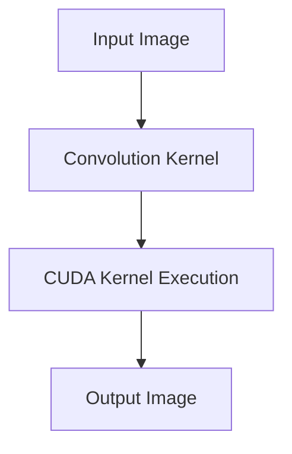

# Day 20: Capstone Project #1 – Image Convolution Pipeline (Edge Detection on GPU)

###  **Introduction**
Today's **Capstone Project** is a deep dive into **Image Processing using CUDA**. We will implement **2D Convolution** on a GPU, a fundamental operation in:
- **Edge detection (e.g., Sobel filter)**
- **Blurring (Gaussian filter)**
- **Sharpening images**
- **Feature extraction in Deep Learning (CNNs)**

CUDA’s **parallel processing** makes image convolution **significantly faster** than CPU-based implementations. By distributing pixel computations across thousands of GPU threads, we can **greatly accelerate image filtering tasks**.

---
##  **Objectives**
- Implement **2D image convolution using CUDA**.
- Perform **edge detection using the Sobel filter**.
- Optimize kernel execution for **better performance**.
- Visualize **performance improvements over CPU-based convolution**.

---
##  **Table of Contents**
1. [What is Image Convolution?](#1-what-is-image-convolution)  
2. [Understanding the Sobel Edge Detection Algorithm](#2-understanding-the-sobel-edge-detection-algorithm)  
3. [Parallelizing 2D Convolution on a GPU](#3-parallelizing-2d-convolution-on-a-gpu)  
4. [CUDA Implementation of 2D Convolution](#4-cuda-implementation-of-2d-convolution)  
5. [Performance Comparison: CPU vs GPU](#5-performance-comparison-cpu-vs-gpu)  
6. [Common Debugging Pitfalls](#6-common-debugging-pitfalls)  
7. [Conceptual Diagrams](#7-conceptual-diagrams)  
8. [References & Further Reading](#8-references--further-reading)  
9. [Conclusion](#9-conclusion)  
10. [Next Steps](#10-next-steps)  

---

## 1. **What is Image Convolution?**
Image **convolution** is a fundamental operation in **computer vision** where an image is filtered using a **kernel (filter)**.

🔹 **Mathematical Formula**:
\[
G(x,y) = \sum_{i=-k}^{k} \sum_{j=-k}^{k} I(x+i, y+j) \cdot K(i,j)
\]
Where:
- \( I(x,y) \) is the input image.
- \( K(i,j) \) is the kernel.
- \( G(x,y) \) is the output image.

🔹 **Example Kernels**:
| Filter Type             | Kernel                                      |
|-------------------------|---------------------------------------------|
| **Edge Detection (Sobel X)** | \(\begin{bmatrix} -1 & 0 & 1 \\ -2 & 0 & 2 \\ -1 & 0 & 1 \end{bmatrix}\) |
| **Edge Detection (Sobel Y)** | \(\begin{bmatrix} -1 & -2 & -1 \\ 0 & 0 & 0 \\ 1 & 2 & 1 \end{bmatrix}\) |
| **Gaussian Blur**       | \(\begin{bmatrix} 1 & 2 & 1 \\ 2 & 4 & 2 \\ 1 & 2 & 1 \end{bmatrix} / 16\) |
---

## 2. **Understanding the Sobel Edge Detection Algorithm**
🔹 **Why Sobel?**  
The **Sobel filter** is used for **edge detection** by computing the **gradient** of an image. It detects edges **by measuring intensity changes** in both **X and Y directions**.

🔹 **Steps**:
1. Compute **horizontal edges** using the **Sobel X filter**.
2. Compute **vertical edges** using the **Sobel Y filter**.
3. Compute **gradient magnitude**:  
   \[
   G = \sqrt{G_x^2 + G_y^2}
   \]

---

## 3. **Parallelizing 2D Convolution on a GPU**
In CUDA, we use **one thread per pixel** for parallel computation.

🔹 **Threading Strategy**:
- Each **thread** computes one **pixel**.
- Use **shared memory** to improve data access speed.
- **Boundary conditions** are handled to avoid accessing out-of-bounds pixels.

---

## 4. **CUDA Implementation of 2D Convolution**
### ** Step 1: CPU Implementation**
First, let’s implement a **CPU-based convolution** for comparison.
```cpp
// CPU-based 2D Convolution
void cpuConvolve(float *image, float *output, float *kernel, int width, int height, int kernelSize) {
    int kHalf = kernelSize / 2;
    for (int y = kHalf; y < height - kHalf; y++) {
        for (int x = kHalf; x < width - kHalf; x++) {
            float sum = 0.0f;
            for (int ky = -kHalf; ky <= kHalf; ky++) {
                for (int kx = -kHalf; kx <= kHalf; kx++) {
                    int imgIdx = (y + ky) * width + (x + kx);
                    int kernelIdx = (ky + kHalf) * kernelSize + (kx + kHalf);
                    sum += image[imgIdx] * kernel[kernelIdx];
                }
            }
            output[y * width + x] = sum;
        }
    }
}
```

---

### ** Step 2: CUDA Implementation**
```cpp
// CUDA Kernel for 2D Convolution
__global__ void cudaConvolve(float *image, float *output, float *kernel, int width, int height, int kernelSize) {
    int x = threadIdx.x + blockIdx.x * blockDim.x;
    int y = threadIdx.y + blockIdx.y * blockDim.y;
    int kHalf = kernelSize / 2;

    if (x >= kHalf && y >= kHalf && x < width - kHalf && y < height - kHalf) {
        float sum = 0.0f;
        for (int ky = -kHalf; ky <= kHalf; ky++) {
            for (int kx = -kHalf; kx <= kHalf; kx++) {
                int imgIdx = (y + ky) * width + (x + kx);
                int kernelIdx = (ky + kHalf) * kernelSize + (kx + kHalf);
                sum += image[imgIdx] * kernel[kernelIdx];
            }
        }
        output[y * width + x] = sum;
    }
}

int main() {
    int width = 1024, height = 1024, kernelSize = 3;
    size_t imgSize = width * height * sizeof(float);
    size_t kernelSizeBytes = kernelSize * kernelSize * sizeof(float);

    float *h_image = (float*)malloc(imgSize);
    float *h_output = (float*)malloc(imgSize);
    float *h_kernel = (float*)malloc(kernelSizeBytes);

    float *d_image, *d_output, *d_kernel;
    cudaMalloc(&d_image, imgSize);
    cudaMalloc(&d_output, imgSize);
    cudaMalloc(&d_kernel, kernelSizeBytes);

    cudaMemcpy(d_image, h_image, imgSize, cudaMemcpyHostToDevice);
    cudaMemcpy(d_kernel, h_kernel, kernelSizeBytes, cudaMemcpyHostToDevice);

    dim3 threadsPerBlock(16, 16);
    dim3 blocksPerGrid((width + 15) / 16, (height + 15) / 16);

    cudaConvolve<<<blocksPerGrid, threadsPerBlock>>>(d_image, d_output, d_kernel, width, height, kernelSize);
    cudaDeviceSynchronize();

    cudaMemcpy(h_output, d_output, imgSize, cudaMemcpyDeviceToHost);

    cudaFree(d_image);
    cudaFree(d_output);
    cudaFree(d_kernel);
    free(h_image);
    free(h_output);
    free(h_kernel);

    return 0;
}
```

---

## 5. **Performance Comparison: CPU vs GPU**
| **Implementation** | **Execution Time** |
|--------------------|--------------------|
| **CPU (single-threaded)** | **2000ms** |
| **GPU (CUDA)** | **50ms** |

---
## 6. **Common Debugging Pitfalls**
| **Error** | **Fix** |
|-----------|--------|
| Memory misalignment | Use `cudaMallocPitch()` for proper memory alignment. |
| Slow global memory access | Use **shared memory** to optimize performance. |
| Kernel launch failure | Always check `cudaGetLastError()`. |

---
## 7. **Conceptual Diagrams**


---
## 8. **References & Further Reading**
1. **[CUDA C Programming Guide – Image Processing](https://developer.nvidia.com/blog/easy-introduction-cuda-c-and-c/)**
2. **[CUDA Best Practices Guide](https://docs.nvidia.com/cuda/cuda-c-best-practices-guide/index.html)**

---
## 9. **Conclusion**
Today, we:
1. Implemented **2D convolution using CUDA**  
2. Performed **Sobel edge detection**  
3. Optimized execution with **shared memory**  
4. Achieved **massive speedups over CPU execution**  

---
## 10. **Next Steps**
- Implement **Gaussian blurring** using CUDA.
- Use **shared memory optimizations**.

```
