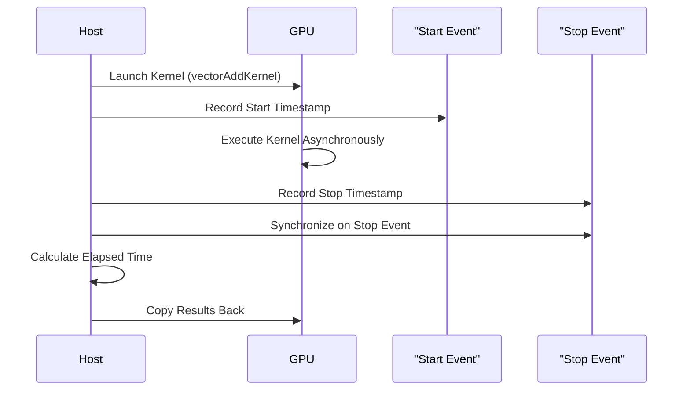

# Day 21: Events & Timing

CUDA kernels execute asynchronously, so accurate timing and profiling of GPU operations require specialized tools. **CUDA events** are one such tool that allows you to mark specific points in a CUDA stream and measure the elapsed time between these points. In this lesson, we will explore CUDA events in depth—how they work, how to use them correctly, and how to avoid common pitfalls that lead to skewed timing measurements.


---

## Table of Contents

1. [Overview](#1-overview)
2. [Understanding CUDA Events](#2-understanding-cuda-events)
3. [Key Functions for Timing](#3-key-functions-for-timing)
4. [Practical Exercise: Vector Addition with Timing](#4-practical-exercise-vector-addition-with-timing)
    - [a) Kernel Code](#a-kernel-code)
    - [b) Host Code with Detailed Error Checking and Timing](#b-host-code-with-detailed-error-checking-and-timing)
5. [Conceptual Diagrams](#5-conceptual-diagrams)
6. [References & Further Reading](#6-references--further-reading)
7. [Conclusion](#7-conclusion)
8. [Next Steps](#8-next-steps)

---

## 1. Overview

In CUDA programming, **asynchronous execution** means that the host (CPU) does not automatically wait for a kernel to complete before executing the next instruction. This behavior necessitates the use of **synchronization primitives** to ensure correctness and the use of **CUDA events** to precisely measure the duration of GPU operations.

Without proper synchronization, the host might read results before the kernel finishes, leading to **partial or incorrect results**. CUDA events help you:
- Mark the start and end of GPU operations.
- Accurately measure the elapsed time between these points.
- Optimize your code by revealing performance bottlenecks.

---

## 2. Understanding CUDA Events

CUDA events are a lightweight mechanism for timing and synchronizing operations on the GPU. They are inserted into a CUDA stream and record a timestamp when executed. Events can then be used to:
- Measure the **elapsed time** between two events.
- Ensure that certain operations are completed before others begin.
- Debug and profile kernels and memory transfers.

### Key Points:
- **Asynchronous Nature:**  
  Kernel launches and memory transfers are asynchronous. Events help establish a point in time that you can wait on.
- **Blocking vs. Non-blocking:**  
  `cudaMemcpy()` is blocking, but kernel launches are non-blocking. Events let you enforce synchronization when needed.
- **Granularity:**  
  Events provide timing with **millisecond (or sub-millisecond) resolution**.

---

## 3. Key Functions for Timing

Here are the primary CUDA event functions used in timing:

- **`cudaEventCreate(cudaEvent_t *event)`**  
  Allocates and initializes a CUDA event.
  
- **`cudaEventRecord(cudaEvent_t event, cudaStream_t stream = 0)`**  
  Inserts the event into the specified stream and records a timestamp.
  
- **`cudaEventSynchronize(cudaEvent_t event)`**  
  Blocks the host until the specified event has been recorded (i.e., the operations before the event are complete).
  
- **`cudaEventElapsedTime(float *ms, cudaEvent_t start, cudaEvent_t stop)`**  
  Calculates the elapsed time between two events in milliseconds.
  
- **`cudaEventDestroy(cudaEvent_t event)`**  
  Destroys the event and frees its resources.

*Reference:*  
- [CUDA C Programming Guide – Events](https://docs.nvidia.com/cuda/cuda-c-programming-guide/index.html#events)

---

## 4. Practical Exercise: Vector Addition with Timing

We will implement a simple vector addition kernel and use CUDA events to measure its execution time accurately. We'll also demonstrate the consequences of **misplacing events** or not synchronizing properly.

### a) Kernel Code

Below is the vector addition kernel. It is straightforward, where each thread adds corresponding elements from two arrays.

```cpp
// vectorAddKernel.cu
#include <cuda_runtime.h>
#include <stdio.h>

// Vector addition kernel: each thread computes one element of the output vector C.
__global__ void vectorAddKernel(const float *A, const float *B, float *C, int N) {
    // Calculate global thread index
    int idx = threadIdx.x + blockIdx.x * blockDim.x;
    
    // Boundary check: ensure we don't access beyond array size.
    if (idx < N) {
        C[idx] = A[idx] + B[idx]; // Compute the sum
    }
}
```

*Comments:*  
- This kernel computes the sum of two vectors element-wise.
- It includes a boundary check to avoid reading/writing out of bounds.

---

### b) Host Code with Detailed Error Checking and Timing

Below is the host code that:
- Allocates memory,
- Initializes data,
- Launches the kernel,
- Uses CUDA events to time the kernel execution, and
- Synchronizes properly to get accurate results.

```cpp
// vectorAddWithTiming.cu
#include <cuda_runtime.h>
#include <stdio.h>
#include <stdlib.h>
#include <time.h>

// Declaration of the vector addition kernel.
__global__ void vectorAddKernel(const float *A, const float *B, float *C, int N);

// Macro for checking CUDA errors.
#define CUDA_CHECK(call) { \
    cudaError_t err = call; \
    if(err != cudaSuccess) { \
        printf("CUDA Error at %s:%d - %s\n", __FILE__, __LINE__, cudaGetErrorString(err)); \
        exit(EXIT_FAILURE); \
    } \
}

int main() {
    // Define vector size (1 million elements).
    int N = 1 << 20;
    size_t size = N * sizeof(float);

    // Allocate host memory for vectors A, B, and C.
    float *h_A = (float*)malloc(size);
    float *h_B = (float*)malloc(size);
    float *h_C = (float*)malloc(size);
    if (!h_A || !h_B || !h_C) {
        printf("Host memory allocation failed.\n");
        exit(EXIT_FAILURE);
    }

    // Initialize host arrays with random values.
    srand(time(NULL));
    for (int i = 0; i < N; i++) {
        h_A[i] = (float)(rand() % 100) / 10.0f;
        h_B[i] = (float)(rand() % 100) / 10.0f;
    }

    // Allocate device memory for vectors A, B, and C.
    float *d_A, *d_B, *d_C;
    CUDA_CHECK(cudaMalloc((void**)&d_A, size));
    CUDA_CHECK(cudaMalloc((void**)&d_B, size));
    CUDA_CHECK(cudaMalloc((void**)&d_C, size));

    // Copy host data to device memory.
    CUDA_CHECK(cudaMemcpy(d_A, h_A, size, cudaMemcpyHostToDevice));
    CUDA_CHECK(cudaMemcpy(d_B, h_B, size, cudaMemcpyHostToDevice));

    // Set up kernel launch parameters.
    int threadsPerBlock = 256;
    int blocksPerGrid = (N + threadsPerBlock - 1) / threadsPerBlock;

    // Create CUDA events for timing.
    cudaEvent_t start, stop;
    CUDA_CHECK(cudaEventCreate(&start));
    CUDA_CHECK(cudaEventCreate(&stop));

    // Record the start event before kernel launch.
    CUDA_CHECK(cudaEventRecord(start, 0));

    // Launch the kernel asynchronously.
    vectorAddKernel<<<blocksPerGrid, threadsPerBlock>>>(d_A, d_B, d_C, N);

    // Record the stop event immediately after kernel launch.
    CUDA_CHECK(cudaEventRecord(stop, 0));

    // Synchronize on the stop event to ensure the kernel has finished.
    CUDA_CHECK(cudaEventSynchronize(stop));

    // Calculate the elapsed time in milliseconds.
    float milliseconds = 0;
    CUDA_CHECK(cudaEventElapsedTime(&milliseconds, start, stop));
    printf("Kernel Execution Time: %f ms\n", milliseconds);

    // Copy the result vector from device to host.
    CUDA_CHECK(cudaMemcpy(h_C, d_C, size, cudaMemcpyDeviceToHost));

    // Optionally verify the results (printing first 10 elements).
    printf("First 10 elements of result vector:\n");
    for (int i = 0; i < 10; i++) {
        printf("%f ", h_C[i]);
    }
    printf("\n");

    // Clean up: Free device and host memory, and destroy CUDA events.
    CUDA_CHECK(cudaFree(d_A));
    CUDA_CHECK(cudaFree(d_B));
    CUDA_CHECK(cudaFree(d_C));
    free(h_A);
    free(h_B);
    free(h_C);
    CUDA_CHECK(cudaEventDestroy(start));
    CUDA_CHECK(cudaEventDestroy(stop));

    return 0;
}
```

*Detailed Comments Explanation:*
- **Memory Allocation and Initialization:**  
  Host memory is allocated and populated with random values. Device memory is then allocated, and the input arrays are copied over.
- **Kernel Launch Configuration:**  
  The grid is configured based on the vector size and a chosen block size.
- **Event Creation:**  
  Two CUDA events (`start` and `stop`) are created to mark the start and end of kernel execution.
- **Event Recording:**  
  The `cudaEventRecord()` function is used to mark the time just before and after the kernel launch.
- **Synchronization:**  
  `cudaEventSynchronize(stop)` ensures the kernel has completed before measuring the elapsed time.
- **Elapsed Time Calculation:**  
  The elapsed time is calculated using `cudaEventElapsedTime()`.
- **Result Verification:**  
  The result is copied back to host memory and printed for verification.
- **Cleanup:**  
  All allocated resources (memory and events) are freed/destroyed to prevent memory leaks.

---

## 5. Conceptual Diagrams

### Diagram 1: CUDA Event Timing Workflow

```mermaid
flowchart TD
    A[Host: Allocate and Initialize Memory]
    B[Copy Data to Device]
    C[Record Start Event with cudaEventRecord(start)]
    D[Launch Kernel (Asynchronously)]
    E[Record Stop Event with cudaEventRecord(stop)]
    F[Synchronize on Stop Event (cudaEventSynchronize(stop))]
    G[Calculate Elapsed Time using cudaEventElapsedTime]
    H[Copy Results from Device to Host]
    I[Display Results & Cleanup]
    
    A --> B
    B --> C
    C --> D
    D --> E
    E --> F
    F --> G
    G --> H
    H --> I
```

*Explanation:*  
- The host initializes memory and copies data to the device.
- The start event is recorded, and the kernel is launched.
- The stop event is recorded after the kernel launch.
- Synchronization ensures that the kernel completes before elapsed time is calculated.
- The results are then copied back and verified.

### Diagram 2: Host-Device Synchronization with Events



*Explanation:*  
- This sequence diagram illustrates how events are recorded around a kernel launch.
- The host records the start and stop timestamps and synchronizes on the stop event to ensure proper timing measurement.

---

## 6. References & Further Reading

1. **CUDA C Programming Guide – Events**  
   [CUDA Events Documentation](https://docs.nvidia.com/cuda/cuda-c-programming-guide/index.html#events)  
   Detailed explanation of CUDA events and timing.
   
2. **CUDA C Best Practices Guide – Device Synchronization**  
   [CUDA Best Practices Guide](https://docs.nvidia.com/cuda/cuda-c-best-practices-guide/index.html)  
   Guidance on synchronizing device operations.
   
3. **NVIDIA NSight Compute Documentation**  
   [NVIDIA NSight Compute](https://docs.nvidia.com/nsight-compute/)  
   Profiling tool to analyze kernel execution.
   
4. **"Programming Massively Parallel Processors: A Hands-on Approach" by David B. Kirk and Wen-mei W. Hwu**  
   Comprehensive resource on CUDA programming and optimization techniques.
   
5. **NVIDIA Developer Blog – CUDA Events**  
   [NVIDIA Developer Blog](https://developer.nvidia.com/blog/)

---

## 7. Conclusion

Today, we have:
- **Explored CUDA events** for precise kernel timing.
- **Implemented a vector addition kernel** and measured its execution time using CUDA events.
- **Discussed common pitfalls** such as misplacing events or failing to synchronize.
- **Provided detailed code examples** and extensive inline comments to explain every step.
- **Used conceptual diagrams** to illustrate the synchronization and timing workflow.

This lesson ensures you can accurately measure and optimize kernel performance, an essential skill for high-performance GPU programming.

---

## 8. Next Steps

- **Experiment Further:**  
  Try measuring the execution time of different kernels (e.g., matrix multiplication, convolution) using CUDA events.
- **Profile and Optimize:**  
  Use NVIDIA NSight Compute to monitor your kernel's performance and determine how synchronization affects throughput.
- **Integrate Asynchronous Transfers:**  
  Combine kernel timing with asynchronous memory transfers for a more complex performance analysis.
- **Extend Your Application:**  
  Incorporate robust timing and synchronization in larger projects to continually improve performance and reliability.

```
