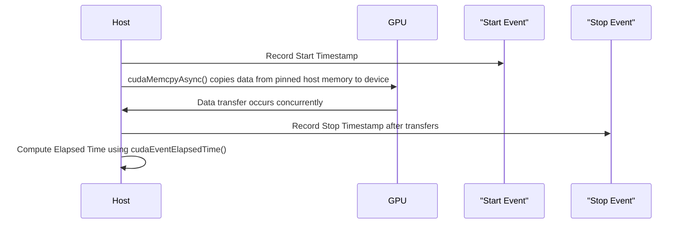

# Day 24: Pinned (Page-Locked) Memory
---

## Table of Contents

1. [Overview](#1-overview)  
2. [What is Pinned (Page-Locked) Memory?](#2-what-is-pinned-page-locked-memory)  
3. [Benefits of Pinned Memory](#3-benefits-of-pinned-memory)  
4. [Drawbacks of Excessive Pinned Memory](#4-drawbacks-of-excessive-pinned-memory)  
5. [Practical Exercise: Comparing Pinned vs. Pageable Memory Transfers](#5-practical-exercise-comparing-pinned-vs-pageable-memory-transfers)  
    - [a) Code Example Using Pageable Memory](#a-code-example-using-pageable-memory)  
    - [b) Code Example Using Pinned Memory](#b-code-example-using-pinned-memory)  
    - [c) Timing and Performance Comparison](#c-timing-and-performance-comparison)  
6. [Conceptual Diagrams](#6-conceptual-diagrams)  
7. [References & Further Reading](#7-references--further-reading)  
8. [Conclusion](#8-conclusion)  
9. [Next Steps](#9-next-steps)  

---

## 1. Overview

Memory transfers between the host (CPU) and device (GPU) are a critical performance factor in CUDA applications. Traditionally, host memory is **pageable**, meaning it can be moved (paged out) by the operating system. In contrast, **pinned (page-locked) memory** is not swappable, which allows for higher throughput in data transfers.

In this lesson, we will learn how to allocate pinned memory, compare its performance with pageable memory, and understand the trade-offs involved.

---

## 2. What is Pinned (Page-Locked) Memory?

**Pinned Memory** is host memory that is locked in physical memory, meaning the OS is prevented from paging it out to disk. This is achieved using the CUDA API call `cudaMallocHost()` or `cudaHostAlloc()`. Because the memory is fixed in place:
- **Data transfers** between host and device are **faster**.
- It allows **asynchronous memory transfers** using `cudaMemcpyAsync()`, which can overlap with kernel execution.

**Pageable Memory**, on the other hand, is allocated using standard functions like `malloc()`, and can be paged out by the OS, potentially slowing down memory transfers.

---

## 3. Benefits of Pinned Memory

- **Faster Transfers:**  
  Pinned memory enables higher bandwidth for data transfers between host and GPU.
  
- **Asynchronous Transfers:**  
  Allows the use of `cudaMemcpyAsync()`, which does not block the CPU and can overlap with kernel execution, improving overall performance.
  
- **Deterministic Behavior:**  
  Memory addresses remain fixed, reducing overhead in address translation during transfers.

---

## 4. Drawbacks of Excessive Pinned Memory

- **System Performance Impact:**  
  Allocating too much pinned memory can degrade overall system performance because it reduces the amount of pageable memory available to the OS and other applications.
  
- **Limited Resources:**  
  Pinned memory is a limited resource; overuse can cause memory fragmentation and reduce the effectiveness of memory transfers.
  
- **Allocation Overhead:**  
  Allocating and freeing pinned memory is generally slower than pageable memory allocation.

---

## 5. Practical Exercise: Comparing Pinned vs. Pageable Memory Transfers

In this exercise, we will:
1. Implement a simple vector addition using **pageable memory**.
2. Implement the same vector addition using **pinned memory**.
3. Measure and compare the transfer times and overall performance.

### a) Code Example Using Pageable Memory

```cpp
// pageableVectorAdd.cu
#include <cuda_runtime.h>
#include <stdio.h>
#include <stdlib.h>
#include <time.h>

// Simple vector addition kernel.
__global__ void vectorAddKernel(const float *A, const float *B, float *C, int N) {
    int idx = threadIdx.x + blockIdx.x * blockDim.x;
    if (idx < N) {
        C[idx] = A[idx] + B[idx];
    }
}

int main() {
    int N = 1 << 20;  // 1M elements
    size_t size = N * sizeof(float);

    // Allocate pageable host memory.
    float *h_A = (float*)malloc(size);
    float *h_B = (float*)malloc(size);
    float *h_C = (float*)malloc(size);

    // Initialize host arrays.
    srand(time(NULL));
    for (int i = 0; i < N; i++) {
        h_A[i] = (float)(rand() % 100) / 10.0f;
        h_B[i] = (float)(rand() % 100) / 10.0f;
    }

    float *d_A, *d_B, *d_C;
    cudaMalloc((void**)&d_A, size);
    cudaMalloc((void**)&d_B, size);
    cudaMalloc((void**)&d_C, size);

    // Copy data to device (synchronously).
    cudaMemcpy(d_A, h_A, size, cudaMemcpyHostToDevice);
    cudaMemcpy(d_B, h_B, size, cudaMemcpyHostToDevice);

    int threadsPerBlock = 256;
    int blocksPerGrid = (N + threadsPerBlock - 1) / threadsPerBlock;
    vectorAddKernel<<<blocksPerGrid, threadsPerBlock>>>(d_A, d_B, d_C, N);
    cudaDeviceSynchronize();

    // Copy result back to host (synchronously).
    cudaMemcpy(h_C, d_C, size, cudaMemcpyDeviceToHost);

    // Print first 5 results.
    printf("Pageable Memory - First 5 Results:\n");
    for (int i = 0; i < 5; i++) {
        printf("%f ", h_C[i]);
    }
    printf("\n");

    // Free memory.
    free(h_A);
    free(h_B);
    free(h_C);
    cudaFree(d_A);
    cudaFree(d_B);
    cudaFree(d_C);

    return 0;
}
```

*Comments:*  
- **Pageable Memory:**  
  Uses standard `malloc()` for host memory allocation.
- **Synchronous Transfers:**  
  Data is copied synchronously, which can be slower.

---

### b) Code Example Using Pinned Memory

```cpp
// pinnedVectorAdd.cu
#include <cuda_runtime.h>
#include <stdio.h>
#include <stdlib.h>
#include <time.h>

// Simple vector addition kernel.
__global__ void vectorAddKernel(const float *A, const float *B, float *C, int N) {
    int idx = threadIdx.x + blockIdx.x * blockDim.x;
    if (idx < N) {
        C[idx] = A[idx] + B[idx];
    }
}

int main() {
    int N = 1 << 20;  // 1M elements
    size_t size = N * sizeof(float);

    // Allocate pinned host memory.
    float *h_A, *h_B, *h_C;
    cudaMallocHost((void**)&h_A, size);  // Pinned memory allocation
    cudaMallocHost((void**)&h_B, size);
    cudaMallocHost((void**)&h_C, size);

    // Initialize host arrays with random values.
    srand(time(NULL));
    for (int i = 0; i < N; i++) {
        h_A[i] = (float)(rand() % 100) / 10.0f;
        h_B[i] = (float)(rand() % 100) / 10.0f;
    }

    // Allocate device memory.
    float *d_A, *d_B, *d_C;
    cudaMalloc((void**)&d_A, size);
    cudaMalloc((void**)&d_B, size);
    cudaMalloc((void**)&d_C, size);

    // Use asynchronous memory copy to transfer data from pinned host memory to device memory.
    cudaMemcpyAsync(d_A, h_A, size, cudaMemcpyHostToDevice);
    cudaMemcpyAsync(d_B, h_B, size, cudaMemcpyHostToDevice);

    int threadsPerBlock = 256;
    int blocksPerGrid = (N + threadsPerBlock - 1) / threadsPerBlock;

    // Launch kernel.
    vectorAddKernel<<<blocksPerGrid, threadsPerBlock>>>(d_A, d_B, d_C, N);
    cudaDeviceSynchronize();

    // Asynchronously copy the result from device back to host.
    cudaMemcpyAsync(h_C, d_C, size, cudaMemcpyDeviceToHost);
    cudaDeviceSynchronize();

    // Print first 5 results.
    printf("Pinned Memory - First 5 Results:\n");
    for (int i = 0; i < 5; i++) {
        printf("%f ", h_C[i]);
    }
    printf("\n");

    // Free device and pinned host memory.
    cudaFree(d_A);
    cudaFree(d_B);
    cudaFree(d_C);
    cudaFreeHost(h_A);
    cudaFreeHost(h_B);
    cudaFreeHost(h_C);

    return 0;
}
```

*Comments:*  
- **Pinned Memory Allocation:**  
  Uses `cudaMallocHost()` to allocate pinned memory, which is faster for data transfers.
- **Asynchronous Transfers:**  
  Uses `cudaMemcpyAsync()` for asynchronous data transfers to improve performance.
- **Synchronization:**  
  `cudaDeviceSynchronize()` is used to ensure that both the kernel and memory transfers complete before data is accessed.

---

### c) Timing and Performance Comparison

To compare the performance between pinned and pageable memory transfers, you can insert timing code (using CUDA events) around the `cudaMemcpy()` calls. This will show the differences in transfer times.

```cpp
// performanceComparison.cu
#include <cuda_runtime.h>
#include <stdio.h>
#include <stdlib.h>
#include <time.h>

// Simple kernel remains the same.
__global__ void vectorAddKernel(const float *A, const float *B, float *C, int N) {
    int idx = threadIdx.x + blockIdx.x * blockDim.x;
    if (idx < N) {
        C[idx] = A[idx] + B[idx];
    }
}

#define CUDA_CHECK(call) {                                      \
    cudaError_t err = call;                                     \
    if (err != cudaSuccess) {                                   \
        printf("CUDA Error at %s:%d - %s\n", __FILE__, __LINE__, cudaGetErrorString(err)); \
        exit(EXIT_FAILURE);                                     \
    }                                                           \
}

int main() {
    int N = 1 << 20; // 1M elements
    size_t size = N * sizeof(float);
    float *h_A, *h_B, *h_C;
    // Allocate pageable memory
    h_A = (float*)malloc(size);
    h_B = (float*)malloc(size);
    h_C = (float*)malloc(size);

    // Initialize host arrays.
    srand(time(NULL));
    for (int i = 0; i < N; i++) {
        h_A[i] = (float)(rand() % 100) / 10.0f;
        h_B[i] = (float)(rand() % 100) / 10.0f;
    }

    float *d_A, *d_B, *d_C;
    CUDA_CHECK(cudaMalloc((void**)&d_A, size));
    CUDA_CHECK(cudaMalloc((void**)&d_B, size));
    CUDA_CHECK(cudaMalloc((void**)&d_C, size));

    // Measure pageable memory transfer time.
    cudaEvent_t start, stop;
    CUDA_CHECK(cudaEventCreate(&start));
    CUDA_CHECK(cudaEventCreate(&stop));

    CUDA_CHECK(cudaEventRecord(start, 0));
    CUDA_CHECK(cudaMemcpy(d_A, h_A, size, cudaMemcpyHostToDevice));
    CUDA_CHECK(cudaMemcpy(d_B, h_B, size, cudaMemcpyHostToDevice));
    CUDA_CHECK(cudaEventRecord(stop, 0));
    CUDA_CHECK(cudaEventSynchronize(stop));

    float pageableTime = 0;
    CUDA_CHECK(cudaEventElapsedTime(&pageableTime, start, stop));
    printf("Pageable Memory Transfer Time: %f ms\n", pageableTime);

    // Now free pageable host memory.
    free(h_A);
    free(h_B);
    free(h_C);

    // Allocate pinned host memory.
    CUDA_CHECK(cudaMallocHost((void**)&h_A, size));
    CUDA_CHECK(cudaMallocHost((void**)&h_B, size));
    CUDA_CHECK(cudaMallocHost((void**)&h_C, size));

    // Reinitialize host arrays.
    srand(time(NULL));
    for (int i = 0; i < N; i++) {
        h_A[i] = (float)(rand() % 100) / 10.0f;
        h_B[i] = (float)(rand() % 100) / 10.0f;
    }

    // Measure pinned memory transfer time.
    CUDA_CHECK(cudaEventRecord(start, 0));
    CUDA_CHECK(cudaMemcpyAsync(d_A, h_A, size, cudaMemcpyHostToDevice));
    CUDA_CHECK(cudaMemcpyAsync(d_B, h_B, size, cudaMemcpyHostToDevice));
    CUDA_CHECK(cudaEventRecord(stop, 0));
    CUDA_CHECK(cudaEventSynchronize(stop));

    float pinnedTime = 0;
    CUDA_CHECK(cudaEventElapsedTime(&pinnedTime, start, stop));
    printf("Pinned Memory Transfer Time: %f ms\n", pinnedTime);

    // Cleanup
    CUDA_CHECK(cudaFree(d_A));
    CUDA_CHECK(cudaFree(d_B));
    CUDA_CHECK(cudaFree(d_C));
    CUDA_CHECK(cudaFreeHost(h_A));
    CUDA_CHECK(cudaFreeHost(h_B));
    CUDA_CHECK(cudaFreeHost(h_C));
    CUDA_CHECK(cudaEventDestroy(start));
    CUDA_CHECK(cudaEventDestroy(stop));

    return 0;
}
```

*Detailed Comments:*  
- **Pageable Memory Section:**  
  - Allocate standard host memory using `malloc()`.
  - Measure transfer time using `cudaMemcpy()` synchronously.
- **Pinned Memory Section:**  
  - Allocate host memory using `cudaMallocHost()` for pinned memory.
  - Measure transfer time using `cudaMemcpyAsync()` to allow asynchronous transfers.
- **Timing:**  
  CUDA events record the time for memory transfers. The elapsed time is calculated and printed, demonstrating that pinned memory transfers are faster.
- **Resource Cleanup:**  
  All allocated memory and events are freed.

---

## 6. Conceptual Diagrams

### Diagram 1: Pageable vs. Pinned Memory Flow

```mermaid
flowchart TD
    A[Allocate Host Memory]
    B{Memory Type?}
    C[Pageable Memory]
    D[Pinned Memory (cudaMallocHost)]
    E[Copy Data to Device using cudaMemcpy() (Blocking)]
    F[Copy Data to Device using cudaMemcpyAsync() (Asynchronous)]
    
    A --> B
    B -- Pageable --> C
    B -- Pinned --> D
    C --> E
    D --> F
```

*Explanation:*  
- The diagram compares the two types of memory allocation.
- Pageable memory is allocated with standard `malloc()` and uses blocking memory copies.
- Pinned memory is allocated with `cudaMallocHost()` and allows asynchronous copies.

### Diagram 2: Asynchronous Memory Copy Timing Workflow



*Explanation:*  
- The sequence diagram shows how asynchronous memory copy is timed using CUDA events.
- The host records start and stop timestamps around the asynchronous copy, then computes elapsed time.

---

## 7. References & Further Reading

1. **CUDA C Programming Guide – Pinned Memory**  
   [CUDA Unified Memory & Pinned Memory](https://docs.nvidia.com/cuda/cuda-c-programming-guide/index.html#um-overview)  
   Detailed discussion on pinned memory and its benefits.
2. **CUDA C Best Practices Guide – Asynchronous Transfers**  
   [CUDA Asynchronous Transfers](https://docs.nvidia.com/cuda/cuda-c-best-practices-guide/index.html#asynchronous-transfers)
3. **NVIDIA Developer Blog on Pinned Memory**  
   [Pinned Memory Blog Post](https://developer.nvidia.com/blog/unified-memory-cuda-beginners/)
4. **NVIDIA NSight Compute Documentation**  
   [NVIDIA NSight Compute](https://docs.nvidia.com/nsight-compute/)

---

## 8. Conclusion

Today, we have:
- Explored the differences between **pageable and pinned host memory**.
- Understood how **pinned memory enables faster asynchronous memory transfers**.
- Implemented and measured the performance benefits of using **pinned memory** versus pageable memory.
- Learned to use **CUDA events** for accurate timing of memory transfers.
- Identified common pitfalls, such as excessive pinned memory allocation potentially impacting system performance.

---

## 9. Next Steps

- **Experiment:**  
  Modify the example to handle larger data sizes and test the limits of pinned memory.
- **Profile:**  
  Use NVIDIA NSight Systems to analyze the asynchronous transfers.
- **Optimize:**  
  Integrate asynchronous transfers with kernel execution to overlap computation and communication.
- **Expand:**  
  Apply these techniques in larger projects like image processing or deep learning pipelines.

```
