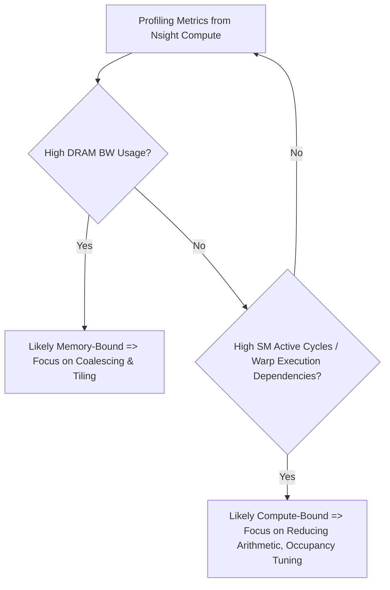

# Day 36: Profiling & Bottleneck Analysis

**Objective:**  
Use **NVIDIA Nsight Compute** (or similar profiling tools) to **analyze a matrix multiplication** (or a similar compute-intensive kernel) to identify whether the kernel is **memory-bound** or **compute-bound**. We will implement a matrix multiplication kernel, profile it using **Nsight Compute**, and then interpret the results to understand how memory throughput or compute resources constrain performance.  

> **Key Pitfall:** Focusing only on compute metrics or only on memory metrics can lead to **incomplete analysis**. Always check both **memory utilization** and **compute (SM) utilization** to see where the real bottleneck lies.

**References:**  
- [Nsight Compute Documentation](https://docs.nvidia.com/nsight-compute/)  
- [CUDA C Programming Guide – Performance & Profiling](https://docs.nvidia.com/cuda/cuda-c-programming-guide/index.html#profiling)  
- [CUDA Best Practices Guide – Memory vs Compute Bound](https://docs.nvidia.com/cuda/cuda-c-best-practices-guide/index.html)

---

## Table of Contents

1. [Overview](#1-overview)  
2. [Memory-Bound vs. Compute-Bound Kernels](#2-memory-bound-vs-compute-bound-kernels)  
3. [Practical Exercise: Matrix Multiplication Profiling](#3-practical-exercise-matrix-multiplication-profiling)  
   - [a) Example Matrix Multiplication Kernel](#a-example-matrix-multiplication-kernel)  
   - [b) Profiling with Nsight Compute](#b-profiling-with-nsight-compute)  
   - [c) Interpreting Key Metrics](#c-interpreting-key-metrics)  
4. [Common Pitfalls & Best Practices](#4-common-pitfalls--best-practices)  
5. [Conceptual Diagrams](#5-conceptual-diagrams)  
6. [References & Further Reading](#6-references--further-reading)  
7. [Conclusion](#7-conclusion)  
8. [Next Steps](#8-next-steps)  

---

## 1. Overview

Matrix multiplication is a fundamental linear algebra operation often used in computer graphics, scientific computing, and machine learning. It can stress both **compute** resources (floating-point operations) and **memory** resources (accessing large input matrices). By profiling a matrix multiplication kernel with **Nsight Compute**, we can identify:
- Whether the kernel is **memory-bandwidth limited** (memory-bound).
- Or if it’s **compute-limited** (sm-bound) based on instruction throughput and warp stalls.

This analysis guides optimizations—such as **tile-based approaches** in shared memory, improved memory coalescing, or concurrency enhancements—to address specific bottlenecks.

---

## 2. Memory-Bound vs. Compute-Bound Kernels

### Memory-Bound
- **Definition:** Performance is primarily limited by the available memory bandwidth rather than raw compute throughput.
- **Indicators:**
  - High memory utilization, many warp stalls waiting for data.
  - Low SM utilization or low FP instruction throughput relative to memory instructions.

### Compute-Bound
- **Definition:** Performance is primarily limited by available FP (floating-point) throughput or instruction scheduling.
- **Indicators:**
  - High SM utilization, warp stalls due to execution dependencies (not memory).
  - Achieving near-peak FLOPs but not saturating memory bandwidth.

**In Reality:**  
Many kernels have a mix of **both** memory and compute constraints. You can identify the stronger limiting factor by analyzing metrics like **achieved occupancy**, **SM utilization**, **memory throughput** vs. **theoretical maximum**.

---

## 3. Practical Exercise: Matrix Multiplication Profiling

### a) Example Matrix Multiplication Kernel

This simplified kernel computes `C = A * B` for square matrices of size N×N. We assume **row-major** order. We’ll keep it straightforward for demonstration.

```cpp
// day36_matrixMul.cu
#include <cuda_runtime.h>
#include <stdio.h>
#include <stdlib.h>
#include <time.h>

__global__ void matrixMulKernel(const float* A, const float* B, float* C, int N) {
    int row = blockIdx.y * blockDim.y + threadIdx.y;
    int col = blockIdx.x * blockDim.x + threadIdx.x;

    if (row < N && col < N) {
        float sum = 0.0f;
        for (int k = 0; k < N; k++) {
            sum += A[row * N + k] * B[k * N + col];
        }
        C[row * N + col] = sum;
    }
}

#define CUDA_CHECK(call) {                                        \
    cudaError_t err = call;                                       \
    if(err != cudaSuccess) {                                      \
        printf("CUDA Error at %s:%d - %s\n", __FILE__, __LINE__,  \
               cudaGetErrorString(err));                          \
        exit(EXIT_FAILURE);                                       \
    }                                                             \
}

int main() {
    int N = 1024; // Square matrix dimension
    size_t size = N * N * sizeof(float);

    // Allocate host memory
    float *h_A = (float*)malloc(size);
    float *h_B = (float*)malloc(size);
    float *h_C = (float*)malloc(size);

    srand(time(NULL));
    for(int i=0; i < N*N; i++){
        h_A[i] = (float)(rand() % 100) / 10.0f;
        h_B[i] = (float)(rand() % 100) / 10.0f;
    }

    // Allocate device memory
    float *d_A, *d_B, *d_C;
    CUDA_CHECK(cudaMalloc(&d_A, size));
    CUDA_CHECK(cudaMalloc(&d_B, size));
    CUDA_CHECK(cudaMalloc(&d_C, size));

    // Copy data from host to device
    CUDA_CHECK(cudaMemcpy(d_A, h_A, size, cudaMemcpyHostToDevice));
    CUDA_CHECK(cudaMemcpy(d_B, h_B, size, cudaMemcpyHostToDevice));

    // Kernel launch configuration
    dim3 threadsPerBlock(16, 16);
    dim3 blocksPerGrid((N + 15)/16, (N + 15)/16);

    // Launch kernel
    matrixMulKernel<<<blocksPerGrid, threadsPerBlock>>>(d_A, d_B, d_C, N);
    CUDA_CHECK(cudaDeviceSynchronize());

    // Copy result back
    CUDA_CHECK(cudaMemcpy(h_C, d_C, size, cudaMemcpyDeviceToHost));

    // Print part of the result
    printf("C[0] = %f, C[N*N -1] = %f\n", h_C[0], h_C[N*N - 1]);

    // Cleanup
    free(h_A); free(h_B); free(h_C);
    CUDA_CHECK(cudaFree(d_A));
    CUDA_CHECK(cudaFree(d_B));
    CUDA_CHECK(cudaFree(d_C));

    return 0;
}
```

*Comments:*
- The kernel is an **O(N^3)** operation. For large N, it’s heavily compute-intensive, but memory access patterns also matter.
- This naive version has **no shared memory tiling** and can be heavily memory-bound or compute-bound depending on GPU specs.

---

### b) Profiling with Nsight Compute

1. **Build the Code**  
   ```bash
   nvcc day36_matrixMul.cu -o day36_matrixMul
   ```
2. **Launch Nsight Compute**  
   ```bash
   ncu --target-processes all ./day36_matrixMul
   ```
3. **Observe Kernel Metrics**  
   Nsight Compute will present metrics such as:
   - **Achieved Occupancy**: How many warps are active vs. potential maximum.
   - **Memory Throughput**: Global load/store throughput, DRAM utilization.
   - **Compute Throughput**: SM active cycles, warp stall reasons, FLOP/s rates.
4. **Identify Bottleneck**  
   - If memory throughput is close to the GPU’s max bandwidth but SM usage is relatively low, likely memory-bound.
   - If SM usage is high, many warp stalls are *not* due to memory, or you see near-peak FLOP usage, likely compute-bound.

---

### c) Interpreting Key Metrics

**Example**:
- **Memory Bound** Clues:
  - High ratio of memory instructions to arithmetic instructions.
  - Warp stalls labeled as “waiting for memory” or “mem dependency”.
  - High DRAM utilization near the GPU’s theoretical bandwidth.
- **Compute Bound** Clues:
  - High SM utilization and occupancy.
  - Many warp stalls labeled as “execution dependency”, indicating each warp is busy with arithmetic operations.
  - Memory throughput is well below hardware max, showing the GPU isn’t saturating memory.

**Potential Optimizations**:
- If memory-bound, investigate **shared memory tiling** or **coalescing**.
- If compute-bound, consider **tiling** to reduce repeated arithmetic, or use **tensor cores** for matrix multiplication if available.

---

## 4. Common Pitfalls & Best Practices

| **Pitfall**                                      | **Solution**                                                                 |
|--------------------------------------------------|-------------------------------------------------------------------------------|
| Only focusing on compute metrics                 | Always check memory bandwidth metrics to see if the kernel saturates memory. |
| Not using the right analysis tool                | Nsight Compute is best for kernel-level details; Nsight Systems for timeline concurrency. |
| Overlooking occupancy & shared memory usage      | Combine occupancy analysis with memory vs. compute metrics for full picture. |
| Not verifying performance improvements           | Re-run and measure actual kernel times to confirm your optimizations help.   |
| Confusing “memory-bound” with “bandwidth-bound”  | Precisely identify if it’s L2 cache, DRAM bandwidth, or memory latency that is limiting. |

---

## 5. Conceptual Diagrams

### Diagram 1: Kernel Profiling Flow

```mermaid
flowchart TD
    A[Compile & Run Kernel (day36_matrixMul)]
    B[Launch Nsight Compute: ncu]
    C[Collect Metrics: Occupancy, Memory Throughput, Warp Stalls]
    D[Analyze Kernel Bottleneck]
    E[Memory-Bound or Compute-Bound?]
    F[Optimize: e.g., Tiling, Coalescing, Occupancy]

    A --> B
    B --> C
    C --> D
    D --> E
    E --> F
```

*Explanation:*  
- The diagram shows how to compile, run, profile with Nsight Compute, interpret metrics, and decide optimization strategies.

### Diagram 2: Memory-Bound vs. Compute-Bound Classification



*Explanation:*  
- This flow assists in quickly deciding if the kernel is primarily memory-bound or compute-bound based on raw profiling data.

---

## 6. References & Further Reading

1. **Nsight Compute Documentation**  
   [NVIDIA Nsight Compute](https://docs.nvidia.com/nsight-compute/)
2. **CUDA C Programming Guide – Performance & Profiling**  
   [Profiling Section](https://docs.nvidia.com/cuda/cuda-c-programming-guide/index.html#profiling)
3. **CUDA C Best Practices Guide**  
   [Memory vs Compute Bound](https://docs.nvidia.com/cuda/cuda-c-best-practices-guide/index.html)
4. **"Programming Massively Parallel Processors: A Hands-on Approach" by David Kirk & Wen-mei W. Hwu**  
5. **NVIDIA Developer Blog**  
   [NVIDIA Developer Blog](https://developer.nvidia.com/blog/)

---

## 7. Conclusion

In **Day 36**, we focused on **Profiling & Bottleneck Analysis** for a matrix multiplication kernel:

- We learned how to use **Nsight Compute** to gather metrics such as **occupancy**, **memory throughput**, and **warp stall** reasons.
- We examined how to **distinguish** memory-bound vs. compute-bound kernels by interpreting these metrics.
- We discussed **common pitfalls**, including ignoring memory usage when it might be the primary bottleneck.

**Key Takeaway**: Use **profiling** to guide your optimizations. Knowing whether your kernel is memory-bound or compute-bound drastically affects the changes you make—like adding shared memory tiling for memory-bound kernels or reducing arithmetic complexity for compute-bound kernels.

---

## 8. Next Steps

- **Extend Matrix Multiply**: Implement a **tiled shared memory** version of matrix multiplication. Compare performance vs. the naive version.
- **Try Larger Matrix Sizes**: See how scaling input size changes memory vs. compute-bound behavior.
- **Profile Over Multiple Kernel Iterations**: Observe if real-time data transfers or concurrency can be improved.
- **Combine Tools**: Use Nsight Systems for concurrency timeline, Nsight Compute for deep kernel analysis, ensuring a holistic view of performance.

Happy CUDA coding, and keep refining your bottleneck analysis for optimized GPU performance!
```
