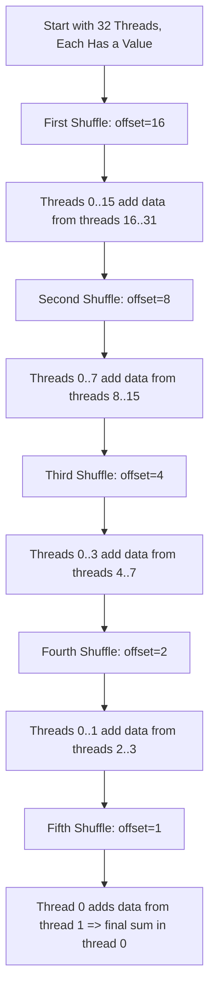
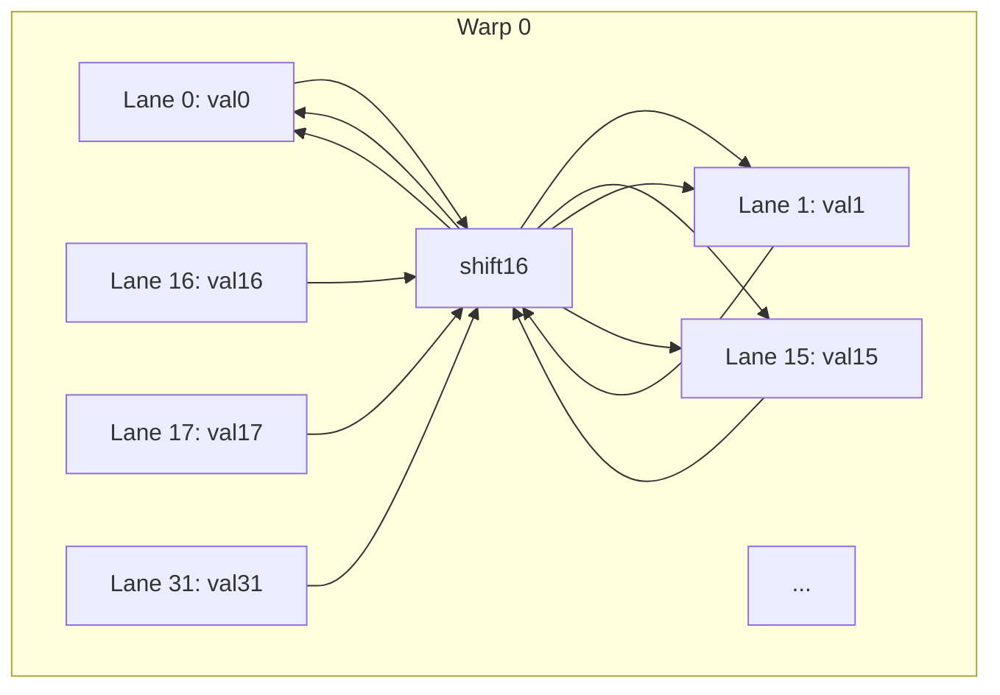

# Day 37: **Intro to Warp-Level Primitives**

In modern CUDA-capable GPUs, **warp-level primitives** allow threads **within the same warp** to efficiently exchange data without using shared memory. The most famous of these are the **warp shuffle instructions** (`__shfl_xor_sync`, `__shfl_down_sync`, etc.), which can significantly speed up certain parallel algorithms like **reductions** and **prefix sums**. However, using these intrinsics incorrectly (e.g., with the wrong mask or ignoring warp divergence) can lead to subtle bugs and incorrect results.

In this less “conventional” style, we’ll explore the concept with **diagrams**, **code snippets**, and direct examples, focusing on how warp shuffle can implement a small parallel reduction at **warp level**.

---

## **Why Warp-Level Primitives?**

- **Avoid Shared Memory Overheads**: Normally, partial reductions or prefix sums rely on shared memory to exchange data within a block. Warp shuffle instructions let threads in the same warp directly read the registers of other threads, removing the need for shared memory and reducing synchronization overhead.
- **Simplify Data Exchange**: Intrinsics like `__shfl_xor_sync` enable butterfly-style data exchanges among warp threads—great for parallel reductions or scans.
- **High Speed**: On many architectures, warp shuffle instructions are handled at hardware-level with minimal overhead.

**But**: They only work **within a single warp** (32 threads). For blocks bigger than 32 threads, you still need additional logic for combining partial results across multiple warps.

---

## **Key Concepts**

1. **Warp**:  
   A set of 32 threads executing in lockstep.  
2. **Active Mask**:  
   Each warp might have an "active mask" representing threads that haven't diverged or are still active.  
3. **Shuffle Intrinsics**:  
   - `__shfl_sync(mask, val, srcLane, width)`: Return the value of thread `srcLane` in the warp.  
   - `__shfl_down_sync(mask, val, delta, width)`: Return the value from the lane `laneID + delta`.  
   - `__shfl_xor_sync(mask, val, laneMask, width)`: Return the value from the lane `laneID ^ laneMask`.

**Caution**:  
- The **mask** parameter in `_sync` intrinsics usually is the **full warp mask** (e.g., 0xffffffff) if all 32 threads are participating.  
- Make sure to use the correct **lane ID** so you don't fetch data from an inactive or diverged thread.

---

## **A Fun Example**: **Warp-Level Reduction**

We’ll show a small partial reduction for 32 elements in a warp using shuffle intrinsics. If you have more than 32 elements per block, you can reduce each warp’s portion, then combine warp results in shared memory or at the block level.

### **Pseudo Workflow**  

1. Each thread in warp loads one element.  
2. Perform a **butterfly** shuffle reduction:
   - Iteratively combine partial sums from threads whose lane IDs differ by `1, 2, 4, 8, 16`.
   - After each step, half the warp is effectively computing partial sums for the next step.

### **Code Snippet**

```cpp
__inline__ __device__
float warpReduceSum(float val) {
    // Full mask for all 32 threads in warp
    unsigned int mask = 0xffffffff;
    
    // For a 32-thread warp, do log2(32) = 5 steps
    // 1,2,4,8,16
    val += __shfl_down_sync(mask, val, 16, 32);
    val += __shfl_down_sync(mask, val, 8, 32);
    val += __shfl_down_sync(mask, val, 4, 32);
    val += __shfl_down_sync(mask, val, 2, 32);
    val += __shfl_down_sync(mask, val, 1, 32);
    return val;
}

__global__ void warpReductionExample(const float *input, float *output) {
    // We assume each warp only handles 32 elements for simplicity
    int laneId = threadIdx.x & 31;  // mod 32
    int warpId = threadIdx.x >> 5;
    
    float val = input[threadIdx.x];  // each thread reads one element from input
    
    // Now do warp-level reduce sum
    val = warpReduceSum(val);
    
    // Only lane 0 writes out the warp’s result
    if (laneId == 0) {
        output[warpId] = val;
    }
}
```

**Explanation**:  
- `__shfl_down_sync(mask, val, offset, width)` shifts data within the warp by `offset` lanes.  
- The final sum ends up in threads with lower lane IDs as you progress. Eventually lane 0 holds the warp’s sum.  
- For a naive example, if the block has e.g. 128 threads (4 warps), each warp does a warp-level sum of 32 elements, writing partial sums out.

---

## **Divergence & Shuffle Mask Pitfalls**

- **Divergent Warps**: If some threads in a warp are inactive or diverged, you must ensure the correct **mask** is used or the results will be invalid.  
- **Incorrect Lane IDs**: Using the wrong offsets or not accounting for the lane ID properly can cause threads to fetch from the wrong source.

---

## **Diagrams Galore**

### **Diagram 1**: Warp Shuffle (Down) Steps



*Explanation:*  
- The warp is 32 threads, we do 5 steps for a reduction.  
- Each step halves the number of active threads computing partial sums.

---

### **Diagram 2**: Lane IDs and Data Movement



*Explanation (simplistic)*:  
- During an offset=16 shuffle, lane 16’s data flows to lane 0, lane 17’s data flows to lane 1, and so forth.  
- The kernel code adds them into local accumulators in these receiving threads.

---

## **Performance Insights**

**If your kernel** is:
- **Compute-limited**: You might see that the warp shuffle usage is minimal overhead, but the GPU is near peak FLOPs usage.  
- **Memory-limited**: Even though warp shuffle is fast, the overall kernel might still wait on global memory loads. Consider using fewer global accesses or reorganizing data.

Using warp shuffles **replaces** the typical shared memory approach of storing partial sums, then reading them in different threads. This can be faster if your warp is entirely active and you do minimal data exchange.

---

## **Common Pitfalls & Best Practices**

1. **Wrong Mask**:  
   - Always use `0xffffffff` if the entire warp is active.  
   - If some threads are inactive, compute an appropriate mask using e.g. `__ballot_sync()`.
2. **Ignoring Lane ID**:  
   - `__shfl_*_sync()` intrinsics rely heavily on correct lane indexing.
3. **Exceeding Warp Boundaries**:  
   - Shuffles only communicate within the same warp. For block sizes >32, you’ll need additional logic to combine partial results across multiple warps.
4. **Warp Divergence**:  
   - If half your warp is inactive, you effectively break assumptions about who is reading or writing. 
5. **Measuring Gains**:  
   - Always measure if warp shuffle is actually faster than a shared memory approach for your kernel usage patterns.

---

## **References & Further Reading**

- **CUDA C Programming Guide – Warp Intrinsics**  
  [Warp Shuffle Documentation](https://docs.nvidia.com/cuda/cuda-c-programming-guide/index.html#warp-shuffle-functions)  
- **NVIDIA Developer Blog**:  
  [Efficient Data Exchange using Shuffle Intrinsics](https://developer.nvidia.com/blog/)  
- **“Programming Massively Parallel Processors” by Kirk & Hwu**  
  Detailed coverage of warp-level programming approaches.

---

## **Conclusion**

**Day 37**: Warps, lane IDs, and shuffle intrinsics can drastically accelerate data exchange for small parallel reductions or prefix sums by **avoiding shared memory** overhead and large-scale synchronizations. The technique is:
- **Powerful**: Simplify partial sums within a warp.
- **Tricky**: Must handle lane ID carefully, handle masks for partial warps, and still handle data across warps if block >32 threads.  
- **Often** used in advanced CUDA libraries and high-performance codes.

So go forth—**shuffle** your data within warps, measure your speed-ups, and enjoy the minimal overhead of warp-level exchange. Just remember: divergence or incorrect shuffle usage can sabotage your results. Happy warp programming!
```
