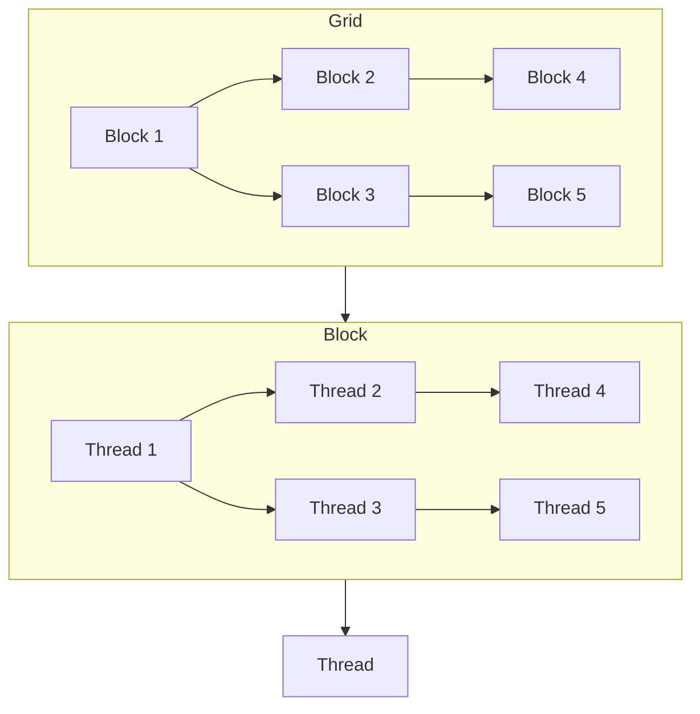

# Day 04: Thread Hierarchy: Grids & Blocks

## Table of Contents
1. [Overview](#1-overview)  
2. [Understanding CUDA Thread Hierarchy](#2-understanding-cuda-thread-hierarchy)  
    - [a) **Grids and Blocks**](#a-grids-and-blocks)  
    - [b) **Warps**](#b-warps)  
3. [Thread Indexing](#3-thread-indexing)  
    - [a) **Global Indexing**](#a-global-indexing)  
    - [b) **Block Indexing**](#b-block-indexing)  
    - [c) **Thread Indexing**](#c-thread-indexing)  
4. [Choosing Grid and Block Sizes](#4-choosing-grid-and-block-sizes)  
    - [a) **Factors to Consider**](#a-factors-to-consider)  
    - [b) **Optimal Configurations**](#b-optimal-configurations)  
5. [Synchronization Within Blocks](#5-synchronization-within-blocks)  
    - [a)**Syncthreads**](#a-syncthreads)
    - [b) **Barrier Synchronization**](#b-barrier-synchronization)  
6. [Practical Examples](#6-practical-examples)  
    - [a) **Simple Kernel Launch**](#a-simple-kernel-launch)  
    - [b) **Matrix Multiplication Example**](#b-matrix-multiplication-example)  
7. [Conceptual Diagrams: Grids and Blocks](#7-conceptual-diagrams-grids-and-blocks)  
8. [Common Pitfalls](#8-common-pitfalls)  
9. [References & Further Reading](#9-references--further-reading)  
10. [Conclusion](#10-conclusion)  
11. [Next Steps](#11-next-steps)  
---

## 1. Overview
In CUDA programming, understanding the thread hierarchy is fundamental to writing efficient parallel code. The thread hierarchy in CUDA is organized into **Grids**, **Blocks**, and **Warps**, which collectively determine how threads are managed and executed on the GPU. This day’s focus is on comprehensively exploring **Grids** and **Blocks**, their roles in parallel computation, how to effectively index threads, and best practices for choosing grid and block sizes.

---

## 2. Understanding CUDA Thread Hierarchy

CUDA organizes threads in a hierarchical structure to efficiently manage parallel computations. This hierarchy consists of **Grids**, **Blocks**, and **Warps**.

### a) **Grids and Blocks**

- **Grid**: A grid is a collection of blocks that execute a kernel. When you launch a CUDA kernel, you specify the number of blocks in a grid. Grids can be one-dimensional, two-dimensional, or three-dimensional, depending on the problem's dimensionality.

- **Block**: Each block contains a group of threads that can cooperate among themselves through shared memory and can synchronize their execution. Blocks also have a one-dimensional, two-dimensional, or three-dimensional organization.

**Key Points:**
- Blocks are the units of thread scheduling on the GPU.
- Threads within the same block can communicate and synchronize.
- Blocks are independent of each other; there is no direct communication between blocks.

### b) **Warps**

- **Warp**: A warp is a group of 32 threads within a block that are executed simultaneously on a single Streaming Multiprocessor (SM). Warps are the smallest unit of execution in CUDA.

**Key Points:**
- All threads in a warp execute the same instruction simultaneously (SIMT model).
- Divergence within a warp (e.g., due to conditional branches) can lead to performance penalties.

---

## 3. Thread Indexing

Proper thread indexing is crucial for mapping data elements to threads, ensuring that each thread operates on the correct portion of the data.

### a) **Global Indexing**

Global indexing refers to the unique identification of a thread across the entire grid. It is used to map each thread to a specific data element.

```cpp
int globalIdx = blockIdx.x * blockDim.x + threadIdx.x;
```

**Explanation:**
- `blockIdx.x`: The block index within the grid.
- `blockDim.x`: The number of threads per block (block dimension).
- `threadIdx.x`: The thread index within the block.

### b) **Block Indexing**

Block indexing identifies the position of a block within the grid.

```cpp
int blockIdx = blockIdx.x;
```

### c) **Thread Indexing**

Thread indexing identifies the position of a thread within its block.

```cpp
int threadIdx = threadIdx.x;
```

**Example Usage:**
```cpp
__global__ void exampleKernel(float *A, int N) {
    int globalIdx = blockIdx.x * blockDim.x + threadIdx.x;
    if (globalIdx < N) {
        A[globalIdx] = globalIdx;
    }
}
```

---

## 4. Choosing Grid and Block Sizes

Selecting appropriate grid and block sizes is essential for maximizing GPU utilization and achieving optimal performance.

### a) **Factors to Consider**

1. **Total Number of Threads**: Should be sufficient to cover all data elements.
2. **Hardware Constraints**:
    - **Maximum Threads per Block**: Varies by GPU architecture (commonly 1024).
    - **Number of Registers and Shared Memory per Block**: Influences how many blocks can be active simultaneously.
3. **Occupancy**: The ratio of active warps to the maximum number of warps supported on an SM.
4. **Memory Access Patterns**: Coalesced accesses are more efficient when threads access contiguous memory locations.

### b) **Optimal Configurations**

- **Power of Two**: Choosing block sizes that are powers of two (e.g., 128, 256, 512) often leads to better performance due to alignment and coalesced memory accesses.
- **Divisibility**: Ensure that the total number of threads is divisible by the warp size (32) to avoid underutilization.
- **Resource Utilization**: Balance the number of threads per block to maximize occupancy without exceeding resource limits.

**Example Configuration:**
```cpp
int threadsPerBlock = 256;
int blocksPerGrid = (N + threadsPerBlock - 1) / threadsPerBlock;
```

---

## 5. Synchronization Within Blocks

Threads within the same block can synchronize their execution to ensure correct computation, especially when sharing data through shared memory.

### a) **Syncthreads**

- **Function**: A barrier synchronization function that ensures all threads in a block have reached the synchronization point before any thread proceeds.
- **Usage**: Commonly used after loading data into shared memory to ensure data consistency.

**Example:**
```cpp
__global__ void synchronizedKernel(float *A, float *B, float *C, int N) {
    __shared__ float sharedData[256];
    int idx = blockIdx.x * blockDim.x + threadIdx.x;

    if(idx < N) {
        sharedData[threadIdx.x] = A[idx] * 2.0f;
        __syncthreads();
        C[idx] = sharedData[threadIdx.x] + B[idx];
    }
}
```

### b) **Barrier Synchronization**

- **Description**: Beyond `__syncthreads()`, CUDA provides mechanisms to coordinate threads, but they are limited to synchronization within blocks. There is no native barrier synchronization across blocks.

**Note**: Avoid assuming synchronization between blocks; design kernels accordingly.

---

## 6. Practical Examples

### a) **Simple Kernel Launch**

**Objective**: Launch a kernel with a specific grid and block configuration to perform vector addition.

```cpp
#include <cuda_runtime.h>
#include <stdio.h>

__global__ void vectorAdd(float *A, float *B, float *C, int N) {
    int globalIdx = blockIdx.x * blockDim.x + threadIdx.x;
    if(globalIdx < N) {
        C[globalIdx] = A[globalIdx] + B[globalIdx];
    }
}

int main() {
    int N = 1000000;
    size_t size = N * sizeof(float);
    float *h_A, *h_B, *h_C;
    float *d_A, *d_B, *d_C;

    // Allocate host memory
    h_A = (float*)malloc(size);
    h_B = (float*)malloc(size);
    h_C = (float*)malloc(size);

    // Initialize host vectors
    for(int i = 0; i < N; i++) {
        h_A[i] = i * 1.0f;
        h_B[i] = i * 2.0f;
    }

    // Allocate device memory
    cudaMalloc(&d_A, size);
    cudaMalloc(&d_B, size);
    cudaMalloc(&d_C, size);

    // Copy host vectors to device
    cudaMemcpy(d_A, h_A, size, cudaMemcpyHostToDevice);
    cudaMemcpy(d_B, h_B, size, cudaMemcpyHostToDevice);

    // Define block and grid sizes
    int threadsPerBlock = 256;
    int blocksPerGrid = (N + threadsPerBlock - 1) / threadsPerBlock;

    // Launch the kernel
    vectorAdd<<<blocksPerGrid, threadsPerBlock>>>(d_A, d_B, d_C, N);

    // Copy result back to host
    cudaMemcpy(h_C, d_C, size, cudaMemcpyDeviceToHost);

    // Verify the result
    bool success = true;
    for(int i = 0; i < N; i++) {
        if(h_C[i] != h_A[i] + h_B[i]) {
            success = false;
            printf("Error at index %d: %f != %f + %f\n", i, h_C[i], h_A[i], h_B[i]);
            break;
        }
    }

    if(success) {
        printf("Vector addition successful!\n");
    }

    // Free memory
    cudaFree(d_A);
    cudaFree(d_B);
    cudaFree(d_C);
    free(h_A);
    free(h_B);
    free(h_C);

    return 0;
}
```

**Explanation:**
- **Kernel Launch Parameters**: The kernel is launched with `blocksPerGrid` blocks and `threadsPerBlock` threads per block.
- **Thread Indexing**: Each thread computes its unique `globalIdx` to operate on specific elements of the vectors.

### b) **Matrix Multiplication Example**

**Objective**: Implement a simple matrix multiplication using grids and blocks to understand thread hierarchy in a more complex scenario.

```cpp
#include <cuda_runtime.h>
#include <stdio.h>

#define TILE_SIZE 16

__global__ void matrixMulCUDA(float *C, float *A, float *B, int Width) {
    __shared__ float tileA[TILE_SIZE][TILE_SIZE];
    __shared__ float tileB[TILE_SIZE][TILE_SIZE];
    
    int row = blockIdx.y * TILE_SIZE + threadIdx.y;
    int col = blockIdx.x * TILE_SIZE + threadIdx.x;
    float value = 0.0f;
    
    for(int m = 0; m < Width / TILE_SIZE; ++m) {
        tileA[threadIdx.y][threadIdx.x] = A[row * Width + m * TILE_SIZE + threadIdx.x];
        tileB[threadIdx.y][threadIdx.x] = B[(m * TILE_SIZE + threadIdx.y) * Width + col];
        __syncthreads();
        
        for(int k = 0; k < TILE_SIZE; ++k) {
            value += tileA[threadIdx.y][k] * tileB[k][threadIdx.x];
        }
        __syncthreads();
    }
    
    C[row * Width + col] = value;
}

int main() {
    int Width = 1024;
    size_t size = Width * Width * sizeof(float);
    float *h_A, *h_B, *h_C;
    float *d_A, *d_B, *d_C;

    // Allocate host memory
    h_A = (float*)malloc(size);
    h_B = (float*)malloc(size);
    h_C = (float*)malloc(size);

    // Initialize host matrices
    for(int i = 0; i < Width * Width; i++) {
        h_A[i] = 1.0f;
        h_B[i] = 1.0f;
    }

    // Allocate device memory
    cudaMalloc(&d_A, size);
    cudaMalloc(&d_B, size);
    cudaMalloc(&d_C, size);

    // Copy host matrices to device
    cudaMemcpy(d_A, h_A, size, cudaMemcpyHostToDevice);
    cudaMemcpy(d_B, h_B, size, cudaMemcpyHostToDevice);

    // Define block and grid sizes
    dim3 threadsPerBlock(TILE_SIZE, TILE_SIZE);
    dim3 blocksPerGrid((Width + TILE_SIZE - 1) / TILE_SIZE, (Width + TILE_SIZE - 1) / TILE_SIZE);

    // Launch the kernel
    matrixMulCUDA<<<blocksPerGrid, threadsPerBlock>>>(d_C, d_A, d_B, Width);

    // Copy result back to host
    cudaMemcpy(h_C, d_C, size, cudaMemcpyDeviceToHost);

    // Verify the result
    bool success = true;
    for(int i = 0; i < Width * Width; i++) {
        if(h_C[i] != Width) { // Since each element is 1 * Width
            success = false;
            printf("Error at index %d: %f != %d\n", i, h_C[i], Width);
            break;
        }
    }

    if(success) {
        printf("Matrix multiplication successful!\n");
    }

    // Free memory
    cudaFree(d_A);
    cudaFree(d_B);
    cudaFree(d_C);
    free(h_A);
    free(h_B);
    free(h_C);

    return 0;
}
```

**Explanation:**
- **Tiling Technique**: Divides the matrices into smaller sub-matrices (tiles) to optimize memory usage and cache performance.
- **Shared Memory**: Tiles of matrices A and B are loaded into shared memory to reduce global memory accesses.
- **Thread Synchronization**: `__syncthreads()` ensures that all threads have loaded their respective tiles before performing computations.

---

## 7. Conceptual Diagrams: Grids and Blocks

### a) **CUDA Thread Hierarchy Diagram**

```mermaid
graph TD
    subgraph Grid
        Block1[Block 1] --> Warp1[Warp 1]
        Block1 --> Warp2[Warp 2]
        Block2[Block 2] --> Warp3[Warp 3]
        Block2 --> Warp4[Warp 4]
        Block3[Block 3] --> Warp5[Warp 5]
        Block3 --> Warp6[Warp 6]
        Block4[Block 4] --> Warp7[Warp 7]
        Block4 --> Warp8[Warp 8]
    end
    
    Grid --> Block1
    Grid --> Block2
    Grid --> Block3
    Grid --> Block4
    
    Warp1 --> Thread1[Thread 1]
    Warp1 --> Thread2[Thread 2]
    Warp1 --> Thread3[Thread 3]
    Warp1 --> Thread4[Thread 4]
    Warp1 --> Thread5[Thread 5]
    Warp1 --> Thread6[Thread 6]
    Warp1 --> Thread7[Thread 7]
    Warp1 --> Thread8[Thread 8]
    Warp1 --> Thread9[Thread 9]
    Warp1 --> Thread10[Thread 10]
    Warp1 --> Thread11[Thread 11]
    Warp1 --> Thread12[Thread 12]
    Warp1 --> Thread13[Thread 13]
    Warp1 --> Thread14[Thread 14]
    Warp1 --> Thread15[Thread 15]
    Warp1 --> Thread16[Thread 16]
    Warp1 --> Thread17[Thread 17]
    Warp1 --> Thread18[Thread 18]
    Warp1 --> Thread19[Thread 19]
    Warp1 --> Thread20[Thread 20]
    Warp1 --> Thread21[Thread 21]
    Warp1 --> Thread22[Thread 22]
    Warp1 --> Thread23[Thread 23]
    Warp1 --> Thread24[Thread 24]
    Warp1 --> Thread25[Thread 25]
    Warp1 --> Thread26[Thread 26]
    Warp1 --> Thread27[Thread 27]
    Warp1 --> Thread28[Thread 28]
    Warp1 --> Thread29[Thread 29]
    Warp1 --> Thread30[Thread 30]
    Warp1 --> Thread31[Thread 31]
    Warp1 --> Thread32[Thread 32]
```



*Figure 6: CUDA Thread Hierarchy - Grid containing Blocks, Blocks containing Warps, Warps containing Threads.*

### b) **Grid and Block Configuration Diagram**



*Figure 7: Representation of Grid containing multiple Blocks, each Block containing multiple Threads.*

---

## 8. Common Pitfalls

1. **Incorrect Thread Indexing**
   - **Issue**: Miscalculating the `globalIdx` can lead to threads accessing out-of-bounds memory.
   - **Solution**: Always include boundary checks within kernels.
   - **Example**:
     ```cpp
     int globalIdx = blockIdx.x * blockDim.x + threadIdx.x;
     if(globalIdx < N) {
         // Safe access
     }
     ```

2. **Choosing Non-optimal Block Sizes**
   - **Issue**: Selecting block sizes that do not align with the warp size (32) can lead to underutilization.
   - **Solution**: Use block sizes that are multiples of the warp size (e.g., 128, 256).
   
3. **Exceeding Maximum Threads per Block**
   - **Issue**: Specifying more threads per block than the GPU supports can cause kernel launch failures.
   - **Solution**: Check the GPU’s specifications and adhere to the maximum threads per block (commonly 1024).
   - **Example**:
     ```cpp
     int threadsPerBlock = 256; // Ensure threadsPerBlock <= maxThreadsPerBlock
     ```

4. **Ignoring Shared Memory Limits**
   - **Issue**: Allocating too much shared memory per block can reduce the number of active blocks, impacting occupancy.
   - **Solution**: Optimize shared memory usage and reuse shared memory where possible.

5. **Not Balancing Grid and Block Dimensions**
   - **Issue**: Poorly balanced grid and block dimensions can lead to load imbalance and reduced performance.
   - **Solution**: Analyze the workload and adjust grid and block sizes to ensure even distribution of tasks.

6. **Assuming All Threads Execute Simultaneously**
   - **Issue**: Overlooking the fact that threads are grouped into warps and scheduled as such can lead to incorrect synchronization assumptions.
   - **Solution**: Design kernels with warp scheduling in mind and avoid dependencies across warps.

---

## 9. References & Further Reading

1. **[CUDA C Programming Guide – Thread Hierarchy](https://docs.nvidia.com/cuda/cuda-c-programming-guide/index.html#thread-hierarchy)**  
   Official NVIDIA documentation on CUDA thread hierarchy, including grids, blocks, and warps.

2. **[CUDA by Example: An Introduction to General-Purpose GPU Programming](https://developer.nvidia.com/cuda-example-introduction-general-purpose-gpu-programming)** by Jason Sanders and Edward Kandrot  
   A practical guide to CUDA programming with examples and explanations of thread hierarchy.

3. **[Parallel Programming in CUDA](https://developer.nvidia.com/blog/even-easier-introduction-cuda/)** – NVIDIA Developer Blog  
   Introductory articles on CUDA parallel programming concepts, including thread hierarchy.

4. **[GPU Gems 3 – Chapter on CUDA](https://developer.nvidia.com/gpugems/gpugems3/part-i-cuda/chapter-1-cuda-programming-model)**  
   In-depth exploration of CUDA programming models and thread hierarchy.

5. **[CUDA Occupancy Calculator](https://developer.nvidia.com/sites/default/files/akamai/cuda/files/CUDA_Occupancy_Calculator.pdf)**  
   Tool for determining optimal grid and block sizes based on GPU architecture.

6. **[Effective CUDA: Optimizing Memory Access](https://developer.nvidia.com/blog/effective-cuda-optimizing-memory-access/)**  
   Detailed strategies for optimizing memory access patterns in CUDA kernels.

7. **[An Introduction to Parallel Programming with CUDA](https://www.elsevier.com/books/parallel-programming/prentice-hall-curriculum/978-0-12-398270-9)**  
   Educational resources and textbooks on CUDA parallel programming and thread hierarchy.

---

## 10. Conclusion
Understanding the **Thread Hierarchy** in CUDA is essential for harnessing the full power of GPU parallelism. By effectively organizing threads into **Grids** and **Blocks**, leveraging **Warps**, and implementing optimal **Thread Indexing**, you can design CUDA kernels that maximize performance and efficiency. Additionally, being aware of common pitfalls and adhering to best practices will help you avoid common mistakes and optimize your CUDA applications.

**Key Takeaways:**
- **Hierarchical Organization**: Grids contain Blocks, and Blocks contain Threads, which are further grouped into Warps.
- **Thread Indexing**: Proper indexing ensures each thread operates on the correct data element.
- **Grid and Block Configuration**: Choosing the right sizes based on the problem and GPU architecture is crucial for optimal performance.
- **Synchronization**: Utilize synchronization within blocks to maintain data consistency and correct computation.

---

## 11. Next Steps
**In Day 5**, we’ll go into **Memory Management in CUDA**—exploring different types of memory (global, shared, constant, texture), their access patterns, and strategies to optimize memory usage for high-performance CUDA applications. Understanding memory hierarchies and optimizing memory access is critical for maximizing the computational efficiency of your CUDA programs.

---


