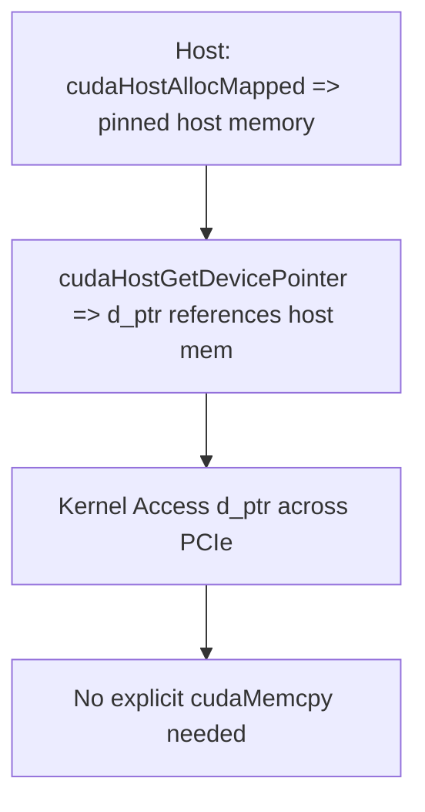

# Day 43: Efficient Data Transfers & Zero-Copy

**Objective:**  
Explore **zero-copy** data transfers in CUDA, which involve mapping **host memory** into the device’s address space so the GPU can directly read/write host memory without explicit device allocations. We compare **zero-copy** with **pinned (page-locked) memory** to understand their overheads and practical use cases. However, using zero-copy incorrectly or for large data sets can degrade performance if the PCIe bus becomes a bottleneck.

**Key Reference**:  
- [CUDA C Programming Guide – “Zero-Copy” Mapped Host Memory](https://docs.nvidia.com/cuda/cuda-c-programming-guide/index.html#zero-copy)

---

## Table of Contents

1. [Overview](#1-overview)  
2. [What is Zero-Copy Memory?](#2-what-is-zero-copy-memory)  
3. [Comparing Zero-Copy vs. Pinned Memory](#3-comparing-zero-copy-vs-pinned-memory)  
4. [Practical Example: Mapping Host Memory into Device Space](#4-practical-example-mapping-host-memory-into-device-space)  
   - [a) Code Snippet](#a-code-snippet)  
   - [b) Measuring Overheads & Observing Performance](#b-measuring-overheads--observing-performance)  
5. [Common Pitfalls & Best Practices](#5-common-pitfalls--best-practices)  
6. [Conceptual Diagrams](#6-conceptual-diagrams)  
7. [References & Further Reading](#7-references--further-reading)  
8. [Conclusion](#8-conclusion)  
9. [Next Steps](#9-next-steps)

---

## 1. Overview

Traditional CUDA memory transfers rely on **explicit copies** between host (CPU) and device (GPU) using pinned or pageable memory. **Zero-copy** is a feature where the GPU can directly access host memory through the PCIe bus without copying. This can eliminate explicit `cudaMemcpy` calls for certain operations but often provides **lower bandwidth** than pinned memory or device memory. It may be beneficial for small or infrequent accesses, or in scenarios where minimal data is transferred.

**However**:
- Large or frequent accesses typically suffer from **PCIe bandwidth** or latency constraints, leading to worse performance than pinned memory transfers.

---

## 2. What is Zero-Copy Memory?

- **Definition**: Zero-copy allows mapping a page-locked host buffer into the GPU’s address space so the GPU references it directly.  
- **How**: By calling `cudaHostAlloc(..., cudaHostAllocMapped)` or `cudaHostRegister(..., cudaHostRegisterMapped)`, then obtaining a device pointer via `cudaHostGetDevicePointer()`.  
- **Usage**: The kernel can read/write that pointer as if it were device memory.  
- **Memory** still physically resides on the **host**; each access goes across the PCIe bus.

**Advantages**:
- Eliminates explicit `cudaMemcpy()` for small data or message passing.  
- Potentially simpler code if you often write/read small host buffers from the GPU.

**Disadvantages**:
- Typically **lower throughput** than pinned memory copies for large data.  
- Over-using zero-copy for big arrays can saturate PCIe.

---

## 3. Comparing Zero-Copy vs. Pinned Memory

| **Aspect**                | **Zero-Copy**                    | **Pinned (Page-Locked)**                               |
|---------------------------|----------------------------------|---------------------------------------------------------|
| **Setup**                 | `cudaHostAllocMapped` or `HostRegisterMapped`; map to device pointer. | `cudaMallocHost()` or `HostAlloc(); pinned => explicit copy to device memory. |
| **Access**                | GPU loads/stores across PCIe bus in real-time. | GPU loads from device memory after `cudaMemcpy()`.     |
| **Perf for Large Data**   | Usually slower due to PCIe overhead.           | Typically faster since GPU uses local device memory.    |
| **Good For**              | Small data or asynchronous fetch.              | Frequent large transfers, concurrency with pinned buffers. |

---

## 4. Practical Example: Mapping Host Memory into Device Space

### a) Code Snippet

```cpp
/**** day43_ZeroCopyExample.cu ****/
#include <cuda_runtime.h>
#include <stdio.h>
#include <stdlib.h>

__global__ void zeroCopyKernel(const float *arr, float *out, int N) {
    int idx = blockIdx.x * blockDim.x + threadIdx.x;
    if (idx < N) {
        // simple operation (e.g., scaling)
        out[idx] = arr[idx] * 2.0f;
    }
}

int main() {
    int N=1<<20;
    size_t size = N*sizeof(float);

    // 1) Allocate host memory with zero-copy
    float *h_in=NULL, *h_out=NULL;
    cudaHostAlloc((void**)&h_in, size, cudaHostAllocMapped);
    cudaHostAlloc((void**)&h_out, size, cudaHostAllocMapped);

    // 2) Initialize h_in
    for(int i=0; i<N; i++){
        h_in[i] = (float)(rand()%100);
        h_out[i] = 0.0f;
    }

    // 3) Get device pointers for them
    float *d_in, *d_out;
    cudaHostGetDevicePointer((void**)&d_in, (void*)h_in, 0);
    cudaHostGetDevicePointer((void**)&d_out, (void*)h_out, 0);

    // 4) Launch kernel that directly accesses host memory
    int threads=256;
    int blocks=(N+threads-1)/threads;
    zeroCopyKernel<<<blocks, threads>>>(d_in, d_out, N);
    cudaDeviceSynchronize();

    // 5) Now h_out should contain the results (no explicit memcpy)
    printf("h_out[0]= %f\n", h_out[0]);

    // Cleanup
    cudaFreeHost(h_in);
    cudaFreeHost(h_out);
    return 0;
}
```

**Explanation**:  
- `cudaHostAllocMapped` with `cudaHostGetDevicePointer()` yields a pointer `d_in` referencing pinned host memory. The kernel’s memory accesses go across PCIe to read/write.  
- For large arrays, expect slower performance than transferring to device memory. But it eliminates explicit `cudaMemcpy()` calls.

### b) Measuring Overheads & Observing Performance

- Test with `N=1<<20` (1 million elements). Compare:
  1. **Zero-copy** approach vs. 
  2. **Pinned + device memory copy** approach.  
- Typically, pinned+device memory is faster for big data. Zero-copy might suffice for small or infrequent data uses.

---

## 5. Common Pitfalls & Best Practices

1. **Over-Using Zero-Copy**  
   - Large arrays or frequent random accesses saturate PCIe => performance drops.  
2. **Misinterpretation**  
   - Zero-copy is not “magic;” it can reduce code complexity for small ephemeral data but typically not the best for heavy workloads.  
3. **Host Memory Must be Pinned**  
   - `cudaHostAlloc(...)` or `cudaHostRegister(...)` => pinned region. Otherwise, zero-copy isn’t valid.  
4. **Measure**  
   - Always measure performance. Some HPC use cases see huge slowdowns with zero-copy.

---

## 6. Conceptual Diagrams

### Diagram 1: Zero-Copy Flow



---

## 7. References & Further Reading

1. **CUDA C Programming Guide – “Zero-Copy”**  
   [Documentation Link](https://docs.nvidia.com/cuda/cuda-c-programming-guide/index.html#zero-copy)
2. **NVIDIA Developer Blog**  
   Articles discussing zero-copy usage vs pinned memory for small data sets.
3. **“Programming Massively Parallel Processors” by Kirk & Hwu**  
   Advanced memory usage patterns coverage.

---

## 8. Conclusion

**Day 43** focuses on **Efficient Data Transfers & Zero-Copy**:
- **Zero-copy**: GPU directly accesses pinned host memory across the PCIe bus.
- **Advantages**: Eliminates explicit copies, beneficial for small or rarely accessed data.
- **Drawbacks**: Slower for large data. Overusing leads to poor performance if the GPU is waiting on PCIe.
- **Compare**: Usually pinned memory + device memory yields higher bandwidth for large data; zero-copy is more specialized.

**Takeaway**: Zero-copy can simplify code for small host buffers or minimal data exchanges but is generally not best for large data throughput. Always benchmark to confirm benefits.

---

## 9. Next Steps

- **Benchmark** small vs. large data with zero-copy. Evaluate overhead.  
- **Profile** with Nsight Systems to see if PCIe traffic saturates the bus.  
- **Check** if pinned memory + explicit device memory copies is faster for bigger payloads.  
- **Extend**: If you frequently read small control data from the host in your kernel, zero-copy might be handy. Otherwise, prefer standard pinned memory transfers.  
```
