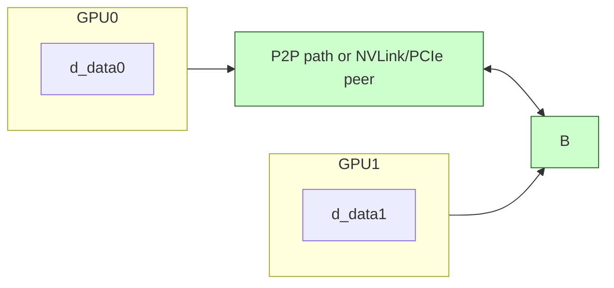

# Day 46: Peer-to-Peer Communication (Multi-GPU)

**Objective:**  
Learn how to enable **Peer-to-Peer (P2P)** access between multiple GPUs on the same system, allowing one GPU to read/write data located in another GPU’s memory without routing through the host. This direct data transfer can significantly reduce overhead if the GPUs are P2P-compatible and share a high-speed interconnect (like NVLink or PCIe with direct peer support). However, **GPU compatibility issues** can block P2P if the GPUs do not support such direct peer access or are located on different PCIe segments.

**Key Reference**:  
- [CUDA C Programming Guide – “Peer-to-Peer Memory Access”](https://docs.nvidia.com/cuda/cuda-c-programming-guide/index.html#peer-to-peer-memory-access)

---

## Table of Contents

1. [Overview](#1-overview)  
2. [What Is Peer-to-Peer (P2P) Communication?](#2-what-is-peer-to-peer-p2p-communication)  
3. [P2P Requirements & Checking Compatibility](#3-p2p-requirements--checking-compatibility)  
4. [Enabling P2P in Practice](#4-enabling-p2p-in-practice)  
   - [a) Example Code Snippet](#a-example-code-snippet)  
   - [b) Observing Direct GPU-GPU Copies](#b-observing-direct-gpu-gpu-copies)  
5. [Conceptual Diagrams](#5-conceptual-diagrams)  
6. [Common Pitfalls & Best Practices](#6-common-pitfalls--best-practices)  
7. [References & Further Reading](#7-references--further-reading)  
8. [Conclusion](#8-conclusion)  
9. [Next Steps](#9-next-steps)

---

## 1. Overview

On multi-GPU systems, data often must be **moved between GPUs**. Without P2P, the data typically travels through host memory. With **peer-to-peer** enabled, GPUs can directly access each other’s memory if supported, drastically reducing latency and overhead.  

**However**:
- Not all GPU pairs are **P2P-compatible**. On some systems or older GPUs, direct peer access isn’t possible.
- Even if supported, large data transfers should be tested to confirm actual performance benefits.  
- We typically call `cudaDeviceEnablePeerAccess()` from the host.

---

## 2. What Is Peer-to-Peer (P2P) Communication?

- **Definition**: P2P memory access means GPU A can read/write GPU B’s global memory directly over the GPU interconnect (NVLink or PCIe peer pathway).  
- **Host Bypass**: No need to copy from GPU A -> host -> GPU B. Instead, GPU A kernel can run with a pointer referencing GPU B’s memory or use `cudaMemcpyPeerAsync()` between device IDs.  
- **Conditions**:
  - GPUs must reside in the same “peer group” or have a direct interconnect.  
  - The system must have no OS or driver restrictions that disable P2P.

---

## 3. P2P Requirements & Checking Compatibility

- **Hardware**: GPU architecture that supports UVA (Unified Virtual Addressing) and P2P bridging.  
- **System**: Must have a single root complex or multi-root if NVLink bridging is present.  
- **API**:
  1. `cudaDeviceCanAccessPeer(&canAccess, devA, devB)`.  
  2. If `canAccess`, call `cudaSetDevice(devA)` then `cudaDeviceEnablePeerAccess(devB, 0)`.  
  3. Possibly do the reverse (`cudaSetDevice(devB)` => `cudaDeviceEnablePeerAccess(devA, 0)`) for bidirectional.  

If either step fails, that means the pair is not P2P-compatible.

---

## 4. Enabling P2P in Practice

### a) Example Code Snippet

```cpp
/**** day46_P2PExample.cu ****/
#include <cuda_runtime.h>
#include <stdio.h>

int main(){
    int devCount;
    cudaGetDeviceCount(&devCount);
    if(devCount<2){
        printf("Need at least 2 GPUs for P2P example!\n");
        return 0;
    }

    // Check if dev0 can access dev1
    int canAccess01=0, canAccess10=0;
    cudaDeviceCanAccessPeer(&canAccess01, 0, 1);
    cudaDeviceCanAccessPeer(&canAccess10, 1, 0);

    printf("canAccess01=%d, canAccess10=%d\n", canAccess01, canAccess10);

    if(canAccess01 && canAccess10){
        // Enable peer access
        cudaSetDevice(0);
        cudaDeviceEnablePeerAccess(1, 0);

        cudaSetDevice(1);
        cudaDeviceEnablePeerAccess(0, 0);
        // Now dev0 & dev1 can do direct reads/writes or use cudaMemcpyPeer

        // Example: allocate on dev0, copy to dev1
        cudaSetDevice(0);
        float *d_data0; 
        cudaMalloc(&d_data0, 100*sizeof(float));
        // fill data on dev0
        // do direct copy from dev0 memory to dev1 memory
        cudaSetDevice(1);
        float *d_data1;
        cudaMalloc(&d_data1, 100*sizeof(float));

        // Peer copy
        cudaMemcpyPeer(d_data1, 1, d_data0, 0, 100*sizeof(float));

        // Alternatively, kernel on dev1 can read d_data0 pointers if we pass them carefully

        printf("P2P enabled between dev0 & dev1. \n");
    } else {
        printf("Peer access not available between dev0 & dev1.\n");
    }
    return 0;
}
```

**Explanation**:  
- We assume at least 2 GPUs.  
- We check if device 0 can access device 1, and vice versa. If yes, we enable peer access from each side.  
- Then we do a direct `cudaMemcpyPeer(...)` from dev0 memory to dev1 memory, bypassing the host.

### b) Observing Direct GPU-GPU Copies

- If your GPUs are P2P-compatible, `cudaMemcpyPeer()` or a kernel on dev1 referencing dev0’s pointer remains on the GPU bus, never hitting host memory.  
- Tools like Nsight Systems can confirm if transfers are GPU↔GPU vs. GPU↔Host↔GPU.

---

## 5. Conceptual Diagrams

### Diagram 1: Peer-to-Peer Setup Flow

```mermaid
flowchart TD
    A[cudaDeviceCanAccessPeer(&canAccess, devA, devB)] --> B[Enable Peer Access if canAccess=1 => cudaDeviceEnablePeerAccess(devB,0)]
    B --> C[Now devA can directly read devB memory or call cudaMemcpyPeer]
```

---

### Diagram 2: GPU↔GPU Communication Paths



**Explanation**:  
- The “peer path” can be direct if supported by hardware. Otherwise, fallback is GPU0→Host→GPU1.

---

## 6. Common Pitfalls & Best Practices

1. **Incompatible GPUs**  
   - Even if you have multiple GPUs, they might not be in the same root complex or support direct P2P. `cudaDeviceCanAccessPeer` can fail.  
2. **Must Enable Peer Access**  
   - By default, even if `canAccessPeer=1`, you still must call `cudaDeviceEnablePeerAccess(...)` from each device that needs direct access.  
3. **2-Way or 1-Way**  
   - If you need both directions, do both: `cudaSetDevice(A), cudaDeviceEnablePeerAccess(B)`, and vice versa.  
4. **Performance Gains**  
   - P2P might drastically reduce overhead for frequent GPU↔GPU transfers, but large data sets must be tested; if bus is saturated, might not see big improvement.  
5. **Memory Allocation**  
   - If dev1 is to read dev0’s pointer directly, dev0’s pointer must be allocated in standard device memory. Some advanced pointer passing also requires UVA (Unified Virtual Addressing) to be enabled by default on modern systems.

---

## 7. References & Further Reading

1. **CUDA C Programming Guide – Peer-to-Peer Memory Access**  
   [Documentation Link](https://docs.nvidia.com/cuda/cuda-c-programming-guide/index.html#peer-to-peer-memory-access)  
2. **NVIDIA Developer Blog** – Articles about multi-GPU communication patterns, NVLink usage, etc.  
3. **“Programming Massively Parallel Processors” by Kirk & Hwu** – Multi-GPU and advanced HPC sections.

---

## 8. Conclusion

**Day 46** covered **Peer-to-Peer Communication (Multi-GPU)**:
- **What**: Direct GPU↔GPU data movement without host involvement, if hardware supports it.  
- **API**: `cudaDeviceCanAccessPeer` + `cudaDeviceEnablePeerAccess` + `cudaMemcpyPeer` or direct pointer usage.  
- **Benefits**: Potentially lower latency, higher throughput, especially if GPUs are connected by NVLink.  
- **Caveats**: Not all GPU combos are P2P-compatible; enabling peer access incorrectly or for large data sets might saturate the interconnect. Must measure real performance gains.

**Key Takeaway**:  
Multi-GPU HPC code can exploit P2P for direct data exchange, but ensure your GPUs support it, and watch for PCIe or NVLink constraints.

---

## 9. Next Steps

1. **Check** your system’s GPU arrangement (`nvidia-smi topo -m`) to see if GPUs are connected by NVLink or same PCIe root complex.  
2. **Benchmark**: Compare P2P transfer times vs. host-staged transfers for various data sizes.  
3. **Integrate**: If doing multi-GPU algorithms (like multi-GPU domain decomposition), pass pointers or do `cudaMemcpyPeerAsync()` for direct GPU↔GPU transfers.  
4. **Profile** concurrency if both GPUs do computations concurrently and share data via P2P.
```
