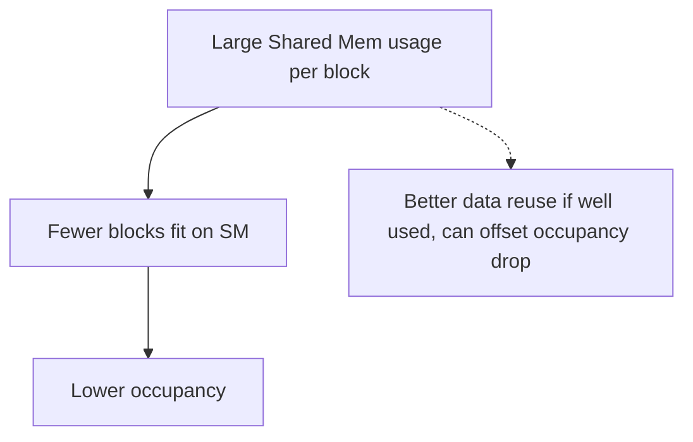
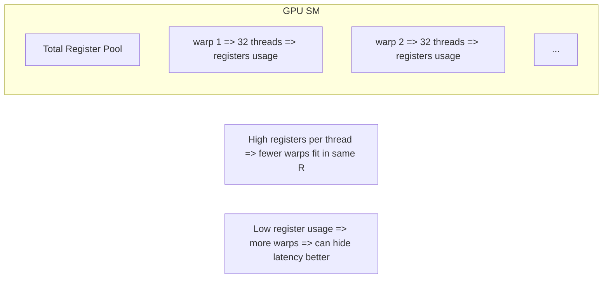

# Day 48: Memory Footprint Optimization

**Objective:**  
Learn to **reduce shared memory** or **register usage** in CUDA kernels to optimize the **memory footprint**. A smaller memory footprint can improve **occupancy** (more threads/blocks running concurrently) and reduce resource contention. However, if you reduce memory usage too aggressively, you might lose beneficial caching or data reuse. In this lesson, we’ll explore balancing memory usage with concurrency, measuring occupancy, and applying best practices from the CUDA C Best Practices Guide on **“Memory & Register Optimization.”**

**Key References**:  
- [CUDA C Best Practices Guide – “Memory & Register Optimization”](https://docs.nvidia.com/cuda/cuda-c-best-practices-guide/index.html#memory-and-register-optimizations)  
- [NVIDIA Nsight Compute](https://docs.nvidia.com/nsight-compute/) for analyzing register usage and shared memory usage  
- [Occupancy Calculator or Nsight Systems](https://docs.nvidia.com/nsight-systems/) for concurrency & occupancy insights  

---

## Table of Contents

1. [Overview](#1-overview)  
2. [Why Memory Footprint Matters](#2-why-memory-footprint-matters)  
3. [Strategies to Reduce Shared Memory Usage](#3-strategies-to-reduce-shared-memory-usage)  
4. [Minimizing Register Usage & Launch Bounds](#4-minimizing-register-usage--launch-bounds)  
5. [Practical Example: Tiling Optimization](#5-practical-example-tiling-optimization)  
   - [a) Code Snippet & Comments](#a-code-snippet--comments)  
   - [b) Measuring Occupancy & Performance](#b-measuring-occupancy--performance)  
6. [Conceptual Diagrams](#6-conceptual-diagrams)  
7. [Common Pitfalls & Best Practices](#7-common-pitfalls--best-practices)  
8. [References & Further Reading](#8-references--further-reading)  
9. [Conclusion](#9-conclusion)  
10. [Next Steps](#10-next-steps)

---

## 1. Overview

In CUDA, each thread block uses a portion of the GPU’s **register file** and **shared memory**. If a kernel uses many registers or a large shared memory buffer per block, fewer blocks can coexist on an SM, **reducing occupancy** and potentially performance. Conversely, using too few registers or not enough shared memory for caching can degrade performance if the kernel is compute- or memory-intensive.

**Goal**: Find a sweet spot between using enough local/shared memory for data reuse and not consuming so many resources that occupancy or concurrency is severely limited.

---

## 2. Why Memory Footprint Matters

- **Shared Memory**: On many GPUs, each SM has a limited shared memory capacity (e.g., 48 KB, 96 KB, or up to 160 KB on newer architectures if configured). A kernel using a large chunk of shared memory per block can limit the number of concurrent blocks.  
- **Registers**: Each SM also has a finite register pool (e.g., 64K or 256K registers depending on architecture). If each thread uses many registers, fewer threads (and blocks) can be scheduled, potentially reducing occupancy.  
- **Occupancy**: The ratio of active warps to the maximum warps on an SM. Higher occupancy often helps hide latency, but it’s not the sole determinant of performance. Still, extremely low occupancy due to memory usage can hamper throughput.

---

## 3. Strategies to Reduce Shared Memory Usage

1. **Use Shared Memory Only Where Necessary**  
   - If partial data reuse can be handled by warp shuffle or register-level passing, avoid large shared memory arrays.  
2. **Tile Size Adjustments**  
   - For example, in a matrix multiplication kernel, smaller tile sizes reduce shared memory usage, allowing more blocks to run concurrently.  
3. **Bank Conflicts**  
   - If rewriting data in a certain layout can reduce shared memory usage and conflicts, it might speed up or reduce the need for large arrays.  
4. **Block vs. Warp Approaches**  
   - Sometimes warp shuffle intrinsics can replace block-level shared memory for partial sums or transposes.

---

## 4. Minimizing Register Usage & Launch Bounds

1. **Code Refactoring**  
   - Merge or inline code carefully to avoid extra registers. Conversely, inlining might *increase* register usage in some cases.  
2. **Use `__launch_bounds__()`**  
   - For example, `__launch_bounds__(128,2)` can guide the compiler to use fewer registers per thread if you want 2 blocks per SM.  
3. **NVCC Flags**  
   - `-maxrregcount=N` sets a max register usage. You can test multiple values to see if occupancy improves.  
4. **Data Types**  
   - If 64-bit variables aren’t strictly needed, use 32-bit floats or `int` to reduce register consumption.

---

## 5. Practical Example: Tiling Optimization

Let’s illustrate how reducing **shared memory tile size** in a naive matrix multiplication can improve occupancy for certain problem sizes, without drastically harming performance (or even speeding it up if the original tile was overkill).

### a) Code Snippet & Comments

```cpp
/**** day48_MemFootprintOpt.cu ****/
// We'll show a naive matmul with a configurable tile size in shared memory. 
// We'll measure occupancy & performance to find a sweet spot.

#include <cuda_runtime.h>
#include <stdio.h>
#include <stdlib.h>

#define TILE_DIM 16 // can try 16 vs 32 to see memory usage differences

__global__ void matMulKernel(const float *A, const float *B, float *C, int N) {
    __shared__ float sA[TILE_DIM][TILE_DIM];  // reduce tile size => reduce shared memory
    __shared__ float sB[TILE_DIM][TILE_DIM];

    int row= blockIdx.y*TILE_DIM + threadIdx.y;
    int col= blockIdx.x*TILE_DIM + threadIdx.x;
    float val=0.0f;

    // Loop over sub-tiles
    for(int k=0; k<N/TILE_DIM; k++){
        // load sub-tile
        int aRow= row, aCol= k*TILE_DIM + threadIdx.x;
        if(aRow<N && aCol<N)
            sA[threadIdx.y][threadIdx.x] = A[aRow*N + aCol];
        else
            sA[threadIdx.y][threadIdx.x]= 0.0f;

        int bRow= k*TILE_DIM + threadIdx.y, bCol= col;
        if(bRow<N && bCol<N)
            sB[threadIdx.y][threadIdx.x] = B[bRow*N + bCol];
        else
            sB[threadIdx.y][threadIdx.x]=0.0f;
        __syncthreads();

        // compute partial sum
        for(int n=0; n<TILE_DIM; n++){
            val += sA[threadIdx.y][n]* sB[n][threadIdx.x];
        }
        __syncthreads();
    }

    // write result if in range
    if(row<N && col<N){
        C[row*N + col]= val;
    }
}

int main(){
    int N=1024; // matrix NxN
    size_t size= N*N*sizeof(float);
    float *h_A=(float*)malloc(size);
    float *h_B=(float*)malloc(size);
    float *h_C=(float*)malloc(size);

    // init
    for(int i=0;i<N*N;i++){
        h_A[i]= (float)(rand()%5);
        h_B[i]= (float)(rand()%5);
    }

    float *d_A,*d_B,*d_C;
    cudaMalloc(&d_A,size);
    cudaMalloc(&d_B,size);
    cudaMalloc(&d_C,size);
    cudaMemcpy(d_A,h_A,size,cudaMemcpyHostToDevice);
    cudaMemcpy(d_B,h_B,size,cudaMemcpyHostToDevice);

    dim3 block(TILE_DIM,TILE_DIM);
    dim3 grid((N+TILE_DIM-1)/TILE_DIM, (N+TILE_DIM-1)/TILE_DIM);

    // measure occupancy, or just run. Try changing TILE_DIM=16 vs 32 => see shared memory usage
    matMulKernel<<<grid, block>>>(d_A,d_B,d_C,N);
    cudaDeviceSynchronize();

    cudaMemcpy(h_C,d_C,size,cudaMemcpyDeviceToHost);
    // check partial
    printf("C[0]=%f, C[end]=%f\n",h_C[0],h_C[N*N-1]);

    free(h_A);free(h_B);free(h_C);
    cudaFree(d_A); cudaFree(d_B);cudaFree(d_C);
    return 0;
}
```

**Explanation**:  
- Tiling with `TILE_DIM=16` uses `(16*16)*sizeof(float) * 2` in shared memory (for sA and sB), ~2 KB per block. If you used `TILE_DIM=32`, that’s 8 KB per block.  
- On some GPUs, smaller tile => more blocks can fit, improving occupancy. But might also reduce reuse or performance if the tile is too small.

### b) Measuring Occupancy & Performance

- Use the **Occupancy Calculator** or `nsys` to see how many blocks per SM can run with `TILE_DIM=16` vs. 32.  
- Compare kernel execution times. If smaller tile still saturates memory bandwidth or compute units, it might yield same or faster speed with higher concurrency.

---

## 6. Conceptual Diagrams

### Diagram 1: Shared Memory vs. Occupancy



**Explanation**:  
Using large shared memory can hamper concurrency but might benefit local data reuse.

---

### Diagram 2: Register Usage vs. Warps per SM



---

## 7. Common Pitfalls & Best Practices

1. **Excessive Tiling**  
   - Overly large tile dimension => big shared memory => occupancy drop. Must measure.  
2. **Over-limiting Registers**  
   - Setting `-maxrregcount` too low might degrade performance if code becomes arithmetic-bound.  
3. **Ignoring Real Bottlenecks**  
   - If kernel is memory-bound from global memory, reducing shared memory usage might not help.  
4. **Compile with Different Options**  
   - Compare performance with `nvcc -O3`, `-maxrregcount=32` or other variations.  
5. **Measure Occupancy**  
   - Tools like Nsight Compute or the built-in Occupancy Calculator can show how many blocks/warps can run concurrently.

---

## 8. References & Further Reading

1. **CUDA C Best Practices Guide – “Memory & Register Optimization”**  
   [Best Practices: Memory & Register](https://docs.nvidia.com/cuda/cuda-c-best-practices-guide/index.html#memory-and-register-optimizations)  
2. **NVIDIA Nsight Compute**  
   For analyzing register usage, shared memory usage, warp stalls.  
3. **“Programming Massively Parallel Processors”** by Kirk & Hwu – covers occupancy & memory usage trade-offs.

---

## 9. Conclusion

**Day 48** focuses on **Memory Footprint Optimization**:
- Reducing **shared memory** usage where possible or adopting smaller tile sizes to allow more blocks concurrency.  
- Minimizing **register usage** via code refactoring, launch bounds, or compiler flags.  
- Checking real performance to see if the occupancy increase offsets any potential caching or data reuse losses.

**Takeaway**:  
Improving occupancy by lowering memory usage can deliver better concurrency if the kernel is latency-limited. But if you reduce shared memory or registers too far, you might hamper local data reuse or require additional global loads. Always **profile** to find the sweet spot.

---

## 10. Next Steps

1. **Experiment**: Toggle tile dimension or shared memory size in a kernel, measure concurrency and runtime.  
2. **Use Tools**: Nsight Compute to see register usage and shared mem usage.  
3. **Refine**: If a kernel is compute-heavy, see if fewer registers can help occupancy without losing too much speed.  
4. **Combine**: With advanced features like warp intrinsics or dynamic parallelism, ensuring memory usage remains balanced for concurrency.
```
