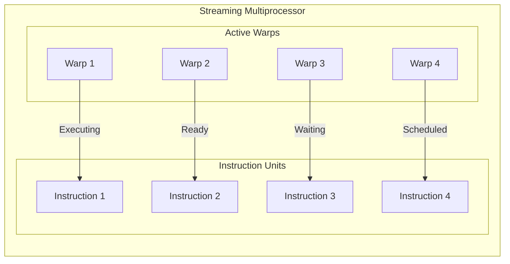
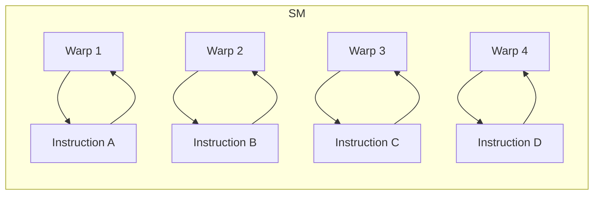

# Day 05: Thread Hierarchy: Warps (Intro)

## Table of Contents
1. [Overview](#1-overview)  
2. [Understanding Warps](#2-understanding-warps)  
    - [a) **Definition and Role**](#a-definition-and-role)  
    - [b) **Warp Scheduling**](#b-warp-scheduling)  
3. [Thread Execution within Warps](#3-thread-execution-within-warps)  
4. [Performance Implications of Warps](#4-performance-implications-of-warps)  
5. [Practical Examples](#5-practical-examples)  
    - [a) **Warp Synchronization Example**](#a-warp-synchronization-example)  
    - [b) **Analyzing Warp Occupancy**](#b-analyzing-warp-occupancy)  
6. [Conceptual Diagrams: Warps](#6-conceptual-diagrams-warps)  
7. [Common Pitfalls](#7-common-pitfalls)  
8. [References & Further Reading](#8-references--further-reading)  
9. [Conclusion](#9-conclusion)  
10. [Next Steps](#10-next-steps)  

---

## 1. Overview
In CUDA programming, **Warps** are the fundamental units of thread execution on NVIDIA GPUs. Understanding how warps operate, how they are scheduled, and their impact on performance is crucial for optimizing CUDA applications. This day’s focus is on introducing **Warps**, exploring their definition and role within the CUDA thread hierarchy, examining warp scheduling mechanisms, and discussing the performance implications associated with warp behavior.

---

## 2. Understanding Warps

Warps are central to the execution model of CUDA-enabled GPUs. They enable efficient parallel processing by grouping threads into manageable units that the GPU hardware can handle effectively.

### a) **Definition and Role**

- **Warp**: A warp is a group of **32 threads** within a block that execute instructions in lockstep on a Streaming Multiprocessor (SM). All threads in a warp execute the same instruction simultaneously, following the Single Instruction, Multiple Threads (SIMT) model.

**Key Points:**
- **Fixed Size**: Each warp consists of exactly 32 threads.
- **Execution Efficiency**: By executing threads in warps, GPUs can efficiently utilize their parallel architecture.
- **SIMT Model**: Warps follow the SIMT execution model, where all threads execute the same instruction but operate on different data.

**Example:**
```cpp
__global__ void warpExampleKernel(float *A, float *B, float *C, int N) {
    int globalIdx = blockIdx.x * blockDim.x + threadIdx.x;
    // Each warp executes the following instructions
    if(globalIdx < N) {
        C[globalIdx] = A[globalIdx] + B[globalIdx];
    }
}
```

### b) **Warp Scheduling**

Warp scheduling determines the order and manner in which warps are executed on an SM. Efficient warp scheduling is vital for maximizing GPU throughput and minimizing idle cycles.

**Key Concepts:**
- **Latency Hiding**: Warps help hide memory latency by switching to other warps when one warp is waiting for data.
- **Concurrent Execution**: Multiple warps can be active on an SM, allowing for concurrent execution and better resource utilization.
- **Scheduling Policies**: Modern NVIDIA GPUs use sophisticated scheduling algorithms to optimize warp execution, such as round-robin or priority-based scheduling.

**Example Diagram: Warp Scheduling**



*Figure 1: Simplified Warp Scheduling within an SM.*

---

## 3. Thread Execution within Warps

Threads within a warp execute instructions in a coordinated manner, adhering to the SIMT model. Understanding this execution pattern is essential for optimizing parallel tasks.

**Key Points:**
- **Lockstep Execution**: All threads in a warp execute the same instruction simultaneously.
- **Divergence Handling**: When threads in a warp follow different execution paths (e.g., due to conditional statements), the warp serially executes each branch, potentially reducing performance.
- **Instruction-Level Parallelism**: Efficient warp execution leverages instruction-level parallelism to maximize throughput.

**Example of Warp Execution with Divergence:**
```cpp
__global__ void divergenceKernel(int *A, int *B, int *C, int N) {
    int idx = blockIdx.x * blockDim.x + threadIdx.x;
    if(idx < N) {
        if(A[idx] > 0) {
            C[idx] = A[idx] + B[idx];
        } else {
            C[idx] = A[idx] - B[idx];
        }
    }
}
```

*In this example, if some threads in a warp take the `if` branch while others take the `else` branch, the warp will execute both branches serially, leading to performance degradation.*

---

## 4. Performance Implications of Warps

Warps significantly influence the performance characteristics of CUDA applications. Proper management and understanding of warp behavior can lead to substantial performance gains.

### a) **Latency Hiding**

- **Concept**: Warps allow the GPU to switch between different warps when one warp is stalled (e.g., waiting for memory access), thereby hiding latency and maintaining high utilization.
- **Benefit**: Improves overall throughput by ensuring that the GPU's execution units remain busy.

### b) **Warp Divergence**

- **Issue**: When threads within a warp diverge in their execution paths, the warp must serially execute each divergent path, reducing parallel efficiency.
- **Mitigation**:
    - **Minimize Branching**: Design kernels to minimize conditional statements within warps.
    - **Data Reorganization**: Structure data to reduce the likelihood of divergence.
    - **Predication**: Use predicated instructions to handle conditional operations without causing divergence.

**Example of Avoiding Warp Divergence:**
```cpp
__global__ void noDivergenceKernel(float *A, float *B, float *C, int N) {
    int idx = blockIdx.x * blockDim.x + threadIdx.x;
    if(idx < N) {
        float a = A[idx];
        float b = B[idx];
        // Use mathematical operations to avoid branching
        C[idx] = a * (a > 0 ? 1.0f : -1.0f) + b;
    }
}
```

### c) **Occupancy and Resource Utilization**

- **Occupancy**: Refers to the ratio of active warps to the maximum number of warps supported on an SM.
- **Impact**: Higher occupancy can lead to better latency hiding and improved performance, but it's not the sole determinant of performance.
- **Balancing Resources**: Optimize the number of threads and blocks to maximize occupancy without exceeding resource limits (e.g., registers, shared memory).

---

## 5. Practical Examples

### a) **Warp Synchronization Example**

**Objective**: Demonstrate the use of `__syncthreads()` within a warp to synchronize thread execution.

```cpp
__global__ void warpSyncKernel(float *A, float *B, float *C, int N) {
    __shared__ float sharedA[32];
    __shared__ float sharedB[32];
    
    int idx = blockIdx.x * blockDim.x + threadIdx.x;
    int warpIdx = threadIdx.x % 32;
    
    if(idx < N) {
        sharedA[warpIdx] = A[idx];
        sharedB[warpIdx] = B[idx];
        __syncthreads(); // Synchronize within the block
        
        C[idx] = sharedA[warpIdx] + sharedB[warpIdx];
    }
}
```

**Explanation:**
- **Shared Memory**: Allocates shared memory for storing intermediate data.
- **Synchronization**: `__syncthreads()` ensures all threads have loaded their data into shared memory before performing the addition.
- **Warp-Specific Operations**: Operates within a warp by using `warpIdx`.

### b) **Analyzing Warp Occupancy**

**Objective**: Understand how different block sizes affect warp occupancy and overall performance.

**Example Analysis:**
- **Block Size 128 (4 Warps per Block)**:
    - **Pros**: Higher occupancy, better resource utilization.
    - **Cons**: May lead to increased shared memory usage per block.
- **Block Size 64 (2 Warps per Block)**:
    - **Pros**: Lower shared memory usage, less resource contention.
    - **Cons**: Lower occupancy, potential underutilization of SM resources.

**Conclusion:**
Choosing the optimal block size requires balancing occupancy with resource constraints. Profiling tools like NVIDIA Nsight can help determine the best configuration for specific applications.

---

## 6. Conceptual Diagrams: Warps

### a) **CUDA Warp Structure Diagram**

```mermaid
graph TB
    subgraph Warp
        T1[Thread 1]
        T2[Thread 2]
        T3[Thread 3]
        T4[Thread 4]
        T5[Thread 5]
        T6[Thread 6]
        T7[Thread 7]
        T8[Thread 8]
        T9[Thread 9]
        T10[Thread 10]
        T11[Thread 11]
        T12[Thread 12]
        T13[Thread 13]
        T14[Thread 14]
        T15[Thread 15]
        T16[Thread 16]
        T17[Thread 17]
        T18[Thread 18]
        T19[Thread 19]
        T20[Thread 20]
        T21[Thread 21]
        T22[Thread 22]
        T23[Thread 23]
        T24[Thread 24]
        T25[Thread 25]
        T26[Thread 26]
        T27[Thread 27]
        T28[Thread 28]
        T29[Thread 29]
        T30[Thread 30]
        T31[Thread 31]
        T32[Thread 32]
    end
    
    Warp --> SM1[Streaming Multiprocessor 1]
```



*Figure 2: Structure of a Warp consisting of 32 Threads executing on an SM.*

### b) **Warp Scheduling Diagram**



*Figure 3: Simplified Warp Scheduling within an SM.*

---

## 7. Common Pitfalls

1. **Ignoring Warp Divergence**
   - **Issue**: Branching within warps can cause threads to execute serially, reducing parallel efficiency.
   - **Solution**: Minimize conditional statements within warps and design kernels to follow uniform execution paths.
   - **Example**:
     ```cpp
     __global__ void noDivergenceKernel(float *A, float *B, float *C, int N) {
         int idx = blockIdx.x * blockDim.x + threadIdx.x;
         if(idx < N) {
             float a = A[idx];
             float b = B[idx];
             // Use mathematical operations to avoid branching
             C[idx] = a * (a > 0 ? 1.0f : -1.0f) + b;
         }
     }
     ```

2. **Overlooking Occupancy**
   - **Issue**: Low warp occupancy leads to underutilization of GPU resources.
   - **Solution**: Optimize block sizes and resource allocation to maximize occupancy without exceeding hardware limits.
   - **Tip**: Use CUDA occupancy calculators or profiling tools to determine optimal configurations.

3. **Excessive Shared Memory Usage**
   - **Issue**: Allocating too much shared memory per warp/block can limit the number of active warps, reducing occupancy.
   - **Solution**: Optimize shared memory usage and reuse memory where possible.

4. **Assuming All Threads Execute Simultaneously**
   - **Issue**: Overlooking the warp scheduling model can lead to incorrect assumptions about thread execution order.
   - **Solution**: Design kernels with warp scheduling in mind and avoid dependencies across warps.

5. **Improper Thread Indexing**
   - **Issue**: Miscalculating thread indices can result in out-of-bounds memory accesses or incorrect data processing.
   - **Solution**: Always include boundary checks and verify thread indexing logic.

---

## 8. References & Further Reading

1. **[CUDA C Programming Guide – Warps](https://docs.nvidia.com/cuda/cuda-c-programming-guide/index.html#warps)**  
   Official NVIDIA documentation on warps, their structure, and execution model.

2. **[CUDA by Example: An Introduction to General-Purpose GPU Programming](https://developer.nvidia.com/cuda-example-introduction-general-purpose-gpu-programming)** by Jason Sanders and Edward Kandrot  
   A practical guide to CUDA programming with examples and explanations of warps.

3. **[GPU Gems 3 – Chapter on CUDA](https://developer.nvidia.com/gpugems/gpugems3/part-i-cuda/chapter-1-cuda-programming-model)**  
   In-depth exploration of CUDA programming models and warp behavior.

4. **[Parallel Programming in CUDA](https://developer.nvidia.com/blog/even-easier-introduction-cuda/)** – NVIDIA Developer Blog  
   Introductory articles on CUDA parallel programming concepts, including warps.

5. **[CUDA Occupancy Calculator](https://developer.nvidia.com/sites/default/files/akamai/cuda/files/CUDA_Occupancy_Calculator.pdf)**  
   Tool for determining optimal grid and block sizes based on GPU architecture.

6. **[Effective CUDA: Optimizing Memory Access](https://developer.nvidia.com/blog/effective-cuda-optimizing-memory-access/)**  
   Detailed strategies for optimizing memory access patterns in CUDA kernels.

7. **[An Introduction to Parallel Programming with CUDA](https://www.elsevier.com/books/parallel-programming/prentice-hall-curriculum/978-0-12-398270-9)**  
   Educational resources and textbooks on CUDA parallel programming and warp hierarchy.

---

## 9. Conclusion
Understanding **Warps** is pivotal for optimizing CUDA applications. By grasping how warps execute threads in lockstep, how warp scheduling operates, and the implications of warp behavior on performance, you can design more efficient and high-performing CUDA kernels. Avoiding common pitfalls such as warp divergence and optimizing occupancy ensures that your applications make the most of the GPU's parallel architecture.

**Key Takeaways:**
- **Warp Structure**: Warps consist of 32 threads executing in lockstep on an SM.
- **Warp Scheduling**: Efficient scheduling maximizes GPU throughput and hides memory latency.
- **Thread Execution**: Uniform execution within warps enhances parallel efficiency, while divergence can degrade performance.
- **Performance Optimization**: Balancing occupancy and minimizing warp divergence are essential for high-performance CUDA applications.

---

## 10. Next Steps
**In Day 06**, we’ll go deeper into **Memory Management in CUDA**—exploring different types of memory (global, shared, constant, texture), their access patterns, and strategies to optimize memory usage for high-performance CUDA applications. Understanding memory hierarchies and optimizing memory access is critical for maximizing the computational efficiency of your CUDA programs.


---

