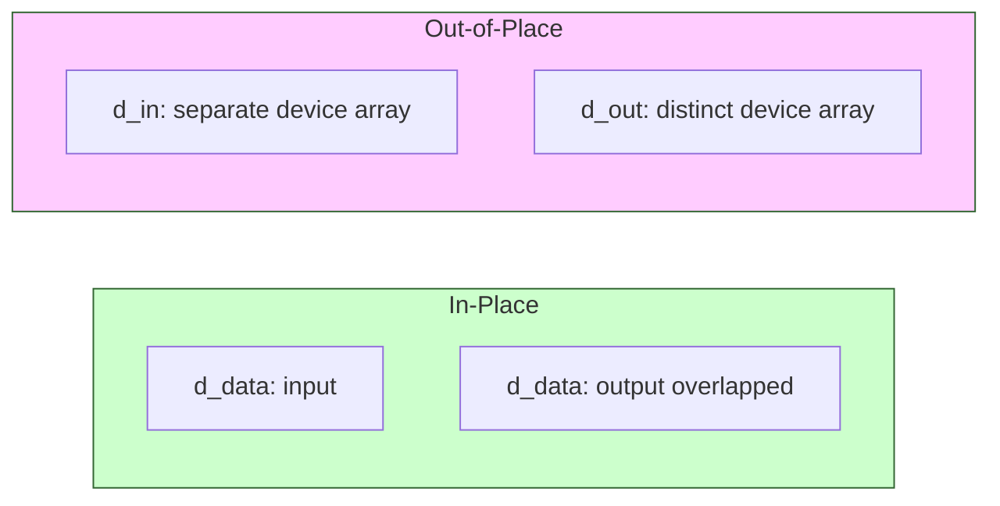
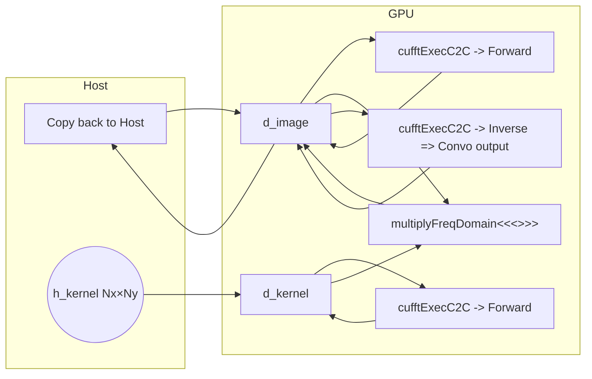

# Day 51: Introduction to cuFFT

**Objective:**  
Learn how to use **cuFFT**, NVIDIA’s FFT library, to perform a **1D Fast Fourier Transform (FFT)** on the GPU. We’ll go step-by-step from allocating device memory, creating a cuFFT plan, executing forward or inverse transforms, and verifying results. We’ll also discuss common pitfalls like ensuring the input size matches expectations (often needing to be a power of 2 or a supported size for some optimizations) and handling padding or in-place transforms carefully.

**Key Reference**:  
- [cuFFT Library User Guide](https://docs.nvidia.com/cuda/cufft/index.html)

---

## Table of Contents

1. [Overview](#1-overview)  
2. [Why Use cuFFT?](#2-why-use-cufft)  
3. [Basic cuFFT Workflow](#3-basic-cufft-workflow)  
4. [Practical Example: Simple 1D FFT](#4-practical-example-simple-1d-fft)  
   - [a) Code Snippet & Comments](#a-code-snippet--comments)  
   - [b) Measuring Performance vs. CPU FFT](#b-measuring-performance-vs-cpu-fft)  
5. [Conceptual Diagrams](#5-conceptual-diagrams)  
   - [Diagram 1: cuFFT Flow for 1D Transform](#diagram-1-cufft-flow-for-1d-transform)  
   - [Diagram 2: In-Place vs. Out-of-Place FFT Memory](#diagram-2-in-place-vs-out-of-place-fft-memory)  
6. [Common Pitfalls & Best Practices](#6-common-pitfalls--best-practices)  
7. [References & Further Reading](#7-references--further-reading)  
8. [Conclusion](#8-conclusion)  
9. [Next Steps](#9-next-steps)

---

## 1. Overview

**FFT** (Fast Fourier Transform) is essential for signal processing, spectral methods, and other HPC tasks. **cuFFT** provides GPU-accelerated FFT routines for 1D, 2D, and 3D transforms in single/double precision, and even half precision for some expansions. By leveraging the GPU’s parallel nature, cuFFT can outperform CPU-based FFT libraries (like FFTW) for large data sets, **provided** you keep data on the device to avoid repeated transfers.

---

## 2. Why Use cuFFT?

1. **Performance**:  
   - For large transforms, GPU-based FFT can be significantly faster than CPU-based if your GPU is well-utilized.  
2. **Ease of Use**:  
   - The library handles the complexities of parallel FFT algorithms, you just create a plan and execute.  
3. **1D, 2D, 3D** Support:  
   - You can do batched FFTs, multiple transform sets in a single call.

**Potential Drawback**:  
- If your data is small or you frequently move data CPU↔GPU around each transform, overhead might overshadow GPU speed.  
- Some advanced features (like non-power-of-2 sizes) may have performance variations.

---

## 3. Basic cuFFT Workflow

1. **Include** `#include <cufft.h>`.  
2. **Plan Creation**: `cufftPlan1d(&plan, size, CUFFT_C2C, batchCount)` for complex data, or `cufftPlan1d(&plan, size, CUFFT_R2C, 1)` for real-to-complex, etc.  
3. **Set Data** in device arrays.  
4. **Execute**: `cufftExecC2C(plan, data_in, data_out, CUFFT_FORWARD or CUFFT_INVERSE)`.  
5. **Cleanup**: `cufftDestroy(plan)`.

**In-place** or **out-of-place** transforms are possible, but you must match plan usage.

---

## 4. Practical Example: Simple 1D FFT

In this example, we create a **complex** 1D input array (size `N`), do a **forward FFT**, and optionally do an **inverse FFT** to see if we get back original data (within floating-point error).

### a) Code Snippet & Comments

```cpp
/**** day51_cuFFT_1DExample.cu ****/
#include <cstdio>
#include <cstdlib>
#include <cmath>
#include <cuda_runtime.h>
#include <cufft.h>

// We'll do a complex 1D transform: CUFFT_C2C
// N must be appropriate for demonstration (like 1024) for good performance

int main(){
    int N = 1024; // A power-of-2 size. 
    size_t memSize = N * sizeof(cufftComplex);

    // Host arrays (for demonstration)
    cufftComplex *h_in = (cufftComplex*)malloc(memSize);
    cufftComplex *h_out= (cufftComplex*)malloc(memSize);

    // Initialize some signal in h_in
    for(int i=0; i<N; i++){
        float realVal = (float)(rand()%10);
        float imagVal = 0.0f; // e.g. purely real input
        h_in[i].x = realVal;
        h_in[i].y = imagVal;
    }

    // Device arrays
    cufftComplex *d_data;
    cudaMalloc((void**)&d_data, memSize);
    cudaMemcpy(d_data, h_in, memSize, cudaMemcpyHostToDevice);

    // Create cuFFT plan
    cufftHandle plan;
    cufftResult status;
    status = cufftPlan1d(&plan, N, CUFFT_C2C, 1);  // single batch, c2c
    if(status != CUFFT_SUCCESS){
        fprintf(stderr,"cufftPlan1d failed!\n");
        return -1;
    }

    // Execute forward FFT in-place (d_data -> d_data)
    status = cufftExecC2C(plan, d_data, d_data, CUFFT_FORWARD);
    if(status != CUFFT_SUCCESS){
        fprintf(stderr,"cufftExecC2C forward failed!\n");
        return -1;
    }
    cudaDeviceSynchronize();

    // Optionally do inverse FFT to check reconstruction
    status = cufftExecC2C(plan, d_data, d_data, CUFFT_INVERSE);
    if(status != CUFFT_SUCCESS){
        fprintf(stderr,"cufftExecC2C inverse failed!\n");
        return -1;
    }
    cudaDeviceSynchronize();

    // copy result back
    cudaMemcpy(h_out, d_data, memSize, cudaMemcpyDeviceToHost);

    // For an accurate inverse, each value should be original*N (due to scaling).
    // We can check the first 4
    for(int i=0;i<4;i++){
        printf("After inverse, h_out[%d]= (%f, %f)\n", i, h_out[i].x, h_out[i].y);
    }

    // Cleanup
    cufftDestroy(plan);
    cudaFree(d_data);
    free(h_in); free(h_out);

    return 0;
}
```

**Explanation**:
- We define a **complex array** of size N=1024 in host memory.  
- We do an **in-place** forward transform, then an **inverse** transform to see if we recover the original data (scaled by N).  
- Notice we are not normalizing the inverse result inside cuFFT; if we want the original amplitude, we typically divide by N after the inverse.  
- If the size is not a power of 2, cuFFT still can handle it, but performance might differ.

### b) Measuring Performance vs. CPU FFT

- If you have a CPU-based library (e.g. FFTW), you can compare times for large N (like 1 million elements) to see the GPU advantage.  
- Keep data on the device for multiple transforms if you do repeated processing to reduce overhead.

---

## 5. Conceptual Diagrams

### Diagram 1: cuFFT Flow for 1D Transform

```mermaid
flowchart TD
    A[Host complex data h_in] --> B[Copy to device d_data]
    B --> C[cufftPlan1d(&plan, N, C2C,1)]
    C --> D[cufftExecC2C(plan, d_data, d_data, FORWARD)]
    D --> E[Optional inverse transform => cufftExecC2C(..., INVERSE)]
    E --> F[Copy result d_data->h_out]
    F --> G[cufftDestroy(plan)]
```

**Explanation**:  
We see the standard steps: plan creation, forward transform, optional inverse, copy results back.

### Diagram 2: In-Place vs. Out-of-Place FFT Memory



**Explanation**:  
- In **in-place** mode, the same array is used for input and output.  
- In **out-of-place**, you have distinct arrays; sometimes this yields simpler memory usage or performance differences.

---

## 6. Common Pitfalls & Best Practices

1. **Size Mismatch**  
   - If your array is not the size you declared in `cufftPlan1d()`, results are incorrect or kernel fails.  
2. **Forgetting to Scale**  
   - After inverse FFT, each sample is typically scaled by N if you want the original amplitude. cuFFT doesn’t automatically do that unless you do `cufftSetCompatibilityMode(...)` or manually do it.  
3. **In-Place Constraints**  
   - With certain transform types (like real-to-complex), in-place usage might need specific array length or layout.  
4. **Performance**  
   - Very small N might not gain from GPU. Large N typically sees strong speed-ups.  
5. **Multiple transforms**  
   - If you do a batch of transforms, use `batch` parameter in the plan. This can be more efficient than multiple single transform calls.

---

## 7. References & Further Reading

1. **cuFFT Library User Guide**  
   [cuFFT Docs](https://docs.nvidia.com/cuda/cufft/index.html)  
2. **NVIDIA Developer Blog**  
   - Articles on 2D/3D FFT usage, advanced configurations.  
3. **“Programming Massively Parallel Processors”** – HPC usage of FFT in PDE solves, spectral methods.

---

## 8. Conclusion

**Day 51** focuses on **cuFFT** for GPU-based FFT:

- We introduced the **basic workflow**: create plan, set up device data, call `cufftExecC2C` or real-to-complex routines, then handle results.  
- We illustrated a **1D example** with forward & inverse transforms, discussing in-place usage and scaling.  
- We emphasized watching out for **incorrect sizing** and ensuring your code properly normalizes or sets the right transform directions.  
- For large transforms, **cuFFT** can significantly outperform CPU-based FFT, especially if data remains on the device for multiple steps.

**Key Takeaway**:  
cuFFT is a specialized library for fast GPU-based FFT computations. Ensure correct plan parameters, data sizes, and handle scaling or normalizing if needed.

---

## 9. Next Steps

1. **Try** 2D or 3D FFT for image processing or spectral PDE solves with cuFFT.  
2. **Batch** multiple 1D transforms if your application has many signals.  
3. **Profile** with Nsight Systems or Nsight Compute to see if the kernel times are efficient.  
4. **Combine** cuFFT with other GPU libraries (cuBLAS, cuSPARSE, etc.) for a complete HPC pipeline.
```
```
Below are **more detailed, extended next steps** to help you continue exploring and integrating **cuFFT** into your projects. These steps go beyond the basics covered in the main content for **Day 51** and focus on deeper applications, performance considerations, and combining cuFFT with other GPU libraries in a broader HPC or signal processing workflow.

---

## Extended Next Steps

1. **Integrate 2D and 3D FFT**  
   - Move beyond 1D transforms.  
   - For **image processing** or **volume data**, create a `cufftPlan2d()` or `cufftPlan3d()` plan.  
   - If you have large 2D images (e.g., 4096×4096) or 3D volumes, measure performance improvements vs. CPU-based FFT libraries (e.g., FFTW).  
   - **Check memory usage** to ensure your GPU can handle the data size.

2. **Implement a Batched FFT**  
   - If your application requires many 1D transforms of the same size (e.g., multiple signals or channels), consider using **batched** mode.  
   - Example:  
     ```cpp
     cufftPlan1d(&plan, N, CUFFT_C2C, batchCount);
     ```
     This runs `batchCount` transforms in a single call.  
   - Often more efficient than calling multiple single-FFT calls in a loop.

3. **Combine with cuBLAS or cuSPARSE**  
   - If your workflow includes matrix operations or sparse computations **in addition** to FFT steps, keep data on the **device**.  
   - For instance, do a **FFT -> matrix multiply -> IFFT** pipeline fully on the GPU to reduce overhead.  
   - This approach helps build HPC or signal-processing workflows in a single GPU pipeline, avoiding repeated device-host transfers.

4. **Use Streams & Concurrency**  
   - If you have multiple independent transforms, you can process them in **separate CUDA streams** for concurrency, provided there are enough GPU resources to overlap their execution.  
   - Steps:  
     1. Create separate device pointers for each transform.  
     2. Use `cufftSetStream(plan, streamX);` for each plan if you have multiple plans or transform sets.  
     3. Launch them concurrently, measure concurrency with Nsight Systems to confirm actual overlap.

5. **Measure & Optimize**  
   - Use **Nsight Systems** or **Nsight Compute** to see kernel timings for the cuFFT internal kernels.  
   - If you find a bottleneck, check if your size is non-power-of-two or if significant data transfers hamper performance.  
   - For large problem sizes, cuFFT is typically well-optimized, but you can also investigate specialized libraries if your problem has unique structure.

6. **Real-to-Complex & Complex-to-Real**  
   - If your input data is purely real, switch to **R2C** or **C2R** transforms (like `cufftPlan1d(..., CUFFT_R2C, ...)`) to halve memory usage for storing the imaginary part.  
   - Remember to handle the “Hermitian” format of the output or the symmetrical properties of a real-valued signal’s FFT.

7. **Frequency-Domain Processing**  
   - Many signal or image processing tasks involve applying filters in the **frequency domain** (e.g., multiply the FFT result by a frequency response).  
   - Combine **cuFFT** forward, custom frequency-domain kernel transforms, and then **cuFFT** inverse.  
   - Keep an eye on memory usage (the entire frequency-domain array remains on device), but as long as you stay on the GPU, you can avoid extra overhead.

8. **Check GPU Architecture**  
   - Some older architectures or smaller GPUs might have less performance benefit or memory for large transforms.  
   - On modern GPUs (Ampere, Hopper, etc.), cuFFT can be extremely fast, especially for well-chosen sizes.  

9. **Check for Non-Power-of-2 or Prime Factor**  
   - cuFFT supports arbitrary sizes, but performance may vary if your transform size is prime or otherwise not factor-friendly.  
   - If your domain can be padded to a convenient size (like 2048 or 4096), you might see better throughput.  
   - Evaluate if small padding overhead is worthwhile for the performance gain from more friendly FFT sizes.

10. **Explore 2D Convolution via FFT**  
   - Commonly, 2D convolution can be done by **FFT** of the signal and the kernel, multiply in the frequency domain, then inverse FFT.  
   - This can outperform direct convolution for large kernels.  
   - Keep an eye on zero-padding to avoid wrap-around artifacts.

---

## Putting It All Together

A typical advanced HPC or signal processing pipeline might look like:

1. **Load/Generate Data** on CPU.  
2. **Allocate** device arrays for input signals/images and results.  
3. **Copy** input to GPU once.  
4. **Create** cuFFT plan(s), optionally in multiple streams or for batched transforms.  
5. **Execute** forward FFT, do frequency-domain operations (maybe using warp intrinsics, cuBLAS, or custom kernels).  
6. **Execute** inverse FFT, store results in device memory.  
7. **Copy** final results to host if needed.  
8. **Destroy** cuFFT plans.  

By focusing on a single device-resident data pipeline and carefully selecting transform sizes, you can harness **cuFFT** for large-scale FFT tasks efficiently. These “_next steps_” solidify your understanding of how to integrate FFT-based routines into broader GPU applications without incurring excessive overhead or complexity.


Below is a **complete implementation** demonstrating an **advanced usage** of cuFFT for a **2D convolution** via FFT on the GPU. This example builds on the **next steps** from Day 51, showing how to:

1. Create and use a **2D cuFFT plan** (complex-to-complex).  
2. Handle **2D in-place** or **out-of-place** transforms.  
3. Perform a basic **frequency-domain multiplication** for convolution.  
4. Discuss **zero-padding** considerations for a correct non-wrap convolution.  

> **Disclaimer**:  
> - This code uses **no zero-padding**, so it effectively does a circular convolution. For a “true” linear convolution of an image with a kernel, you typically zero-pad to avoid wrap-around artifacts (usually size = imageSize + kernelSize - 1 in each dimension).  
> - This code is for demonstration and may be adapted for real HPC or image processing pipelines.  
> - Also, we do a naive direct multiplication in the frequency domain. For large images, you’d want to ensure you have enough GPU memory for the padded expansions.

---

# Day 51 Extended Implementation: 2D Convolution via cuFFT

```cpp
/**** day51_cuFFT_2DConvolutionExample.cu ****/
// A demonstration of using cuFFT for a 2D convolution approach via frequency multiplication.
// We do a circular convolution of an NxN image with an NxN kernel, both stored as complex data.

#include <cstdio>
#include <cstdlib>
#include <cmath>
#include <cuda_runtime.h>
#include <cufft.h>

// A small macro to check CUDA errors
#define CUDA_CHECK(call) {                                    \
    cudaError_t err = call;                                   \
    if(err != cudaSuccess) {                                  \
        fprintf(stderr, "CUDA Error at %s:%d - %s\n",          \
                __FILE__, __LINE__, cudaGetErrorString(err)); \
        exit(EXIT_FAILURE);                                   \
    }                                                         \
}

// We'll multiply complex numbers in a simple kernel. 
// For the frequency-domain step: out[i] = A[i] * B[i].
__global__ void multiplyFreqDomain(cufftComplex *A, const cufftComplex *B, int Nx, int Ny) {
    int idx = blockIdx.x * blockDim.x + threadIdx.x;
    int totalSize = Nx * Ny;
    if(idx < totalSize){
        // A[idx] = A[idx]* B[idx]
        cufftComplex a = A[idx];
        cufftComplex b = B[idx];
        cufftComplex c;
        // complex multiply: (a.x + i*a.y)*(b.x + i*b.y)
        c.x = a.x*b.x - a.y*b.y;
        c.y = a.x*b.y + a.y*b.x;
        A[idx] = c;
    }
}

int main(){
    // For demonstration, let's pick a small 2D size
    const int Nx = 256;
    const int Ny = 256;
    // We'll do an Nx x Ny image and kernel, both complex
    size_t memSize = Nx * Ny * sizeof(cufftComplex);

    // 1) Host memory for image & kernel (both complex)
    cufftComplex *h_image = (cufftComplex*)malloc(memSize);
    cufftComplex *h_kernel= (cufftComplex*)malloc(memSize);

    // Initialize random data for both
    // If you want purely real data, set .y=0. 
    // We'll do random real part, zero imaginary.
    for(int i=0; i<Nx*Ny; i++){
        h_image[i].x = (float)(rand()%100);
        h_image[i].y = 0.0f;
        h_kernel[i].x= (float)(rand()%5); 
        h_kernel[i].y= 0.0f;
    }

    // 2) Device arrays for image, kernel
    cufftComplex *d_image, *d_kernel; // We'll transform them in place
    CUDA_CHECK(cudaMalloc((void**)&d_image, memSize));
    CUDA_CHECK(cudaMalloc((void**)&d_kernel, memSize));

    // Copy
    CUDA_CHECK(cudaMemcpy(d_image, h_image, memSize, cudaMemcpyHostToDevice));
    CUDA_CHECK(cudaMemcpy(d_kernel, h_kernel, memSize, cudaMemcpyHostToDevice));

    // 3) Create 2D FFT plan for Nx x Ny
    // We'll do an in-place plan for each array, but typically you do out-of-place if you want to keep original data.
    cufftHandle planImage, planKernel;
    cufftResult res;

    // plan for image
    // CUFFT_C2C => complex-to-complex
    res = cufftPlan2d(&planImage, Ny, Nx, CUFFT_C2C);
    if(res != CUFFT_SUCCESS){
        fprintf(stderr,"cufftPlan2d for image failed!\n");
        return -1;
    }

    // plan for kernel
    res = cufftPlan2d(&planKernel, Ny, Nx, CUFFT_C2C);
    if(res != CUFFT_SUCCESS){
        fprintf(stderr,"cufftPlan2d for kernel failed!\n");
        return -1;
    }

    // 4) Forward FFT on image
    res= cufftExecC2C(planImage, d_image, d_image, CUFFT_FORWARD);
    if(res != CUFFT_SUCCESS){
        fprintf(stderr,"Forward FFT image failed!\n");
        return -1;
    }

    // 4b) Forward FFT on kernel
    res= cufftExecC2C(planKernel, d_kernel, d_kernel, CUFFT_FORWARD);
    if(res != CUFFT_SUCCESS){
        fprintf(stderr,"Forward FFT kernel failed!\n");
        return -1;
    }
    CUDA_CHECK(cudaDeviceSynchronize());

    // 5) Multiply in freq domain
    int block=256;
    int grid= (Nx*Ny + block -1)/block;
    multiplyFreqDomain<<<grid, block>>>(d_image, d_kernel, Nx, Ny);
    CUDA_CHECK(cudaDeviceSynchronize());

    // 6) Inverse FFT the product => convolved data in d_image
    res= cufftExecC2C(planImage, d_image, d_image, CUFFT_INVERSE);
    if(res != CUFFT_SUCCESS){
        fprintf(stderr,"Inverse FFT product failed!\n");
        return -1;
    }
    CUDA_CHECK(cudaDeviceSynchronize());

    // 7) Copy result back
    CUDA_CHECK(cudaMemcpy(h_image, d_image, memSize, cudaMemcpyDeviceToHost));

    // NOTE: Usually, for a full correctness of linear convolution, we might do
    // scaling by (Nx*Ny), because the inverse transform from cuFFT has no default normalization.
    float scaleFactor = 1.0f/(Nx*Ny);
    for(int i=0; i<Nx*Ny; i++){
        h_image[i].x *= scaleFactor;
        h_image[i].y *= scaleFactor;
    }

    // 8) Print partial result
    printf("Convolution result sample:\n");
    for(int i=0;i<4;i++){
        printf("(%f, %f) ", h_image[i].x, h_image[i].y);
    }
    printf("\n");

    // Cleanup
    cufftDestroy(planImage);
    cufftDestroy(planKernel);
    cudaFree(d_image);
    cudaFree(d_kernel);
    free(h_image);
    free(h_kernel);

    return 0;
}
```

### Explanation

1. **Host arrays**:  
   - `h_image` & `h_kernel`, each Nx×Ny.  
   - We treat them as **complex** (`cufftComplex`), but set imaginary parts to 0 for demonstration.  
2. **Device arrays**:  
   - `d_image` & `d_kernel`, each Nx×Ny complex.  
3. **2D FFT plan**:  
   - `cufftPlan2d(&planImage, Ny, Nx, CUFFT_C2C)`.  
   - We do the same for `planKernel` to handle the kernel’s transform.  
4. **Forward FFT**:  
   - Transform each array in-place.  
5. **Multiply** in frequency domain: `multiplyFreqDomain<<<>>>`.  
   - This is **element-wise** complex multiply.  
6. **Inverse FFT**:  
   - `cufftExecC2C(planImage, d_image, d_image, CUFFT_INVERSE)` to get the convolved result in `d_image`.  
7. **Scale** by 1/(Nx*Ny).  
   - cuFFT does not automatically do normalization for the inverse. Typically, an FFT-based convolution approach multiplies by that factor after inverse.  
8. **We disclaim** that no zero-padding => circular convolution.

---

## Additional Explanation & Visual Flow

This effectively does the **Convolution Theorem** approach:  
\[
\text{Convolution}(image, kernel) \ \widehat{=}\ \text{IFFT}(\ \text{FFT}(image) * \text{FFT}(kernel)\ ).
\]

**But** because we used the same Nx×Ny for both without padding, it’s a circular (wrap-around) convolution. For real HPC or image processing, you typically pad each dimension to Nx+Ky-1 or next power-of-2, then do the same steps.

---

## Error Handling

We check `cufftResult` after each plan or exec call. If it’s not `CUFFT_SUCCESS`, we handle it. Potential error codes:  
- `CUFFT_ALLOC_FAILED`, `CUFFT_INVALID_PLAN`, etc.

---

## Performance

For large Nx, Ny (e.g., 4096×4096), this approach can drastically outperform a naive spatial-domain convolution for big kernels. The overhead is primarily the forward transforms, frequency multiply, and inverse transform, plus memory cost.

---

## Diagram: 2D Convolution via FFT



---

## Conclusion

By **implementing** a **2D convolution** using cuFFT, we demonstrate the advanced steps from **Day 51**:

1. **Plan creation** for 2D.  
2. **Forward transforms** on image & kernel.  
3. **Frequency multiply** in custom GPU kernel.  
4. **Inverse transform** and scaling.  
5. **(Optional)** zero-padding for real linear convolution.  

**Key Takeaway**:  
- Real HPC or image pipelines do additional steps like zero-padding, or they chain multiple GPU operations (like thresholding, real-valued extraction).  
- **cuFFT** drastically reduces code complexity vs. writing your own 2D FFT kernels, and typically yields high performance if data remains on the GPU.

---

## Next Steps

1. **Add Zero Padding**  
   - If a real linear convolution is needed, pad your Nx×Ny image and kernel to `(Nx+kernelX-1, Ny+kernelY-1)` or a power-of-2 dimension for best performance.  
2. **Complex vs Real**  
   - If your input is real-only, consider using `CUFFT_R2C` / `C2R` for memory efficiency.  
3. **Batch**  
   - If you have multiple images, define a batched 2D plan to handle them in one call.  
4. **Profile**  
   - Use Nsight Systems or Nsight Compute to see if the transform or multiply kernel is the bottleneck.  
5. **Integrate**  
   - Combine with **cuBLAS** or other GPU libraries if you also do matrix ops or advanced transformations.  
6. **Advanced**  
   - Investigate if half precision or single precision is enough for your application. For large Nx, watch memory usage.  
7. **Experiment**  
   - Compare performance vs. CPU-based libraries (like FFTW) for large 2D images, see how much faster the GPU approach is once data is on the device.  
```
