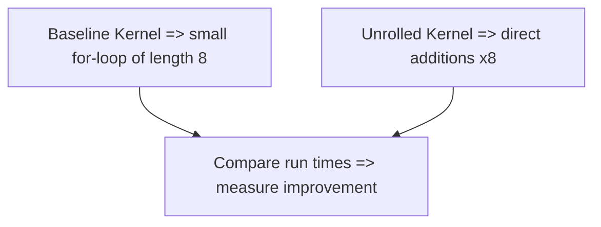
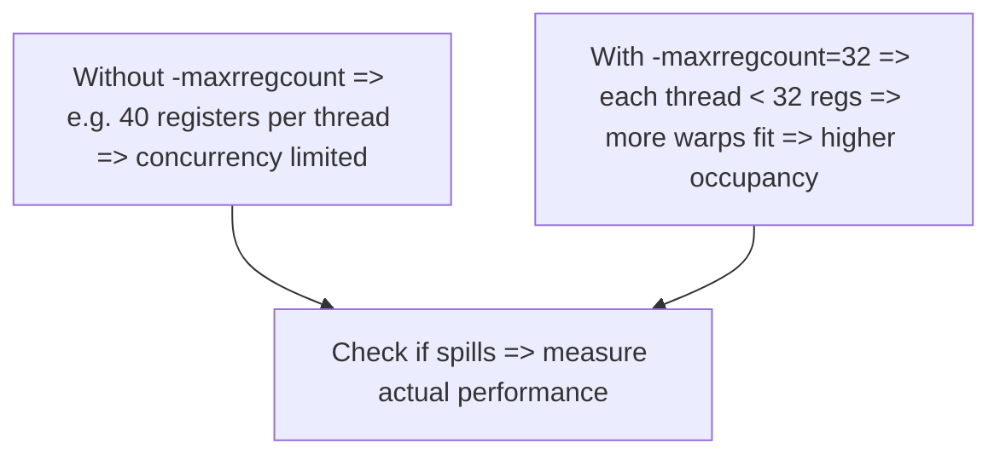

# Day 52: Code Optimization (Part 1) – Loop Unrolling & Register Usage Tweaks

**Objective:**  
Learn basic **code-level optimizations** in CUDA, such as **manual loop unrolling** and **register usage** tweaks, and measure their impact on performance. We'll demonstrate how to unroll loops in a kernel, compare to a baseline approach, and discuss the diminishing returns if you over-optimize or rely on manual transformations that can complicate maintenance. We'll also show how to investigate register usage changes (e.g., `-maxrregcount`) or use `__launch_bounds__()` to guide occupancy.

**Key References**:  
- [CUDA C Best Practices Guide – “Kernel Optimization”](https://docs.nvidia.com/cuda/cuda-c-best-practices-guide/index.html#kernel-optimizations)  
- [NVIDIA Nsight Compute & Nsight Systems](https://docs.nvidia.com/nsight-systems/) for measuring kernel performance and occupancy  
- [“Programming Massively Parallel Processors” by Kirk & Hwu](https://www.elsevier.com/books/programming-massively-parallel-processors/kirk/978-0-12-811986-0)  

---

## Table of Contents

1. [Overview](#1-overview)  
2. [Why Loop Unrolling & Register Tweaks?](#2-why-loop-unrolling--register-tweaks)  
3. [Practical Example: Loop Unrolling](#3-practical-example-loop-unrolling)  
   - [a) Baseline Kernel](#a-baseline-kernel)  
   - [b) Manually Unrolled Kernel](#b-manually-unrolled-kernel)  
   - [c) Measuring Performance Improvement](#c-measuring-performance-improvement)  
4. [Tweaking Register Usage via Compiler Flags](#4-tweaking-register-usage-via-compiler-flags)  
5. [Mermaid Diagrams](#5-mermaid-diagrams)  
   - [Diagram 1: Baseline vs. Unrolled Kernel Flow](#diagram-1-baseline-vs-unrolled-kernel-flow)  
   - [Diagram 2: Occupancy Changes with Register Limits](#diagram-2-occupancy-changes-with-register-limits)  
6. [Common Pitfalls & Diminishing Returns](#6-common-pitfalls--diminishing-returns)  
7. [References & Further Reading](#7-references--further-reading)  
8. [Conclusion](#8-conclusion)  
9. [Next Steps](#9-next-steps)

---

## 1. Overview

CUDA kernel performance can be **fine-tuned** by:
- **Manual loop unrolling**: Minimizing loop overhead and enabling compiler optimizations, especially for small, constant loop bounds.  
- **Register usage**: Some code patterns inflate register usage. By refactoring or using compiler flags (`-maxrregcount`, `__launch_bounds__()`), we might reduce register usage, increasing occupancy (though we must verify actual performance gains).

However, these optimizations can yield **diminishing returns** if your kernel is memory-bound or if unrolled code becomes too large. Always measure real performance to confirm improvements.

---

## 2. Why Loop Unrolling & Register Tweaks?

1. **Loop Unrolling**:  
   - Minimizes **loop overhead** (increments, comparisons, branches).  
   - Potentially helps the compiler identify more ILP (Instruction-Level Parallelism).  
   - Good when loop bounds are **small** or **constant** (like summing 8 elements in a thread).  

2. **Register Usage Tuning**:  
   - If each thread uses fewer registers, the kernel can potentially launch more threads concurrently => higher occupancy.  
   - **But**: Over-limiting registers can cause **spill** to local memory, hurting performance if kernel is compute-bound.  

**Goal**: Achieve the sweet spot of concurrency & minimal overhead for your kernel’s architecture.

---

## 3. Practical Example: Loop Unrolling

### a) Baseline Kernel

Below, a kernel sums a small array portion for each thread in a naive loop:

```cpp
/**** day52_baseline.cu ****/
#include <cuda_runtime.h>
#include <stdio.h>

__global__ void baselineSumKernel(const float *input, float *output, int N) {
    int idx = blockIdx.x * blockDim.x + threadIdx.x;
    if(idx < N){
        // sum next 8 elements in a naive loop
        float sum = 0.0f;
        for(int i=0; i<8; i++){
            sum += input[idx*8 + i];
        }
        output[idx] = sum;
    }
}
```

**Notes**:
- Each thread processes 8 consecutive elements in `input`, storing the sum in `output[idx]`.
- The 8-element sum is a small loop. Potentially a candidate for unrolling.

### b) Manually Unrolled Kernel

```cpp
/**** day52_unrolled.cu ****/
#include <cuda_runtime.h>
#include <stdio.h>

__global__ void unrolledSumKernel(const float *input, float *output, int N) {
    int idx = blockIdx.x * blockDim.x + threadIdx.x;
    if(idx < N){
        // manually unroll the loop of length 8
        float sum = 0.0f;
        // 8 elements => direct additions
        sum += input[idx*8 + 0];
        sum += input[idx*8 + 1];
        sum += input[idx*8 + 2];
        sum += input[idx*8 + 3];
        sum += input[idx*8 + 4];
        sum += input[idx*8 + 5];
        sum += input[idx*8 + 6];
        sum += input[idx*8 + 7];

        output[idx] = sum;
    }
}
```

**Notes**:  
- We replaced the loop with explicit additions.  
- If the loop count was variable or large, manual unrolling might become unwieldy. For small constants, it can help the compiler produce more efficient code.

### c) Measuring Performance Improvement

1. **Compile** each kernel in separate .cu files or conditionally choose the kernel.  
2. **Profile** with Nsight Systems or simply do a GPU timing approach:
   ```cpp
   cudaEventRecord(start);
   baselineSumKernel<<<grid, block>>>(...);
   cudaEventRecord(stop);
   ...
   ```
   then do the same for `unrolledSumKernel`.

2. If you see a difference in runtime for large N, you’ve measured the gain from unrolling.

**Possible**:
- Gains might be small if memory-bound or overshadowed by memory fetch overhead.  
- In some cases, a big loop might see bigger improvements. Always test.

---

## 4. Tweaking Register Usage via Compiler Flags

- **`-maxrregcount=N`**:  
  - Limits registers to `N` per thread, possibly improving occupancy. But might cause register spills to local memory if the kernel needs more.  
- **`__launch_bounds__(maxThreadsPerBlock, minBlocksPerSM)`**:  
  - Tells the compiler the likely block size, letting it reduce register usage so multiple blocks fit on an SM.  
- **Check**: Use `nvcc --ptxas-options=-v` or Nsight Compute to see register usage changes.

```bash
nvcc -O3 -maxrregcount=32 day52_unrolled.cu -o unrolled_reg32
```

**Be cautious**: If spills occur, you might see no performance improvement or even a slowdown.

---

## 5. Mermaid Diagrams

### Diagram 1: Baseline vs. Unrolled Kernel Flow



**Explanation**:  
The difference is removing the loop overhead in the unrolled version.

### Diagram 2: Occupancy Changes with Register Limits



**Explanation**:  
We highlight how limiting registers can boost concurrency but risk register spills.

---

## 6. Common Pitfalls & Diminishing Returns

1. **Memory-Bound**  
   - If your kernel mostly waits for global memory, unrolling or register-limiting might not help. Check memory throughput first.  
2. **Code Bloat**  
   - Excessive unrolling for large loops can lead to code-size explosion or instruction cache pressure.  
3. **Potential Over-Optimization**  
   - Gains might be single-digit percentage for small sections. Focus on bigger algorithmic or memory-level bottlenecks first.  
4. **Register Spills**  
   - Setting `-maxrregcount` too low => local memory accesses => can degrade performance more than concurrency gains.

---

## 7. References & Further Reading

1. **CUDA C Best Practices Guide – “Kernel Optimization”**  
   [Documentation Link](https://docs.nvidia.com/cuda/cuda-c-best-practices-guide/index.html#kernel-optimizations)  
2. **Nsight Systems** / **Nsight Compute** for measuring kernel times, occupancy, warp stalls.  
3. **“Programming Massively Parallel Processors” by Kirk & Hwu** – advanced kernel optimization examples.

---

## 8. Conclusion

**Day 52**: “Code Optimization (Part 1): Loop Unrolling & Register Tweaks”:

- We demonstrated a **baseline** kernel with a small loop vs. a **manually unrolled** version to remove loop overhead.  
- We explained how limiting register usage or applying `__launch_bounds__()` can raise occupancy, but one must measure if actual performance improves or if register spills hamper speed.  
- Over-optimizing small code blocks can yield **diminishing returns**, especially if your kernel is memory-bound or overshadowed by bigger algorithmic inefficiencies.

**Key Takeaway**:  
- Start with **algorithmic** and **memory-level** optimizations, then apply loop unrolling or register usage changes. Always measure the net effect on kernel runtime and watch out for code maintainability issues.

---

## 9. Next Steps

1. **Profile** a real kernel in your application. Identify if it’s compute-bound or memory-bound. If compute-bound, try unrolling certain loops.  
2. **Compare** run times with different `-maxrregcount` values (e.g., 32, 64) to see if occupancy gains help.  
3. **Combine** advanced techniques (like warp shuffle intrinsics) to reduce shared memory usage or further eliminate loops for partial sums.  
4. **Keep** an eye on code readability; large unrolled kernels can hamper debugging/maintenance.  
5. **Look** for bigger optimization wins in memory coalescing, algorithmic improvements, concurrency with streams, etc.
```
