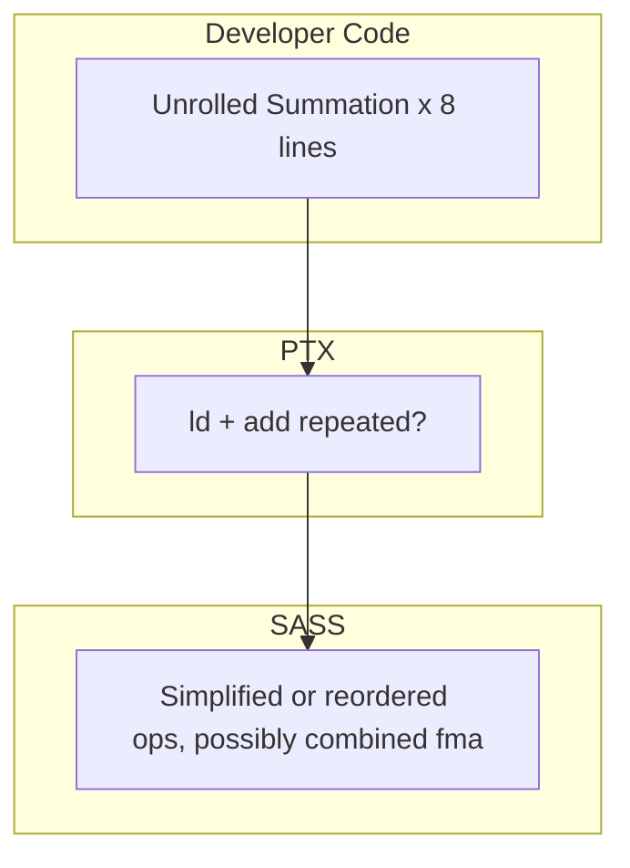
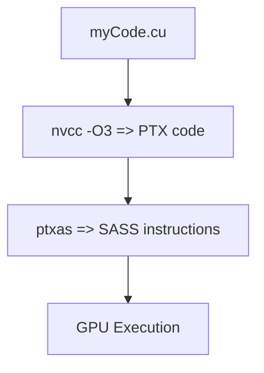

# Day 53: Code Optimization (Part 2) – Analyzing PTX & Instruction-Level Tweaks

**Objective:**  
Dive into **PTX** (Parallel Thread Execution) analysis and **instruction-level** optimizations in CUDA. By inspecting the compiler’s generated PTX code, you can discover potential inefficiencies (e.g., unnecessary instructions, instruction reordering). We'll demonstrate how to **generate PTX**, use **ptxas** or **cuobjdump**, and consider some minimal manual or compiler-directed optimization steps. Note that PTX is an **intermediate representation** that may vary across CUDA toolkit versions or be further optimized by the final device code generator (SASS).

**Key References**:  
- [PTX Tools & Documentation](https://docs.nvidia.com/cuda/parallel-thread-execution/index.html)  
- [NVIDIA cuobjdump & ptxas CLI usage](https://docs.nvidia.com/cuda/cuda-binary-utilities/index.html)  
- [CUDA C Best Practices Guide – Low-level optimization](https://docs.nvidia.com/cuda/cuda-c-best-practices-guide/index.html)  

---

## Table of Contents

1. [Overview](#1-overview)  
2. [What is PTX?](#2-what-is-ptx)  
3. [Generating & Inspecting PTX](#3-generating--inspecting-ptx)  
   - [a) Example Command Lines](#a-example-command-lines)  
   - [b) Code Snippet for PTX Analysis](#b-code-snippet-for-ptx-analysis)  
4. [Instruction-Level Optimizations](#4-instruction-level-optimizations)  
   - [a) Minimizing Redundant Operations](#a-minimizing-redundant-operations)  
   - [b) Using Compiler Intrinsics or Builtins](#b-using-compiler-intrinsics-or-builtins)  
5. [Mermaid Diagrams](#5-mermaid-diagrams)  
   - [Diagram 1: PTX Generation Flow](#diagram-1-ptx-generation-flow)  
   - [Diagram 2: PTX -> SASS (Final Device Code)](#diagram-2-ptx---sass-final-device-code)  
6. [Common Pitfalls & Best Practices](#6-common-pitfalls--best-practices)  
7. [References & Further Reading](#7-references--further-reading)  
8. [Conclusion](#8-conclusion)  
9. [Next Steps](#9-next-steps)

---

## 1. Overview

PTX is a **low-level virtual ISA** for NVIDIA GPUs. The CUDA compiler (`nvcc`) generally produces PTX from your C/C++ code, then an assembler step (`ptxas`) turns PTX into **SASS** (the final machine code). By analyzing PTX:

- You can see whether loops are unrolled or instructions are simplified.  
- Potentially spot register usage, memory instructions, or divergences.  
- Attempt small code adjustments that might produce more streamlined PTX.

**Caveat**:  
- PTX is not the final code if the GPU does JIT or the toolkit version changes. PTX can differ among compiler versions.  
- Over-focusing on PTX is advanced and can yield diminishing returns if bigger bottlenecks remain at a higher level.

---

## 2. What is PTX?

- **Parallel Thread Execution**: A device-independent IR (Intermediate Representation).  
- **Human-readable** assembly-like syntax: `LDG.E.SYS` (load global memory), `FFMA` (fused multiply-add), etc.  
- The final device code (SASS) might rearrange or optimize further.  
- **Backward compatibility**: Future drivers can recompile PTX to new GPU architectures.

**Why Analyze**:  
- Check if **loop unrolling** or **intrinsics** produce desired instructions.  
- Spot excessive register usage or extra instructions.  
- Confirm that certain expansions (like `sin()`, `cos()`) become hardware-accelerated instructions or library calls.

---

## 3. Generating & Inspecting PTX

### a) Example Command Lines

1. **Generate PTX with `-ptx`**:
   ```bash
   nvcc -O3 -arch=sm_80 -ptx myKernel.cu -o myKernel.ptx
   ```
   Produces a `.ptx` file with the intermediate code.  

2. **Use `cuobjdump`** on final binary:
   ```bash
   nvcc -O3 myKernel.cu -o myKernel
   cuobjdump --dump-ptx myKernel > myKernel_dump.ptx
   ```
   Extract PTX from the embedded cubin in the final executable.

3. **ptxas** usage:
   ```bash
   ptxas myKernel.ptx -o myKernel.cubin --gpu-name sm_80 --warn-on-spill
   ```
   Assembles PTX to a cubin (machine code), printing warnings if register spills occur.

### b) Code Snippet for PTX Analysis

```cpp
/**** day53_ptxAnalysis.cu ****/
#include <cuda_runtime.h>
#include <stdio.h>

// We'll do a small kernel to see if a loop is unrolled or not in PTX
__global__ void ptxTestKernel(const float *in, float *out, int N) {
    int idx= blockIdx.x*blockDim.x + threadIdx.x;
    if(idx < N){
        float val= in[idx];
        // small loop
        #pragma unroll 4   // tell compiler to unroll 4 times
        for(int i=0; i<8; i++){
            val+= 0.5f;
        }
        out[idx]= val;
    }
}

int main(){
    // ... allocate arrays, call ptxTestKernel, measure or just run ...
    // Then compile with `-ptx` and examine .ptx file for unrolling or instruction patterns.
    return 0;
}
```

**Explanation**:
- We use `#pragma unroll 4` as an example. Inspect `.ptx` to see if it partially or fully unrolled the loop.  
- You can see instructions for the repeated additions or a single loop structure.

---

## 4. Instruction-Level Optimizations

### a) Minimizing Redundant Operations

Look for repeated instructions in PTX, e.g. if you do:

```cpp
float a= x*y + c;
float b= x*y + d;
```
the compiler might do the multiplication twice if it can’t see reuse. You can store `float tmp= x*y;` then do `a= tmp+c; b= tmp+d;` to ensure it’s only one MUL instruction. Usually `-O3` handles this automatically, but sometimes manual rewriting helps.

### b) Using Compiler Intrinsics or Builtins

**Examples**:
- `__fmul_rn(a,b)` for a forced multiply with round-to-nearest, or `__fmaf_rn(a,b,c)` for forced fused multiply-add.  
- Some trig or sqrt intrinsics (like `__fmaf_rz`) reduce overhead or ensure inline expansions.  
- Typically, the compiler might do this if `-use_fast_math` is set, but checking PTX can confirm whether a standard library call is replaced by an instruction.

---

## 5. Mermaid Diagrams

### Diagram 1: PTX Generation Flow

```mermaid
flowchart TD
    A[myKernel.cu] --> B[nvcc (compiler front-end)]
    B --> C[PTX code => .ptx file]
    C --> D[ptxas => .cubin or embedded in fatbinary]
    D --> E[SASS => final GPU instructions]
```

**Explanation**:
- The pipeline from your `.cu` file to final GPU code is:  
  1. C++ to PTX.  
  2. PTX to device code (SASS) via ptxas.

### Diagram 2: PTX -> SASS (Final Device Code)

```mermaid
flowchart LR
    subgraph IR
    P[PTX instructions <--- readability, partial assembly]
    end
    subgraph GPU Code
    S[SASS (micro-ops) <--- final machine instructions]
    end

    P --> S
```

**Explanation**:  
PTX is not the final code. The assembler or driver JIT can reorder or optimize further.

---

## 6. Common Pitfalls & Best Practices

1. **PTX Instability**  
   - Don’t rely on PTX structure staying the same across compiler or GPU arches. It’s an IR, so it can shift in subsequent versions.  
2. **Focus on High-Level**  
   - Often you get bigger wins from memory or concurrency optimizations than from small PTX changes.  
3. **Instruction Bloat**  
   - Overusing unroll or macros can lead to large PTX code, potential register pressure, or instruction cache misses.  
4. **Maintainability**  
   - Inserting inline PTX or relying on micro-level changes can hamper readability and portability.

---

## 7. References & Further Reading

1. **PTX ISA**  
   [Parallel Thread Execution ISA docs](https://docs.nvidia.com/cuda/parallel-thread-execution/index.html)  
2. **cuobjdump**  
   [CUDA Binary Utilities Docs](https://docs.nvidia.com/cuda/cuda-binary-utilities/index.html)  
3. **Nsight Compute** for analyzing final SASS, warp stalls, register usage.  
4. **NVIDIA Developer Blog** – articles on advanced PTX manipulations or inlined assembly.

---

## 8. Conclusion

**Day 53** continued **Code Optimization** focusing on **PTX-level** analysis:

- We introduced **PTX** as an IR, how to generate it via `-ptx` or `cuobjdump`.  
- We demonstrated partial **manual code rewriting** and **unroll** pragmas to see if PTX instructions match expected patterns.  
- We covered potential instruction-level optimizations, like removing redundant ops or using compiler intrinsics.  
- We warned about **diminishing returns** and the ephemeral nature of PTX (the final SASS might differ).  

**Key Takeaway**:  
**PTX** analysis is an advanced approach to confirm the compiler’s transformations or to do final low-level tweaks. While beneficial for specialized HPC or micro-optimization, it can be overshadowed by bigger algorithmic or memory-level improvements.

---

## 9. Next Steps

1. **Generate PTX** for one of your kernels with `-ptx`, examine for unroll patterns, instruction count, and registers used.  
2. **Compare** that to final SASS via `cuobjdump --dump-sass` or Nsight Compute to see if further optimization is possible.  
3. **Try** inlined PTX or compiler intrinsics if you see an opportunity to remove repeated instructions.  
4. **Profile** real performance changes. If minimal or overshadowed by memory bandwidth, focus on other optimizations.  
5. **Keep** your code maintainable. Only do PTX micro-optimizations for critical HPC code sections after higher-level improvements have been exhausted.
```

```
Below is a **deeper dive** into **PTX** optimizations and **SASS** details, discussing how **`#pragma unroll`** operates under the hood, clarifying final code generation into **SASS** instructions, and offering insights on how these mechanisms can alter performance and maintainability.

---

# Extended Dive into PTX, `#pragma unroll`, and SASS

## Table of Contents

1. [Introduction](#1-introduction)  
2. [Understanding the Compilation Stages: From CUDA C++ to SASS](#2-understanding-the-compilation-stages-from-cuda-c-to-sass)  
3. [Deeper Look at `#pragma unroll`](#3-deeper-look-at-pragma-unroll)  
4. [SASS: The Final Machine Instructions](#4-sass-the-final-machine-instructions)  
5. [Inline PTX or SASS in CUDA](#5-inline-ptx-or-sass-in-cuda)  
6. [Performance Nuances & Examples](#6-performance-nuances--examples)  
7. [Recommended Workflow](#7-recommended-workflow)  
8. [Diagrams for Visualization](#8-diagrams-for-visualization)  
9. [Conclusion](#9-conclusion)  
10. [References & Further Reading](#10-references--further-reading)

---

## 1. Introduction

In **Day 53** we introduced how to:
- Generate PTX via `-ptx`  
- Inspect or assemble PTX  
- Possibly rearrange code for smaller loops or use built-in intrinsics

Here, we **dig deeper** into how `#pragma unroll` works, how the compiler transitions from PTX to **SASS** (the final GPU binary), and illustrate potential pitfalls or advanced usage (like inline PTX or direct assembly). We also discuss how unroll decisions or register usage show up in SASS, giving you more granular control if absolutely necessary.

---

## 2. Understanding the Compilation Stages: From CUDA C++ to SASS

1. **CUDA C++ Source**  
   - You write `.cu` files with host and device code.

2. **Front-end Compilation**  
   - `nvcc` (with clang or gcc front-end) compiles host code to CPU objects, and device code to **PTX** or intermediate representations.

3. **ptxas** or JIT**  
   - The PTX is then assembled by **ptxas** into **SASS** instructions.  
   - Some architectures allow a JIT step at runtime, or a “fatbinary” approach embedding PTX + multiple SASS variants for different `sm_XX` versions.

4. **SASS**  
   - The final machine instructions that the GPU warps execute.  
   - Contains real hardware opcodes like `LDG`, `STG`, `FADD`, `FMUL`, `FMA`, etc., plus scheduling details.

**Where**:
- `#pragma unroll` or manual unrolling can appear as partial or complete expansions in PTX. Then ptxas might interpret that or further optimize.  
- The final code in SASS can be further rearranged or instructions can fuse or be replaced.

---

## 3. Deeper Look at `#pragma unroll`

### a) How It Works

- `#pragma unroll [factor]` is a **compiler directive** telling the compiler how many times to unroll a loop.  
- If `[factor]` is omitted, the compiler tries to fully unroll the loop if the iteration count is known at compile time.  
- The compiler can also ignore the pragma if unrolling is not feasible or leads to code size explosion.

### b) Example

```cpp
// We want a loop of length 8 fully unrolled:
#pragma unroll
for(int i=0; i<8; i++){
    sum += arr[base + i];
}
```

In **PTX** (assuming `-O3`), you might see repeated `LD` instructions rather than a loop. Or if we do `#pragma unroll 4`, the compiler might unroll half. This direct unrolling can reduce loop overhead but might:

- Increase code size  
- Potentially raise register usage

### c) Partial or Automatic Unroll

- The compiler often unrolls small constant loops by default. `#pragma unroll` can override or confirm that.  
- If the loop size is large or not constant, unrolling might be partial or none.

---

## 4. SASS: The Final Machine Instructions

### a) SASS vs. PTX

- **SASS** is the actual hardware instructions. PTX is a higher-level IR that can still be optimized at assembly time.  
- SASS instructions have explicit references to registers like `R0`, `R1`, as well as scheduling or warp-level details.  
- `LDG` vs. `LDS` or `STG`: global memory loads/stores vs. shared memory loads/stores.  
- `FADD`, `FMUL`, `FFMA`: float add, multiply, or fused multiply-add instructions.

### b) Investigating SASS

- Use `cuobjdump --dump-sass myKernel` or `nsys` / **Nsight Compute** to see the final SASS.  
- If your unrolled loop is 8 loads and 8 adds in PTX, you might see 8 distinct `LDG` and 8 `FADD` or `FFMA` instructions. Possibly the compiler merges them or reorders them.

### c) Example SASS snippet

You might see lines like:
```
        /*00a0*/ LDG.E.SYS R4, [R2];
        /*00a8*/ FADD R5, R5, R4;
        ...
        /*00b8*/ FMUL R5, R5, 0x3f000000; // multiply by 0.5?
        ...
```
This is typical of a partially unrolled or manually unrolled loop that’s fully expanded in the final assembly.

---

## 5. Inline PTX or SASS in CUDA

### a) Inline PTX

- You can embed PTX with `asm(".reg .f32 r0; ...");` but this is rarely recommended.  
- Doing so can hamper future portability or optimizations.

### b) Inline SASS

- Even more advanced, you can place device assembly instructions directly if you have absolute control. This is extremely specialized. Typically used in microbenchmarks or for HPC researchers investigating custom instructions.  
- The code can break with new GPU architectures if opcodes or scheduling differ.

**Conclusion**: Only do this if you truly require that micro-optimization or are performing specialized research. Usually, high-level code or unroll pragmas suffice.

---

## 6. Performance Nuances & Examples

1. **Memory-Bound**:  
   - If your kernel is memory-bound, unrolling or analyzing PTX for arithmetic instructions yields small gains. The limiting factor is memory throughput.  
2. **Compute-Bound**:  
   - If your kernel is heavy in arithmetic, removing loop overhead or ensuring maximum ILP can help. 
3. **Register Pressure**:  
   - Manually unrolling big loops can blow up register usage. Possibly leading to spills. Must measure.  
4. **Diminishing Returns**:  
   - You might see 2–5% improvement or even no improvement after a certain point. Compare that to code complexity.

---

## 7. Recommended Workflow

1. **Profile High-Level**:  
   - Use Nsight Systems or Nsight Compute to identify the real bottleneck. If memory is the culprit, messing with PTX might not solve it.  
2. **Check Compiler Output**:  
   - `-ptx` or `cuobjdump --dump-ptx` to see if your loop is unrolled or if your expansions are recognized.  
3. **Benchmark**:  
   - Make a small change (unroll factor or a new intrinsic), recompile, measure kernel time.  
4. **Check SASS**:  
   - If performance gain is small, confirm SASS changes or if the final code is the same anyway.  
5. **Maintainability**:  
   - Keep your code understandable. Overly large macros or inlined PTX can hamper future upgrades or debug.

---

## 8. Diagrams for Visualization

### Diagram 1: Compilation vs. Execution Flow

```mermaid
flowchart TD
    A[High-Level CUDA (loops, #pragma unroll)] --> B[PTX IR Output]
    B --> C[SASS Generation by ptxas]
    C --> D[Kernel Execution on GPU]
    E[Observe or measure final performance]
    D --> E
```

**Explanation**:  
We see how `#pragma unroll` influences the PTX, which then yields final SASS.

### Diagram 2: Instruction Path for an Unrolled Loop



**Explanation**:  
The flow from unrolled code to PTX and then re-labeled or re-factored instructions in SASS.

---

## 9. Conclusion

**Day 53** advanced discussion reveals how analyzing **PTX** and final **SASS** can help refine **instruction-level** details in your kernel. We covered:

- **`#pragma unroll`** operation and potential expansion in PTX.  
- **SASS** as the real final machine code.  
- **Inline PTX** or inlined device assembly for extreme micro-optimizations.  
- Real performance checks for memory-bound vs. compute-bound kernels.  
- The ephemeral nature of PTX (subject to further optimization).

**Key Takeaway**:  
**PTX** analysis is a specialized technique for HPC code or advanced GPU research. Large gains typically come from higher-level improvements, but for tight loops or performance-critical arithmetic sections, **unroll** and small instruction-level changes might yield incremental speedups—**provided** it doesn't overcomplicate your code.

---

## 10. References & Further Reading

1. **PTX ISA**  
   [NVIDIA PTX Docs](https://docs.nvidia.com/cuda/parallel-thread-execution/index.html)  
2. **cuobjdump & ptxas**  
   [CUDA Binary Utilities Documentation](https://docs.nvidia.com/cuda/cuda-binary-utilities/index.html)  
3. **CUDA C Best Practices Guide** – “Kernel Optimization”  
   [Documentation Link](https://docs.nvidia.com/cuda/cuda-c-best-practices-guide/index.html#kernel-optimizations)  
4. **NVIDIA Developer Blog** – Articles on advanced PTX transformations, inline assembly.

---

# End
By diving further into PTX, `#pragma unroll`, and the nuances of SASS, you are stepping into **low-level GPU optimization**. Keep your changes measured by actual performance metrics, remain mindful of code complexity, and rely on higher-level optimizations first. If you find a real need for these micro-optimizations, analyzing PTX can be invaluable to confirm the compiler’s transformations and ensure your GPU code is as efficient as possible.


# Day 53: Code Optimization (Part 2) – Analyzing PTX & Instruction-Level Optimizations

**Objective:**  
Continue our deep dive into **code optimization** by learning how to **analyze PTX** (Parallel Thread Execution) code, apply **instruction-level tweaks**, and understand **SASS** (the final machine code). PTX is an **intermediate representation** that the compiler generates before the final assembly stage. By inspecting PTX, you can confirm whether your code transformations (e.g., manual unrolling, compiler intrinsics) are taking effect. However, note that PTX can still be optimized further by the assembler (`ptxas`) and may differ across CUDA toolkit versions.

**Key References**:  
- [PTX Tools & Documentation](https://docs.nvidia.com/cuda/parallel-thread-execution/index.html)  
- [NVIDIA cuobjdump & ptxas CLI usage](https://docs.nvidia.com/cuda/cuda-binary-utilities/index.html)  
- [CUDA C Best Practices Guide – Low-level optimization](https://docs.nvidia.com/cuda/cuda-c-best-practices-guide/index.html#kernel-optimizations)  

---

## Table of Contents

1. [Overview](#1-overview)  
2. [Why Analyze PTX?](#2-why-analyze-ptx)  
3. [Compilation Flow: From CUDA C++ to SASS](#3-compilation-flow-from-cuda-c-to-sass)  
4. [Practical Example: Generating & Inspecting PTX](#4-practical-example-generating--inspecting-ptx)  
   - [a) Code Snippet & Comments](#a-code-snippet--comments)  
   - [b) Command Lines & Tools](#b-command-lines--tools)  
5. [Instruction-Level Optimizations](#5-instruction-level-optimizations)  
   - [a) Manual Unrolling & Intrinsics in PTX](#a-manual-unrolling--intrinsics-in-ptx)  
   - [b) Minimizing Redundant Ops & Using Builtins](#b-minimizing-redundant-ops--using-builtins)  
6. [SASS: The Final Machine Code](#6-sass-the-final-machine-code)  
7. [Mermaid Diagrams](#7-mermaid-diagrams)  
   - [Diagram 1: Generation of PTX & SASS](#diagram-1-generation-of-ptx--sass)  
   - [Diagram 2: Developer Code -> PTX -> SASS Example](#diagram-2-developer-code---ptx---sass-example)  
8. [Common Pitfalls & Best Practices](#8-common-pitfalls--best-practices)  
9. [References & Further Reading](#9-references--further-reading)  
10. [Conclusion](#10-conclusion)  
11. [Next Steps](#11-next-steps)

---

## 1. Overview

In **Day 52**, we discussed loop unrolling, register usage, and occupancy. **Day 53** focuses on **PTX**: 
- Inspecting it to confirm whether your unrolled loops or built-in intrinsics appear as expected.  
- Possibly adjusting code further or using inline PTX for specialized micro-optimizations.  
- Understanding that the final assembly (SASS) might differ from PTX if the assembler (ptxas) reorders or merges instructions.  

**Caveat**:  
- PTX is a stable IR, but exact instruction forms can change with **compiler** or **architecture** updates. Over-optimizing at PTX level can hamper code portability.

---

## 2. Why Analyze PTX?

1. **Confirm Compiler Transformations**  
   - E.g., you used `#pragma unroll` or manually unrolled a loop—did it appear unrolled in PTX?  
2. **Check Register Usage**  
   - With `-lineinfo` or ptxas flags, you might see how many registers are allocated or whether there's spill to local memory.  
3. **Spot Instruction Patterns**  
   - Are operations like `sin()` or `exp()` inlined or turned into library calls?  
4. **Ensure** no unexpected loops remain or no extra instructions hamper performance.

**But**: If the code is memory-bound or overshadowed by bigger overheads, PTX-level changes might not yield large improvements. Always measure actual runtime.

---

## 3. Compilation Flow: From CUDA C++ to SASS

1. **Source**  
   - `.cu` code with host + device logic.  
2. **Front-end**  
   - `nvcc` compiles device code to **PTX** IR (plus host code to CPU objects).  
3. **Assembler**  
   - `ptxas` takes PTX → final **SASS** for a given architecture (e.g. `sm_80`).  
4. **Runtime**  
   - The GPU executes SASS instructions. The IR is typically stored in a “fatbinary” or embedded inside the final executable.

---

## 4. Practical Example: Generating & Inspecting PTX

### a) Code Snippet & Comments

```cpp
/**** day53_ptxInspect.cu ****/
#include <cuda_runtime.h>
#include <stdio.h>

__global__ void sumOf8(const float *in, float *out, int N) {
    int idx= blockIdx.x*blockDim.x + threadIdx.x;
    if(idx<N){
        float val= in[idx];
        // small loop
        #pragma unroll
        for(int i=1; i<8; i++){ // forcibly unroll
            val += in[idx+i*N]; 
        }
        out[idx]= val;
    }
}

int main(){
    // Minimal usage: we won't measure time, just compile with -ptx
    // ...
    return 0;
}
```

**Explanation**:
- `#pragma unroll` might cause the loop to expand. We’ll see in PTX if it’s 7 additions or a loop.
- The indexing `in[idx + i*N]` might produce different instructions than a contiguous approach, so we can see if the compiler rearranges or do partial unroll.

### b) Command Lines & Tools

1. **Generate PTX**:
   ```bash
   nvcc -O3 -arch=sm_80 -ptx day53_ptxInspect.cu -o day53_ptxInspect.ptx
   ```
   Inspect the `.ptx`. Look for lines like:  
   ```
       // no loop? repeated instructions? 
       // "LDG.E" instructions or "FADD" repeated 7 times?
   ```
2. **Assemble** & check for spills or warnings:
   ```bash
   ptxas day53_ptxInspect.ptx -o day53_ptxInspect.cubin --gpu-name sm_80 --warn-on-spill
   ```
3. **cuobjdump** approach:
   ```bash
   nvcc -O3 day53_ptxInspect.cu -o day53
   cuobjdump --dump-ptx day53 >myDump.ptx
   cuobjdump --dump-sass day53 >myDump.sass
   ```

---

## 5. Instruction-Level Optimizations

### a) Manual Unrolling & Intrinsics in PTX

- If you do `#pragma unroll 4`, the PTX might show partial expansions. If it remains a loop, the compiler might have decided unrolling is harmful or not feasible.  
- Intrinsics like `__fmaf_rn(a,b,c)` can show up as `FFMA` instructions in PTX or SASS.

### b) Minimizing Redundant Ops & Using Builtins

- If code has repeated expressions like `x*y` multiple times, check PTX to see if it loads from a temp register or does each multiply again. Usually `-O3` handles this, but confirm.  
- Builtins like `__sin()` might produce direct instructions in SASS vs. a call to `__device__ __sinf()`. Checking PTX or SASS clarifies.

---

## 6. SASS: The Final Machine Code

**SASS** is the actual GPU opcode layer:

- **Register references**: `R0, R1, R2...`  
- **Memory ops**: `LDG.E`, `STG.E`, `LDS`, `STS` for global or shared memory.  
- **Arithmetic**: `FADD`, `FMUL`, `FFMA` (fused multiply-add).  
- **Control**: `BRA`, `SSY`, `SYNC` for warp-level sync or branching.

Observing SASS can confirm if your **PTX** transformations hold or if further scheduling or merges occur. E.g., multiple `FADD` instructions might become a single sequence of `FFMA` plus an add if the assembler sees an opportunity.

---

## 7. Mermaid Diagrams

### Diagram 1: Generation of PTX & SASS



**Explanation**:  
The pipeline from source to GPU. PTX is an intermediate IR, SASS is final.

### Diagram 2: Developer Code -> PTX -> SASS Example

```mermaid
flowchart LR
    subgraph Dev Code
    CODE[__global__ void kernel { #pragma unroll ... }]
    end

    subgraph PTX
    IR[PTX: repeated instructions or partial loop]
    end

    subgraph SASS
    MACH[SASS: final loads, stores, arithmetic ops]
    end

    CODE --> IR
    IR --> MACH
```

---

## 8. Common Pitfalls & Best Practices

1. **PTX Instability**  
   - PTX might differ with next toolkit or next GPU arch. Relying on specific PTX lines is risky.  
2. **Focusing on Micro-Optimizations**  
   - If your kernel is memory-bound, instruction-level changes might yield small gains.  
3. **Ignore Warnings**  
   - If you see a `ptxas` warning about register spills or large code, investigate it. Overly large unrolling can hamper performance.  
4. **Maintainability**  
   - Hard-coded loop expansions or inline PTX can confuse future developers. Keep code balanced.

---

## 9. References & Further Reading

1. **PTX ISA**  
   [NVIDIA PTX Official Docs](https://docs.nvidia.com/cuda/parallel-thread-execution/index.html)  
2. **cuobjdump & ptxas**  
   [NVIDIA Binary Utilities Docs](https://docs.nvidia.com/cuda/cuda-binary-utilities/index.html)  
3. **Nsight Compute** – to see final SASS & warp stalls.  
4. **CUDA C Best Practices Guide** – “Kernel Optimization”  
   [NVIDIA Docs Link](https://docs.nvidia.com/cuda/cuda-c-best-practices-guide/index.html)

---

## 10. Conclusion

**Day 53** advanced the **Code Optimization** journey:

- We explained **PTX** as a middle representation for GPU code.  
- Showed how to generate & analyze `.ptx`, see if your **unrolling** or **intrinsic** usage is recognized.  
- Observed that final **SASS** can reorder or optimize further, so always measure actual performance.  
- Provided examples & diagrams of the pipeline from `.cu` source to PTX, then to SASS.

**Key Takeaway**:  
**PTX** analysis is powerful for verifying compiler transformations, but keep in mind it’s not the final device code if the assembler further modifies it. Real performance measurement remains the final judge. Over-optimizing at this level can lead to diminishing returns unless you have already tackled bigger bottlenecks (memory, concurrency, or algorithmic improvements).

---

## 11. Next Steps

1. **Generate PTX** for a real kernel, see if your loop unrolling or builtins show up in the IR.  
2. **Check SASS** using `cuobjdump --dump-sass`, confirm final instructions.  
3. **Experiment** with `-maxrregcount` or `__launch_bounds__()` in addition to manual unrolling, compare PTX/SASS differences.  
4. **Profile** changes in runtime or stalls with Nsight Systems / Nsight Compute to ensure your code genuinely speeds up.  
5. **Keep** code maintainable; only do deep PTX analysis for the truly performance-critical sections.
```
