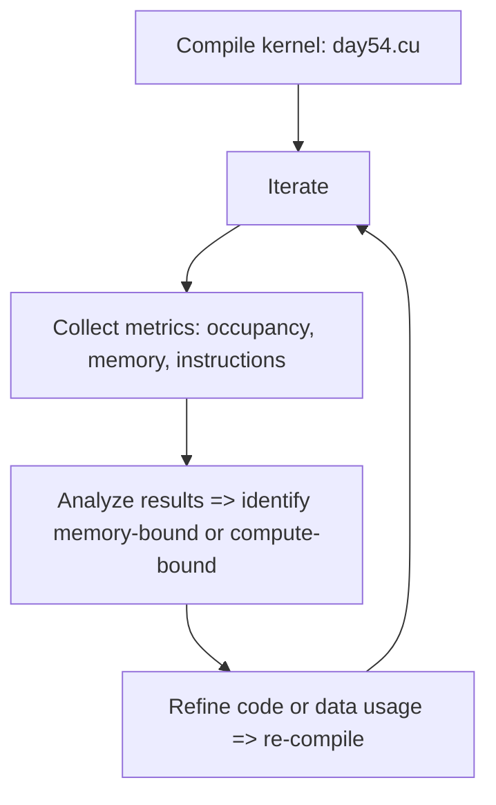

# Day 54: Nsight Compute – Kernel Analysis

**Objective:**  
Use **Nsight Compute** for **in-depth kernel analysis**, focusing on **occupancy**, **memory throughput**, **instruction mix**, and **bottleneck identification**. Nsight Compute is NVIDIA’s low-level profiler that provides detailed metrics (e.g., SM utilization, warp stall reasons, memory bandwidth usage, and instruction throughput). By examining both **memory** and **compute** metrics, you can form a **complete optimization approach**—ignoring memory-related data risks missing crucial bottlenecks.

**Key Reference**:  
- [Nsight Compute Documentation](https://docs.nvidia.com/nsight-compute/)  

---

## Table of Contents

1. [Overview](#1-overview)  
2. [Why Use Nsight Compute?](#2-why-use-nsight-compute)  
3. [Installation & Basic Workflow](#3-installation--basic-workflow)  
4. [Practical Example: Analyzing a Kernel](#4-practical-example-analyzing-a-kernel)  
   - [a) Code Snippet & Explanation](#a-code-snippet--explanation)  
   - [b) Profiling Steps with Nsight Compute](#b-profiling-steps-with-nsight-compute)  
5. [Key Metrics: Occupancy, Memory Throughput, Instruction Mix](#5-key-metrics-occupancy-memory-throughput-instruction-mix)  
   - [a) Occupancy](#a-occupancy)  
   - [b) Memory Throughput](#b-memory-throughput)  
   - [c) Instruction Mix & Warp Stall Reasons](#c-instruction-mix--warp-stall-reasons)  
6. [Mermaid Diagrams](#6-mermaid-diagrams)  
   - [Diagram 1: Nsight Compute Profiling Flow](#diagram-1-nsight-compute-profiling-flow)  
   - [Diagram 2: Occupancy & Memory Coalescing Observations](#diagram-2-occupancy--memory-coalescing-observations)  
7. [Common Pitfalls & Best Practices](#7-common-pitfalls--best-practices)  
8. [References & Further Reading](#8-references--further-reading)  
9. [Conclusion](#9-conclusion)  
10. [Next Steps](#10-next-steps)

---

## 1. Overview

**Nsight Compute** is a powerful profiler that captures detailed metrics about each GPU kernel execution, letting you identify:

- **Occupancy** (active warps vs. potential).  
- **Memory** usage (global load/store efficiency, L2 usage).  
- **Instruction** categories (integer, floating, SFU usage).  
- **Warp stall** reasons (like `Long Scoreboard`, `Mem Dependency`, `PipeBusy`).  

This helps pinpoint whether a kernel is **memory-bound** or **compute-bound**, or if it has **warp divergence** or **low occupancy**. By analyzing these metrics, you can apply **targeted** optimizations rather than guesswork.

---

## 2. Why Use Nsight Compute?

1. **Detailed GPU Performance Metrics**  
   - More granular than Nsight Systems’ timeline. You see per-kernel data on instruction throughput, memory bandwidth, warp stalls.  
2. **Comparisons**  
   - Compare multiple runs or multiple kernels. Track changes after code modifications or different compiler flags.  
3. **Visual** or **CLI**** Options**  
   - Nsight Compute has a GUI (ncurses-like or separate visual) or CLI mode (`ncu`) for script-based analysis.  
4. **Bottleneck Identification**  
   - Distinguish if **memory** or **compute** is the limiting factor. Evaluate occupancy vs. actual performance.

**But**: Overemphasis on a single metric (like occupancy or instructions) can be misleading if you **ignore memory**. A kernel might show high occupancy but remain memory-bound, or vice versa.

---

## 3. Installation & Basic Workflow

- **Install** Nsight Compute as part of the CUDA Toolkit or separate package.  
- **Run** your application with `ncu --target-processes all ./myApp` or open the Nsight Compute GUI.  
- **Select** which kernels to profile if multiple.  
- **Collect** metrics: The tool can gather a broad range of info, but a smaller subset (like `--metrics all` or a specific set) might be more manageable.

**Pro Tip**: Avoid collecting every possible metric in one run, as overhead can be huge. Start with a “**Speed of Light**” analysis or “**Memory Workload Analysis**” section.

---

## 4. Practical Example: Analyzing a Kernel

### a) Code Snippet & Explanation

```cpp
/**** day54_nSightComputeExample.cu ****/
#include <cuda_runtime.h>
#include <stdio.h>

__global__ void sumArrays(const float *A, const float *B, float *C, int N){
    int idx= blockIdx.x*blockDim.x + threadIdx.x;
    if(idx < N){
        // intentionally do multiple loads to see memory usage
        float valA = A[idx];
        float valB = B[idx];
        // a small loop
        #pragma unroll
        for(int i=0;i<4;i++){
            // some extra ops
            valA *= 1.0001f; 
            valB += 0.5f;
        }
        C[idx] = valA + valB;
    }
}

int main(){
    int N=1<<20;
    size_t size= N*sizeof(float);
    float *h_A=(float*)malloc(size);
    float *h_B=(float*)malloc(size);
    float *h_C=(float*)malloc(size);

    for(int i=0;i<N;i++){
        h_A[i]= (float)(rand()%100);
        h_B[i]= (float)(rand()%100);
    }

    float *d_A,*d_B,*d_C;
    cudaMalloc(&d_A,size);
    cudaMalloc(&d_B,size);
    cudaMalloc(&d_C,size);

    cudaMemcpy(d_A, h_A, size,cudaMemcpyHostToDevice);
    cudaMemcpy(d_B, h_B, size,cudaMemcpyHostToDevice);

    dim3 block(256);
    dim3 grid( (N+block.x-1)/block.x );
    sumArrays<<<grid, block>>>(d_A,d_B,d_C,N);
    cudaDeviceSynchronize();

    cudaMemcpy(h_C, d_C, size, cudaMemcpyDeviceToHost);
    printf("h_C[0]=%f\n", h_C[0]);

    cudaFree(d_A); cudaFree(d_B); cudaFree(d_C);
    free(h_A); free(h_B); free(h_C);
    return 0;
}
```

**Explanation**:
- We create a simple kernel that sums arrays A and B but also does extra ops in a small loop to produce a few instructions.  
- This kernel might be **memory-bound** for large N, but we have some compute instructions to show a mixed usage.  
- We then use Nsight Compute to gather metrics.

### b) Profiling Steps with Nsight Compute

1. **Compile**:
   ```bash
   nvcc -O3 day54_nSightComputeExample.cu -o day54
   ```
2. **Profile** with CLI:
   ```bash
   ncu --target-processes all ./day54
   ```
   Nsight Compute will run your app, capture data on `sumArrays` kernel.  
3. **Open** the interactive Nsight Compute UI or the generated report.  
4. **Metrics** to consider:
   - Occupancy  
   - Memory throughput (L2 transaction rate, DRAM utilization)  
   - Instruction mix: integer vs. floating vs. SFU  
   - Warp stall reasons: e.g., “Long Scoreboard” => memory latency.  
5. **Interpret** results. If DRAM utilization is high and stalls revolve around memory, it’s memory-bound. If you see high registers usage but moderate memory traffic, you might consider register-limiting or unrolling changes.

---

## 5. Key Metrics: Occupancy, Memory Throughput, Instruction Mix

### a) Occupancy

- Shows the ratio of active warps to the maximum possible.  
- High occupancy can help hide latency, but if memory-bound, simply increasing occupancy might not fix your performance issue.

### b) Memory Throughput

- **Global Load/Store**: Check if you are near the GPU’s theoretical memory bandwidth.  
- **Cache Hit Rates**: If your code is missing in L1 or L2 frequently, you might see high latency stalls. Possibly reorganizing data for better coalescing or caching helps.

### c) Instruction Mix & Warp Stall Reasons

- **FADD, FMUL, FFMA**: Are you performing fused ops or repeated adds?  
- **Warp stalls**: “Mem dependency,” “Pipe busy,” “Warp wait” can reveal if you’re waiting for memory or if execution pipelines are saturated.

**Ignoring** memory metrics leads to an “incomplete optimization approach”—you might see a certain instruction throughput but fail to realize your kernel is predominantly waiting on memory.

---

## 6. Mermaid Diagrams

### Diagram 1: Nsight Compute Profiling Flow



**Explanation**:  
We see an iterative loop: code changes, re-profile, interpret metrics, refine again.

### Diagram 2: Occupancy & Memory Coalescing Observations

```mermaid
flowchart LR
    subgraph Observed Data
    direction TB
    O1[Occupancy e.g. 75%]
    O2[Memory throughput e.g. 80% of peak]
    O3[Stall reasons e.g. mem dependency]
    end
    subgraph Optimization
    A[If memory-bound => improve coalescing / reduce traffic]
    B[If compute-bound => unroll loops or reduce register usage]
    end

    Observed Data --> Optimization
```

---

## 7. Common Pitfalls & Best Practices

1. **Collecting Too Many Metrics**  
   - Nsight Compute overhead can be huge if you gather every possible metric in one pass. Start with a smaller “speed-of-light” section or a memory analysis preset.  
2. **Interpreting One Metric in Isolation**  
   - Occupancy alone doesn’t guarantee performance. Memory metrics or warp stalls matter equally.  
3. **Kernel Selection**  
   - If your application has multiple kernels, focus on the biggest time-consuming kernel first.  
4. **Inconsistent Runs**  
   - Ensure you run in a stable environment with consistent GPU frequency or use `ncu -m` multiple passes to average results.

---

## 8. References & Further Reading

1. **Nsight Compute Docs**  
   [Nsight Compute Official Documentation](https://docs.nvidia.com/nsight-compute/)  
2. **NVIDIA Developer Blog**  
   - Articles on using Nsight Compute effectively, advanced profiling case studies.  
3. **CUDA C Best Practices Guide** – “Profiling & Optimization”  
   [Docs Link](https://docs.nvidia.com/cuda/cuda-c-best-practices-guide/index.html#profiling-tools)

---

## 9. Conclusion

**Day 54**: **Nsight Compute** for **Kernel Analysis**:

- We emphasized advanced metrics like occupancy, memory throughput, and instruction mix.  
- Showed how ignoring memory metrics can lead to incomplete conclusions about your kernel’s real bottleneck.  
- Provided a small kernel example (`sumArrays`) and how to run Nsight Compute to gather info.  
- Interpreting results carefully is critical: if the kernel is memory-bound, unrolling or rewriting instructions might do little. If it’s compute-bound, analyzing warp stalls or instruction throughput can guide you to beneficial changes.

**Key Takeaway**:  
Nsight Compute offers **deep kernel insights** to drive targeted optimization—**both** memory and compute metrics are essential to form a complete picture of where your kernel stands. By methodically analyzing occupancy, memory usage, warp stalls, and instruction throughput, you can zero in on the real limiting factor and apply the right optimization strategy.

---

## 10. Next Steps

1. **Profile** a real HPC or ML kernel in your code with Nsight Compute to see whether it’s memory-bound or compute-bound.  
2. **Focus** on the top metrics: occupancy, warp stall reasons, memory throughput, L2 transactions.  
3. **Experiment** with code changes—like different block sizes or loop unrolling—then re-check Nsight Compute metrics to see if you overcame the previous bottleneck.  
4. **Integrate** with concurrency: if you use multiple streams, check if any concurrency overhead or partial GPU usage is visible in the timeline or concurrency metrics.  
5. **Combine** with higher-level improvements from days 52–53 (like unrolling, register usage tweaks, or PTX analysis) only if you see a compute-limited scenario.  
```
