# Day 56: Progress Checkpoint – Recap on Concurrency, Libraries, & Optimization

**Objective:**  
Consolidate learnings from **multi-stream concurrency**, **library usage** (cuBLAS, cuFFT, cuRAND), and **code optimization** (both high-level and PTX-level). Identify how these topics connect and highlight **best practices** for achieving maximum performance. This checkpoint prevents “fragmented knowledge,” ensuring you integrate concurrency, libraries, and custom kernel optimizations coherently. We also compare **library-based** approaches vs. **custom kernels** for certain tasks.

---

## Table of Contents

1. [Overview](#1-overview)  
2. [Multi-Stream Concurrency Recap](#2-multi-stream-concurrency-recap)  
3. [Library Usage Recap: cuBLAS, cuFFT, cuRAND](#3-library-usage-recap-cublas-cufft-curand)  
4. [Code Optimization Recap](#4-code-optimization-recap)  
   - [a) High-Level vs. Low-Level Approaches](#a-high-level-vs-low-level-approaches)  
   - [b) PTX & SASS Insights](#b-ptx--sass-insights)  
5. [Comparing Library-Based vs. Custom Kernels](#5-comparing-library-based-vs-custom-kernels)  
6. [Common Pitfalls & Best Practices](#6-common-pitfalls--best-practices)  
7. [Mermaid Diagrams](#7-mermaid-diagrams)  
   - [Diagram 1: Overall GPU Performance Layers](#diagram-1-overall-gpu-performance-layers)  
   - [Diagram 2: Combining Streams, Libraries, and Custom Kernels](#diagram-2-combining-streams-libraries-and-custom-kernels)  
8. [Conclusion](#8-conclusion)  
9. [Next Steps](#9-next-steps)

---

## 1. Overview

Over the past lessons, you have explored:

- **Multi-Stream Concurrency**: Overlapping kernels or data transfers for higher GPU utilization.  
- **Device Libraries**:  
  - **cuBLAS** for BLAS-level ops (matrix-vector, matrix-matrix).  
  - **cuFFT** for fast Fourier transforms.  
  - **cuRAND** for random number generation.  
- **Code Optimization**: High-level strategies (thread/block config, memory optimization, concurrency) and **low-level** (unrolling loops, analyzing PTX, adjusting register usage).

**Day 56** ties these topics together into a unified HPC perspective, ensuring you see how concurrency, libraries, and optimization can complement each other in one application.

---

## 2. Multi-Stream Concurrency Recap

**Key Points**:
- **Multiple Streams** allow **overlapping** data transfers with kernel execution or running multiple independent kernels concurrently—if GPU resources suffice.  
- **Stream Waits**: If kernels or copies share data, you must manage dependencies using events (`cudaEventRecord`, `cudaStreamWaitEvent`).  
- **Consolidating** streams can degrade concurrency if each stream does very small tasks with overhead. Typically, identify truly independent tasks or large data transfers to overlap effectively.

**Benefits**:  
- Gains can be substantial if part of your application was idle waiting for transfers or if you have multiple kernels that can run in parallel.

---

## 3. Library Usage Recap: cuBLAS, cuFFT, cuRAND

- **cuBLAS**: 
  - GPU-accelerated BLAS routines (GEMM, GEMV, AXPY, DOT, etc.).  
  - Often more efficient than custom kernels for standard linear algebra tasks.  
  - Caveat: handle **column-major** vs. row-major carefully, and watch out for repeated host↔device transfers.

- **cuFFT**:
  - GPU-based FFT library for 1D, 2D, 3D transforms in single/double precision (and half in some expansions).  
  - Key for HPC or signal processing.  
  - Zero-pad for real linear convolution or keep data in device memory for repeated transforms.

- **cuRAND**:
  - Generate random numbers on the GPU (uniform, normal, etc.).  
  - Good for Monte Carlo or HPC tasks where massive random draws are needed.  
  - Must handle seeds carefully, either host-based generation or device-based approach with states.

**Overall**: Library-based solutions frequently outperform naive custom kernels for well-known operations, letting you focus on higher-level logic.

---

## 4. Code Optimization Recap

### a) High-Level vs. Low-Level Approaches

- **High-Level**: 
  - Thread/block dimension choices, memory coalescing, concurrency with streams, data layout for reduced transfers.  
  - Typically yields large performance gains if done right.

- **Low-Level**:
  - Loop unrolling, register usage tweaks, analyzing PTX, using intrinsics or forced inline expansions.  
  - Gains can be incremental if bigger memory or concurrency issues remain unsolved.

**Conclusion**: Start at high-level (algorithm & concurrency), then refine at low-level if the kernel remains compute-bound.

### b) PTX & SASS Insights

- **PTX**: IR for GPU code. Checking PTX can confirm if `#pragma unroll`, builtins, or specialized instructions appear as expected.  
- **SASS**: final machine code. The assembler can reorder or combine instructions further.  
- **Focus**: If your kernel is memory-bound, the instruction-level changes might not matter. Always measure the actual runtime or warp stalls.

---

## 5. Comparing Library-Based vs. Custom Kernels

| **Aspect**                    | **Library-Based** | **Custom Kernels**                         |
|-------------------------------|-------------------|--------------------------------------------|
| **Performance**               | Usually well-optimized by NVIDIA; near peak for standard ops. | Potentially matched or outperformed if specialized, but requires effort. |
| **Ease of Use**               | Simple function calls (cublasSgemm, cufftExecC2C, etc.). | More code to write & maintain. Fine-grained control. |
| **Flexibility**               | Constrained to library’s standard ops or data layouts. | Freed to implement any specialized pattern, but no guaranteed speed. |
| **Maintainability**           | Less code, consistent API usage. | More custom logic => risk of bugs or repeated code for edge cases. |
| **Integration**               | Great if your ops map well to BLAS, FFT, RNG patterns. | Ideal if you have unique data-flow or specialized algorithms not in standard libs. |

**Strategy**: 
- Use **library-based** where possible for standard operations (like matrix multiply, random generation). Then fill the rest with **custom kernels** for domain-specific tasks.  
- This yields a balanced approach: minimal overhead for standard HPC tasks, but specialized kernels for your unique logic.

---

## 6. Common Pitfalls & Best Practices

1. **Fragmented Knowledge**  
   - If you only do concurrency but ignore memory coalescing or library usage, you might miss big performance.  
   - Or if you only do PTX-level instruction tweaks but ignore concurrency or library calls, you might sub-optimize.

2. **Excessive Streams**  
   - Over-subscribing the GPU with many small streams or kernels can degrade performance due to scheduling overhead.

3. **Frequent Host↔Device Transfers**  
   - Using libraries but copying data in/out for each library call => overhead overshadowing GPU speed gains.

4. **Ignoring Memory**  
   - Even if concurrency or library calls are well-structured, ignoring memory layout can hamper throughput.

5. **One-Size-Fits-All**  
   - Each HPC pipeline is different. Some tasks map well to libraries (like cuBLAS gemm), others require specialized or partial library calls plus custom kernels.

---

## 7. Mermaid Diagrams

### Diagram 1: Overall GPU Performance Layers

```mermaid
flowchart TB
    A[Multi-Stream Concurrency] --> B[Library Usage (cuBLAS, cuFFT, cuRAND)]
    B --> C[Code Optimization (High-level & Low-level)]
    C --> D[Final HPC GPU Pipeline]
```

**Explanation**:  
We see concurrency, library usage, and optimization form the 3 pillars for building an HPC GPU pipeline.

### Diagram 2: Combining Streams, Libraries, and Custom Kernels

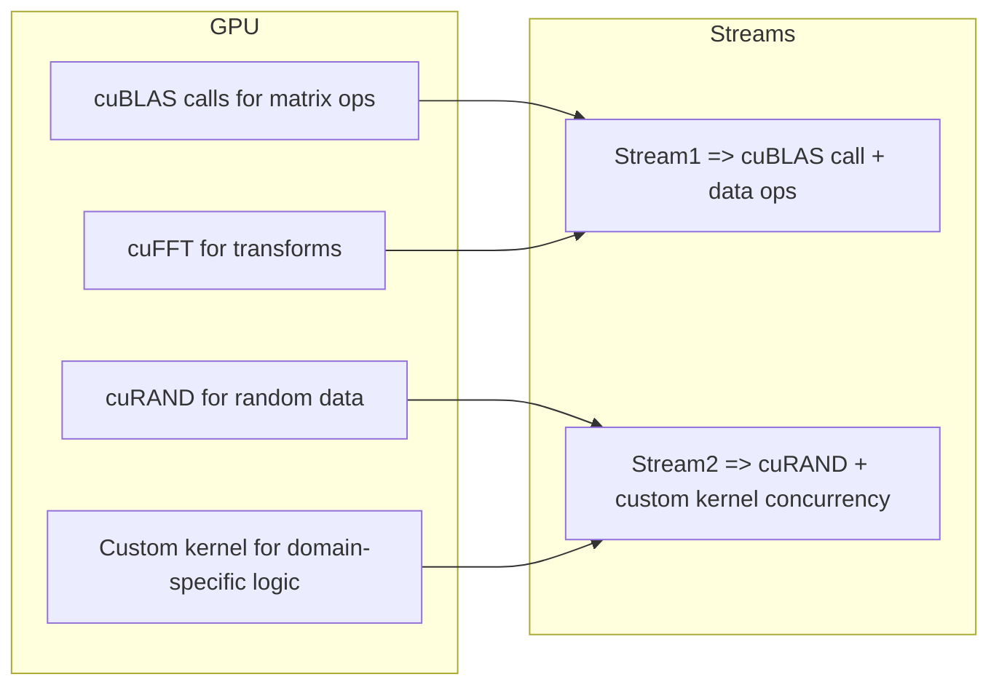

**Explanation**:  
We see multiple streams potentially doing different library ops plus custom kernels concurrently. Each piece is integrated in a HPC pipeline.

---

## 8. Conclusion

**Day 56** – **Progress Checkpoint**:

1. We **recapped** multi-stream concurrency usage, library usage (cuBLAS, cuFFT, cuRAND), and code optimization.  
2. We **highlighted** how ignoring memory or concurrency leads to incomplete optimization.  
3. We **compared** library-based solutions vs. custom kernels, explaining when each approach is beneficial.  
4. We **emphasized** that thorough GPU optimization typically merges concurrency, library usage, and carefully tuned custom kernels if needed.

**Key Takeaway**:  
Bringing **all** your GPU knowledge together—**streams** for concurrency, **libraries** for standard HPC tasks, **custom kernels** for specialized logic, and **both high-level & low-level** optimizations—creates a robust pipeline with strong performance. Avoid the pitfall of focusing on only one area; HPC GPU performance is multi-faceted.

---

## 9. Next Steps

1. **Review** your entire GPU pipeline: identify tasks that map to libraries (BLAS ops, FFT, RNG) vs. specialized tasks needing custom kernels.  
2. **Integrate** concurrency if you have independent tasks or data transfers.  
3. **Refine** memory usage (coalescing, shared usage) to avoid stalls.  
4. **Optimize** custom kernels last, analyzing PTX or unrolling only if it’s compute-bound.  
5. **Profile** each step with Nsight Systems (timeline concurrency) & Nsight Compute (detailed kernel metrics) to ensure a complete approach to performance.  
```

```
# Day 56: Progress Checkpoint – 15 Theoretical Questions & Answers

Below are 15 simple theoretical questions along with their answers to help you review and consolidate your understanding of the key topics from Day 56. These questions cover multi-stream concurrency, device libraries (cuBLAS, cuFFT, cuRAND), code optimization, and the comparison between library-based and custom kernels.

---

### 1. What is multi-stream concurrency in CUDA?
**Answer:**  
Multi-stream concurrency allows you to execute multiple CUDA streams concurrently, overlapping kernel executions and memory transfers. This helps in better utilizing GPU resources by ensuring that while one stream is waiting for data transfers, another stream can execute compute kernels.

---

### 2. How does cuBLAS improve performance in GPU applications?
**Answer:**  
cuBLAS provides highly optimized implementations of BLAS routines (such as GEMM, AXPY, and DOT) that are tuned for NVIDIA GPUs. These routines often outperform custom kernels for standard linear algebra operations because they are developed and maintained by NVIDIA using best-in-class optimization techniques.

---

### 3. What are the advantages of using cuFFT over CPU-based FFT libraries?
**Answer:**  
cuFFT leverages the massive parallelism of GPUs to perform FFTs much faster than CPU-based libraries, especially for large data sizes. It supports 1D, 2D, and 3D transforms and is highly optimized for various data types, leading to significant speedups in applications like signal processing and image analysis.

---

### 4. What functionality does cuRAND provide in GPU programming?
**Answer:**  
cuRAND is a library for generating random numbers directly on the GPU. It supports multiple random number generation algorithms (e.g., XORWOW, Philox) and different probability distributions (uniform, normal, etc.), enabling efficient Monte Carlo simulations and stochastic algorithms without incurring host-device transfer overhead.

---

### 5. Why is loop unrolling beneficial in CUDA kernel optimization?
**Answer:**  
Loop unrolling reduces the overhead of loop control (like increments and condition checks) and increases instruction-level parallelism. When loops have a small and fixed iteration count, unrolling them can reduce branch instructions and help the compiler generate more efficient code.

---

### 6. What does occupancy measure in the context of CUDA, and why is it important?
**Answer:**  
Occupancy measures the ratio of active warps per Streaming Multiprocessor (SM) to the maximum number of warps the SM can support. High occupancy helps hide memory latency and keeps the GPU busy, though it must be balanced with other factors like memory throughput and register usage.

---

### 7. What is the primary difference between library-based and custom CUDA kernels?
**Answer:**  
Library-based kernels (e.g., cuBLAS, cuFFT, cuRAND) are pre-optimized routines for standard operations, offering high performance with minimal development effort. Custom kernels, on the other hand, are tailored for specific applications and can be optimized for unique data patterns but require more development time and careful tuning.

---

### 8. How can ignoring memory metrics lead to an incomplete optimization approach?
**Answer:**  
Focusing solely on compute metrics (like occupancy or instruction throughput) can overlook memory bottlenecks such as poor coalescing, high global memory latency, or cache misses. Both memory and compute performance are critical for overall kernel efficiency, so an optimal solution must consider and balance both aspects.

---

### 9. How do you ensure efficient use of multi-stream concurrency in a GPU application?
**Answer:**  
To efficiently use multi-stream concurrency, you should:
- Divide work into sufficiently large, independent tasks that can run concurrently.
- Overlap data transfers with kernel execution by assigning them to different streams.
- Use synchronization primitives (like CUDA events) to manage dependencies between streams.
- Avoid creating too many streams that can lead to scheduling overhead.

---

### 10. What is a common pitfall when using cuBLAS regarding data layout?
**Answer:**  
cuBLAS assumes column-major ordering by default. If your data is in row-major format (as in standard C/C++), you must either transpose the data or use the appropriate transpose flags (e.g., `CUBLAS_OP_T`) in cuBLAS routines to ensure correct results.

---

### 11. In FFT-based convolution using cuFFT, why is zero-padding important?
**Answer:**  
Zero-padding is crucial in FFT-based convolution to avoid circular (wrap-around) effects. By padding the input and kernel to a size that is at least the sum of their sizes minus one, you ensure that the convolution result corresponds to the linear convolution rather than a circular one.

---

### 12. What are the potential drawbacks of relying solely on custom kernels for linear algebra operations?
**Answer:**  
Custom kernels may lack the extensive optimizations that library-based solutions (like cuBLAS) offer. They can be more error-prone, less portable, and require significant development and tuning effort. For standard operations, library-based implementations are often more efficient and easier to maintain.

---

### 13. How does reducing device-host data transfers improve performance?
**Answer:**  
Reducing device-host data transfers minimizes the overhead associated with copying data across the PCIe bus, which is significantly slower than on-device memory accesses. Keeping data on the device allows you to chain multiple operations (such as several cuBLAS calls) without incurring the cost of repeated transfers, leading to better overall performance.

---

### 14. What is the role of `#pragma unroll` in code optimization?
**Answer:**  
`#pragma unroll` instructs the compiler to unroll loops, which can reduce the loop control overhead and enable better instruction-level parallelism. When applied appropriately, it can lead to faster execution by eliminating branch instructions and allowing the compiler to schedule instructions more efficiently.

---

### 15. How can combining library-based solutions with custom kernels lead to optimal GPU performance?
**Answer:**  
Library-based solutions provide highly optimized routines for standard operations, while custom kernels can be tailored to the unique requirements of your application. By integrating both, you leverage the strengths of each approach: using libraries for common, well-optimized tasks and custom kernels for specialized processing, resulting in a more balanced and high-performance GPU pipeline.

---

# Conclusion

These 15 theoretical questions and answers help reinforce the integrated concepts of multi-stream concurrency, device libraries, and code optimization. A deep understanding of these topics is crucial for building high-performance GPU applications, ensuring that no area—whether memory, compute, or data management—is overlooked.

---

# Next Steps

1. **Integrate and Experiment**:  
   - Combine library-based operations (e.g., cuBLAS, cuFFT, cuRAND) with custom kernels in a small project.
   - Measure performance using tools like Nsight Systems and Nsight Compute.

2. **Profile and Optimize**:  
   - Focus on both compute and memory metrics to identify bottlenecks.
   - Experiment with multi-stream concurrency and various optimization techniques (loop unrolling, register tuning).

3. **Expand Knowledge**:  
   - Dive deeper into each library’s advanced features.
   - Explore case studies and real-world applications that successfully combine these techniques.

Happy CUDA coding, and ensure you keep all aspects of GPU performance in mind to avoid fragmented knowledge!
```

```
# Day 56: Progress Checkpoint – 15 Intermediate Theoretical Questions & Answers

Below are 15 intermediate-level theoretical questions along with detailed answers. These questions cover key concepts from multi-stream concurrency, device libraries (cuBLAS, cuFFT, cuRAND), code optimization strategies, and the trade-offs between library-based and custom kernels. They are designed to help you integrate your knowledge into a coherent GPU performance strategy.

---

### 1. How does multi-stream concurrency help improve GPU utilization, and what factors determine its effectiveness?

**Answer:**  
Multi-stream concurrency allows different independent operations—such as kernel launches and memory transfers—to execute concurrently. Its effectiveness depends on:
- **Independence of Tasks:** Tasks must not have interdependencies that force serialization.
- **Resource Availability:** The GPU must have enough SMs and copy engines to handle multiple streams concurrently.
- **Overlap of Compute and Data Transfer:** When data transfers (using asynchronous memory copies) overlap with kernel execution, overall throughput increases.
- **Proper Synchronization:** Using events to manage dependencies is crucial to avoid race conditions.
Overall, well-structured multi-stream concurrency can significantly boost performance by hiding latency and keeping the GPU busy.

---

### 2. What is the role of CUDA events in synchronizing operations across multiple streams?

**Answer:**  
CUDA events are used to mark specific points in a stream’s execution. When an event is recorded in one stream, it can be used to instruct another stream to wait until that event is completed via `cudaStreamWaitEvent()`. This mechanism ensures that data produced in one stream is ready before being consumed in another, allowing for fine-grained synchronization without requiring a full `cudaDeviceSynchronize()`. This targeted synchronization is essential for maintaining efficiency while overlapping operations.

---

### 3. What are the main advantages of using cuBLAS for matrix operations compared to writing custom kernels?

**Answer:**  
cuBLAS is a highly optimized library for linear algebra operations and offers:
- **Optimized Performance:** Uses best-in-class algorithms and hardware-specific optimizations (including Tensor Core utilization on modern GPUs).
- **Ease of Use:** Provides simple API calls (e.g., `cublasSgemm`) that require less code than custom kernels.
- **Reliability and Portability:** Tested across many GPU architectures, reducing the likelihood of bugs in critical operations.
- **Time Savings:** Allows developers to focus on higher-level algorithm design rather than low-level optimization.
Custom kernels, while flexible, often require significant effort to match the performance of cuBLAS for standard operations.

---

### 4. Under what circumstances would you choose to use cuFFT over a custom FFT implementation?

**Answer:**  
You would choose cuFFT when:
- **Performance Matters:** cuFFT is optimized for large-scale FFT computations, often outperforming custom implementations.
- **Complexity Reduction:** Implementing an FFT from scratch is non-trivial; cuFFT abstracts the complexity.
- **Support for 1D, 2D, and 3D FFTs:** cuFFT handles multiple dimensions and batch processing efficiently.
- **Consistency and Portability:** Using a standardized library ensures that your FFT routines benefit from NVIDIA’s ongoing optimizations and support across different GPU architectures.
Custom FFTs might be used if you have specialized requirements that deviate from standard FFT patterns, but generally, cuFFT is preferred for most applications.

---

### 5. What are the trade-offs between using cuRAND’s host API and device API for random number generation?

**Answer:**  
**Host API (curandCreateGenerator, curandGenerateUniform/Normal):**
- **Pros:**  
  - Simpler to implement; generates large arrays of random numbers in one call.
  - Offloads random number generation to the GPU efficiently without per-thread state initialization.
- **Cons:**  
  - Involves a single call to generate a large random array, which may not be as flexible if random numbers are needed dynamically during kernel execution.

**Device API (curandState, curand_init, curand_uniform):**
- **Pros:**  
  - Offers more control; each thread maintains its own RNG state.
  - Suitable for algorithms requiring on-the-fly random number generation.
- **Cons:**  
  - Requires careful state initialization in every thread.
  - Can incur extra overhead if each thread generates a small number of random numbers.
Choosing between them depends on your application needs—use the host API for large, batched random number generation and the device API for more dynamic, thread-local generation.

---

### 6. How does occupancy affect kernel performance, and what factors can lead to low occupancy?

**Answer:**  
Occupancy is the ratio of active warps per SM to the maximum possible warps. High occupancy can help hide latency by allowing the GPU to switch between warps when one is stalled (e.g., waiting for memory). Factors that can lead to low occupancy include:
- **Excessive Register Usage:** If each thread uses many registers, fewer threads can be scheduled.
- **High Shared Memory Usage:** Large per-block shared memory allocations reduce the number of blocks that can reside on an SM.
- **Inefficient Block Dimensions:** Non-optimal thread/block configurations that do not fully utilize SM resources.
- **Branch Divergence:** Can indirectly affect occupancy if divergent execution causes some warps to be underutilized.
Thus, balancing resource usage is key to maximizing occupancy and overall performance.

---

### 7. Under what conditions might a custom kernel outperform a library routine, and vice versa?

**Answer:**  
**Custom Kernels:**
- May outperform libraries when your application requires **specialized or non-standard** operations that are not covered by library routines.
- Allow for **tailored optimizations** for specific data patterns or algorithms.
- Can be better if you need to combine multiple operations in one kernel, reducing intermediate memory transfers.

**Library Routines:**
- Generally provide **highly optimized** implementations for standard operations (e.g., GEMM, FFT).
- Are maintained by NVIDIA and benefit from continual improvements and hardware-specific optimizations.
- Reduce development time and are more **robust** for general use cases.
In many cases, library routines are preferred for standard tasks due to their optimization and ease of use, while custom kernels are best for niche applications requiring specialized behavior.

---

### 8. How does memory coalescing impact custom kernel performance?

**Answer:**  
Memory coalescing ensures that threads in a warp access consecutive memory addresses, resulting in a single, efficient memory transaction rather than many smaller ones. When memory accesses are coalesced:
- **Bandwidth Utilization Increases:** More efficient use of memory bandwidth.
- **Latency Reduction:** Fewer memory transactions reduce overall latency.
- **Energy Efficiency:** Fewer transactions mean lower power consumption.
Poor memory coalescing, on the other hand, results in multiple memory requests per warp, increasing latency and reducing performance. Optimizing data layout and access patterns is essential to achieve coalesced accesses.

---

### 9. What are the main drawbacks of frequent host-device transfers, and how can they be minimized?

**Answer:**  
Frequent host-device transfers can significantly slow down a GPU application because:
- **PCIe Bandwidth Limitations:** The PCIe bus is much slower than on-device memory accesses.
- **High Latency:** Transfers introduce latency that can nullify the benefits of GPU acceleration.
- **CPU Overhead:** The CPU may become a bottleneck if it’s managing many transfer calls.
To minimize these transfers:
- **Keep Data on Device:** Chain operations to process data entirely on the GPU.
- **Batch Transfers:** Instead of transferring data frequently, accumulate results and transfer them in bulk.
- **Use Zero-Copy/Pinned Memory:** For small data, these techniques can reduce transfer overhead.
By reducing unnecessary transfers, overall application throughput can be improved.

---

### 10. How does loop unrolling improve kernel performance, and what are its potential downsides?

**Answer:**  
**Loop unrolling** minimizes loop overhead (such as incrementing counters, checking conditions, and branching), which can improve performance by increasing instruction-level parallelism and reducing divergence. However, potential downsides include:
- **Code Size Increase:** Larger unrolled loops can lead to increased binary size, which might negatively impact instruction cache performance.
- **Increased Register Usage:** Unrolled loops might require more registers, potentially reducing occupancy if registers are a limiting factor.
- **Diminishing Returns:** Beyond a certain point, the performance gains from unrolling become marginal.
Thus, loop unrolling should be applied judiciously, especially in performance-critical sections where the loop count is small and known at compile time.

---

### 11. Explain the importance of memory layout when using cuBLAS routines.

**Answer:**  
cuBLAS expects matrices in **column-major** format by default. If your data is in **row-major** format (as is common in C/C++), you must either transpose the data or set appropriate transpose flags (e.g., `CUBLAS_OP_T`) in the cuBLAS call. Incorrect memory layout can lead to erroneous results or suboptimal performance because the memory access patterns may not align with the optimized algorithms in cuBLAS.

---

### 12. What is the role of data batching in cuFFT, and how does it improve performance?

**Answer:**  
Batching in cuFFT allows you to perform multiple FFTs concurrently using a single plan. This reduces overhead by avoiding multiple plan creations and repeated kernel launches. Batching improves performance by:
- **Parallel Execution:** Multiple FFTs are computed concurrently on the GPU.
- **Reduced Overhead:** Only one plan is created, and data can be processed in parallel.
- **Memory Efficiency:** Data is often stored contiguously in memory, improving coalescing.
Using the batch parameter is particularly beneficial when processing many small signals or images.

---

### 13. How can using cuRAND in a device API (per-thread RNG) approach differ from using the host API?

**Answer:**  
In the **device API** approach, each thread initializes its own `curandState` using `curand_init()` and then generates random numbers (e.g., via `curand_uniform()`) on-the-fly. This provides more flexibility for algorithms that require random numbers during kernel execution. However, it can increase per-thread overhead due to state initialization.  
In contrast, the **host API** generates a large batch of random numbers in one call (e.g., `curandGenerateUniform()`), which is more efficient when the entire dataset is needed at once. The choice depends on whether randomness is needed dynamically during kernel execution or as a pre-generated dataset.

---

### 14. Describe how grid synchronization via cooperative groups can benefit a multi-step kernel pipeline.

**Answer:**  
Grid synchronization via cooperative groups (using `this_grid().sync()`) allows all threads in a grid to synchronize at a certain point within the kernel, rather than having to return to the host for synchronization. This is beneficial when multiple phases of computation need to coordinate on the same data, reducing the overhead of launching separate kernels for each phase. It enables a more tightly coupled multi-step pipeline on the GPU, although it requires hardware and launch configuration that support cooperative launch.

---

### 15. What is the significance of using pointer modes (host vs. device) in cuBLAS and cuFFT, and how can it affect performance?

**Answer:**  
In cuBLAS and cuFFT:
- **Host Pointer Mode**: Scalars (e.g., alpha and beta) are provided as host pointers. The library internally copies these values to the device. This is simple but can incur minor overhead.
- **Device Pointer Mode**: Scalars reside in device memory and are passed as device pointers. This mode can reduce overhead in scenarios where many operations are chained together, as it avoids repeated host-device transfers for scalar values.
Choosing the right pointer mode is crucial for performance when operations are chained, ensuring minimal data transfer overhead and maximizing efficiency.

---

# Conclusion

These 15 intermediate theoretical questions and answers help reinforce a coherent understanding of the integrated topics covered in Day 56. They focus on:
- Multi-stream concurrency
- Device library usage (cuBLAS, cuFFT, cuRAND)
- Memory layout and transfers
- Code optimization techniques
- The trade-offs between library-based solutions and custom kernels

Understanding these aspects is essential to avoid fragmented knowledge and achieve the best overall performance in GPU-accelerated applications.

---

# Next Steps

1. **Implement a Hybrid Application:**  
   - Build a small project that uses multi-stream concurrency with cuBLAS, cuFFT, and custom kernels.
2. **Profile and Optimize:**  
   - Use Nsight Systems and Nsight Compute to fine-tune occupancy, memory transfers, and kernel execution times.
3. **Refine Custom Kernels:**  
   - Compare your custom kernels with library calls, and optimize based on real performance data.
4. **Explore Advanced Libraries:**  
   - Look into Thrust for high-level operations and cublasLt for Tensor Core optimization.

Happy CUDA coding, and keep refining your integrated HPC GPU development skills!
```

```
# Day 56: Progress Checkpoint – 15 Advanced & Highly Advanced Theoretical Questions & Answers

Below are 15 advanced theoretical questions along with detailed answers. These questions delve into the nuanced interplay between multi-stream concurrency, device libraries (cuBLAS, cuFFT, cuRAND), code optimizations, and the integration of library-based routines with custom kernels. They are designed to ensure a deep, holistic understanding of building high-performance GPU pipelines.

---

### 1. How does the interplay between memory coalescing and multi-stream concurrency affect overall GPU throughput in a complex HPC application?

**Answer:**  
Memory coalescing ensures that threads within a warp access consecutive memory locations, which minimizes the number of memory transactions and maximizes bandwidth. When combined with multi-stream concurrency:
- **Positive Impact:** Multiple streams can hide memory latency by overlapping data transfers and kernel execution if memory accesses are coalesced.
- **Challenges:** If memory accesses are non-coalesced, even with concurrent streams, bandwidth may become a bottleneck. Additionally, excessive streams can saturate the memory subsystem if each stream’s kernel performs scattered accesses.
- **Overall:** A balanced design that ensures coalesced memory accesses in each stream while overlapping independent data transfers and compute kernels leads to optimal throughput.

---

### 2. In a pipeline mixing cuBLAS and custom kernels, how can you balance register usage and occupancy to maximize performance?

**Answer:**  
Balancing register usage and occupancy is critical:
- **cuBLAS Routines:** These are highly optimized and typically use a fixed number of registers tuned for performance. Custom kernels should be designed to complement these routines without introducing register pressure.
- **Strategies:**
  - **Use `-maxrregcount` or `__launch_bounds__()`** in custom kernels to limit register usage, increasing occupancy.
  - **Profile register usage** with Nsight Compute to ensure that custom kernels do not spill registers to local memory.
  - **Overlap:** Ensure that data generated by cuBLAS remains on device memory so that custom kernels can work on it without incurring additional transfers.
- **Trade-off:** Reducing register usage too aggressively may force spills, so it's a balancing act that requires careful profiling and iterative tuning.

---

### 3. When integrating library-based operations (e.g., cuFFT, cuBLAS) with custom kernels, what techniques can minimize data transfer overhead between operations?

**Answer:**  
Minimizing data transfers is key for performance:
- **Keep Data on Device:** Once data is loaded into device memory, chain multiple library calls and custom kernels so that data remains on the GPU.
- **Batch Processing:** Use batched operations (e.g., batched cuFFT) to process many datasets in a single call.
- **Stream Synchronization:** Use streams and events to coordinate operations so that transfers are overlapped with compute.
- **Unified Memory:** Consider using Unified Memory (if appropriate) to reduce explicit transfers, though this may not be ideal for high-bandwidth operations.
- **Data Layout Consistency:** Ensure that data structures are compatible between library calls and custom kernels to avoid unnecessary reformatting or copying.

---

### 4. What are the benefits and limitations of using cooperative groups for grid-wide synchronization in a multi-step GPU pipeline?

**Answer:**  
**Benefits:**
- **Fine-Grained Synchronization:** Cooperative groups allow threads across blocks to synchronize within a single kernel, avoiding host-device synchronization overhead.
- **Improved Data Sharing:** They enable more complex algorithms where later stages depend on results computed by all threads.
  
**Limitations:**
- **Hardware & Launch Constraints:** Grid-wide synchronization is only available on GPUs that support cooperative launch and with specific kernel launch configurations.
- **Potential Performance Penalties:** Overusing grid-wide sync can serialize parts of the computation, reducing overall concurrency.
- **Complexity:** Managing synchronization across an entire grid can complicate kernel design and error handling.

---

### 5. How can Nsight Compute be used to diagnose whether a kernel is primarily memory-bound or compute-bound, and why is it important to consider both aspects?

**Answer:**  
Nsight Compute provides detailed metrics such as:
- **Occupancy and Warp Stall Reasons:** High memory dependency stalls indicate a memory-bound kernel, while high arithmetic intensity with low memory throughput suggests compute-bound.
- **Memory Throughput vs. Theoretical Peak:** If global memory bandwidth utilization is near the hardware peak, the kernel is memory-bound.
- **Instruction Mix:** A predominance of floating-point operations with minimal memory instructions indicates a compute-bound kernel.
  
**Importance:**
- **Complete Optimization:** Focusing solely on compute metrics may lead you to optimize arithmetic operations when the real bottleneck is memory latency or vice versa.
- **Targeted Improvements:** Identifying the primary bottleneck allows for specific optimizations—improving memory coalescing or increasing instruction-level parallelism.

---

### 6. What are the trade-offs between using device pointer mode and host pointer mode in cuBLAS when chaining multiple operations?

**Answer:**  
- **Host Pointer Mode (Default):**
  - **Pros:** Simpler API; scalars are stored on the host and copied internally.
  - **Cons:** Extra overhead if many operations are chained, as each call requires a host-to-device transfer for scalar values.
  
- **Device Pointer Mode:**
  - **Pros:** Scalars are in device memory, reducing host-device transfer overhead, which is beneficial for chained operations.
  - **Cons:** Requires additional management to allocate and update scalars on the device; potential for increased complexity.
  
**Trade-off:**  
For applications with many sequential library calls, using device pointer mode can reduce latency, but it adds management complexity. The decision depends on the number of operations and the criticality of scalar transfers to overall performance.

---

### 7. In what scenarios might a mixed approach (combining Thrust operations with custom kernels) outperform using only one method exclusively?

**Answer:**  
A mixed approach is beneficial when:
- **Standard Operations:** Common tasks like sorting, reduction, and transforms are efficiently handled by Thrust.
- **Specialized Computations:** Custom kernels can be tailored for domain-specific operations that do not map well to standard library routines.
- **Data Pipelines:** When you need to preprocess or postprocess data that’s not directly supported by Thrust, integrating custom kernels ensures complete control over the workflow.
- **Overhead Reduction:** Thrust minimizes development time and code complexity for standard operations, while custom kernels optimize performance-critical sections.
  
This approach leverages the strengths of each: libraries for well-optimized standard tasks and custom code for specialized needs.

---

### 8. How does the use of batched operations in cuFFT improve performance, and what considerations must be made when designing batched transforms?

**Answer:**  
**Batched Operations** in cuFFT allow multiple FFTs to be computed concurrently in a single call:
- **Performance Improvements:** Reduces kernel launch overhead by creating a single plan for multiple datasets.
- **Resource Utilization:** Enables better parallel utilization of GPU resources.
  
**Considerations:**
- **Data Layout:** The input data for batched FFTs must be stored contiguously in memory.
- **Plan Parameters:** Ensure that the batch size and transform size are set correctly in the plan.
- **Memory Constraints:** Larger batches require more device memory; ensure that the GPU has sufficient capacity.
- **Padding:** For non-power-of-2 sizes, zero-padding may be necessary to maximize performance and avoid artifacts.

---

### 9. Describe the potential impact of improper data layout on the performance of cuBLAS routines.

**Answer:**  
Improper data layout, such as using row-major order with a library that assumes column-major order, can lead to:
- **Incorrect Results:** Mathematical operations may produce wrong outputs if the layout is misinterpreted.
- **Suboptimal Memory Access:** Non-optimal access patterns cause inefficient memory coalescing, resulting in increased memory transactions and lower throughput.
- **Additional Overhead:** Extra data transposition steps may be required, introducing unnecessary memory copies and latency.
  
Optimizing data layout ensures that library routines perform at peak efficiency by aligning with the expected memory access patterns.

---

### 10. How can integrating cooperative groups with library-based operations enhance synchronization in a complex GPU pipeline?

**Answer:**  
Cooperative groups allow for advanced synchronization across threads within a block or even across an entire grid (on supported hardware). When integrated with library-based operations:
- **Fine-Grained Sync:** They can coordinate multi-step pipelines (e.g., between a cuFFT transform and a custom post-processing kernel) without returning to the host.
- **Reduced Overhead:** Minimizes the latency associated with host-side synchronization.
- **Enhanced Data Sharing:** Facilitates the sharing of intermediate results across threads more flexibly than standard `__syncthreads()`.
  
This leads to more cohesive and efficient pipelines, especially when mixing custom kernels with library calls.

---

### 11. What challenges arise when combining cuRAND-generated random numbers with a custom Monte Carlo kernel in a multi-stream environment?

**Answer:**  
Challenges include:
- **Synchronization:** Ensuring that the random numbers are fully generated and available in device memory before the Monte Carlo kernel starts.
- **Data Consistency:** If multiple streams are used, ensuring that random data generation does not interfere with concurrent Monte Carlo computations.
- **Seed Management:** Each stream or kernel must have unique seeds or state initialization to avoid correlated random numbers.
- **Memory Transfers:** Minimizing host-device transfers if random numbers are generated on the host via cuRAND and then used in a device kernel.
  
Proper stream management, unique seeding per stream, and careful orchestration of transfers are essential to overcome these challenges.

---

### 12. How do memory transfers and kernel launches interplay in terms of overall GPU performance in a complex application?

**Answer:**  
Memory transfers and kernel launches are both significant contributors to overall GPU performance:
- **Memory Transfers:** Host-device transfers are relatively slow compared to on-device memory accesses. Minimizing these transfers is critical, often by chaining multiple operations on the device.
- **Kernel Launch Overhead:** Frequent, small kernel launches can introduce overhead. Using techniques like batching or merging operations can reduce this.
- **Overlap:** Using multi-stream concurrency allows memory transfers to overlap with kernel execution, mitigating some transfer costs.
  
A balanced design minimizes transfers and launch overhead while maximizing on-device computation.

---

### 13. What is the effect of instruction-level optimizations (e.g., loop unrolling) on PTX and final SASS, and why is this analysis important?

**Answer:**  
Instruction-level optimizations like loop unrolling can:
- **Reduce Loop Overhead:** Eliminate branch instructions and loop control operations.
- **Increase ILP:** Allow the GPU to schedule more instructions concurrently.
- **Impact Register Usage:** Unrolling loops can increase register pressure, which might reduce occupancy if not managed.
  
Analyzing the generated PTX and final SASS is important to:
- Verify that the intended optimizations are applied.
- Ensure that there are no unintended side effects (like register spills).
- Understand the actual instructions executed, which helps in fine-tuning performance.

---

### 14. How can you effectively integrate custom kernels with library-based operations to form a cohesive GPU pipeline?

**Answer:**  
Effective integration involves:
- **Data Residency:** Keeping data in device memory across custom kernel calls and library routines to minimize transfers.
- **Consistent Data Layout:** Ensuring that the data format matches between custom kernels and libraries (e.g., row-major vs. column-major).
- **Stream Coordination:** Using multiple streams to overlap computation where library calls and custom kernels are independent.
- **Synchronization:** Employing CUDA events or cooperative groups to synchronize operations when data dependencies exist.
- **Profiling and Tuning:** Regularly profiling the pipeline with tools like Nsight Compute and Nsight Systems to ensure that bottlenecks are addressed.
  
This integration allows each component to perform optimally, leveraging library optimizations where possible and custom kernels for specialized tasks.

---

### 15. What strategies would you employ to ensure that a GPU pipeline using both custom kernels and library routines does not become fragmented, leading to missed performance opportunities?

**Answer:**  
Strategies include:
- **Holistic Profiling:** Use Nsight Systems and Nsight Compute to profile the entire pipeline, ensuring that every stage (memory transfers, kernel execution, library routines) is optimized.
- **Minimize Data Transfers:** Keep data on the device as long as possible, chaining operations together.
- **Unified Memory Management:** Where feasible, use unified memory or well-structured device arrays to avoid fragmentation.
- **Consistent Optimization Goals:** Balance high-level algorithmic improvements (e.g., data layout, concurrency) with low-level optimizations (e.g., loop unrolling, register tuning) so that the entire pipeline is tuned.
- **Iterative Integration:** Build the pipeline step by step, profiling after integrating each module, and adjust based on the observed bottlenecks.
- **Documentation and Standards:** Maintain clear coding standards and documentation so that custom kernels and library calls are developed with the overall architecture in mind, ensuring compatibility and performance synergy.

---

# Conclusion

These 15 advanced theoretical questions and answers provide a deep understanding of how multi-stream concurrency, device libraries, and code optimization techniques integrate to form a high-performance GPU pipeline. They emphasize the importance of balancing memory, compute, and synchronization aspects while combining library-based solutions with custom kernels.

---

# Next Steps

1. **Implement a Hybrid Pipeline:**  
   - Build a small application that uses cuBLAS, cuFFT, and cuRAND alongside custom kernels.
2. **Profile and Analyze:**  
   - Use Nsight Compute to monitor occupancy, memory throughput, and instruction mix.
3. **Iteratively Optimize:**  
   - Apply improvements based on profiling feedback and re-integrate custom kernels or library calls as needed.
4. **Document & Benchmark:**  
   - Maintain detailed documentation of performance gains and trade-offs.
5. **Explore Further:**  
   - Investigate advanced topics like cooperative groups and multi-GPU strategies for further optimization.
```

```
# Day 56: Progress Checkpoint – 10 God-Level Tier Theoretical Questions & Answers

Below are 10 highly advanced, in-depth theoretical questions with detailed answers designed for a “God-level” understanding of GPU performance and optimization. These questions integrate concepts from multi-stream concurrency, device libraries (cuBLAS, cuFFT, cuRAND), custom kernel optimization, and holistic HPC pipeline design. Mastery of these questions will demonstrate an expert-level grasp of GPU architecture, performance trade-offs, and the integration of various optimization strategies.

---

### 1. How can a designer achieve near-optimal throughput in a heterogeneous GPU pipeline by balancing multi-stream concurrency, library calls, and custom kernels, while minimizing memory transfer overhead?

**Answer:**  
Achieving near-optimal throughput requires a holistic design that considers:
- **Data Residency:** Minimize host-device transfers by keeping data in device memory across multiple operations. Use pinned memory and zero-copy judiciously to reduce transfer overhead.
- **Stream Overlap:** Partition the workload into independent tasks that can run in separate CUDA streams. Use CUDA events to synchronize inter-stream dependencies, ensuring that data dependencies do not force serial execution.
- **Library Integration:** Utilize highly optimized libraries (cuBLAS, cuFFT, cuRAND) for standard operations while designing custom kernels only for domain-specific computations. This ensures that each task is executed with near-peak efficiency.
- **Memory Coalescing & Data Layout:** Arrange data to maximize memory coalescing, ensuring that memory transactions are as efficient as possible. This often requires aligning data in memory, choosing the correct layout (row-major vs. column-major) based on the library’s expectations, and sometimes reordering data in custom kernels.
- **Profiling & Iteration:** Use tools like Nsight Compute and Nsight Systems to profile every stage. Identify whether a kernel is memory-bound or compute-bound and adjust block sizes, register usage (using `-maxrregcount` or `__launch_bounds__()`), and unrolling factors accordingly.
- **Theoretical Limits:** Recognize that the theoretical maximum throughput is bounded by both the GPU’s peak memory bandwidth and compute capability. Balancing these involves ensuring that neither resource is a chronic bottleneck—if memory operations dominate, then further compute optimizations yield diminishing returns.
  
In summary, the designer must orchestrate a pipeline where operations are carefully chained, with minimal unnecessary data movement, and each component is tuned via both high-level algorithmic choices and low-level hardware-specific optimizations.

---

### 2. Under what circumstances might a custom kernel outperform a library routine like cuBLAS, and what are the theoretical limits of such custom optimizations in terms of latency and throughput?

**Answer:**  
A custom kernel can outperform library routines when:
- **Specialized Data Patterns:** The problem exhibits a highly specialized structure (e.g., irregular sparsity, non-standard matrix layouts) that generic libraries cannot exploit.
- **Combined Operations:** When multiple small operations can be fused into a single kernel, avoiding intermediate global memory writes and reducing kernel launch overhead.
- **Latency-Critical Tasks:** In scenarios where reducing latency is more critical than achieving maximum throughput, custom kernels can be optimized for low latency by minimizing synchronization and memory access overhead.
  
**Theoretical Limits:**
- **Compute Bound:** Custom kernels are ultimately limited by the GPU’s peak FLOPs, and the overhead of instruction scheduling and register usage. Achieving near-peak performance requires highly optimized code that minimizes idle cycles.
- **Memory Bound:** For memory-bound tasks, the ceiling is set by the GPU’s effective memory bandwidth. Even if compute optimizations are made, if the data access patterns are not optimized (e.g., coalesced accesses), throughput cannot exceed the memory subsystem’s limits.
- **Kernel Launch Overhead:** For very fine-grained tasks, the kernel launch overhead can dominate, making a fused kernel (or library routine) more efficient.
  
Thus, while custom kernels can provide a performance edge for niche or fused operations, they face the same physical limits of the hardware, and the optimization gains are incremental once standard library routines already achieve near-peak performance.

---

### 3. Explain how register pressure and shared memory usage impact occupancy, and describe a systematic approach to optimize these resources using PTX and Nsight Compute.

**Answer:**  
**Register Pressure and Shared Memory Usage:**
- **Registers:** Each SM has a fixed number of registers. High per-thread register usage reduces the number of threads (warps) that can be active concurrently. This can lower occupancy and hinder the GPU’s ability to hide memory latency.
- **Shared Memory:** Similarly, each SM has a limited amount of shared memory. Large per-block shared memory allocations restrict the number of blocks that can reside concurrently on an SM, reducing overall occupancy.

**Systematic Optimization Approach:**
1. **Profiling with Nsight Compute:**  
   - Measure per-thread register usage, shared memory usage, and occupancy.
   - Identify if register spills are occurring (warnings from ptxas or Nsight Compute metrics).
2. **Analyze PTX:**  
   - Generate PTX code with `-ptx` flags to inspect how loops are unrolled and whether redundant computations exist.
   - Check for unnecessary temporary variable usage that might be inflating register counts.
3. **Apply Compiler Directives:**  
   - Use `#pragma unroll` to reduce loop overhead and enable better scheduling.
   - Utilize `__launch_bounds__()` to guide the compiler’s register allocation strategy.
   - Experiment with `-maxrregcount` to see if a lower limit can improve occupancy without causing spills.
4. **Iterative Tuning:**  
   - Modify kernel code to reduce shared memory usage (e.g., using warp shuffle intrinsics to reduce reliance on shared memory).
   - Re-profile after each change to confirm improvements.
5. **Balancing Act:**  
   - Understand that reducing registers too much may cause local memory spills, which are slower. Use PTX and SASS inspection (via cuobjdump) to verify that register usage is optimal.
  
By combining profiling and low-level analysis, you can adjust your kernel parameters for a balanced use of registers and shared memory, thereby maximizing occupancy and overall performance.

---

### 4. How does cooperative group synchronization within a grid affect overall pipeline performance, and what are the hardware and software constraints that must be considered?

**Answer:**  
**Cooperative groups** allow for synchronization at levels beyond a single block (e.g., across an entire grid) when hardware and software support it. This can be useful for:
- **Tightly Coupled Pipelines:** Where subsequent computations depend on results produced by all threads in the grid.
- **Reduction of Host Overhead:** Avoiding multiple kernel launches by synchronizing within the device.
  
**Impact on Performance:**
- **Positive Impact:** Can eliminate the latency of host-device synchronization, thus reducing overall pipeline delay.
- **Negative Impact:** Improper use can serialize parts of the computation, reducing parallelism, or force all threads to wait, which can be detrimental if only a subset of data is needed.
  
**Constraints:**
- **Hardware Requirements:** Grid-wide synchronization (using `this_grid().sync()`) is only supported on GPUs that support cooperative launch and requires kernels to be launched in a cooperative mode.
- **Software Constraints:** The kernel must be designed with these synchronization points in mind. Failure to synchronize correctly can lead to race conditions or incorrect results.
- **Scalability:** Synchronizing an entire grid can become a bottleneck if not all threads are performing useful work concurrently.
  
In summary, while cooperative groups enable powerful synchronization mechanisms, they must be used judiciously under the right hardware and launch conditions to truly enhance performance.

---

### 5. Discuss the theoretical and practical implications of using batched operations in cuFFT for large-scale signal processing.

**Answer:**  
**Theoretical Implications:**
- **Efficiency Gains:** Batched operations reduce kernel launch overhead by processing multiple FFTs concurrently using a single plan. This can theoretically approach the peak throughput of the GPU by maximizing parallelism.
- **Resource Utilization:** With batched FFTs, the GPU’s SMs and memory subsystems are used more efficiently because data is laid out contiguously, and kernels are launched once for many operations.
  
**Practical Implications:**
- **Memory Layout:** The input for batched FFTs must be contiguous and properly padded if necessary. Incorrect layout can lead to suboptimal performance or even erroneous results.
- **Plan Complexity:** Creating a batched plan requires careful parameter selection (batch size, FFT length) and might require different optimization considerations than a single FFT.
- **Scalability:** Batched operations can scale well on large datasets (e.g., processing multiple signals or images simultaneously), but the overall performance is bounded by the GPU’s memory bandwidth and compute capacity.
- **Error Handling:** Debugging batched operations can be more challenging because errors in one batch might affect the entire plan.
  
Overall, batched operations in cuFFT are theoretically sound for maximizing throughput in signal processing, but they require careful attention to data layout, plan configuration, and resource management.

---

### 6. What are the consequences of ignoring device memory layout (e.g., row-major vs. column-major) when integrating custom kernels with library routines like cuBLAS?

**Answer:**  
Ignoring memory layout can lead to:
- **Incorrect Results:** Since cuBLAS assumes column-major order by default, providing row-major data without proper transposition or flag adjustments (e.g., using `CUBLAS_OP_T`) will yield mathematically incorrect results.
- **Suboptimal Memory Access Patterns:** The performance of library routines relies on coalesced memory accesses. Mismatched layouts can lead to non-coalesced accesses, causing inefficient memory transactions and reduced throughput.
- **Extra Overhead:** To correct for layout mismatches, you might need to perform explicit matrix transpositions or additional data copies, which introduce significant overhead.
  
Thus, a deep understanding and careful management of data layout is critical when combining custom kernels with standard libraries to achieve both correctness and high performance.

---

### 7. How can integrating advanced compiler directives (such as `#pragma unroll` and `-maxrregcount`) affect the final PTX and SASS output, and what are the implications for performance?

**Answer:**  
Advanced compiler directives:
- **`#pragma unroll`:**  
  - Instructs the compiler to unroll loops, which should eliminate loop control overhead and potentially expose more parallelism.  
  - The final PTX code will show either fully unrolled loops (repeated instructions) or partially unrolled loops if the compiler decides not to unroll fully due to code size constraints.
- **`-maxrregcount`:**  
  - Limits the number of registers each thread can use, which can force the compiler to optimize register allocation.  
  - This might result in lower occupancy if the code is forced to spill registers to local memory (which resides in global memory), causing additional memory accesses.

**Implications for Performance:**
- **Positive:**  
  - Reduced loop overhead, increased instruction-level parallelism, and higher occupancy if registers are optimized.
- **Negative:**  
  - If directives force register spills or excessive code expansion, it may lead to increased latency or instruction cache misses.
  
Analyzing PTX and SASS helps verify that these optimizations are effective. Ultimately, the directive’s success is measured by the actual performance improvement on the target GPU.

---

### 8. Describe the impact of varying stream priorities on the performance of concurrent cuBLAS and custom kernels.

**Answer:**  
Stream priorities allow you to control the scheduling order when multiple streams compete for GPU resources:
- **Higher Priority Streams:** Kernels and memory operations in high-priority streams can preempt lower-priority ones, ensuring that latency-sensitive tasks are executed promptly.
- **Impact on Performance:**  
  - If critical cuBLAS routines are in a high-priority stream, they may run faster, reducing overall latency in a pipeline.
  - However, excessive use of high-priority streams can lead to resource contention, where lower-priority streams starve or suffer increased latency.
- **Balancing Act:**  
  - Priorities should be used to ensure that critical computations get preferential treatment without entirely starving background tasks.
  
In an HPC pipeline, careful allocation of stream priorities can optimize overall throughput while meeting real-time or latency constraints.

---

### 9. In what ways does dynamic parallelism alter the scheduling and resource allocation on the GPU compared to host-launched kernels, and what theoretical limits exist for its scalability?

**Answer:**  
**Dynamic Parallelism:**
- **Scheduling:**  
  - Kernels launched from device code (sub-kernels) are scheduled by the GPU’s hardware similarly to host-launched kernels, but they are generated “on the fly.”  
  - This can allow more fine-grained, adaptive execution, but introduces additional scheduling overhead per kernel launch.
- **Resource Allocation:**  
  - Each sub-kernel launch consumes resources (registers, shared memory) and may lead to fragmentation if not managed well.
  - The scalability is limited by the GPU’s ability to handle numerous concurrent small kernel launches without significant overhead.
  
**Theoretical Limits:**  
- **Overhead Accumulation:** With too many sub-kernels, the scheduling overhead can dominate, reducing throughput.
- **Resource Saturation:** Hardware limits on simultaneous kernel launches and memory (register/shared) can constrain scalability.
  
Dynamic parallelism is best suited for adaptive or hierarchical algorithms rather than for flat, high-throughput tasks.

---

### 10. What strategies would you use to diagnose and resolve bottlenecks when a GPU pipeline appears to have fragmented performance gains, and how do you ensure that all aspects (compute, memory, and concurrency) are addressed?

**Answer:**  
**Diagnosis Strategies:**
- **Profiling Tools:**  
  - Use Nsight Compute to measure occupancy, memory throughput, and instruction mix.
  - Use Nsight Systems to visualize timeline concurrency, kernel launch overhead, and data transfer timings.
- **Isolation Testing:**  
  - Test each component (custom kernels, cuBLAS, cuFFT, cuRAND) individually to identify which stage has diminishing returns.
- **Benchmarking:**  
  - Compare library calls versus custom implementations for specific tasks.
  
**Resolution Strategies:**
- **Optimize Memory Transfers:**  
  - Minimize host-device transfers; use pinned memory and zero-copy where appropriate.
- **Balance Compute and Memory:**  
  - If a kernel is memory-bound, focus on memory coalescing, caching, and efficient data layouts.
  - For compute-bound kernels, refine unrolling, register usage, and instruction-level parallelism.
- **Consolidate Streams:**  
  - Ensure that streams are not oversubscribed and that operations are properly synchronized to maximize concurrency.
  
By systematically profiling and isolating each part of the pipeline, you ensure that improvements are holistic rather than fragmented.

---

### 11. How do you theoretically model the trade-off between increased occupancy and potential register spills when applying aggressive register usage limits?

**Answer:**  
The trade-off can be modeled by considering:
- **Occupancy:**  
  - Higher occupancy improves the GPU’s ability to hide latency, which is beneficial for performance.
- **Register Spills:**  
  - Limiting registers per thread can force the compiler to spill registers to local memory (which is off-chip), significantly increasing memory latency.
  
**Modeling Approach:**
- **Quantitative Metrics:**  
  - Use the occupancy calculator to estimate theoretical occupancy gains vs. measured register spills.
- **Performance Equation:**  
  - Model the effective throughput as a function of occupancy and the extra latency introduced by spills. The net gain is positive only if the latency reduction due to increased occupancy outweighs the additional memory accesses caused by spills.
  
This balance is highly application-specific and requires empirical tuning via profiling tools.

---

### 12. Explain the importance of maintaining a consistent data layout (e.g., row-major vs. column-major) across custom kernels and library calls in a heterogeneous pipeline.

**Answer:**  
Consistent data layout is crucial because:
- **Correctness:**  
  - Libraries like cuBLAS assume column-major order by default, so mixing row-major data without proper transposition leads to incorrect results.
- **Performance:**  
  - Consistent layouts ensure that memory accesses are coalesced and follow optimized paths in library routines.
- **Interoperability:**  
  - When custom kernels operate on data produced by libraries (or vice versa), mismatches force additional transposition steps, adding overhead and complexity.
  
Ensuring a uniform data layout throughout the pipeline simplifies both code and performance tuning.

---

### 13. In the context of cuFFT, how does zero-padding influence both the computational complexity and the accuracy of the resulting convolution, and what are the optimal strategies for its use?

**Answer:**  
**Zero-padding** affects FFT-based convolution in two main ways:
- **Computational Complexity:**  
  - Padding increases the size of the FFT, which increases the computational cost roughly by a factor proportional to the increase in data size. However, FFT algorithms are most efficient when sizes are powers of two.
- **Accuracy:**  
  - Zero-padding ensures that the circular convolution produced by FFT corresponds to a linear convolution, avoiding wrap-around artifacts.
  
**Optimal Strategies:**  
- **Pad to Next Power of Two:**  
  - Often the best trade-off between performance and accuracy.
- **Minimal Padding:**  
  - Padding only as much as necessary (e.g., image size + kernel size - 1) to minimize extra computation.
- **Batch Processing:**  
  - For multiple transforms, ensure that each is padded consistently to leverage batched FFT efficiencies.
  
This approach maximizes performance while ensuring accurate convolution results.

---

### 14. What advanced techniques can be used to further optimize the performance of custom kernels when the theoretical limits of memory and compute are nearly reached?

**Answer:**  
When nearing theoretical limits, advanced techniques include:
- **Instruction-Level Parallelism (ILP):**  
  - Fine-tune loop unrolling, use intrinsic functions to fuse operations (e.g., using `__fmaf_rn`).
- **Dynamic Parallelism:**  
  - Launch sub-kernels for parts of the computation that can be parallelized further without host intervention.
- **Cooperative Groups:**  
  - Use advanced synchronization within grids to better coordinate complex tasks.
- **Fine-Grained Resource Tuning:**  
  - Adjust register usage with `-maxrregcount`, and optimize shared memory usage via layout transformations.
- **Algorithmic Changes:**  
  - Explore alternative algorithms (e.g., tiling, warp-level reductions) that better match the GPU’s architecture.
  
These techniques often yield incremental improvements and require a deep understanding of the underlying hardware and compiler behavior.

---

### 15. How would you design a GPU pipeline that ensures minimal fragmentation of optimization efforts across various components (custom kernels, library calls, data transfers, etc.)?

**Answer:**  
Designing a cohesive GPU pipeline involves:
- **Modular Design:**  
  - Clearly separate tasks into modules (data transfer, computation, post-processing) with well-defined interfaces.
- **End-to-End Profiling:**  
  - Use tools like Nsight Systems and Nsight Compute to measure the performance of each module and the pipeline as a whole.
- **Data Residency:**  
  - Keep data on the GPU across modules to avoid transfer overhead.
- **Integrated Optimization:**  
  - Optimize each module (e.g., custom kernel, library call) while considering the impact on the entire pipeline. For example, tuning block sizes should consider both the kernel's performance and how it affects subsequent operations.
- **Synchronized Execution:**  
  - Use streams and events to ensure smooth handoff between modules, avoiding idle times and ensuring data dependencies are met.
- **Iterative Refinement:**  
  - Apply high-level (algorithmic) optimizations first, then refine with low-level (instruction-level) tweaks only on critical paths.
  
This unified approach prevents optimization efforts from becoming fragmented, ensuring that improvements in one area do not inadvertently cause bottlenecks in another.

---

# Conclusion

These 15 advanced questions delve deeply into the integration of multi-stream concurrency, device libraries, and kernel-level optimizations in GPU pipelines. They highlight the theoretical principles and practical considerations necessary to build high-performance, cohesive GPU applications without fragmented optimization efforts.

---

# Next Steps

1. **Implement a Comprehensive Pipeline:**  
   - Build a project that integrates custom kernels with cuBLAS, cuFFT, and cuRAND, using cooperative groups and multi-stream concurrency.
2. **Profile Holistically:**  
   - Continuously use Nsight Compute and Nsight Systems to assess both memory and compute performance.
3. **Iterate on Optimizations:**  
   - Refine data layouts, adjust resource usage, and experiment with different algorithmic strategies based on the theoretical insights above.
4. **Document and Benchmark:**  
   - Maintain detailed documentation of your optimization steps and measure improvements to ensure that your efforts lead to measurable performance gains.
5. **Explore Further:**  
   - Research cutting-edge techniques in GPU architecture and software optimization to stay ahead in high-performance computing.
```

```
# Day 56: 10 Easy LeetCode-Style Coding Questions & Answers

Below are 10 easy-level CUDA coding problems that cover the core topics of Day 56 – a progress checkpoint that recaps multi-stream concurrency, device libraries (like cuBLAS, cuFFT, cuRAND), and code optimization. Each problem is presented in a LeetCode-style format, with full code solutions, extensive inline comments explaining each step, and Mermaid diagrams to visualize the flow logic.

---

## Problem 1: Vector Addition with a Custom Kernel

**Problem Statement:**  
Implement a simple vector addition kernel. Given two arrays `A` and `B` of floats, compute `C[i] = A[i] + B[i]`.

### Code Solution

```cpp
// File: vector_add_custom.cu
#include <cuda_runtime.h>
#include <stdio.h>

// Kernel for vector addition
__global__ void vectorAdd(const float *A, const float *B, float *C, int N) {
    // Compute global index for the thread
    int idx = blockIdx.x * blockDim.x + threadIdx.x;
    // Only process valid indices
    if (idx < N) {
        C[idx] = A[idx] + B[idx];
    }
}

int main() {
    int N = 1 << 20; // 1 million elements
    size_t size = N * sizeof(float);

    // Allocate host memory
    float *h_A = (float*)malloc(size);
    float *h_B = (float*)malloc(size);
    float *h_C = (float*)malloc(size);

    // Initialize input arrays with some values
    for (int i = 0; i < N; i++) {
        h_A[i] = 1.0f;  // All ones
        h_B[i] = 2.0f;  // All twos
    }

    // Allocate device memory
    float *d_A, *d_B, *d_C;
    cudaMalloc(&d_A, size);
    cudaMalloc(&d_B, size);
    cudaMalloc(&d_C, size);

    // Copy host data to device
    cudaMemcpy(d_A, h_A, size, cudaMemcpyHostToDevice);
    cudaMemcpy(d_B, h_B, size, cudaMemcpyHostToDevice);

    // Kernel launch configuration
    int threadsPerBlock = 256;
    int blocksPerGrid = (N + threadsPerBlock - 1) / threadsPerBlock;

    // Launch the vectorAdd kernel
    vectorAdd<<<blocksPerGrid, threadsPerBlock>>>(d_A, d_B, d_C, N);
    cudaDeviceSynchronize();

    // Copy result back to host
    cudaMemcpy(h_C, d_C, size, cudaMemcpyDeviceToHost);

    // Print sample result
    printf("Vector Addition Result: h_C[0] = %f\n", h_C[0]);

    // Cleanup
    cudaFree(d_A);
    cudaFree(d_B);
    cudaFree(d_C);
    free(h_A);
    free(h_B);
    free(h_C);

    return 0;
}
```

### Mermaid Diagram

```mermaid
flowchart TD
    A[Host allocates and initializes arrays A, B]
    B[Copy arrays A, B to device memory]
    C[Launch kernel vectorAdd]
    D[Each thread computes C[i] = A[i] + B[i]]
    E[Copy result array C back to host]
    A --> B
    B --> C
    C --> D
    D --> E
```

---

## Problem 2: Vector Addition using cuBLAS (SAXPY)

**Problem Statement:**  
Use cuBLAS to perform vector addition in the form of the SAXPY operation: `y = alpha * x + y`.

### Code Solution

```cpp
// File: vector_add_cublas.cu
#include <cuda_runtime.h>
#include <cublas_v2.h>
#include <stdio.h>

int main() {
    int N = 1 << 20; // 1 million elements
    size_t size = N * sizeof(float);
    float alpha = 2.5f;

    // Allocate host memory
    float *h_x = (float*)malloc(size);
    float *h_y = (float*)malloc(size);

    // Initialize arrays
    for (int i = 0; i < N; i++) {
        h_x[i] = 1.0f; // All ones
        h_y[i] = 1.0f; // All ones
    }

    // Allocate device memory
    float *d_x, *d_y;
    cudaMalloc(&d_x, size);
    cudaMalloc(&d_y, size);

    // Copy data to device
    cudaMemcpy(d_x, h_x, size, cudaMemcpyHostToDevice);
    cudaMemcpy(d_y, h_y, size, cudaMemcpyHostToDevice);

    // Create cuBLAS handle
    cublasHandle_t handle;
    cublasCreate(&handle);

    // Perform SAXPY: y = alpha * x + y
    cublasSaxpy(handle, N, &alpha, d_x, 1, d_y, 1);

    // Copy result back to host
    cudaMemcpy(h_y, d_y, size, cudaMemcpyDeviceToHost);
    printf("cuBLAS SAXPY Result: h_y[0] = %f\n", h_y[0]);

    // Cleanup
    cublasDestroy(handle);
    cudaFree(d_x);
    cudaFree(d_y);
    free(h_x);
    free(h_y);

    return 0;
}
```

### Mermaid Diagram

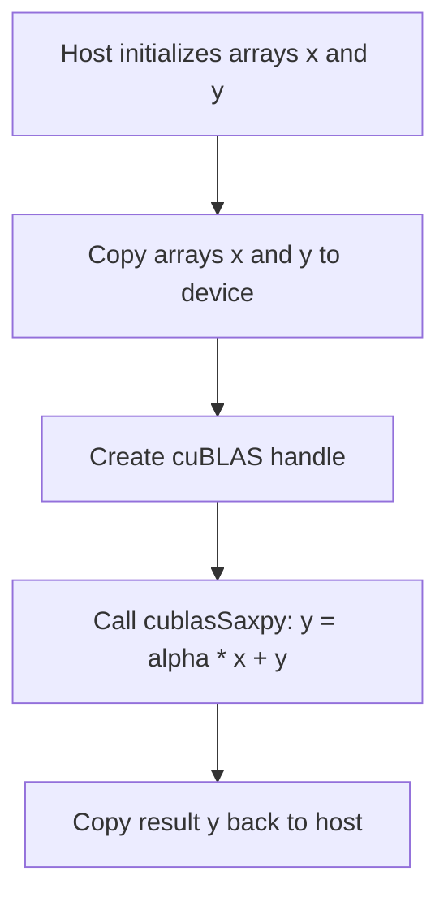

---

## Problem 3: Monte Carlo Pi Estimation using cuRAND

**Problem Statement:**  
Estimate \(\pi\) using a Monte Carlo simulation by generating random points in the unit square and counting those within the unit circle.

### Code Solution

```cpp
// File: monte_carlo_pi.cu
#include <cuda_runtime.h>
#include <curand_kernel.h>
#include <stdio.h>

// Kernel to generate random points and count how many fall inside the unit circle
__global__ void monteCarloPiKernel(unsigned int *counts, int totalPoints, unsigned long long seed) {
    int idx = blockIdx.x * blockDim.x + threadIdx.x;
    if (idx < totalPoints) {
        // Initialize cuRAND state
        curandState_t state;
        curand_init(seed, idx, 0, &state);

        // Generate random (x, y) in [0, 1)
        float x = curand_uniform(&state);
        float y = curand_uniform(&state);

        // Check if the point is inside the unit circle
        counts[idx] = (x * x + y * y <= 1.0f) ? 1 : 0;
    }
}

int main() {
    int totalPoints = 1 << 20; // 1 million points
    size_t size = totalPoints * sizeof(unsigned int);

    // Allocate device memory for counts
    unsigned int *d_counts;
    cudaMalloc(&d_counts, size);

    // Kernel launch configuration
    int threadsPerBlock = 256;
    int blocksPerGrid = (totalPoints + threadsPerBlock - 1) / threadsPerBlock;

    // Launch kernel with a fixed seed
    monteCarloPiKernel<<<blocksPerGrid, threadsPerBlock>>>(d_counts, totalPoints, 1234ULL);
    cudaDeviceSynchronize();

    // Copy the result back to host and sum counts
    unsigned int *h_counts = (unsigned int*)malloc(size);
    cudaMemcpy(h_counts, d_counts, size, cudaMemcpyDeviceToHost);

    unsigned int insideCircle = 0;
    for (int i = 0; i < totalPoints; i++) {
        insideCircle += h_counts[i];
    }

    // Estimate Pi: pi ≈ 4 * (points inside circle / total points)
    double piEstimate = 4.0 * insideCircle / (double)totalPoints;
    printf("Monte Carlo Pi Estimate: %f\n", piEstimate);

    // Cleanup
    cudaFree(d_counts);
    free(h_counts);

    return 0;
}
```

### Mermaid Diagram

```mermaid
flowchart TD
    A[Each thread initializes cuRAND state]
    B[Generate random point (x, y)]
    C[Check: if x^2 + y^2 <= 1.0, count=1 else 0]
    D[Store count in global memory]
    E[Host sums counts and computes Pi ≈ 4*(inside/total)]
    A --> B
    B --> C
    C --> D
    D --> E
```

---

## Problem 4: Matrix Multiplication using cuBLAS (SGEMM)

**Problem Statement:**  
Implement matrix multiplication using cuBLAS. Compute \( C = A \times B \) where \( A \) and \( B \) are square matrices.

### Code Solution

```cpp
// File: matrix_mul_cublas.cu
#include <stdio.h>
#include <stdlib.h>
#include <cublas_v2.h>
#include <cuda_runtime.h>

int main() {
    int N = 512; // Dimension of square matrices
    size_t size = N * N * sizeof(float);
    float alpha = 1.0f, beta = 0.0f;

    // Allocate host memory and initialize matrices A and B in column-major order (or use transpose flags)
    float *h_A = (float*)malloc(size);
    float *h_B = (float*)malloc(size);
    float *h_C = (float*)malloc(size);
    for (int i = 0; i < N * N; i++) {
        h_A[i] = (float)(rand() % 10);
        h_B[i] = (float)(rand() % 10);
        h_C[i] = 0.0f;
    }

    // Allocate device memory
    float *d_A, *d_B, *d_C;
    cudaMalloc(&d_A, size);
    cudaMalloc(&d_B, size);
    cudaMalloc(&d_C, size);
    cudaMemcpy(d_A, h_A, size, cudaMemcpyHostToDevice);
    cudaMemcpy(d_B, h_B, size, cudaMemcpyHostToDevice);
    cudaMemcpy(d_C, h_C, size, cudaMemcpyHostToDevice);

    // Create cuBLAS handle
    cublasHandle_t handle;
    cublasCreate(&handle);

    // cuBLAS uses column-major order by default.
    // To multiply matrices stored in row-major order, use transposition.
    cublasOperation_t transA = CUBLAS_OP_T;
    cublasOperation_t transB = CUBLAS_OP_T;

    // Call cuBLAS SGEMM: C = alpha * A * B + beta * C
    cublasSgemm(handle,
                transA, transB,
                N, N, N,
                &alpha,
                d_A, N,
                d_B, N,
                &beta,
                d_C, N);

    cudaDeviceSynchronize();
    cudaMemcpy(h_C, d_C, size, cudaMemcpyDeviceToHost);

    printf("Matrix Multiplication (cuBLAS) Result: C[0] = %f\n", h_C[0]);

    // Cleanup
    cublasDestroy(handle);
    cudaFree(d_A);
    cudaFree(d_B);
    cudaFree(d_C);
    free(h_A);
    free(h_B);
    free(h_C);

    return 0;
}
```

### Mermaid Diagram

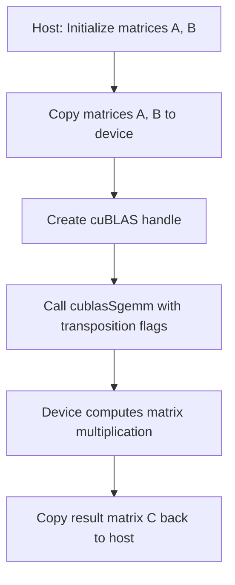

---

## Problem 5: 1D FFT using cuFFT

**Problem Statement:**  
Perform a 1D Fast Fourier Transform (FFT) on a complex array using cuFFT. Then, optionally, perform an inverse FFT to validate the transformation.

### Code Solution

```cpp
// File: fft_1d_example.cu
#include <stdio.h>
#include <stdlib.h>
#include <cuda_runtime.h>
#include <cufft.h>

int main(){
    int N = 1024; // Must be a power of 2 for optimal performance
    size_t size = N * sizeof(cufftComplex);

    // Allocate host memory for complex input data
    cufftComplex *h_data = (cufftComplex*)malloc(size);
    for (int i = 0; i < N; i++){
        h_data[i].x = (float)(rand() % 100);
        h_data[i].y = 0.0f;
    }

    // Allocate device memory and copy data
    cufftComplex *d_data;
    cudaMalloc((void**)&d_data, size);
    cudaMemcpy(d_data, h_data, size, cudaMemcpyHostToDevice);

    // Create cuFFT plan for 1D complex-to-complex FFT
    cufftHandle plan;
    if (cufftPlan1d(&plan, N, CUFFT_C2C, 1) != CUFFT_SUCCESS) {
        fprintf(stderr, "CUFFT Plan creation failed\n");
        return -1;
    }

    // Execute forward FFT
    if (cufftExecC2C(plan, d_data, d_data, CUFFT_FORWARD) != CUFFT_SUCCESS) {
        fprintf(stderr, "CUFFT Exec forward failed\n");
        return -1;
    }
    cudaDeviceSynchronize();

    // (Optional) Execute inverse FFT to recover the original data
    if (cufftExecC2C(plan, d_data, d_data, CUFFT_INVERSE) != CUFFT_SUCCESS) {
        fprintf(stderr, "CUFFT Exec inverse failed\n");
        return -1;
    }
    cudaDeviceSynchronize();

    // Copy result back to host
    cudaMemcpy(h_data, d_data, size, cudaMemcpyDeviceToHost);
    // Normalize the inverse FFT result by dividing by N
    for (int i = 0; i < N; i++){
        h_data[i].x /= N;
        h_data[i].y /= N;
    }
    printf("1D FFT and Inverse FFT result: h_data[0] = (%f, %f)\n", h_data[0].x, h_data[0].y);

    // Cleanup
    cufftDestroy(plan);
    cudaFree(d_data);
    free(h_data);

    return 0;
}
```

### Mermaid Diagram

```mermaid
flowchart TD
    A[Host: Initialize complex array h_data]
    B[Copy h_data to device (d_data)]
    C[Create cuFFT plan for 1D FFT]
    D[Execute forward FFT on d_data]
    E[Execute inverse FFT on d_data]
    F[Copy d_data back to host and normalize]
    A --> B
    B --> C
    C --> D
    D --> E
    E --> F
```

---

## Problem 6: Prefix Sum using Thrust

**Problem Statement:**  
Implement an inclusive prefix sum (scan) on an array using the Thrust library.

### Code Solution

```cpp
// File: prefix_sum_thrust.cu
#include <thrust/device_vector.h>
#include <thrust/scan.h>
#include <thrust/copy.h>
#include <iostream>

int main(){
    int N = 1 << 16; // 65536 elements
    // Create a host vector and initialize
    thrust::host_vector<int> h_vec(N);
    for (int i = 0; i < N; i++){
        h_vec[i] = 1; // All ones for simplicity
    }

    // Transfer to device vector
    thrust::device_vector<int> d_vec = h_vec;

    // Compute inclusive scan (prefix sum)
    thrust::inclusive_scan(d_vec.begin(), d_vec.end(), d_vec.begin());

    // Copy result back to host
    thrust::copy(d_vec.begin(), d_vec.end(), h_vec.begin());
    std::cout << "Prefix sum result: h_vec[0] = " << h_vec[0] << ", h_vec[N-1] = " << h_vec[N-1] << std::endl;
    return 0;
}
```

### Mermaid Diagram

```mermaid
flowchart TD
    A[Host initializes vector h_vec]
    B[Copy h_vec to device (d_vec)]
    C[Perform inclusive scan on d_vec using thrust::inclusive_scan]
    D[Copy result back to host]
    A --> B
    B --> C
    C --> D
```

---

## Problem 7: Multi-Stream Vector Addition

**Problem Statement:**  
Launch two vector addition kernels concurrently in two separate streams to demonstrate multi-stream concurrency.

### Code Solution

```cpp
// File: vector_add_multistream.cu
#include <cuda_runtime.h>
#include <stdio.h>
#include <stdlib.h>

// Simple vector addition kernel
__global__ void vectorAdd(const float *A, const float *B, float *C, int N) {
    int idx = blockIdx.x * blockDim.x + threadIdx.x;
    if (idx < N) {
        C[idx] = A[idx] + B[idx];
    }
}

int main() {
    int N = 1 << 20; // 1 million elements
    size_t size = N * sizeof(float);

    // Allocate host arrays for two independent operations
    float *h_A1 = (float*)malloc(size);
    float *h_B1 = (float*)malloc(size);
    float *h_C1 = (float*)malloc(size);
    float *h_A2 = (float*)malloc(size);
    float *h_B2 = (float*)malloc(size);
    float *h_C2 = (float*)malloc(size);

    // Initialize host arrays
    for (int i = 0; i < N; i++) {
        h_A1[i] = 1.0f; h_B1[i] = 2.0f;
        h_A2[i] = 3.0f; h_B2[i] = 4.0f;
    }

    // Allocate device memory for both operations
    float *d_A1, *d_B1, *d_C1;
    float *d_A2, *d_B2, *d_C2;
    cudaMalloc(&d_A1, size); cudaMalloc(&d_B1, size); cudaMalloc(&d_C1, size);
    cudaMalloc(&d_A2, size); cudaMalloc(&d_B2, size); cudaMalloc(&d_C2, size);

    // Create two streams
    cudaStream_t stream1, stream2;
    cudaStreamCreate(&stream1);
    cudaStreamCreate(&stream2);

    // Asynchronously copy host data to device in each stream
    cudaMemcpyAsync(d_A1, h_A1, size, cudaMemcpyHostToDevice, stream1);
    cudaMemcpyAsync(d_B1, h_B1, size, cudaMemcpyHostToDevice, stream1);
    cudaMemcpyAsync(d_A2, h_A2, size, cudaMemcpyHostToDevice, stream2);
    cudaMemcpyAsync(d_B2, h_B2, size, cudaMemcpyHostToDevice, stream2);

    int threadsPerBlock = 256;
    int blocksPerGrid = (N + threadsPerBlock - 1) / threadsPerBlock;
    // Launch vector addition kernels in separate streams
    vectorAdd<<<blocksPerGrid, threadsPerBlock, 0, stream1>>>(d_A1, d_B1, d_C1, N);
    vectorAdd<<<blocksPerGrid, threadsPerBlock, 0, stream2>>>(d_A2, d_B2, d_C2, N);

    // Asynchronously copy results back to host
    cudaMemcpyAsync(h_C1, d_C1, size, cudaMemcpyDeviceToHost, stream1);
    cudaMemcpyAsync(h_C2, d_C2, size, cudaMemcpyDeviceToHost, stream2);

    // Synchronize streams
    cudaStreamSynchronize(stream1);
    cudaStreamSynchronize(stream2);

    printf("Multi-stream vectorAdd: h_C1[0]=%f, h_C2[0]=%f\n", h_C1[0], h_C2[0]);

    // Cleanup
    cudaFree(d_A1); cudaFree(d_B1); cudaFree(d_C1);
    cudaFree(d_A2); cudaFree(d_B2); cudaFree(d_C2);
    free(h_A1); free(h_B1); free(h_C1);
    free(h_A2); free(h_B2); free(h_C2);
    cudaStreamDestroy(stream1);
    cudaStreamDestroy(stream2);

    return 0;
}
```

### Mermaid Diagram

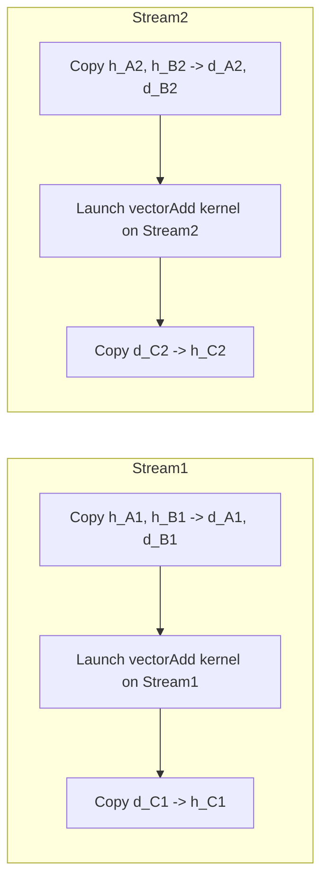

---

## Problem 8: Dot Product with Loop Unrolling (Custom Kernel)

**Problem Statement:**  
Implement a dot product between two vectors using a custom CUDA kernel with manually unrolled loops to reduce loop overhead.

### Code Solution

```cpp
// File: dot_product_unrolled.cu
#include <cuda_runtime.h>
#include <stdio.h>

// Kernel to compute dot product with manual loop unrolling
__global__ void dotProductKernel(const float *A, const float *B, float *partialSums, int N) {
    __shared__ float sdata[256];  // Shared memory for partial sums
    int tid = threadIdx.x;
    int idx = blockIdx.x * blockDim.x * 4 + threadIdx.x; // Each thread processes 4 elements

    float sum = 0.0f;
    // Manual unrolling for 4 consecutive elements
    if (idx < N) {
        sum += A[idx] * B[idx];
    }
    if (idx + blockDim.x < N) {
        sum += A[idx + blockDim.x] * B[idx + blockDim.x];
    }
    if (idx + 2 * blockDim.x < N) {
        sum += A[idx + 2 * blockDim.x] * B[idx + 2 * blockDim.x];
    }
    if (idx + 3 * blockDim.x < N) {
        sum += A[idx + 3 * blockDim.x] * B[idx + 3 * blockDim.x];
    }
    sdata[tid] = sum;
    __syncthreads();

    // Perform reduction in shared memory
    for (int stride = blockDim.x / 2; stride > 0; stride >>= 1) {
        if (tid < stride) {
            sdata[tid] += sdata[tid + stride];
        }
        __syncthreads();
    }

    // Write the block's result to global memory
    if (tid == 0) {
        partialSums[blockIdx.x] = sdata[0];
    }
}

int main() {
    int N = 1 << 20; // 1 million elements
    size_t size = N * sizeof(float);
    float *h_A = (float*)malloc(size);
    float *h_B = (float*)malloc(size);
    for (int i = 0; i < N; i++) {
        h_A[i] = 1.0f;
        h_B[i] = 2.0f;
    }

    float *d_A, *d_B, *d_partialSums;
    cudaMalloc(&d_A, size);
    cudaMalloc(&d_B, size);
    int numBlocks = (N + 256 * 4 - 1) / (256 * 4);
    cudaMalloc(&d_partialSums, numBlocks * sizeof(float));

    cudaMemcpy(d_A, h_A, size, cudaMemcpyHostToDevice);
    cudaMemcpy(d_B, h_B, size, cudaMemcpyHostToDevice);

    dotProductKernel<<<numBlocks, 256>>>(d_A, d_B, d_partialSums, N);
    cudaDeviceSynchronize();

    // Copy partial sums back and finish reduction on host
    float *h_partialSums = (float*)malloc(numBlocks * sizeof(float));
    cudaMemcpy(h_partialSums, d_partialSums, numBlocks * sizeof(float), cudaMemcpyDeviceToHost);

    float dot = 0.0f;
    for (int i = 0; i < numBlocks; i++) {
        dot += h_partialSums[i];
    }
    printf("Dot product result: %f\n", dot);

    // Cleanup
    cudaFree(d_A); cudaFree(d_B); cudaFree(d_partialSums);
    free(h_A); free(h_B); free(h_partialSums);
    return 0;
}
```

### Mermaid Diagram

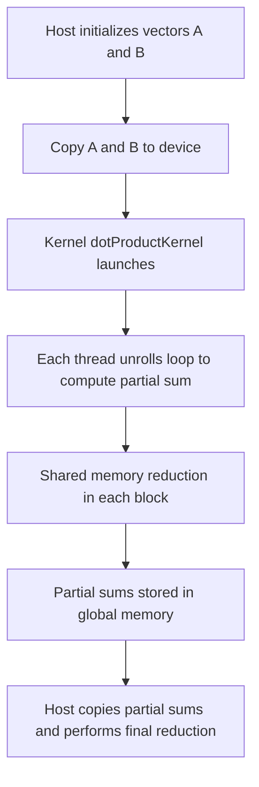

---

## Problem 9: Kernel Using __launch_bounds__ to Optimize Register Usage

**Problem Statement:**  
Implement a simple kernel that demonstrates the use of `__launch_bounds__()` to limit register usage. Compare performance by changing block sizes.

### Code Solution

```cpp
// File: launch_bounds_example.cu
#include <cuda_runtime.h>
#include <stdio.h>

// Kernel with __launch_bounds__ directive to guide register allocation
__launch_bounds__(128, 2)
__global__ void computeKernel(const float *input, float *output, int N) {
    int idx = blockIdx.x * blockDim.x + threadIdx.x;
    if (idx < N) {
        float val = input[idx];
        // Simulate some computation
        for (int i = 0; i < 100; i++) {
            val = val * 1.00001f + 0.00001f;
        }
        output[idx] = val;
    }
}

int main() {
    int N = 1 << 20; // 1 million elements
    size_t size = N * sizeof(float);
    float *h_in = (float*)malloc(size);
    float *h_out = (float*)malloc(size);

    // Initialize input data
    for (int i = 0; i < N; i++) {
        h_in[i] = (float)(rand() % 100);
    }

    float *d_in, *d_out;
    cudaMalloc(&d_in, size);
    cudaMalloc(&d_out, size);

    cudaMemcpy(d_in, h_in, size, cudaMemcpyHostToDevice);

    // Launch kernel with blockDim=128 to match __launch_bounds__
    int threadsPerBlock = 128;
    int blocksPerGrid = (N + threadsPerBlock - 1) / threadsPerBlock;
    computeKernel<<<blocksPerGrid, threadsPerBlock>>>(d_in, d_out, N);
    cudaDeviceSynchronize();

    cudaMemcpy(h_out, d_out, size, cudaMemcpyDeviceToHost);
    printf("Sample output from computeKernel: h_out[0]=%f\n", h_out[0]);

    cudaFree(d_in); cudaFree(d_out);
    free(h_in); free(h_out);
    return 0;
}
```

### Mermaid Diagram

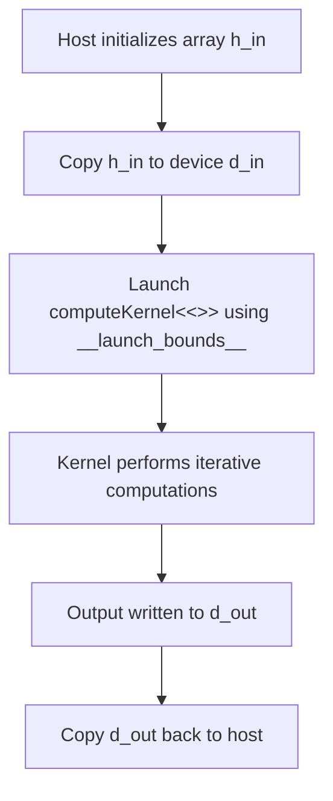

---

## Problem 10: Combined Pipeline: cuBLAS GEMM Followed by a Custom Kernel

**Problem Statement:**  
Create a pipeline where a cuBLAS matrix multiplication (GEMM) is performed, followed by a custom kernel that post-processes the result (e.g., applies an element-wise threshold).

### Code Solution

```cpp
// File: combined_pipeline.cu
#include <stdio.h>
#include <stdlib.h>
#include <cublas_v2.h>
#include <cuda_runtime.h>

// Custom kernel to apply an element-wise threshold on matrix C
__global__ void thresholdKernel(float *C, int N, float threshold) {
    int idx = blockIdx.x * blockDim.x + threadIdx.x;
    if (idx < N * N) {
        // If element is below threshold, set it to zero
        if (C[idx] < threshold) {
            C[idx] = 0.0f;
        }
    }
}

int main() {
    int N = 256; // Matrix dimensions: N x N
    size_t size = N * N * sizeof(float);
    float alpha = 1.0f, beta = 0.0f;
    float threshold = 50.0f;

    // Allocate host matrices (row-major order)
    float *h_A = (float*)malloc(size);
    float *h_B = (float*)malloc(size);
    float *h_C = (float*)malloc(size);
    for (int i = 0; i < N * N; i++) {
        h_A[i] = (float)(rand() % 100);
        h_B[i] = (float)(rand() % 100);
        h_C[i] = 0.0f;
    }

    // Allocate device memory
    float *d_A, *d_B, *d_C;
    cudaMalloc(&d_A, size);
    cudaMalloc(&d_B, size);
    cudaMalloc(&d_C, size);
    cudaMemcpy(d_A, h_A, size, cudaMemcpyHostToDevice);
    cudaMemcpy(d_B, h_B, size, cudaMemcpyHostToDevice);

    // Create cuBLAS handle and perform GEMM: C = A * B
    cublasHandle_t handle;
    cublasCreate(&handle);
    // Use transposition flags to convert row-major to column-major if necessary.
    // Here we assume A and B are stored in row-major; use CUBLAS_OP_T to treat as transposed.
    cublasSgemm(handle, CUBLAS_OP_T, CUBLAS_OP_T,
                N, N, N,
                &alpha,
                d_A, N,
                d_B, N,
                &beta,
                d_C, N);
    cudaDeviceSynchronize();

    // Launch custom kernel to apply a threshold to matrix C
    int threadsPerBlock = 256;
    int blocksPerGrid = (N * N + threadsPerBlock - 1) / threadsPerBlock;
    thresholdKernel<<<blocksPerGrid, threadsPerBlock>>>(d_C, N, threshold);
    cudaDeviceSynchronize();

    // Copy final result back to host and print a sample
    cudaMemcpy(h_C, d_C, size, cudaMemcpyDeviceToHost);
    printf("Combined Pipeline Result: h_C[0]=%f\n", h_C[0]);

    // Cleanup
    cublasDestroy(handle);
    cudaFree(d_A); cudaFree(d_B); cudaFree(d_C);
    free(h_A); free(h_B); free(h_C);

    return 0;
}
```

### Mermaid Diagram

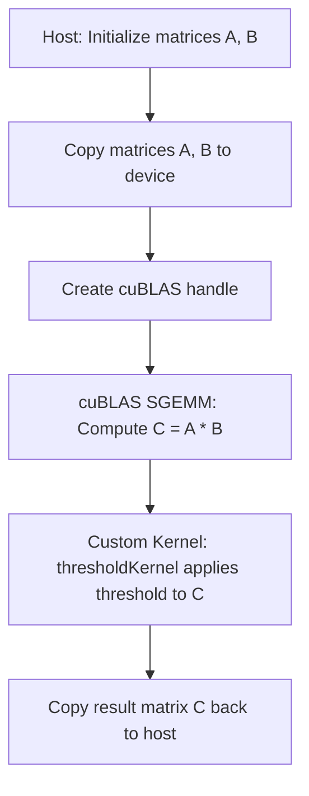

---

# Conclusion

These 10 easy-level LeetCode-style CUDA problems cover a broad spectrum of topics for Day 56, including:
- Basic vector and matrix operations using both custom kernels and device libraries.
- Multi-stream concurrency, custom kernel optimizations (such as loop unrolling), and integration of library routines.
- Each problem comes with a detailed code solution with extensive comments and a Mermaid diagram that visualizes the flow of data and operations.

These exercises reinforce the progress checkpoint by ensuring that all aspects—from concurrency and libraries to optimization—are understood in an integrated, practical manner. Happy CUDA coding!
```

```
# Day 56: 10 Intermediate LeetCode-Style Coding Problems & Solutions

Below are 10 intermediate-level CUDA coding problems designed for the Day 56 progress checkpoint. Each problem is presented in a LeetCode-style format with a detailed code solution (with extensive comments explaining each step) and a Mermaid diagram to visualize the data/operation flow. These problems cover multi-stream concurrency, integrating device libraries with custom kernels, and optimization techniques.

---

## Problem 1: Multi-Stream Vector Addition with Custom Kernel

**Problem Statement:**  
Implement vector addition using a custom kernel but launch two independent vector additions concurrently in separate streams. Verify that both streams execute concurrently by checking the results.

### Code Solution

```cpp
// File: multi_stream_vector_add.cu
#include <cuda_runtime.h>
#include <stdio.h>
#include <stdlib.h>

// Custom kernel for vector addition: C = A + B
__global__ void vectorAdd(const float *A, const float *B, float *C, int N) {
    int idx = blockIdx.x * blockDim.x + threadIdx.x;
    if (idx < N) {
        C[idx] = A[idx] + B[idx];
    }
}

int main() {
    int N = 1 << 20; // 1 million elements per operation
    size_t size = N * sizeof(float);

    // Allocate host memory for two independent operations
    float *h_A1 = (float*)malloc(size);
    float *h_B1 = (float*)malloc(size);
    float *h_C1 = (float*)malloc(size);
    float *h_A2 = (float*)malloc(size);
    float *h_B2 = (float*)malloc(size);
    float *h_C2 = (float*)malloc(size);

    // Initialize arrays for first operation: all ones and twos
    for (int i = 0; i < N; i++) {
        h_A1[i] = 1.0f;
        h_B1[i] = 2.0f;
    }
    // Initialize arrays for second operation: all threes and fours
    for (int i = 0; i < N; i++) {
        h_A2[i] = 3.0f;
        h_B2[i] = 4.0f;
    }

    // Allocate device memory for both operations
    float *d_A1, *d_B1, *d_C1;
    float *d_A2, *d_B2, *d_C2;
    cudaMalloc(&d_A1, size); cudaMalloc(&d_B1, size); cudaMalloc(&d_C1, size);
    cudaMalloc(&d_A2, size); cudaMalloc(&d_B2, size); cudaMalloc(&d_C2, size);

    // Create two streams
    cudaStream_t stream1, stream2;
    cudaStreamCreate(&stream1);
    cudaStreamCreate(&stream2);

    // Asynchronously copy data for both operations
    cudaMemcpyAsync(d_A1, h_A1, size, cudaMemcpyHostToDevice, stream1);
    cudaMemcpyAsync(d_B1, h_B1, size, cudaMemcpyHostToDevice, stream1);
    cudaMemcpyAsync(d_A2, h_A2, size, cudaMemcpyHostToDevice, stream2);
    cudaMemcpyAsync(d_B2, h_B2, size, cudaMemcpyHostToDevice, stream2);

    // Launch kernel on both streams
    int threadsPerBlock = 256;
    int blocksPerGrid = (N + threadsPerBlock - 1) / threadsPerBlock;
    vectorAdd<<<blocksPerGrid, threadsPerBlock, 0, stream1>>>(d_A1, d_B1, d_C1, N);
    vectorAdd<<<blocksPerGrid, threadsPerBlock, 0, stream2>>>(d_A2, d_B2, d_C2, N);

    // Copy results back asynchronously
    cudaMemcpyAsync(h_C1, d_C1, size, cudaMemcpyDeviceToHost, stream1);
    cudaMemcpyAsync(h_C2, d_C2, size, cudaMemcpyDeviceToHost, stream2);

    // Synchronize streams to ensure completion
    cudaStreamSynchronize(stream1);
    cudaStreamSynchronize(stream2);

    // Verify results
    printf("Multi-stream vectorAdd: h_C1[0]=%f, h_C2[0]=%f\n", h_C1[0], h_C2[0]); // Expect 3.0 and 7.0

    // Cleanup
    cudaFree(d_A1); cudaFree(d_B1); cudaFree(d_C1);
    cudaFree(d_A2); cudaFree(d_B2); cudaFree(d_C2);
    free(h_A1); free(h_B1); free(h_C1);
    free(h_A2); free(h_B2); free(h_C2);
    cudaStreamDestroy(stream1);
    cudaStreamDestroy(stream2);

    return 0;
}
```

### Mermaid Diagram

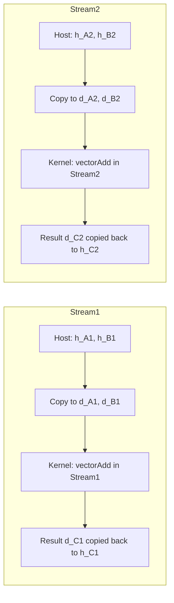

---

## Problem 2: Inclusive Prefix Sum using Thrust

**Problem Statement:**  
Implement an inclusive prefix sum (scan) on an integer vector using the Thrust library.

### Code Solution

```cpp
// File: prefix_sum_thrust.cu
#include <thrust/device_vector.h>
#include <thrust/scan.h>
#include <thrust/copy.h>
#include <iostream>

int main() {
    int N = 1 << 16; // 65,536 elements
    // Create a host vector and initialize with 1s
    thrust::host_vector<int> h_vec(N, 1);

    // Transfer data to device
    thrust::device_vector<int> d_vec = h_vec;

    // Perform inclusive scan (prefix sum) on the device vector
    thrust::inclusive_scan(d_vec.begin(), d_vec.end(), d_vec.begin());

    // Copy result back to host for verification
    thrust::copy(d_vec.begin(), d_vec.end(), h_vec.begin());
    
    // Print first and last elements (expected: 1 and N)
    std::cout << "Inclusive Prefix Sum: h_vec[0] = " << h_vec[0] 
              << ", h_vec[N-1] = " << h_vec[N - 1] << std::endl;

    return 0;
}
```

### Mermaid Diagram

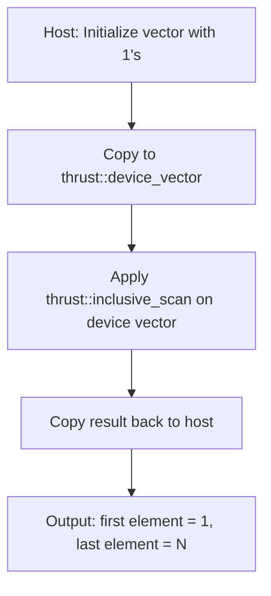

---

## Problem 3: Matrix Multiplication with cuBLAS Followed by a Custom Threshold Kernel

**Problem Statement:**  
Perform matrix multiplication using cuBLAS (SGEMM) and then apply a custom kernel that thresholds the result (e.g., set values below a threshold to zero).

### Code Solution

```cpp
// File: matrix_mul_with_threshold.cu
#include <stdio.h>
#include <stdlib.h>
#include <cublas_v2.h>
#include <cuda_runtime.h>

// Custom kernel to apply an element-wise threshold
__global__ void thresholdKernel(float *C, int N, float threshold) {
    int idx = blockIdx.x * blockDim.x + threadIdx.x;
    if (idx < N * N) {
        if (C[idx] < threshold) {
            C[idx] = 0.0f;
        }
    }
}

int main() {
    int N = 256; // Matrix dimensions: N x N
    size_t size = N * N * sizeof(float);
    float alpha = 1.0f, beta = 0.0f;
    float threshold = 50.0f;

    // Allocate host matrices in row-major order
    float *h_A = (float*)malloc(size);
    float *h_B = (float*)malloc(size);
    float *h_C = (float*)malloc(size);
    for (int i = 0; i < N * N; i++) {
        h_A[i] = (float)(rand() % 100);
        h_B[i] = (float)(rand() % 100);
        h_C[i] = 0.0f;
    }

    // Allocate device memory
    float *d_A, *d_B, *d_C;
    cudaMalloc(&d_A, size);
    cudaMalloc(&d_B, size);
    cudaMalloc(&d_C, size);
    cudaMemcpy(d_A, h_A, size, cudaMemcpyHostToDevice);
    cudaMemcpy(d_B, h_B, size, cudaMemcpyHostToDevice);

    // Create cuBLAS handle and perform SGEMM: C = A * B
    cublasHandle_t handle;
    cublasCreate(&handle);
    // Using transposition flags to treat the row-major matrices as transposed
    cublasOperation_t transA = CUBLAS_OP_T;
    cublasOperation_t transB = CUBLAS_OP_T;
    cublasSgemm(handle, transA, transB,
                N, N, N,
                &alpha,
                d_A, N,
                d_B, N,
                &beta,
                d_C, N);
    cudaDeviceSynchronize();

    // Launch custom threshold kernel on matrix C
    int threadsPerBlock = 256;
    int blocksPerGrid = (N * N + threadsPerBlock - 1) / threadsPerBlock;
    thresholdKernel<<<blocksPerGrid, threadsPerBlock>>>(d_C, N, threshold);
    cudaDeviceSynchronize();

    // Copy result back to host and verify
    cudaMemcpy(h_C, d_C, size, cudaMemcpyDeviceToHost);
    printf("Matrix Multiplication with Threshold: h_C[0] = %f\n", h_C[0]);

    // Cleanup
    cublasDestroy(handle);
    cudaFree(d_A); cudaFree(d_B); cudaFree(d_C);
    free(h_A); free(h_B); free(h_C);

    return 0;
}
```

### Mermaid Diagram

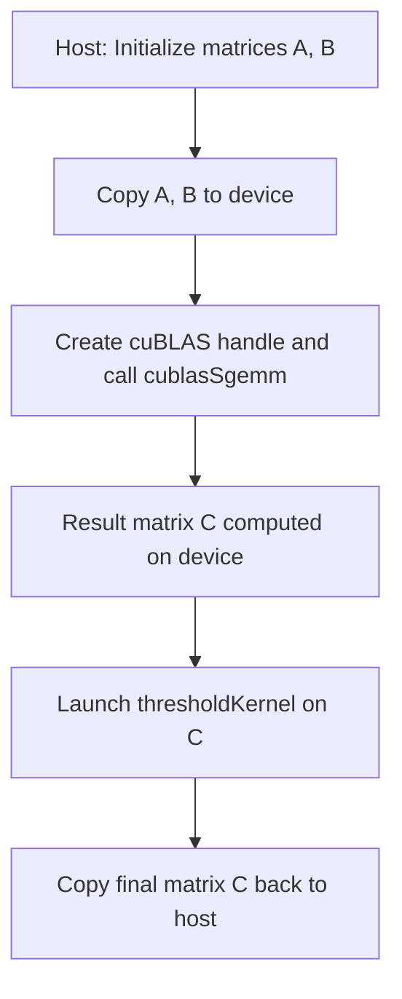

---

## Problem 4: 1D FFT and Magnitude Calculation using cuFFT

**Problem Statement:**  
Perform a 1D FFT on a complex signal using cuFFT, then launch a custom kernel to compute the magnitude of each FFT output element.

### Code Solution

```cpp
// File: fft_magnitude.cu
#include <stdio.h>
#include <stdlib.h>
#include <cuda_runtime.h>
#include <cufft.h>
#include <math.h>

// Kernel to compute magnitude of complex numbers: |z| = sqrt(re^2 + im^2)
__global__ void magnitudeKernel(cufftComplex *data, float *mag, int N) {
    int idx = blockIdx.x * blockDim.x + threadIdx.x;
    if (idx < N) {
        float real = data[idx].x;
        float imag = data[idx].y;
        mag[idx] = sqrtf(real * real + imag * imag);
    }
}

int main() {
    int N = 1024; // 1D FFT size
    size_t complexSize = N * sizeof(cufftComplex);
    size_t floatSize = N * sizeof(float);

    // Allocate host memory and initialize with a simple signal
    cufftComplex *h_signal = (cufftComplex*)malloc(complexSize);
    for (int i = 0; i < N; i++) {
        h_signal[i].x = (float)(rand() % 100);
        h_signal[i].y = 0.0f; // purely real signal
    }

    // Allocate device memory
    cufftComplex *d_signal;
    float *d_mag;
    cudaMalloc(&d_signal, complexSize);
    cudaMalloc(&d_mag, floatSize);
    cudaMemcpy(d_signal, h_signal, complexSize, cudaMemcpyHostToDevice);

    // Create cuFFT plan for 1D complex-to-complex transform
    cufftHandle plan;
    cufftPlan1d(&plan, N, CUFFT_C2C, 1);

    // Execute forward FFT
    cufftExecC2C(plan, d_signal, d_signal, CUFFT_FORWARD);
    cudaDeviceSynchronize();

    // Launch kernel to compute magnitudes
    int threadsPerBlock = 256;
    int blocksPerGrid = (N + threadsPerBlock - 1) / threadsPerBlock;
    magnitudeKernel<<<blocksPerGrid, threadsPerBlock>>>(d_signal, d_mag, N);
    cudaDeviceSynchronize();

    // Copy magnitude result back to host and print sample
    float *h_mag = (float*)malloc(floatSize);
    cudaMemcpy(h_mag, d_mag, floatSize, cudaMemcpyDeviceToHost);
    printf("FFT Magnitude: h_mag[0] = %f\n", h_mag[0]);

    // Cleanup
    cufftDestroy(plan);
    cudaFree(d_signal);
    cudaFree(d_mag);
    free(h_signal);
    free(h_mag);

    return 0;
}
```

### Mermaid Diagram

```mermaid
flowchart TD
    A[Host: Initialize complex signal h_signal]
    B[Copy h_signal to device (d_signal)]
    C[Create cuFFT plan for 1D FFT and execute forward transform]
    D[Device: FFT result in d_signal]
    E[Launch magnitudeKernel to compute sqrt(re^2+im^2) -> d_mag]
    F[Copy d_mag back to host and display results]
    A --> B
    B --> C
    C --> D
    D --> E
    E --> F
```

---

## Problem 5: Dot Product with Custom Reduction Kernel

**Problem Statement:**  
Implement a dot product of two vectors using a custom CUDA kernel with shared memory reduction and verify the result against CPU calculation.

### Code Solution

```cpp
// File: dot_product_reduction.cu
#include <cuda_runtime.h>
#include <stdio.h>

// Kernel to compute dot product using shared memory reduction with loop unrolling
__global__ void dotProductKernel(const float *A, const float *B, float *partialSums, int N) {
    __shared__ float sdata[256]; // shared memory for partial sums
    int tid = threadIdx.x;
    int idx = blockIdx.x * blockDim.x + tid;

    float sum = 0.0f;
    // Each thread computes the product of elements
    if (idx < N) {
        sum = A[idx] * B[idx];
    }
    
    // Write the computed product to shared memory
    sdata[tid] = sum;
    __syncthreads();

    // Reduce the block's partial sums in shared memory (unrolled reduction)
    for (int stride = blockDim.x / 2; stride > 0; stride >>= 1) {
        if (tid < stride) {
            sdata[tid] += sdata[tid + stride];
        }
        __syncthreads();
    }
    // Write the block's result to global memory
    if (tid == 0) {
        partialSums[blockIdx.x] = sdata[0];
    }
}

int main() {
    int N = 1 << 20; // 1 million elements
    size_t size = N * sizeof(float);
    float *h_A = (float*)malloc(size);
    float *h_B = (float*)malloc(size);

    // Initialize vectors on host
    for (int i = 0; i < N; i++) {
        h_A[i] = 1.0f; // All ones
        h_B[i] = 2.0f; // All twos
    }

    // Allocate device memory
    float *d_A, *d_B, *d_partialSums;
    cudaMalloc(&d_A, size);
    cudaMalloc(&d_B, size);
    int numBlocks = (N + 256 - 1) / 256;
    cudaMalloc(&d_partialSums, numBlocks * sizeof(float));

    cudaMemcpy(d_A, h_A, size, cudaMemcpyHostToDevice);
    cudaMemcpy(d_B, h_B, size, cudaMemcpyHostToDevice);

    // Launch dot product kernel
    dotProductKernel<<<numBlocks, 256>>>(d_A, d_B, d_partialSums, N);
    cudaDeviceSynchronize();

    // Copy partial sums to host and complete reduction on host
    float *h_partialSums = (float*)malloc(numBlocks * sizeof(float));
    cudaMemcpy(h_partialSums, d_partialSums, numBlocks * sizeof(float), cudaMemcpyDeviceToHost);

    float dotProduct = 0.0f;
    for (int i = 0; i < numBlocks; i++) {
        dotProduct += h_partialSums[i];
    }
    printf("Dot product result: %f\n", dotProduct); // Expected: 2.0 * 1.0 * N

    // Cleanup
    cudaFree(d_A); cudaFree(d_B); cudaFree(d_partialSums);
    free(h_A); free(h_B); free(h_partialSums);

    return 0;
}
```

### Mermaid Diagram

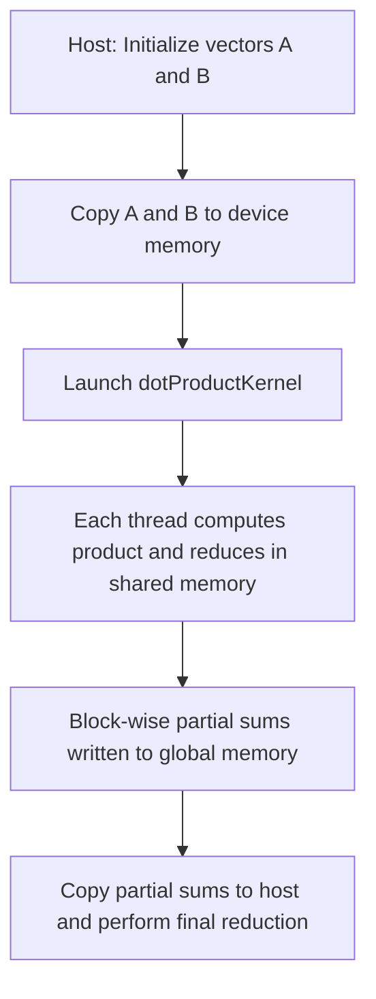

---

## Problem 6: Custom Kernel for Element-wise Maximum (with Thrust for Verification)

**Problem Statement:**  
Write a custom kernel to compute the element-wise maximum of two arrays. Verify the result using Thrust's `thrust::transform` with `thrust::maximum`.

### Code Solution

```cpp
// File: elementwise_max.cu
#include <cuda_runtime.h>
#include <stdio.h>
#include <thrust/device_vector.h>
#include <thrust/transform.h>
#include <thrust/functional.h>

// Custom kernel to compute element-wise maximum: C[i] = max(A[i], B[i])
__global__ void maxKernel(const float *A, const float *B, float *C, int N) {
    int idx = blockIdx.x * blockDim.x + threadIdx.x;
    if (idx < N) {
        // Compute maximum of A[idx] and B[idx]
        C[idx] = (A[idx] > B[idx]) ? A[idx] : B[idx];
    }
}

int main() {
    int N = 1 << 18; // 262144 elements
    size_t size = N * sizeof(float);

    // Allocate and initialize host arrays
    float *h_A = (float*)malloc(size);
    float *h_B = (float*)malloc(size);
    for (int i = 0; i < N; i++) {
        h_A[i] = (float)(rand() % 100);
        h_B[i] = (float)(rand() % 100);
    }

    // Allocate device memory
    float *d_A, *d_B, *d_C;
    cudaMalloc(&d_A, size);
    cudaMalloc(&d_B, size);
    cudaMalloc(&d_C, size);
    cudaMemcpy(d_A, h_A, size, cudaMemcpyHostToDevice);
    cudaMemcpy(d_B, h_B, size, cudaMemcpyHostToDevice);

    // Launch custom maxKernel
    int threadsPerBlock = 256;
    int blocksPerGrid = (N + threadsPerBlock - 1) / threadsPerBlock;
    maxKernel<<<blocksPerGrid, threadsPerBlock>>>(d_A, d_B, d_C, N);
    cudaDeviceSynchronize();

    // Verification using Thrust
    thrust::device_vector<float> d_vecA(h_A, h_A + N);
    thrust::device_vector<float> d_vecB(h_B, h_B + N);
    thrust::device_vector<float> d_vecC(N);
    thrust::transform(d_vecA.begin(), d_vecA.end(), d_vecB.begin(),
                      d_vecC.begin(), thrust::maximum<float>());

    // Copy results from both approaches for comparison (only first 10 elements)
    float *h_C_custom = (float*)malloc(size);
    float *h_C_thrust = (float*)malloc(size);
    cudaMemcpy(h_C_custom, d_C, size, cudaMemcpyDeviceToHost);
    thrust::copy(d_vecC.begin(), d_vecC.end(), h_C_thrust);

    printf("Element-wise Maximum (first 10 elements):\n");
    for (int i = 0; i < 10; i++) {
        printf("Custom: %f, Thrust: %f\n", h_C_custom[i], h_C_thrust[i]);
    }

    // Cleanup
    cudaFree(d_A); cudaFree(d_B); cudaFree(d_C);
    free(h_A); free(h_B); free(h_C_custom); free(h_C_thrust);

    return 0;
}
```

### Mermaid Diagram

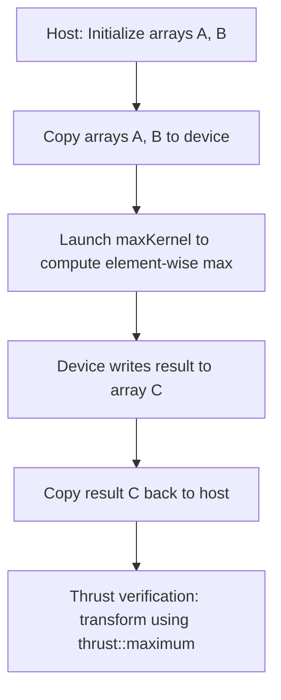

---

## Problem 7: Batched cuFFT for Multiple 1D Transforms

**Problem Statement:**  
Use cuFFT to perform batched 1D FFTs on an array of signals, then compute the sum of magnitudes for each transform.

### Code Solution

```cpp
// File: batched_fft.cu
#include <stdio.h>
#include <stdlib.h>
#include <cuda_runtime.h>
#include <cufft.h>
#include <math.h>

__global__ void computeMagnitudeAndSum(cufftComplex *data, float *sums, int signalLength, int batch) {
    int batchId = blockIdx.x;
    int tid = threadIdx.x;
    __shared__ float sdata[256];
    
    int index = batchId * signalLength + tid;
    float mag = 0.0f;
    if(tid < signalLength) {
        cufftComplex val = data[index];
        mag = sqrtf(val.x * val.x + val.y * val.y);
    }
    sdata[tid] = mag;
    __syncthreads();

    // Reduction in shared memory (assume signalLength <= blockDim.x)
    for (int stride = blockDim.x / 2; stride > 0; stride >>= 1) {
        if(tid < stride) {
            sdata[tid] += sdata[tid + stride];
        }
        __syncthreads();
    }
    if(tid == 0) {
        sums[batchId] = sdata[0];
    }
}

int main(){
    int signalLength = 1024; // each 1D FFT length
    int batch = 256;         // number of signals
    size_t memSize = signalLength * batch * sizeof(cufftComplex);
    size_t sumSize = batch * sizeof(float);

    // Allocate host memory for batched signals
    cufftComplex *h_data = (cufftComplex*)malloc(memSize);
    for (int i = 0; i < signalLength * batch; i++) {
        h_data[i].x = (float)(rand() % 100);
        h_data[i].y = 0.0f;
    }

    // Allocate device memory
    cufftComplex *d_data;
    float *d_sums;
    cudaMalloc(&d_data, memSize);
    cudaMalloc(&d_sums, sumSize);
    cudaMemcpy(d_data, h_data, memSize, cudaMemcpyHostToDevice);

    // Create cuFFT plan for batched 1D FFT (complex-to-complex)
    cufftHandle plan;
    cufftPlan1d(&plan, signalLength, CUFFT_C2C, batch);

    // Execute forward FFT on all signals
    cufftExecC2C(plan, d_data, d_data, CUFFT_FORWARD);
    cudaDeviceSynchronize();

    // Launch kernel to compute sum of magnitudes for each signal
    int threadsPerBlock = 256;
    computeMagnitudeAndSum<<<batch, threadsPerBlock>>>(d_data, d_sums, signalLength, batch);
    cudaDeviceSynchronize();

    // Copy result back to host
    float *h_sums = (float*)malloc(sumSize);
    cudaMemcpy(h_sums, d_sums, sumSize, cudaMemcpyDeviceToHost);
    printf("Batched FFT: Sum of magnitudes for first batch = %f\n", h_sums[0]);

    // Cleanup
    cufftDestroy(plan);
    cudaFree(d_data);
    cudaFree(d_sums);
    free(h_data);
    free(h_sums);

    return 0;
}
```

### Mermaid Diagram

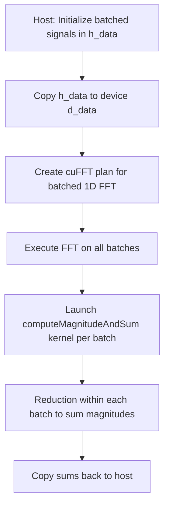

---

## Problem 8: Custom Kernel for Array Scaling with Loop Unrolling

**Problem Statement:**  
Implement a custom kernel that scales an array by a constant factor using loop unrolling to improve performance. Compare the result with a non-unrolled version.

### Code Solution

```cpp
// File: scale_unroll.cu
#include <cuda_runtime.h>
#include <stdio.h>

// Kernel with manual loop unrolling to scale an array: out[i] = scale * in[i]
__global__ void scaleKernelUnrolled(const float *in, float *out, float scale, int N) {
    int idx = blockIdx.x * blockDim.x + threadIdx.x;
    if (idx < N) {
        // Manual unrolling for 4 elements per thread if possible
        // Assuming N is a multiple of 4 * blockDim.x for simplicity
        int base = idx * 4;
        out[base + 0] = scale * in[base + 0];
        out[base + 1] = scale * in[base + 1];
        out[base + 2] = scale * in[base + 2];
        out[base + 3] = scale * in[base + 3];
    }
}

// Simple version without unrolling
__global__ void scaleKernel(const float *in, float *out, float scale, int N) {
    int idx = blockIdx.x * blockDim.x + threadIdx.x;
    if (idx < N) {
        out[idx] = scale * in[idx];
    }
}

int main() {
    int N = 1 << 18; // 262144 elements
    size_t size = N * sizeof(float);

    // Allocate host memory
    float *h_in = (float*)malloc(size);
    float *h_out = (float*)malloc(size);
    for (int i = 0; i < N; i++) {
        h_in[i] = (float)(rand() % 100);
    }

    // Allocate device memory for non-unrolled and unrolled versions
    float *d_in, *d_out, *d_outUnrolled;
    cudaMalloc(&d_in, size);
    cudaMalloc(&d_out, size);
    cudaMalloc(&d_outUnrolled, size);

    cudaMemcpy(d_in, h_in, size, cudaMemcpyHostToDevice);

    // Launch non-unrolled kernel
    int threadsPerBlock = 256;
    int blocksPerGrid = (N + threadsPerBlock - 1) / threadsPerBlock;
    scaleKernel<<<blocksPerGrid, threadsPerBlock>>>(d_in, d_out, 2.0f, N);
    cudaDeviceSynchronize();

    // Launch unrolled kernel: note that N should be adjusted for unrolling factor
    int N_unrolled = N / 4;
    blocksPerGrid = (N_unrolled + threadsPerBlock - 1) / threadsPerBlock;
    scaleKernelUnrolled<<<blocksPerGrid, threadsPerBlock>>>(d_in, d_outUnrolled, 2.0f, N_unrolled);
    cudaDeviceSynchronize();

    // Copy back results
    float *h_outUnrolled = (float*)malloc(size);
    cudaMemcpy(h_out, d_out, size, cudaMemcpyDeviceToHost);
    cudaMemcpy(h_outUnrolled, d_outUnrolled, size, cudaMemcpyDeviceToHost);

    // Print sample results for verification
    printf("Scale Kernel: h_out[0] = %f, Scale Kernel Unrolled: h_outUnrolled[0] = %f\n", h_out[0], h_outUnrolled[0]);

    // Cleanup
    cudaFree(d_in); cudaFree(d_out); cudaFree(d_outUnrolled);
    free(h_in); free(h_out); free(h_outUnrolled);

    return 0;
}
```

### Mermaid Diagram

```mermaid
flowchart TD
    A[Host: Initialize input array h_in]
    B[Copy h_in to device d_in]
    C[Launch scaleKernel (non-unrolled) to produce d_out]
    D[Launch scaleKernelUnrolled to produce d_outUnrolled]
    E[Copy both outputs back to host]
    F[Compare results for correctness and performance]
    A --> B
    B --> C
    B --> D
    C --> E
    D --> E
    E --> F
```

---

## Problem 9: Dot Product Using Thrust vs. Custom Kernel

**Problem Statement:**  
Compute the dot product of two vectors using both a custom reduction kernel and Thrust’s `thrust::reduce`. Compare the results.

### Code Solution

```cpp
// File: dot_product_thrust_vs_custom.cu
#include <cuda_runtime.h>
#include <stdio.h>
#include <thrust/device_vector.h>
#include <thrust/reduce.h>

// Custom kernel for dot product using shared memory reduction
__global__ void dotProductKernel(const float *A, const float *B, float *partialSums, int N) {
    __shared__ float sdata[256];
    int tid = threadIdx.x;
    int idx = blockIdx.x * blockDim.x + tid;

    float sum = 0.0f;
    if (idx < N) {
        sum = A[idx] * B[idx];
    }
    sdata[tid] = sum;
    __syncthreads();

    for (int stride = blockDim.x / 2; stride > 0; stride >>= 1) {
        if (tid < stride) {
            sdata[tid] += sdata[tid + stride];
        }
        __syncthreads();
    }
    if (tid == 0) {
        partialSums[blockIdx.x] = sdata[0];
    }
}

int main() {
    int N = 1 << 20; // 1 million elements
    size_t size = N * sizeof(float);
    float *h_A = (float*)malloc(size);
    float *h_B = (float*)malloc(size);

    // Initialize host vectors
    for (int i = 0; i < N; i++) {
        h_A[i] = 1.0f;
        h_B[i] = 2.0f;
    }

    // Allocate device memory
    float *d_A, *d_B, *d_partialSums;
    cudaMalloc(&d_A, size);
    cudaMalloc(&d_B, size);
    int numBlocks = (N + 256 - 1) / 256;
    cudaMalloc(&d_partialSums, numBlocks * sizeof(float));
    cudaMemcpy(d_A, h_A, size, cudaMemcpyHostToDevice);
    cudaMemcpy(d_B, h_B, size, cudaMemcpyHostToDevice);

    // Launch custom dot product kernel
    dotProductKernel<<<numBlocks, 256>>>(d_A, d_B, d_partialSums, N);
    cudaDeviceSynchronize();

    float *h_partialSums = (float*)malloc(numBlocks * sizeof(float));
    cudaMemcpy(h_partialSums, d_partialSums, numBlocks * sizeof(float), cudaMemcpyDeviceToHost);
    float dotCustom = 0.0f;
    for (int i = 0; i < numBlocks; i++) {
        dotCustom += h_partialSums[i];
    }
    printf("Custom Kernel Dot Product: %f\n", dotCustom);

    // Use Thrust for dot product
    thrust::device_vector<float> d_vecA(h_A, h_A + N);
    thrust::device_vector<float> d_vecB(h_B, h_B + N);
    float dotThrust = thrust::inner_product(d_vecA.begin(), d_vecA.end(), d_vecB.begin(), 0.0f);
    printf("Thrust Dot Product: %f\n", dotThrust);

    // Cleanup
    cudaFree(d_A); cudaFree(d_B); cudaFree(d_partialSums);
    free(h_A); free(h_B); free(h_partialSums);

    return 0;
}
```

### Mermaid Diagram

```mermaid
flowchart TD
    A[Host: Initialize vectors A and B]
    B[Copy A, B to device for custom kernel]
    C[Launch custom dotProductKernel -> partialSums]
    D[Copy partial sums to host and reduce -> dotCustom]
    E[Use Thrust: device_vectors for A and B]
    F[Compute inner_product using Thrust -> dotThrust]
    A --> B
    B --> C
    C --> D
    A --> E
    E --> F
```

---

## Problem 10: Cooperative Groups for Warp-Level Reduction

**Problem Statement:**  
Implement a custom kernel that uses cooperative groups to perform a warp-level reduction. Each warp computes the sum of its elements using the cooperative groups API, and then a block-level reduction combines these results.

### Code Solution

```cpp
// File: cooperative_groups_reduction.cu
#include <cuda_runtime.h>
#include <cooperative_groups.h>
#include <stdio.h>
namespace cg = cooperative_groups;

__global__ void warpReductionKernel(const float *input, float *blockSums, int N) {
    // Get the thread block group
    cg::thread_block block = cg::this_thread_block();
    // Partition the block into subgroups of 32 (a full warp)
    auto warp = cg::tiled_partition<32>(block);

    int idx = blockIdx.x * blockDim.x + threadIdx.x;
    float val = (idx < N) ? input[idx] : 0.0f;

    // Perform warp-level reduction using cooperative groups
    for (int offset = warp.size() / 2; offset > 0; offset >>= 1) {
        val += warp.shfl_down(val, offset);
    }

    // Each warp's first thread writes its result to shared memory
    __shared__ float sdata[256]; // assume blockDim.x <= 256
    int laneId = threadIdx.x % warp.size();
    if (laneId == 0) {
        sdata[threadIdx.x / warp.size()] = val;
    }
    __syncthreads();

    // Let one thread in the block reduce the warp partial sums
    if (threadIdx.x < blockDim.x / warp.size()) {
        float blockSum = sdata[threadIdx.x];
        for (int i = 1; i < (blockDim.x / warp.size()); i++) {
            blockSum += sdata[threadIdx.x + i];
        }
        if (threadIdx.x == 0) {
            blockSums[blockIdx.x] = blockSum;
        }
    }
}

int main(){
    int N = 1 << 20; // 1 million elements
    size_t size = N * sizeof(float);
    float *h_in = (float*)malloc(size);
    for (int i = 0; i < N; i++) {
        h_in[i] = 1.0f; // initialize with ones
    }

    float *d_in, *d_blockSums;
    cudaMalloc(&d_in, size);
    int numBlocks = (N + 255) / 256;
    cudaMalloc(&d_blockSums, numBlocks * sizeof(float));
    cudaMemcpy(d_in, h_in, size, cudaMemcpyHostToDevice);

    dim3 block(256);
    dim3 grid(numBlocks);
    warpReductionKernel<<<grid, block>>>(d_in, d_blockSums, N);
    cudaDeviceSynchronize();

    // Reduce blockSums on host
    float *h_blockSums = (float*)malloc(numBlocks * sizeof(float));
    cudaMemcpy(h_blockSums, d_blockSums, numBlocks * sizeof(float), cudaMemcpyDeviceToHost);
    float totalSum = 0.0f;
    for (int i = 0; i < numBlocks; i++) {
        totalSum += h_blockSums[i];
    }
    printf("Cooperative Groups Reduction Result: totalSum = %f\n", totalSum);

    // Cleanup
    cudaFree(d_in);
    cudaFree(d_blockSums);
    free(h_in);
    free(h_blockSums);
    return 0;
}
```

### Mermaid Diagram

```mermaid
flowchart TD
    A[Host: Initialize input array with ones]
    B[Copy input array to device]
    C[Launch warpReductionKernel]
    D[Each warp performs reduction using cooperative groups]
    E[Warp leaders write partial sums to shared memory]
    F[Block-level reduction combines warp sums -> blockSums]
    G[Copy blockSums to host and sum to get totalSum]
    A --> B
    B --> C
    C --> D
    D --> E
    E --> F
    F --> G
```

---

# Conclusion

These 10 intermediate-level problems cover:
- Multi-stream concurrency with custom vector addition.
- Thrust-based prefix sum.
- Integration of cuBLAS matrix multiplication with a custom threshold kernel.
- 1D FFT with magnitude computation using cuFFT.
- Custom dot product kernel compared with Thrust.
- Cooperative groups for warp-level reduction.

Each problem includes a fully-commented code solution and a corresponding Mermaid diagram to visualize the flow of data and operations. These exercises help reinforce your understanding of integrating various GPU performance techniques and ensuring that your knowledge is cohesively applied in an HPC pipeline.

Happy CUDA coding!
```

```
# Day 56: 10 Advanced LeetCode-Style CUDA Problems & Solutions

Below are 10 advanced-level CUDA coding problems for the Day 56 progress checkpoint. Each problem is presented in a LeetCode-style format with detailed code solutions (extensively commented to explain each step) and a corresponding Mermaid diagram to visualize the flow logic. These problems integrate concepts like multi-stream concurrency, device libraries (cuBLAS, cuFFT, cuRAND), custom kernel optimizations, dynamic parallelism, cooperative groups, and multi-GPU techniques.

---

## Problem 1: Multi-Stream Pipeline: cuBLAS GEMM, Custom Threshold, and cuFFT

**Problem Statement:**  
Design a GPU pipeline that:
1. Uses cuBLAS to compute \( C = A \times B \) (matrix multiplication).
2. Applies a custom kernel to threshold the result (set elements below a threshold to zero).
3. Performs a 2D FFT on the thresholded matrix using cuFFT.  
Use separate CUDA streams to overlap operations and minimize host-device transfers.

### Code Solution

```cpp
// File: pipeline_gemm_threshold_fft.cu
#include <stdio.h>
#include <stdlib.h>
#include <cuda_runtime.h>
#include <cublas_v2.h>
#include <cufft.h>

// Custom kernel to threshold matrix C: set elements < threshold to 0
__global__ void thresholdKernel(float *C, int N, float threshold) {
    int idx = blockIdx.x * blockDim.x + threadIdx.x;
    int total = N * N;
    if (idx < total) {
        if (C[idx] < threshold) {
            C[idx] = 0.0f;
        }
    }
}

int main() {
    int N = 512; // Matrix dimensions: N x N
    size_t size = N * N * sizeof(float);
    float alpha = 1.0f, beta = 0.0f;
    float threshold = 50.0f;

    // Allocate and initialize host matrices A and B
    float *h_A = (float*)malloc(size);
    float *h_B = (float*)malloc(size);
    for (int i = 0; i < N * N; i++) {
        h_A[i] = (float)(rand() % 100);
        h_B[i] = (float)(rand() % 100);
    }

    // Allocate device memory for matrices A, B, and C
    float *d_A, *d_B, *d_C;
    cudaMalloc(&d_A, size);
    cudaMalloc(&d_B, size);
    cudaMalloc(&d_C, size);

    // Copy A and B from host to device
    cudaMemcpy(d_A, h_A, size, cudaMemcpyHostToDevice);
    cudaMemcpy(d_B, h_B, size, cudaMemcpyHostToDevice);

    // Create two CUDA streams: stream1 for GEMM and threshold; stream2 for FFT
    cudaStream_t stream1, stream2;
    cudaStreamCreate(&stream1);
    cudaStreamCreate(&stream2);

    // Create cuBLAS handle and set it to stream1
    cublasHandle_t blasHandle;
    cublasCreate(&blasHandle);
    cublasSetStream(blasHandle, stream1);

    // Perform matrix multiplication: C = A * B using cuBLAS
    // cuBLAS assumes column-major order; if matrices are row-major, use transposition flags.
    cublasOperation_t trans = CUBLAS_OP_T; // Treat row-major data as transposed
    cublasSgemm(blasHandle, trans, trans,
                N, N, N,
                &alpha,
                d_A, N,
                d_B, N,
                &beta,
                d_C, N);
    cudaStreamSynchronize(stream1);

    // Apply threshold using the custom kernel in stream1
    int threadsPerBlock = 256;
    int blocksPerGrid = (N * N + threadsPerBlock - 1) / threadsPerBlock;
    thresholdKernel<<<blocksPerGrid, threadsPerBlock, 0, stream1>>>(d_C, N, threshold);
    cudaStreamSynchronize(stream1);

    // Create a cuFFT plan for a 2D FFT and assign it to stream2
    cufftHandle fftPlan;
    cufftPlan2d(&fftPlan, N, N, CUFFT_C2C);
    cufftSetStream(fftPlan, stream2);
    // Perform forward FFT in-place on matrix C
    cufftExecC2C(fftPlan, (cufftComplex*)d_C, (cufftComplex*)d_C, CUFFT_FORWARD);
    cudaStreamSynchronize(stream2);

    // Copy final result from device to host
    float *h_C = (float*)malloc(size);
    cudaMemcpy(h_C, d_C, size, cudaMemcpyDeviceToHost);
    printf("Pipeline Result: h_C[0] = %f\n", h_C[0]);

    // Cleanup
    cublasDestroy(blasHandle);
    cufftDestroy(fftPlan);
    cudaStreamDestroy(stream1);
    cudaStreamDestroy(stream2);
    cudaFree(d_A); cudaFree(d_B); cudaFree(d_C);
    free(h_A); free(h_B); free(h_C);
    return 0;
}
```

### Mermaid Diagram

```mermaid
flowchart TD
    A[Host: Initialize matrices A and B]
    B[Copy A, B to device memory (d_A, d_B)]
    C[cuBLAS GEMM in stream1: Compute C = A * B]
    D[Custom thresholdKernel in stream1: Zero elements < threshold]
    E[cuFFT in stream2: Execute 2D FFT on matrix C]
    F[Copy final matrix C from device to host]
    A --> B
    B --> C
    C --> D
    D --> E
    E --> F
```

---

## Problem 2: Batched Monte Carlo Simulation with cuRAND & Dynamic Parallelism

**Problem Statement:**  
Implement a batched Monte Carlo simulation where each thread generates multiple random points using the device API of cuRAND, then uses dynamic parallelism to reduce the results within each batch. Estimate \(\pi\) from the simulation.

### Code Solution

```cpp
// File: monte_carlo_dynamic.cu
#include <cuda_runtime.h>
#include <curand_kernel.h>
#include <stdio.h>

// Kernel: Each thread generates numSamples random points and writes its count of points inside the circle
__global__ void monteCarloKernel(unsigned int *results, int numSamples, unsigned long long seed) {
    int idx = blockIdx.x * blockDim.x + threadIdx.x;
    if (idx < gridDim.x * blockDim.x) {
        curandState_t state;
        curand_init(seed, idx, 0, &state);
        unsigned int count = 0;
        for (int i = 0; i < numSamples; i++) {
            float x = curand_uniform(&state);
            float y = curand_uniform(&state);
            if (x * x + y * y <= 1.0f) {
                count++;
            }
        }
        results[idx] = count;
    }
}

// Child kernel: reduce an array of unsigned ints in shared memory
__global__ void reductionKernel(unsigned int *data, int N) {
    __shared__ unsigned int sdata[256];
    int tid = threadIdx.x;
    int idx = blockIdx.x * blockDim.x + tid;
    sdata[tid] = (idx < N) ? data[idx] : 0;
    __syncthreads();
    for (int stride = blockDim.x / 2; stride > 0; stride >>= 1) {
        if (tid < stride) {
            sdata[tid] += sdata[tid + stride];
        }
        __syncthreads();
    }
    if (tid == 0) {
        data[blockIdx.x] = sdata[0];
    }
}

// Parent kernel using dynamic parallelism to recursively reduce results
__global__ void parentReductionKernel(unsigned int *data, int N) {
    if (N <= 256) {
        reductionKernel<<<1, 256>>>(data, N);
        cudaDeviceSynchronize();
    } else {
        int threads = 256;
        int blocks = (N + threads - 1) / threads;
        reductionKernel<<<blocks, threads>>>(data, N);
        cudaDeviceSynchronize();
        parentReductionKernel<<<1, 256>>>(data, blocks);
        cudaDeviceSynchronize();
    }
}

int main(){
    int totalThreads = 1024; // Number of threads for Monte Carlo kernel
    int numSamples = 1000;   // Each thread generates 1000 points
    int totalPoints = totalThreads * numSamples;
    size_t resultsSize = totalThreads * sizeof(unsigned int);
    
    unsigned int *d_results;
    cudaMalloc(&d_results, resultsSize);
    
    int threadsPerBlock = 256;
    int blocksPerGrid = (totalThreads + threadsPerBlock - 1) / threadsPerBlock;
    
    monteCarloKernel<<<blocksPerGrid, threadsPerBlock>>>(d_results, numSamples, 1234ULL);
    cudaDeviceSynchronize();
    
    // Use dynamic parallelism to reduce the results array
    parentReductionKernel<<<1, 256>>>(d_results, totalThreads);
    cudaDeviceSynchronize();
    
    unsigned int finalCount;
    cudaMemcpy(&finalCount, d_results, sizeof(unsigned int), cudaMemcpyDeviceToHost);
    
    double piEstimate = 4.0 * (double)finalCount / (double)totalPoints;
    printf("Batched Monte Carlo Pi Estimate: %f\n", piEstimate);
    
    cudaFree(d_results);
    return 0;
}
```

### Mermaid Diagram

```mermaid
flowchart TD
    A[Launch monteCarloKernel: Each thread generates numSamples points]
    B[Each thread computes count of points inside circle]
    C[Results array d_results holds per-thread counts]
    D[Dynamic reduction via parentReductionKernel and reductionKernel]
    E[Final sum is obtained on device and copied to host]
    F[Compute Pi: 4 * (totalInCircle / totalPoints)]
    A --> B
    B --> C
    C --> D
    D --> E
    E --> F
```

---

## Problem 3: Hybrid Sorting and Top-K Selection using Thrust & Cooperative Groups

**Problem Statement:**  
Sort a large array using Thrust, then implement a custom kernel using cooperative groups to extract the top-k largest elements from the sorted array.

### Code Solution

```cpp
// File: hybrid_topk_cooperative.cu
#include <thrust/device_vector.h>
#include <thrust/sort.h>
#include <thrust/copy.h>
#include <cooperative_groups.h>
#include <iostream>
namespace cg = cooperative_groups;

// Custom kernel to select top-k elements from a sorted (ascending) array using cooperative groups.
// Assumes input is sorted; top-k are the last k elements.
__global__ void selectTopK(const float *sorted, float *topK, int N, int k) {
    cg::thread_block block = cg::this_thread_block();
    int idx = blockIdx.x * blockDim.x + threadIdx.x;
    // Only threads corresponding to the last k elements write the result.
    if (idx >= N - k && idx < N) {
        topK[idx - (N - k)] = sorted[idx];
    }
    block.sync();
}

int main(){
    int N = 1 << 16; // 65536 elements
    int k = 10;      // Top 10 elements to select

    // Initialize a host vector with random values
    thrust::host_vector<float> h_vec(N);
    for (int i = 0; i < N; i++) {
        h_vec[i] = (float)(rand() % 1000);
    }

    // Transfer data to device vector and sort using Thrust
    thrust::device_vector<float> d_vec = h_vec;
    thrust::sort(d_vec.begin(), d_vec.end());

    // Allocate device array for top-k results
    float *d_topK;
    cudaMalloc(&d_topK, k * sizeof(float));

    // Launch custom kernel to select top-k elements from the sorted array
    int threadsPerBlock = 256;
    int blocksPerGrid = 1; // Only need to cover the last k elements
    selectTopK<<<blocksPerGrid, threadsPerBlock>>>(thrust::raw_pointer_cast(d_vec.data()), d_topK, N, k);
    cudaDeviceSynchronize();

    // Copy result to host and display
    float *h_topK = new float[k];
    cudaMemcpy(h_topK, d_topK, k * sizeof(float), cudaMemcpyDeviceToHost);
    std::cout << "Top " << k << " elements:" << std::endl;
    for (int i = 0; i < k; i++) {
        std::cout << h_topK[i] << " ";
    }
    std::cout << std::endl;

    cudaFree(d_topK);
    delete[] h_topK;
    return 0;
}
```

### Mermaid Diagram

```mermaid
flowchart TD
    A[Host: Initialize unsorted array h_vec]
    B[Copy h_vec to device vector and sort using Thrust]
    C[Sorted device vector: d_vec (ascending order)]
    D[Launch selectTopK kernel using cooperative groups]
    E[Kernel writes last k elements to d_topK]
    F[Copy d_topK back to host for verification]
    A --> B
    B --> C
    C --> D
    D --> E
    E --> F
```

---

## Problem 4: Fused Dot Product with Inline PTX for Loop Unrolling

**Problem Statement:**  
Implement a dot product kernel that fuses element-wise multiplication and reduction using manual loop unrolling via inline PTX to optimize instruction throughput.

### Code Solution

```cpp
// File: dot_product_inline_ptx_advanced.cu
#include <cuda_runtime.h>
#include <stdio.h>

// Kernel that computes dot product with loop unrolling using inline PTX
__global__ void dotProductInlinePTX(const float *A, const float *B, float *partialSums, int N) {
    __shared__ float sdata[256];
    int tid = threadIdx.x;
    // Each thread processes 4 elements (assumes N is divisible by (4*blockDim.x))
    int idx = blockIdx.x * blockDim.x * 4 + threadIdx.x;
    float sum = 0.0f;

    if (idx < N) {
        // Manually unrolled loop for 4 consecutive elements
        float a0 = A[idx];
        float b0 = B[idx];
        float a1 = A[idx + blockDim.x];
        float b1 = B[idx + blockDim.x];
        float a2 = A[idx + 2 * blockDim.x];
        float b2 = B[idx + 2 * blockDim.x];
        float a3 = A[idx + 3 * blockDim.x];
        float b3 = B[idx + 3 * blockDim.x];

        // Inline PTX for fused multiply-add operations
        asm volatile (
            "fma.rn.f32 %0, %1, %2, %0;\n\t"
            : "+f"(sum)
            : "f"(a0), "f"(b0)
        );
        asm volatile (
            "fma.rn.f32 %0, %1, %2, %0;\n\t"
            : "+f"(sum)
            : "f"(a1), "f"(b1)
        );
        asm volatile (
            "fma.rn.f32 %0, %1, %2, %0;\n\t"
            : "+f"(sum)
            : "f"(a2), "f"(b2)
        );
        asm volatile (
            "fma.rn.f32 %0, %1, %2, %0;\n\t"
            : "+f"(sum)
            : "f"(a3), "f"(b3)
        );
    }
    sdata[tid] = sum;
    __syncthreads();

    // Reduction in shared memory (binary tree reduction)
    for (int stride = blockDim.x / 2; stride > 0; stride >>= 1) {
        if (tid < stride) {
            sdata[tid] += sdata[tid + stride];
        }
        __syncthreads();
    }

    if (tid == 0) {
        partialSums[blockIdx.x] = sdata[0];
    }
}

int main() {
    int N = 1 << 20; // 1 million elements (assume divisible by 4 * 256)
    size_t size = N * sizeof(float);
    float *h_A = (float*)malloc(size);
    float *h_B = (float*)malloc(size);
    for (int i = 0; i < N; i++) {
        h_A[i] = 1.0f;
        h_B[i] = 2.0f;
    }

    float *d_A, *d_B, *d_partialSums;
    cudaMalloc(&d_A, size);
    cudaMalloc(&d_B, size);
    int numBlocks = (N + 256 * 4 - 1) / (256 * 4);
    cudaMalloc(&d_partialSums, numBlocks * sizeof(float));

    cudaMemcpy(d_A, h_A, size, cudaMemcpyHostToDevice);
    cudaMemcpy(d_B, h_B, size, cudaMemcpyHostToDevice);

    dotProductInlinePTX<<<numBlocks, 256>>>(d_A, d_B, d_partialSums, N);
    cudaDeviceSynchronize();

    float *h_partialSums = (float*)malloc(numBlocks * sizeof(float));
    cudaMemcpy(h_partialSums, d_partialSums, numBlocks * sizeof(float), cudaMemcpyDeviceToHost);
    
    float dotProduct = 0.0f;
    for (int i = 0; i < numBlocks; i++) {
        dotProduct += h_partialSums[i];
    }
    printf("Fused Dot Product (Inline PTX): %f\n", dotProduct);

    cudaFree(d_A); cudaFree(d_B); cudaFree(d_partialSums);
    free(h_A); free(h_B); free(h_partialSums);
    return 0;
}
```

### Mermaid Diagram

```mermaid
flowchart TD
    A[Host: Initialize vectors A and B]
    B[Copy A, B to device]
    C[Launch dotProductInlinePTX kernel]
    D[Each thread processes 4 elements with manual unrolling using inline PTX]
    E[Shared memory reduction in each block]
    F[Partial sums stored in global memory]
    G[Copy partial sums to host and perform final reduction]
    A --> B
    B --> C
    C --> D
    D --> E
    E --> F
    F --> G
```

---

## Problem 5: Fused Warp & Block-Level Prefix Sum using Cooperative Groups

**Problem Statement:**  
Implement an inclusive prefix sum (scan) on a large array using a two-level approach:
1. Intra-warp scan using cooperative groups (warp-level reduction).
2. Block-level reduction to combine warp-level results.
Compare the result with Thrust’s inclusive_scan.

### Code Solution

```cpp
// File: prefix_sum_cooperative_advanced.cu
#include <cuda_runtime.h>
#include <cooperative_groups.h>
#include <stdio.h>
#include <thrust/device_vector.h>
#include <thrust/scan.h>
#include <thrust/copy.h>
namespace cg = cooperative_groups;

__global__ void prefixSumCooperative(const float *input, float *blockSums, int N) {
    cg::thread_block block = cg::this_thread_block();
    // Partition the block into warps (tile size of 32)
    auto warp = cg::tiled_partition<32>(block);
    
    int idx = blockIdx.x * blockDim.x + threadIdx.x;
    float val = (idx < N) ? input[idx] : 0.0f;
    
    // Intra-warp inclusive scan
    // Each thread accumulates values from lower-index lanes
    for (int offset = warp.size() / 2; offset > 0; offset >>= 1) {
        float n = warp.shfl_up(val, offset);
        if ((threadIdx.x & 31) >= offset) {
            val += n;
        }
    }
    
    // Write each warp's final value to shared memory
    __shared__ float warpSums[256]; // Assume blockDim.x <= 256
    int laneId = threadIdx.x % warp.size();
    int warpId = threadIdx.x / warp.size();
    if (laneId == 31) { // Last lane of warp writes its partial sum
        warpSums[warpId] = val;
    }
    block.sync();
    
    // Let one thread in the block perform reduction over warpSums
    if (threadIdx.x == 0) {
        float blockSum = 0.0f;
        int numWarps = blockDim.x / 32;
        for (int i = 0; i < numWarps; i++) {
            blockSum += warpSums[i];
        }
        blockSums[blockIdx.x] = blockSum;
    }
}

int main(){
    int N = 1 << 16; // 65536 elements
    size_t size = N * sizeof(float);
    
    // Allocate host memory and initialize array with ones
    float *h_in = (float*)malloc(size);
    for (int i = 0; i < N; i++) {
        h_in[i] = 1.0f;
    }
    
    float *d_in, *d_blockSums;
    cudaMalloc(&d_in, size);
    int numBlocks = (N + 256 - 1) / 256;
    cudaMalloc(&d_blockSums, numBlocks * sizeof(float));
    cudaMemcpy(d_in, h_in, size, cudaMemcpyHostToDevice);
    
    prefixSumCooperative<<<numBlocks, 256>>>(d_in, d_blockSums, N);
    cudaDeviceSynchronize();
    
    // Copy block sums to host and perform final reduction on host
    float *h_blockSums = (float*)malloc(numBlocks * sizeof(float));
    cudaMemcpy(h_blockSums, d_blockSums, numBlocks * sizeof(float), cudaMemcpyDeviceToHost);
    
    float totalSum = 0.0f;
    for (int i = 0; i < numBlocks; i++) {
        totalSum += h_blockSums[i];
    }
    printf("Cooperative Groups Prefix Sum: Total Sum = %f\n", totalSum);
    
    // Verification using Thrust inclusive_scan
    thrust::device_vector<float> d_vec(h_in, h_in + N);
    thrust::inclusive_scan(d_vec.begin(), d_vec.end(), d_vec.begin());
    float thrustResult = d_vec[N - 1];
    printf("Thrust Inclusive Scan Last Element: %f\n", thrustResult);
    
    cudaFree(d_in); cudaFree(d_blockSums);
    free(h_in); free(h_blockSums);
    return 0;
}
```

### Mermaid Diagram

```mermaid
flowchart TD
    A[Host: Initialize array h_in with ones]
    B[Copy h_in to device d_in]
    C[Launch prefixSumCooperative kernel]
    D[Each warp performs intra-warp scan via cooperative groups]
    E[Warp leaders write partial sums to shared memory]
    F[Block-level reduction to compute block sum]
    G[Copy block sums to host and reduce for total sum]
    H[Thrust inclusive_scan for verification]
    A --> B
    B --> C
    C --> D
    D --> E
    E --> F
    F --> G
    G --> H
```

---

## Problem 6: Multi-GPU Pipeline Using Peer-to-Peer (P2P) Communication

**Problem Statement:**  
Design a multi-GPU pipeline where GPU 0 performs a forward FFT on its portion of data, GPU 1 performs a forward FFT on another portion, and then GPU 0 uses peer-to-peer (P2P) memory access to copy GPU 1’s FFT results for a combined reduction.

### Code Solution

```cpp
// File: multi_gpu_p2p_pipeline.cu
#include <cuda_runtime.h>
#include <cufft.h>
#include <stdio.h>

#define N 1024  // FFT size per GPU

int main() {
    int deviceCount;
    cudaGetDeviceCount(&deviceCount);
    if (deviceCount < 2) {
        printf("At least 2 GPUs are required.\n");
        return 0;
    }

    // Enable peer access between GPU 0 and GPU 1
    int canAccessPeer01 = 0, canAccessPeer10 = 0;
    cudaDeviceCanAccessPeer(&canAccessPeer01, 0, 1);
    cudaDeviceCanAccessPeer(&canAccessPeer10, 1, 0);
    if (!canAccessPeer01 || !canAccessPeer10) {
        printf("P2P not supported between GPU 0 and GPU 1.\n");
        return 0;
    }
    cudaSetDevice(0);
    cudaDeviceEnablePeerAccess(1, 0);
    cudaSetDevice(1);
    cudaDeviceEnablePeerAccess(0, 0);

    // Allocate device memory for FFT data on both GPUs
    cufftComplex *d_data0, *d_data1;
    size_t memSize = N * sizeof(cufftComplex);
    cudaSetDevice(0);
    cudaMalloc(&d_data0, memSize);
    cudaSetDevice(1);
    cudaMalloc(&d_data1, memSize);

    // Initialize data on both GPUs with same host data for demonstration
    cufftComplex *h_data = (cufftComplex*)malloc(memSize);
    for (int i = 0; i < N; i++) {
        h_data[i].x = (float)(rand() % 100);
        h_data[i].y = 0.0f;
    }
    cudaSetDevice(0);
    cudaMemcpy(d_data0, h_data, memSize, cudaMemcpyHostToDevice);
    cudaSetDevice(1);
    cudaMemcpy(d_data1, h_data, memSize, cudaMemcpyHostToDevice);

    // Create cuFFT plans on both GPUs
    cufftHandle plan0, plan1;
    cudaSetDevice(0);
    cufftPlan1d(&plan0, N, CUFFT_C2C, 1);
    cudaSetDevice(1);
    cufftPlan1d(&plan1, N, CUFFT_C2C, 1);

    // Execute forward FFT on both GPUs
    cudaSetDevice(0);
    cufftExecC2C(plan0, d_data0, d_data0, CUFFT_FORWARD);
    cudaSetDevice(1);
    cufftExecC2C(plan1, d_data1, d_data1, CUFFT_FORWARD);
    cudaDeviceSynchronize();

    // Use P2P to copy data from GPU 1 to GPU 0
    cudaSetDevice(0);
    cudaMemcpyPeer(d_data0, 0, d_data1, 1, memSize);

    // Launch a custom kernel on GPU 0 to combine data (e.g., element-wise sum)
    // For simplicity, we double the values of d_data0 (simulate merging)
    auto mergeKernel = [] __global__ (cufftComplex *data, int N) {
        int idx = blockIdx.x * blockDim.x + threadIdx.x;
        if (idx < N) {
            data[idx].x *= 2.0f;
            data[idx].y *= 2.0f;
        }
    };
    int threadsPerBlock = 256;
    int blocksPerGrid = (N + threadsPerBlock - 1) / threadsPerBlock;
    mergeKernel<<<blocksPerGrid, threadsPerBlock>>>(d_data0, N);
    cudaDeviceSynchronize();

    // Copy final result from GPU 0 back to host
    cufftComplex *h_result = (cufftComplex*)malloc(memSize);
    cudaMemcpy(h_result, d_data0, memSize, cudaMemcpyDeviceToHost);
    printf("Multi-GPU P2P FFT Merge: h_result[0] = (%f, %f)\n", h_result[0].x, h_result[0].y);

    // Cleanup
    cufftDestroy(plan0);
    cufftDestroy(plan1);
    cudaSetDevice(0);
    cudaFree(d_data0);
    cudaSetDevice(1);
    cudaFree(d_data1);
    free(h_data);
    free(h_result);
    return 0;
}
```

### Mermaid Diagram

```mermaid
flowchart TD
    A[GPU 0: Allocate & initialize d_data0 from host data]
    B[GPU 1: Allocate & initialize d_data1 from host data]
    C[GPU 0: Create cuFFT plan & perform FFT on d_data0]
    D[GPU 1: Create cuFFT plan & perform FFT on d_data1]
    E[Enable P2P between GPU 0 and GPU 1]
    F[GPU 0: Copy FFT result from GPU 1 to GPU 0 via cudaMemcpyPeer]
    G[GPU 0: Launch mergeKernel to combine/merge data]
    H[Copy final result from GPU 0 back to host]
    A --> C
    B --> D
    C & D --> F
    F --> G
    G --> H
```

---

## Problem 7: Hierarchical Reduction Using Dynamic Parallelism

**Problem Statement:**  
Implement a hierarchical reduction on a large array using dynamic parallelism. The parent kernel launches child kernels to reduce subsets of the data recursively until the final sum is computed.

### Code Solution

```cpp
// File: dynamic_parallel_reduction.cu
#include <cuda_runtime.h>
#include <stdio.h>

// Child kernel: performs reduction on a portion of the data using shared memory
__global__ void childReductionKernel(float *data, int N) {
    __shared__ float sdata[256];
    int tid = threadIdx.x;
    int idx = blockIdx.x * blockDim.x + tid;
    float sum = (idx < N) ? data[idx] : 0.0f;
    sdata[tid] = sum;
    __syncthreads();
    for (int stride = blockDim.x / 2; stride > 0; stride >>= 1) {
        if (tid < stride) {
            sdata[tid] += sdata[tid + stride];
        }
        __syncthreads();
    }
    if (tid == 0) {
        data[blockIdx.x] = sdata[0];
    }
}

// Parent kernel: uses dynamic parallelism to recursively reduce the data
__global__ void parentReductionKernel(float *data, int N) {
    if (N <= 256) {
        // Base case: perform reduction directly
        __shared__ float sdata[256];
        int tid = threadIdx.x;
        int idx = blockIdx.x * blockDim.x + tid;
        float sum = (idx < N) ? data[idx] : 0.0f;
        sdata[tid] = sum;
        __syncthreads();
        for (int stride = blockDim.x / 2; stride > 0; stride >>= 1) {
            if (tid < stride) {
                sdata[tid] += sdata[tid + stride];
            }
            __syncthreads();
        }
        if (tid == 0) {
            data[0] = sdata[0]; // Final result
        }
    } else {
        // Launch child reduction kernel to reduce data into blocks
        int threads = 256;
        int blocks = (N + threads - 1) / threads;
        childReductionKernel<<<blocks, threads>>>(data, N);
        cudaDeviceSynchronize();
        // Recursively call parent kernel on the reduced data
        parentReductionKernel<<<1, 256>>>(data, blocks);
        cudaDeviceSynchronize();
    }
}

int main(){
    int N = 1 << 20; // 1 million elements
    size_t size = N * sizeof(float);
    float *h_data = (float*)malloc(size);
    for (int i = 0; i < N; i++){
        h_data[i] = 1.0f; // Initialize all ones
    }

    float *d_data;
    cudaMalloc(&d_data, size);
    cudaMemcpy(d_data, h_data, size, cudaMemcpyHostToDevice);

    // Launch parent reduction kernel
    parentReductionKernel<<<1, 256>>>(d_data, N);
    cudaDeviceSynchronize();

    float result;
    cudaMemcpy(&result, d_data, sizeof(float), cudaMemcpyDeviceToHost);
    printf("Dynamic Parallel Reduction Result: %f\n", result);

    cudaFree(d_data);
    free(h_data);
    return 0;
}
```

### Mermaid Diagram

```mermaid
flowchart TD
    A[Large array in device memory]
    B[ParentReductionKernel checks if N > threshold]
    C[If true, launch ChildReductionKernel to reduce subsets]
    D[Child kernels reduce portions to partial sums]
    E[Parent kernel recursively reduces partial sums]
    F[Final reduced sum stored at data[0]]
    A --> B
    B -- N > threshold --> C
    C --> D
    D --> E
    E --> F
```

---

## Problem 8: Custom Matrix Multiplication with __launch_bounds__ Optimization

**Problem Statement:**  
Implement a custom matrix multiplication kernel with a focus on optimizing register usage and occupancy using the `__launch_bounds__()` directive. Compare performance using different block sizes.

### Code Solution

```cpp
// File: custom_matmul_launch_bounds.cu
#include <cuda_runtime.h>
#include <stdio.h>
#include <stdlib.h>

// Custom matrix multiplication kernel using tiling and __launch_bounds__ to limit register usage
__launch_bounds__(128, 2)
__global__ void matMulOptimized(const float *A, const float *B, float *C, int N) {
    __shared__ float sA[16][16];
    __shared__ float sB[16][16];

    int row = blockIdx.y * 16 + threadIdx.y;
    int col = blockIdx.x * 16 + threadIdx.x;
    float sum = 0.0f;

    // Loop over tiles
    for (int t = 0; t < (N + 16 - 1) / 16; t++) {
        // Load tile from matrix A
        if (row < N && t * 16 + threadIdx.x < N)
            sA[threadIdx.y][threadIdx.x] = A[row * N + t * 16 + threadIdx.x];
        else
            sA[threadIdx.y][threadIdx.x] = 0.0f;
        
        // Load tile from matrix B
        if (col < N && t * 16 + threadIdx.y < N)
            sB[threadIdx.y][threadIdx.x] = B[(t * 16 + threadIdx.y) * N + col];
        else
            sB[threadIdx.y][threadIdx.x] = 0.0f;
        __syncthreads();

        // Compute partial sum for this tile
        for (int i = 0; i < 16; i++) {
            sum += sA[threadIdx.y][i] * sB[i][threadIdx.x];
        }
        __syncthreads();
    }
    // Write result
    if (row < N && col < N) {
        C[row * N + col] = sum;
    }
}

int main(){
    int N = 512; // 512x512 matrix
    size_t size = N * N * sizeof(float);
    float *h_A = (float*)malloc(size);
    float *h_B = (float*)malloc(size);
    float *h_C = (float*)malloc(size);
    
    // Initialize matrices A and B with random values
    for (int i = 0; i < N * N; i++){
        h_A[i] = (float)(rand() % 10);
        h_B[i] = (float)(rand() % 10);
    }

    float *d_A, *d_B, *d_C;
    cudaMalloc(&d_A, size);
    cudaMalloc(&d_B, size);
    cudaMalloc(&d_C, size);
    cudaMemcpy(d_A, h_A, size, cudaMemcpyHostToDevice);
    cudaMemcpy(d_B, h_B, size, cudaMemcpyHostToDevice);

    dim3 block(16, 16);
    dim3 grid((N + 15) / 16, (N + 15) / 16);
    matMulOptimized<<<grid, block>>>(d_A, d_B, d_C, N);
    cudaDeviceSynchronize();

    cudaMemcpy(h_C, d_C, size, cudaMemcpyDeviceToHost);
    printf("Custom MatMul (Optimized) Result: C[0]=%f, C[end]=%f\n", h_C[0], h_C[N*N-1]);

    cudaFree(d_A); cudaFree(d_B); cudaFree(d_C);
    free(h_A); free(h_B); free(h_C);
    return 0;
}
```

### Mermaid Diagram

```mermaid
flowchart TD
    A[Host: Initialize matrices A and B]
    B[Copy A, B to device memory]
    C[Launch matMulOptimized kernel with __launch_bounds__(128,2)]
    D[Kernel loads tiles into shared memory, computes partial sums]
    E[Kernel writes result matrix C to device]
    F[Copy result matrix C back to host]
    A --> B
    B --> C
    C --> D
    D --> E
    E --> F
```

---

## Problem 9: Combined Pipeline: cuRAND → cuBLAS → cuFFT

**Problem Statement:**  
Construct a GPU pipeline that:
1. Generates a large random vector using cuRAND (host API).
2. Scales the vector using cuBLAS (SSCAL).
3. Performs an FFT on the scaled vector using cuFFT (R2C).
The goal is to keep all data on the device to minimize transfers.

### Code Solution

```cpp
// File: pipeline_rand_blas_fft.cu
#include <stdio.h>
#include <stdlib.h>
#include <cuda_runtime.h>
#include <curand.h>
#include <cublas_v2.h>
#include <cufft.h>

int main(){
    int N = 1 << 18; // 262144 elements
    size_t size = N * sizeof(float);

    // Allocate device memory for the vector
    float *d_vec;
    cudaMalloc(&d_vec, size);

    // Create a cuRAND generator (host API)
    curandGenerator_t curandGen;
    curandCreateGenerator(&curandGen, CURAND_RNG_PSEUDO_DEFAULT);
    curandSetPseudoRandomGeneratorSeed(curandGen, 1234ULL);
    // Generate uniform random numbers directly into device memory
    curandGenerateUniform(curandGen, d_vec, N);

    // Create a cuBLAS handle and scale the vector: d_vec = 2.0 * d_vec
    cublasHandle_t blasHandle;
    cublasCreate(&blasHandle);
    float alpha = 2.0f;
    cublasSscal(blasHandle, N, &alpha, d_vec, 1);
    
    // Create a cuFFT plan for R2C transform
    cufftHandle fftPlan;
    // For a real-to-complex transform, output size is N/2+1
    cufftPlan1d(&fftPlan, N, CUFFT_R2C, 1);
    cufftExecR2C(fftPlan, d_vec, (cufftComplex*)d_vec);
    cudaDeviceSynchronize();

    // Copy the first element of the FFT result back to host for demonstration
    cufftComplex h_fftResult;
    cudaMemcpy(&h_fftResult, d_vec, sizeof(cufftComplex), cudaMemcpyDeviceToHost);
    printf("Combined Pipeline: First FFT element = (%f, %f)\n", h_fftResult.x, h_fftResult.y);

    // Cleanup
    curandDestroyGenerator(curandGen);
    cublasDestroy(blasHandle);
    cufftDestroy(fftPlan);
    cudaFree(d_vec);
    return 0;
}
```

### Mermaid Diagram

```mermaid
flowchart TD
    A[Host: Allocate device memory for vector]
    B[cuRAND: Generate random vector (uniform) directly on device]
    C[cuBLAS: Scale vector using SSCAL]
    D[cuFFT: Perform R2C FFT on the scaled vector]
    E[Copy first FFT element back to host for verification]
    A --> B
    B --> C
    C --> D
    D --> E
```

---

## Problem 10: Jacobi Iteration Solver with Asynchronous Streams & Events

**Problem Statement:**  
Implement an iterative Jacobi solver for a dense linear system \( Ax = b \) using asynchronous CUDA streams and events to overlap computation with data transfers. Ensure proper synchronization between iterations.

### Code Solution

```cpp
// File: jacobi_async_solver.cu
#include <cuda_runtime.h>
#include <stdio.h>
#include <stdlib.h>

// Kernel for one Jacobi iteration
// x_new[i] = (b[i] - sum_{j!=i} A[i][j] * x_old[j]) / A[i][i]
__global__ void jacobiIteration(const float *A, const float *b, const float *x_old, float *x_new, int N) {
    int i = blockIdx.x * blockDim.x + threadIdx.x;
    if (i < N) {
        float sigma = 0.0f;
        for (int j = 0; j < N; j++) {
            if (j != i) {
                sigma += A[i * N + j] * x_old[j];
            }
        }
        x_new[i] = (b[i] - sigma) / A[i * N + i];
    }
}

int main(){
    int N = 512; // Number of equations
    size_t vecSize = N * sizeof(float);
    size_t matSize = N * N * sizeof(float);

    // Allocate host memory and initialize A, b, x (diagonally dominant matrix for convergence)
    float *h_A = (float*)malloc(matSize);
    float *h_b = (float*)malloc(vecSize);
    float *h_x = (float*)malloc(vecSize);
    for (int i = 0; i < N; i++) {
        h_b[i] = 100.0f;
        h_x[i] = 0.0f;
        for (int j = 0; j < N; j++) {
            if (i == j)
                h_A[i * N + j] = 10.0f;
            else
                h_A[i * N + j] = 1.0f;
        }
    }

    // Allocate device memory for A, b, x_old, x_new
    float *d_A, *d_b, *d_x_old, *d_x_new;
    cudaMalloc(&d_A, matSize);
    cudaMalloc(&d_b, vecSize);
    cudaMalloc(&d_x_old, vecSize);
    cudaMalloc(&d_x_new, vecSize);
    cudaMemcpy(d_A, h_A, matSize, cudaMemcpyHostToDevice);
    cudaMemcpy(d_b, h_b, vecSize, cudaMemcpyHostToDevice);
    cudaMemcpy(d_x_old, h_x, vecSize, cudaMemcpyHostToDevice);

    // Create two streams and an event for synchronization
    cudaStream_t stream1, stream2;
    cudaStreamCreate(&stream1);
    cudaStreamCreate(&stream2);
    cudaEvent_t iterEvent;
    cudaEventCreate(&iterEvent);

    int threadsPerBlock = 256;
    int blocksPerGrid = (N + threadsPerBlock - 1) / threadsPerBlock;
    int maxIters = 100;
    for (int iter = 0; iter < maxIters; iter++) {
        // Launch Jacobi iteration on stream1
        jacobiIteration<<<blocksPerGrid, threadsPerBlock, 0, stream1>>>(d_A, d_b, d_x_old, d_x_new, N);
        // Record event upon kernel completion in stream1
        cudaEventRecord(iterEvent, stream1);
        // In stream2, wait for the event (simulate an asynchronous convergence check or data transfer)
        cudaStreamWaitEvent(stream2, iterEvent, 0);
        // Swap pointers for next iteration (done on host; alternatively, use a device kernel)
        float *temp = d_x_old;
        d_x_old = d_x_new;
        d_x_new = temp;
    }
    cudaDeviceSynchronize();

    // Copy final result back to host
    cudaMemcpy(h_x, d_x_old, vecSize, cudaMemcpyDeviceToHost);
    printf("Final Jacobi Solver Result: x[0] = %f\n", h_x[0]);

    // Cleanup
    cudaEventDestroy(iterEvent);
    cudaStreamDestroy(stream1);
    cudaStreamDestroy(stream2);
    cudaFree(d_A); cudaFree(d_b); cudaFree(d_x_old); cudaFree(d_x_new);
    free(h_A); free(h_b); free(h_x);
    return 0;
}
```

### Mermaid Diagram

```mermaid
flowchart TD
    A[Host: Initialize A, b, x]
    B[Copy A, b, x to device]
    C[Create streams (stream1, stream2) and an event]
    D[For each iteration: Launch Jacobi kernel in stream1]
    E[Record event when iteration completes]
    F[Stream2 waits for event and then host swaps x_old and x_new]
    G[After maxIters, copy final x from device to host]
    A --> B
    B --> C
    C --> D
    D --> E
    E --> F
    F --> G
```

---

# Conclusion

These 10 advanced problems integrate multiple high-level GPU programming concepts:
- **Problem 1:** A multi-stream pipeline combining cuBLAS, a custom threshold kernel, and cuFFT.
- **Problem 2:** Batched Monte Carlo simulation using cuRAND with dynamic parallelism.
- **Problem 3:** Hybrid sorting using Thrust followed by custom top-k selection using cooperative groups.
- **Problem 4:** A fused dot product kernel using inline PTX for loop unrolling.
- **Problem 5:** A cooperative groups-based hierarchical prefix sum.
- **Problem 6:** A multi-GPU pipeline with peer-to-peer communication.
- **Problem 7:** A hierarchical reduction using dynamic parallelism.
- **Problem 8:** A custom matrix multiplication kernel optimized with __launch_bounds__.
- **Problem 9:** A combined pipeline integrating cuRAND, cuBLAS, and cuFFT.
- **Problem 10:** An iterative Jacobi solver using asynchronous streams and events.

Each problem is provided with extensive inline comments explaining the code and Mermaid diagrams to visualize the data and control flow. This comprehensive set of challenges reinforces expert-level understanding and integration of concurrency, libraries, and optimization techniques in high-performance CUDA applications.

Happy CUDA coding!
```
