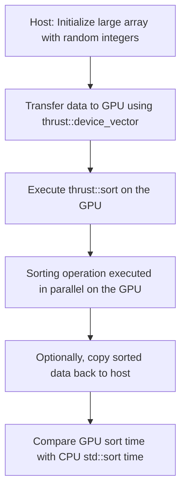

# Day 61: GPU-Accelerated Sorting

## Table of Contents
1. [Overview](#1-overview)
2. [Background: Thrust and GPU Sorting](#2-background-thrust-and-gpu-sorting)
3. [Implementation Details](#3-implementation-details)
   - [Data Initialization and Transfer](#data-initialization-and-transfer)
   - [GPU Sorting with Thrust](#gpu-sorting-with-thrust)
   - [CPU Sorting for Comparison](#cpu-sorting-for-comparison)
4. [Code Example](#4-code-example)
5. [Performance Considerations](#5-performance-considerations)
6. [Conceptual Diagram](#6-conceptual-diagram)
7. [Conclusion](#7-conclusion)
8. [Next Steps](#8-next-steps)

---

## 1. Overview

Sorting is a critical operation in many data-intensive applications. In this session, we leverage the massive parallelism of NVIDIA GPUs to accelerate the sorting of large datasets using the Thrust library. The goal is to demonstrate how GPU-based sorting can achieve significant speedups over traditional CPU methods, while also highlighting the challenges related to memory bandwidth and data access patterns.

---

## 2. Background: Thrust and GPU Sorting

- **Thrust Library:**  
  Thrust is a C++ template library for CUDA that provides high-level parallel algorithms similar to the STL. Its `thrust::sort` function is optimized for parallel execution on the GPU.

- **GPU Sorting Advantages:**  
  - **Massive Parallelism:** Sort millions of elements quickly.
  - **Ease of Use:** Minimal code changes compared to the STL.
  - **Direct Device Execution:** Operates on `thrust::device_vector`, keeping computations on the GPU and reducing data transfer overhead.

- **Memory Bandwidth:**  
  The performance of GPU sorting is heavily influenced by memory bandwidth. Efficient, coalesced memory accesses are crucial for achieving high throughput on large arrays.

---

## 3. Implementation Details

### Data Initialization and Transfer

- **Host Vector Initialization:**  
  A large array is created on the host and filled with random integers.

- **Device Transfer:**  
  The host data is transferred to a `thrust::device_vector`, allowing the GPU to process the data directly.

### GPU Sorting with Thrust

- **Sorting Operation:**  
  The `thrust::sort` function sorts the device vector in parallel, leveraging the GPU's architecture for fast sorting.

### CPU Sorting for Comparison

- **Benchmarking:**  
  The same dataset is sorted on the CPU using `std::sort` to compare performance with the GPU-accelerated sort.

---

## 4. Code Example

Below is a complete code example with detailed inline comments:

```cpp
// File: gpu_sort_example.cu

#include <thrust/device_vector.h>
#include <thrust/host_vector.h>
#include <thrust/sort.h>
#include <iostream>
#include <cstdlib>
#include <ctime>
#include <chrono>
#include <algorithm> // For std::sort

int main() {
    // Set the number of elements, e.g., 10 million elements
    int N = 10000000;
    
    // Seed the random number generator for reproducibility
    std::srand(static_cast<unsigned int>(std::time(0)));
    
    // Create and initialize a host vector with random integers
    thrust::host_vector<int> h_vec(N);
    for (int i = 0; i < N; i++) {
        // Random numbers between 0 and 99999
        h_vec[i] = std::rand() % 100000;
    }
    
    // Transfer the data from host to device by initializing a device vector
    thrust::device_vector<int> d_vec = h_vec;
    
    // Record the start time for GPU sort using high-resolution clock
    auto gpu_start = std::chrono::high_resolution_clock::now();
    
    // Execute the sort on the device; thrust::sort is optimized for parallel execution
    thrust::sort(d_vec.begin(), d_vec.end());
    
    // Record the end time after the sort completes
    auto gpu_end = std::chrono::high_resolution_clock::now();
    std::chrono::duration<double, std::milli> gpu_sort_time = gpu_end - gpu_start;
    
    // Optionally, copy the sorted data back to the host for verification
    thrust::host_vector<int> sorted_vec = d_vec;
    
    // Output a sample result and the GPU sort time
    std::cout << "GPU Sort Sample: First element = " << sorted_vec[0] << std::endl;
    std::cout << "GPU Sort Time: " << gpu_sort_time.count() << " ms" << std::endl;
    
    // For performance comparison, sort the same data on the CPU using std::sort
    auto cpu_start = std::chrono::high_resolution_clock::now();
    std::sort(h_vec.begin(), h_vec.end());
    auto cpu_end = std::chrono::high_resolution_clock::now();
    std::chrono::duration<double, std::milli> cpu_sort_time = cpu_end - cpu_start;
    std::cout << "CPU Sort Time: " << cpu_sort_time.count() << " ms" << std::endl;
    
    return 0;
}
```

**Explanation:**

- The host vector `h_vec` is initialized with 10 million random integers.
- Data is transferred to the GPU by initializing a `thrust::device_vector` `d_vec`.
- `thrust::sort` sorts the data in parallel on the GPU.
- Sorting times are measured using the `<chrono>` library.
- For comparison, `std::sort` is used to sort the host data, and the execution time is printed.

---

## 5. Performance Considerations

- **Memory Bandwidth Constraints:**  
  The speedup from GPU-accelerated sorting is often limited by memory bandwidth. Optimized data layouts and coalesced memory accesses are essential for high throughput.

- **Data Layout:**  
  Ensure that data is stored contiguously to maximize the efficiency of memory transactions.

- **Scalability:**  
  As the size of the dataset increases, the GPU’s parallelism becomes more advantageous—provided the memory system can sustain the data flow.

---

## 6. Conceptual Diagram

Below is a conceptual diagram illustrating the GPU-accelerated sorting process:



*Explanation:*  
The diagram outlines the steps: data initialization on the host, transfer to the GPU, execution of the sort via Thrust, and finally, comparison with CPU sorting times.

---

## 7. Conclusion

GPU-accelerated sorting using Thrust offers a significant performance advantage over CPU-based sorting, especially as dataset sizes grow. By leveraging parallel execution and optimizing memory access patterns, GPUs can achieve impressive speedups. However, achieving peak performance requires careful attention to memory bandwidth constraints and data layout optimization.

---

## 8. Next Steps

- **Data Distribution Analysis:**  
  Experiment with different types of data (nearly sorted, reverse sorted, random) to see how they affect GPU sorting performance.

- **Profiling:**  
  Use tools like Nsight Compute to analyze memory transactions during sorting and identify potential bottlenecks.

- **Hybrid Approaches:**  
  Explore combining Thrust’s sort with custom pre-processing or post-processing kernels for domain-specific optimizations.

- **Scaling:**  
  Investigate multi-GPU sorting techniques for even larger datasets.

- **Optimization:**  
  Fine-tune data layout and memory access patterns to fully utilize GPU memory bandwidth.

---

```
