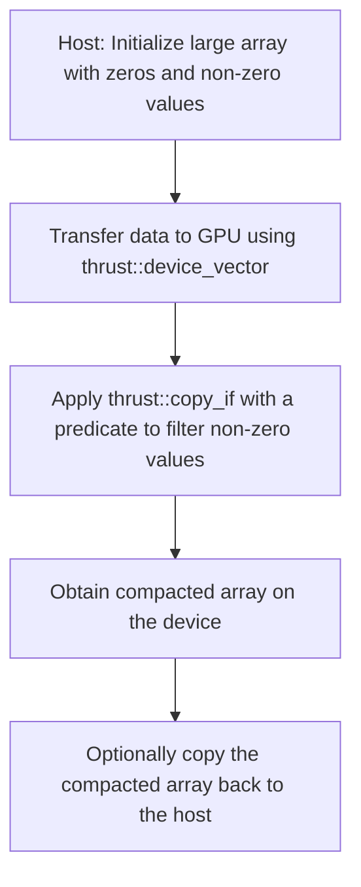

# Day 62: Stream Compaction & Parallel Patterns

In this lesson, we explore stream compaction—a fundamental parallel pattern for filtering and compressing data on the GPU. Stream compaction is used to remove unwanted elements (such as zeros) from an array, producing a compacted output. A key component of many stream compaction algorithms is the prefix sum (scan), which must be computed correctly to ensure that elements are placed at the correct output indices.

We will cover both a high-level approach using Thrust and a custom kernel implementation. We’ll discuss how proper prefix sum computation is critical to avoid errors in compaction, and we’ll detail common pitfalls and performance considerations.

---

## Table of Contents

1. [Overview](#1-overview)
2. [Introduction to Stream Compaction](#2-introduction-to-stream-compaction)
   - [What is Stream Compaction?](#what-is-stream-compaction)
   - [Applications and Importance](#applications-and-importance)
3. [Parallel Patterns for Stream Compaction](3#-parallel-patterns-for-stream-compaction)
   - [Prefix Sum as a Building Block](#prefix-sum-as-a-building-block)
   - [Using Thrust vs. Custom Kernels](#using-thrust-vs-custom-kernels)
4. [Implementation Approaches](4#-implementation-approaches)
   - [Thrust-Based Stream Compaction](#thrust-based-stream-compaction)
   - [Custom Stream Compaction Kernel](#custom-stream-compaction-kernel)
5. [Detailed Code Example: Thrust-Based Stream Compaction](5#-detailed-code-example-thrust-based-stream-compaction)
   - [Code and Explanation](#code-and-explanation)
6. [Detailed Code Example: Custom Stream Compaction Kernel](6#-detailed-code-example-custom-stream-compaction-kernel)
   - [Code and Explanation](#code-and-explanation-1)
7. [Performance Considerations and Common Pitfalls](7#-performance-considerations-and-common-pitfalls)
8. [Conceptual Diagrams](8#-conceptual-diagrams)
9. [References & Further Reading](9#-references--further-reading)
10. [Conclusion](10#-conclusion)
11. [Next Steps](11#-next-steps)

---

## 1. Overview

Stream compaction is a key technique in parallel computing that removes unwanted elements from an array (e.g., zeros) to create a compact output. This process often relies on computing a prefix sum to determine output indices for the valid elements. Correctness in the prefix sum stage is crucial—if it is computed incorrectly, the compaction will fail, leading to missing or misordered elements.

---

## 2. Introduction to Stream Compaction

### What is Stream Compaction?
Stream compaction is the process of filtering an array by removing elements that do not meet a specified criterion (e.g., non-zero values). The result is a smaller array containing only the desired elements.

### Applications and Importance
- **Data Filtering:** Removing invalid or unwanted data from sensor readings.
- **Sparse Data Processing:** Compacting sparse arrays to improve memory efficiency.
- **Preprocessing:** Preparing data for subsequent operations by discarding unnecessary elements.

---

## 3. Parallel Patterns for Stream Compaction

### Prefix Sum as a Building Block
A prefix sum (or scan) calculates the cumulative sum of an array. In stream compaction, it is used to compute the output index for each element that passes the filter predicate. The accuracy of this prefix sum is essential for correctly placing elements in the compacted array.

### Using Thrust vs. Custom Kernels
- **Thrust Approach:** High-level and easy-to-use; uses functions like `thrust::copy_if` to perform compaction.
- **Custom Kernel:** Provides fine-grained control and may offer performance benefits for specialized tasks, but requires careful implementation of scan and scatter operations.

---

## 4. Implementation Approaches

### Thrust-Based Stream Compaction
Leverages Thrust's high-level algorithms (e.g., `thrust::copy_if`) to filter elements based on a predicate. This approach abstracts many details and is ideal for rapid development.

### Custom Stream Compaction Kernel
A more hands-on approach involves:
- Computing a prefix sum over a predicate array (1 for valid, 0 for invalid).
- Using the result as a scatter index to place valid elements into the compacted output.
This method requires careful handling of boundary conditions and efficient scan implementations.

---

## 5. Detailed Code Example: Thrust-Based Stream Compaction

### Code and Explanation

```cpp
// File: thrust_stream_compaction.cu

#include <thrust/device_vector.h>
#include <thrust/host_vector.h>
#include <thrust/copy.h>
#include <thrust/remove.h>
#include <iostream>
#include <cstdlib>
#include <ctime>

// Predicate function to filter out zeros.
struct IsNonZero {
    __host__ __device__
    bool operator()(const int x) const {
        return x != 0;
    }
};

int main() {
    // Number of elements in the dataset.
    int N = 1000000; // 1 million elements

    // Seed the random number generator.
    std::srand(static_cast<unsigned int>(std::time(0)));

    // Initialize a host vector with random integers (some zeros).
    thrust::host_vector<int> h_vec(N);
    for (int i = 0; i < N; i++) {
        // Approximately 30% zeros, 70% random non-zero values.
        h_vec[i] = (std::rand() % 10 < 3) ? 0 : (std::rand() % 1000 + 1);
    }

    // Transfer the data to a device vector.
    thrust::device_vector<int> d_vec = h_vec;

    // Perform stream compaction: remove zeros using thrust::copy_if.
    thrust::device_vector<int> d_compact(N);
    // End iterator after compaction.
    auto new_end = thrust::copy_if(d_vec.begin(), d_vec.end(), d_compact.begin(), IsNonZero());

    // Calculate the new size.
    int new_size = new_end - d_compact.begin();
    std::cout << "Original size: " << N << ", Compacted size: " << new_size << std::endl;

    // Optionally copy the compacted data back to host for verification.
    thrust::host_vector<int> h_compact = d_compact;
    std::cout << "First 10 elements of compacted array:" << std::endl;
    for (int i = 0; i < 10 && i < new_size; i++) {
        std::cout << h_compact[i] << " ";
    }
    std::cout << std::endl;

    return 0;
}
```

**Explanation:**
- The host vector `h_vec` is initialized with random integers, where about 30% are zeros.
- Data is transferred to the GPU using a `thrust::device_vector`.
- `thrust::copy_if` is used with the `IsNonZero` predicate to copy non-zero elements to a new device vector `d_compact`.
- The new size of the compacted array is computed from the returned iterator.
- Results are optionally copied back to the host for verification.

---

## 6. Detailed Code Example: Custom Stream Compaction Kernel

### Code and Explanation

```cpp
// File: custom_stream_compaction.cu

#include <cuda_runtime.h>
#include <stdio.h>
#include <stdlib.h>

// Device function to compute the predicate: returns 1 if the element is non-zero, else 0.
__device__ int isNonZero(int x) {
    return (x != 0) ? 1 : 0;
}

// Custom kernel to perform stream compaction using a simple scan and scatter approach.
// This example assumes a single block reduction for simplicity.
__global__ void streamCompactionKernel(const int *input, int *output, int *flag, int *indices, int N) {
    int idx = blockIdx.x * blockDim.x + threadIdx.x;
    if (idx < N) {
        // Set flag to 1 if input is non-zero, else 0.
        flag[idx] = isNonZero(input[idx]);
    }
    __syncthreads();

    // Perform an exclusive scan (prefix sum) on the flag array.
    // For simplicity, using a naive serial scan per block.
    if (idx < N) {
        int sum = 0;
        for (int i = 0; i < idx; i++) {
            sum += flag[i];
        }
        indices[idx] = sum;
    }
    __syncthreads();

    // Scatter valid elements to the output array using the computed indices.
    if (idx < N && flag[idx] == 1) {
        output[indices[idx]] = input[idx];
    }
}

int main() {
    int N = 1000000; // 1 million elements.
    size_t size = N * sizeof(int);

    // Allocate host memory.
    int *h_input = (int*)malloc(size);
    // Initialize host array with random data (about 30% zeros).
    for (int i = 0; i < N; i++) {
        h_input[i] = (rand() % 10 < 3) ? 0 : (rand() % 1000 + 1);
    }

    // Allocate device memory.
    int *d_input, *d_output, *d_flag, *d_indices;
    cudaMalloc(&d_input, size);
    cudaMalloc(&d_output, size);
    cudaMalloc(&d_flag, size);
    cudaMalloc(&d_indices, size);
    cudaMemcpy(d_input, h_input, size, cudaMemcpyHostToDevice);

    // Launch kernel (using one block for simplicity; in practice, use multiple blocks and a parallel scan)
    int threadsPerBlock = 256;
    int blocksPerGrid = (N + threadsPerBlock - 1) / threadsPerBlock;
    streamCompactionKernel<<<blocksPerGrid, threadsPerBlock>>>(d_input, d_output, d_flag, d_indices, N);
    cudaDeviceSynchronize();

    // Copy compacted results back to host.
    int *h_output = (int*)malloc(size);
    cudaMemcpy(h_output, d_output, size, cudaMemcpyDeviceToHost);

    // (Optional) Count the number of non-zero elements by scanning the indices.
    int compactSize = 0;
    cudaMemcpy(&compactSize, d_indices + N - 1, sizeof(int), cudaMemcpyDeviceToHost);
    compactSize += h_input[N - 1] != 0 ? 1 : 0;
    printf("Custom Compaction: Original size = %d, Compacted size = %d\n", N, compactSize);

    // Cleanup.
    cudaFree(d_input); cudaFree(d_output); cudaFree(d_flag); cudaFree(d_indices);
    free(h_input); free(h_output);
    
    return 0;
}
```

**Explanation:**
- Each thread computes a flag indicating whether its corresponding element is non-zero.
- A naive exclusive scan is performed to compute output indices for valid elements (this example uses a serial scan for simplicity).
- Valid elements are scattered to the output array based on their computed indices.
- Finally, the compacted array is copied back to the host and its size is determined.

---

## 7. Performance Considerations and Common Pitfalls

- **Correctness of Prefix Sum:**  
  The accuracy of the exclusive scan (prefix sum) is critical. An incorrect scan leads to misplacement of elements, causing compaction to fail.
- **Scalability:**  
  The naive scan used in the custom kernel is not scalable for large datasets. In practice, a parallel scan should be used.
- **Memory Access Patterns:**  
  Ensuring coalesced memory accesses during both the scan and scatter phases is essential for high throughput.
- **Thrust vs. Custom:**  
  Thrust’s built-in algorithms are highly optimized; custom kernels may offer more control but require careful tuning.

---

## 8. Conceptual Diagrams

### Diagram 1: Thrust-Based Stream Compaction Flow



### Diagram 2: Custom Stream Compaction Flow

```mermaid
flowchart TD
    A[Host: Initialize large input array]
    B[Copy input to device memory]
    C[Kernel: Compute flag (1 for non-zero, 0 for zero)]
    D[Kernel: Compute exclusive scan on flag array to generate indices]
    E[Kernel: Scatter non-zero elements to output array using indices]
    F[Copy compacted output back to host]
    
    A --> B
    B --> C
    C --> D
    D --> E
    E --> F
```

---

## 9. References & Further Reading

- [Thrust Library Documentation](https://thrust.github.io/)
- [CUDA C Programming Guide – Parallel Patterns](https://docs.nvidia.com/cuda/cuda-c-programming-guide/index.html#parallel-patterns)
- [Efficient Parallel Scan and Stream Compaction on GPUs](https://developer.download.nvidia.com/assets/cuda/files/reduction.pdf)
- [NVIDIA Developer Blog – Stream Compaction Examples](https://developer.nvidia.com/blog/parallel-prefix-sum-scan-cuda/)

---

## 10. Conclusion

Stream compaction is an essential parallel pattern that improves efficiency by filtering out unwanted elements from large datasets. Whether using Thrust's high-level functions or implementing a custom compaction kernel, the correctness of the prefix sum operation is crucial for ensuring that elements are placed at the correct indices. This lesson not only demonstrates practical implementations of both approaches but also highlights performance considerations such as memory access patterns and scalability.

---

## 11. Next Steps

- **Optimize the Custom Scan:**  
  Replace the naive scan with a parallel scan algorithm to scale the custom compaction to larger datasets.
- **Profile and Tune:**  
  Use profiling tools like Nsight Compute to analyze the performance of both the Thrust and custom implementations.
- **Hybrid Approaches:**  
  Investigate combining Thrust with custom kernels for domain-specific compaction requirements.
- **Extend to Complex Data:**  
  Adapt the stream compaction techniques to handle multi-dimensional or structured data.
- **Integrate in Pipelines:**  
  Incorporate stream compaction into larger real-time data processing pipelines for improved efficiency.

```
