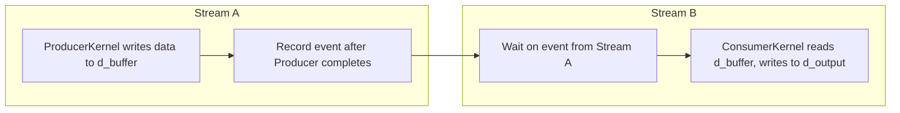

# Day 63: Concurrency Patterns (Producer-Consumer)

When designing efficient GPU pipelines, concurrency patterns such as **Producer-Consumer** enable overlapping data generation and consumption in real time. This lesson explores how to pipeline kernels so that one kernel (the producer) generates data while another kernel (the consumer) processes it. Careful synchronization is essential – missing or incorrect sync points can result in data loss or corruption.

---

## Table of Contents

1. [Overview](#1-overview)  
2. [Producer-Consumer Concurrency on the GPU](#2-producer-consumer-concurrency-on-the-gpu)  
3. [Implementation Approach](#3-implementation-approach)  
   - [a) Pipeline via Streams](#a-pipeline-via-streams)  
   - [b) Synchronization via Events](#b-synchronization-via-events)  
   - [c) Ensuring Data Integrity](#c-ensuring-data-integrity)  
4. [Detailed Code Example](#4-detailed-code-example)  
   - [Producer Kernel](#producer-kernel)  
   - [Consumer Kernel](#consumer-kernel)  
   - [Host Code for Launching and Synchronizing](#host-code-for-launching-and-synchronizing)  
5. [Performance Considerations & Common Pitfalls](#5-performance-considerations--common-pitfalls)  
6. [Conceptual Diagrams](#6-conceptual-diagrams)  
7. [References & Further Reading](#7-references--further-reading)  
8. [Conclusion](#8-conclusion)  
9. [Next Steps](#9-next-steps)

---

## 1. Overview

In a **Producer-Consumer** concurrency pattern, one entity (the producer) generates or updates data, and another entity (the consumer) reads or processes that data. By pipelining these tasks, you can overlap computation, reduce idle GPU time, and increase overall throughput. However, without proper synchronization, the consumer kernel might read stale or incomplete data, leading to incorrect results.

---

## 2. Producer-Consumer Concurrency on the GPU

- **Multi-Stream Execution**:  
  Leverage multiple CUDA streams so that the producer kernel and consumer kernel can run concurrently on the same GPU if resources allow. This can hide latency and minimize idle time.

- **Data Staging**:  
  Typically, data is written to a buffer by the producer kernel, then read from that buffer by the consumer kernel. Care must be taken to ensure that the consumer does not start reading before the producer finishes writing.

- **Synchronization & Events**:  
  Use CUDA events to signal when the producer kernel is done. The consumer kernel in a different stream can wait on that event before launching, ensuring data is valid.

---

## 3. Implementation Approach

### a) Pipeline via Streams

1. **Stream A**: Producer kernel populates or updates data in a device buffer.  
2. **Stream B**: Consumer kernel processes the results from Stream A’s buffer after receiving a synchronization signal that A’s work is complete.

### b) Synchronization via Events

- **Record an Event**: Producer kernel, upon completion, records an event in Stream A (`cudaEventRecord`).  
- **Wait on Event**: Consumer kernel in Stream B uses `cudaStreamWaitEvent` to wait until Stream A’s event is signaled.

### c) Ensuring Data Integrity

- **Memory Visibility**: Once the event is triggered, all writes by the producer are visible to the consumer’s kernel.  
- **Resource Management**: Buffers must be sized appropriately, and overhead from too many concurrency tasks must be balanced to avoid oversubscription.

---

## 4. Detailed Code Example

Below is a simplified example showing how to pipeline two kernels: one generating data (Producer) and the other consuming data (Consumer).

### Producer Kernel

```cpp
// producerKernel.cu
#include <cuda_runtime.h>

__global__ void producerKernel(float *buffer, int N) {
    int idx = blockIdx.x * blockDim.x + threadIdx.x;
    if (idx < N) {
        // Example: generate a sine wave or random values
        // For simplicity, just store idx as float
        buffer[idx] = (float)idx;
    }
}
```

**Explanation:**  
The `producerKernel` writes data into the buffer. Here, we simply store the index as a float. In real scenarios, you might generate random data, read sensor data, or produce computed results.

### Consumer Kernel

```cpp
// consumerKernel.cu
#include <cuda_runtime.h>

__global__ void consumerKernel(const float *buffer, float *output, int N) {
    int idx = blockIdx.x * blockDim.x + threadIdx.x;
    if (idx < N) {
        // Example: do some processing on the produced data
        // For demonstration, we'll multiply the input by 2
        output[idx] = buffer[idx] * 2.0f;
    }
}
```

**Explanation:**  
The `consumerKernel` reads from the same buffer that the `producerKernel` wrote to, performs a sample calculation (doubling each element), and stores the result in a separate `output` array.

### Host Code for Launching and Synchronizing

```cpp
// producerConsumerHost.cu
#include <cuda_runtime.h>
#include <iostream>
#include <cstdlib>

__global__ void producerKernel(float *buffer, int N);
__global__ void consumerKernel(const float *buffer, float *output, int N);

int main() {
    int N = 1 << 20; // 1 million elements
    size_t size = N * sizeof(float);

    // Allocate device memory
    float *d_buffer, *d_output;
    cudaMalloc(&d_buffer, size);
    cudaMalloc(&d_output, size);

    // Create two streams
    cudaStream_t streamA, streamB;
    cudaStreamCreate(&streamA);
    cudaStreamCreate(&streamB);

    // Create an event for synchronization
    cudaEvent_t event;
    cudaEventCreate(&event);

    // Launch producer kernel in streamA
    int threadsPerBlock = 256;
    int blocksPerGrid = (N + threadsPerBlock - 1) / threadsPerBlock;
    producerKernel<<<blocksPerGrid, threadsPerBlock, 0, streamA>>>(d_buffer, N);

    // Record the event in streamA after producerKernel completes
    cudaEventRecord(event, streamA);

    // Make streamB wait on the event before launching consumerKernel
    cudaStreamWaitEvent(streamB, event, 0);

    // Launch consumer kernel in streamB
    consumerKernel<<<blocksPerGrid, threadsPerBlock, 0, streamB>>>(d_buffer, d_output, N);

    // Synchronize streams
    cudaStreamSynchronize(streamA);
    cudaStreamSynchronize(streamB);

    // (Optional) Copy back data from d_output to host for verification
    float *h_output = (float*)malloc(size);
    cudaMemcpy(h_output, d_output, size, cudaMemcpyDeviceToHost);

    // Print a few sample results
    std::cout << "Sample output (first 10 elements):\n";
    for (int i = 0; i < 10; i++) {
        std::cout << h_output[i] << " ";
    }
    std::cout << std::endl;

    // Cleanup
    free(h_output);
    cudaFree(d_buffer);
    cudaFree(d_output);
    cudaStreamDestroy(streamA);
    cudaStreamDestroy(streamB);
    cudaEventDestroy(event);

    return 0;
}
```

**Explanation:**

1. **Memory Allocation:** Host allocates device buffers (`d_buffer` and `d_output`).  
2. **Producer Kernel Launch (Stream A):** `producerKernel` populates `d_buffer`.  
3. **Event Recording:** Once the producer kernel finishes, an event is recorded in `streamA`.  
4. **Consumer Wait on Event (Stream B):** `consumerKernel` waits for that event in `streamB` to ensure data is valid.  
5. **Consumer Kernel Execution:** The consumer reads from `d_buffer` and writes results to `d_output`.  
6. **Synchronization & Copy Back:** Streams are synchronized to confirm completion before copying results to the host for inspection.

---

## 5. Performance Considerations & Common Pitfalls

- **Missing or Incorrect Sync:**  
  If you fail to record or wait on the event properly, the consumer might launch too early, reading incomplete data from the producer.
- **Oversubscription:**  
  Using multiple streams does not guarantee better performance if the GPU becomes overtasked, leading to resource contention.
- **Data Buffering:**  
  Consider using ping-pong or double buffering if real-time streaming requires continuous production and consumption of data.
- **Synchronization Overhead:**  
  Minimizing unnecessary sync calls or global `cudaDeviceSynchronize()` is crucial for preserving concurrency benefits.

---

## 6. Conceptual Diagrams

### Diagram 1: Producer-Consumer Stream Flow



**Explanation:**  
- **Stream A** executes `producerKernel` and records an event upon completion.  
- **Stream B** waits on that event before launching `consumerKernel`.  
- The consumer reads valid data from `d_buffer` and writes to `d_output`.

### Diagram 2: Timeline Overlap

```
Time Axis → 
Stream A: [ProducerKernel]----[EventRecord]--------------------
Stream B:                  [WaitEvent]----[ConsumerKernel]----
```

**Explanation:**  
- The kernel in Stream A starts first. When it finishes, it triggers an event.  
- Stream B’s kernel waits on that event, ensuring it does not start too soon, thus preventing data corruption.

---

## 7. References & Further Reading

- [CUDA C Programming Guide – Streams & Concurrency](https://docs.nvidia.com/cuda/cuda-c-programming-guide/index.html#concurrent-kernel-execution)
- [NVIDIA Developer Blog – Concurrent Kernel Execution](https://developer.nvidia.com/blog/cuda-pro-tip-include-cuda-profiler-output-in-your-application/)  
- [Nsight Systems – Analyzing Multi-Stream Execution](https://docs.nvidia.com/nsight-systems/)

---

## 8. Conclusion

Implementing a producer-consumer concurrency pattern in CUDA allows multiple kernels to overlap their work, minimizing idle time and increasing pipeline throughput. By using separate streams, events for synchronization, and shared buffers for data exchange, you can create efficient real-time or batch processing pipelines. However, correct synchronization is vital to avoid data corruption or partial writes.

---

## 9. Next Steps

- **Extend to Multi-Stage Pipelines:** Add additional kernels (e.g., pre-processing, post-processing) for more complex pipelines.
- **Experiment with Double Buffering:** Use ping-pong buffers so the producer can write to one buffer while the consumer reads from another.
- **Profile:** Use Nsight Systems to confirm concurrency patterns, ensuring no unintended serialization occurs.
- **Scalability:** Investigate multi-GPU or cluster-based solutions if the pipeline requires even higher throughput for large-scale HPC tasks.

```
