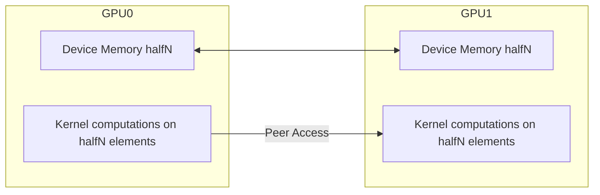

# Day 66: Peer-to-Peer (P2P) & Multi-GPU Scaling

**Peer-to-Peer (P2P) communication** allows multiple GPUs to directly access each other’s memory without staging data through the host. This can significantly reduce latency and overhead in multi-GPU setups, enabling higher throughput for large-scale HPC tasks. In this lesson, we discuss how to split data across multiple GPUs, synchronize kernels, and use P2P transfers to streamline inter-GPU communication. We also address common pitfalls, such as mismatched driver versions or incompatible GPU architectures that can prevent P2P from working correctly.

---

## Table of Contents
1. [Overview](#1-overview)  
2. [Why Multi-GPU Scaling?](#2-why-multi-gpu-scaling)  
3. [Peer-to-Peer Basics](#3-peer-to-peer-basics)  
   - [a) Checking P2P Support](#a-checking-p2p-support)  
   - [b) Enabling Peer Access](#b-enabling-peer-access)  
4. [Implementation Approach](#4-implementation-approach)  
   - [a) Splitting Data & Workload](#a-splitting-data--workload)  
   - [b) Synchronizing Kernels Across GPUs](#b-synchronizing-kernels-across-gpus)  
5. [Code Example](#5-code-example)  
   - [Explanation & Comments](#explanation--comments)  
6. [Performance Considerations & Common Pitfalls](#6-performance-considerations--common-pitfalls)  
7. [Conceptual Diagrams](#7-conceptual-diagrams)  
8. [References & Further Reading](#8-references--further-reading)  
9. [Conclusion](#9-conclusion)  
10. [Next Steps](#10-next-steps)

---

## 1. Overview
For computational problems that exceed the capacity or performance of a single GPU, **multi-GPU scaling** is essential. By splitting data across multiple devices and enabling **Peer-to-Peer (P2P) communication**, you can:
- Directly transfer data from one GPU’s memory to another, reducing host-based staging.
- Coordinate kernels across GPUs for parallel tasks, such as distributed reductions, partial computations, or pipeline stages.

However, **mismatched driver/device IDs** or older architectures may block P2P, and you must carefully manage data distribution and synchronization to avoid consistency errors.

---

## 2. Why Multi-GPU Scaling?
- **Larger Datasets**: Allows processing of data sets that exceed the memory of a single GPU.
- **Higher Throughput**: Multiple GPUs can compute in parallel, dividing the workload for faster results.
- **Specialized GPU Roles**: Some HPC tasks may split computations by domain decomposition or by function (e.g., GPU A does pre-processing, GPU B does core calculations).

---

## 3. Peer-to-Peer Basics

### a) Checking P2P Support
Use `cudaDeviceCanAccessPeer(int* canAccess, int device, int peerDevice)` to detect if two GPUs can enable direct P2P communication. Both the hardware (GPU architecture) and the PCIe topology must support peer access.

### b) Enabling Peer Access
If the devices support P2P, enable it by calling:
```cpp
cudaSetDevice(deviceID);
cudaDeviceEnablePeerAccess(peerDeviceID, 0);
```
This allows `cudaMemcpyPeer()` or direct memory reads across GPUs, bypassing host memory.

---

## 4. Implementation Approach

### a) Splitting Data & Workload
1. **Determine** how to divide the data. For example, each GPU might handle a subrange of a large array.
2. **Allocate** device memory on each GPU. If P2P is enabled, one GPU can read from or write to the memory of the other device as needed.
3. **Partition** the computation (e.g., partial reductions, partial matrix multiply segments, or domain decompositions).

### b) Synchronizing Kernels Across GPUs
- **Host-Orchestrated**: Launch kernels on GPU 0 and GPU 1 with separate streams, optionally use host-based waits if you need to coordinate results.
- **P2P Transfers**: After GPU 0 finishes partial results, it can directly transfer to GPU 1 if further processing is required, or vice versa.
- **Multiple Streams**: Each GPU can have multiple streams for concurrency; ensure that data dependencies are respected via events or host sync calls.

---

## 5. Code Example

Below is a basic demonstration of how to split a data array between two GPUs, enable P2P, and coordinate partial processing. This example uses a simple kernel that doubles each element, but in real scenarios you may do partial sums, matrix sub-block computations, etc.

```cpp
// File: multiGPU_p2p_example.cu
#include <cuda_runtime.h>
#include <stdio.h>

__global__ void doubleKernel(float *data, int N) {
    int idx = blockIdx.x * blockDim.x + threadIdx.x;
    if (idx < N) {
        data[idx] *= 2.0f;
    }
}

int main() {
    // For this example, we assume exactly 2 GPUs. Check device count properly in real code.
    int deviceCount;
    cudaGetDeviceCount(&deviceCount);
    if (deviceCount < 2) {
        printf("Requires at least two GPUs.\n");
        return 0;
    }

    // Check peer access between device 0 and device 1
    int canAccessPeer01, canAccessPeer10;
    cudaDeviceCanAccessPeer(&canAccessPeer01, 0, 1);
    cudaDeviceCanAccessPeer(&canAccessPeer10, 1, 0);

    // If both are true, we can enable P2P
    if (canAccessPeer01 && canAccessPeer10) {
        cudaSetDevice(0);
        cudaDeviceEnablePeerAccess(1, 0);
        cudaSetDevice(1);
        cudaDeviceEnablePeerAccess(0, 0);
        printf("Peer-to-Peer enabled between GPU 0 and GPU 1.\n");
    } else {
        printf("Peer-to-Peer NOT available between GPU 0 and 1.\n");
    }

    // Suppose we have a large array of size N = 2 million, split in half for each GPU
    int N = 2000000;
    int halfN = N / 2;

    // Allocate arrays on each GPU
    float *d_gpu0, *d_gpu1;
    size_t sizeHalf = halfN * sizeof(float);

    cudaSetDevice(0);
    cudaMalloc(&d_gpu0, sizeHalf);

    cudaSetDevice(1);
    cudaMalloc(&d_gpu1, sizeHalf);

    // In a real scenario, host would fill pinned buffers, then copy to each GPU's chunk
    // For demonstration, let's just do cudaMemset for brevity
    cudaSetDevice(0);
    cudaMemset(d_gpu0, 1, sizeHalf); // pretend these are floats set to ~1
    cudaSetDevice(1);
    cudaMemset(d_gpu1, 1, sizeHalf);

    // Launch kernels on each GPU to double the data
    int threadsPerBlock = 256;
    int blocksPerGrid = (halfN + threadsPerBlock - 1) / threadsPerBlock;

    // GPU 0
    cudaSetDevice(0);
    doubleKernel<<<blocksPerGrid, threadsPerBlock>>>(d_gpu0, halfN);

    // GPU 1
    cudaSetDevice(1);
    doubleKernel<<<blocksPerGrid, threadsPerBlock>>>(d_gpu1, halfN);

    // Wait for both GPUs to finish
    cudaDeviceSynchronize();
    cudaSetDevice(0);
    cudaDeviceSynchronize(); // or do them separately

    // If we want to gather results onto GPU 0:
    // Use cudaMemcpyPeer if P2P is enabled, else copy to host, then to GPU 0
    if (canAccessPeer01 && canAccessPeer10) {
        // Extend array on GPU 0 to gather data from GPU 1 for final processing
        // For brevity, we'll just do a partial demonstration
        float *d_combined;
        cudaSetDevice(0);
        cudaMalloc(&d_combined, N * sizeof(float));

        // Copy GPU1 data to [halfN..N-1] region in d_combined
        cudaMemcpyPeer(d_combined + halfN, 0, d_gpu1, 1, sizeHalf);
        
        // Also copy GPU0 data to [0..halfN-1]
        cudaMemcpy(d_combined, d_gpu0, sizeHalf, cudaMemcpyDeviceToDevice);

        // Optional: Additional kernel on GPU 0 combining the results
        // ...

        cudaFree(d_combined);
    }

    // Cleanup
    cudaSetDevice(0);
    cudaFree(d_gpu0);
    cudaSetDevice(1);
    cudaFree(d_gpu1);

    printf("Multi-GPU P2P example completed.\n");
    return 0;
}
```

### Explanation & Comments

1. **Device Checking**: The code ensures at least two GPUs are available.  
2. **Peer Checking & Enabling**: `cudaDeviceEnablePeerAccess()` is used if `cudaDeviceCanAccessPeer` returns true for both directions.  
3. **Data Splitting**: The total array (2 million floats) is conceptually split into two halves—one on each GPU.  
4. **Parallel Execution**: Each GPU processes its half concurrently.  
5. **Gathering Results**: If P2P is supported, we can directly copy GPU 1’s data into GPU 0’s memory without going through the host.

---

## 6. Performance Considerations & Common Pitfalls

- **Driver/Device Compatibility**: Mismatched driver versions or unsupported GPU architectures can block P2P. Always check.  
- **PCIe/NVLink Topology**: The interconnect influences P2P speed. NVLink typically offers faster GPU-GPU transfers than PCIe.  
- **Oversubscription**: Distributing tasks across multiple GPUs increases concurrency but can saturate system resources if not managed carefully.  
- **Synchronization**: Launching kernels on multiple GPUs requires the host to ensure concurrency is beneficial and data dependencies are respected.

---

## 7. Conceptual Diagrams

### Diagram 1: Multi-GPU Workflow with P2P



**Explanation**:
- Each GPU has half of the data.
- P2P allows direct access or direct transfers between GPU0 and GPU1 memory (arrows represent potential direct transfers).

### Diagram 2: Data Splitting and Merging

```mermaid
flowchart TD
    A[Host: split array => half1, half2]
    B[GPU0 <-> half1 (via pinned or standard memcopy)]
    C[GPU1 <-> half2 (via pinned or standard memcopy)]
    D[Each GPU processes its portion concurrently]
    E[If needed, gather or reduce across GPUs with cudaMemcpyPeer()]
    
    A --> B
    A --> C
    B --> D
    C --> D
    D --> E
```

**Explanation**:
- The host splits the data and sends each half to a different GPU.
- Both GPUs perform computations in parallel.
- If final consolidation is required, peer transfers or further host orchestration handle the merges.

---

## 8. References & Further Reading

- [Multi-GPU Programming Guide](https://docs.nvidia.com/deploy/multi-gpu.html)  
- [CUDA C Programming Guide – Peer-to-Peer and Device Management](https://docs.nvidia.com/cuda/cuda-c-programming-guide/index.html#peer-to-peer-memory-access)  
- [NVIDIA Developer Blog – Multi-GPU Patterns](https://developer.nvidia.com/blog/tag/multi-gpu/)  
- [Nsight Systems – Analyzing Multi-GPU Workloads](https://developer.nvidia.com/nsight-systems)

---

## 9. Conclusion

**Peer-to-Peer (P2P)** communication across multiple GPUs enables direct memory access and high-throughput data exchanges, crucial for large-scale or real-time HPC tasks. By splitting data across multiple devices, each GPU can work on a subset of the problem concurrently, significantly increasing overall capacity and performance. However, ensure that your hardware and driver versions support P2P, and manage synchronization between GPUs carefully. This approach provides a powerful mechanism for scaling up computations that exceed the resources of a single GPU.

---

## 10. Next Steps

1. **Device & Driver Checks**: Implement robust checks to confirm each GPU pair can enable peer access.  
2. **Profiling**: Use Nsight Systems or Nsight Compute to analyze concurrency patterns and measure GPU-GPU transfer bandwidth.  
3. **Topology Considerations**: Evaluate whether NVLink or PCIe is used for GPU interconnection, and adapt your concurrency approach accordingly.  
4. **Scalable HPC**: Extend from dual-GPU to multi-GPU setups (3, 4, or more) if the application demands even larger concurrency.  
5. **Domain Decomposition**: Investigate advanced partitioning schemes for partial computations on each GPU with frequent P2P merges or halo exchanges.

```
