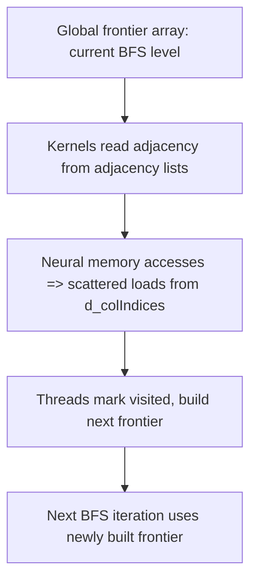

# Day 67: GPU-Accelerated Graph Analytics (Intro)

Modern GPUs can significantly speed up **graph analytics** tasks—like **Breadth-First Search (BFS)** or **PageRank**—by exploiting large-scale parallelism. However, graph structures often involve **irregular data access patterns** (random lookups in adjacency lists), which can limit performance due to poor memory coalescing. In this lesson, we introduce GPU-based graph analytics, focusing on BFS and PageRank fundamentals, discussing implementation details, and highlighting best practices to reduce memory bottlenecks.

---

## Table of Contents
1. [Overview](#1-overview)  
2. [Fundamentals of GPU Graph Analytics](#2-fundamentals-of-gpu-graph-analytics)  
   - [a) Irregular Data and Memory Patterns](#a-irregular-data-and-memory-patterns)  
   - [b) Key Algorithms: BFS and PageRank](#b-key-algorithms-bfs-and-pagerank)  
3. [Implementation Approach](#3-implementation-approach)  
   - [a) Adjacency List Representation](#a-adjacency-list-representation)  
   - [b) Parallel Exploration](#b-parallel-exploration)  
4. [Code Example: GPU-Based BFS](#4-code-example-gpu-based-bfs)  
   - [Explanation & Comments](#explanation--comments)  
5. [Performance Considerations & Common Pitfalls](#5-performance-considerations--common-pitfalls)  
6. [Conceptual Diagram](#6-conceptual-diagram)  
7. [References & Further Reading](#7-references--further-reading)  
8. [Conclusion](#8-conclusion)  
9. [Next Steps](#9-next-steps)

---

## 1. Overview
Graph analytics tasks—like BFS for shortest-path exploration or PageRank for node importance—often involve **random memory accesses** when traversing adjacency lists. This contrasts with typical HPC workloads that rely on regular, coalesced memory patterns. Despite these challenges, GPUs can still offer **significant speedups** for large-scale graphs through massive concurrency, provided you handle memory layout, load balancing, and synchronization carefully.

---

## 2. Fundamentals of GPU Graph Analytics

### a) Irregular Data and Memory Patterns
- **Adjacency Lists**: Graph edges are often stored in lists of neighbor indices, leading to scattered memory accesses.
- **Load Imbalance**: Some vertices may have high degrees (many neighbors), while others have few, causing uneven workload distribution among threads.
- **Caching Limitations**: Random accesses can reduce the effectiveness of the GPU’s hardware caches, underscoring the need for careful data layout.

### b) Key Algorithms: BFS and PageRank
- **Breadth-First Search (BFS)**: Explores a graph level by level, discovering nodes in waves from a source vertex.  
- **PageRank**: Iterative algorithm assigning importance scores to nodes based on incoming edges, requiring repeated graph traversals until convergence.

---

## 3. Implementation Approach

### a) Adjacency List Representation
- **Edge Lists**: A global array listing neighbors for each node, often accompanied by indexing arrays pointing to each node’s edge segment.
- **Host Preprocessing**: Often, a CPU-based step builds adjacency structures, normalizing or sorting edges for improved GPU access.

### b) Parallel Exploration
- **Frontier-Based BFS**: Each BFS frontier (the active nodes in the current level) can be processed in parallel. Threads write the next frontier.  
- **Iteration for PageRank**: The GPU repeatedly multiplies large vectors by an adjacency matrix or processes adjacency lists until ranks converge.

---

## 4. Code Example: GPU-Based BFS

Below is a highly simplified snippet illustrating BFS on an adjacency list, focusing on the kernel for processing a single level frontier. The adjacency data structures are assumed to be pre-built and stored in device arrays.

```cpp
// File: gpu_bfs_example.cu
#include <cuda_runtime.h>
#include <stdio.h>

__global__ void bfsKernel(const int* __restrict__ d_rowOffsets,
                          const int* __restrict__ d_colIndices,
                          const int  frontierSize,
                          const int* __restrict__ frontier,
                          int* __restrict__ nextFrontier,
                          int* __restrict__ visited,
                          int* __restrict__ nextCount) {
    int idx = blockIdx.x * blockDim.x + threadIdx.x;
    if (idx >= frontierSize) return;

    // frontier[i] holds a node in the current BFS level
    int node = frontier[idx];
    
    // Each node's adjacency range
    int rowStart = d_rowOffsets[node];
    int rowEnd   = d_rowOffsets[node + 1];

    // Explore neighbors
    for (int offset = rowStart; offset < rowEnd; offset++) {
        int neighbor = d_colIndices[offset];
        if (atomicCAS(&visited[neighbor], 0, 1) == 0) {
            // This neighbor was unvisited, mark it visited
            int pos = atomicAdd(nextCount, 1); // get position for writing
            nextFrontier[pos] = neighbor;
        }
    }
}

int main() {
    // Example adjacency data structures:
    // d_rowOffsets: array of offsets for each node's edge list
    // d_colIndices: array of neighbor indices
    // For brevity, assume these are already on the device

    // BFS frontier arrays
    int *d_frontier, *d_nextFrontier;
    int *d_visited, *d_nextCount;
    // Allocate and initialize (omitted for brevity)

    // Example kernel launch
    int threadsPerBlock = 256;
    int blocksPerGrid = (frontierSize + threadsPerBlock - 1) / threadsPerBlock;
    bfsKernel<<<blocksPerGrid, threadsPerBlock>>>(
        d_rowOffsets, d_colIndices, frontierSize,
        d_frontier, d_nextFrontier, d_visited, d_nextCount
    );
    cudaDeviceSynchronize();

    // Read nextCount to get the size of the new frontier, etc.
    // Additional BFS steps / iteration logic omitted
    // Cleanup and host code also omitted

    return 0;
}
```

### Explanation & Comments
1. **Adjacency Data**: `d_rowOffsets[node]` and `d_rowOffsets[node + 1]` define the range of neighbors in `d_colIndices`.  
2. **Atomic Operations**: Used to mark `visited` and to compute positions in `nextFrontier`. A more advanced approach may reduce atomic overhead with advanced parallel patterns.  
3. **Frontier**: Each BFS level’s active nodes are stored in `frontier`. The next BFS level is built in `nextFrontier`.

---

## 5. Performance Considerations & Common Pitfalls

- **Random Access**  
  Graph adjacency leads to scattered memory reads in `d_colIndices`. Minimizing fragmentation or sorting edges by node ID can help slightly.  
- **Warp Divergence**  
  BFS expansions can create load imbalance. Some nodes might have many neighbors, while others have few, causing varied loop lengths among threads.  
- **Atomic Overhead**  
  BFS typically requires atomic operations (or alternate structures) to mark visited nodes or accumulate new frontiers, potentially limiting performance.  
- **Excessive Memory Usage**  
  Large graphs with adjacency lists can exceed GPU memory. Consider chunking or multi-GPU partitioning for massive graphs.

---

## 6. Conceptual Diagram



*Explanation:*  
- The BFS iteration begins with an active frontier.  
- Each thread reads adjacency lists and uses atomic ops to update a `visited` array plus build the next frontier.  
- The process repeats until no new nodes are discovered.

---

## 7. References & Further Reading

- [NVIDIA Developer Blog – Graph Analytics](https://developer.nvidia.com/blog/tag/graph-analytics/)  
- [GUNROCK: GPU Graph Library](https://gunrock.github.io/)  
- [“Programming Massively Parallel Processors” – David Kirk, Wen-mei Hwu](https://www.elsevier.com/books/programming-massively-parallel-processors/kirk/978-0-12-811986-0)  
- [Nsight Compute for analyzing BFS kernels](https://developer.nvidia.com/nsight-compute)

---

## 8. Conclusion

GPU-accelerated graph analytics can significantly speed up BFS, PageRank, and other algorithms by exploiting concurrent expansions or iterative updates. However, the **random memory access** characteristic of adjacency list traversals imposes challenges, such as reduced coalescing and potential warp divergence. By carefully structuring data, load balancing the frontier expansions, and using efficient atomic or parallel scan operations, you can mitigate many of these drawbacks and harness the parallel performance of GPUs for large graph datasets.

---

## 9. Next Steps

1. **Experiment with Data Layout**: Try reordering node IDs or grouping edges to reduce random accesses.  
2. **Explore Additional Algorithms**: Adapt this BFS approach or data structures to implement PageRank or SSSP (single-source shortest path).  
3. **Profile**: Use Nsight Systems or Nsight Compute to confirm where kernel stalls occur (e.g., memory or atomic overhead).  
4. **Gunrock Library**: Investigate specialized GPU graph analytics frameworks (like Gunrock) for advanced optimizations and more complex graph algorithms.  
5. **Scale**: If single GPU memory is insufficient, consider multi-GPU partitioning or cluster-based GPU solutions for truly massive graphs.

```
