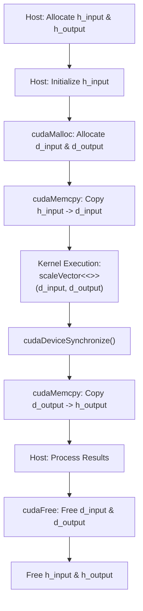
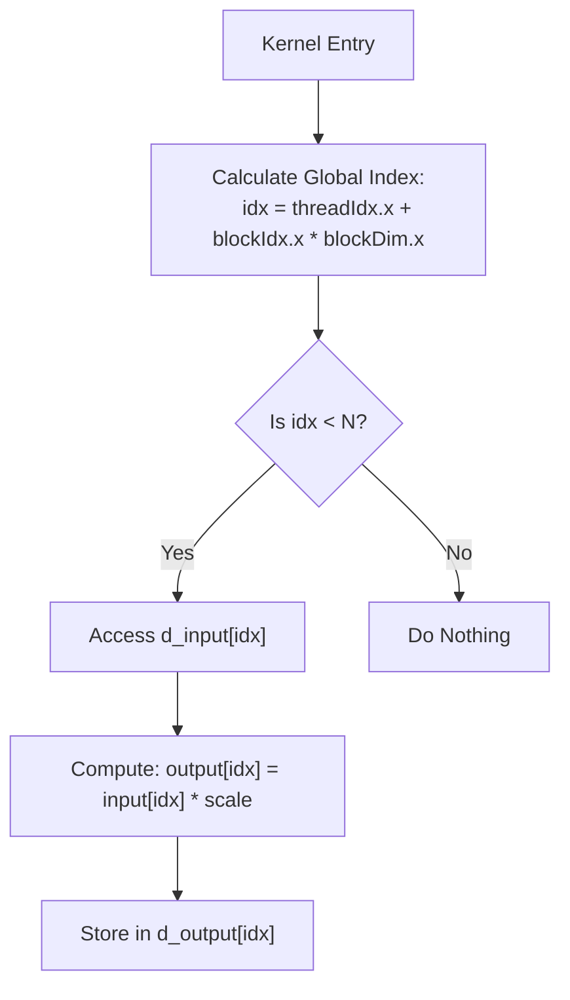

# Day 07: Memory Model (Global Memory Basics)

In CUDA programming, memory management is as crucial as parallel computation. On Day 07, we explain the **Global Memory Model**—the primary memory space on the GPU that all threads can access. In this comprehensive lesson, you will learn how to transfer data to global memory, execute a simple computation using that data, and then transfer the results back to the host. We will also discuss common debugging pitfalls, such as mismatched data sizes and neglecting to free GPU memory, and provide best practices from the CUDA C Programming Guide's “Global Memory Access” section.

---

## Table of Contents
1. [Overview](#1-overview)  
2. [Global Memory in CUDA](#2-global-memory-in-cuda)  
3. [Data Transfer Between Host and Device](#3-data-transfer-between-host-and-device)  
4. [Practical Exercise: A Simple Computation Using Global Memory](#4-practical-exercise-a-simple-computation-using-global-memory)  
5. [Conceptual Diagrams](#5-conceptual-diagrams)  
6. [Common Pitfalls](#6-common-pitfalls)  
7. [Debugging and Synchronization Considerations](#7-debugging-and-synchronization-considerations)  
8. [References & Further Reading](#8-references--further-reading)  
9. [Conclusion](#9-conclusion)  

---

## 1. Overview
Global memory is the largest memory space available on a CUDA-enabled GPU. Although it has higher latency compared to on-chip memory (like shared memory), its large capacity makes it indispensable for storing and processing large datasets. In today’s lesson, you will:
- Understand the properties and challenges of global memory.
- Learn the correct sequence for transferring data between the host (CPU) and device (GPU) global memory.
- Execute a simple computation (vector scaling) using global memory.
- Retrieve the computed results back to the host.
- Explore common pitfalls and debugging strategies to ensure robust memory management.

---

## 2. Global Memory in CUDA
Global memory is accessible by all threads across all blocks and persists until explicitly freed. Its key characteristics include:

- **Large Capacity:** Suitable for storing large data arrays.
- **High Latency:** Access times are slower compared to registers or shared memory; thus, optimizing access patterns (e.g., memory coalescing) is critical.
- **Persistence:** Data remains in global memory until freed, making it ideal for multi-kernel applications.
- **Accessibility:** Both the host and the device can access global memory, enabling data transfers through CUDA API calls.

### Best Practices for Global Memory Access
- **Coalesced Access:** Arrange data so that consecutive threads access contiguous memory locations.
- **Minimize Data Transfers:** Overlap computation with data transfers when possible to hide latency.
- **Align Memory:** Use proper data alignment to ensure efficient memory access.

---

## 3. Data Transfer Between Host and Device
Before performing computations on the GPU, data must be transferred from the host’s memory to the device’s global memory. Similarly, results computed on the GPU need to be transferred back to the host.

### Key CUDA API Functions
- **`cudaMalloc()`**  
  Allocates memory on the device.
  
- **`cudaMemcpy()`**  
  Transfers data between host and device. It supports various directions, such as HostToDevice and DeviceToHost.
  
- **`cudaFree()`**  
  Frees memory allocated on the device.

### Example Code Snippet for Data Transfer
```cpp
float *d_A;
size_t size = N * sizeof(float);
cudaMalloc(&d_A, size);                         // Allocate device memory
cudaMemcpy(d_A, h_A, size, cudaMemcpyHostToDevice); // Copy data from host to device
// ... kernel execution ...
cudaMemcpy(h_A, d_A, size, cudaMemcpyDeviceToHost); // Copy results back to host
cudaFree(d_A);                                   // Free device memory
```
Always ensure that the size used in `cudaMalloc()` and `cudaMemcpy()` is correctly calculated to match the data structure.

---

## 4. Practical Exercise: A Simple Computation Using Global Memory
In this exercise, you will implement a vector scaling operation. The steps include:

1. **Memory Allocation:** Allocate host and device memory.
2. **Data Transfer to Global Memory:** Copy data from the host to the GPU.
3. **Kernel Execution:** Launch a kernel to scale each vector element by a constant factor.
4. **Data Transfer Back to Host:** Copy the computed results back to the host.
5. **Memory Cleanup:** Free the allocated device memory to avoid leaks.

### Code Example: Vector Scaling
```cpp
#include <cuda_runtime.h>
#include <stdio.h>

// Kernel: Multiply each element by a scale factor
__global__ void scaleVector(const float *input, float *output, float scale, int N) {
    int idx = threadIdx.x + blockIdx.x * blockDim.x;
    if (idx < N) {
        output[idx] = input[idx] * scale;
    }
}

int main() {
    int N = 1024;                   // Number of elements in the vector
    size_t size = N * sizeof(float);  // Total size in bytes

    // Allocate host memory
    float *h_input = (float*)malloc(size);
    float *h_output = (float*)malloc(size);

    // Initialize the host array
    for (int i = 0; i < N; i++) {
        h_input[i] = i * 1.0f;
    }

    // Allocate device (global) memory
    float *d_input, *d_output;
    cudaMalloc(&d_input, size);
    cudaMalloc(&d_output, size);

    // Transfer input data from host to device
    cudaMemcpy(d_input, h_input, size, cudaMemcpyHostToDevice);

    // Configure kernel execution parameters
    int threadsPerBlock = 256;
    int blocksPerGrid = (N + threadsPerBlock - 1) / threadsPerBlock;

    // Launch the kernel to scale the vector by 2.0
    scaleVector<<<blocksPerGrid, threadsPerBlock>>>(d_input, d_output, 2.0f, N);

    // Synchronize to ensure kernel completion
    cudaDeviceSynchronize();

    // Transfer the result back to host
    cudaMemcpy(h_output, d_output, size, cudaMemcpyDeviceToHost);

    // Verify and print the first 10 results
    for (int i = 0; i < 10; i++) {
        printf("h_output[%d] = %f\n", i, h_output[i]);
    }

    // Free device memory
    cudaFree(d_input);
    cudaFree(d_output);

    // Free host memory
    free(h_input);
    free(h_output);

    return 0;
}
```

*Explanation:*
- **Memory Allocation:** Host arrays `h_input` and `h_output` are allocated along with device arrays `d_input` and `d_output`.
- **Data Transfer:** The input vector is copied to the GPU’s global memory.
- **Kernel Execution:** The `scaleVector` kernel scales each element by 2.0.
- **Result Retrieval:** Results are copied back to the host and printed.
- **Cleanup:** Device memory is freed to prevent memory leaks.

---

## 5. Conceptual Diagrams

### Diagram 1: Data Transfer and Kernel Execution Flow

*Explanation:*  
- The host initializes and allocates memory, then transfers data to the GPU.
- The kernel processes the data in global memory.
- Results are transferred back, and memory is freed.

### Diagram 2: Global Memory Access in a Kernel

*Explanation:*  
- Each thread calculates its unique global index.
- If the index is within bounds, it accesses global memory, performs the scaling operation, and writes back the result.

---

## 6. Common Pitfalls
When working with global memory, be mindful of these issues:

1. **Mismatched Data Sizes:**  
   - Always ensure that the size used in `cudaMalloc()` and `cudaMemcpy()` matches the actual data size.
   - **Tip:** Calculate size as `N * sizeof(data_type)`.

2. **Forgetting to Free GPU Memory:**  
   - Every `cudaMalloc()` must be paired with a `cudaFree()`.
   - **Tip:** Use error checking and memory management tools to track allocations.

3. **Inefficient Memory Access Patterns:**  
   - Non-coalesced accesses can drastically reduce performance.
   - **Tip:** Organize data to allow consecutive threads to access contiguous memory locations.

4. **Ignoring Error Checking:**  
   - Failing to check the return values of CUDA API calls may hide bugs.
   - **Tip:** Always use `cudaGetLastError()` and check the return values of memory functions.

---

## 7. Debugging and Synchronization Considerations
- **Error Checking:**  
  After every CUDA API call (e.g., `cudaMalloc()`, `cudaMemcpy()`), check for errors:
  ```cpp
  cudaError_t err = cudaGetLastError();
  if (err != cudaSuccess) {
      printf("CUDA Error: %s\n", cudaGetErrorString(err));
  }
  ```

- **Device Synchronization:**  
  Use `cudaDeviceSynchronize()` to ensure the GPU completes all tasks before moving on:
  ```cpp
  cudaDeviceSynchronize();
  ```

- **Intra-Kernel Synchronization:**  
  When multiple threads in a block share data, use `__syncthreads()` to avoid race conditions.

- **Memory Leak Prevention:**  
  Verify that every allocated device memory segment is freed using `cudaFree()`.

---

## 8. References & Further Reading
1. **[CUDA C Programming Guide](https://docs.nvidia.com/cuda/cuda-c-programming-guide/index.html)**  
   Comprehensive documentation on CUDA programming, including detailed sections on global memory management.
2. **“Global Memory Access” Section in the CUDA C Programming Guide**  
   Provides guidelines and best practices for efficient global memory access.
3. **"Programming Massively Parallel Processors: A Hands-on Approach" by David B. Kirk and Wen-mei W. Hwu**  
   A detailed resource on GPU architectures and programming techniques.

---

## 9. Conclusion
In today’s lesson, you explored the fundamentals of the global memory model in CUDA. You learned:
- The characteristics and challenges of using global memory.
- How to transfer data between the host and device.
- How to run a simple vector scaling computation on the GPU.
- The importance of proper memory management, including error checking and resource deallocation.
- Common pitfalls that can affect performance and correctness.

Mastering global memory is essential for building efficient CUDA applications, as it forms the backbone for data storage and transfer in GPU programming.

---
