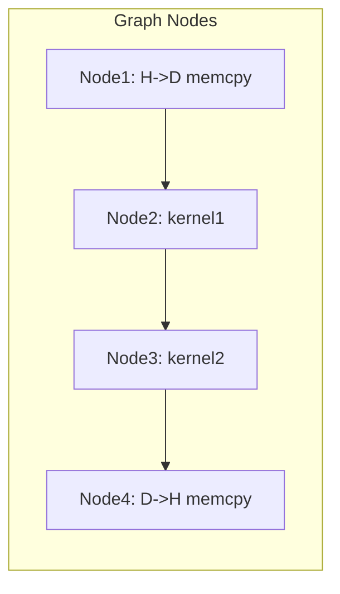

# Day 72: CUDA Graphs – Complex Workflows

When orchestrating **many dependent kernels and data transfers**, **CUDA Graphs** can significantly reduce launch overhead by consolidating operations into a single, replayable graph structure. This allows you to specify a sequence of kernels, memory copies, and host tasks—ensuring correct dependencies while minimizing runtime overhead. However, forgetting to finalize and launch the graph properly can result in incomplete runs, leading to partial computations or missing data transfers.

---

## Table of Contents
1. [Overview](#1-overview)  
2. [What Are CUDA Graphs?](#2-what-are-cuda-graphs)  
3. [Advantages of Using Graphs in Complex Workflows](#3-advantages-of-using-graphs-in-complex-workflows)  
4. [Implementation Steps](#4-implementation-steps)  
   - [a) Building a Graph](#a-building-a-graph)  
   - [b) Instantiating and Launching](#b-instantiating-and-launching)  
   - [c) Handling Dependencies](#c-handling-dependencies)  
5. [Code Example: Multi-Kernel Graph with Memory Copies](#5-code-example-multi-kernel-graph-with-memory-copies)  
   - [Explanation & Comments](#explanation--comments)  
6. [Common Pitfalls](#6-common-pitfalls)  
7. [Conceptual Diagram](#7-conceptual-diagram)  
8. [References & Further Reading](#8-references--further-reading)  
9. [Conclusion](#9-conclusion)  
10. [Next Steps](#10-next-steps)

---

## 1. Overview

**CUDA Graphs** let you record and replay a series of operations—kernels, memory copies, host tasks, etc.—in a single graph structure. Once built, the graph can be **instantiated** and **launched** multiple times with minimal overhead, especially beneficial for repeated or iterative workflows. This is particularly powerful for **complex HPC pipelines** or real-time applications that have consistent operation patterns across many iterations.

---

## 2. What Are CUDA Graphs?

- **Graph Representation**: A CUDA graph is a DAG (Directed Acyclic Graph) of **nodes**, each node representing a kernel, memory transfer, or host function call.  
- **Dependencies**: Edges define execution order—e.g., Node B only starts after Node A completes.  
- **Captured Execution**: You can either build a graph manually via the API (node creation, dependencies) or capture existing stream operations in “graph capture” mode.

---

## 3. Advantages of Using Graphs in Complex Workflows

1. **Lower Launch Overhead**: Instead of multiple `cudaLaunchKernel` or `cudaMemcpyAsync` calls, one graph launch is enough once the graph is set up.  
2. **Deterministic Dependencies**: The graph clearly encodes the flow, ensuring correct order without repeated event synchronization.  
3. **Replay Efficiency**: For iterative tasks, you can replay the same graph many times if the data flow pattern is identical, reducing overhead further.

---

## 4. Implementation Steps

### a) Building a Graph
1. **Create a Graph Object**: `cudaGraphCreate()` to start building a new graph.  
2. **Add Nodes**: For each kernel, memory copy, or host function, create a node (`cudaGraphAddKernelNode`, `cudaGraphAddMemcpyNode`, etc.).  
3. **Set Dependencies**: Indicate which nodes must complete before the next node.

### b) Instantiating and Launching
1. **Instantiate the Graph**: `cudaGraphInstantiate()` to create an “executable” form from the built graph.  
2. **Launch**: `cudaGraphLaunch()` in a stream, then optionally `cudaStreamSynchronize()` or check completion events.

### c) Handling Dependencies
- **Order**: If Node B depends on data from Node A, make Node B’s dependency pointer to Node A.  
- **Batching**: If multiple kernels run concurrently, ensure the graph does not incorrectly impose a strict order unless required.

---

## 5. Code Example: Multi-Kernel Graph with Memory Copies

Below is a snippet demonstrating how to build a simple CUDA graph with two kernels and one memory copy, capturing a data flow of `Host->Device->Kernel1->Kernel2->Device->Host`.

```cpp
// File: cuda_graph_complex_workflow.cu
#include <cuda_runtime.h>
#include <stdio.h>

__global__ void kernel1(float* data, int N) {
    int idx = blockIdx.x * blockDim.x + threadIdx.x;
    if (idx < N) {
        data[idx] = data[idx] * 2.0f;
    }
}

__global__ void kernel2(float* data, int N) {
    int idx = blockIdx.x * blockDim.x + threadIdx.x;
    if (idx < N) {
        data[idx] += 100.0f;
    }
}

int main() {
    int N = 1024;
    size_t size = N * sizeof(float);

    // Host and device memory
    float* h_data;
    cudaMallocHost((void**)&h_data, size);
    float* d_data;
    cudaMalloc(&d_data, size);

    // Initialize host data
    for(int i=0; i<N; i++) {
        h_data[i] = (float)i;
    }

    // Create an empty graph
    cudaGraph_t graph;
    cudaGraphCreate(&graph, 0);

    // Node 1: memcpy host->device
    cudaMemcpy3DParms copyParams = {0};
    copyParams.srcPtr = make_cudaPitchedPtr((void*)h_data, size, N, 1);
    copyParams.dstPtr = make_cudaPitchedPtr((void*)d_data, size, N, 1);
    copyParams.extent = make_cudaExtent(size, 1, 1);
    copyParams.kind   = cudaMemcpyHostToDevice;

    cudaGraphNode_t h2dNode;
    cudaGraphAddMemcpyNode(&h2dNode, graph, nullptr, 0, &copyParams);

    // Node 2: kernel1
    cudaGraphNode_t k1Node;
    cudaKernelNodeParams k1Params = {0};
    dim3 block(256), grid((N+255)/256);
    void* k1Args[2] = {(void*)&d_data, (void*)&N};
    k1Params.func = (void*)kernel1;
    k1Params.gridDim = grid;
    k1Params.blockDim = block;
    k1Params.sharedMemBytes = 0;
    k1Params.kernelParams = k1Args;
    cudaGraphAddKernelNode(&k1Node, graph, &h2dNode, 1, &k1Params);

    // Node 3: kernel2
    cudaGraphNode_t k2Node;
    cudaKernelNodeParams k2Params = k1Params; // copy base config
    k2Params.func = (void*)kernel2;  // different kernel
    cudaGraphAddKernelNode(&k2Node, graph, &k1Node, 1, &k2Params);

    // Node 4: device->host memcpy (optional)
    cudaGraphNode_t d2hNode;
    cudaMemcpy3DParms copyParamsBack = {0};
    copyParamsBack.srcPtr = make_cudaPitchedPtr((void*)d_data, size, N, 1);
    copyParamsBack.dstPtr = make_cudaPitchedPtr((void*)h_data, size, N, 1);
    copyParamsBack.extent = make_cudaExtent(size, 1, 1);
    copyParamsBack.kind   = cudaMemcpyDeviceToHost;
    cudaGraphAddMemcpyNode(&d2hNode, graph, &k2Node, 1, &copyParamsBack);

    // Instantiate the graph
    cudaGraphExec_t graphExec;
    cudaGraphInstantiate(&graphExec, graph, NULL, NULL, 0);

    // Launch the graph
    cudaGraphLaunch(graphExec, 0);
    cudaDeviceSynchronize();

    // Print sample result
    printf("Sample h_data[0] after graph run = %f\n", h_data[0]);

    // Cleanup
    cudaGraphExecDestroy(graphExec);
    cudaGraphDestroy(graph);
    cudaFreeHost(h_data);
    cudaFree(d_data);
    return 0;
}
```

### Explanation & Comments
1. **Graph Creation**: `cudaGraphCreate`.  
2. **Nodes**: We add four nodes: 
   - H→D copy, 
   - kernel1, 
   - kernel2, 
   - D→H copy (optional).  
3. **Dependencies**: `kernel1` depends on the H→D node; `kernel2` depends on kernel1; the final D→H copy depends on kernel2.  
4. **Instantiation & Launch**: Once built, `cudaGraphInstantiate` compiles it into an executable graph, then `cudaGraphLaunch`.

---

## 6. Common Pitfalls

- **Missing Finalization**: Forgetting to `cudaGraphLaunch()` or incorrectly skipping `cudaDeviceSynchronize()` can yield incomplete results.  
- **Misordered Dependencies**: If a kernel node is not listed as dependent on the correct memcpy node, it might start early and read partial data.  
- **One-Time Setup**: Building the graph can be more overhead than normal kernel launches for a single pass. The real benefit appears if you replay or iterate the same workflow multiple times.

---

## 7. Conceptual Diagram



**Explanation**  
- The graph nodes are arranged in a DAG.  
- The final copy from device to host runs only after `kernel2` finishes.

---

## 8. References & Further Reading

- [CUDA C Programming Guide – Graph Best Practices](https://docs.nvidia.com/cuda/cuda-c-programming-guide/index.html#graphs)  
- [Nsight Systems – Visualizing CUDA Graph Timelines](https://docs.nvidia.com/nsight-systems/)  
- [NVIDIA Developer Blog – CUDA Graph Examples](https://developer.nvidia.com/blog/tag/cuda-graphs/)

---

## 9. Conclusion

**Day 72** highlights how **CUDA Graphs** transform multiple dependent operations—like kernels and memory copies—into a single entity, minimizing overhead and providing a structured approach to **complex HPC workflows**. By carefully setting node dependencies, you ensure correct data flow. However, failing to finalize or skipping certain nodes can cause incomplete runs. Tools like Nsight Systems help validate concurrency and confirm that the graph-based pipeline is fully executed.

---

## 10. Next Steps

1. **Experiment**: Build a small graph for repeated HPC steps (e.g., repeated matrix multiplies) and measure speedups over naive kernel launches.  
2. **Debug**: If results appear incomplete, confirm you are launching (`cudaGraphLaunch`) and synchronizing (`cudaDeviceSynchronize` or using events) properly.  
3. **Tune**: For large workflows, see if splitting into subgraphs or reusing certain nodes can reduce overhead further.  
4. **Profile**: Use Nsight Systems to see the timeline of graph node executions and confirm concurrency.

Enjoy designing and executing **complex GPU workflows** as a single, optimized graph, simplifying repeated HPC pipelines while boosting performance through minimized launch overhead!
```
